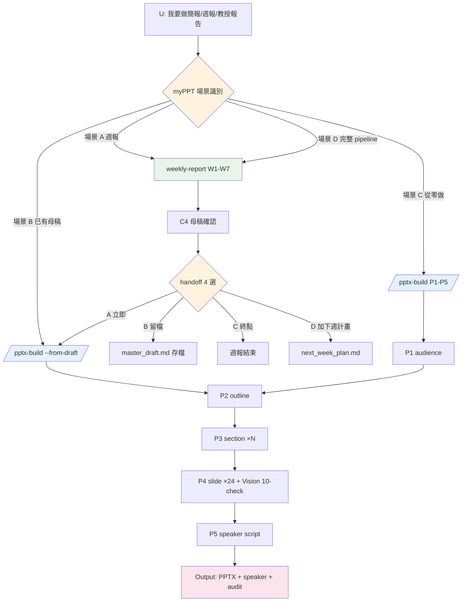
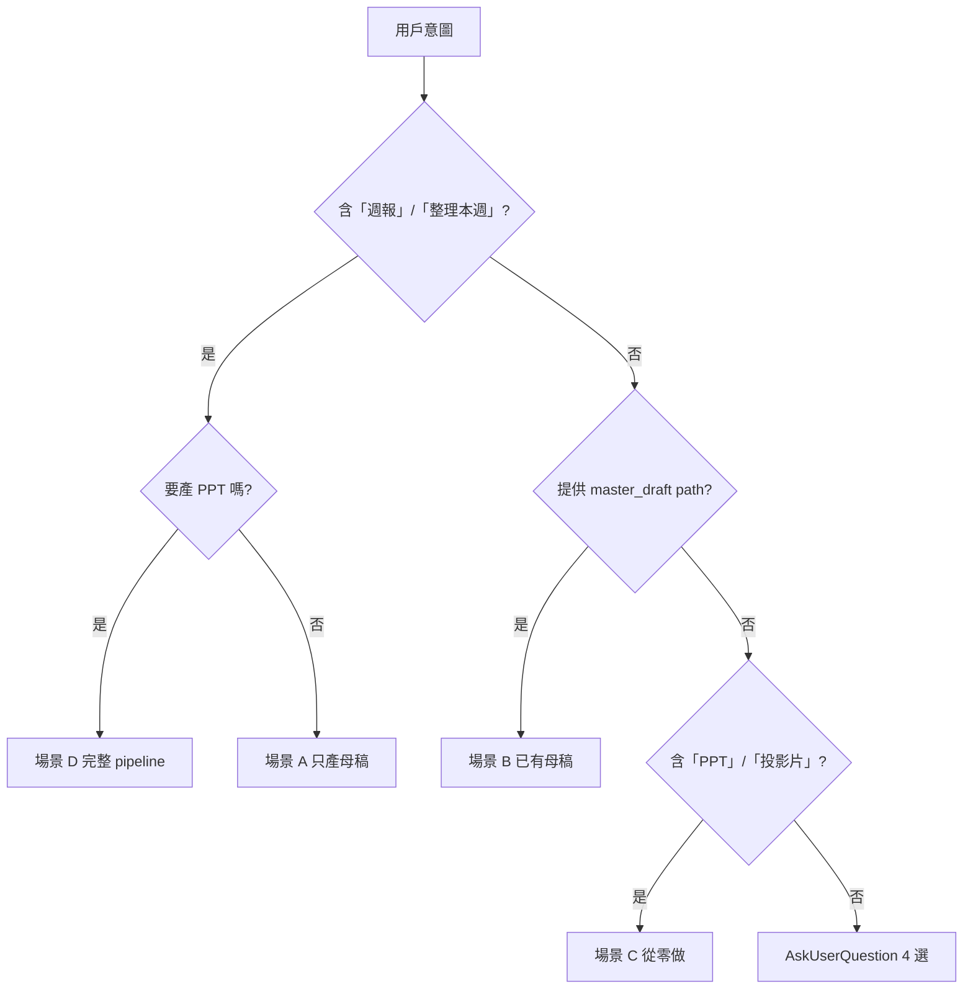
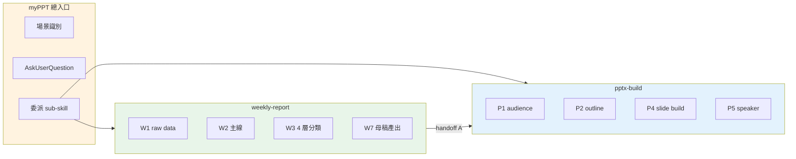

# myPPT workflow diagrams

## 整體 pipeline（三 skill 互動）

## 場景識別決策樹

## 三 skill 責任分工

## 委派指令對應

| 場景 | 委派 |
|------|------|
| A 週報 | 觸發 `weekly-report` skill |
| B 已有母稿 | 執行 `/pptx-build --from-draft <path>` |
| C 從零做 | 觸發 `pptx-build` skill |
| D 完整 | `weekly-report` → C4 handoff A 自動接 `/pptx-build --from-draft` |
