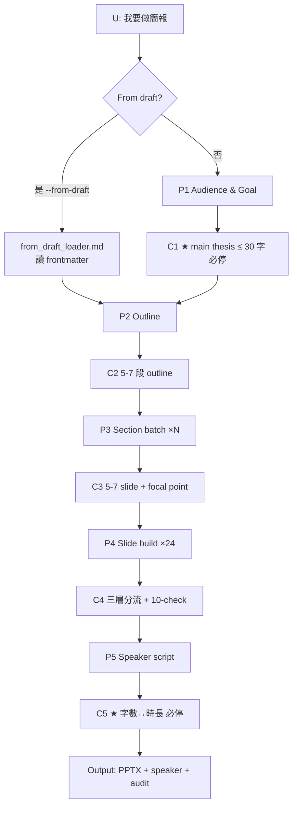
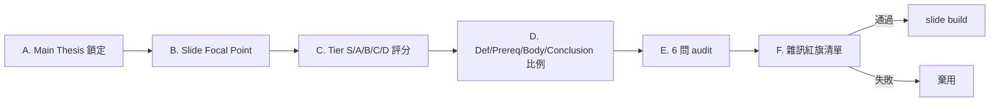
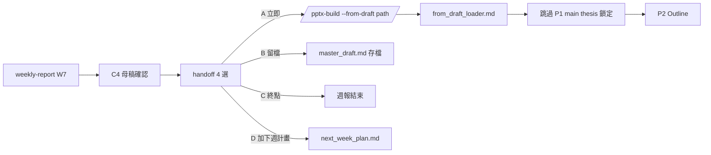

# pptx-build workflow diagrams

## 整體流程（5 階段 + checkpoint）



## §20 6 階段過濾



## 6 模板識別流程

```
觸發 keyword 偵測
   ├─ 「修補/修復/fix」 → improvement_report
   ├─ 「A vs B/對照」 → comparison_report
   ├─ 「月會/PI/KPI」 → executive_summary
   ├─ 「結果/實驗」 → data_showcase
   ├─ 「教學/解釋」 → concept_walkthrough
   └─ 「教授/thesis」 → academic_defense

混合用例（如 v3 = improvement + academic）
→ 取主敘事用模板 + sub template 影響特定段
```

## ppt_toolkit 調用流程

```
用戶 → SKILL.md trigger
     → playbook §1-§24 規範
     → style_library YAML（colors / objects / layouts）
     → ppt_toolkit Python helpers
     → python-pptx → PPTX
     → screenshot_all.py → wireframe PNG
     → Claude Vision 10-checkpoint review
     → 反饋 → 修正
```

## --from-draft handoff 流程


