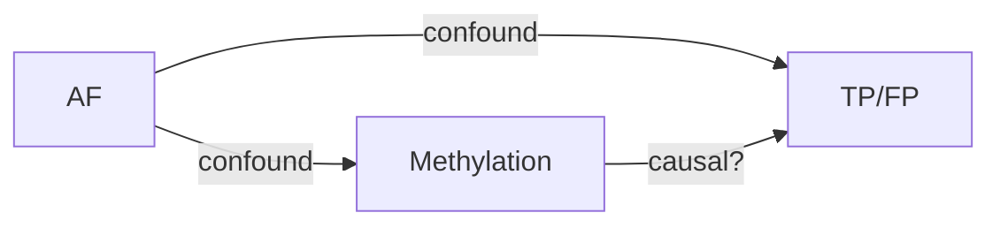

# Scientific Rigor — InterSubMod 科學工程嚴謹度元方法論

> **定位**：元方法論層 — 引用既有 6 個嚴謹度 skill，補 4 個空缺，提供協作圖，把啟發式學習映射到通用工作流。
> **不重複**既有 skill 內容；只在「補空缺 + 級聯順序 + 工作流套用」做新貢獻。

## Phase & Chain Position

**Phase**: cross-cutting（跨 7-Phase 都可觸發）
**Position**: 元 skill 層 — 不是 P0-P6 中任何一個 phase 的專屬

## Dependencies

- **Uses**（本 skill 引用）: `/known-pitfalls` · `/methodology-audit` · `/check-staleness` · `/verification-loop` · `/validation-protocol` · `/auc-confound-guard` · `/fast-learning-coach` · `/multi-sample-consistency` · `/provenance-tier-audit` · `/research-context-loader`
- **Used by**（本 skill 被引用）: 預計被 `/cycle-init` (P0)、`/run-evaluator` (P5)、`/conclude-research` (P6) 觸發
- **Reads**: `InterSubMod/AGENTS.md` §6 (Step→Verify) + §11 (IO 顯示)；`InterSubMod/.claude/CLAUDE.md` §1 (Hard Gate)
- **Writes**（本 skill 建議產出）: `research/<topic>/00_INDEX.md` Pre-registration 三欄；`research/<topic>/REFLECTION.md`；`docs/concepts/DAG/<topic>.md`（mermaid）；`docs/postmortems/<id>.md`

## Failure Mode & Diagnostics

| 症狀 | 可能根因 | 排查 |
|------|---------|------|
| 結論被新證據推翻 | 缺 §2 證據分級，被高估為 L1 | 對照 §2 重評；應降級 |
| 同方向重複嘗試失敗 | 缺 §8 Reflexion buffer | 補 REFLECTION.md；下次任務開始 retrieve |
| AUC 改善宣告無意義 | 缺 §3 Effect Size 標準 | 對照 Cohen 1988 / 領域 calibration |
| Confound 未排除卻發 publish | 缺 §4 DAG 審計 | 補 DAG mermaid 圖 + collider 標記 |

---

## §0.5 最小可用子集（Minimal Viable Subset）

> **避免 Cognitive Load 過高**（[Paas & van Merriënboer 2020](https://journals.sagepub.com/doi/10.1177/0963721420922183) / [Sweller 2024 review](https://www.sciencedirect.com/science/article/pii/S1041608024000165)）— 不必每次全跑 11 章。依任務影響度選用最小所需章節。

| 任務類型 | 必跑章節 | 可省略 |
|---------|---------|------|
| **高影響**（>1h / 影響結論 / 重大決策） | §2 證據分級 + §4 DAG + §7 Pre-reg + 依 §11 協作圖決定下游 skill | — |
| **中影響**（10min-1h / 多檔重構 / 假說選擇） | §2 + §6 消融 | §3 §4 §7 §8 §9 |
| **低影響**（可逆 <10min / 局部改動） | §10.2 Active recall（口述方案+預期）| 其餘 |
| **NEGATIVE / NO-GO 收尾** | §9.2 Postmortem + §8.3 Reflexion | — |
| **Spaced recall**（30d / 90d 檢核舊結論） | §10.1 表 + §10.2 retrieval | — |
| **任何 AUC/相關性 claim** | §4 DAG + §3 Effect Size | — |

**判斷規則**: 依 `InterSubMod/AGENTS.md §5 高影響場景` + `CLAUDE.md §1 暫停判斷矩陣` 決定影響度。

**反 pattern**: 不要「為了完整而跑完 11 章」— 過度形式化會壓低 working memory（[Miller 1956 7±2](https://en.wikipedia.org/wiki/The_Magical_Number_Seven,_Plus_or_Minus_Two) 工作記憶限制）+ 增加 [CLT extraneous load](https://www.sciencedirect.com/science/article/pii/S1041608024000165)（傷 germane learning）。判斷標準依 `AGENTS.md §5` + `CLAUDE.md §1 暫停判斷矩陣` 的影響度欄位。

---

## §1 Foundation — 為什麼需要本 skill

**研究領域 + AI agent 雙重壓力**:
- **Replication Crisis 教訓**（OSC 2015: 100 篇心理學僅 36% 重現）→ 證據必須分級
- **Goal Drift**（AIES 2026, arXiv:2505.02709）→ AI agent 長 trace 中目標漂移；需要 Pre-registration + Spaced recall
- **本專案 NEGATIVE 結論已 20+ 個** → 防重複調查需要 Reflexion buffer
- **既有 skill 缺級聯順序** → 元 skill 提供協作圖（§11）

**用戶需求（2026-05-17）**: 啟發式學習應廣泛套用到所有工作流（程式修改、研究推進、文件改動），不只「學習場景」。

---

## §2 證據分級（5 Levels） ⭐ 新

每個結論必須標明等級：

| 等級 | 標籤 | 條件 | 範例 |
|------|------|------|------|
| L1 完全佐證 | ⭐⭐⭐⭐⭐ | 多 dataset + 機制清楚 + 反例排除 + 可重現 | 「pre-commit hook 阻擋未編譯 C++」 |
| L2 部分佐證 | ⭐⭐⭐⭐ | 主要數據支持 + 機制部分清楚 + 未排除所有反例 | 「7 樣本 paired-pure F1 +0.0112」 |
| L3 推論 | ⭐⭐⭐ | 邏輯合理 + 間接證據 + 機制猜測 | 「Self-phasing 可能是 TO FP 主因」 |
| L4 假設 | ⭐⭐ | 待驗證 + 理論基礎 | 「Normal BAM 整合應能改善 ASM」 |
| L5 矛盾 | ⚠ | 有反例 + 機制不明 | 「HCC1395 chr8 7.4× enrichment 異常」 |

**敘述格式（必含 effect + 樣本 + CI）**:
- ✓ 「⭐⭐⭐⭐ 證據：5 樣本 paired-pure F1 = +0.0112（n=5, 95% CI [+0.003, +0.020]）」
- ✗ 「F1 已鎖定」「TO mode 增益為負」（無等級 + 假裝定論）

**禁止**: 用「鎖定」「定論」「已證實」假裝 L1 等級而無多 dataset + 反例排除。

### §2.1 結論敘述 Checklist（必跑）

每個結論宣告前自查:
- [ ] **Effect size 有無量化**（依 §3 ribbon — 不只「+0.0112」，要附「marginal / < Cohen's small 0.2」等級）
- [ ] **樣本數明確**（n=N，N≥3 才能跨樣本，N=1 必標 single-sample exploratory）
- [ ] **CI 區間齊全**（95% CI [lower, upper]；若 N 太小無法算 CI 必明示）
- [ ] **證據級對應條件**（L1 需多 dataset + 機制 + 反例 + 重現；L2-L5 對照 §2 表）
- [ ] **未排除 confound 不可宣告因果**（依 §4 DAG 審計）

---

## §3 Effect Size 量化標準 ⭐ 新

**統一 ribbon**（任何「更好」宣告必跑）:

| 指標 | 小 effect | 中 | 大 |
|------|---------|---|----|
| **Cohen's d** | 0.2 | 0.5 | 0.8 |
| **AUC delta** | 0.01 | 0.05 | 0.10 |
| **F1 delta** | 0.01 | 0.05 | 0.10 |
| **相對風險縮減** (RRR) | 10% | 30% | 50% |
| **NNT** (Number Needed to Treat) | >100 | 10-100 | <10 |

**必述格式**:
- ✓ 「F1 +0.0112（marginal, < Cohen's small 0.2 等價）」
- ✗ 「F1 +0.0112，significant improvement」（不寫 effect size 等級）

**防踩雷**:
- 不要單一 metric 宣告「更好」 → 必跑 §9 多維評估
- 領域 calibration 例：F1 +0.01 在 NLP 屬 marginal，在 medical diagnosis 可能 clinically significant

→ 引用 Cohen 1988 thresholds + [研究領域 effect size guide]

---

## §4 因果推論 + DAG（Pearl do-calculus） ⭐ 新

**原則**: 任何 AUC / 相關性 claim 前必畫 DAG（標 confounder / collider / mediator）。

**3 種類型**:
- **Confounder** (Z → X, Z → Y): 須 condition on Z
- **Collider** (X → Z ← Y): **不可** condition on Z（會 open spurious path）
- **Mediator** (X → Z → Y): 看研究問題決定是否 condition

**DAG 存放**: `InterSubMod/docs/concepts/DAG/<topic>.md`（mermaid 或 graphviz）

**範本**:


**規則**:
- 殘差 over **confounder** → OK（去除 confound）
- 殘差 over **collider** → ❌ 開啟虛假信號（**verdict 自動降級為 "characterization only"**）

**反例 ✗**: 「殘差 OLS 後 AUC 0.59 → 視為發現信號」（未檢查是否 collider）
**正例 ✓**: 「DAG 顯示 AlleleDelta ← AF → TP/FP；AlleleDelta 與 TP/FP 都被 AF 影響；殘差 over AF 後 AUC 升高 = collider 開啟，非真信號」

→ 引用 `/known-pitfalls` P-01 (L2 Collider Bias) + P-02 (Pooled OLS) + `/auc-confound-guard` Gate 1 (within-group OLS)

---

## §5 對照組 + 多方驗證（**完全引用**既有 skill）

本 skill 不重複內容。**完整流程詳見**:
- `/validation-protocol` §四層驗證梯度（L1 AUC Screening → L2 Confound Check → L3 Cross-sample → L4 Beyond-AUC + 4-track coverage 表）
- `/auc-confound-guard` §Gate 1-3（within-group OLS / AF-bin / permutation）

**本 skill 補充：何時觸發哪個**:
- L1 AUC > 0.55 → 進入 L2
- L2 內部步驟 = `/auc-confound-guard` 3-gate
- L3 跨樣本一致性 → `/multi-sample-consistency`
- L4 ⭐4/⭐5 升級 → 4-track coverage 表強制

**比對與確認規則**:
- **一致** → 推進到下一 phase
- **差異** → 解釋來源（樣本特性 / metric 口徑 / 機制不同）
- **矛盾** → 🔴 暫停 + 重新設計實驗（依 CLAUDE.md §1 Hard Gate）

---

## §6 消融實驗設計（引用 + 補充）

**完整流程詳見**:
- `/methodology-audit` §Step 3 OPTIONS（3+ 方案列表 + 成本估算）
- `/auc-confound-guard` §三關流程圖（消融順序示意）

**本 skill 補充：消融原則**（從 deliberate practice + 控制變因）:
1. **最小單元改動**（one variable at a time）
2. **快速反饋**（small-scale dataset first，避免全量浪費）
3. **4 步紀錄**:
   - 改了什麼（diff）
   - 預期結果
   - 實際結果
   - 差異解讀
4. **5 問判斷**:
   - 合理嗎？
   - 正確嗎？
   - 符合目標嗎？
   - 影響範圍？
   - 必要嗎？

**範例**:
- ✓ 改 1 條 hook → 跑 1 樣本 → 看結果 → 確認後再批量
- ✗ 同時改 5 hook + rules + skill → 跑全量 → 不知道誰造成什麼

---

## §7 Pre-registration + 可重現性檢核 ⭐ 新

### §7.1 Pre-registration（從 Replication Crisis 教訓）

**研究方向開跑前**必在 `InterSubMod/research/<topic>/00_INDEX.md` 強制三欄（直接複製 `InterSubMod/templates/research_index.md` §1 範本）:

```markdown
## Pre-registration (Confirmatory)
| 預測 H | 否證條件 | Decision threshold |
|--------|--------|-----|
| ISM 在 NormalASM 場景 inter > intra | 跨 5 樣本 ≥3 樣本反向 | inter-intra delta < 0 in ≥3 samples → NO-GO |
```

**規則**:
- 達 NO-GO 條件 → verdict **不可事後改寫**（呼應 CLAUDE.md §1 Hard Gate）
- 區分 **confirmatory**（事先註冊，強制）vs **exploratory**（事後分析，標 "exploratory" tag）
- 註冊後 commit hash 為錨點

**Template 完整範本**: `InterSubMod/templates/research_index.md`（含 §1 Pre-reg + §2 G1-G5 對應 + §3 reproducibility checklist + §6 子目錄結構）

### §7.2 可重現性 7 項 checklist

- [ ] seed 固定（若涉及隨機）
- [ ] 環境記錄（commit hash + conda env / Docker image）
- [ ] 數據版本（KDE-corrected 與否、subsample ratio）
- [ ] 參數檔案 snapshot（如 `params.json`）
- [ ] 中間產出存檔（不只 final result）
- [ ] 命令 + 退出碼 + 期望輸出片段
- [ ] 對比實際 vs 期望（依 AGENTS.md §11 IO 顯示規則）

→ 引用 `/check-staleness`（P2 PRECHECK：binary/dataset/upstream 新鮮度檢核）+ `/known-pitfalls` P-08（KDE stale binary）+ P-13（dirty tree）

> **註**：若可重現性檢核涉及程式碼變更 build/test 驗證（非研究實驗 reproducibility），改用 `/verification-loop` §Phase 1-6（程式碼層級）。本節聚焦**研究實驗** reproducibility，與程式碼驗證不同。

---

## §8 任務壓縮 + 知識追溯 ⭐ 新

### §8.1 3 層壓縮（從 MemGPT / LLMLingua）

| 層 | 機制 | InterSubMod 對應 |
|----|------|---------------|
| 短期 | 對話 in-context 壓縮（anchor + question + recent）| Claude Code `/compact` |
| 中期 | episodic memory | `memory/MEMORY.md` |
| 長期 | semantic knowledge | Concluded 區 + KB（`/big8_disk/Knowledge/`）|

### §8.2 層級摘要法

任何長文件 / 報告必含 3 層:
1. **TL;DR**（1 行）: 核心結論
2. **摘要**（3 行）: 為何 + 怎麼做 + 結果
3. **細節**（完整）: 給需要深入的讀者

### §8.3 Reflexion Buffer（從 Reflexion 2303.11366） ⭐⭐

**所有 NEGATIVE / NO-GO 結論末尾強制留**:

```markdown
## REFLECTION（給下次同方向研究的 agent）

**警示指標**: [何時別再試這個方向]
**根因**: [為何這次失敗 — 機制 / 樣本 / 方法]
**改進方向**（若要重試）: [需先解決什麼前置 confound]
**Spaced recall date**: [30d 後檢核此 reflection 是否仍適用]
```

**存放**:
- `research/<topic>/REFLECTION.md`（topic 級）
- memory `feedback_*.md`（跨 topic 通用）

**區別**:
- Concluded 區: 紀錄「結論本身」（事實）
- Reflection: 紀錄「下次避免方法」（教訓）

### §8.3.1 Productive Failure + Reopen Threshold（2026-05-18 新增 — plan §F.4 P2）

> **核心觀念**（Kapur 2008, 2012, 2016 "Productive Failure"）：
> 在 well-defined 但 ill-structured 問題上**先讓 learner 嘗試失敗**，再給結構化 instruction，比直接 instruction 學習效果更好。NEGATIVE 結論不是浪費，是「productive struggle」— 但需要明確的**轉化條件 + 重啟門檻**。

#### 設計原則

| 階段 | 動作 | 對應本專案 |
|------|------|---------|
| 1. Generation phase | learner 嘗試多種 invented strategies（多半失敗） | NEGATIVE cycles 累積（如 G1-G7、Z3 內 12 特徵、O11 epipolymorphism）|
| 2. Activation phase | 將失敗中暴露的隱含知識結構化 | Postmortem §9.2 + Reflexion §8.3 |
| 3. Consolidation phase | 給 canonical solution / expert framework | KB `concluded/` + memory「Concluded」區 |
| 4. **Reopen phase**（本專案新增）| 在特定條件下重啟已 NEGATIVE 方向 | 本節 reopen threshold |

#### Reopen Threshold（重啟已 NEGATIVE 方向的 3 條件，須至少滿足 1 條）

| 條件 | 定義 | 範例 |
|------|------|------|
| **C1: 新數據** | 新樣本 / 新 metric / 重跑 with bug fix / 新覆蓋層 | 2026-04-23 HCC1395 phase1_new LOH 殘缺修復後，舊 Inter AF 結論需重評 |
| **C2: 新方法** | 新算法 / 新框架可能繞過原 confound / 新 baseline 出現 | Q5 biorxiv/ensembl「實測」新方法（vs researcher 推測）→ NEGATIVE 轉 POSITIVE（commit `f3611a7`）|
| **C3: 新前置** | 原 blocker 解除 / 原 confound 機制澄清 / 新 KB 知識可用 | KDE Fix 後重評 COLO829 9x 樣本；V6 production tag 後重評 Archive TO |

#### Reopen 操作流程

1. **Trigger detection**：發現任一 C1/C2/C3 條件 → 在當前對話標記「⚡ Reopen Trigger」
2. **Cross-reference 既有 Reflection**：Read `research/<topic>/REFLECTION.md` + memory `feedback_*` 對應條目
3. **Diff 評估**：新條件 vs 原 NEGATIVE 根因 — 是否真的繞過原 confound？（避免「換湯不換藥」重跑）
4. **Pre-registration 升級**：依 §7.1 重新註冊 3 欄（H 預測 / 否證條件 / decision threshold）— **不可沿用原 NEGATIVE 的 3 欄**
5. **新 cycle 標籤**：cycle_id 加 `reopen:<original_cycle_id>` 標籤，便於 provenance 追溯
6. **歷史結論 status 更新**：原 NEGATIVE memory 加「⚠ Reopened @ <date>, see <new_cycle_id>」註記，不刪除

#### 反例：禁止 reopen 的情境

| 情境 | 為何不該 reopen |
|------|-------------|
| 「再跑一次看會不會不一樣」 | 無 C1/C2/C3 → 純隨機性差異，違反 Pre-registration |
| 「之前的人沒做對，我重做」 | 未明示原根因被解除 → 重複失敗 |
| 「我相信它應該 work」 | confirmation bias，違反 §2 證據分級 |
| 「換個 prompt 試試」 | 不算新方法 — 必須是 systematic 新框架 |

#### 與 Reflexion buffer 的差異

| | Reflexion (§8.3) | Productive Failure (§8.3.1) |
|--|----------------|---------------------------|
| 視角 | 「下次避免」（防再踩雷）| 「何時重啟」（轉化條件）|
| 動作時機 | NEGATIVE 結論落地 | 累積新條件後評估 |
| 對 NEGATIVE 的態度 | 永久 cautionary | 條件式可重啟 |
| 互補 | 二者合用 — Reflexion 寫 reopen threshold；Productive Failure 在新證據出現時觸發評估 |

#### 與 Cynefin 域的關係（cross-reference）

→ `/confirmation-protocol §「Cynefin 域對照」` Complex/Chaotic 域 ⇄ Productive Failure 失敗的「productive」性質：
- **Complex 域失敗**：emergent practice 出現前必經失敗 → 為下次 probe 提供方向（高轉化價值）
- **Chaotic 域失敗**：穩定後的 root cause analysis 即 productive failure 落地

### §8.4 知識追溯 audit

每個結論必能回答 3 問:
- 「來自哪份數據？」（檔案路徑 + checksum，依 AGENTS.md §11 IO 顯示規則）
- 「哪個 cycle？」（cycle_id + `state/cycles/<id>/state.json`）
- 「哪個 commit？」（git hash，由 AGENTS.md §11 強制顯示）

**儲存規則**:
- Cycle 級答案 → `research/<topic>/00_INDEX.md` 開頭欄位（git hash + dataset path + cycle_id）
- 跨 cycle 證據鏈 → `/provenance-tier-audit` 系統審計
- 歷史結論索引 → `/research-context-loader` Tier 1-3

→ 引用 AGENTS.md §11（IO 顯示）+ `/provenance-tier-audit`（跨 cycle 證據鏈一致性）

---

## §9 持續改進迴圈 ⭐ 新

### §9.1 PDCA cycle（Shewhart/Deming）

| 階段 | 動作 | 對應既有 skill |
|------|------|---------|
| **P**lan | 預測 + 統計 + decision rule | §7 Pre-registration |
| **D**o | 跑 + 紀錄 IO | AGENTS.md §11 + `/cpp-change` |
| **C**heck | 比對預測 vs 實際 | §5 多方驗證 + `/validation-protocol` |
| **A**ct | 升級 / 修正 / 廢棄 | §9.2 Postmortem |

**循環**: A → 新一輪 P，持續改進。

### §9.2 Blameless Postmortem（從 Google SRE）

**所有 NEGATIVE / NO-GO 結論強制走以下 inline template**（作為 source of truth；獨立 `templates/postmortem.md` 待之後輪次建立）:

```markdown
## Postmortem: <topic> NO-GO @ cycle_<id>

### Summary（≤3 行）
（為何此方向無法繼續，核心阻塞 + 學到什麼）

### Timeline
- yyyy-mm-dd: 啟動方向 + 假設
- yyyy-mm-dd: 中間檢查點 + 數據
- yyyy-mm-dd: NO-GO 判定 + 證據

### Root Cause（machinery, not blame）
（系統 / 機制 / 方法層次的根因，不指責個人或 agent）

### What Went Well
- 哪些步驟做得對，可以保留到下次方向

### What Went Poorly
- 哪些步驟踩了 pitfall（必引用 /known-pitfalls P-XX）
- 哪些假設事後證實有誤

### Action Items
| 項 | Owner | Due | Status |
|----|------|-----|-------|
| ...| ... | ... | open / done |

### Links
- evidence_ledger entry: `state/cycles/<cycle_id>/evaluation.json`
- 對應 memory file: `memory/project_<slug>.md`
- /scientific-rigor §8.3 REFLECTION.md 已建立: yes/no
```

**Blameless framing**: focus on system not individual。

**儲存位置**: `InterSubMod/docs/postmortems/<YYYYMMDD>_<topic>.md`

### §9.3 每月健康度檢查

跑：
- `/cycle-state`（dashboard 快照）
- `/run-evaluator`（retraction risk score）
- 找 3 類問題:
  - 結論被新證據推翻 → 更新 evidence_ledger + memory（降級或撤回）
  - 方法有更好替代 → 評估升級
  - 流程踩雷 → 加入 `/known-pitfalls`（P-XX 新編號）

---

## §10 啟發式學習工作流映射 ⭐⭐ 用戶強調核心

**原則**: 啟發式學習不是「學新主題」專用 — **所有工作流**（程式修改、研究推進、文件改動、重大決策）都應套用。

### §10.1 對應映射表

| 啟發式概念 | 來源 | 工作流套用 |
|----------|-----|---------|
| **Active Recall** | Roediger & Karpicke 2006 | 改動前**先口述方案 + 預期結果**，再執行；事後比對 |
| **Spaced Repetition** | Ebbinghaus / SuperMemo | 結論 7d / 30d / 90d 後 spaced check |
| **Feynman Technique** | Fiorella & Mayer 2016 | 重大決策後用「12 歲能懂」語言重述，暴露知識缺口 |
| **Interleaving** | Rohrer 2015 | 跨樣本 / 跨研究方向穿插驗證，避免 sample-specific overfit |
| **Deliberate Practice** | Ericsson 1993 | 每個 NEGATIVE 走 §9 postmortem + 設計改進實驗 |
| **Retrieval Practice** | Roediger 2006 | 開始任務前先回憶相關歷史結論（`Read MEMORY.md`）|

### §10.1.1 Spaced Recall 儲存機制

**Spaced recall dates 必標於**:
- `InterSubMod/research/<topic>/00_INDEX.md` §7 進度表「Next spaced check」欄
- 或 `memory/project_<slug>.md` frontmatter 加 `next_recall: YYYY-MM-DD`

**範例**（一個 NEGATIVE 結論）:
```yaml
---
status: concluded
verdict: NEGATIVE
concluded_date: 2026-04-22
next_recall: 2026-05-22  # 30d 後
next_recall_2: 2026-07-22  # 90d 後
reopen_conditions: [見 docs/postmortems/<...>.md §Reopen Threshold]
---
```

**觸發機制**: 由 `/memory-consolidation` skill 月度掃描 `next_recall` 過期項，提示重訪。

### §10.2 工作流套用範例

#### 程式修改前
```
1. Active recall: 「我打算改 A→B，預期 F1 變化 +0.02」（口述方案 + 預期）
2. 執行改動 + Step→Verify（AGENTS.md §6）
3. 比對實際 vs 預期
4. 若不符合 → §8.3 Reflexion buffer 記錄
```

#### 研究推進前
```
1. Retrieval practice: Read MEMORY.md + KB（防重複犯錯）
2. Spaced repetition: 看 30d 前同方向結論是否仍適用
3. §7 Pre-registration 三欄
4. 跑 §11 協作圖
```

#### 文件改動前
```
1. Feynman: 用簡單話述「為何改」（給 12 歲聽得懂）
2. Interleave: 跨章節一致性檢查
3. 改動 + 確認
```

#### 重大決策
```
1. §7 Pre-registration（H_預測 / 否證 / threshold）
2. §9 PDCA 完整跑
3. §8.3 Reflexion 留下教訓給下一輪
```

### §10.3 與 `/fast-learning-coach` 的協作

- `/fast-learning-coach`: **學新主題用**（5 步：費曼 / 帕雷托 / 主動回想 / 應用例子 / 間隔重複）
- `/scientific-rigor` §10: **套用既學原則到所有工作流**

**兩者互補**: `fast-learning-coach` = 學；`scientific-rigor §10` = 用。

---

## §11 與既有 Skill 的協作圖

```
研究/實作任務啟動
    │
    ▼
1. [/known-pitfalls 查歷史陷阱]      ← 防重複犯錯（Retrieval practice）
    │
    ▼
2. [§7 Pre-registration]             ← 事先註冊假設（防 HARKing）
    │
    ▼
3. [/methodology-audit Step 1-3]     ← 量化現況 + 列方案（消融設計）
    │
    ▼
4. [§10.2 Active recall]             ← 口述方案 + 預期
    │
    ▼
5. 執行 + Step→Verify（AGENTS.md §6）
    │
    ▼
6. [/auc-confound-guard 3-gate]      ← 統計驗證（§5 引用）
    │
    ▼
7. [/validation-protocol L1-L4]      ← 證據分級（§5 引用）
    │
    ▼
8. [/verification-loop Phase 1-6]    ← 程式碼級驗證
    │
    ▼
9. [§4 DAG 因果審計]                 ← collider 自動降級
    │
    ▼
10. [§9 PDCA]                        ← 持續改進
    │     │
    │     ├─ 失敗 → §9.2 Postmortem + §8.3 Reflexion buffer
    │     └─ 成功 → memory + KB 紀錄
    ▼
11. [/conclude-research] P6 收尾
    │
    ▼
12. [§10.1 Spaced Recall（30d 後）]   ← 防遺忘
```

**級聯規則**:
- 步驟 1-12 不強制全跑，依任務影響度（CLAUDE.md §1 矩陣）決定
- 高影響場景（AGENTS.md §5）→ 全跑
- 低影響可逆 → 步驟 1, 5, 8 即可
- 任何 NEGATIVE → 步驟 9.2 + 10.1 強制
- **依 §0.5 最小可用子集** — 不必盲目全跑

---

## §11.5 Governance Tier 對照（JMIR 2026 三級框架）

> **依據**: [JMIR 2026 — Three-tier AI competency framework](https://www.jmir.org/2026/1/e86550)（原針對臨床醫師 AI 能力分類；**此處類比應用至 agent skill 治理層次**）。

| Tier | 角色 | 本專案實現位置 | 維護週期 |
|------|------|-------------|--------|
| **Tier 1 Foundational** | skill 使用者 | `InterSubMod/AGENTS.md` + `CLAUDE.md` governance | 月度 |
| **Tier 2 Evaluative** | skill 設計者 | `/scientific-rigor` + 6 既有嚴謹度 skill | 季度 |
| **Tier 3 Governance** | meta-skill 治理 | 本 skill §11 協作圖 + §11.6 audit trail（規劃中）| 半年 |

---

## §11.6 Audit Trail 規劃（雙環學習）

**Skill 變更追溯**（規劃，待之後輪次實作）:
- Git commit message 標 `skill:<name>:<change-type>` 前綴
- 月度跑 `/provenance-tier-audit` 檢核 skill 一致性
- 重大 skill 改動（如本 skill 建立）寫 `InterSubMod/docs/postmortems/skill_<name>_<YYYYMMDD>.md`

**對抗 Single-loop Learning**（[Argyris 1977](https://hbr.org/1977/09/double-loop-learning-in-organizations)）:
- Single-loop = 修錯（執行步驟改進）
- **Double-loop** = 質疑根本假設（為何此方向會錯？前提是否錯？）
- 每個 NEGATIVE / NO-GO 必問:
  1. 我的研究假說**背後假設**是否有誤？（非僅「執行哪步錯」）
  2. 若假設正確，是否方法論本身需要 pivot？
  3. 若方法正確，是否問題定義需要 reframe？
- 範本: §9.2 Postmortem template「Root Cause」段落必含此 3 問。

---

## 啟動聲明（呼應 fast-learning-coach 慣例）

接到觸發時，AI 必須首句宣告:
> 「我正在使用 /scientific-rigor 元方法論。當前場景: [研究結論宣告 / 改動評估 / Pre-registration / Postmortem / Spaced recall]。將依 §[N] 推進。」

---

## 參考來源

### 既有 skill 引用
- `/known-pitfalls` §P-01, P-02, P-08, P-13, P-14
- `/methodology-audit` §Step 1-3
- `/verification-loop` §Phase 1-6
- `/validation-protocol` §L1-L4 + 4-track coverage
- `/auc-confound-guard` §Gate 1-3
- `/fast-learning-coach` 5 步學習方法
- `/provenance-tier-audit` 跨 cycle 證據鏈一致性

### 業界框架（附 URL）
- Replication Crisis: [Wikipedia](https://en.wikipedia.org/wiki/Replication_crisis)
- Pearl Causal Inference: [Book of Why](https://en.wikipedia.org/wiki/The_Book_of_Why)
- Reflexion: [arxiv 2303.11366](https://arxiv.org/abs/2303.11366)
- MemGPT: [arxiv 2310.08560](https://arxiv.org/abs/2310.08560)
- Generative Agents: [arxiv 2304.03442](https://arxiv.org/abs/2304.03442)
- Roediger & Karpicke (Active Recall): [Psych Science 2006](https://pubmed.ncbi.nlm.nih.gov/16507066/)
- Ebbinghaus Forgetting Curve: [Wikipedia](https://en.wikipedia.org/wiki/Forgetting_curve)
- Feynman Technique: [Farnam Street](https://fs.blog/feynman-technique/)
- Google SRE Postmortem: [postmortem-culture](https://sre.google/sre-book/postmortem-culture/)
- PDCA: [Wikipedia](https://en.wikipedia.org/wiki/PDCA)
- Goal Drift in LLM Agents: [arxiv 2505.02709](https://arxiv.org/abs/2505.02709)
- Cohen's d: Cohen 1988 thresholds

### 內部規範
- `InterSubMod/AGENTS.md` §6 (Step→Verify) + §11 (IO 顯示)
- `InterSubMod/.claude/CLAUDE.md` §1 (Hard Gate)
