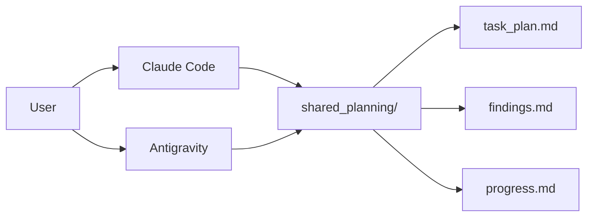

# 跨平台任務規劃系統 (Shared Planning)

這是一個可以被 **Claude Code** 和 **Google Antigravity** 共同使用的任務規劃系統。

## 系統概述

本系統模仿 `planning-with-files` skill，產生三個核心規劃文件：
- `task_plan.md` - 任務計劃與待辦清單
- `findings.md` - 研究發現與知識記錄
- `progress.md` - 進度追蹤與日誌

**跨平台特性**：
- ✅ Claude Code: 透過此 skill 調用
- ✅ Antigravity: 透過 custom agent 或 Python bridge
- ✅ 版本控制: 所有文件納入 Git 管理
- ✅ 自動同步: 兩個工具讀寫相同文件

## 使用方式

### 在 Claude Code 中

```bash
# 直接調用 skill
/shared-planning

# 或在對話中提及
User: "開始新的任務規劃"
Claude: [自動調用此 skill]
```

### 在 Antigravity 中

```bash
# 方法 1: 使用 Python bridge (推薦)
python .claude/skills/shared-planning/bridge.py init "新任務名稱"

# 方法 2: 使用 custom agent
# 匯入 .claude/skills/shared-planning/antigravity_agent.md
# 作為 Antigravity 的 system prompt
```

## 檔案位置

所有規劃文件統一儲存在：

```
docs/shared_planning/{TASK_NAME}/
├── task_plan.md      # 任務計劃
├── findings.md       # 研究發現
└── progress.md       # 進度日誌
```

## 工作流程

### 1. 初始化新任務

當開始新任務時，系統會：
1. 詢問任務名稱和目標
2. 建立任務目錄
3. 產生初始的三個規劃文件
4. 分解任務為可執行步驟

### 2. 持續更新

在任務執行過程中：
- 完成任務時更新 `task_plan.md` 的 checkbox
- 發現新知識時記錄到 `findings.md`
- 每日或每個里程碑更新 `progress.md`

### 3. 跨工具協作



## task_plan.md 格式

```markdown
# Task Plan: {TASK_NAME}

**Created**: YYYY-MM-DD HH:MM
**Updated**: YYYY-MM-DD HH:MM
**Status**: In Progress | Completed | Blocked

## Objective

[Clear, concise description of the task goal]

## Background

[Context and prerequisites]

## Tasks

### Phase 1: Research & Planning
- [ ] Task 1.1: Description
  - Assigned to: Claude Code | Antigravity
  - Priority: High | Medium | Low
- [x] Task 1.2: Completed task
  - Completed: YYYY-MM-DD

### Phase 2: Implementation
- [ ] Task 2.1: Description

## Dependencies

- Depends on: [Other task or external factor]
- Blocks: [Tasks that wait for this]

## Resources

- Documentation: [Links]
- Related issues: [GitHub issues]
```

## findings.md 格式

```markdown
# Findings: {TASK_NAME}

**Created**: YYYY-MM-DD
**Last Updated**: YYYY-MM-DD

## Key Discoveries

### YYYY-MM-DD: Finding Title

**Context**: What were we investigating?

**Discovery**: What did we find?

**Evidence**:
- Code location: `src/file.cpp:123`
- Test results: [Summary]
- References: [Links or docs]

**Implications**:
- How does this affect our approach?
- What decisions does this inform?

**Action Items**:
- [ ] Follow-up action 1
- [ ] Follow-up action 2

---

## Research Notes

### Topic 1: {Topic Name}

- Note 1
- Note 2

### Topic 2: {Topic Name}

- Note 1
```

## progress.md 格式

```markdown
# Progress Log: {TASK_NAME}

**Started**: YYYY-MM-DD
**Current Status**: {Status}

---

## YYYY-MM-DD {Weekday}

### Completed Today
- ✅ Task 1 - Brief description
- ✅ Task 2 - Brief description

### In Progress
- 🔄 Task 3 - Current status and blockers (if any)

### Planned for Next
- 📋 Task 4 - Description
- 📋 Task 5 - Description

### Notes
- Important observation or decision
- Reference to findings or external resources

### Time Spent
- Research: 2h
- Implementation: 3h
- Testing: 1h

---

## YYYY-MM-DD {Previous Day}

[Previous day's log...]
```

## 環境偵測

系統會自動偵測當前環境：

```python
# bridge.py 會檢測
if os.environ.get('CLAUDE_CODE'):
    platform = "Claude Code"
elif os.environ.get('ANTIGRAVITY_SESSION'):
    platform = "Antigravity"
else:
    platform = "Unknown"
```

並在文件中標註更新來源：

```markdown
**Last Updated**: YYYY-MM-DD HH:MM (via Claude Code)
**Last Updated**: YYYY-MM-DD HH:MM (via Antigravity)
```

## 同步建議

### Git Workflow

```bash
# 在切換工具前
git add docs/shared_planning/
git commit -m "Planning: Update task progress"

# 在另一個工具中
git pull
# 繼續工作
```

### 衝突處理

如果兩個工具同時編輯：
1. 優先使用 Git merge
2. 保留時間戳較新的更新
3. 必要時手動合併重要內容

## 最佳實踐

1. **單一真相來源**: 只透過此系統管理規劃文件
2. **即時更新**: 完成任務立即更新，不要累積
3. **詳細記錄**: findings 要包含足夠的 context
4. **定期同步**: 切換工具前 commit 變更
5. **清晰標註**: 使用 checkbox 和狀態標籤

## 進階功能

### 任務範本

系統提供預設範本：
- `research` - 研究型任務
- `feature` - 功能開發
- `bugfix` - Bug 修復
- `refactor` - 重構
- `experiment` - 實驗探索

### 統計報告

```bash
# 產生任務統計
python .claude/skills/shared-planning/bridge.py stats

# 輸出：
# - 總任務數
# - 完成率
# - 平均完成時間
# - 各工具貢獻比例
```

## 故障排除

### 文件鎖定

如果兩個工具同時寫入：
```bash
# 檢查鎖定狀態
python bridge.py unlock
```

### 文件損壞

```bash
# 驗證文件格式
python bridge.py validate

# 從 Git 恢復
git checkout docs/shared_planning/{TASK_NAME}/{file}.md
```

## 後續擴充

計劃中的功能：
- [ ] 自動產生任務統計圖表
- [ ] Slack/Discord 通知整合
- [ ] 任務時間估算與追蹤
- [ ] 與 GitHub Issues 雙向同步
