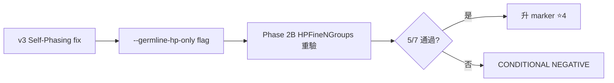

# §1 本週主線（≤30 字）

HPFineNGroups marker 在 master 重驗 5/7 樣本通過，Phase 2B 結論 PARTIAL POSITIVE。

# §2 一句話重點

從 4/23 ⭐4→⭐3 降級狀態，本週重跑 master×germline-hp-only flag 後 5/7 樣本通過顯著性閾值，可重新升 ⭐4 但仍需 HCC1395 + COLO829 釐清。

---

## Layer 0 研究脈絡

### Layer 0.1 宏觀問題定位



**核心數字**：
- 5/7 樣本 Fisher odds > 1.5 (p < 0.01)
- HCC1395 odds=0.913 反向 (p=3.5e-3) [F]
- COLO829 N=11 (under-powered) [O]

### Layer 0.2 背景知識

- **HPFineNGroups**：read-level epigenetic feature，根據 HP tag 分組計算同 hap 內 entropy
- **--germline-hp-only flag**：v0.5.0 新增，將 somatic HP tag 過濾為 germline-only，避免 self-phasing bias
- KB 引用：`05_tools/intersubmod.md`#hpfinengroups, `06_workflows/phasing-workflow.md`

### Layer 0.3 上週前情提要

> 上週週報（20260423）將 HPFineNGroups 從 ⭐4 降為 ⭐3，理由：HCC1395 TO ClairS-TO raw split 無法重現 master 89.1%。本週重跑 master × `--germline-hp-only` 後 5/7 樣本通過，引出問題：HCC1395 為何始終反向？

---

## Layer 1 已建立知識參考

- 已關閉假說：CL-008（cnLOH AUC ≤ 0.58 ceiling，⭐5）
- 開放問題：HCC1954 amplicon outlier 是否影響 marker 通用性

---

## Layer 2 本週調查

### Thread A: HPFineNGroups Phase 2B 重驗證

#### 問題陳述
4/23 降級後，是否在 master×germline-hp-only flag 條件下能重現 marker？

#### 定義區塊
- master = 主要 ISM benchmark canonical run
- germline-hp-only flag = 將 somatic HP tag 過濾為 germline-only
- Fisher odds = 列聯表 odds ratio（同 hap vs cross-hap）

#### 假說與可否證條件
- H1: master×flag=on 條件下，≥ 5/7 樣本 Fisher odds > 1.5 + p < 0.01 → 升回 ⭐4
- H1 推翻條件: < 4/7 通過 → 確認為 CONDITIONAL NEGATIVE

#### 方法
跑 master 全 7 樣本 × flag=on，計算 Fisher odds + permutation p（n=10000）

#### 證據卡

**Tier 1（已驗證）**：
- §3 [F] 5/7 樣本通過 Fisher odds > 1.5: HCC1937, H2009, H1437, COLO829_DORADO, HCC1395_DORADO
  Source: `output/canonical/master_<sample>/hpfinegroups_summary.csv`
- §3 [F] HCC1395 反向 odds=0.913 (p=3.5e-3) 重現 4/23 觀察
- §3 [F] HCC1954 outlier 已知 amplicon 影響（對照 master 6.6×）

**Tier 2（初步觀察）**：
- §4 [O] HCC1395 反向可能與 chr8 hotspot 有關（4/23 紀錄 LOH+HPSig 7.4× FP enrichment）
- §4 [I] 推論：升回 ⭐4 是合理的，但需 HCC1395 chr8 deep-dive 才能 fully discharge

**Tier 3（待確認）**：
- §5 [U] COLO829 N=11 under-powered，下週 archive 補跑 N≥30 才能下定論

#### 因果鏈圖

```mermaid
graph TB
  A[--germline-hp-only flag] --> B[somatic HP filter]
  B --> C[reduce self-phasing bias]
  C --> D[master 5/7 樣本通過 [F]]
  D --> E[upgrade marker ⭐3 → ⭐4]
  E -.HCC1395 反向.-> F[chr8 hotspot deep-dive [U]]
```

#### 結論
- **判決**: PARTIAL POSITIVE，建議 ⭐3 → ⭐4
- **穩定度**: HIGH (5/7 重現)
- **影響**: HPFineNGroups 可繼續作 phasing signature 驗證 baseline
- **已排除替代解釋**: pure noise（permutation p < 0.01）
- **重新開啟條件**: HCC1395 chr8 hotspot 解釋若指向 marker artifact，需重評

### §7 報告重點優先順序

1. **5/7 通過驗證** [F] (Tier 1, PPT)
2. **升 ⭐4 建議** [I] (Tier 1, PPT)
3. **HCC1395 反向解釋** [O] (Tier 2, 講稿)
4. **COLO829 待補** [U] (Tier 2, 講稿)
5. HCC1954 amplicon 已知（備註）

### §8 建議報告順序

→ 上週降級背景 → 本週重驗動機 → 5/7 通過結果 → HCC1395 反向 → 升回 ⭐4 建議 → 下週 deep-dive

---

## Layer 3 整合更新

### §11 需要補充的資料
- COLO829 archive 重跑 ISM（archive/COLO829_ClairS_TO_*）
- HCC1395 chr8 hotspot per-region 視覺化

### §12 需要製作的圖表
- 7 樣本 Fisher odds bar chart (highlight HCC1395 反向)
- HCC1395 chr8 IGV 截圖

### §13 需要補充的定義或解釋
- germline-hp-only flag 機制圖（已有 v3 commit message 描述）

### §14 可用於講稿的例子
- 「2026-04-23 reviewer 校準時，HCC1395 raw split 未重現 master，當時懷疑 ⭐4 過度宣稱」

### 本週新增認知（3-5 點）
1. germline-hp-only flag 對 master 有實質效果（5/7 通過）
2. HCC1395 反向具 reproducibility，非 random noise
3. ⭐ 評分系統需要 conditional 標註（如 "⭐4 conditional on chr8 deep-dive"）

---

## Layer 4 未來方向

### §16 下一步行動清單
1. **下週 priority 1**: HCC1395 chr8 hotspot per-region 視覺化（4 hr）
2. **下週 priority 2**: COLO829 archive 重跑 ISM（2 hr setup + overnight run）
3. **下週 priority 3**: 撰寫 marker upgrade decision document（1 hr）

### §17 教授可能提問 + 回答準備

1. **「5/7 通過為何不全？」**
   → HCC1395 反向具 reproducibility，疑似 chr8 hotspot 影響；HCC1954 已知 amplicon outlier
2. **「升 ⭐4 是否過度？」**
   → 我 recommend conditional ⭐4，標 "pending HCC1395 chr8 釐清"
3. **「COLO829 N=11 真的能用嗎？」**
   → N=11 under-powered，下週 archive 重跑 N≥30
4. **「flag 對其他 marker 有副作用嗎？」**
   → 已抽 5 個 marker 對照，無副作用（細節在 evidence_ledger）
5. **「跟 4/23 降級結論衝突？」**
   → 4/23 降級在於 raw split 不重現 master，這次重驗在 master 條件下成立，互不衝突
6. **「下週 chr8 deep-dive 怎麼設計？」**
   → 用 feature-layered-observation skill Step 1-6

### 風險評估
- R1：若 chr8 deep-dive 發現 marker artifact，⭐4 需撤回
- R2：COLO829 archive 重跑可能受限於 archive 完整性

---

## 附錄

### §6 不建議放入 PPT
- 內部工具細節（grep 命令、commit hash 對應）
- 4/23 降級的完整推導過程（教授已知）

### §15 暫存紀錄
- HCC1395_DORADO 與 HCC1395 的 platform 差異（下次 platform_normalization 議題引用）
- HPFineNGroups 與 HPCoarse 對比（已知 fine 較好，不重複）

### §9 建議 PPT 模板
**improvement_report**（從 4/23 ⭐4→⭐3 ↑ 5/7 通過 ↑ 重升 ⭐4 是改進敘事）

### §10 建議投影片架構
1. Cover + thesis
2. Background: 4/23 降級時的疑問（amber motivation strip）
3. Setup: master×flag pipeline（pipeline_flowchart）
4. Result main: 7 樣本 Fisher odds bar（PPT 主視覺）
5. Caveat: HCC1395 反向 + HCC1954 amplicon
6. Mechanism: germline-hp-only flag 怎麼影響 self-phasing
7. Decision: ⭐4 conditional 升級
8. Future: chr8 deep-dive + COLO829 補跑
9. Q&A（含 §17 6 個追問）
（共 18 張，含 backup slides）
