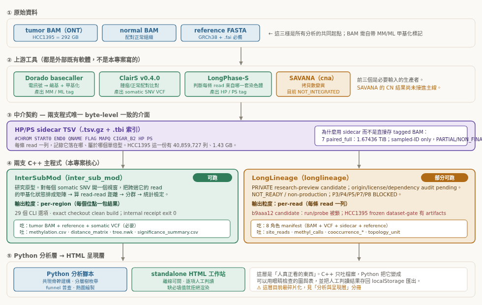
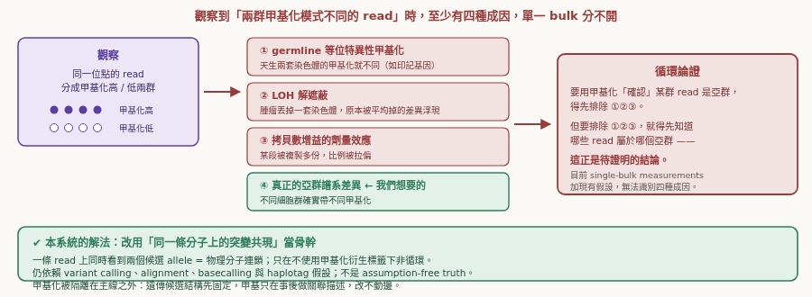
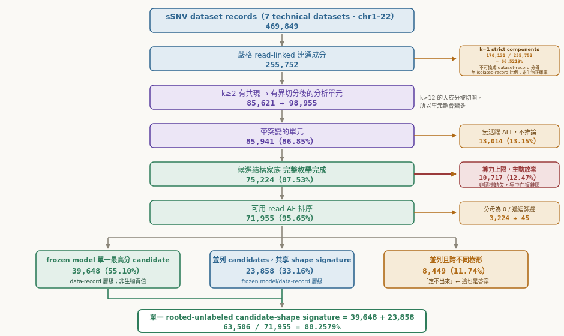
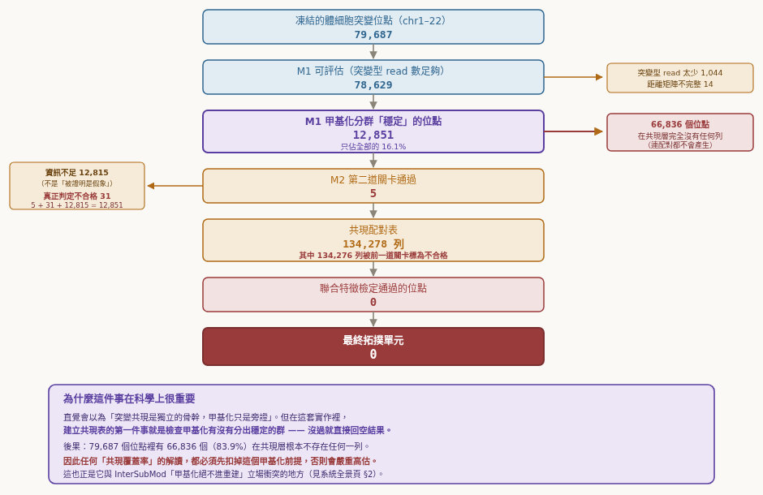
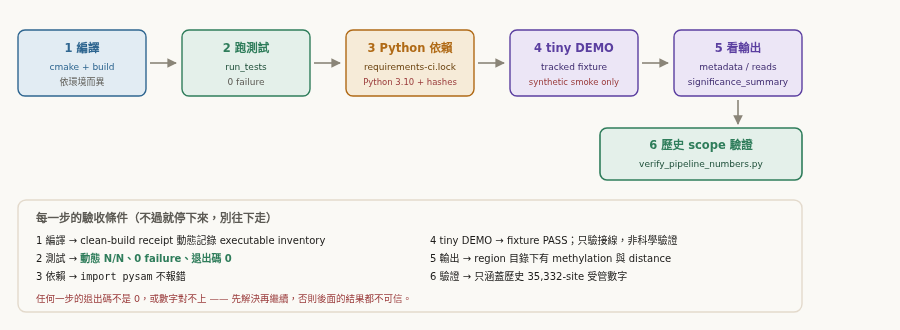
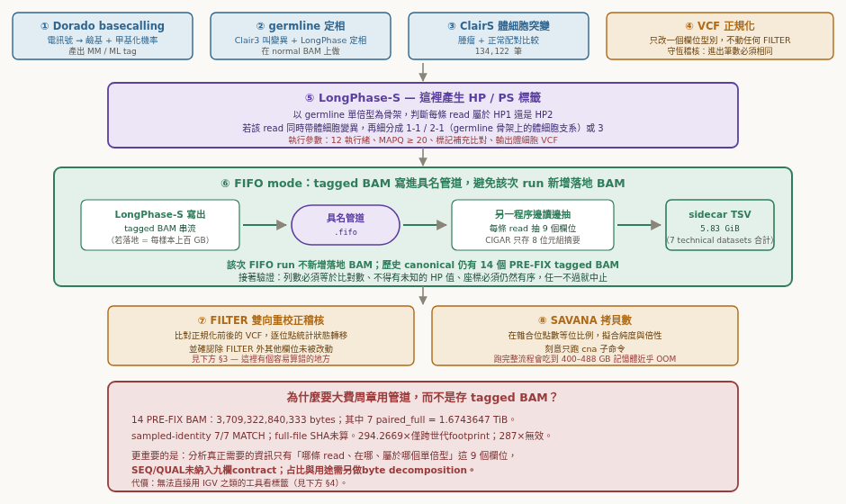
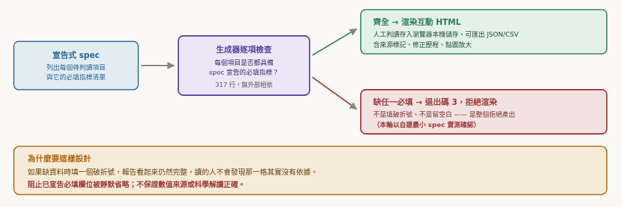

# InterSubMod

**Research handoff:** [2026-08-13 complete software/data handoff snapshot](docs/handoff/20260813_完整研究資料與軟體交接_01/00_INDEX.md) — navigation and governance; science authority remains the frozen 2026-08-01 bundle, and release/publication gates are still fail-closed.

**Local mutation-state candidate reconstruction from single-molecule somatic-mutation co-occurrence in ONT long reads.**

[繁體中文版 →](README.zh-TW.md) · [**Docs site →**](https://liaoyoyo.github.io/InterSubMod/) · [Wiki →](https://github.com/liaoyoyo/InterSubMod/wiki) · [How to run →](https://github.com/liaoyoyo/InterSubMod/wiki/How-to-Run)

A tumour can contain several cellular populations carrying different mutation sets.
Learning their order and cellular co-membership matters for resistance and progression,
but those biological quantities are **not directly observed by an unbarcoded bulk long read**.

With short reads you only observe each locus' marginal variant allele frequency. Recovering
the joint structure **from those per-locus marginals alone, without linkage or additional
model assumptions, is non-identifiable**. ONT long reads change the problem: a single molecule can span
several called somatic mutations at once. Their co-occurrence on the **same physical
molecule** becomes a direct observation; cellular co-membership and lineage remain
model-dependent inferences because the originating cell is not identified.

This repository implements that idea end to end — and, just as importantly, it is explicit
about where the evidence runs out.

---

## Architecture



Five layers, bottom to top. Only some of them are currently runnable — see
[Status](#status) below, which is deliberately honest about what does and does not work.

| Layer | Component | What it does |
|---|---|---|
| Raw data | tumour / normal BAM, reference FASTA | ONT long reads carrying methylation tags |
| Upstream | Dorado · ClairS · LongPhase-S · SAVANA | basecalling + methylation, somatic SNV calling, haplotagging, copy number |
| Interface | **HP/PS sidecar TSV** | one row per read; the only byte-identical contract between both engines |
| Engines | **`inter_sub_mod`** (C++17) · `longlineage` (C++17) | per-region methylation/statistics · version-scoped per-read artefacts |
| Presentation | Python analysis + standalone HTML | figures, funnels, interactive review workstations |

---

## The core methodological claim

The single most important design decision in this project is **what is allowed to drive
the reconstruction** — and methylation is deliberately *not*.



When you observe two groups of reads with different methylation at a locus, there are at
least four possible causes: germline allele-specific methylation, unmasking by loss of
heterozygosity, copy-number dosage, and genuine lineage difference. **They are not identifiable
from the current single-bulk measurement set without orthogonal data or additional assumptions.**
Using methylation to independently "confirm" a cellular subclone
would therefore require an external cellular assignment; conditioning on mutation-defined
labels is concordant association, not independent confirmation.

So the backbone is **candidate somatic-allele co-occurrence on the same physical molecule**.
It is non-circular only with respect to methylation-derived labels; it still depends on upstream
variant calling, alignment, basecalling and haplotag assumptions. Methylation is retained as a
strictly *bounded auxiliary* signal: it is computed **after** the genetic candidate structure
is fixed, it annotates that structure, and it **cannot move a single edge**.

> Empirically this restraint is justified: of 811 evaluable methylation units, only
> **3 (0.37 %)** supported a robust pattern-conditioned association. This low yield is one
> reason not to use methylation to choose topology; it is not a test of every possible
> methylation signal.

---

## What the pipeline actually produces



Canonical result across **7 datasets (6 biological samples), chr1–22**, frozen 2026-08-01.
Every layer is auditable and the arithmetic is self-consistent
(39,648 + 23,858 = 63,506; + 8,449 = 71,955; + 3,224 + 45 = 75,224; + 10,717 = 85,941;
+ 13,014 = 98,955).

| Quantity | Value |
|---|---|
| sSNV dataset records | 469,849 |
| `k=1` strict read-linkage components | 170,131 / 255,752 strict components (66.5219 %) |
| Analysis units carrying mutations | 85,941 |
| Abandoned at the search-node guard | 10,717 (12.47 %) |
| Units rankable by read-AF | 71,955 |
| Rankable candidate units assigned one **rooted-unlabeled candidate-shape signature by the frozen model** | 63,506 / 71,955 rankable candidate units (**88.2579 %**) |
| **Confirmed cellular subclones** | **0** — see below |
| **Confirmed linear ancestry relationships** | **0** — model-selected candidate shapes are not biological ancestry truth |

> **How to read the 88.2579 %.** It means: *of the 71,955 units that were already rankable,*
> the frozen recurrence-allowed model assigns 63,506 (88.2579 %) one mathematical candidate-shape signature.
> It is a **model-conditional graph statistic**, not "88 % of the tumour's evolutionary
> history is solved". Separately, 170,131 / 255,752 strict components (66.5219 %) are `k=1`.
> The component census cannot be used to derive an isolated-dataset-record percentage.

---

## Capability boundary

This project ships a machine-readable claim boundary. The frozen
`canonical/cohort_receipt.json` records `technical_all_pass = true`, while
`summary/all7_summary.json` records `validation_evidence_eligible = false`
(these are not top-level fields of `authority_manifest.json`). All named checks recorded by
the frozen cohort receipts passed for those cited frozen artifacts; this is neither current-source
certification nor a production/release-gate PASS, and the batch remains **not yet usable as
validation evidence**.

<table>
<tr><th width="50%">Permitted claims</th><th width="50%">Explicitly forbidden</th></tr>
<tr valign="top"><td>

- Strict read-linked **local** structure
- Complete minimal candidate families (when the family is complete)
- Local recurrence-allowed Hamming-1 candidate arborescences
- Deterministic read-AF ordering, **CN/LOH-uncorrected**
- Frozen-model rooted-unlabeled candidate-shape census
- Pattern-conditioned methylation **association**

</td><td>

- **Confirmed cellular clone / subclone**
- CN/LOH-corrected CCF
- Calibrated likelihood or posterior
- Treating a read cluster as a cell clone
- Re-ranking topologies with methylation
- Treating a basecaller re-run as a biological replicate

</td></tr>
</table>

**Within the current single-bulk observation/model, and without integrated CN/LOH, cellular
subclones and linear ancestry cannot be confirmed.** Additional independent evidence—such as
single-cell, multi-region, orthogonal copy-number, or purity measurements—may improve
identifiability; no one assay is asserted as the only route. Inferred internal nodes are
labelled `inferred` rather than asserted.

---

## Status

The table is version-scoped. "Verified" means the listed artifact was run or inspected at
the stated audit version; it is not a blanket guarantee for every public command or file.

| Component | Status | Notes |
|---|:---:|---|
| `inter_sub_mod` | ⚠️ historical dirty audit passed | `73afaeac-dirty` built and ran with byte-equivalent C++/CMake inputs to release baseline `ddd8909a`; this is not clean-checkout release certification |
| C++ test suite | ⚠️ historical dirty audit passed | The locked audit had 0 failures, but release acceptance still requires an exact-commit, repo-external clean build; counts must be generated dynamically |
| HP/PS sidecars for 7 technical datasets / 6 biological IDs | ✅ complete | 7/7 technical datasets PASS |
| Research exact-PS topology solver | ✅ runnable | Separate research solver path producing the exact-PS funnel above; not `inter_sub_mod` |
| `longlineage preflight` | ✅ runnable | Validates the 8-role manifest |
| `longlineage dataset-gate` | ⚠️ constrained | In candidate `b9aaa12`'s frozen HCC1395 receipt, the only observed interface producing research artifacts; **hardcoded to one dataset**, not production science validation |
| `longlineage run` / `probe` | 🔴 blocked | `KernelBlocked` by design |
| `longlineage` topology output | 🔴 0 candidate units in one frozen receipt | Candidate `b9aaa12`, HCC1395 dataset-gate scope only; see [caveat](#a-note-on-longlineage) |
| Writing a tagged BAM | ⚠️ version-scoped | `inter_sub_mod` does not write BAM; LongLineage private baseline/main snapshot `5daf50f` does not, while private public-preview candidate `b9aaa12` provides `longlineage-tag-bam` (NOT_READY/non-production) |
| Single script spanning both engines | 🔴 none | The two lines are currently independent |

### A note on LongLineage

LongLineage is currently a **PRIVATE research-preview candidate**. Its source-origin, license,
and dependency audits are still pending, so this handoff does not claim that clean-room origin
or public redistribution has been established. Immutable `b9aaa12` is the public-preview
candidate, not a published build: status is `NOT_READY` / non-production and
`P3/P4/P5/P7/P8` remain **BLOCKED**. Production `run` is intentionally fail-closed; no
production tag or GitHub Release exists. `5daf50f` is a private baseline/main capability snapshot.
Its contracts schema-lock artifacts with SHA-256 receipts, and `topology_unit` records named
abstention states; those contracts do not establish biological correctness.

For candidate `b9aaa12`'s frozen **HCC1395 dataset-gate receipt** it emits 0 candidate topology units; this does not
generalise to every possible LongLineage run:



Its pipeline gates topology construction on methylation clustering stability, so 66,836 of
79,687 sites (83.9 %) never produce a co-occurrence row at all. This is a **direct conflict**
with the methodological position stated above, and any cross-engine comparison must say so
explicitly.

"BLOCKED" means the named `P3/P4/P5/P7/P8` gates have not passed. Those gates cover
parity/validation, source-origin, license, dependencies, and release safety. Parts of the
M1/M2/topology kernels were exercised by one named `dataset-gate` receipt; that does **not**
establish that every core path, the production entry point, or public redistribution is ready.

---

## Quick start

Full walkthrough with expected output at every step:
[**How to run**](https://github.com/liaoyoyo/InterSubMod/wiki/How-to-Run)



```bash
# 0. Clone and check out the immutable commit recorded by the handoff release manifest.
git clone https://github.com/liaoyoyo/InterSubMod.git
cd InterSubMod
HANDOFF_COMMIT="<IMMUTABLE_HANDOFF_COMMIT_SHA>"
git checkout --detach "$HANDOFF_COMMIT"
test "$(git rev-parse HEAD)" = "$HANDOFF_COMMIT"
test -z "$(git status --porcelain)"

# 1. Clean Release build outside the repository; build outputs are not versioned.
REPO_ROOT="$(pwd -P)"
BUILD_ROOT="$(mktemp -d "${TMPDIR:-/tmp}/ism-build.XXXXXXXX")"
cmake -S "$REPO_ROOT" -B "$BUILD_ROOT" -DCMAKE_BUILD_TYPE=Release
cmake --build "$BUILD_ROOT" -j$(nproc)
test -z "$(git -C "$REPO_ROOT" status --porcelain)"

# 2. Verify the build   -> derive test/suite counts from this run; require exit 0 and 0 failures
"$BUILD_ROOT/bin/run_tests"
ctest --test-dir "$BUILD_ROOT" --output-on-failure

# 3. Hash-locked Python 3.10 acceptance environment
PYTHON_ENV="$(mktemp -d "${TMPDIR:-/tmp}/ism-python.XXXXXXXX")/venv"
python3.10 -m venv "$PYTHON_ENV"
"$PYTHON_ENV/bin/python" -m pip install --require-hashes \
  --requirement "$REPO_ROOT/requirements-ci.lock"
export PATH="$PYTHON_ENV/bin:$PATH"

# 4. Run the tracked tiny synthetic fixture (DEMO/SMOKE only; not science validation).
"$REPO_ROOT/scripts/handoff/run_tiny_public_e2e.sh" --repo-root "$REPO_ROOT" --jobs 4

# 5. Real analysis uses an untracked machine site profile; absolute paths live there/registry only.
SITE_PROFILE="<SITE_PROFILE>"
"$REPO_ROOT/scripts/site/doctor" --profile "$SITE_PROFILE" --mode real-preflight
eval "$("$REPO_ROOT/scripts/site/site_profile.py" shell --profile "$SITE_PROFILE" --sample HCC1395)"
"$BUILD_ROOT/bin/inter_sub_mod" \
  --tumor-bam "$TUMOR_BAM" \
  --reference "$REFERENCE" \
  --vcf       "$SOMATIC_VCF" \
  --output-dir "${TMPDIR:-/tmp}/ism-real-smoke"
```

The tiny fixture contains tracked synthetic FASTA/VCF/SAM sources and builds BAM/index files
in a new temporary directory. A passing receipt proves clone→build→run→schema plumbing only;
it is **DEMO scope** and cannot support biological, benchmark, or release-science claims.

<details>
<summary><b>Three things that will bite you</b> (all verified against source)</summary>

- **`--threads` defaults to 16, not 1.** The help text says `Default: 1`; the actual
  default in `Config.hpp` is `16`. Resource estimates will be off by 16×.
- **`--distance-metric` is silently forced to `NHD`.** `Config.hpp` declares `BERNOULLI`,
  but the argument parser unconditionally clears it. Always specify it explicitly.
- **`tree.nwk` leaves are *reads*, not clones.** It is a hierarchical clustering tree over
  read methylation similarity — **not** a subclonal phylogeny. This is the single most
  commonly misread output.

Two more version-sensitive details: `methylation.csv`'s first column is a row index rather
than a read name (the binding to reads is positional, with no key check). Frozen release
baseline `ddd8909a` has a **199-column** `significance_summary.csv` source header, including
`VerificationSchemaVersion=2` and `RegionStratificationSchemaVersion=1`. These are component
schema fields, not a single whole-file layout version; always index by column name and pin
the producing commit.

</details>

---

## Documentation

The **Explanation Center** (`docs/explain/`) is the entry point — 17 self-contained pages,
no external dependencies, openable offline.

| | Page | For |
|---|---|---|
| 🗺️ | [System overview](https://github.com/liaoyoyo/InterSubMod/wiki/System-Overview) | **Start here** — architecture, honest status, funnel, capability boundary |
| ⚙️ | [InterSubMod I/O](https://github.com/liaoyoyo/InterSubMod/wiki/InterSubMod-Engine) | 3 inputs, 8 stages, 17 output files with real headers, 9 pitfalls |
| 🧬 | [LongLineage I/O](https://github.com/liaoyoyo/InterSubMod/wiki/LongLineage-Engine) | Subcommand status, M1→M2→topology chain, artefact contracts |
| 🔬 | [Upstream & data](https://github.com/liaoyoyo/InterSubMod/wiki/Upstream-and-Data) | Dorado / ClairS / LongPhase-S / SAVANA, sidecar format, 7 technical datasets / 6 biological IDs |
| 📊 | [Analysis & presentation](https://github.com/liaoyoyo/InterSubMod/wiki/Analysis-and-Presentation) | Which scripts to use, refuse-on-missing HTML generator |
| ▶️ | [How to run](https://github.com/liaoyoyo/InterSubMod/wiki/How-to-Run) | Six steps, each with an acceptance check |

> **Two ways to read the same material.** The table above links to the **Wiki**, which
> GitHub renders natively and is the quickest to skim. The same content is also served as
> fully self-contained HTML at **[liaoyoyo.github.io/InterSubMod](https://liaoyoyo.github.io/InterSubMod/)**
> — richer typography, interactive fold-out sections, and **37 inline SVG elements** in the
> locked 2026-08-12 deploy (counted as DOM `<svg>` elements). `docs/explain` is the
> editorial upstream; the Wiki is a manually synchronized derivative and can drift.
> Publication is a separate step, so compare the deployed commit before assuming
> byte-level identity.

Pages 01–10 cover the scientific method itself (glossary, ISM core, methylation read/filter,
worked case studies, statistical division of labour, capability vs. narrative).

---

## Design notes worth stealing

Two patterns in this repository generalise beyond genomics.

**1 · Streaming as a supported workflow mode.** The frozen nine-field sidecars occupy
**5.83 GiB** and retain 100% of the fields required by that downstream contract. FIFO mode can
avoid materialising a new tagged BAM for that run; it does not mean no tagged BAM has ever
existed. The 2026-08-13 inventory identifies seven historical PRE-FIX `paired_full` BAMs
totaling 1,840,983,466,353 bytes (1.67436 TiB), plus seven `paired_pileup` BAMs; all 14 total
3,709,322,840,333 bytes. Exact paths/bytes/mtimes and a sampled-content set identity are known,
but full-file hashes and generation-level correspondence are not, so all remain
`PARTIAL`/`NON_FINAL`. Dividing the seven `paired_full` stat sizes by the seven current sidecar
stat sizes gives 294.2669×; this is only a cross-generation storage-footprint quotient, not a
causal compression result, a byte-equivalent replacement claim, or frozen authority. The old
287× figure is incorrect.



**2 · Refuse missing required metrics.** The audited workstation generator takes a
declarative spec and **refuses to render (exit 3)** when a required metric is missing. This
fail-closed behaviour covers that generator and its declared fields; it is not proof that
every public number or document is automatically validated.



---

## Requirements

- **C++17** compiler, CMake ≥ 3.14, OpenMP
- **htslib** (BAM/VCF I/O), Eigen
- **samtools** for building/indexing the tracked tiny synthetic fixture
- **Python 3.10** for acceptance, installed from `requirements-ci.lock` with
  `--require-hashes`; `requirements.txt` is the input/general-plotting dependency list,
  not the handoff acceptance environment
- Reference FASTA **with `.fai`** (a missing index is a hard error)
- Input BAM must carry `MM`/`ML` methylation tags (reads without them are dropped)

## Repository layout

```
include/core/ src/core/     C++17 analysis engine
scripts/                    Python analysis entry points
docs/explain/               Explanation Center (17 standalone pages)
docs/images/                Figures used by this README and the wiki
tools/                      Rendering, QA and extraction utilities
state/                      Research cycle state machine
```

## Verification scope of this document

This README is bounded by the
[2026-08-12 public-claim audit](docs/reports/validated/2026/08/20260812_InterSubMod_GitHub公開說明與教學完整驗證_01.md).
The frozen exact-PS counts were checked against the authority manifest and denominator
registry; the tracked C++ core was freshly built and tested. The tracked tiny synthetic fixture
**is shipped for DEMO/SMOKE only**, while real tumour BAM/reference/VCF inputs are not; GitHub About/Wiki/Pages have independent publication state, and LongLineage
capabilities are pinned to the commits named above. Therefore no blanket "every number and
command was verified" claim is made. Figures are extracted from `docs/explain/` by
`tools/extract_svg_for_github.py`; regenerate them after editing their source pages.

| Artifact / claim family | Verification identity and date | Reproducible check and result | Scope and known failure |
|---|---|---|---|
| Frozen exact-PS funnel | Frozen authority artifacts, rechecked 2026-08-12 | Manifest/hash census plus independent denominator recomputation; exact counts reproduced | Frozen 7-dataset analysis only; it is not the `inter_sub_mod` CLI and does not identify cellular clones |
| Frozen release-baseline source | `ddd8909a` | The tracked source header has 199 columns; current test/suite counts must be generated dynamically from an exact-commit clean run | Historical `73afaeac-dirty` audit inputs were byte-equivalent for C++/CMake and its 0-failure receipt is historical evidence only, not clean-checkout release certification |
| Public quick start | Current source, reviewed 2026-08-13 | Build/test plus the tracked tiny synthetic fixture reproduce clone→build→run→schema plumbing | The fixture is DEMO only; no public real tumour BAM/reference/VCF is shipped, so no biological result is claimed |
| LongLineage status | Private repo; public-preview candidate `b9aaa12`; private baseline snapshot `5daf50f`; frozen HCC1395 evidence | Source/commit comparison plus one-dataset frozen artifact audit | `NOT_READY`; P3/P4/P5/P7/P8 BLOCKED; tagged-BAM belongs only to the candidate; no seven-technical-dataset/six-biological-ID runtime, memory, or topology validation |
| GitHub surfaces | Main-repo source corrected locally 2026-08-13 | P0 claim registry and source checks in this correction cycle | About, Wiki, Pages and default-branch publication are separate external actions; source edits alone do not prove deployment |

The exact commands and captured output are preserved in the
[command receipts](research/20260812_intersubmod_github_public_docs_full_validation/command_receipts.md);
the per-claim correction status is tracked in the
[P0 correction cycle](research/20260813_public_docs_p0_correction/00_INDEX.md).

Known gaps, stated honestly: copy-number is `NOT_INTEGRATED`; LongLineage's seven-technical-dataset/six-biological-ID runtime
and memory ceiling have **never been measured** and its own documentation forbids
extrapolating from one sample.
