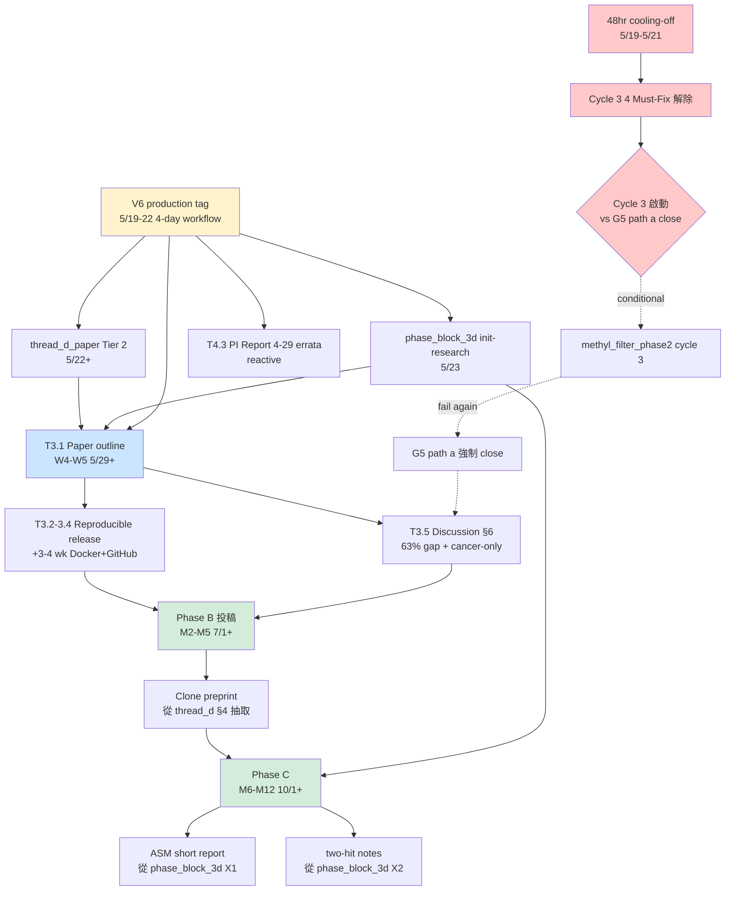

<!--
建立時間: 2026-05-19
更新時間: 2026-05-19
狀態: validated (snapshot)
類型: architecture / roadmap
資料來源:
  - InterSubMod/docs/architecture/20260327_InterSubMod研究願景定錨_01.md (五大目標權威定義)
  - ~/.claude/plans/tender-pondering-blossom.md (plan v1 + v2)
  - InterSubMod/docs/CURRENT_FOCUS.md (5/19 區塊 + audit amendment)
  - InterSubMod/docs/reports/research_landscape/06_結論穩定性審查.md (22 條穩定結論)
  - InterSubMod/research/autoresearch/evidence_ledger.jsonl (47 entries through 5/19)
  - 7 輪 Socratic 燒烤對話 (5/15 + 5/18 + 5/19) 累積 30+ 燒烤點

關聯檔案:
  - InterSubMod/docs/CURRENT_FOCUS.md (live 進度)
  - InterSubMod/docs/reports/research_landscape/00_INDEX.md (10 篇 landscape)
  - InterSubMod/research/thread_d_paper/00_PLAN.md
  - InterSubMod/research/selfphasing_v6_production/00_PLAN.md
  - InterSubMod/research/methyl_augmented_filter_phase2/cycle2/cycle2_NEGATIVE_postmortem.md
-->

# 研究路徑與五大目標路線圖（snapshot 2026-05-19）

> **本文件目的**：作為未來 session 啟動時的研究**路徑 checkpoint**，提供五大目標完成度、進行中項目、未來計畫、依賴關係的單一入口。同時提供 modification mechanism 讓 roadmap 可被結構化修改。

---

## 1. 文件目的與使用方式

### 1.1 用途

- **持久化 status snapshot**：避免 session 啟動時需在 plan v2 / CURRENT_FOCUS / 22 條結論之間拼湊
- **修改 anchor**：未來提 roadmap 變更時對照本檔識別差異
- **教學與交接**：新 collaborator 或論文 reviewer 快速理解研究全景

### 1.2 與既有入口的關係（四層架構）

| 層級 | 文件 | 角色 | 更新頻率 |
|------|------|------|---------|
| **L1 願景** | `InterSubMod/docs/architecture/20260327_InterSubMod研究願景定錨_01.md` | 五大目標**定義權威**（不動） | 永久 |
| **L2 路徑** | **本檔** | 五大目標**執行路徑 snapshot** | 月度 / 重大變動 |
| **L3 計畫** | `~/.claude/plans/tender-pondering-blossom.md` | 4-6 週執行計畫 v1/v2 | 燒烤後 |
| **L4 live** | `InterSubMod/docs/CURRENT_FOCUS.md` | 每日 / 每週進度 | 每 cycle 後 |

### 1.3 Modification 機制

**何時更新本檔**：
- 重大方向變更（如四軌→三軌 / G3 reactivate）
- Cycle 結果改變 G 完成度評估 ≥10%
- 4-6 週 review milestone（每月一次）
- Reviewer feedback 改變 paper structure

**流程**：詳見 §9 Modification proposal 機制

---

## 2. 五大目標完成度速覽（2026-05-19）

### G1 — per-CpG 甲基位點多標籤關聯性評分（ASM）

**完成度 ~70%**

- ✅ Germline ASM >> somatic passenger SNV 3-6× 確認（CL-007 ⭐4）
- ✅ ASM 32-66% per-region POSITIVE（5 方法交叉驗證 ⭐4）
- 🔄 phase_block_3d X1 cis-effect hypothesis（5/23 init-research）
- 📅 Phase C ASM short report（M6-M12，從 phase_block_3d X1 抽取）

**缺口**：global region AUC 仍 ≤0.58（CL-008 ⭐5 ceiling）；patient-derived cohort 未驗證

---

### G2 — clone 結構分析（subclone + 跨位點共演化）

**完成度 ~55%**

- ✅ HPFineNGroups somatic heterogeneity marker（CL-010 ⭐4）
- ✅ LOH Subclone AF × Methylation 雙證據（CL-011 ⭐4，r=+0.705~+0.787，7/7 同方向）
- ✅ 2026-05-15 paradigm reframe：Outer cross_het 為 TP signature（Fisher p=3.8e-62）
- ✅ HCC1395 single sample 4-group subclone 識別（Phase 2 B/C/D 驗證）
- 🔄 thread_d_paper Tier 2（含 cross-sample 4-group subclone characterization）
- 🔄 phase_block_3d X1 + X2（5/23 init）
- 📅 Phase B clone preprint（M2-M5，從 thread_d §4 抽取）

**缺口**：跨樣本 4-group subclone（R12 pending）；HCC1937 BRCA1 outlier 機制

---

### G3 — 二次打擊與事件順序推論

**完成度 ~15%（依賴 G1 突破，plan v2 暫緩）**

- ❌ P4 region-level pilot：無 two-hit order 訊號（歷史 NEGATIVE）
- 🔄 phase_block_3d X2 boundary artifact（可能對齊 two-hit pattern，5/23 啟動）
- 📅 Phase C two-hit notes（M6-M12，依 G1+G2 進度）

**缺口**：無患者 cohort 提供時序 evidence；現有 cell line 無法提供 single-cell timing

---

### G4 — TO normal 資訊補強 + 整體流程合理性

**完成度 ~50%**

- ✅ Phase 2 程式碼完工 173/173 tests（2026-04-13）
- ✅ HCC1395 single sample 驗證：Sample ASM 97.3% / Normal Baseline 100% / LOH concordance 94.1%
- ✅ Self-Phasing 17.3:1 priority bug 修補（5/8 整合報告，⭐5）
- ✅ V6 binary patch validated（V5 over-promote +60% Inner LOH NG=2 修補回 V3F 水準）
- ✅ V6 ISM paradigm reframe（5/15 multi-agent characterization）
- ✅ Agent Harness Audit P0-P4（30 hooks / 42 skills / cache 96.8%）
- 🔄 selfphasing_v6_production T1.2（4-day workflow 5/19-22, V6 production tag）
- 🔄 thread_d_paper 含 normal augmentation framework
- 📅 Tier 3 reproducible release（binary + Docker + benchmark suite + GitHub）
- 📅 T4.1 Phase 2A Normal BAM cross-sample（W6+ reactive）

**缺口**：跨樣本 Normal BAM Phase 2A 全量驗證；reproducible release 工程

---

### G5 — 整合 evidence panel 提升 F1

**完成度 ~35%（plan v2 階段化 active，path (a) 邊界灰）**

> **G5 兩條 pipeline path 並存**：
> - **paired ClairS path**（歷史，已 ceiling）：Phase 1A paired-pure +0.0112
> - **ClairS-TO ssrs path**（phase 2 主軸）：Cycle 1 +0.02236 strong / Cycle 2 cross-sample NEGATIVE
>
> 兩條 path **不相通**（不同 caller + 不同 F1 baseline + 不同 pipeline），不可直接比較。

- ✅ **[paired path]** Phase 1A paired-pure ceiling +0.0112（鎖定不投入；paired ClairS pipeline）
- ✅ **[ClairS-TO ssrs path]** Phase 2 Cycle 1 ⭐3 strong（HCC1395-internal ΔF1=+0.02236 = 9.24× v1.0 cycle，vs ClairS-TO ssrs baseline F1=0.7166）
- ✅ **[ClairS-TO ssrs path]** Phase 2 Cycle 2 cross-sample DIRECTION_NEGATIVE（5/19，ClairS-TO ssrs caller-F1-headroom-bounded：H1437/H2009/HCC1954 各自 caller F1 > 0.83）
- ✅ **[ClairS-TO ssrs path]** H_C1_6 V3F/V5/V6 cross-binary PASS（LongPhase-TO V3F→V5→V6 五階段 caller F1 完全不變；V6 production zero F1 regression per 09_V6_caller_F1_verification.md）
- ✅ CL-008 Beyond-AUC ≤0.58（純 methylation ceiling ⭐5；跨 mode 適用）
- ✅ CL-024 Z3 amplicon blacklist NEGATIVE-for-canonical（⭐5；跨 mode 適用）
- 🔴 methyl_filter_phase2 cycle 3 blocked（4 must-fix + 48hr cooling-off）
- 🤔 G5 ClairS-TO ssrs path 真正關閉 vs cycle 3 productive failure escalation 待 5/21 後決定

**真實 pipeline**（per 5/20 framing audit）：ClairS-TO v0.3.0 (ssrs model) → LongPhase-TO V3F/V5/V6 (longphase-to-mod fork) → tumor_tagged.bam (Normal=None) → ISM filter，**全程 tumor-only mode**。詳見 `InterSubMod/docs/data_specs/20260411_工作區命名與目錄結構_01.md` §1.5 Canonical Naming Alias Table。

**缺口**：ClairS-TO ssrs path 的 caller F1<0.80 low-F1 sample panel 不存在；mechanism 視覺化 figures 缺

---

## 3. 三時間維度 Inventory

### 3.A 已完成（17 個主要 milestone，按時間排序）

| 日期 | 項目 | G 對齊 | Tier |
|------|------|--------|------|
| 2026-04-13 | Phase 2 程式碼完工 + HCC1395 single sample 驗證 | G4 | ⭐4 (code) / ⭐3 (biology) |
| 2026-04-26 | Thread D 主軸正式化 + Thread B retraction | G2 + G4 | ⭐3 grade B |
| 2026-05-08 | Self-Phasing 完整觀察整合報告（5 commit chain） | G4 | ⭐5 |
| 2026-05-10 | image-gen + image-vision-check skills shipped | meta | — |
| 2026-05-11 | html-preview skill shipped (Phase 2) | meta | — |
| 2026-05-13 | Plan v1（4 輪 Socratic 9 條決策） | meta | — |
| 2026-05-15 | V6 ISM characterization + paradigm reframe（Outer cross_het TP signature） | G2 + G4 | ⭐3 PARTIAL POSITIVE |
| 2026-05-16 | T1.1 Thread D 主軸正名「TP-enriched phasing signatures (LOH × cross_het)」 | G2 + G4 | — |
| 2026-05-16 | T1.3 init-research × 2（thread_d_paper + selfphasing_v6_production） | meta | — |
| 2026-05-17 | CURRENT_FOCUS Tier 1-4 細化 | meta | — |
| 2026-05-18 上午 | methyl filter v1.0 cycle marginal +0.00242 | G5 | ⭐3 marginal |
| 2026-05-18 晚 | Phase 2 Cycle 1 global FP filter strong +0.02236 | G5 | ⭐3 strong |
| 2026-05-18 | Agent Harness Audit P0-P4（11 commits） | G4 (meta-ops) | — |
| 2026-05-18 | Plan v2 + 四軌定案 + inject H013/H014/H015 | meta | — |
| 2026-05-19 早 | Phase 2 Cycle 2 cross-sample DIRECTION_NEGATIVE + H_C1_6 PASS | G5 | ⭐3 保持 |
| 2026-05-19 晚 | 4-agent multi-agent audit 揭露 R-MENTAL-DRIFT 違規 | meta | — |
| 2026-05-19 晚 | NEGATIVE postmortem + cooling-off + Plan v2 紀律首次 enforce | meta | — |

### 3.B 進行中（四軌 + cooling-off + 4 must-fix）

| 項目 | 5/19 狀態 | 解除/完成條件 | G |
|------|----------|-------------|---|
| **48hr cooling-off** | ⏰ active 5/19→5/21 | 自然完成 | meta |
| **selfphasing_v6_production** | 🟡 4-day workflow 5/19-22 | COLO829 V6 ISM → manifest → git tag → PI errata | G4 + G5 |
| **thread_d_paper** | ⏳ Tier 2 啟動 5/22+ | T2.2/T2.3 章節骨架（依賴 V6 完成 + cooling-off） | G2 + G4 |
| **phase_block_3d** | ⏳ 5/23 init-research | inject 3 H 已完成 H013/H014/H015；待 scaffolding | G1 + G2 + G4 |
| **methyl_filter_phase2** | 🔴 cycle 3 blocked | 4 must-fix 解除 OR G5 path (a) close | G5 |

**Cycle 3 啟動前 4 個 Must-Fix**：

| Pri | 項目 | G |
|-----|------|---|
| 🔴 P0 | H_C3_2 low-F1 panel 4 樣本名單（caller F1<0.80 + BAM 驗證） | G5 |
| 🟠 P1 | cycle_id rename convention `_validation` | meta |
| 🟠 P1 | ledger entry 補 binary_commit / dataset_id / pre-reg link | meta |
| 🟡 P2 | H_C3_1 target 計算澄清（cycle 2 re-fit mean vs cycle 3 新 re-fit） | G5 |

### 3.C 未來計畫（Tier 1-4 + Phase A/B/C）

#### Tier 1 收尾（W3 5/19-5/22）

- T1.2 V6 production tag finalize（🔴 Hard Gate git tag 5/22 內，G4+G5）

#### Tier 2 證據強化（W3-W4 5/22-5/29）

- T2.1 Z-AUTO KDE 跨 4 樣本擴展（⭐3→⭐4 升級，G2+G4）
- T2.2 HCC1395 primary discovery 章節骨架（paper §3，G2+G4）
- T2.3 6-sample replication cohort 章節骨架（paper §4，G2+G4）

#### Tier 3 Paper draft + 工程平行（W4-W6 5/29-6/30）

- T3.1 Paper full outline（abstract + 6 章 + 6 主圖，G4+G5）
- T3.2 GitHub repo public 化（reproducibility，G4）
- T3.3 Docker image build + tutorial（1-hour install+run，G4）
- T3.4 Benchmark suite 公開化（HG002 / HCC1395 SEQC2 公開部分，G4）
- T3.5 Discussion 章節（63% gap + cancer-only + Normal BAM future，G4+G5）

#### Tier 4 reactive 擴展（W6+ 6/30+）

- T4.1 Phase 2A Normal BAM cross-sample（G4 45%→70%）
- T4.2 GC/mappability/repeat 新軸 pilot（if reviewer 質疑 framework gap）
- T4.3 PI Report 4-29 errata + V6 sign-off（T1.2 完成後）
- T4.4 HG002 non-cancer pilot（if reviewer 強質疑 cancer-only）

#### Phase B/C papers

| Phase | 時程 | Deliverable | G |
|-------|------|-------------|---|
| B | M2-M5（7/1-9/30） | framework 投稿 + clone preprint（thread_d §4 抽取） | G2 |
| C | M6-M12（10/1+） | ASM short + two-hit notes（phase_block_3d X1/X2 抽取） | G1 + G3 |

---

## 4. 22 條穩定結論索引（含 5/19 audit 相關）

### ⭐5 堅固結論（與 G 對齊）

| CL | 結論 | G | 用途 |
|----|------|---|------|
| CL-008 | Beyond-AUC ≤0.58 純 methylation ceiling | G5 (close) | 防 G5 純 methyl 路徑重啟 |
| CL-024 | Z3 amplicon blacklist NEGATIVE-for-canonical | G5 (close) | 防 zone-aware filter 重啟 |
| CL-025 | LOH.bed 自由於 self-phasing（Jaccard=1.0000） | G4 | LOH-dependent 結論可信 |

### ⭐4 穩固結論

| CL | 結論 | G | 用途 |
|----|------|---|------|
| CL-001 | Self-phasing 17.3:1 bias | G4 | 主軸機制根因 |
| CL-007 | Germline ASM >> somatic 3-6× | G1 | ASM characterization |
| CL-010 | HPFineNGroups somatic heterogeneity marker | G2 | clone 結構 marker |
| CL-011 | LOH Subclone AF × Methylation 雙證據 | G2 | clone subclone evidence |
| CL-020 | Coverage_Multiple CN proxy r=0.831 | G2 + G4 | CN 代理可信 |

### ⭐3 需注意

- CL-002, CL-008-related conditional findings — 詳見 `InterSubMod/docs/reports/research_landscape/06_結論穩定性審查.md`

### 5/18-5/19 新增結論候選（待入主表）

| 候選 | 結論 | G | Tier |
|------|------|---|------|
| 5/15 paradigm reframe | Outer cross_het Z-OCH 是 TP signature（Fisher p=3.8e-62） | G2 | ⭐3 PARTIAL |
| 5/18 Cycle 1 | HCC1395-internal multi-axis filter ΔF1=+0.02236 | G5 | ⭐3 strong |
| 5/18 V5 over-promote | V5 Layer 1.5 在 Inner LOH NG=2 over-promote +60%，V6 修補回 V3F 水準 | G4 | ⭐3-4 |
| 5/19 Cycle 2 | cross-sample DIRECTION_NEGATIVE; caller-F1-headroom-bounded | G5 | ⭐3 caveat |
| 5/19 H_C1_6 | V3F/V5/V6 cross-binary PASS; V6 production zero F1 regression | G4 | ⭐3 |

---

## 5. Dependency 關係圖



**核心 critical path**：V6 production tag → 三軌 unlock → A 階段 framework paper → B 階段投稿 + clone preprint → C 階段 ASM + two-hit。

---

## 6. 關鍵 Active Gates（next 14 days）

| Gate | 性質 | 時間點 | 不可逆性 | 決策內容 |
|------|------|--------|---------|---------|
| 🔴 Hard Gate | `git tag v6-prod-{date}` | 5/22 內 | 不可逆 | V6 production tag |
| 🔴 Hard Gate | PI errata email send | 5/22 後 | 不可逆 | external communication |
| 🟡 Soft Gate | Cycle 3 啟動 OR G5 close | 5/21 後 | 可逆 | 取決於 4 must-fix + G5 path 決定 |
| 🟢 Auto Gate | 48hr cooling-off | 5/21 自然完成 | — | 紀律 enforce |
| 🟡 Soft Gate | phase_block_3d init-research | 5/23 | 可逆 | 開新軌（G1+G2 兼顧） |
| 🟡 Soft Gate | thread_d_paper Tier 2 啟動 | 5/22+ | 可逆 | paper draft 啟動 |

---

## 7. Plan v2 五大紀律 Active Status

| Risk | 規範 | 5/19 status | 觸發紀錄 |
|------|------|-------------|---------|
| R-CONFIRMATION-LOOP | cycle 1 結果決定（NEGATIVE → G5 真正關閉） | 🟡 邊界灰 | cycle 1 strong → path (a) 通過；cycle 2 NEGATIVE 屬 productive failure escalation 而非 cycle 1 NEGATIVE |
| R-A-SCOPE | A 階段 G1/G2/G3 skeleton only no deep dive | 🟢 未測試 | Tier 2 尚未啟動 |
| R-PAPER-THIN | B/C 從 sub-analysis 抽取接受 thin | 🟢 未測試 | Phase B 7/1+ 啟動 |
| R-OPS-CREEP | ops <2 hr/week | ⚠️ 違反 | 5/18 single-day 10 hr Agent Harness Audit；接受為 exception，未來限制 |
| **R-MENTAL-DRIFT** | 48hr cooling-off + NEGATIVE postmortem 才能 reactivate | ✅ **首次 enforce 通過** | 5/19 4-agent audit 揭露 → 用戶 explicit 暫停 cycle 3 → postmortem + cooling-off ledger 紀錄 |

---

## 8. 已關閉死路（防止 reactivation）

| # | 死路 | 對應結論 | 關閉日期 |
|---|------|---------|---------|
| 1 | 純 methylation TP/FP filter | CL-008 ⭐5 + 5/18 methyl_filter_phase2 v1.0 marginal | 2026-04-08 + 5/18 確認 |
| 2 | LOH/CNV zone-aware filter | CL-024 ⭐5 | 2026-04-19 |
| 3 | FN methylation rescue | O9 ⭐5 | 2026-04-08 |
| 4 | S3 cross-sample whitelist | Thread B retraction | 2026-04-26 |
| 5 | TO single-sample post-hoc germline FP filter | G1-G7 NO-GO ⭐4 | 2026-04-08 |
| 6 | G3 二次打擊獨立路徑 | 暫緩，依賴 G1 突破 | plan v1 5/15 |
| 7 | F1 提升不限樣本 ceiling 假設（**paired ClairS path only**） | Phase 1A paired-pure +0.0112 ceiling | 已鎖定不投入 |
| 7b | F1 提升 ClairS-TO ssrs path 真實 ceiling 假設 | Cycle 1 +0.02236 (HCC1395-internal) / Cycle 2 cross-sample NEGATIVE (caller-F1-headroom-bounded) | 待 5/21 後 cycle 3 vs G5 close 決定 |

**Note**: G5 兩條 pipeline path 不相通 — paired ClairS path 已 ceiling 不投入；ClairS-TO ssrs path 為 phase 2 主軸，path (a) 邊界灰待決。Reference `InterSubMod/docs/data_specs/20260411_工作區命名與目錄結構_01.md` §1.5 Canonical Naming Alias Table。

---

## 9. Modification Proposal 機制

### 9.1 何時提 modification

| 觸發類型 | 範例 | 處理路徑 |
|---------|------|---------|
| **Cycle 結果改變 G 評估** | cycle 3 NEGATIVE → G5 完成度從 35% → 30% close | inline 更新 §2 |
| **新方向 inject hypothesis** | 5/20 reviewer 提建議加 GC bias 軸 | plan v2 amendment + §2 + §3 更新 |
| **重大方向變更** | 四軌 → 五軌 / G3 reactivate | plan v3 + 本檔 retire + 新檔 |
| **4-6 週 review milestone** | 6/30 W8 結束 | 月度 review + inline 更新 |
| **Reviewer feedback** | round 1 要求補 HG002 | inline 更新 §3.C T4.4 active |

### 9.2 處理路徑分層

| 路徑 | 適用 | 動作 |
|------|------|------|
| **A. Inline update** | 小變更（G 完成度 ±5% / Tier 內項目調整） | Edit 本檔 + version bump filename | (NN+1).md 或保留 _01 加 timestamp 註記 |
| **B. Plan v2 amendment** | 中變更（軌道狀態 / Phase timeline shift） | 改 `~/.claude/plans/tender-pondering-blossom.md` § patch + 本檔 inline |
| **C. Plan v3 重寫 + 本檔 retire** | 重大變更（>3 條 9 決策推翻） | 新建 plan v3 + 新建 roadmap v2 + 舊兩檔 retire banner |

### 9.3 紀律 enforcement

任何 modification 需通過 plan v2 R-MENTAL-DRIFT 紀律：

- **48hr cooling-off**（從 trigger 到 modification 寫入）
- **NEGATIVE postmortem**（若是因 NEGATIVE 結果觸發）
- **Multi-agent audit**（若涉及多個項目變更）

對應 `~/.claude/plans/tender-pondering-blossom.md` §6 Risk Items。

### 9.4 Modification commit message convention

```
docs(roadmap): {change_type} — {short summary}

Trigger: {cycle/reviewer/milestone}
Affected G: {G1-G5 list}
Cooling-off observed: {Y/N + dates}
Postmortem: {path or N/A}
```

---

## 10. 路線圖單句總結 + 整體研究路徑

### 單句總結

> **V6 production tag (5/22) → unlock 三軌平行（thread_d paper + phase_block_3d + 可能 cycle 3）→ A 階段 framework paper draft (W3-W8) → B 階段 framework 投稿 + clone preprint (M2-M5) → C 階段 ASM + two-hit (M6-M12)。G4 全程主軸 / G2 階段 B / G1+G3 階段 C / G5 path (a) 邊界灰待 cycle 3 結果決定 / G3 暫緩依賴 G1 突破。**

### 整體研究路徑視覺化（時間 × G）

```
Week  │ W3      W4      W5      W6      W7-8   M2-5      M6-12
G1    │                                                   ●●●● (ASM paper)
G2    │ ───→●  ───→●  ───→●  ───→●  ───→●  ●●●● (clone)
G3    │                                                   ●●●● (two-hit, 依 G1)
G4    │ ●●●●●  ●●●●●  ●●●●●  ●●●●●  ●●●●●  ●●●●●●●●●●●● (全程)
G5    │ ?      ?      ?      ?      ?      [path (a) close vs cycle 3]

軌道  │ V6+thread_d+phase_block_3d+(methyl cycle 3?)
       └─────────────── A framework paper draft ──────┘
                                                       └ B 投稿 ┘
                                                                └ C papers ┘

Gates │ 🔴git_tag  🟡pb3d  🟡Tier2  🟢🟢🟢  🟢paper_outline   submit  paper2 paper3
        🔴PI_email  ⏰5/21 cooling-off
```

### 五個目標的關係（依賴 + 互補）

```
G4 (流程合理性) ──┬─→ G2 (clone characterization)
                  ├─→ G1 (ASM mechanism)
                  ├─→ G5 (F1 ceiling 已知)
                  └─→ Phase A Tool paper baseline

G1 (ASM mechanism) ──→ G3 (二次打擊順序)
G2 (clone) ──→ B 階段 clone preprint
G5 (F1 path a) ──→ A 階段 framework 補強 OR 確定 close
```

**核心觀察**：G4 是 enabler（流程改進 unlock 其他），G2 是 secondary main thrust（clone evidence），G1 ⇒ G3（依賴順序），G5 是 productivity uncertainty（cycle 3 結果決定 close vs marginal contribute）。

---

## 附錄 A：本檔的更新歷史

| 版本 | 日期 | 變更 | Trigger |
|------|------|------|---------|
| 01 | 2026-05-19 | initial snapshot | 7 輪 Socratic 燒烤 + 4-agent audit + R-MENTAL-DRIFT 首次 enforce |

## 附錄 B：路線圖外的長期考量（>12 個月）

- Patient-derived cohort 取得（解 G1/G3 cancer-only limitation）
- Multi-tissue ONT methylation reference（解 G4 normal augmentation）
- Reviewer round 1 feedback 後的 paper revision（estimate 2-3 個月 cycle）

