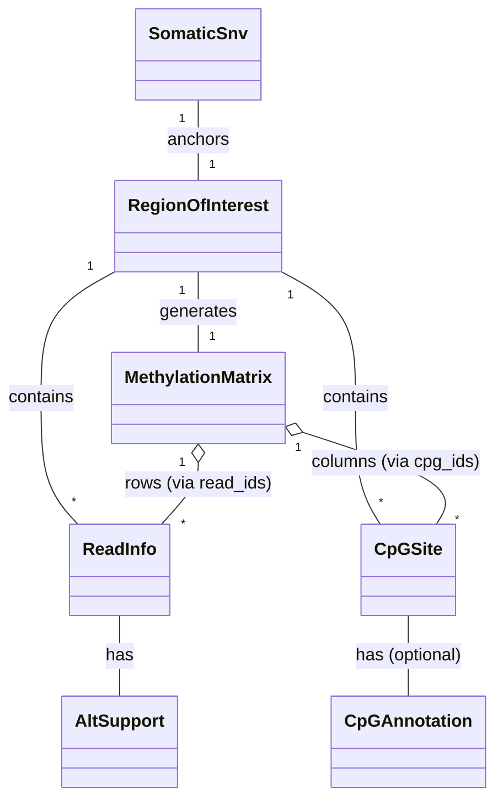

# SNV Read 與甲基化資訊擷取設計 (詳細版)

## 1. 概述 (Overview)

本模組負責 InterSubMod 系統的核心資料擷取階段。對於每一個 Somatic SNV（體細胞單核苷酸變異），本模組定義一個感興趣區域（Region of Interest, ROI），從 BAM 檔案中擷取所有相關的定序 reads，解析其甲基化資訊（MM/ML tags），並建構 Read×CpG 甲基化矩陣。

**核心挑戰**：

- 正確解析 CIGAR 與 MM/ML tags，將 read-level 座標轉換為 hg38 參考基因組座標
- 處理單一 SNV 位點 ±2000bp 範圍內的所有資訊
- 使用 HTSlib 的平行化功能，確保記憶體使用合理
- 建立清晰的資料結構關聯，支援後續的距離計算與聚類分析

## 2. 資料結構與關聯 (Data Structures & Relationships)

本設計依賴於 `include/core/` 中定義的核心結構。

### 2.1 核心實體 (Core Entities)

- **SomaticSnv**: 錨點 (Anchor point)
  - `snv_id`: 內部 SNV ID
  - `chr_id`: 染色體 ID（透過 ChromIndex 映射）
  - `pos`: 1-based 位置（hg38 座標系）
  - `ref_base`, `alt_base`: 參考與變異鹼基
  - **用途**: 定義分析區域的中心點

- **RegionOfInterest**: 定義為 `SNV.pos ± WindowSize` (預設 2000bp)
  - `region_id`: 唯一區域 ID（用於輸出資料夾命名）
  - `snv_id`: 關聯的 SNV
  - `chr_id`, `win_start_pos`, `win_end_pos`: 視窗範圍
  - **用途**: 平行化處理的基本單位

- **ReadInfo**: read 的元數據與標籤組合
  - `read_id`: 內部 read ID（區域內唯一）
  - `read_name`: QNAME（用於除錯與輸出）
  - `chr_id`, `align_start`, `align_end`: 比對位置（0-based）
  - `mapq`: 映射品質
  - `hp_tag`: 單倍型標籤（0=Unknown, 1=HP1, 2=HP2）
  - `is_tumor`: 是否來自腫瘤 BAM
  - `alt_support`: 對 SNV 的支援狀態（ALT/REF/UNKNOWN）
  - **關鍵**: 此結構整合了 read 的所有標籤資訊，是後續聚類分析的基礎

- **CpGSite**: CpG 位點的基因組位置
  - `cpg_id`: 內部 CpG ID
  - `chr_id`, `pos`: 1-based 座標（hg38）
  - `in_pmd`, `in_repressive_state`, `accessible`: 註解資訊（階段1可先設為false）
  - **用途**: 矩陣的欄位索引

- **MethylationMatrix**: 輸出結構，包含 Read×CpG 矩陣
  - `region_id`: 關聯的區域
  - `read_ids`: row 索引 → ReadInfo.read_id
  - `cpg_ids`: column 索引 → CpGSite.cpg_id
  - `raw_matrix`: Eigen::MatrixXd，數值 0.0-1.0 或 NaN
  - `binary_matrix`: Eigen::MatrixXi，數值 1/0/-1
  - **關鍵設計**: 透過 `read_ids` 與 `cpg_ids` 向量建立索引映射，支援稀疏資料的高效存取

### 2.2 資料結構關聯圖 (Relationships)



**關聯性說明**：

- 一個 SNV 定義一個 Region
- 一個 Region 包含多個 Reads 與多個 CpG Sites
- MethylationMatrix 透過索引向量關聯到 ReadInfo 與 CpGSite
- 這種設計允許快速查詢「某個 read 在某個 CpG 的甲基化狀態」

### 2.3 標籤組合狀態編碼 (Tag Combination Encoding)

為了高效檢查 read 的複合狀態（如「腫瘤樣本 + HP1 + 支援 ALT」），使用 bitmask 編碼：

```cpp
enum ReadStateBits : uint8_t {
    STATE_TUMOR     = 0x01,  // bit 0: is_tumor
    STATE_HP1       = 0x02,  // bit 1: hp_tag == 1
    STATE_HP2       = 0x04,  // bit 2: hp_tag == 2
    STATE_ALT       = 0x08,  // bit 3: alt_support == ALT
    STATE_REF       = 0x10,  // bit 4: alt_support == REF
    STATE_UNKNOWN   = 0x20   // bit 5: alt_support == UNKNOWN
};

// 使用範例
uint8_t state = 0;
if (read.is_tumor) state |= STATE_TUMOR;
if (read.hp_tag == 1) state |= STATE_HP1;
if (read.alt_support == AltSupport::ALT) state |= STATE_ALT;
```

**好處**: 單一位元組即可表達 read 狀態，輸出時可直接儲存，後續分析時快速篩選。

## 3. 詳細工作流程 (Detailed Workflow)

處理過程採用平行化方式執行，每個執行緒處理一個區塊的 SNVs (Regions)。

### 3.1 初始化 (Initialization)

1. **載入參考基因組** (Reference Genome, fasta)
    - 使用 `fai_load` 建立索引
    - 目的：識別 CpG context 與進行 CIGAR 解碼
    - **記憶體考量**: 不要一次載入整個染色體，使用 `faidx_fetch_seq` 按需載入區域序列

2. **載入 Somatic SNV Table**
    - 從 VCF 讀取或從預先處理的 TSV 讀取
    - 建立 `std::vector<SomaticSnv>`
    - 產生 `std::vector<RegionOfInterest>`（每個 SNV 產生一個 Region）

3. **初始化 HTSlib**
    - 設定 `hts_set_threads(samFile*, n_threads)` 用於解壓縮
    - **關鍵**: 每個 worker thread 需要自己的 `samFile*` handle 以避免互斥鎖
    - 預先載入 BAM index (`sam_index_load`)

### 3.2 平行區域處理 (Parallel Region Processing)

**平行化架構**:

```cpp
#pragma omp parallel for schedule(dynamic)
for (int i = 0; i < regions.size(); i++) {
    RegionOfInterest& region = regions[i];
    
    // 每個執行緒有自己的 BamReader
    thread_local BamReader tumor_reader("path/to/tumor.bam");
    thread_local BamReader normal_reader("path/to/normal.bam");
    thread_local FastaReader ref_reader("path/to/hg38.fa");
    
    // 處理 region
    process_region(region, tumor_reader, normal_reader, ref_reader);
}
```

**對於每個 `RegionOfInterest`**：

#### 步驟 1: BAM 查詢 (BAM Query)

- 使用 `sam_itr_querys` 擷取重疊於視窗 `[win_start_pos, win_end_pos]` 範圍內的 reads
- **HTSlib API**:

    ```cpp
    hts_itr_t* iter = sam_itr_querys(idx, hdr, region_str);
    bam1_t* b = bam_init1();
    while (sam_itr_next(fp, iter, b) >= 0) {
        // 處理 read
    }
    bam_destroy1(b);
    hts_itr_destroy(iter);
    ```

- **最佳化**:
  - 使用 thread-local `samFile*` handle 避免互斥鎖競爭
  - 重複使用 `bam1_t*` 指標，減少記憶體配置次數

#### 步驟 2: Read 解析與過濾 (Read Parsing & Filtering)

**基本資訊擷取**:

- QNAME: `bam_get_qname(b)`
- FLAG: `b->core.flag`
- MAPQ: `b->core.qual`
- 比對位置: `b->core.pos` (0-based), 計算 end = pos + bam_cigar2rlen()

**過濾條件**:

```cpp
bool should_filter(const bam1_t* b) {
    // 1. 檢查 FLAG
    if (b->core.flag & BAM_FSECONDARY) return true;  // 次要比對
    if (b->core.flag & BAM_FSUPPLEMENTARY) return true;  // 補充比對
    if (b->core.flag & BAM_FDUP) return true;  // 重複
    if (b->core.flag & BAM_FUNMAP) return true;  // 未比對
    
    // 2. 檢查 MAPQ
    if (b->core.qual < min_mapq) return true;  // 預設 20
    
    // 3. 檢查 read 長度
    int read_len = bam_cigar2qlen(b->core.n_cigar, bam_get_cigar(b));
    if (read_len < min_read_length) return true;  // 預設 1000
    
    // 4. 必須包含 MM 與 ML tags
    if (!bam_aux_get(b, "MM") || !bam_aux_get(b, "ML")) return true;
    
    return false;
}
```

**標籤擷取**:

```cpp
// HP tag (Haplotype)
int hp_tag = 0;
uint8_t* hp_aux = bam_aux_get(b, "HP");
if (hp_aux) hp_tag = bam_aux2i(hp_aux);

// PS tag (Phase Set) - 用於驗證一致性
int32_t ps_tag = 0;
uint8_t* ps_aux = bam_aux_get(b, "PS");
if (ps_aux) ps_tag = bam_aux2i(ps_aux);
```

**Somatic 支援檢查** (AltSupport determination):

這是**關鍵步驟**，需要判斷 read 在 SNV 位置是否支援 ALT/REF/UNKNOWN。

```cpp
AltSupport determine_alt_support(
    const bam1_t* b, 
    const SomaticSnv& snv,
    const std::string& ref_seq,
    int ref_start_pos
) {
    int32_t snv_pos = snv.pos;  // 1-based
    int32_t read_start = b->core.pos;  // 0-based
    int32_t read_end = bam_endpos(b);  // 0-based, exclusive
    
    // 1. 檢查 read 是否覆蓋 SNV 位置
    if (snv_pos < read_start + 1 || snv_pos > read_end) {
        return AltSupport::UNKNOWN;  // 未覆蓋
    }
    
    // 2. 透過 CIGAR 找到 SNV 在 read sequence 中的位置
    int read_offset = -1;
    int ref_offset = read_start;  // 目前參考位置
    int seq_offset = 0;  // 目前 read sequence 位置
    
    uint32_t* cigar = bam_get_cigar(b);
    for (int i = 0; i < b->core.n_cigar; i++) {
        int op = bam_cigar_op(cigar[i]);
        int len = bam_cigar_oplen(cigar[i]);
        
        switch (op) {
            case BAM_CMATCH:
            case BAM_CEQUAL:
            case BAM_CDIFF:
                // M/=/X: 同時消耗 ref 與 seq
                if (ref_offset <= snv_pos - 1 && snv_pos - 1 < ref_offset + len) {
                    read_offset = seq_offset + (snv_pos - 1 - ref_offset);
                    goto found;
                }
                ref_offset += len;
                seq_offset += len;
                break;
            case BAM_CINS:
            case BAM_CSOFT_CLIP:
                // I/S: 只消耗 seq
                seq_offset += len;
                break;
            case BAM_CDEL:
            case BAM_CREF_SKIP:
                // D/N: 只消耗 ref
                if (ref_offset <= snv_pos - 1 && snv_pos - 1 < ref_offset + len) {
                    return AltSupport::UNKNOWN;  // SNV 落在 deletion 中
                }
                ref_offset += len;
                break;
            case BAM_CHARD_CLIP:
                // H: 不消耗
                break;
        }
    }
    
found:
    if (read_offset == -1) {
        return AltSupport::UNKNOWN;  // 未找到（理論上不應發生）
    }
    
    // 3. 檢查 base quality
    uint8_t* qual = bam_get_qual(b);
    if (qual[read_offset] < min_base_quality) {  // 預設 20
        return AltSupport::UNKNOWN;
    }
    
    // 4. 比對鹼基
    uint8_t* seq = bam_get_seq(b);
    char base = seq_nt16_str[bam_seqi(seq, read_offset)];
    
    if (base == snv.alt_base) return AltSupport::ALT;
    if (base == snv.ref_base) return AltSupport::REF;
    return AltSupport::UNKNOWN;
}
```

**重要性**: 此邏輯確保只有**高品質且明確覆蓋 SNV 位置**的 reads 才會被標記為 ALT/REF，避免統計偏差。

#### 步驟 3: 甲基化解析 (Methylation Parsing) - 最關鍵步驟

**目標**: 將 `MM` (delta-encoded 相對位置) 轉換為 **hg38 基因組座標 (Genomic Coordinates)**。

**MM/ML Tags 格式說明**:

- `MM`: 例如 `C+m?,3,5,0,2,...;`
  - `C+m?`: 5-Methylcytosine (5mC) 修飾
  - 後續數字為 delta-encoded skip counts（相對於 read SEQ 中的 'C' 位置）
- `ML`: 例如 `[255, 128, 200, ...]` (uint8 陣列)
  - 每個數值對應 MM 中的一個位點，機率 = ML[i] / 255.0

**演算法** (詳細步驟):

```cpp
struct MethylCall {
    uint32_t ref_pos;  // 1-based, hg38 座標
    float probability;
};

std::vector<MethylCall> parse_methylation(
    const bam1_t* b,
    const std::string& ref_seq,
    uint32_t ref_start_pos  // ref_seq 的起始座標（0-based）
) {
    std::vector<MethylCall> calls;
    
    // 1. 擷取 MM 與 ML tags
    uint8_t* mm_aux = bam_aux_get(b, "MM");
    uint8_t* ml_aux = bam_aux_get(b, "ML");
    if (!mm_aux || !ml_aux) return calls;
    
    const char* mm_str = bam_aux2Z(mm_aux);
    // ML 是 array: ml_aux[0] = 'B', ml_aux[1] = 'C' (uint8), 
    // ml_aux[2..5] = array length (little endian)
    uint32_t ml_len = le_to_u32(ml_aux + 2);
    const uint8_t* ml_data = ml_aux + 6;
    
    // 2. 解析 MM 字串，找到 "C+m?" 段落
    // 格式: C+m?,delta1,delta2,...;
    std::vector<int> deltas = parse_mm_deltas(mm_str, "C+m?");
    if (deltas.size() != ml_len) {
        // 錯誤：長度不匹配
        return calls;
    }
    
    // 3. 建立 read_seq_index -> ref_pos 的映射（透過 CIGAR）
    std::vector<int32_t> seq_to_ref = build_seq_to_ref_map(b, ref_start_pos);
    
    // 4. 遍歷 MM deltas，轉換為參考座標
    int c_index = 0;  // read SEQ 中的 'C' 計數
    int mm_index = 0;  // MM 陣列索引
    
    uint8_t* seq = bam_get_seq(b);
    int seq_len = b->core.l_qseq;
    
    for (int i = 0; i < seq_len; i++) {
        char base = seq_nt16_str[bam_seqi(seq, i)];
        
        if (base == 'C') {
            if (mm_index < deltas.size() && c_index == deltas[mm_index]) {
                // 這個 'C' 有甲基化資訊
                int32_t ref_pos = seq_to_ref[i];  // -1 表示未映射（如 insertion）
                
                if (ref_pos >= 0) {
                    // 驗證：檢查參考序列該位置是否為 'C'
                    int ref_offset = ref_pos - ref_start_pos;
                    if (ref_offset >= 0 && ref_offset < ref_seq.size()) {
                        char ref_base = ref_seq[ref_offset];
                        if (ref_base == 'C' || ref_base == 'c') {
                            // 確認為 CpG？（檢查下一個鹼基是否為 'G'）
                            if (ref_offset + 1 < ref_seq.size()) {
                                char next_base = ref_seq[ref_offset + 1];
                                if (next_base == 'G' || next_base == 'g') {
                                    // 合法的 CpG
                                    float prob = ml_data[mm_index] / 255.0f;
                                    calls.push_back({ref_pos + 1, prob});  // 轉為 1-based
                                }
                            }
                        }
                    }
                }
                mm_index++;
            }
            c_index++;
        }
    }
    
    return calls;
}
```

**關鍵輔助函式**: `build_seq_to_ref_map`

```cpp
std::vector<int32_t> build_seq_to_ref_map(const bam1_t* b, uint32_t ref_start_pos) {
    std::vector<int32_t> seq_to_ref(b->core.l_qseq, -1);
    
    int ref_pos = b->core.pos;  // 0-based
    int seq_pos = 0;
    
    uint32_t* cigar = bam_get_cigar(b);
    for (int i = 0; i < b->core.n_cigar; i++) {
        int op = bam_cigar_op(cigar[i]);
        int len = bam_cigar_oplen(cigar[i]);
        
        switch (op) {
            case BAM_CMATCH:
            case BAM_CEQUAL:
            case BAM_CDIFF:
                // M/=/X
                for (int j = 0; j < len; j++) {
                    seq_to_ref[seq_pos++] = ref_pos++;
                }
                break;
            case BAM_CINS:
                // I: seq 不對應 ref
                seq_pos += len;
                break;
            case BAM_CDEL:
            case BAM_CREF_SKIP:
                // D/N: ref 前進但 seq 不動
                ref_pos += len;
                break;
            case BAM_CSOFT_CLIP:
                // S: seq 前進但不對應 ref
                seq_pos += len;
                break;
            case BAM_CHARD_CLIP:
                // H: 不計入 seq
                break;
        }
    }
    
    return seq_to_ref;
}
```

**驗證重點**:

- 確保計算出的 ref_pos 在參考序列中確實為 'C'
- 確認是 CpG context（'CG' dinucleotide）
- 處理邊界條件（如 read 在染色體邊緣）

#### 步驟 4: 矩陣建構 (Matrix Construction)

收集該區域內所有 reads 的甲基化資訊後，建構矩陣。

**流程**:

```cpp
void build_matrix_for_region(
    const RegionOfInterest& region,
    const std::vector<ReadInfo>& reads,
    const std::vector<std::vector<MethylCall>>& methyl_calls  // per-read
) {
    // 1. 收集所有唯一的 CpG 位點
    std::set<uint32_t> unique_cpg_positions;
    for (const auto& calls : methyl_calls) {
        for (const auto& call : calls) {
            unique_cpg_positions.insert(call.ref_pos);
        }
    }
    
    // 2. 建立 CpGSite 列表（排序）
    std::vector<CpGSite> sites;
    int cpg_id = 0;
    for (uint32_t pos : unique_cpg_positions) {
        sites.push_back({cpg_id++, region.chr_id, pos, false, false, false});
    }
    
    // 3. 建立位置 -> column index 的映射
    std::unordered_map<uint32_t, int> pos_to_col;
    for (int col = 0; col < sites.size(); col++) {
        pos_to_col[sites[col].pos] = col;
    }
    
    // 4. 初始化矩陣（預設 NaN / -1）
    int n_reads = reads.size();
    int n_sites = sites.size();
    
    Eigen::MatrixXd raw_matrix = Eigen::MatrixXd::Constant(n_reads, n_sites, NAN);
    Eigen::MatrixXi binary_matrix = Eigen::MatrixXi::Constant(n_reads, n_sites, -1);
    
    // 5. 填入甲基化數值
    for (int row = 0; row < n_reads; row++) {
        for (const auto& call : methyl_calls[row]) {
            auto it = pos_to_col.find(call.ref_pos);
            if (it != pos_to_col.end()) {
                int col = it->second;
                raw_matrix(row, col) = call.probability;
                
                // 二值化（可調閾值）
                if (call.probability >= 0.8) {
                    binary_matrix(row, col) = 1;  // 甲基化
                } else if (call.probability <= 0.2) {
                    binary_matrix(row, col) = 0;  // 非甲基化
                } else {
                    binary_matrix(row, col) = -1;  // 不確定
                }
            }
        }
    }
    
    // 6. 建立 MethylationMatrix 結構
    MethylationMatrix matrix;
    matrix.region_id = region.region_id;
    matrix.read_ids.resize(n_reads);
    for (int i = 0; i < n_reads; i++) {
        matrix.read_ids[i] = reads[i].read_id;
    }
    matrix.cpg_ids.resize(n_sites);
    for (int i = 0; i < n_sites; i++) {
        matrix.cpg_ids[i] = sites[i].cpg_id;
    }
    matrix.raw_matrix = std::move(raw_matrix);
    matrix.binary_matrix = std::move(binary_matrix);
    
    // 7. 輸出
    write_matrix_to_disk(matrix, reads, sites);
}
```

**預設值設計的重要性**:

- `NaN` (raw) / `-1` (binary): 表示「該 read 在該 CpG 無資料」
- `0.0` (raw) / `0` (binary): 表示「該 CpG 未甲基化」
- 兩者**必須區分**，否則在距離計算時會產生錯誤的相似度

#### 步驟 5: 輸出 (Output)

將結果寫入檔案系統，結構清晰便於驗證。

## 4. 輸出目錄結構 (Output Directory Structure)

為了支援大規模處理與易於驗證，輸出以 Region ID 進行組織。

```text
/big8_disk/liaoyoyo2001/InterSubMod/output/
├── region_0/
│   ├── matrix_raw.csv          # Read × CpG 機率矩陣
│   ├── matrix_binary.csv       # Read × CpG 二值矩陣（1/0/-1）
│   ├── reads.jsonl             # Read Metadata (每行一個 read)
│   ├── sites.csv               # CpG Site 座標列表
│   └── debug_cigar.txt         # CIGAR 解析詳細資訊（測試用）
├── region_1/
│   └── ...
├── region_31/
│   └── ...
└── summary_report.txt          # 全域摘要
```

**各檔案格式**:

1. **matrix_raw.csv**:

```csv
read_id,cpg_0,cpg_1,cpg_2,...
0,0.95,NaN,0.12,...
1,0.87,0.23,NaN,...
```

2. **matrix_binary.csv**:

```csv
read_id,cpg_0,cpg_1,cpg_2,...
0,1,-1,0,...
1,1,0,-1,...
```

3. **reads.jsonl** (每行一個 JSON 物件):

```json
{"read_id":0,"read_name":"read_001","chr":"chr17","align_start":7577000,"align_end":7580500,"mapq":60,"hp":1,"is_tumor":true,"alt_support":"ALT","state_bits":11}
{"read_id":1,"read_name":"read_002","chr":"chr17","align_start":7576800,"align_end":7579200,"mapq":58,"hp":2,"is_tumor":true,"alt_support":"REF","state_bits":21}
```

4. **sites.csv**:

```csv
cpg_id,chr,pos
0,chr17,7578001
1,chr17,7578056
2,chr17,7578102
```

5. **debug_cigar.txt** (測試階段):

```
Region 0: chr17:7576000-7580000 (SNV at 7578000, REF=C, ALT=T)

Read: read_001
  Alignment: chr17:7577000-7580500, MAPQ=60
  CIGAR: 150M2D200M3I1500M
  HP=1, Tumor=true
  SNV position check:
    SNV at ref 7578000 -> read offset 1000
    Base at offset 1000: T (QUAL=35)
    -> AltSupport: ALT
  Methylation sites found: 15
    CpG 7578001: ML=242/255 (0.949)
    CpG 7578056: ML=198/255 (0.776)
    ...
```

## 5. 實作細節與驗證 (Implementation Details & Verification)

### 5.1 HTSlib 使用規範

**平行化**:

```cpp
// 主執行緒初始化
samFile* template_fp = sam_open("tumor.bam", "r");
hts_set_threads(template_fp, 4);  // 啟用 4 執行緒解壓縮
sam_close(template_fp);

// Worker threads
#pragma omp parallel
{
    // 每個執行緒開啟自己的 handle
    samFile* fp = sam_open("tumor.bam", "r");
    bam_hdr_t* hdr = sam_hdr_read(fp);
    hts_idx_t* idx = sam_index_load(fp, "tumor.bam");
    
    // ... 處理 ...
    
    hts_idx_destroy(idx);
    bam_hdr_destroy(hdr);
    sam_close(fp);
}
```

**記憶體管理**:

- 使用 RAII wrapper 自動管理 `bam1_t*` 生命週期
- 在迴圈中重複使用同一個 `bam1_t*`，減少 malloc/free 次數
- 明確呼叫 `bam_destroy1` 釋放

### 5.2 CIGAR 解析驗證清單

**必須處理的操作**:

- `M` (BAM_CMATCH): Match/Mismatch，消耗 ref 與 seq
- `=` (BAM_CEQUAL): Exact match
- `X` (BAM_CDIFF): Mismatch
- `I` (BAM_CINS): Insertion，只消耗 seq
- `D` (BAM_CDEL): Deletion，只消耗 ref
- `N` (BAM_CREF_SKIP): Skipped region (如 intron)
- `S` (BAM_CSOFT_CLIP): Soft clip，在 SEQ 中但未比對
- `H` (BAM_CHARD_CLIP): Hard clip，不在 SEQ 中

**MM tag 與 Soft Clip 的關係**:

- **標準行為**: MM tag 索引的是 SEQ 欄位（包含 Soft Clip）
- **驗證方法**: 使用 `samtools view` 輸出特定 read 的 MM/ML tags，手動計算驗證

### 5.3 測試案例設計 (32 SNVs)

**資源監控**:

```cpp
class RegionTimer {
    std::chrono::steady_clock::time_point start;
    int region_id;
public:
    RegionTimer(int id) : region_id(id), start(std::chrono::steady_clock::now()) {}
    ~RegionTimer() {
        auto end = std::chrono::steady_clock::now();
        auto duration = std::chrono::duration_cast<std::chrono::milliseconds>(end - start);
        log_region_time(region_id, duration.count());
    }
};
```

**記憶體追蹤**:

- 使用已有的 `ResourceMonitor` class
- 在每個 region 處理前後記錄 RSS
- 最終輸出 Peak RSS

**正確性驗證**:

1. 與 `samtools view -c` 比對 read 數量
2. 隨機選擇 3-5 個 reads，手動驗證 CIGAR 解析結果
3. 選擇 2-3 個已知的 CpG 位點，驗證座標是否為 'CG'
4. 檢查矩陣中是否有合理的 NaN 分布（不應全為數值）

## 6. 記憶體管理策略 (Memory Management)

### 6.1 矩陣儲存

**選擇**: 使用 `Eigen::MatrixXd` / `Eigen::MatrixXi`

**原因**:

- 連續記憶體配置，cache-friendly
- 支援 SIMD 加速運算（後續距離計算會用到）
- 避免 `vector<vector<>>` 的指標跳躍開銷

**預期大小**:

- 假設一個 region (±2000bp) 平均有 50 reads, 200 CpG sites
- `MatrixXd`: 50 × 200 × 8 bytes = 80 KB
- `MatrixXi`: 50 × 200 × 4 bytes = 40 KB
- **總計每個 region 約 120 KB**，32 個 region 約 4 MB（完全可接受）

### 6.2 字串處理

- 內部使用整數 ID（`read_id`, `cpg_id`）
- 僅在輸出時轉換為字串（`read_name`）
- 避免在 tight loop 中進行字串拼接

### 6.3 參考序列快取

```cpp
class FastaCache {
    std::unordered_map<std::string, std::string> cache_;  // region_key -> seq
    faidx_t* fai_;
    
public:
    std::string get_sequence(const std::string& chr, int start, int end) {
        std::string key = chr + ":" + std::to_string(start) + "-" + std::to_string(end);
        auto it = cache_.find(key);
        if (it != cache_.end()) return it->second;
        
        int len;
        char* seq = faidx_fetch_seq(fai_, chr.c_str(), start, end, &len);
        std::string result(seq);
        free(seq);
        
        cache_[key] = result;
        return result;
    }
};
```

## 7. 與後續模組的介面 (Interface to Next Modules)

本模組的輸出（`MethylationMatrix` + `ReadInfo` + `CpGSite`）將作為後續模組的輸入：

- **距離計算模組**: 讀取 `matrix_binary.csv` 與 `reads.jsonl`，計算 read 間的 Hamming 距離
- **聚類模組**: 基於距離矩陣進行階層聚類
- **關聯分析模組**: 結合 `reads.jsonl` 中的 `hp`, `alt_support`, `is_tumor` 進行統計檢定

**資料完整性保證**:

- 所有索引（`read_id`, `cpg_id`）在 region 內唯一且連續（0..N-1）
- CSV 檔案必須包含表頭
- JSONL 每行必須是合法的 JSON 物件
