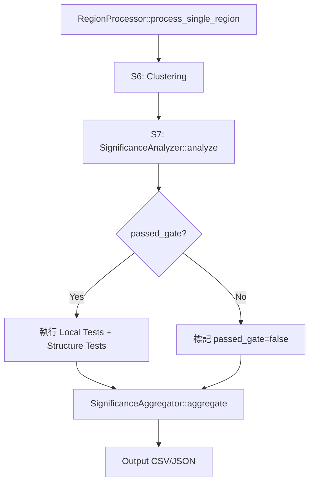

<!--
建立時間: unknown (legacy)
metadata補齊時間: 2026-03-01 03:02
狀態: legacy
資料來源: 歷史文件補齊（內容未改寫）
驗證命令: python3 scripts/analysis/validate_docs_structure.py
關聯文件: docs/standards/20260228_文件命名與狀態管理規範_01.md
-->

# 顯著性分析功能開發計畫書

本文件整合並詳述 **InterSubMod** 專案「顯著性分析 (Significance Analysis)」模組的完整開發計畫，包括程式碼流程、核心概念、開發要求、各階段實作細節與測試重點。

---

## 1. 專案背景與目標

### 1.1 核心問題
InterSubMod 專案旨在探討 **Somatic 變異與甲基化結構的關聯**。目前系統能夠計算 Read 間距離並進行分群，但缺乏客觀的統計指標來回答：

| 問題 | 說明 |
|------|------|
| **分群真實性** | 分群結構是否真實存在，還是僅為隨機雜訊？ |
| **標籤關聯性** | 分群是否與已知生物標籤（HP/Tumor/ALT-REF）相關？ |
| **Somatic 驗證** | 該位點是否為真實的 Somatic 變異？ |

### 1.2 研究假設

> **假設**：在部分高信心的 Somatic 變異區域，其真實變異可能伴隨著可重現的 Read-level 甲基化結構差異。  
> **限制**：此現象受 PMD、CNV 或低覆蓋度影響，本模組目標是**篩選出具備此特徵的高信心位點**。

### 1.3 目標功能

實作一套多層次統計檢定流程，輸出：

1. **全域關聯性 (Global Association)**: 檢定甲基化分群與 ALT/REF、HP、Tumor/Normal 標籤的關聯
2. **局部解釋性 (Local Interpretation)**: 識別驅動關聯的特定分群與其效應量
3. **結構真實性 (Structural Validation)**: 排除隨機噪音與群內分散度對分群的假性影響
4. **結果校準 (Calibration)**: 轉化統計指標為經 SEQC2 真值校準的「信心分數」

---

## 2. 開發規範與限制

> [!IMPORTANT]
> 以下規範來自 `Development Spec.md`，所有開發必須嚴格遵守。

### 2.1 Language Ownership 與後處理責任分界

> [!CAUTION]
> **原則：統計計算與高計算量任務必須由 C++ Core 完成；Python 僅做最終彙整比較與視覺化，不得引入新的統計結論。**

#### 2.1.1 C++ Core（唯一統計結論來源）

| 責任 | 說明 |
|------|------|
| **統計量產出** | 產生所有 per-region 與 run-level 的統計量與判讀旗標（`p_*`、`dispersion_warning`、`passed_gate`、`valid_flag`、`invalid_reason`） |
| **高計算量流程** | 執行 Fisher exact/MC、PERMANOVA、permutation、bootstrap、silhouette 等 |
| **多重校正** | 預設在 C++ 產生 BH/FDR；若策略暫時不做，必須輸出完整可校正的原始欄位 |

#### 2.1.2 Python Tools（低計算量後處理與跨樣本比較）

Python **只允許**以下操作：

| 允許操作 | 說明 |
|---------|------|
| **彙整與繪圖** | 將 C++ 輸出結果進行彙整、比較、繪圖（QQ plot、density plot、ROC/PR curve 等） |
| **跨 VCF/run 比較** | 統一欄位、對齊 region key、產出比較報告（差異表、交集/聯集統計、排名變化） |
| **資料重排/合併** | O(N)～O(N log N) 等級處理 |
| **q-value 新增** | 若需新增 q-value（BH），只能以「新增欄位」形式輸出，保留原始 `p_*` 欄位與版本資訊 |

> [!WARNING]
> **禁止操作**：Python **不得**重新計算 PERMANOVA / permutation / bootstrap / MC Fisher，也不得以任何方式改動 C++ 的檢定結果與判讀旗標。

### 2.2 核心開發原則

| 項目 | 規範 |
|------|------|
| **Scope** | 目前**不實作** calibration/ML，但需保留未來可用的輸出欄位與格式 |
| **Parallelization** | Region-level、距離矩陣、permutation/MC 可平行化；避免巢狀 OMP 過度訂閱 |
| **OOP & Modularity** | 拆分為獨立模組：`Statistics/Significance/StructureTest/Dispersion/Bootstrap/Report` |
| **Comments** | 重要演算法必須有完整英文註解（Fisher 定義、MC 停止規則、PERMANOVA、數值穩定性） |
| **Reproducibility** | 所有隨機流程必須可設定 seed，並寫入輸出 |

### 2.3 處理模式

| 模式 | 說明 |
|------|------|
| **Tumor-only** | 只分析 tumor reads |
| **Mixed** | Tumor/Normal 共同分析，保留 sample label，允許檢驗「位點顯著與 Tumor/Normal 無關」 |

### 2.4 標籤定義與 Dynamic Encoding（雙層設計）

#### 2.4.1 標籤維度

```
標籤維度:
├── Allele: ALT / REF / UNKNOWN
├── HP: HP1 / HP2 / HP1-1 / HP2-1 / HP3 / unphase (以 longphase-s 規則為準)
├── Strand: F / R
└── Sample: Tumor / Normal
```

#### 2.4.2 雙層編碼設計

為避免 RxC 列聯表過度稀疏而拖垮 MC Fisher 效能，採用**雙層編碼**：

| 層級 | 用途 | 編碼方式 | 說明 |
|------|------|---------|------|
| **統計檢定用 Label** | Fisher / Chi-square 檢定 | 低維二元/少類別 | 例如：僅用 `ALT/REF`、`HP1/HP2`、`Tumor/Normal` 的單一維度 |
| **Debug 組合碼** | 追溯與除錯 | 高維完整記錄 | `HP × Allele × Strand × Sample` 完整組合碼 |

```cpp
// 統計檢定用（低維）
enum class TestLabel {
    ALT, REF,           // Allele 維度
    HP1, HP2, HP_OTHER, // HP 維度（合併稀有類別）
    TUMOR, NORMAL       // Sample 維度
};

// Debug 組合碼（高維）
struct FullLabel {
    Allele allele;
    HP hp;
    Strand strand;
    Sample sample;
    uint16_t combo_code;  // HP × Allele × Strand × Sample
};
```

#### 2.4.3 Composability 規則

- 必須能從組合碼**投影回單一維度**（例如只看 ALT/REF 或只看 HP）
- 輸出 code 對照表與版本號，確保跨版本可追溯

### 2.5 效能目標

> **Performance Target**: 30,000 點在 120 執行緒下約 **10 分鐘**完成；若未達標需紀錄瓶頸與調整策略。

---

## 3. 開發階段總覽


---

## 4. Phase 1: 基礎統計函式庫

### 4.1 目標
建立穩健的數學底層，確保與 R `fisher.test` 結果一致。

### 4.2 開發任務

#### 4.2.1 `MathUtils` 擴充

| 函式 | 說明 | 測試重點 |
|------|------|---------|
| `log_factorial(n)` | 對數階乘，避免大數溢位 | 驗證與 R `lfactorial()` 一致 |
| `odds_ratio(a, b, c, d)` | Haldane-Anscombe correction (+0.5 平滑) | 邊界情況：零值格子 |
| `calculate_cramers_v()` | Cramér's V 效應量 + `is_reliable` 檢查 | 稀疏表格 (期望值 < 5) 標記不可靠 |

#### 4.2.2 `FisherExact` 模組

| 功能 | 規格 | 關鍵細節 |
|------|------|---------|
| **2x2 Fisher Test** | Two-sided，比照 R 定義 | Sum of probabilities ≤ P_observed |
| **RxC Fisher Test (MC)** | Fisher-Freeman-Halton + Monte Carlo | **Stopping Rule**: 計算 p̂ 的 99% Binomial CI，若 CI 完全高於或低於 0.05 才停止 |

> [!WARNING]
> **MC Fisher 停止規則**：務必嚴格測試 CI stopping，避免在 P=0.05 附近過早停止導致誤判。

### 4.3 程式碼結構

```
src/core/
├── MathUtils.cpp        # 數學工具函式
├── MathUtils.hpp
├── FisherExact.cpp      # Fisher 精確檢定實作
└── FisherExact.hpp
```

### 4.4 測試計畫（2×2 Exact 與 RxC MC 分拆）

#### 4.4.1 2×2 Fisher（Exact）測試

| 測試項目 | 檔案 | 驗證方式 |
|---------|------|---------|
| Fisher Test 準確度 | `test_fisher_exact_2x2.cpp` | 與 R `fisher.test()` 完全一致，**誤差 < 1e-6** |
| Log-Factorial 穩定性 | 同上 | 測試 n = 0, 1, 100, 10000 |
| 邊界情況 | 同上 | 零值格子、極端不平衡表格 |

#### 4.4.2 RxC Fisher（Monte Carlo）測試

| 測試項目 | 驗證方式 |
|---------|---------|
| 固定 Seed 一致性 | 固定 seed 與抽樣數，與 R 模擬版本一致到 **1e-3～1e-2** 誤差 |
| 信賴區間覆蓋檢查 | 驗證 C++ 結果的 CI 包含 R 結果 |
| MC Stopping Rule | P ≈ 0.05 附近的收斂行為 |

> [!CAUTION]
> **禁止**以「誤差 < 1e-6」作為 MC 方法的硬門檻，MC 本質上有隨機變異。

---

## 5. Phase 2: 全域與局部檢定

### 5.1 目標
實作核心業務邏輯與 Gating 規則。

### 5.2 全域檢定 (`GlobalTest.cpp`)

#### 5.2.1 檢定優先順序
**ALT/REF** > **HP** > **Tumor/Normal**

#### 5.2.2 方法

| 方法 | 說明 | 條件 |
|------|------|------|
| Fisher-Freeman-Halton (MC) | 主力方法 | 始終執行 |
| Chi-square Test | 輔助方法 | 僅在期望值 ≥ 5 的格子 > 80% 時報告 |

#### 5.2.3 Gating Logic

```cpp
if (global_p_value > 0.1) {
    passed_gate = false;
    // 後續不執行 Bootstrap/Local Tests 以節省資源
}
```

### 5.3 局部檢定 (`LocalTest.cpp`)

#### 5.3.1 策略
**One-vs-Rest**: 對每個 Cluster 建立 2x2 表格

```
表格結構:
         | Target Cluster | Other Clusters |
---------|----------------|----------------|
Target L |      n11       |      n12       |
Other L  |      n21       |      n22       |
```

#### 5.3.2 效應量輸出

| 指標 | 計算方式 | 用途 |
|------|---------|------|
| `log_odds_ratio` | Haldane correction | 效應方向與強度 |
| `delta_proportion` | P(L\|C_k) - P(L\|Rest) | 直觀差異 |

### 5.4 多重校正

| 層級 | 處理方式 |
|------|---------|
| C++ 端 | 輸出原始 P-value（必須保留完整欄位） |
| Python 端（選配） | 若需 q-value，以「新增欄位」形式輸出，不得覆蓋原始 p-value |

### 5.5 程式碼結構

```
src/core/
├── GlobalTest.cpp       # 全域關聯檢定
├── GlobalTest.hpp
├── LocalTest.cpp        # 局部詳細檢定
└── LocalTest.hpp
```

### 5.6 測試計畫

| 測試項目 | 驗證方式 |
|---------|---------|
| Gating 邏輯 | 確認被 Gate 掉的 Region 沒有執行後續計算 |
| One-vs-Rest 計數 | 構造已知分布驗證表格正確 |

---

## 6. Phase 3: 進階結構驗證

### 6.1 目標
實作 PERMANOVA 與 Bootstrap，排除 Dispersion 造成的誤判。

### 6.2 距離檢定 (`StructureTest.cpp`)

#### 6.2.1 前置處理：Read Filtering（硬規格）

> [!CAUTION]
> **重要規則**：PERMANOVA 與 Dispersion 計算前必須**過濾 reads 使距離矩陣完整**；禁止使用 `SKIP` 或 `MAX_DIST` 方式插補 invalid pairs 進入 SS/centroid 計算。

##### Read Filtering 演算法（必做）

```cpp
// Step 1: 計算每條 read 的 valid_degree
// valid_degree = (# valid distances to other reads) / (N-1)

// Step 2: Label-agnostic Greedy Pruning
while (distance_matrix.has_invalid_pairs()) {
    read_to_remove = find_read_with_lowest_valid_degree();
    remove_read(read_to_remove);
    
    if (n_reads_valid < Nmin) {
        mark_region_invalid("insufficient_overlap");
        break;
    }
}
```

##### Invalid 規格

若 PERMANOVA 無法形成完整矩陣或有效 reads 過少：

| 欄位 | 值 | 說明 |
|------|-----|------|
| `valid_flag` | `false` | 標記為無效 |
| `invalid_reason` | `insufficient_overlap` | 說明原因 |
| `p_permanova` | `NA` / 空值 | **不得輸出** PERMANOVA p-value |
| 基本效應量 | 可輸出（若可計算） | 例如 Cramér's V |

> 在 summary 中必須註記未執行 PERMANOVA 的原因。

#### 6.2.2 Dispersion Check

| 指標 | 方法 | 警告條件 |
|------|------|---------|
| Mean Distance to Centroid | 計算每群到幾何中心的平均距離 | ANOVA F-test P < 0.05 則標記 `dispersion_warning` |

#### 6.2.3 PERMANOVA

| 參數 | 預設值 | 說明 |
|------|-------|------|
| Permutations | 999 | 可調整 |
| 執行條件 | `passed_gate == true` 且距離矩陣完整 | 僅對通過全域檢定且有效的 Region 執行 |

### 6.3 Cluster Stability (Bootstrap)

| 參數 | 預設值 | 說明 |
|------|-------|------|
| Bootstrap N | 200 | 對 CpG sites 重抽樣 |
| Early Stop | ARI 連續 10 次 < 0.2 或 > 0.9 | 提早停止節省計算 |
| 評估指標 | Adjusted Rand Index (ARI) | ARI < 0.2 視為隨機結構 |

### 6.4 程式碼結構

```
src/core/
├── StructureTest.cpp    # PERMANOVA + Dispersion
├── StructureTest.hpp
├── Bootstrap.cpp        # Cluster 穩定性檢驗
└── Bootstrap.hpp
```

### 6.5 測試計畫

| 測試項目 | 驗證方式 |
|---------|---------|
| 距離矩陣過濾 | 確認無效距離被正確剔除，Greedy Pruning 行為正確 |
| Invalid 標記 | 驗證 N < Nmin 時正確標記 `valid_flag=false` |
| Dispersion 警告 | 構造高分散度資料驗證警告觸發 |
| Bootstrap 收斂 | 驗證 Early Stop 行為 |

---

## 7. Phase 4: 系統整合與輸出

### 7.1 目標
整合至 `RegionProcessor`，產出完整 CSV 報告，支援多 VCF/run 比較。

### 7.2 整合流程



### 7.3 輸出格式定義

#### 7.3.1 Per-Region 輸出 (`significance/`)

| 檔案 | 內容 |
|------|------|
| `summary.tsv` / `summary.json` | 顯著判定、p/q/score、valid/reason、方法啟用狀態 |
| `tables/` | contingency 表格、cluster 統計 |
| `metadata.tsv` / `metadata.json` | seed、門檻、矩陣有效比例 |

#### 7.3.2 Run-Level 輸出

| 檔案 | 內容 |
|------|------|
| `significance_report.csv` | 每個 VCF 位點統計值與顯著結果 |
| `significance_features.csv` | 保留給未來 ML 的特徵欄位 |
| `label_codebook.tsv` | 組合碼對照表、版本號、欄位定義 |
| `significance_schema.json` | 輸出欄位清單、型別、單位、schema version |

#### 7.3.3 統一主鍵（Join Key）規格

> [!IMPORTANT]
> 為支援 Python 進行多個 `.vcf` / 多次 run 的比較，必須保證 C++ 輸出具備一致且可對齊的主鍵（Join Key）與完整欄位字典（Codebook）。

每一筆 region 統計結果**必須包含以下欄位（不可缺漏）**：

| 欄位 | 說明 | 用途 |
|------|------|------|
| `run_id` | 本次執行唯一 ID（由 CLI 或自動生成） | 區分不同執行 |
| `vcf_id` | 輸入 VCF 檔名或 hash | 多 VCF 比較 |
| `bam_id` | 輸入 BAM 檔名或 hash | 追溯來源 |
| `region_id` | 內部 region 序號 | 同 run 內使用 |
| `anchor_key` | 跨 run 可對齊的穩定鍵（**必須**） | 同位點跨 VCF/run 比較 |

##### `anchor_key` 格式

| 變異類型 | 格式 |
|---------|------|
| SNV | `chrom:pos:ref:alt` |
| INDEL（未來） | `chrom:pos:ref:alt:type:length` |

> Python 後處理以 `anchor_key` + `vcf_id/run_id` 作為主要 join keys。

#### 7.3.4 `significance_report.csv` 欄位

| 類別 | 欄位 |
|------|------|
| Join Keys | `run_id`, `vcf_id`, `bam_id`, `region_id`, `anchor_key` |
| Metadata | `valid_flag`, `invalid_reason` |
| Quality | `n_reads`, `n_reads_valid`, `n_cpg`, `overlap_score`, `dispersion_val` |
| Global | `p_alt`, `v_alt`, `p_perm_alt`, `passed_gate`, `dispersion_warning` |
| Local (Best) | `best_cluster_id`, `p_local`, `log_or` |
| Scoring | `heuristic_score`, `score_ambiguous` |

#### 7.3.5 `significance_features.csv` 欄位 (For ML)

| 類別 | 欄位 |
|------|------|
| 品質特徵 | `n_reads_valid`, `n_cpg`, `effective_overlap_median`, `mapq_mean`, `hp0_rate` |
| 統計特徵 | `-log10(p_global)`, `cramers_v`, `max_log_or`, `silhouette_mean` |

#### 7.3.6 欄位字典與版本

C++ 必須輸出：

| 檔案 | 內容 |
|------|------|
| `label_codebook.tsv` | 所有 label 編碼、版本號、欄位定義 |
| `significance_schema.json` | 輸出欄位清單、型別、單位、版本（schema version） |

### 7.4 Decision Rule 與 Heuristic Score

> [!NOTE]
> 本版本不實作校準模型（calibration/ML），因此**不輸出「最終機率分數」**。
> 允許輸出**探索性排序用的 heuristic score**，其用途僅限於候選位點排序與報告呈現，**不得宣稱為 TP 機率**。

#### 7.4.1 Heuristic Score 定義（選配）

| 欄位 | 計算方式 | 用途 |
|------|---------|------|
| `heuristic_score` | `-log10(p_global_alt)` + [結構性證據權重] | 僅供排序 |
| `score_ambiguous` | `true` if `dispersion_warning=true` 或 PERMANOVA 未執行 | 標記分數可信度 |

#### 7.4.2 顯著判定門檻（可調整）

| 參數 | 預設門檻 | 可調整 |
|------|---------|-------|
| p-value | ≤ 0.05 | ✓ |
| q-value | ≤ 0.1 | ✓ |
| score_threshold | 可配置 | ✓ |

### 7.5 CLI 參數

| 參數 | 說明 |
|------|------|
| `--compute-significance` | 啟用顯著性計算 (預設開啟) |
| `--sig-methods` | 選擇啟用的方法 |
| `--sig-seed` | 隨機種子 |
| `--sig-p-threshold` | P-value 門檻 |
| `--run-id` | 指定 run_id（選配，否則自動生成） |

### 7.6 測試計畫

| 測試項目 | 驗證方式 |
|---------|---------|
| 輸出格式 | 確認所有欄位正確產出，包括 Join Keys |
| Aggregator 邏輯 | 驗證多方法整合正確 |
| Schema 輸出 | 驗證 `significance_schema.json` 包含所有欄位定義 |
| 整合測試 | `run_vcf_all_snv.sh --mode chr19-verification --no-plots` |

---

## 8. Phase 5: Python 後處理與校準模型（暫不實作）

> [!NOTE]
> 此階段目前不在開發範圍內，但需保留輸出格式以供未來接入。

### 8.1 目前允許的 Python 操作

| 操作 | 說明 |
|------|------|
| 彙整與繪圖 | QQ plot、density plot、ROC/PR curve |
| 跨 VCF/run 比較 | 使用 `anchor_key` + `vcf_id/run_id` 進行 join |
| 比較報告 | 差異表、交集/聯集統計、排名變化 |

### 8.2 預留功能（未來）

| 功能 | 說明 |
|------|------|
| Truth Alignment | Anchor SNV in SEQC2 TP → Region TP |
| FDR Control | Global BH → q_global |
| Evaluation | AUPRC + Brier Score |

---

## 9. 資料結構設計

### 9.1 新增類別 (`include/core/`)

```cpp
// Stats.hpp
struct ContingencyTable {
    int n11, n12, n21, n22;
    // helper methods
};

struct ClusterStats {
    int cluster_id;
    int size;
    
    // Counts
    int count_hp1, count_hp2;
    int count_tumor, count_normal;
    int count_alt, count_ref;
    
    // Statistics
    double p_value_hp;
    double p_value_tumor;
    double p_value_somatic;
};

struct AssociationResult {
    // Join Keys
    std::string run_id;
    std::string vcf_id;
    std::string bam_id;
    int region_id;
    std::string anchor_key;  // chrom:pos:ref:alt
    
    // Validity
    bool valid_flag;
    std::string invalid_reason;
    
    // Results
    std::vector<ClusterStats> cluster_stats;
    double avg_silhouette_score;
    bool passed_gate;
    bool dispersion_warning;
    
    // Scoring
    double heuristic_score;
    bool score_ambiguous;
};

// 雙層 Label 設計
enum class TestLabel {
    ALT, REF,
    HP1, HP2, HP_OTHER,
    TUMOR, NORMAL
};

struct FullLabel {
    Allele allele;
    HP hp;
    Strand strand;
    Sample sample;
    uint16_t combo_code;
};
```

---

## 10. 模組架構總覽

```
src/core/
├── MathUtils.cpp/hpp          # 數學工具
├── FisherExact.cpp/hpp        # Fisher 檢定
├── GlobalTest.cpp/hpp         # 全域關聯檢定
├── LocalTest.cpp/hpp          # 局部檢定
├── StructureTest.cpp/hpp      # PERMANOVA + Dispersion
├── Bootstrap.cpp/hpp          # Cluster 穩定性
├── SignificanceAnalyzer.cpp/hpp  # 主要分析入口
├── SignificanceAggregator.cpp/hpp # 結果彙整
└── SignificanceReport.cpp/hpp    # CSV/JSON 輸出

include/core/
├── Stats.hpp                  # 統計資料結構
├── LabelEncoding.hpp          # 雙層 Label 編碼
└── SignificanceConfig.hpp     # 參數配置
```

---

## 11. 測試策略總覽

### 11.1 單元測試

| 模組 | 測試檔案 | 重點 |
|------|---------|------|
| MathUtils | `test_math_utils.cpp` | Log-factorial、Odds Ratio 邊界 |
| FisherExact (2x2) | `test_fisher_exact_2x2.cpp` | 與 R 結果比對（誤差 < 1e-6） |
| FisherExact (MC) | `test_fisher_mc.cpp` | 固定 seed 一致性、CI 包含檢查 |
| GlobalTest | `test_global_test.cpp` | Gating 邏輯、稀疏表格處理 |
| LocalTest | `test_local_test.cpp` | One-vs-Rest 計數正確性 |
| StructureTest | `test_structure_test.cpp` | Read Filtering、NaN 過濾、Dispersion 警告 |

### 11.2 整合測試

```bash
# 單點驗證
./scripts/run_vcf_all_snv.sh --mode chr19-verification --no-plots

# 完整流程
./scripts/run_vcf_all_snv.sh --mode all-with-w1000 --threads 120
```

### 11.3 生物驗證

| 資料集 | 預期結果 |
|-------|---------|
| SEQC2 TP 位點 | P-value < 0.05，Silhouette 高 |
| SEQC2 FP 位點 | P-value 不顯著或由 Artifact 驅動 |

---

## 12. 開發時程建議

| 階段 | 預估時間 | 產出 |
|------|---------|------|
| Phase 1 | 3-4 天 | `MathUtils`, `FisherExact` + 單元測試 |
| Phase 2 | 4-5 天 | `GlobalTest`, `LocalTest` + Gating 驗證 |
| Phase 3 | 5-7 天 | `StructureTest`, `Bootstrap` + 效能調優 |
| Phase 4 | 3-4 天 | 整合 + CSV 輸出 + 整合測試 |
| **總計** | **15-20 天** | 完整顯著性分析模組 |

---

## 13. 關鍵注意事項

> [!CAUTION]
> **必須嚴格遵守的規則**

1. **NaN Handling**: 距離矩陣運算前必須執行 Read Filtering (Greedy Pruning)，不可讓 NaN 進入 SS 計算
2. **Stop Rule**: MC Fisher 的 CI stopping 需嚴格測試，禁止以 1e-6 作為 MC 誤差門檻
3. **Dispersion**: PERMANOVA 顯著但 Dispersion 有警告時，需標記 `score_ambiguous=true`
4. **Seed**: 所有隨機流程必須記錄 seed
5. **Language Ownership**: Python 不得重新計算任何統計或改動 C++ 判讀結果

### 預設參數值

| 參數 | 預設值 |
|------|-------|
| MC Fisher 次數 | 2,000 ~ 10,000 |
| Bootstrap 次數 | 200 |
| Permutation 次數 | 999 |
| Global Gating P | 0.1 |
| Final P threshold | 0.05 |
| Nmin (Read Filtering) | 5 |

---

## 14. 待確認細節清單

> [!IMPORTANT]
> 以下項目需與使用者確認後才能最終確定：

| 項目 | 問題 | 建議預設值 |
|------|------|-----------|
| **Nmin 門檻** | Read Filtering 後最少要保留幾條 reads 才能計算 PERMANOVA？ | 5 |
| **HP 合併規則** | HP1-1、HP2-1、HP3 是否全部合併為 HP_OTHER？還是分開處理？ | 全部合併為 HP_OTHER |
| **run_id 生成** | 自動生成 run_id 的格式？建議：`YYYYMMDD_HHMMSS_random6` | 時間戳 + 隨機碼 |
| **Schema version** | `significance_schema.json` 的初始版本號？ | `1.0.0` |
| **heuristic_score 權重** | 結構性證據（PERMANOVA/Dispersion）在 score 中的權重？ | 待定義或暫不加權 |
| **MC Fisher 抽樣數** | 預設 2000 vs 10000？效能與精度的權衡？ | 預設 2000，顯著邊界時增加到 10000 |
| **BH 校正位置** | 暫時由 Python 做新增欄位，還是 C++ 直接輸出 q-value？ | C++ 輸出 p-value，Python 新增 q-value |

---

## 15. 文件命名規範

每個功能完成後需撰寫測試報告，格式：

```
YYYYMMDD_測試內容.md
```

例如：
- `20251224_Fisher_Test_Concordance.md`
- `20251225_GlobalTest_Gating_Validation.md`
- `20251226_Read_Filtering_Validation.md`

---

## 16. 結論

本開發計畫書整合了三份策略文件與開發規格，建立了從基礎統計到系統輸出的完整開發藍圖。透過分階段實作與嚴格測試，將補足 InterSubMod 從「探索性分群」到「統計驗證」的關鍵缺口，提供具備生物統計意義的 Somatic 變異與次克隆判讀依據。

---

**文件版本**: v1.1  
**更新日期**: 2025-12-24  
**主要修訂**:
- 新增 Language Ownership 與後處理責任分界詳細說明
- 新增 Join Key 規格以支援多 VCF/run 比較
- 補強 Read Filtering 硬規格（Greedy Pruning）
- 修訂 MC Fisher 測試方式（禁止以 1e-6 作為門檻）
- 新增 heuristic_score 與 score_ambiguous 定義
- 新增雙層 Label 編碼設計
- 新增待確認細節清單
