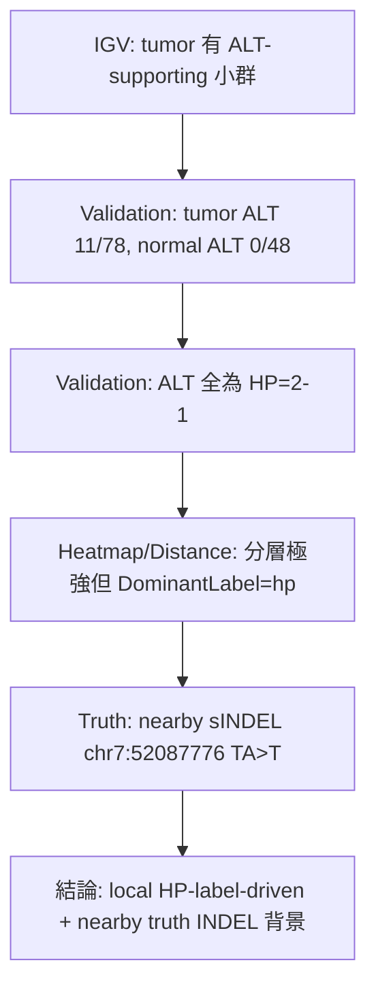

<!--
建立時間: 2026-03-17 00:00
最後更新: 2026-03-17 20:00
目標: 展示「IGV 截圖 + 甲基化圖組 + AI 初篩 + 人工複核」的單 case 標準輸出格式
處理範圍: HCC1395 5kHz paired，FP-B1 chr7:52087777 A>T
關聯檔案:
  - docs/references/manual/20260317_甲基位點觀察報告生成技能_01.md
  - docs/reports/validated/2026/03/20260315_subclone_phase4_casestudy_01.md
  - docs/reports/validated/2026/03/20260316_IGV固定template_AI視覺初篩與正式驗證_01.md
  - docs/reports/validated/2026/03/assets/20260316_igv_case_validation_01.tsv
  - docs/reports/validated/2026/03/assets/20260316_fp_mnp_screen_result_01.tsv
-->

# 甲基位點觀察報告 — FP-B1 範例

**報告日期**：2026-03-17  
**Skill 版本**：v4.0  
**目的**：示範如何把 IGV 截圖、cluster / distance / methylartist、數值驗證與分層結論整合成同一份 Markdown 報告

---

## 第 0 節：研究溯源

### 0.1 樣本資訊

| 項目       | 內容                                                             |
| ---------- | ---------------------------------------------------------------- |
| 樣本名稱   | HCC1395                                                          |
| 資料集     | `s-pure/HCC1395/20260307`                                        |
| Tumor BAM  | `/big8_disk/liaoyoyo2001/HCC1395/5kHz/HCC1395_tumor_5kHz.bam`    |
| Normal BAM | `/big8_disk/liaoyoyo2001/HCC1395/5kHz/HCC1395BL_normal_5kHz.bam` |
| 模式       | `Paired tumor-normal`                                            |
| 測序條件   | ONT 5kHz                                                         |

### 0.2 計算流程與重要口徑

| 步驟               | 工具 / 口徑                                                       |
| ------------------ | ----------------------------------------------------------------- |
| Variant calling    | `ClairS paired`；使用 normal 對照過濾 germline，**不是 PON 模式** |
| Phasing / haplotag | `LongPhase-S`，以 germline phased context 標記 tumor reads        |
| InterSubMod        | feature matrix + PERMANOVA + heatmap / distance / methylartist    |
| Benchmark          | `SEQC2 SNV-only truth`；不直接評估 sINDEL                         |

> 根據 `Knowledge/05_tools/variant_callers.md` 與 `Knowledge/06_workflows/somatic_variant_calling.md`，`ClairS` paired 沒有內建 PON；只有 `ClairS-TO` 才會用 PON。

### 0.3 Phase block 前提

1. `HP=2-1` 代表這些 ALT-supporting reads 可在 **局部可解相位的範圍** 被標到同一 haplotype label。
2. 這不自動代表它們在整條染色體都可驗證來自同一親緣來源。
3. 若要把 `HP1` / `HP2` 升級成更強的等位基因來源解釋，仍要再查同一 `PS` / phase block。

### 0.4 本案例用到的圖資與驗證來源

| 類型                  | 連結                                                                                                                        |
| --------------------- | --------------------------------------------------------------------------------------------------------------------------- |
| IGV full-template PNG | [IGV](../../reports/validated/2026/03/assets/20260316_subclone_phase4_igv_sessions/snapshots/FP_B1_chr7_52087777.png)       |
| Cluster heatmap       | [Cluster](../../reports/validated/2026/03/20260315_subclone_phase4_casestudy_assets/fp_chr7_52087777_cluster_heatmap.png)   |
| Distance heatmap      | [Distance](../../reports/validated/2026/03/20260315_subclone_phase4_casestudy_assets/fp_chr7_52087777_distance_heatmap.png) |
| Methylartist          | [Methylartist](../../reports/validated/2026/03/20260315_subclone_phase4_casestudy_assets/fp_chr7_52087777_methylartist.svg) |
| 驗證表                | [20260316_igv_case_validation_01.tsv](../../reports/validated/2026/03/assets/20260316_igv_case_validation_01.tsv)           |

---

## 第 1 節：全局定位與快覽

### 1.1 全局定位

| 指標                | 本 case   | 解讀                                                                       |
| ------------------- | --------- | -------------------------------------------------------------------------- |
| `VerificationClass` | `Strong`  | 高效應量 FP 對照案例                                                       |
| `DominantLabel`     | `hp`      | 顯示 HP 標籤比 allele 更能解釋分層                                         |
| `CramersV`          | `1.0000`  | 甲基矩陣分層極強，但不代表一定是 allele-driven                             |
| `LabelAlleleP`      | `1e-3`    | allele-aware 顯著                                                          |
| `LabelHPP`          | `1e-3`    | HP-aware 也顯著，需高度警覺 HP confounding                                 |
| `AlleleDelta`       | `+0.0579` | PERMANOVA 距離 delta（ALT-HP 共線虛高）；是所有 9 案例最高值，但被 HP 污染 |

### 1.2 本案例的兩種 read 數要分開看

| 指標                 | 數值 | 意義                                       |
| -------------------- | ---- | ------------------------------------------ |
| `feature_num_reads`  | `63` | 納入甲基矩陣與 InterSubMod 計算的 reads 數 |
| `tumor_target_depth` | `78` | BAM 在 target base 的 pileup 深度          |
| `tumor_alt_count`    | `11` | target base 支持 ALT 的 reads 數           |
| `normal_alt_count`   | `0`  | normal 在 target base 沒有 ALT 支持        |

### 1.3 本案例在顯著分類方法中的角色

這個位點是「**高顯著、但不一定是好 TP**」的代表。  
它很適合用來回答：

1. `CramersV 很高` 是否就代表甲基分類方法有效。
2. `AlleleP` 與 `HPP` 同時顯著時，該怎麼拆解。
3. IGV + 甲基圖是否能提前辨識出 `HP-driven + nearby truth INDEL` 這種 FP。

---

## 案例 1：`chr7:52087777` A>T — 🔴 FP-B1

### 前提卡

| 項目               | 內容                                    |
| ------------------ | --------------------------------------- |
| benchmark 狀態     | SEQC2 `SNV-only` 視角下為 FP            |
| nearby truth       | `chr7:52087776:TA>T`（HighConf sINDEL） |
| tumor ALT / depth  | `11 / 78`                               |
| normal ALT / depth | `0 / 48`                                |
| target ALT 的 HP   | `2-1:11`                                |
| target REF 的 HP   | `1:26,1-1:2,2:38,NA:1`                  |

### 圖資快覽表

| 類型         | 連結                                                                                                                    |
| ------------ | ----------------------------------------------------------------------------------------------------------------------- |
| IGV          |   |
| Cluster      |   |
| Distance     |  |
| Methylartist |      |

### 數值摘要表

| 指標                 | 本 case   | 說明                                 |
| -------------------- | --------- | ------------------------------------ |
| `CramersV`           | `1.0000`  | 甲基矩陣分層極強                     |
| `NumCpGs`            | `106`     | CpG 訊息量高，熱圖可視性強           |
| `PairwiseMedianDist` | `0.2654`  | 整體 read-read 距離中等              |
| `HP_ratio`           | `0.3548`  | 有可觀的 HP 標籤結構，不是全 unphase |
| `AlleleDelta`        | `+0.0579` | ALT 偏高甲基，但幅度並非壓倒性       |
| `LabelAlleleP`       | `1e-3`    | allele-aware 顯著                    |
| `LabelHPP`           | `1e-3`    | HP-aware 也顯著，表示不能只看 allele |

---

### [A] IGV 截圖分析

#### A.1 先看哪個 panel、要看什麼、代表什麼

| Panel                      | 先看什麼                                              | 代表意義                                       |
| -------------------------- | ----------------------------------------------------- | ---------------------------------------------- |
| Data / context             | 該位點在 FP/TP 管線中的上下文                         | 確定這是高顯著 FP，而不是一般低訊號噪音        |
| 主 tumor BAM               | ALT reads 是否形成局部小群，target 前後是否有異常欄位 | 判斷是否真有 allele 群，或只是鄰近對齊異常     |
| 主 normal BAM              | normal 是否也有相同 target pattern                    | 區分 tumor-specific 與 background artifact     |
| Feature / truth annotation | target 附近是否有 truth INDEL / 其他註記              | 協助解釋為 benchmark gap 或 alignment artifact |

#### A.2 AI 5 維初篩

| 維度                      | AI 初判                     | 信心度 | 觀察依據                                                        |
| ------------------------- | --------------------------- | ------ | --------------------------------------------------------------- |
| ALT 成群                  | 中等                        | 中     | tumor 端有一批 target ALT reads，但不是獨立大群                 |
| Normal 同構               | 否                          | 高     | normal target `ALT=0/48`，沒有對應 ALT 結構                     |
| 相鄰異常柱                | 有                          | 高     | target 前一格存在 nearby truth sINDEL 背景，需警覺局部對齊干擾  |
| 驅動力                    | HP / local phase-label 偏高 | 中高   | `DominantLabel=hp` 且 `LabelHPP=1e-3`                           |
| Coverage / alignment 異常 | 中等                        | 中     | ALT 只占 `11/78`，且鄰近有 truth INDEL，不適合當成乾淨 SNV 圖像 |

#### A.3 AI 初步觀察

1. 這張圖不是「一眼就像乾淨 TP」的類型。
2. 它比較像 tumor 中有局部 ALT-supporting read 群，但同時夾帶鄰近變異背景。
3. 如果只看 target base，很容易高估它的 allele 解釋力。

---

### [B] 甲基化圖組分析

#### B.1 Cluster heatmap

**AI 初篩觀察**：

1. 這張 heatmap 的分層非常清楚，符合 `CramersV=1.0`。
2. 但分層看起來更像被某個 HP 標籤結構主導，而不是 ALT 自己獨立切出新群。
3. 因為 target ALT reads 在驗證表中全部是 `HP=2-1`，這裡應寫成「ALT-supporting reads 與同一 local HP label 共線」，而不是直接寫成「父源 / 母源差異」。

#### B.2 Distance heatmap

**AI 初篩觀察**：

1. 對角 block 結構很清楚，但不像純粹由 ALT vs REF 切開。
2. 若和 `DominantLabel=hp` 一起看，這種 block 更像 local phase-label block。
3. 這是典型需要把「分得很漂亮」和「是不是分對原因」拆開看的案例。

#### B.3 Methylartist

**AI 初篩觀察**：

1. 整體 2kb 視窗內確實存在持續性的 read-level 甲基差異。
2. ALT-supporting reads 沒有呈現完全獨立的新型態，較像沿著既有 HP-labeled 背景移動。
3. 這支持「甲基訊號是真實存在，但未必是由這個 somatic SNV 主導」。

---

### [C] 聚焦問題與問題回應

#### [選擇題] Q1：這個案例的主要驅動力較像哪一種？

(A) 乾淨 allele-driven subclone methylation  
(B) local HP-label-driven 結構主導  
(C) 純粹低深度噪音

> **AI 初答**：選 **(B)**。  
> **依據**：`DominantLabel=hp`、`LabelHPP=1e-3`、cluster / distance 分層很強但更像 local phase-label 結構，且 nearby truth INDEL 提示 target 周邊不是乾淨背景。  
> **人工複核**：___  
> **判斷意義**：若選 B，後續重點不是把它當 TP，而是拿來修正「高顯著不等於有效甲基分類」的規則。

#### [解釋題] Q2：為什麼 `AlleleDelta=+0.0579` 不能單獨證明這是 allele-driven？

> **AI 初答**：`AlleleDelta` 實際上是 PERMANOVA **距離空間 delta**（between_mean_dist − within_mean_dist），不是 raw 甲基差（`ALT_meth − REF_meth`）。在 ALT reads 全在同一 HP 側時，ALT 形成緊密同質群（within_ALT 低），REF reads 跨 HP1/HP2 更異質（within_REF 高），導致 between > within，delta 虛高。`AlleleDelta=+0.058` 反映的是 ALT-HP 共線引起的分群，而非真實 somatic allele 效應。驗證方法：查看 `LabelHPP=1e-3` + `HP=2-1` 全一致 → 確認 HP-driven。  
> **人工複核**：___  
> **需補驗**：若要排除 block 差異造成的假陽性，需再查同一 `PS` / phased context。

---

### [D] 觀察驗證

| 驗證項目           | 資料來源                              | 結果                                                               |
| ------------------ | ------------------------------------- | ------------------------------------------------------------------ |
| tumor target ALT   | `20260316_igv_case_validation_01.tsv` | `11 / 78`                                                          |
| normal target ALT  | `20260316_igv_case_validation_01.tsv` | `0 / 48`                                                           |
| target ALT 的 HP   | `20260316_igv_case_validation_01.tsv` | `2-1:11`                                                           |
| dominant label     | `20260316_igv_case_validation_01.tsv` | `hp`                                                               |
| HP-aware 顯著      | `20260316_igv_case_validation_01.tsv` | `LabelHPP=1e-3`                                                    |
| nearby truth event | `20260316_igv_case_validation_01.tsv` | `chr7:52087776:TA>T`                                               |
| benchmark 限制     | `SEQC2 SNV-only`                      | 此案例緊鄰 truth sINDEL，需把 SNV-level 與 local background 分開看 |

---

### [E] 分層結論區

#### E1. 觀察

1. IGV 中 tumor 有一批 ALT-supporting reads，但不像乾淨獨立大群。
2. cluster / distance / methylartist 都顯示甲基差異真實存在，而且分層非常強。
3. 圖上的分層更像跟 local HP 標籤結構一起移動，而非單靠 ALT 就能解釋。

#### E2. 觀察驗證

1. tumor target `ALT=11/78`，normal `ALT=0/48`。
2. target ALT reads 在 LongPhase-S 標籤中全部為 `HP=2-1`。
3. `DominantLabel=hp`，且 `LabelHPP=1e-3`，證明 HP 標籤對甲基分層的解釋力不可忽略。
4. target 前一格存在 `chr7:52087776:TA>T` 的 nearby truth sINDEL。

#### E3. 推論

1. 這個 case 最合理的定位是：**local HP-label-driven 結構 + nearby truth INDEL 背景**。
2. 甲基訊號本身應該是真實的，但不宜直接解讀為這個 SNV 造成的乾淨 allele-driven subclone methylation。
3. 這個案例支持一條重要規則：**顯著分類方法若只看 `CramersV` 或 `AlleleP`，會高估部分 HP-driven / local alignment-confounded case。**

#### E4. 待補驗

1. 若要把 `HP=2-1` 進一步解讀成穩定等位基因來源，需檢查同一 `PS` / phase block。
2. 可再比對同 locus 的 Dorado /其他平台，確認這個圖像是否平台一致。
3. 若要定量「有多少比例是 HP 驅動」，應補做 HP-specific methylation mean 或 local block 限制分析。

---

## 證據鏈 Mermaid

---

## 這個範例要傳達的規則

| 規則                                          | 本案例提供的證據                                               |
| --------------------------------------------- | -------------------------------------------------------------- |
| 高 `CramersV` 不等於乾淨 TP                   | `CramersV=1.0`，但 `DominantLabel=hp` 且 nearby truth INDEL    |
| `AlleleDelta > 0.05` 仍可能不是 allele-driven | `AlleleDelta=+0.0579`，但 `LabelHPP` 同樣顯著                  |
| 要把 HP 寫成生物來源前，先確認 phase block    | ALT 全為 `HP=2-1` 只能先解讀為 local haplotype label           |
| 圖像很漂亮也可能分錯原因                      | cluster / distance 分得很開，但主要問題在驅動來源不是 ALT 本身 |

