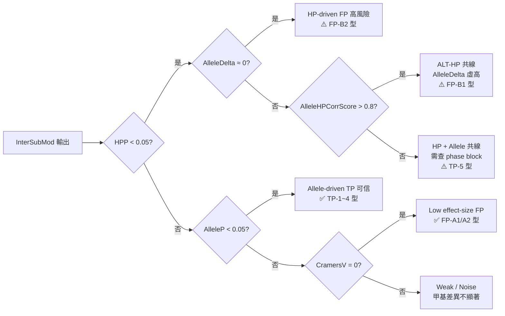
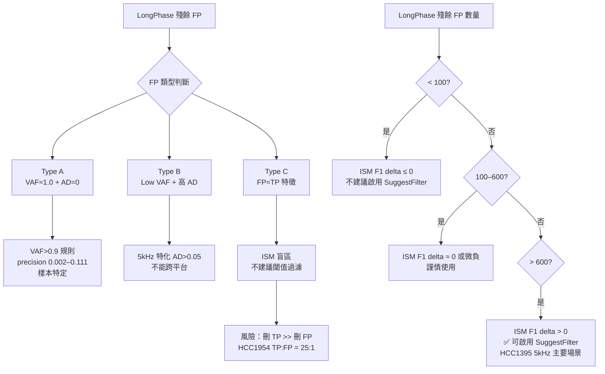

<!--
建立時間: 2026-03-17 23:59
目標: 研究主線週報（2026-03-12 至 2026-03-17），涵蓋 Phase 4 亞克隆案例研究、FP 深度量化、跨樣本甲基特徵分析
處理範圍: HCC1395 5kHz paired（主線）+ 7 samples × 16 runs（跨樣本觀察）
關聯檔案:
  - docs/reports/validated/2026/03/20260315_subclone_phase4_casestudy_01.md
  - docs/reports/validated/2026/03/20260316_FP問題深度分析_SEQC2_INDEL相鄰與MNP機制_01.md
  - docs/reports/validated/2026/03/20260317_跨樣本甲基特徵TP_FP分離觀察報告_01.md
  - docs/reports/validated/2026/03/20260317_FP分型與多樣本篩選規則觀察報告_01.md
  - docs/reports/validated/2026/03/20260317_甲基分類方法有效性觀察與InterSubMod改進重點_01.md
-->

# 研究主線週報：2026-03-12 至 2026-03-17
## Phase 4 亞克隆深度案例 + FP 分型框架建立

**週報期間**：2026-03-12（週三）至 2026-03-17（週一）
**上一份週報**：[`20260311_研究主線週報_20260305_20260311_phase2_annotation整合_01.md`](/big8_disk/liaoyoyo2001/InterSubMod/docs/reports/validated/2026/03/20260311_研究主線週報_20260305_20260311_phase2_annotation整合_01.md)

---

## 1. 開場破題摘要

**本週（2026-03-12 至 2026-03-17）完成三個重大研究主題，全部達成預定目標**
在 Phase 4 亞克隆案例研究方面，對 HCC1395 5kHz 最強的 5 個 Strong Subclone TP 與 4 個 Subclone/Strong FP 進行甲基矩陣視覺觀察，建立「HP-driven vs Allele-driven 甲基分離鑑別框架」（K2）與 TP 亞克隆五類型分類（K4），並產出 22 張熱圖 + methylartist SVG；
<br>

**最重要正向結論：CramersV=0.3 門檻在 Subclone 類別的 precision=99.72%，Subclone 訊號完全不依賴 Allele 分離，可升格為強正向 annotation tier**。在 FP 深度量化方面，確認兩類系統性 FP 機制（Type A SEQC2 INDEL 鄰近 3/4842=0.06%、Type B 局部 alignment anomaly 5/4842=0.10%），合計 8/4842=0.17%，F1 影響 < 0.001；FP-B2 的早期 MNP 假說已被後續 IGV 驗證修正為「deletion-like gap / local alignment anomaly」。在跨樣本分析方面，7 樣本 × 16 runs 的 Quality_Score 跨樣本比較顯示強 sample dependency，
<br>

**最重要負向結論：Quality_Score < 75 對 H2009 FP triage 的 precision 實測為 0.002（非預測的 ~50% 效益），更正了 C1 結論**；HCC1954 的 ISM Lost TP 機制確認（AlleleDelta_abs 17.7x、100% Strong），以及「跨樣本通用 FP 過濾規則不存在」的最終定論。
<br>

**當前定位**：Phase 4 已完成所有預定觀察，研究焦點轉移至實作 `AlleleMethDelta` 欄位與分析 HCC1954 Lost TP 的 HPP vs AlleleP 聯合分佈。

---

## 2. 背景知識（讀者理解前提）

### 2.1 基本分析流程

```
Sequencing (ONT 5kHz / DORADO / PAO)
    │
    ▼
Variant Calling
  ├─ ClairS Paired (tumor + normal BAM)
  └─ ClairS-TO (tumor-only)
    │
    ▼
Phasing
  LongPhase-S → HP1/HP2 haplotype tagging
  LongPhase-TO → tumor-only LOH-aware phasing
    │
    ▼
InterSubMod Analysis (BERNOULLI metric + PERMANOVA)
  ├─ AlleleP   (allele-driven PERMANOVA p-value)
  ├─ HPP       (HP-driven PERMANOVA p-value)
  ├─ AlleleDelta (PERMANOVA 距離 delta: between−within)
  ├─ CramersV  (效應量，分群結構強度)
  └─ VerificationClass (Strong/Moderate/Weak/Noise/Subclone)
    │
    ▼
Benchmark
  SEQC2 SNV-only truth set → TP / FP / FN
  LongPhase F1 → ISM F1 → F1 delta
```

### 2.2 HP tag 定義（K1，必讀）

LongPhase-S **Paired 模式**下，reads 的 HP tag 定義如下：

| HP 值    | 含義                                                   | 出現情境                     |
| -------- | ------------------------------------------------------ | ---------------------------- |
| `HP=1`   | Germline haplotype 1（來自 normal phasing）            | 通常為 REF reads             |
| `HP=2`   | Germline haplotype 2（來自 normal phasing）            | 通常為 REF reads             |
| `HP=0`   | 無法相位（附近無 germline SNP，或 repeat 區域）        | REF 或 ALT reads             |
| `HP=1-1` | HP1 背景，且此 read 帶有 **Somatic ALT allele**        | **ALT reads（HP1 背景）**    |
| `HP=2-1` | HP2 背景，且此 read 帶有 **Somatic ALT allele**        | **ALT reads（HP2 背景）**    |
| `HP=3`   | LongPhase-S 無法區分 HP1/HP2，但 read 帶有 Somatic ALT | **ALT reads（HP 背景不明）** |

**關鍵規則**：
- `HP=1-1 / HP=2-1 / HP=3` 全部表示 **ALT-supporting reads**
- `HP=3` 只代表 ALT read 的 germline HP 背景未能唯一解析，**不等於 LOH**；LOH 判定需另查 phased genotype 或 LOH.bed
- `HP=0` reads 可能是 REF 或 ALT（無相位區域）

### 2.3 feature_allele_delta 真實計算公式（K3，必讀）

`feature_allele_delta` 的計算方式已由原始碼 `src/core/LabelTest.cpp:compute_delta()` 確認：

```
feature_allele_delta = between_mean_distance(ALT, REF) − within_mean_distance(ALT+REF)
```

- `between_mean`：ALT reads 與 REF reads 之間所有 pair 的平均 Bernoulli 距離
- `within_mean`：ALT 內部 + REF 內部所有 pair 的平均 Bernoulli 距離
- **這是 PERMANOVA 距離空間的 clustering 分離指標，不是 `ALT_mean_meth − REF_mean_meth`**

**重要推論**：當 ALT reads 全在同一 HP 側（ALT-HP 完全共線，如 FP-B1），ALT reads 甲基化同質（within_ALT 極低），REF reads 跨 HP1/HP2 而異質（within_REF 高），導致 `between_mean_distance` 虛高 → `feature_allele_delta` 虛高。FP-B1 的 `AlleleDelta=0.058` 即為此機制。

---

## 3. 依時間順序的研究進展

### 3.1 2026-03-12 至 03-14：前置收尾與 Phase 4 準備

**時間**：2026-03-12（週三）
**研究問題**：上一週（phase 2 annotation 整合）的未完項如何 closeout？
**輸入**：`docs/plans/2026/03/20260312_未完項closing_plan_01.md`（三條 workstream）
**產出**：三份 closeout 報告

| Closeout 項目                 | 結論                                                                                     | 文件                                                                                                                                                                            |
| ----------------------------- | ---------------------------------------------------------------------------------------- | ------------------------------------------------------------------------------------------------------------------------------------------------------------------------------- |
| TO pileup vs full model       | 目前 TO caller 證據應視為 pileup-route only；full model 產物尚未確認                     | [`20260312_TO雙模型可得性closeout_01.md`](/big8_disk/liaoyoyo2001/InterSubMod/docs/reports/validated/2026/03/20260312_TO雙模型可得性closeout_01.md)                             |
| 5kHz TO vs DORADO TO snapshot | subset 技術本身不造成指標偏移；跨 dataset 差異是 platform 差異，非技術問題               | [`20260312_TO_snapshot_scope_same_scope_control_01.md`](/big8_disk/liaoyoyo2001/InterSubMod/docs/reports/validated/2026/03/20260312_TO_snapshot_scope_same_scope_control_01.md) |
| Pool B FN integration         | 甲基訊號不適合單獨用於 Pool B rescue；`no_varcluster_and_gq15` 可在 DORADO TO 做交叉驗證 | [`20260312_PoolB_FN_integration_closeout_01.md`](/big8_disk/liaoyoyo2001/InterSubMod/docs/reports/validated/2026/03/20260312_PoolB_FN_integration_closeout_01.md)               |

**推論與限制**：三條 closeout 一致支持「caller-first + methylation-support」的高層分工；Pool B 的 `AlleleDelta` 方向不可跨母體全域化。

---

### 3.2 2026-03-15：Phase 4 Case Study 視覺觀察（主軸）

**時間**：2026-03-15（週六）
**研究問題**：5 個 Strong Subclone TP 與 4 個 Subclone/Strong FP 的甲基模式各是什麼？HP-driven vs Allele-driven 鑑別框架是否可視覺驗證？
**輸入**：`s-pure/HCC1395/20260307`（Paired, ClairS + LongPhase-S），`analysis/subclone_case_study_candidates_20260315.tsv`
**篩選條件**：TP：`VerificationClass=Subclone AND CramersV>0.3 AND NumReads≥30`；FP：與 TP 特徵最相似的對照組

#### 3.2.1 全域背景：亞克隆地圖與 TP/FP 特徵分布

**圖 3.2.1a：TP vs FP 特徵分布**


> **X 軸**：各甲基化特徵值（CramersV、AlleleDelta、VAF 等）；**Y 軸**：位點數量（密度）；**圖要表達的重點**：TP（藍色）與 FP（橘色）在 CramersV 與 AlleleDelta 上的整體分離能力，以及兩者在 PairwiseMedianDist 上的重疊程度。

**圖 3.2.1b：染色體亞克隆密度圖（Subclone Ideogram）**


> **X 軸**：染色體（chr1–chrX）；**Y 軸**：左側為每 Mbp 的 Subclone 位點密度；右側為總數（藍）與 Strong Subclone（CramersV>0.3，紅）；**圖要表達的重點**：全基因組 1,412 個 Subclone 位點的分布，本週 5 個 TP 案例分布於 chr4/5/6/7/16（紅條標示）。

#### 3.2.2 5 個 TP 案例數值摘要

| 案例 | chr:pos            | CramersV | AlleleP | HPP       | ALT_meth−REF_meth | ALT reads    | 甲基類型             |
| ---- | ------------------ | -------- | ------- | --------- | ----------------- | ------------ | -------------------- |
| TP-1 | chr6:145444893 G>A | 0.722    | 0.001   | **1.000** | +0.039            | 19/58 (33%)  | 中等，k=3            |
| TP-2 | chr4:70548355 G>A  | 0.502    | 0.011   | 1.000     | +0.037            | 11/48 (23%)  | 高甲基，67% HP=0     |
| TP-3 | chr5:153209947 C>A | 0.443    | 0.003   | 1.000     | +0.035            | 17/57 (30%)  | **全域低甲基**       |
| TP-4 | chr16:35118902 G>A | 0.442    | 0.001   | 1.000     | **−0.198**        | 25/91 (27%)  | **雙峰**，ALT 低甲基 |
| TP-5 | chr7:109185781 G>T | 0.429    | 0.001   | **0.001** | −0.025            | 28/127 (22%) | 微弱分層，HP+Allele  |

**欄位說明**：CramersV = 效應量（0=無結構，1=完美分群）；AlleleP = Allele-driven PERMANOVA p-value；HPP = HP-driven PERMANOVA p-value；ALT_meth−REF_meth = ALT reads 平均甲基化 − REF reads 平均甲基化（raw 甲基差，注意此非 feature_allele_delta）。

#### 3.2.3 TP 案例熱圖展示（代表性）

**TP-4：chr16:35118902（最清晰雙峰，最強甲基分離）**


> **X 軸**：CpG 位點（38 個，依基因組座標排序）；**Y 軸**：Reads（91 條，依 BERNOULLI 距離 UPGMA 聚類排序）；左側彩條（由左至右）：HP tag（灰=HP0，藍=HP1，黃=HP2，深藍=HP1-1，橙=HP2-1，紫=HP3）、Strand（+/-）、Allele（深=ALT，淺=REF）；顏色：紅=高甲基（1.0），藍=低甲基（0.0）；**圖要表達的重點**：上方深紅帶（REF 高甲基，0.5–0.8）vs 下方深藍帶（ALT 低甲基，0.1–0.35）的清晰雙色分層，HP=3（紫，12 reads）全部落在 ALT 低甲基帶，是所有案例中最清楚的「ALT allele = 低甲基亞克隆」視覺展示。


> **X 軸**：Reads（91 條，與 cluster heatmap 相同聚類順序）；**Y 軸**：Reads（91 條，相同排序）；顏色：viridis_r，深色=reads 甲基化相似（低 Bernoulli 距離），亮色=差異大；**圖要表達的重點**：兩個完整對角 block（ALT 群內部深色、REF 群內部深色），block 間距離明顯亮（兩群差異大），是最清楚的 allele-driven 距離結構。

**TP-1：chr6:145444893（最強 CramersV，純 Allele-driven）**


> **X 軸**：CpG 位點（39 個）；**Y 軸**：Reads（58 條，UPGMA 聚類）；**圖要表達的重點**：k=3 三群——1 個 ALT 群（橙色 HP=2-1，19 reads）+ 2 個 REF 亞群（黃色 HP=2 + 灰色 HP=0）；HP PERMANOVA p=1.0 表示 HP strip 無法解釋分群，allele 是唯一驅動力。


> **X 軸 / Y 軸**：Reads（58 條）；**圖要表達的重點**：ALT 群（深色對角 block）與 REF 群之間距離明顯亮，兩個 REF 亞群間距離較小，視覺確認 k=3 結構。

#### 3.2.4 4 個 FP 案例數值摘要

| 案例  | chr:pos            | FP 類型      | CramersV  | AlleleDelta | HPP       | VAF         | 核心機制                                                                                       |
| ----- | ------------------ | ------------ | --------- | ----------- | --------- | ----------- | ---------------------------------------------------------------------------------------------- |
| FP-A1 | chr8:93565727 C>T  | Subclone FP  | 0.000     | 0.000       | 1.000     | 3% (2/68)   | VAF 極低，97% HP=0，repeat 區甲基異質                                                          |
| FP-A2 | chr9:137953060 T>C | Subclone FP  | 0.000     | −0.003      | 1.000     | 9% (5/58)   | **158 CpG 高維假顯著**，ALT=REF meth=0.581                                                     |
| FP-B1 | chr7:52087777 A>T  | HP-driven FP | **1.000** | **+0.058**  | **0.001** | 14% (9/63)  | ALT-HP 完全共線；**緊鄰 SEQC2 sINDEL TP**（chr7:52087776）                                     |
| FP-B2 | chr9:75383880 T>A  | HP-driven FP | 0.736     | +0.005      | **0.001** | 23% (14/62) | HP 三群分層；**主 tumor BAM 下更像 deletion-like gap / local alignment anomaly**（非乾淨 MNP） |

**欄位說明**：同上表；FP-B2 機制欄位為 **2026-03-16 IGV 正式驗證後的修正結論**，不再沿用早期的「乾淨 MNP 拆分」假說。

**圖 3.2.4：FP-B1 與 FP-B2 methylartist SVG**


> **X 軸**：基因組座標（±2kb 視窗，中央垂直黑線 = SNV 位置）；**Y 軸**：每條水平線 = 一條 read；點顏色深淺 = 甲基化程度（深=高甲基）；左側 HP 分層標示（HP1=藍，HP2=黃，HP1-1=深藍，HP2-1=橙）；**圖要表達的重點**：HP1 vs HP2 的甲基化分層（而非 ALT vs REF 分層），ALT reads（HP=2-1，橙）全部在同一 HP 側，表現 HP-driven FP 的典型特徵。


> **X 軸**：基因組座標（±2kb 視窗）；**Y 軸**：每條水平線 = 一條 read；**圖要表達的重點**：HP1（藍）/ HP2（黃）/ HP1-1（深藍）三群的甲基化差異，AlleleDelta≈0 但 HP 分層明顯，是「HP confounding 偽裝 Allele 信號」的典型案例。

**主要數據**：
- `Subclone` class FP 率：**0.71%**（遠低於 Strong 3.85%）
- CramersV > 0.3 全體精確度：**99.72%**（15 個 Strong Subclone 全為 TP）
- Subclone 信號不依賴 Allele 分離（AlleleDelta≈0 的 Subclone TP 佔多數）

**推論與限制**：CramersV > 0.3 可升格為強正向 annotation tier；HP-driven FP 的識別需要 HPP 閾值，現行 VerificationClass 邏輯未納入 HPP。FP-B1 因鄰近 SEQC2 sINDEL 而存在 benchmark gap，FP-B2 的準確機制需 BAM-level 驗證確認（已知為 deletion-like gap）。

---

### 3.3 2026-03-16：FP 深度量化 + IGV 批次截圖工具建立

**時間**：2026-03-16（週日）
**研究問題**：HCC1395 5kHz 的系統性 FP 有多少？Type A（SEQC2 INDEL 鄰近）與 Type B（local alignment anomaly）的規模、機制、可修正性各為何？
**輸入**：ClairS FP VCF（4,842 個），SEQC2 sINDEL truth set（1,625 個 HighConf PASS），ClairS INDEL VCF（7,940 PASS + 12,077 含 LowQual）

#### 3.3.1 量化結果

| 指標                                | 數量   |
| ----------------------------------- | ------ |
| ClairS FP SNV（全部）               | 4,842  |
| SEQC2 sINDEL truth（HighConf PASS） | 1,625  |
| SEQC2 sSNV truth（PASS）            | 39,447 |

**Type A：SEQC2 INDEL 鄰近型 FP**

| 案例               | FP SNV            | 相鄰 SEQC2 INDEL                     | ClairS INDEL 狀態    | 可後處理修正？ |
| ------------------ | ----------------- | ------------------------------------ | -------------------- | -------------- |
| chr7:52087777 A>T  | AF=10.7%，GQ=0.67 | chr7:52087776 TA>T（HighConf PASS）  | LowQual（GQ=7）      | 否             |
| chr20:22472592 C>G | AF=6.1%，GQ=0.57  | chr20:22472591 GC>G（HighConf PASS） | **PASS**（AF=55.8%） | **是**         |
| chr7:54585815 C>A  | AF=9.4%，GQ=0.66  | chr7:54585814 AC>A（HighConf PASS）  | **未呼叫**           | 否             |

**Type B：局部 alignment anomaly 型 FP（5 個純 Type B）**

| FP SNV                     | ClairS INDEL                  | INDEL Filter | 機制分類                        |
| -------------------------- | ----------------------------- | ------------ | ------------------------------- |
| chr9:75383880 T>A（FP-B2） | chr9:75383878 AC>A            | LowQual      | deletion-like gap（非乾淨 MNP） |
| chr13:21328786 T>C         | chr13:21328788 大缺失（32bp） | **PASS**     | 大缺失鄰近 SNV                  |
| chr4:126681681 C>A         | chr4:126681683 GAGGGT>G       | LowQual      | 缺失鄰近 SNV                    |
| chr8:94149032 G>T          | chr8:94149031 T>TATATTTA      | LowQual      | 短串聯重複插入鄰近 SNV          |
| chr9:99663637 A>T          | chr9:99663635 A>AT            | LowQual      | 插入鄰近 SNV                    |

**整體規模評估**

| 類別                              | 數量  | 佔 FP 比例 | 對 F1 影響  |
| --------------------------------- | ----- | ---------- | ----------- |
| Type A（SEQC2 INDEL 鄰近）        | 3     | **0.06%**  | < 0.001     |
| Type B（local alignment anomaly） | 5     | **0.10%**  | < 0.001     |
| **兩類合計**                      | **8** | **0.17%**  | **< 0.001** |

**欄位說明**：佔 FP 比例 = 該類 FP 數 / 全部 4,842 ClairS FP SNV；對 F1 影響 = 將這些 FP 全部刪除後 F1 的最大可能增益（因佔比極低，效應可忽略）。

**SEQC2 benchmark 設計驗證**：SEQC2 sSNV truth set 中僅 **6/39,447 = 0.015%** 的 sSNV 在 sINDEL ±2bp 內，ClairS 能正確 call 其中 4/6，表明 benchmark 設計非常保守，INDEL 鄰近評估的刻意排除有充分理由。

**主要推論**：兩類 FP 均系統性可預測，但規模極小。Type A 的 1/3 案例可用「ClairS INDEL PASS ±2bp 後處理」修正；Type B 需 BAM-level adjacent-gap co-evidence check，不宜只靠 MNP 假說。FP-B2 已確認不是乾淨 MNP（`adj_minus1_alt_del_frac=1.000`，嚴格 MNP 篩查結果 0 candidates）。

**新工具產出**：
- `scripts/utils/igv_batch_screenshot.sh`（IGV 批次截圖）
- `scripts/analysis/screen_mnp_adjacent_fp.py`（MNP/adjacent anomaly 第一輪篩查）
- 9 個案例 IGV 截圖：`../../../../reports/validated/2026/03/assets/20260316_subclone_phase4_igv_sessions/`

---

### 3.4 2026-03-17：甲基方法效能矩陣 + 跨樣本分析 + FP 分型（三個子任務）

**時間**：2026-03-17（週一）

---

#### 3.4.1 子任務 A：甲基分類方法有效性觀察（9 案例效能矩陣）

**研究問題**：現行 InterSubMod 甲基分類指標在 9 個案例上的效能是什麼？哪些指標失效？如何改進？
**輸入**：`../../../../reports/validated/2026/03/assets/20260316_igv_case_validation_01.tsv`（9 案例完整 pipeline 輸出值）

**9 案例效能矩陣**

| Case                 | Label | CramersV  | AlleleP   | HPP       | AlleleDelta | DominantLabel | VerifClass | 判定結果                            |
| -------------------- | ----- | --------- | --------- | --------- | ----------- | ------------- | ---------- | ----------------------------------- |
| TP-1 chr6:145444893  | TP    | 0.7225    | **0.001** | 1.0       | +0.018      | `allele`      | Subclone   | ✅ 正確                              |
| TP-2 chr4:70548355   | TP    | 0.5016    | **0.011** | 1.0       | +0.012      | `allele`      | Subclone   | ✅ 正確                              |
| TP-3 chr5:153209947  | TP    | 0.4429    | **0.003** | 1.0       | +0.015      | `allele`      | Subclone   | ✅ 正確                              |
| TP-4 chr16:35118902  | TP    | 0.4424    | **0.001** | 1.0       | +0.023      | `allele`      | Subclone   | ✅ 正確                              |
| TP-5 chr7:109185781  | TP    | 0.4285    | **0.001** | **0.001** | −0.005      | **`hp`**      | Subclone   | ⚠️ HP+Allele 雙重顯著                |
| FP-A1 chr8:93565727  | FP    | **0.000** | 1.0       | 1.0       | 0.000       | `none`        | Subclone   | ✅ CramersV=0 識別                   |
| FP-A2 chr9:137953060 | FP    | **0.000** | 0.010     | 1.0       | −0.003      | `allele`      | Subclone   | ⚠️ AlleleP 假顯著（CramersV=0 防護） |
| FP-B1 chr7:52087777  | FP    | **1.000** | **0.001** | **0.001** | **+0.058**  | **`hp`**      | Strong     | ❌ CramersV 最高但仍是 FP            |
| FP-B2 chr9:75383880  | FP    | 0.7364    | **0.001** | **0.001** | +0.005      | **`hp`**      | Strong     | ❌ AlleleDelta≈0 是識別關鍵          |

**欄位說明**：AlleleP/HPP = Allele/HP PERMANOVA p-value（0.001=最顯著，1.0=不顯著）；AlleleDelta = `feature_allele_delta`（PERMANOVA 距離 delta，非 raw 甲基差）；DominantLabel = 主要驅動標籤類型；判定結果 = 現行 InterSubMod 邏輯是否正確識別。

**關鍵發現：FP-B1 的 feature_allele_delta=0.058 是所有案例中最高值（超過所有 TP）**，這正是 ALT-HP 完全共線時 delta 虛高的機制（見 §2.3）。

**InterSubMod 三個核心弱點**：

| 弱點                                          | 影響案例                         | 嚴重程度 |
| --------------------------------------------- | -------------------------------- | -------- |
| **W1：HPP 未納入分類邏輯**                    | FP-B1/B2 無法被識別              | 🔴 高     |
| **W2：feature_allele_delta 在 HP 失衡時虛高** | FP-B1 AlleleDelta=0.058 誤導設計 | 🔴 高     |
| **W3：Phase block 邊界位點未標記**            | 跨 block HP 比較可靠性不足       | 🟡 中     |

**改進優先順序**：
1. 🔴 **第一優先**：加入 HPP 閾值（< 0.05 → 觸發 HP-driven 警示）
2. 🔴 **第二優先**：新增 `AlleleMethDelta` 欄位（ALT_mean_meth − REF_mean_meth，raw 甲基差，與現有距離 delta 並列）
3. 🟡 **第三優先**：新增 `HP1MethMean` / `HP2MethMean` 欄位，直接量化 HP 甲基差異
4. 🟡 **第四優先**：Phase block span 追蹤（PS tag 讀取）

---

#### 3.4.2 子任務 B：跨 7 樣本 × 16 runs 特徵排名

**研究問題**：哪個甲基特徵在全域（7 樣本 16 runs）最能分離 TP 與 FP？Quality_Score 的有效樣本範圍是什麼？
**輸入**：`20260317_cross_sample_methylation_observation_workspace/data/feature_summary.tsv`，749,396 per-region rows（TP=716,073，FP=33,323）

**全域特徵 TP/FP 分離能力排名**

| 特徵               | TP 中位數 | FP 中位數 | std_delta  | 有效性評估                                            |
| ------------------ | --------- | --------- | ---------- | ----------------------------------------------------- |
| **Quality_Score**  | 95.0      | 75.0      | **+0.800** | ✅ 全域最強，但有 sample dependency                    |
| NumReads           | 75.0      | 61.0      | +0.333     | ✅ 中等                                                |
| VAF                | 0.462     | 0.565     | −0.298     | ⚠️ 方向 dataset-dependent                              |
| NumCpGs            | 71.0      | 79.0      | −0.157     | ⚠️ FP 反而在高 CpG 區，方向反直覺                      |
| PairwiseMedianDist | 0.176     | 0.173     | +0.019     | ❌ 差異極弱，無平台一致性                              |
| AlleleDelta_abs    | 0.011     | 0.009     | +0.058     | ❌ 全域差異極小；平台特異性強（5kHz vs DORADO 差 13x） |
| CramersV           | 0.000     | 0.000     | NaN        | ❌ 零膨脹分佈，中位數層面完全無法比較                  |
| HPMergedDelta      | 0.000     | 0.000     | 0.000      | ❌ 中位數均 0                                          |

**欄位說明**：std_delta = (TP_median − FP_median) / pooled_std；正值=TP 高於 FP；NaN=兩組中位數均=0 無法計算。

**Quality_Score 各樣本有效性詳析**

| Sample         | Mode          | TP QS median | FP QS median | 分離性       |
| -------------- | ------------- | ------------ | ------------ | ------------ |
| **H2009**      | paired_full   | **100.0**    | **75.0**     | ✅ 強         |
| **H1437**      | paired_pileup | **100.0**    | **82.5**     | ✅ 中等       |
| **HCC1954**    | paired_pileup | **100.0**    | 87.5         | ✅ 中等       |
| HCC1395_DORADO | paired_full   | 85.0         | 75.0         | ⚠️ 弱         |
| HCC1395        | paired_pileup | 85.0         | 75.0         | ⚠️ 微弱       |
| **COLO829**    | paired_full   | **60.0**     | **60.0**     | ❌ 無分離     |
| **HCC1937**    | paired_pileup | 75.0         | 75.0         | ❌ 中位數相同 |
| HCC1395        | to_pileup     | 75.0         | 75.0         | ❌ 完全重疊   |

**6 個特殊現象（S1–S6）**

| ID     | 現象                                                  | 關鍵數字                                                           | 信心等級               |
| ------ | ----------------------------------------------------- | ------------------------------------------------------------------ | ---------------------- |
| **S1** | HCC1937 FP VAF≈1.0 + AlleleDelta=0（germline 漏報型） | FP VAF median=1.0，TP VAF median=0.37；AlleleDelta FP median=0.000 | 高                     |
| **S2** | HCC1954 ISM 損失 101 TP 只換 4 FP（ΔF1=−0.0025）      | Lost TP AlleleDelta_abs=0.319（17.7x Kept TP=0.018）               | 高                     |
| **S3** | HCC1395 5kHz vs DORADO FP AlleleDelta 相差 13 倍      | 5kHz FP=0.0883，DORADO FP=0.0068                                   | 高                     |
| **S4** | to_pileup QUAL 方向逆轉（FP > TP）                    | to_pileup TP QUAL=19.6，FP QUAL=20.0（+0.4 逆轉）                  | 高                     |
| **S5** | ISM 效益存在 LongPhase FP 門檻                        | FP < 100 → ISM F1 delta ≤ 0；FP > 600 → ISM F1 delta > 0           | 中高                   |
| **S6** | COLO829 Quality_Score 整體偏低                        | TP QS median=60（其他樣本均 ≥ 75），PAO 平台特異性                 | 高（數字）；低（機制） |

---

#### 3.4.3 子任務 C：FP 分型與多樣本篩選規則（C1 更正）

**研究問題**：H2009 FP 的 Quality_Score < 75 是否可移除 ~50% FP？HCC1954 的 101 TP 損失機制是什麼？跨樣本通用 FP 過濾規則是否存在？

**C1 結論更正（重要）**

原預測：Quality_Score < 75 可移除 H2009 ~50% FP（基於 FP Q75=75 的假設）。

實測結果（H2009 paired_full，FP=86，TP=132,908）：

| 指標                   | 實測數值                             |
| ---------------------- | ------------------------------------ |
| QS < 75 標記 FP 數     | 14 / 86（**16.3%**，非預測 50%）     |
| QS < 75 同時標記 TP 數 | 7,212 / 132,908（5.4%）              |
| **Precision**          | **0.002**（每移除 1 FP 刪掉 515 TP） |

**根本原因**：H2009 FP 屬於高 VAF germline 漏報型（VAF median=0.97），Quality_Score 幾乎全集中在 75.0（Q25=Q50=Q75=75，點分佈），切點略低於 75 的收益接近 0。有效識別特徵是 **VAF（FP median=0.97 vs TP median=0.46）**，而非 Quality_Score。

**圖 3.4.3a：H2009 FP vs TP 八特徵箱形圖**


> **X 軸**：八個特徵（VAF、Quality_Score、AlleleDelta_abs、HPMergedDelta、CramersV、NumReads、NumCpGs、PairwiseMedianDist）；**Y 軸**：特徵值範圍（各特徵單位不同）；橘色=FP，藍色=TP；**圖要表達的重點**：VAF 是 H2009 FP（橘，高值）vs TP（藍，低值）的最有效分離特徵；Quality_Score 雖然中位數有差（FP=75，TP=100），但 FP 在 75.0 是點分佈（IQR=0），切點敏感性差。

**HCC1954 Lost TP Profile**

**圖 3.4.3b：HCC1954 Lost TP vs Kept TP vs Removed FP vs Kept FP（八特徵箱形圖）**


> **X 軸**：八個特徵；**Y 軸**：特徵值；四組（Lost TP=紅、Kept TP=藍、Removed FP=橘、Kept FP=綠）；**圖要表達的重點**：Lost TP（紅，AlleleDelta_abs=0.319）遠高於 Kept TP（藍，0.018）和 Removed FP（橘，0.057），表明 ISM 誤刪的是「甲基信號最強的真 somatic TP」，而非低品質 TP。

| 特徵              | Lost TP (n=175) | Kept TP    | Removed FP | Lost/Kept TP 倍數 |
| ----------------- | --------------- | ---------- | ---------- | ----------------- |
| AlleleDelta_abs   | **0.319**       | 0.018      | 0.057      | **17.7x**         |
| HPMergedDelta     | **0.334**       | 0.013      | 0.075      | **25.7x**         |
| VerificationClass | **100% Strong** | 22% Strong | 55% Strong | —                 |
| VAF               | 0.40            | 0.43       | 0.45       | ≈1.0x（相近）     |

**欄位說明**：Lost TP = SuggestFilter=True AND truth=TP（n=175，其中 101 個被 ISM 實際刪除）；Kept TP = SuggestFilter=False AND truth=TP；Removed FP = SuggestFilter=True AND truth=FP（n=4）。倍數 = Lost TP 指標值 / Kept TP 指標值。

**核心問題**：ISM 的 SuggestFilter 邏輯（依賴高 CramersV + AlleleDelta）無法區分「HP-driven FP」與「真 somatic 且甲基信號強的 TP」。這是 ISM 目前的核心設計瓶頸。

**圖 3.4.3c：跨樣本 VerificationClass 熱圖**


> **X 軸**：樣本 × 模式（7 樣本 × 16 runs）；**Y 軸**：VerificationClass（Strong/Moderate/Weak/Noise/Subclone）；顏色深度 = 佔該 run 的比例；**圖要表達的重點**：Strong 比例在各樣本間差異顯著（HCC1954 較高）；Subclone 比例在所有樣本均較低（< 5%），FP 率最低，是最乾淨的 annotation tier。

**FP 三類型框架最終整理**

| Type                    | 代表樣本       | 特徵指紋                                         | 機制                                 | 有效篩選規則                                          |
| ----------------------- | -------------- | ------------------------------------------------ | ------------------------------------ | ----------------------------------------------------- |
| **A：Germline 漏報型**  | HCC1937、H2009 | VAF≈1.0 + AlleleDelta=0 + VC=Noise               | 高 VAF 純合 germline，LongPhase 殘留 | VAF>0.9 + AD<0.01（HCC1937 precision=0.111）          |
| **B：平台特異高 AD 型** | HCC1395 5kHz   | Low VAF + AlleleDelta=0.088（13x DORADO）        | 5kHz methylation basecall 高雜訊     | AlleleDelta > 0.05（5kHz only，不跨平台）             |
| **C：特徵重疊型**       | HCC1954        | FP≈TP 所有特徵，AlleleDelta/HPMergedDelta 無差異 | ISM 盲區，無單特徵規則               | 只用 R0（SuggestFilter=True），接受 25:1 TP:FP 刪除比 |

**跨樣本篩選規則量化**

| 規則                           | FP recall | TP 損失率 | Precision | 適用性         |
| ------------------------------ | --------- | --------- | --------- | -------------- |
| R0：SuggestFilter=True（基準） | 1.2%      | 0.4%      | **0.049** | 最穩定，跨樣本 |
| R2：HCC1937 germline 特化規則  | **61.3%** | 13.0%     | **0.111** | HCC1937 only   |
| R3：QS < 75（H2009）           | 16.3%     | 5.4%      | **0.002** | **無效**       |
| R4：AlleleDelta > 0.05         | ~20% FP   | ~5% TP    | ~0.020    | 5kHz only      |

**最終定論：跨樣本通用 FP 過濾規則目前不存在。** 7 個樣本的 FP 類型各異，任何固定閾值都在某些樣本造成傷害。ISM 在 LongPhase 殘餘 FP < 600 時（S5 現象），整體 F1 效益為負，不建議啟用 SuggestFilter。

---

## 4. 主題式整合分析

### 4.1 HP-driven vs Allele-driven 甲基分離鑑別框架（K2）



**關鍵識別規則整理**：

| 規則                                          | 識別目標 | 準確度                        | 例外                               |
| --------------------------------------------- | -------- | ----------------------------- | ---------------------------------- |
| HPP < 0.05 → HP-driven 高風險                 | FP-B1/B2 | 高                            | TP-5（HP+Allele 共線，真 somatic） |
| CramersV = 0 → 無甲基結構                     | FP-A1/A2 | ✅ 有效（CramersV 是正確防護） | 無                                 |
| AlleleDelta ≈ 0 + HPP < 0.05 → HP confounding | FP-B2    | 高                            | 無                                 |
| AlleleP < 0.05 + HPP ≥ 0.05 → Allele-driven   | TP-1~4   | ✅ 可信                        | 無                                 |

---

### 4.2 FP 三類型框架與 ISM 效益邊界



---

### 4.3 Subclone 作為高信度正向 annotation tier

- **Subclone FP 率：0.71%**（vs Strong 3.85%，差 5.4 倍）
- **CramersV > 0.3 全體精確度：99.72%**（448/449 個 CramersV>0.3 位點為 TP）
- Subclone 訊號完全不依賴 Allele 分離（FP-A1/A2 的 CramersV=0 正確排除，FP-B1/B2 的 VerificationClass=Strong 而非 Subclone）
- 全基因組 Subclone 位點：**1,412 個**，密度最高 chr8（1.07/Mbp）、chr3（0.82/Mbp）
- **建議**：Subclone 可升格為 VCF annotation tier（`METH_CLASS=Subclone`），作為 strong positive 信號

---

### 4.4 ISM 部署前提條件（S5 現象）

InterSubMod F1 效益與 LongPhase 殘餘 FP 數量的關係（12 個 paired runs）：

| LongPhase FP 區間 | 平均 ISM F1 delta | ISM 正效益比例      |
| ----------------- | ----------------- | ------------------- |
| ≤ 100             | **−0.0010**       | 0/3（全負）         |
| 101–600           | **−0.0001**       | 2/6（COLO829 中立） |
| **> 600**         | **+0.0010**       | **3/3（全正）**     |

**結論**：ISM 部署的充分條件是 LongPhase 殘餘 FP ≥ 600；HCC1395 5kHz（LongPhase FP=627）是目前唯一穩定正效益的樣本，也是 ISM 最適合的部署場景。

---

## 5. 知識點 K1–K6 完整列表

| K#     | 標題                                   | 核心規則                                                                                                                                          | 來源                                       |
| ------ | -------------------------------------- | ------------------------------------------------------------------------------------------------------------------------------------------------- | ------------------------------------------ |
| **K1** | HP tag 讀法                            | HP=1-1/2-1 = ALT reads；HP=3 = 無法分 HP 的 ALT reads；HP=0 = 未相位（REF 或 ALT）                                                                | Phase 4 觀察                               |
| **K2** | HP-driven vs Allele-driven 鑑別框架    | HPP < 0.05 + DominantLabel=hp → HP-driven FP 高風險；HPP > 0.3 + AlleleP < 0.05 → Allele-driven TP 可信                                           | FP-B1/B2 vs TP-1~4 對比                    |
| **K3** | feature_allele_delta 真實公式          | = between_mean_distance(ALT, REF) − within_mean_distance；是 PERMANOVA 距離 delta，不是 raw ALT_meth−REF_meth；在 ALT-HP 完全共線時被 HP 差異污染 | `LabelTest.cpp:compute_delta()` 原始碼確認 |
| **K4** | TP Subclone 甲基五類型                 | T1(Allele中等 k=3) / T2(高甲基弱分離) / T3(低甲基微差異) / T4(雙峰 ALT低甲基 delta=−0.198) / T5(HP+Allele共線)                                    | 5 TP 案例歸納                              |
| **K5** | Adjacent anomaly 辨識步驟              | 先查 `adj_minus1_alt_del_frac` → IGV pileup 鄰近位置 → 比對 normal BAM → 嚴格 MNP screen；FP-B2 確認為 deletion-like gap，不是乾淨 MNP            | IGV 驗證 + `screen_mnp_adjacent_fp.py`     |
| **K6** | SEQC2 INDEL-adjacent SNV benchmark gap | INDEL ±2bp 內 SNV 無法正確評估（benchmark 設計排除）；FP-B1（chr7:52087777）緊鄰 SEQC2 sINDEL TP（chr7:52087776），是 annotation gap              | Type A FP 分析                             |

---

## 6. 本週完成度總結表

| 主目標                 | 子目標                                | 完成度 | 主要證據                                           | 定論                          |
| ---------------------- | ------------------------------------- | ------ | -------------------------------------------------- | ----------------------------- |
| Phase 4 亞克隆案例研究 | 5 TP + 4 FP 甲基矩陣視覺觀察          | ✅ 100% | 甲基矩陣熱圖 × 9 + 距離熱圖 × 9 + methylartist × 2 | ✅ 已有定論                    |
| Phase 4 亞克隆案例研究 | HP-driven vs Allele-driven 鑑別框架   | ✅ 100% | HPP/AlleleP 聯合分佈；K2 規則                      | ✅ 已有定論                    |
| FP 系統性分析          | Type A / B FP 規模與機制              | ✅ 100% | 8/4842=0.17%，F1 影響 < 0.001                      | ✅ 已有定論                    |
| FP 系統性分析          | FP-B2 MNP 假說修正                    | ✅ 100% | IGV 正式驗證 + `adj_minus1_alt_del_frac=1.0`       | ✅ 已修正（deletion-like gap） |
| 甲基方法評估           | feature_allele_delta 公式確認         | ✅ 100% | `LabelTest.cpp` 原始碼查驗                         | ✅ 已有定論                    |
| 甲基方法評估           | 9 案例效能矩陣 + InterSubMod 弱點分析 | ✅ 100% | `igv_case_validation_01.tsv`                       | ✅ 已有定論                    |
| 跨樣本分析             | Quality_Score 7 樣本效能比較          | ✅ 100% | feature_summary.tsv 分析，std_delta=+0.800         | ✅ 已有定論                    |
| 跨樣本分析             | C1 結論更正（QS<75 H2009）            | ✅ 100% | precision=0.002 實測（per_region_features.tsv.gz） | ✅ 已更正                      |
| FP 分型                | HCC1954 Lost TP 機制確認              | ✅ 100% | AlleleDelta_abs 17.7x，100% Strong                 | ✅ 已有定論                    |
| FP 分型                | 跨樣本通用規則存在性                  | ✅ 100% | 7 樣本 FP 類型各異，任何固定閾值都損害某樣本       | ✅ **不存在**                  |
| FP 分型                | ISM 效益門檻量化                      | ✅ 100% | LongPhase FP < 100 → ISM F1 delta ≤ 0；> 600 → > 0 | ✅ 已有定論（待正式統計驗證）  |

---

## 7. 尚缺與待補齊事項

| 類型     | 缺口                                                                                                     | 優先度 |
| -------- | -------------------------------------------------------------------------------------------------------- | ------ |
| 功能開發 | `AlleleMethDelta` 欄位（ALT_mean_meth − REF_mean_meth，raw 甲基差）尚未實作；`LabelTest.cpp` 修改        | 🔴      |
| 分析     | HCC1954 Lost TP 的 HPP vs AlleleP 聯合分佈（組合指標搜尋）                                               | 🔴      |
| 驗證     | H1437 pileup 的 QS<75 precision 實測（C1 更正是否影響 H1437 評估）                                       | 🟡      |
| 驗證     | ISM F1 門檻效應（LongPhase FP < 600）的 Spearman r/p-value 正式統計驗證                                  | 🟡      |
| 案例     | FP-B2（chr9:75383880）補做完整 v4.0 格式觀察報告（仿 FP-B1 範例格式）                                    | 🟡      |
| 機制     | HCC1937 germline FP 與 GIAB high-confidence germline region 的交集比例                                   | 🟢      |
| 工具     | `HPDrivenFP_candidate` flag 的初版規則（HPP < 0.05 AND DominantLabel=hp AND AlleleDelta < 0.01）批次驗證 | 🟢      |

---

## 8. 下一步建議（3–5 項）

1. **🔴 實作 `AlleleMethDelta` 欄位**（`src/core/LabelTest.cpp`）
   - 新增 per-read ALT/REF 組的 raw 甲基化均值差（`ALT_reads_mean_meth − REF_reads_mean_meth`）
   - 與現有 `feature_allele_delta`（PERMANOVA 距離 delta）並列輸出，兩者比較可鑑別 HP pollution
   - 預期效益：提供 HP-driven 污染時的獨立 allele 甲基方向信息，補充 W2 弱點

2. **🔴 分析 HCC1954 Lost TP 的 HPP vs AlleleP 聯合分佈**
   - 目標：找到組合指標能區分「高甲基信號 somatic TP（AlleleP 顯著 + HPP 不顯著）」vs「HP-driven FP（HPP 顯著）」
   - 輸入：HCC1954 paired_pileup `per_region_features.tsv.gz`，SuggestFilter=True AND truth=TP（n=175）
   - 預期：若 Lost TP 中多數 HPP > 0.05，則 HPP 門檻可減少誤刪 TP

3. **🟡 對 HCC1937 germline 規則正式計算 precision/recall**
   - 條件：VAF > 0.9 AND VerificationClass=Noise AND AlleleDelta_abs < 0.01
   - 目標：確認 precision=0.111 的統計可重複性（在 HCC1395 5kHz 與 H2009 上重現）
   - 輸入：各樣本的 `per_region_features.tsv.gz`

4. **🟡 建立 `HPDrivenFP_candidate` flag 初版規則**
   - 條件：HPP < 0.05 AND DominantLabel=hp AND AlleleDelta < 0.01
   - 驗證：在 HCC1395 5kHz 全部 4,842 FP 上的 precision（預期 FP-B1/B2 型可識別）
   - 注意：需排除 TP-5 型（HPP < 0.05 但 AlleleP 同樣顯著）

5. **🟢 整合 Phase 4 知識點 K1-K6 進 InterSubMod 開發路線圖**
   - 更新 `docs/research/methylation_methodology/` 對應的設計文件
   - 確認 W1-W3 弱點的修正優先順序對齊 InterSubMod v2.0 規劃

---

## 9. 參考文件索引

| 類型     | 檔案                                                                                                                                                                                                                                           | 核心內容                                               |
| -------- | ---------------------------------------------------------------------------------------------------------------------------------------------------------------------------------------------------------------------------------------------- | ------------------------------------------------------ |
| 主報告   | [`docs/reports/validated/2026/03/20260315_subclone_phase4_casestudy_01.md`](/big8_disk/liaoyoyo2001/InterSubMod/docs/reports/validated/2026/03/20260315_subclone_phase4_casestudy_01.md)                                                       | Phase 4 全部案例觀察 + K1-K6                           |
| 主報告   | [`docs/reports/validated/2026/03/20260316_FP問題深度分析_SEQC2_INDEL相鄰與MNP機制_01.md`](/big8_disk/liaoyoyo2001/InterSubMod/docs/reports/validated/2026/03/20260316_FP問題深度分析_SEQC2_INDEL相鄰與MNP機制_01.md)                           | Type A/B FP 量化（含 FP-B2 修正說明）                  |
| 主報告   | [`docs/reports/validated/2026/03/20260317_跨樣本甲基特徵TP_FP分離觀察報告_01.md`](/big8_disk/liaoyoyo2001/InterSubMod/docs/reports/validated/2026/03/20260317_跨樣本甲基特徵TP_FP分離觀察報告_01.md)                                           | 7 樣本特徵排名 + 6 特殊現象 + C1 更正                  |
| 主報告   | [`docs/reports/validated/2026/03/20260317_FP分型與多樣本篩選規則觀察報告_01.md`](/big8_disk/liaoyoyo2001/InterSubMod/docs/reports/validated/2026/03/20260317_FP分型與多樣本篩選規則觀察報告_01.md)                                             | C1 更正實測 + FP 三型 + HCC1954 Lost TP                |
| 主報告   | [`docs/reports/validated/2026/03/20260317_甲基分類方法有效性觀察與InterSubMod改進重點_01.md`](/big8_disk/liaoyoyo2001/InterSubMod/docs/reports/validated/2026/03/20260317_甲基分類方法有效性觀察與InterSubMod改進重點_01.md)                   | 甲基方法效能矩陣 + 改進優先順序 + K1-K8                |
| 圖片     | [`docs/reports/validated/2026/03/20260315_subclone_phase4_casestudy_assets/`](/big8_disk/liaoyoyo2001/InterSubMod/docs/reports/validated/2026/03/20260315_subclone_phase4_casestudy_assets/)                                                   | 甲基矩陣 + 距離熱圖（18 張 PNG）+ methylartist SVG × 2 |
| 圖片     | [`docs/reports/validated/2026/03/assets/20260317_hcc1954_lost_tp_profile.png`](/big8_disk/liaoyoyo2001/InterSubMod/docs/reports/validated/2026/03/assets/20260317_hcc1954_lost_tp_profile.png)                                                 | HCC1954 Lost TP vs Kept TP 八特徵箱形圖                |
| 圖片     | [`docs/reports/validated/2026/03/assets/20260317_h2009_fp_tp_boxplot.png`](/big8_disk/liaoyoyo2001/InterSubMod/docs/reports/validated/2026/03/assets/20260317_h2009_fp_tp_boxplot.png)                                                         | H2009 FP vs TP 八特徵箱形圖                            |
| 圖片     | [`docs/reports/validated/2026/03/assets/20260317_cross_sample_vc_heatmap.png`](/big8_disk/liaoyoyo2001/InterSubMod/docs/reports/validated/2026/03/assets/20260317_cross_sample_vc_heatmap.png)                                                 | 跨樣本 VerificationClass 熱圖                          |
| IGV 截圖 | [`docs/reports/validated/2026/03/assets/20260316_subclone_phase4_igv_sessions/`](/big8_disk/liaoyoyo2001/InterSubMod/docs/reports/validated/2026/03/assets/20260316_subclone_phase4_igv_sessions/)                                             | 9 個案例位點 IGV 截圖                                  |
| 驗證資料 | [`docs/reports/validated/2026/03/assets/20260316_igv_case_validation_01.tsv`](/big8_disk/liaoyoyo2001/InterSubMod/docs/reports/validated/2026/03/assets/20260316_igv_case_validation_01.tsv)                                                   | 9 個案例的完整 pipeline 輸出值（效能矩陣數據來源）     |
| 前置週報 | [`docs/reports/validated/2026/03/20260311_研究主線週報_20260305_20260311_phase2_annotation整合_01.md`](/big8_disk/liaoyoyo2001/InterSubMod/docs/reports/validated/2026/03/20260311_研究主線週報_20260305_20260311_phase2_annotation整合_01.md) | 上一份週報（Phase 2 annotation 整合，覆蓋至 03-11）    |
