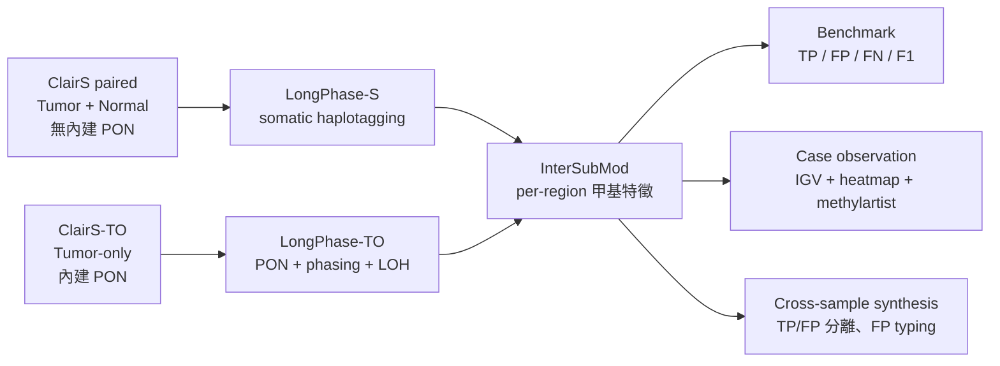
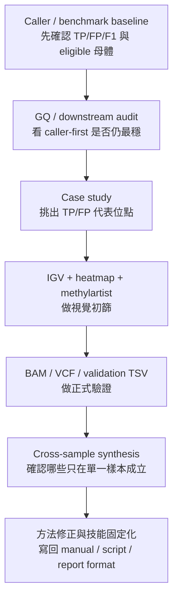
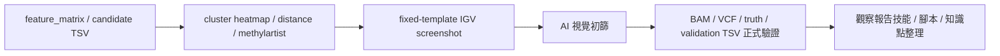

<!--
建立時間: 2026-03-17 23:40
目標: 整合 2026-03-12 至 2026-03-17 的 InterSubMod 研究主線、subclone case study、IGV 自動截圖、跨樣本特徵分析與 docs/技能制度化成果，形成可直接延續的本週主報告
處理範圍:
  - 2026-03-12 至 2026-03-17 的研究與治理主線
  - TO dual-model availability closeout 與 docs round 3
  - GQ rescue / relaxed GQ downstream 分析
  - HCC1395 5kHz paired subclone phase 4 case study
  - IGV 固定 template、自動截圖、AI 視覺初篩與正式驗證
  - 跨樣本 TP/FP 特徵分離、FP 分型與觀察報告技能固定化
關聯檔案:
  - /big8_disk/liaoyoyo2001/InterSubMod/docs/reports/validated/2026/03/20260312_TO雙模型可得性closeout_01.md
  - /big8_disk/liaoyoyo2001/InterSubMod/docs/reports/validated/2026/03/20260312_docs_round3查詢入口與導航補強報告_01.md
  - /big8_disk/liaoyoyo2001/InterSubMod/docs/reports/validated/2026/03/20260314_GQ救回TP與FP差異機制分析_01.md
  - /big8_disk/liaoyoyo2001/InterSubMod/docs/reports/validated/2026/03/20260314_75x樣本放寬GQ與downstream過濾可行性分析_01.md
  - /big8_disk/liaoyoyo2001/InterSubMod/docs/reports/validated/2026/03/20260315_subclone_phase4_casestudy_01.md
  - /big8_disk/liaoyoyo2001/InterSubMod/docs/reports/validated/2026/03/20260316_IGV固定template_AI視覺初篩與正式驗證_01.md
  - /big8_disk/liaoyoyo2001/InterSubMod/docs/reports/validated/2026/03/20260317_甲基分類方法有效性觀察與InterSubMod改進重點_01.md
  - /big8_disk/liaoyoyo2001/InterSubMod/docs/reports/validated/2026/03/20260317_FP分型與多樣本篩選規則觀察報告_01.md
  - /big8_disk/liaoyoyo2001/InterSubMod/docs/reports/validated/2026/03/20260317_跨樣本甲基特徵TP_FP分離觀察報告_01.md
  - /big8_disk/liaoyoyo2001/InterSubMod/docs/references/manual/20260317_甲基位點觀察報告生成技能_01.md
-->

# InterSubMod 研究主線週報（2026-03-12 至 2026-03-17，subclone / IGV / governance 整合）

## 0. 文件 metadata

| 欄位 | 內容 |
|---|---|
| 報告 ID | `20260317_研究主線週報_20260312_20260317_subclone_igv_governance整合_01` |
| 時間範圍 | `2026-03-12` 至 `2026-03-17` |
| 文件狀態 | `validated` |
| 報告定位 | 混合版主報告：前半管理摘要，後半技術證據鏈 |
| 主樣本/主場景 | `HCC1395 5kHz paired`，並以 `HCC1395_DORADO paired/TO` 與跨 7 樣本觀察作交叉檢查 |
| 核心主題 | `caller-first`、`subclone case study`、`IGV 自動截圖 + AI 初篩`、`跨樣本 TP/FP 分離`、`觀察報告技能固定化` |
| 主要輸出 | 本週新增 validated 報告、IGV 截圖資產、case observation 技能手冊與自動起稿腳本 |
| 讀者 | 需要同時掌握研究結論、資料來源、限制條件與下一步的研究者與 AI Agent |

欄位說明：`報告定位` 說明本文如何分配管理摘要與技術細節；`主要輸出` 指本週真正新增、後續可直接延用的文件或資產；`主樣本/主場景` 說明本週結論成立的主要母體。

## 1. 開場破題摘要

本週主目標是把上週已收斂的 `caller-first / methylation-support / annotation` 三層框架，推進成「可觀察、可驗證、可制度化」的主線：前段完成 `TO dual-model availability` closeout 與 `docs round 3` 導航收尾，中段完成 `GQ rescue` 機制拆解與 `75x paired` 放寬 `GQ` 的負結論，後段完成 `HCC1395 5kHz paired` 的 `subclone phase 4` case study、固定 template 的 `IGV` 自動截圖與 `AI` 視覺初篩/正式驗證，並把這套流程擴展到跨樣本 `TP/FP` 特徵觀察、`FP` 分型與標準化觀察報告技能。最重要的正結論是：`fixed-template IGV + cluster/distance/methylartist + validation TSV` 已形成可重跑的 case observation workflow，且 `HCC1395 5kHz paired` 的代表性 `TP` 位點確實顯示可由 `allele-driven` 甲基結構支持的 subclone 訊號；最重要的負結論是：`ClairS paired` 不應再寫成有 `PON`、`75x paired` 不建議把 primary `GQ gate` 放寬到 `gq>=12` 以下再期待 downstream 壓回 `FP`、`FP_B2` 也不能再寫成乾淨 `MNP`。目前最合理的研究定位是：甲基與 phase 訊號現階段最有價值的是 `case triage`、`subclone 解釋`、`support/annotation` 與方法修正，不是跨樣本通用的 keep/filter 主規則；下一步應優先量化 `adjacent anomaly / HP-driven FP`，並把 `phase-block-aware` 驗證與新欄位接回核心分析流程。

## 2. 背景知識整理

### 2.1 基本流程介紹

根據 [HCC1395 樣本文件](/big8_disk/liaoyoyo2001/knowledge/02_samples/HCC1395.md)、[Variant Callers](/big8_disk/liaoyoyo2001/knowledge/05_tools/variant_callers.md)、[LongPhase-S](/big8_disk/liaoyoyo2001/knowledge/05_tools/longphase_s.md)、[Phasing workflow](/big8_disk/liaoyoyo2001/knowledge/06_workflows/phasing_workflow.md) 與 [Benchmark workflow](/big8_disk/liaoyoyo2001/knowledge/06_workflows/benchmark_workflow.md)，本週涉及的高層流程可收斂成下圖。

本週需要特別校正的背景有三點：

1. `ClairS paired` 是 tumor-normal caller，靠 matched normal 過濾 germline，**不是**靠 `PON`；`PON` 是 `ClairS-TO` 與 `LongPhase-TO` 的核心組件。[Variant Callers](/big8_disk/liaoyoyo2001/knowledge/05_tools/variant_callers.md) [ClairS-TO VCF 規格](/big8_disk/liaoyoyo2001/knowledge/03_file_formats/vcf_clairs_to.md)
2. `HP=1-1 / 2-1 / 3` 在 `LongPhase-S` 中都屬於 `ALT-supporting reads`，不能把 `HP=3` 直接寫成 `LOH`。[LongPhase-S](/big8_disk/liaoyoyo2001/knowledge/05_tools/longphase_s.md) [HP / LOH 術語校正手冊](/big8_disk/liaoyoyo2001/InterSubMod/docs/references/manual/20260316_HP_LOH術語校正手冊_01.md)
3. `HP1` 與 `HP2` 的親緣意義只在**同一個 `PS` / phase block** 範圍內才可直接比較；跨 block 的 `HP` 不應直接被寫成同一條親緣線索。[Phasing workflow](/big8_disk/liaoyoyo2001/knowledge/06_workflows/phasing_workflow.md) [20260317_甲基分類方法有效性觀察與InterSubMod改進重點_01.md](/big8_disk/liaoyoyo2001/InterSubMod/docs/reports/validated/2026/03/20260317_甲基分類方法有效性觀察與InterSubMod改進重點_01.md)

### 2.2 如何追溯流程來源

| 追溯層級 | 主要文件 | 用途 |
|---|---|---|
| 當前優先級 | [docs/CURRENT_FOCUS.md](/big8_disk/liaoyoyo2001/InterSubMod/docs/CURRENT_FOCUS.md) | 確認目前主樣本、主問題與不能重踩的舊方向 |
| 歷史成功/失敗 | [docs/experiments/INDEX.md](/big8_disk/liaoyoyo2001/InterSubMod/docs/experiments/INDEX.md) | 了解哪些方向已成立、哪些只在單一樣本成立 |
| 文檔導航 | [docs/README.md](/big8_disk/liaoyoyo2001/InterSubMod/docs/README.md) | 從入口找到週報、手冊、研究主題與 provenance |
| 本週主線 | 本報告第 4 節與第 10 節索引 | 依日期回看本週各段的問題、產出與限制 |
| 可重跑輸出 | `docs/reports/validated/2026/03/assets/` 與 repo `scripts/analysis/` | 回到實際 `PNG / TSV / script` 檢查證據鏈 |

欄位說明：`追溯層級` 是閱讀順序；`主要文件` 是對應入口；`用途` 說明遇到哪種問題時應回去哪一層。

### 2.3 本週的推論過程

本週不是直接從圖片下結論，而是沿著「caller baseline → downstream audit → case validation → cross-sample generalization」的路徑收斂。

高層推論規則因此固定為：

1. 先看 baseline 與 candidate pool，避免把「因母體已被 caller 收斂」誤讀成「甲基訊號本身很強」。
2. 視覺觀察只負責提出現象與假說，不直接取代 `BAM / truth / 統計值`。
3. 單一樣本的規則若在 `DORADO`、`TO` 或跨樣本資料不穩，就只能降階成 `support`、`annotation` 或 `sample-specific hypothesis`。

### 2.4 使用到的參數與欄位意義

| 參數/欄位 | 中文意義 | 本週角色 | 使用邊界 |
|---|---|---|---|
| `GQ` | genotype quality，caller 對 genotype 的信心 | `caller-first rescue` 的主指標 | paired 與 TO 都有用，但最適門檻依模式不同 |
| `QUAL` | variant 品質分數 | `GQ` 的輔助 caller 訊號 | 在 `TO` 與部分 paired 場景可輔助，不宜單獨泛化 |
| `Quality_Score` | InterSubMod 的甲基支持分數 | cross-sample 最強的全域分離候選 | sample-dependent；在 `H2009` 的實測 triage precision 僅 `0.002` |
| `PairwiseMedianDist` | read-read 甲基距離中位數 | dataset-aware support / diagnostics | `5kHz TO` 與 `DORADO TO` 方向相反，不能全域化 |
| `CramersV` | 類別與聚類關聯的效應量 | 排除低效應 FP、描述結構強度 | 對 `HP-driven FP` 不充分，不能單獨作最終 keep rule |
| `LabelAlleleP` | allele label 的 PERMANOVA p-value | 檢查 ALT/REF 是否與甲基結構共線 | 高維或 HP 共線時會出現假顯著或被污染 |
| `LabelHPPermanovaP` / `HPP` | HP label 的 PERMANOVA p-value | 識別 `HP-driven` 結構的關鍵欄位 | 目前應納入判讀，但尚未完全回接核心邏輯 |
| `AlleleDelta` | ALT/REF 在距離空間中的分離量 | case study 與 triage 輔助指標 | 已確認會被 HP 甲基差異污染，不能單獨解釋為 allele effect |
| `DominantLabel` | 目前主要驅動來源（`allele` / `hp` / `none`） | 區分 allele-driven 與 HP-driven | 需與 `HPP`、phase block 一起看 |
| `HP=1/2/1-1/2-1/3` | read-level germline/ALT haplotype 標記 | 解釋 ALT 是否集中於某個 germline 背景 | 不能越過 `PS` 邊界直接比較親緣 |
| `PS` / phase block | 同一個相位區塊的識別 | 限定 HP 解釋範圍 | 目前 InterSubMod 尚未完整追蹤到分類邏輯 |

欄位說明：`本週角色` 說明這個欄位在本週研究被當成主規則、輔助訊號或 QC；`使用邊界` 用來避免把單一樣本現象誤寫成跨樣本規則。

## 3. 本週主目標與子目標

欄位說明：`主目標` 是本週的高層工作包；`子目標` 是可驗收的具體項目；`完成度` 以目前 repo 內可重跑或可引用的程度估計；`對應文件與輸出` 優先列 validated 報告與主資產；`主要結果` 只保留本週最需要記住的一句。

| 主目標 | 子目標 | 目標說明 | 完成度 | 對應文件與輸出 | 主要結果 |
|---|---|---|---:|---|---|
| 收斂 TO 與治理收尾 | TO dual-model availability closeout | 釐清目前 source tree 中是否存在可直接比較的 `pileup vs full model` TO 產物 | 100% | [20260312_TO雙模型可得性closeout_01.md](/big8_disk/liaoyoyo2001/InterSubMod/docs/reports/validated/2026/03/20260312_TO雙模型可得性closeout_01.md) | 現有 HCC1395 TO source tree 只確認到 pileup 路線，無法直接做 dual-model benchmark |
| 收斂 TO 與治理收尾 | docs round 3 導航補強 | 讓 `docs/` 可以不靠檔名記憶找到研究主線、手冊與 references | 100% | [20260312_docs_round3查詢入口與導航補強報告_01.md](/big8_disk/liaoyoyo2001/InterSubMod/docs/reports/validated/2026/03/20260312_docs_round3查詢入口與導航補強報告_01.md) | `Name issues=0`、`Metadata issues=0`、剩餘 `Link issues=11` 僅在 archive deep |
| 釐清 caller-first 與 downstream 邊界 | GQ rescue 機制分析 | 拆解 `GQ` 為何能救 `TP` 又不至於放回太多 `FP` | 100% | [20260314_GQ救回TP與FP差異機制分析_01.md](/big8_disk/liaoyoyo2001/InterSubMod/docs/reports/validated/2026/03/20260314_GQ救回TP與FP差異機制分析_01.md) | `GQ` 的有效性是建立在 caller 已先收斂母體；paired 與 TO 的作用機制不同 |
| 釐清 caller-first 與 downstream 邊界 | 75x paired relaxed GQ audit | 檢查 `HCC1395 5kHz paired` 是否值得放寬 `GQ` 再靠 downstream 壓回 `FP` | 100% | [20260314_75x樣本放寬GQ與downstream過濾可行性分析_01.md](/big8_disk/liaoyoyo2001/InterSubMod/docs/reports/validated/2026/03/20260314_75x樣本放寬GQ與downstream過濾可行性分析_01.md) | 不建議把 primary gate 放寬到 `gq>=12` 以下，更不建議放到 `gq>=10` |
| 建立 subclone 視覺與驗證鏈 | HCC1395 5kHz paired phase 4 case study | 用 `5 TP + 4 FP` 案例確認甲基/HP/IGV 的可觀察模式 | 100% | [20260315_subclone_phase4_casestudy_01.md](/big8_disk/liaoyoyo2001/InterSubMod/docs/reports/validated/2026/03/20260315_subclone_phase4_casestudy_01.md) 與 `20260315_subclone_phase4_casestudy_assets/` | 確立 `allele-driven TP`、`HP-driven FP`、`adjacent anomaly` 等 typology |
| 建立 subclone 視覺與驗證鏈 | 固定 template IGV + AI 初篩 + 正式驗證 | 把 IGV 截圖、AI 初篩與 `BAM/VCF` 驗證做成標準流程 | 100% | [20260316_IGV固定template_AI視覺初篩與正式驗證_01.md](/big8_disk/liaoyoyo2001/InterSubMod/docs/reports/validated/2026/03/20260316_IGV固定template_AI視覺初篩與正式驗證_01.md) 與 `assets/20260316_subclone_phase4_igv_sessions/` | `9/9` loci 可標準化出圖；AI 適合初篩，不適合取代最終證據 |
| 把 case workflow 制度化並擴展到跨樣本 | 甲基分類有效性與 InterSubMod 改進重點 | 釐清現行指標哪裡有效、哪裡失效、該怎麼修 | 100% | [20260317_甲基分類方法有效性觀察與InterSubMod改進重點_01.md](/big8_disk/liaoyoyo2001/InterSubMod/docs/reports/validated/2026/03/20260317_甲基分類方法有效性觀察與InterSubMod改進重點_01.md) | `HPP` 應升級為辨識 `HP-driven FP` 的核心欄位；`AlleleDelta` 不能單獨解釋 |
| 把 case workflow 制度化並擴展到跨樣本 | cross-sample TP/FP 分離與 FP typing | 驗證哪些特徵有跨樣本價值、哪些只能 sample-specific | 100% | [20260317_跨樣本甲基特徵TP_FP分離觀察報告_01.md](/big8_disk/liaoyoyo2001/InterSubMod/docs/reports/validated/2026/03/20260317_跨樣本甲基特徵TP_FP分離觀察報告_01.md)、[20260317_FP分型與多樣本篩選規則觀察報告_01.md](/big8_disk/liaoyoyo2001/InterSubMod/docs/reports/validated/2026/03/20260317_FP分型與多樣本篩選規則觀察報告_01.md) | `Quality_Score` 全域最強但 sample-dependent；現階段無跨樣本通用硬閾值 |
| 把 case workflow 制度化並擴展到跨樣本 | 觀察報告技能固定化 | 讓 AI 可以先產生標準化 observation report 草稿，再由人工複核 | 100% | [20260317_甲基位點觀察報告生成技能_01.md](/big8_disk/liaoyoyo2001/InterSubMod/docs/references/manual/20260317_甲基位點觀察報告生成技能_01.md)、[generate_case_observation_report.py](/big8_disk/liaoyoyo2001/InterSubMod/scripts/analysis/generate_case_observation_report.py) | 已固定輸入欄位、圖片格式、Q&A 版型與自動起稿腳本 |

## 4. 依時間順序的研究進展

本節所有時間段共用同一組欄位。欄位說明：`完成時間` 指主要收斂日期；`研究問題` 是該段要回答的核心問題；`實驗流程` 為實際採用的分析步驟；`輸入資料` 指主要 BAM/VCF/TSV 或來源文件；`產出檔案` 為主要報告與資產；`主要數據` 只列本段最關鍵的量化結果；`推論與限制` 用來界定可成立範圍。

### 4.1 2026-03-12：TO dual-model closeout、docs round 3 與 AI 研究藍圖

| 欄位 | 內容 |
|---|---|
| 標題 | `TO dual-model availability closeout + docs round 3 + AI workflow integration` |
| 完成時間 | `2026-03-12` |
| 研究問題 | 1. 現有 `HCC1395 TO` source tree 是否真的存在可直接比較的 `pileup/full-model` 對照？ 2. docs 是否已能不靠檔名記憶找到主入口？ 3. 本週後續研究是否能沿 AI/週報/手冊固定路徑延續？ |
| 實驗流程 | 檢查 4 組 `TO` source tree 與 `run_clairs_to.log`；盤點 `benchmark-test` 可得性；補 `research/README`、`references/README`、`manual/README` 與 `methylation_methodology/README`；整合 AI 寫作與簡報藍圖 |
| 輸入資料 | `/big8_disk/data/HCC1395/ONT*/ClairS_TO_*` source tree、`docs/` 目錄與 round 1/2 輸出 |
| 產出檔案 | [20260312_TO雙模型可得性closeout_01.md](/big8_disk/liaoyoyo2001/InterSubMod/docs/reports/validated/2026/03/20260312_TO雙模型可得性closeout_01.md)、[20260312_docs_round3查詢入口與導航補強報告_01.md](/big8_disk/liaoyoyo2001/InterSubMod/docs/reports/validated/2026/03/20260312_docs_round3查詢入口與導航補強報告_01.md)、[20260312_AI自動化F1研究主線與PPT藍圖整合報告_01.md](/big8_disk/liaoyoyo2001/InterSubMod/docs/reports/validated/2026/03/20260312_AI自動化F1研究主線與PPT藍圖整合報告_01.md) |
| 主要數據 | `TO` 四個 source tree 都只確認到 `pileup` 路線；無法直接做 `pileup vs full model` benchmark。docs 結構檢查維持 `Name issues=0`、`Metadata issues=0`、`Link issues=11` 且僅剩 archive deep 歷史快照。 |
| 推論與限制 | `TO dual-model comparison unavailable in current source tree` 已可定案；後續若要做 TO dual-model，比起補表更需要先找到或重跑真正的 full-model 產物。這一天的治理成果不直接提供生物學結論，但建立了之後所有報告與手冊的固定入口。 |

### 4.2 2026-03-14：GQ rescue 機制與 75x paired relaxed gate 邊界

| 欄位 | 內容 |
|---|---|
| 標題 | `GQ rescue mechanism audit + relaxed GQ downstream strategy audit` |
| 完成時間 | `2026-03-14` |
| 研究問題 | 1. 為什麼 `GQ` 可以在多數場景中救回 `TP`、卻不至於放回太多 `FP`？ 2. `HCC1395 5kHz paired` 是否值得把 primary `GQ gate` 放寬，再靠 `LongPhase-S / InterSubMod / 甲基特徵` 壓回 `FP`？ |
| 實驗流程 | 對 `5kHz paired`、`5kHz TO`、`DORADO paired`、`DORADO TO` 做 rescue candidate pool audit；比對 `gq>=10/12/15/18/20` 與 downstream 支持/過濾規則；再回查 `eligible FP pool`、`LOH-like proxy`、read-level 與甲基 summary |
| 輸入資料 | `rescue_joined_features.tsv`、`borderline_candidate_pool.tsv`、`significance_summary.csv`、paired/TO baseline benchmark、相關 knowledge docs |
| 產出檔案 | [20260314_GQ救回TP與FP差異機制分析_01.md](/big8_disk/liaoyoyo2001/InterSubMod/docs/reports/validated/2026/03/20260314_GQ救回TP與FP差異機制分析_01.md)、[20260314_75x樣本放寬GQ與downstream過濾可行性分析_01.md](/big8_disk/liaoyoyo2001/InterSubMod/docs/reports/validated/2026/03/20260314_75x樣本放寬GQ與downstream過濾可行性分析_01.md) |
| 主要數據 | 在 `5kHz paired`，`gq>=10` 會多帶入 `616` 個 `FP`，`183 TP / 616 FP` 對 `LongPhase-S` 為負增益；最接近可接受的 relaxed 策略是 `gq>=12 + Quality_Score>=60`，但仍沒有超過現行 `gq>=15/18/20`。在 `TO`，`GQ` 的低 `FP` 很大部分來自 caller 已先把 eligible 母體縮小。 |
| 推論與限制 | 這一段正式固定了本週的第一個負結論：paired 75x 不該把 `GQ` 放寬到 `gq>=12` 以下，更不應期待 downstream 把 `gq>=10` 帶進來的額外 `FP` 壓回來。`GQ` 的作用本質是 caller 收斂後的排序，而不是單獨扛起 TP/FP 分離。 |

### 4.3 2026-03-15：HCC1395 5kHz paired subclone phase 4 case study

| 欄位 | 內容 |
|---|---|
| 標題 | `Phase 4 subclone candidate map + 5 TP / 4 FP case study` |
| 完成時間 | `2026-03-15` |
| 研究問題 | 在 `HCC1395 5kHz paired` 中，是否存在可視覺化驗證的 `subclone methylation` 位點？現行指標（`VerificationClass`、`CramersV`、`AlleleP`、`AlleleDelta`）各自對 `TP/FP` 說明了什麼？ |
| 實驗流程 | 建立 feature matrix、挑出 discriminative loci 與 chromosome map；用 `5 TP + 4 FP` 案例做 cluster heatmap、distance heatmap、methylartist 與觀察問題；整理知識點與 IGV 截圖方案 |
| 輸入資料 | `analysis/feature_matrix_20260315.tsv`、`analysis/subclone_case_study_candidates_20260315.tsv`、`analysis/subclone_loci_20260315.tsv` |
| 產出檔案 | [20260315_甲基特異位點亞克隆整合分析_pilot_01.md](/big8_disk/liaoyoyo2001/InterSubMod/docs/reports/validated/2026/03/20260315_甲基特異位點亞克隆整合分析_pilot_01.md)、[20260315_subclone_phase4_casestudy_01.md](/big8_disk/liaoyoyo2001/InterSubMod/docs/reports/validated/2026/03/20260315_subclone_phase4_casestudy_01.md)、`20260315_subclone_phase4_casestudy_assets/` |
| 主要數據 | pilot 中 `TP=29,740`、`FP=627`；`VerificationClass=Subclone` 的 `FP rate=0.71%`（`1402 TP / 10 FP`），`CramersV>0.3` 在 pilot 看起來接近完美，但 `5 TP + 4 FP` case study 顯示這並不等於最終可解釋性。 |
| 推論與限制 | 這一天建立了 `allele-driven TP`、`高 HP0 但仍 allele 有效`、`低甲基弱差異 TP`、`HP-driven FP` 與 `adjacent anomaly` 等 typology；但當時尚未把 `HPP`、`phase block` 與 fixed-template `IGV` 全面接入，因此屬於「初步 typology + 待驗證機制」。 |

### 4.4 2026-03-16：IGV 固定 template、自動截圖、AI 初篩與正式驗證

| 欄位 | 內容 |
|---|---|
| 標題 | `fixed-template IGV automation + AI prescreen + BAM/VCF validation` |
| 完成時間 | `2026-03-16` |
| 研究問題 | 1. 是否能把 IGV 截圖做成固定 template、固定樣本順序、固定輸出格式？ 2. AI 能從圖上先判到哪一層？ 3. 哪些現象必須回到 `BAM / VCF / truth / feature matrix` 才能定論？ |
| 實驗流程 | 以 `template.xml` 產生 per-locus sessions 與固定 PNG；對 9 個 loci 做 AI 視覺初篩；再用 tumor/normal `BAM`、`SEQC2 truth`、feature matrix 做正式驗證與 `FP` 機制回查 |
| 輸入資料 | `/big8_disk/liaoyoyo2001/IGV_session/template.xml`、tumor/normal BAM、`20260316_igv_case_validation_01.tsv`、SEQC2 truth VCF、`20260315` case assets |
| 產出檔案 | [20260316_IGV固定template_AI視覺初篩與正式驗證_01.md](/big8_disk/liaoyoyo2001/InterSubMod/docs/reports/validated/2026/03/20260316_IGV固定template_AI視覺初篩與正式驗證_01.md)、`assets/20260316_subclone_phase4_igv_sessions/`、[20260316_IGV自動截圖操作手冊_01.md](/big8_disk/liaoyoyo2001/InterSubMod/docs/references/manual/20260316_IGV自動截圖操作手冊_01.md) |
| 主要數據 | `9/9` loci 已可固定 template 出圖；AI 可穩定抓到 `ALT 是否成群`、`normal 是否也有類似結構`、`是否有相鄰異常柱` 等視覺現象，但 `FP_B2` 經正式驗證後被更正為 `local alignment anomaly / -1 deletion-like gap`，不能再寫成乾淨 `MNP`。 |
| 推論與限制 | 這一天正式把 `圖片初篩` 與 `正式驗證` 分層：AI 適合先做圖像 triage，但不能替代 `BAM / VCF / 統計值`。固定 template 與標準 session 已成立，之後可直接批次沿用。 |

### 4.5 2026-03-17：甲基分類有效性、跨樣本規則邊界與技能固定化

| 欄位 | 內容 |
|---|---|
| 標題 | `method validity audit + cross-sample synthesis + observation-report skill` |
| 完成時間 | `2026-03-17` |
| 研究問題 | 1. 現行甲基分類指標到底哪些有效、哪些失效？ 2. 跨 7 樣本 / 16 runs 是否存在通用 `TP/FP` 篩選規則？ 3. 能否把 `IGV + heatmap + validation TSV` 的觀察格式固定成技能與腳本？ |
| 實驗流程 | 回查 9-case 完整指標矩陣；分析 `716,073 TP / 33,323 FP` 的跨樣本特徵分離；建立 `FP` 類型 A/B/C；撰寫 observation-report 技能手冊與範例，並新增自動起稿腳本 |
| 輸入資料 | `20260316_igv_case_validation_01.tsv`、cross-sample workspace、`assets/20260317_*` 圖表、manual/skill 文件 |
| 產出檔案 | [20260317_甲基分類方法有效性觀察與InterSubMod改進重點_01.md](/big8_disk/liaoyoyo2001/InterSubMod/docs/reports/validated/2026/03/20260317_甲基分類方法有效性觀察與InterSubMod改進重點_01.md)、[20260317_跨樣本甲基特徵TP_FP分離觀察報告_01.md](/big8_disk/liaoyoyo2001/InterSubMod/docs/reports/validated/2026/03/20260317_跨樣本甲基特徵TP_FP分離觀察報告_01.md)、[20260317_FP分型與多樣本篩選規則觀察報告_01.md](/big8_disk/liaoyoyo2001/InterSubMod/docs/reports/validated/2026/03/20260317_FP分型與多樣本篩選規則觀察報告_01.md)、[20260317_甲基位點觀察報告生成技能_01.md](/big8_disk/liaoyoyo2001/InterSubMod/docs/references/manual/20260317_甲基位點觀察報告生成技能_01.md)、[generate_case_observation_report.py](/big8_disk/liaoyoyo2001/InterSubMod/scripts/analysis/generate_case_observation_report.py) |
| 主要數據 | `Quality_Score` 是全域最強分離候選（`std_delta=+0.800`），但高度 sample-dependent；`H2009` 上 `Quality_Score < 75` 實測 precision 僅 `0.002`；`HPP < 0.05 AND DominantLabel=hp` 成為辨識 `HP-driven FP` 的最關鍵候選規則；跨 `7` 樣本目前沒有任何單一規則在全部樣本都能正向改善 `F1`。 |
| 推論與限制 | 這一天把「哪些能升級成方法結論、哪些只能保留在分析層」明確分開：甲基分類對 `allele-driven TP` 與 `CramersV=0` 類型的低效應 `FP` 有用，但對 `HP-driven FP`、高維假顯著與跨平台差異仍需新欄位與 `phase-block-aware` 驗證。 |

## 5. 主題式整合分析

### 5.1 `caller-first` 本週沒有被動搖，反而被收斂得更清楚

| 場景 | 最穩定主規則 | 本週是否被推翻 | 正式定位 |
|---|---|---|---|
| `HCC1395 5kHz paired` | `gq>=15` 或更嚴格 caller gate | 否 | `caller-first`，不建議 relaxed `GQ` 後再靠 downstream 壓回 |
| `HCC1395_DORADO paired` | `gq>=15/20` | 否 | `caller-first`，甲基訊號目前不穩定 |
| `HCC1395 5kHz TO` | `gq>=10` / `qual>=10 or gq>=20` | 否 | `caller-first + methylation-support` |
| `HCC1395_DORADO TO` | `gq>=10` | 否 | `caller-first + methylation-support`，但 support 方向與 `5kHz TO` 不同 |

這張表的真正意義不是「甲基沒用」，而是：

1. 甲基訊號的最佳角色目前仍是 `support / annotation / triage`。
2. `GQ` 的有效性要放在 caller 已先縮小母體這個前提下理解。
3. paired 與 TO 的邊界應分開寫；不能把 `TO` 的甲基 support 直接升級成 paired 規則。

### 5.2 subclone 與 case workflow 已從「觀察」升級到「可重跑證據鏈」

本週把 `HCC1395 5kHz paired` 的 phase 4 case study 從單純視覺觀察，推進成一條可重跑的固定鏈：

已成立的能力：

1. 可以固定樣本順序與 template，自動產生 IGV PNG。
2. 可以把 case 觀察拆成 `觀察 / 觀察驗證 / 推論 / 待補驗`。
3. 可以讓 AI 先預填視覺現象，再由人工回到 `BAM / truth` 做正式驗證。

尚未升級成全域規則的部分：

1. `case typology` 仍以 `HCC1395 5kHz paired` 為主。
2. `TP-5` 這種 `HP + Allele` 雙重顯著的 case，仍需要 `PS / phase block` 層級驗證。
3. `adjacent anomaly` 與 `deletion-like gap` 還沒做全量量化。

### 5.3 甲基分類指標本週完成了「有效/失效/待修正」的清楚分層

| 指標/訊號 | 目前評價 | 已成立結論 | 需要修正的點 |
|---|---|---|---|
| `CramersV` | 必要但不充分 | 可排除 `CramersV=0` 的低效應 `FP` | 對 `HP-driven FP` 無法單獨防守 |
| `LabelAlleleP` | 有用但易被污染 | 對 `TP-1~4` 的 allele-driven case 有價值 | 高維與 HP 共線時會假顯著 |
| `HPP` | 本週最重要新增主角 | 對辨識 `HP-driven FP` 最關鍵 | 尚未完整回接到核心分類邏輯 |
| `AlleleDelta` | 仍有用，但要降階解讀 | 能描述分離量 | 會被 HP 差異污染，不能單獨當 allele-driven 判據 |
| `Quality_Score` | 全域候選最強，但 sample-dependent | 在部分 paired 樣本與 TO 有分離力 | `H2009` 實測 triage precision 極低，不能直接做全域 cutoff |
| `PairwiseMedianDist` | dataset-aware support | 可作 support/annotation | 方向在 `5kHz TO` 與 `DORADO TO` 相反，不能全域化 |

這裡最重要的研究定位是：**InterSubMod 的方法學價值還在，但必須從「單一分數閾值思維」轉成「多欄位分層解釋」**。本週的核心修正方向因此很明確：

1. 把 `HPP`、`DominantLabel`、`phase block` 納入判讀主幹。
2. 對 `AlleleDelta` 補一個不易被 HP 污染的 raw 甲基差欄位。
3. 把跨樣本不穩定的訊號明確降階成 `dataset-aware annotation`。

### 5.4 研究治理這週真正改善的是「延續性」，不是只多了文件

治理成果本週值得保留的不是文件數量，而是三件具體可延續的能力：

1. `docs round 3` 讓新進入者可以從 `docs/README.md` 直接走到 topic README、manual 與本週主線。
2. IGV 自動截圖、observation-report skill 與起稿腳本，把 case study 從一次性分析變成可重跑模板。
3. 手冊層明確校正了 `ClairS paired` 與 `PON`、`HP tag`、`phase block` 等術語，降低之後文件再漂移的風險。

## 6. 數據表格與圖表解讀規範

本週主體仍以表格、`TSV` 與既有 diagnostics 證據鏈為主；下列圖片只放代表性案例，完整 `PNG / SVG / session / TSV` 請回看對應 assets 路徑。

### 6.1 本週常用表格欄位解讀

| 欄位 | 意義 | 本週常見用法 |
|---|---|---|
| `TP / FP / FN` | 與 truth set 比對後的真陽性/假陽性/假陰性 | benchmark、規則比較、cross-sample 成效摘要 |
| `precision / recall / F1` | caller 或規則的標準評估指標 | 比較 caller-first 與 downstream 策略 |
| `delta_f1_vs_baseline` | 相對 baseline 的 F1 變化 | 判斷某策略是否值得升級 |
| `delta_f1_vs_gate` | 在固定 caller gate 後再加規則的增減 | 判斷甲基是否真的補強 caller |
| `CramersV / LabelAlleleP / HPP / DominantLabel` | case study 的主要分類與驅動來源欄位 | 區分 allele-driven、hp-driven 與 none |
| `Quality_Score / PairwiseMedianDist / AlleleDelta` | 甲基 support 或結構分離訊號 | 適合 ranking、annotation 或特定 dataset 診斷 |

### 6.2 圖 1：HCC1395 5kHz paired 的 TP/FP 特徵分布總覽

- 圖要表達的重點：`HCC1395 5kHz paired` 中，`TP` 與 `FP` 在多個甲基與結構特徵上的整體分布差異；可快速看出 `AlleleDelta`、`LabelHPPermanovaP`、`Quality_Score` 等欄位的偏移方向。
- X 軸單位與意義：每個小圖的 X 軸都是該特徵的數值，例如 `PairwiseMedianDist` 是 read-read 距離值、`CramersV` 是效應量、`Quality_Score` 是甲基支持分數、`NumReads / NumCpGs` 是計數值。
- Y 軸單位與意義：密度（density），表示該特徵值在 `TP` 或 `FP` 群中的相對分布，而不是絕對個數。
- 本週如何使用：這張圖主要支援 `03/15` pilot 與 `03/17` 方法學收斂，幫助判斷哪些特徵值得進一步放到 case level 檢查。

### 6.3 圖 2：代表性 TP case 的甲基化 cluster heatmap

- 圖要表達的重點：`chr16:35118902` 的 read-level 甲基結構在 `TP` case 中呈現清楚分層，並且 ALT 相關 read 與 REF 背景 read 有明顯不同的甲基模式。
- X 軸單位與意義：視窗內的 `CpG` 位點，依基因組位置排序；單位是基因組座標上的離散 `CpG` 欄位，而不是連續距離。
- Y 軸單位與意義：單條 reads；顏色表示 read 在各 `CpG` 上的甲基化狀態或機率（高低甲基分層）。
- 本週如何使用：這是 `03/15` case study 的主體圖之一，也是在 `03/16` IGV 驗證前，AI/人工都最容易先看到「這個位點真的有分群」的圖。

### 6.4 圖 3：同一 TP case 的固定 template IGV 截圖

- 圖要表達的重點：在固定 template 下，tumor 與 normal 的 read-level 結構、target 周邊非參考訊號、annotation 軌道與樣本順序都可一致呈現，方便跨 case 直接比較。
- X 軸單位與意義：基因組座標（bp），本批為目標位點中心的固定視窗。
- Y 軸單位與意義：自上而下是 annotation 與 BAM read tracks；每一列 read 不是定量高度，而是 read 在該區域的對齊與堆疊。
- 本週如何使用：AI 適合先看這張圖判斷 `ALT 是否成群`、`normal 是否也有相同結構`、`是否有相鄰異常柱`；但最終仍要回到 `BAM / VCF / validation TSV` 做正式定論。

### 6.5 圖 4：跨樣本 VerificationClass 熱圖

- 圖要表達的重點：`FP` 與 `TP` 在不同樣本中的 `VerificationClass` 組成比例差異，顯示同一個分類標籤在不同樣本的可靠度並不一致。
- X 軸單位與意義：`VerificationClass` 類別（`Noise / Strong / Subclone / Weak`）。
- Y 軸單位與意義：樣本名稱。
- 色階單位與意義：百分比（%），代表該樣本中 `FP` 或 `TP` 落在該類別的比例。
- 本週如何使用：支援 `03/17` 的跨樣本整合，直接說明為什麼不能把單一 `VerificationClass` 或單一 cutoff 當作所有樣本的共通規則。

## 7. 本週完成度總結

欄位說明：`主目標` 與第 3 節對齊；`完成度` 是以目前 repo 內可驗證程度標記；`主要證據` 只列最核心文件；`是否已有定論` 區分可直接沿用與仍需補驗的項目。

| 主目標 | 子目標 | 完成度 | 主要證據 | 是否已有定論 |
|---|---|---:|---|---|
| TO 與治理收尾 | TO dual-model availability closeout | 100% | [20260312_TO雙模型可得性closeout_01.md](/big8_disk/liaoyoyo2001/InterSubMod/docs/reports/validated/2026/03/20260312_TO雙模型可得性closeout_01.md) | 是：current source tree 無可直接比較的 TO full-model |
| TO 與治理收尾 | docs round 3 導航補強 | 100% | [20260312_docs_round3查詢入口與導航補強報告_01.md](/big8_disk/liaoyoyo2001/InterSubMod/docs/reports/validated/2026/03/20260312_docs_round3查詢入口與導航補強報告_01.md) | 是：docs 三層導航已成立 |
| caller/downstream 邊界 | GQ rescue 機制分析 | 100% | [20260314_GQ救回TP與FP差異機制分析_01.md](/big8_disk/liaoyoyo2001/InterSubMod/docs/reports/validated/2026/03/20260314_GQ救回TP與FP差異機制分析_01.md) | 是：`GQ` 的價值屬 caller 收斂後排序 |
| caller/downstream 邊界 | 75x paired relaxed gate audit | 100% | [20260314_75x樣本放寬GQ與downstream過濾可行性分析_01.md](/big8_disk/liaoyoyo2001/InterSubMod/docs/reports/validated/2026/03/20260314_75x樣本放寬GQ與downstream過濾可行性分析_01.md) | 是：不建議放寬到 `gq>=12` 以下 |
| subclone 視覺與驗證鏈 | phase 4 case study | 100% | [20260315_subclone_phase4_casestudy_01.md](/big8_disk/liaoyoyo2001/InterSubMod/docs/reports/validated/2026/03/20260315_subclone_phase4_casestudy_01.md) | 部分：typology 成立，但需跨樣本與 phase block 驗證 |
| subclone 視覺與驗證鏈 | IGV 固定 template + AI 初篩 + 正式驗證 | 100% | [20260316_IGV固定template_AI視覺初篩與正式驗證_01.md](/big8_disk/liaoyoyo2001/InterSubMod/docs/reports/validated/2026/03/20260316_IGV固定template_AI視覺初篩與正式驗證_01.md) | 是：workflow 成立；AI 僅初篩 |
| 方法與跨樣本收斂 | 方法有效性與改進重點 | 100% | [20260317_甲基分類方法有效性觀察與InterSubMod改進重點_01.md](/big8_disk/liaoyoyo2001/InterSubMod/docs/reports/validated/2026/03/20260317_甲基分類方法有效性觀察與InterSubMod改進重點_01.md) | 是：弱點與修正方向已清楚 |
| 方法與跨樣本收斂 | cross-sample TP/FP 分離與 FP typing | 100% | [20260317_跨樣本甲基特徵TP_FP分離觀察報告_01.md](/big8_disk/liaoyoyo2001/InterSubMod/docs/reports/validated/2026/03/20260317_跨樣本甲基特徵TP_FP分離觀察報告_01.md)、[20260317_FP分型與多樣本篩選規則觀察報告_01.md](/big8_disk/liaoyoyo2001/InterSubMod/docs/reports/validated/2026/03/20260317_FP分型與多樣本篩選規則觀察報告_01.md) | 是：目前無跨樣本通用硬規則 |
| 方法與跨樣本收斂 | 觀察報告技能固定化 | 100% | [20260317_甲基位點觀察報告生成技能_01.md](/big8_disk/liaoyoyo2001/InterSubMod/docs/references/manual/20260317_甲基位點觀察報告生成技能_01.md)、[generate_case_observation_report.py](/big8_disk/liaoyoyo2001/InterSubMod/scripts/analysis/generate_case_observation_report.py) | 是：已可自動起稿並接圖 |

## 8. 目前尚缺與待補齊事項

| 待補項目 | 為何還缺 | 不補的風險 | 建議補法 |
|---|---|---|---|
| `adjacent anomaly / -1 deletion-like gap` 的大規模量化 | 目前只有 `FP_B2` 等 case-level 驗證，尚未跨樣本系統量化 | 容易把局部 alignment artifact 誤寫成新的甲基或 allele 規則 | 對 `HCC1395 5kHz`、`DORADO`、`TO` 批次回查 target ±1 的 indel/gap pattern |
| `HPP`、`DominantLabel`、`phase block` 尚未完整接入核心邏輯 | 本週已驗證其重要性，但仍主要停留在分析層與文件層 | 後續分類仍會反覆遇到 `HP-driven FP` 與跨 block 誤解 | 在 `src/core/LabelTest.cpp` 或輸出表新增欄位與 flag，並追蹤 `PS` |
| `AlleleMethDelta`、`HP1MethMean/HP2MethMean` 等修正欄位尚未實作 | 本週只完成需求定義與方法論證，尚未改 C++ export | `AlleleDelta` 仍可能被 HP 差異污染，造成誤解 | 先做最小欄位擴充，再跑 `HCC1395 5kHz paired` 回歸測試 |
| case study 的 typology 尚未跨樣本驗證 | 目前主體仍是 `HCC1395 5kHz paired` | 容易把 `5kHz` 特有現象誤寫成 general rule | 先以 `HCC1395_DORADO paired`、`HCC1395_DORADO TO` 做第一輪對照 |
| 歷史文件仍有少量舊口徑殘留 | 雖然 active docs 已大致校正，但 provenance 與早期深度報告仍留有舊假說 | 後續 AI 或人工可能再次引用過時說法 | 以 superseded note 或簡短校正註記清理高風險歷史文件 |

## 9. 下一步建議

1. 優先做 `adjacent anomaly / deletion-like gap` 與 `HP-driven FP` 的大規模量化，先在 `HCC1395 5kHz paired`、`HCC1395_DORADO paired/TO` 建立可重跑清單，確認 `FP_B2` 類型是不是少數 case 還是可泛化機制。
2. 在分析輸出中新增 `AlleleMethDelta`、`HP1MethMean/HP2MethMean`、`AlleleHPCorrScore` 與 `HPDrivenFP_candidate`，並把 `HPP`、`DominantLabel` 接到正式 triage 欄位，避免 `CramersV` 單獨主導分類。
3. 補做 `phase-block-aware` 驗證，至少先把 `PS` 或 phase block span 匯出到 case-level 報告，讓 `TP-5` 與 `FP-B1/B2` 的 HP 解釋不再停留在局部推論。
4. 把本週固定下來的 `IGV + heatmap + validation TSV + AI 初篩` 流程擴展到 `DORADO paired` 與 `DORADO TO`，確認 case typology 何者跨平台成立、何者只屬於 `5kHz`。
5. 以最小成本更新高風險歷史文件的 superseded note，確保之後讀到舊文件時，不會再把 `ClairS paired=PON`、`HP=3=LOH`、`FP_B2=MNP` 這些舊口徑帶回來。

## 10. 參考文件索引

| 文件 | 本週重點 |
|---|---|
| [20260312_TO雙模型可得性closeout_01.md](/big8_disk/liaoyoyo2001/InterSubMod/docs/reports/validated/2026/03/20260312_TO雙模型可得性closeout_01.md) | 正式關閉 `TO pileup vs full model` 可得性問題，確立目前 source tree 無可直接比較的 full-model 對照。 |
| [20260312_docs_round3查詢入口與導航補強報告_01.md](/big8_disk/liaoyoyo2001/InterSubMod/docs/reports/validated/2026/03/20260312_docs_round3查詢入口與導航補強報告_01.md) | 把 docs 補成三層導航，後續所有週報與手冊都依這個入口延續。 |
| [20260314_GQ救回TP與FP差異機制分析_01.md](/big8_disk/liaoyoyo2001/InterSubMod/docs/reports/validated/2026/03/20260314_GQ救回TP與FP差異機制分析_01.md) | 說明 `GQ` 的有效性為何是 caller 收斂後的排序問題，而不是單一分數魔法。 |
| [20260314_75x樣本放寬GQ與downstream過濾可行性分析_01.md](/big8_disk/liaoyoyo2001/InterSubMod/docs/reports/validated/2026/03/20260314_75x樣本放寬GQ與downstream過濾可行性分析_01.md) | 本週 paired 主線的關鍵負結論：不建議在 `75x paired` 放寬 primary `GQ gate`。 |
| [20260315_subclone_phase4_casestudy_01.md](/big8_disk/liaoyoyo2001/InterSubMod/docs/reports/validated/2026/03/20260315_subclone_phase4_casestudy_01.md) | 建立 `5 TP + 4 FP` 的 case typology、圖像資產與知識點整理，是本週後半所有驗證的起點。 |
| [20260316_IGV固定template_AI視覺初篩與正式驗證_01.md](/big8_disk/liaoyoyo2001/InterSubMod/docs/reports/validated/2026/03/20260316_IGV固定template_AI視覺初篩與正式驗證_01.md) | 把 fixed-template IGV、AI 視覺初篩與 `BAM/VCF` 正式驗證串成可重跑流程。 |
| [20260317_甲基分類方法有效性觀察與InterSubMod改進重點_01.md](/big8_disk/liaoyoyo2001/InterSubMod/docs/reports/validated/2026/03/20260317_甲基分類方法有效性觀察與InterSubMod改進重點_01.md) | 清楚界定甲基分類哪裡有效、哪裡失效，以及為何 `HPP` 與 phase block 成為下一步核心。 |
| [20260317_跨樣本甲基特徵TP_FP分離觀察報告_01.md](/big8_disk/liaoyoyo2001/InterSubMod/docs/reports/validated/2026/03/20260317_跨樣本甲基特徵TP_FP分離觀察報告_01.md) | 給出跨樣本特徵分離能力排名，說明哪些指標雖強但仍受 sample/mode 影響。 |
| [20260317_FP分型與多樣本篩選規則觀察報告_01.md](/big8_disk/liaoyoyo2001/InterSubMod/docs/reports/validated/2026/03/20260317_FP分型與多樣本篩選規則觀察報告_01.md) | 把 FP 分成 Type A/B/C，正式說明目前不存在跨樣本通用硬規則。 |
| [20260317_甲基位點觀察報告生成技能_01.md](/big8_disk/liaoyoyo2001/InterSubMod/docs/references/manual/20260317_甲基位點觀察報告生成技能_01.md) | 固定 observation report 的輸入規格、圖片格式與問答結構，讓之後的 case report 可重跑且可審核。 |
