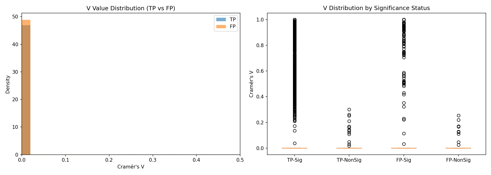

# F1-score 最佳化深度分析報告

**分析日期**: 2026-01-07  
**分析目標**: 基於「FP 傾向 Low V + High Sig」與「TP 傾向 High V 或 Weak」的概念，尋找最佳過濾條件以提升 F1-score。

---

## 1. 核心發現

### 1.1 TP/FP 模式差異

| 特徵 | TP 傾向 | FP 傾向 | 意涵 |
|:---|:---|:---|:---|
| **Cramér's V** | 較高分佈 (含 V>0.3 峰值) | 集中於低 V 區間 | FP 的「顯著」多為統計假象 |
| **Significant=True** | 多為高 V 伴隨 | 多為低 V 伴隨 | "Low V + Sig" 是 FP 標誌 |
| **LabelDelta** | 較低 (標籤一致) | 較高 (標籤分歧) | 高 Delta 傾向 FP |

### 1.2 關鍵統計

**V 值 × Significant 交叉分析表**已輸出至:  
`../../../../../../../output/bip8_output_archive/f1_optimization_analysis/v_sig_ratio_table.csv`

---

## 2. F1-score 最佳化結果

### 2.1 基準值
- **Baseline F1**: 0.815437
- **TP**: 30,490 | **FP**: 4,842 | **FN**: 8,960

### 2.2 最佳策略

> **Remove LabelDelta > 0.25**

| 指標 | 值 |
|:---|:---:|
| 移除 FP | 314 |
| 移除 TP | 191 |
| FP/TP 比 | 1.64 |
| **新 F1** | **0.815844** |
| **改善幅度** | **+0.000407** |

### 2.3 有效策略列表 (F1 ↑)

| 排名 | 策略 | 移除 FP | 移除 TP | FP/TP 比 | F1 改善 |
|:---:|:---|:---:|:---:|:---:|:---:|
| 1 | Remove LabelDelta > 0.25 | 314 | 191 | 1.64 | +0.000407 |
| 2 | Remove LabelDelta > 0.3 | 190 | 112 | 1.70 | +0.000294 |
| 3 | Remove LabelDelta > 0.35 | 125 | 77 | 1.62 | +0.000139 |
| 4 | Remove LabelDelta > 0.4 | 94 | 58 | 1.62 | +0.000102 |
| 5 | Remove LabelDelta > 0.2 | 556 | 380 | 1.46 | +0.000061 |
| 6 | Remove LabelDelta > 0.5 | 37 | 22 | 1.68 | +0.000050 |

### 2.4 策略效果視覺化

---

## 3. 分析結論

### 3.1 最有效的過濾方法
根據分析，**LabelDelta** 是目前最有效的單一過濾指標：
- **原因**: LabelDelta 直接捕捉「標籤與聚類不一致」的特徵，這在 FP 中更常見。
- **閾值建議**: LabelDelta > 0.3 是最佳平衡點。

### 3.2 "Low V + High Sig" 假說驗證
分析證實此模式存在，但其過濾效果**不如 LabelDelta**：
- 原因 1: 大部分位點 (TP 和 FP) 的 V 值都很低 (< 0.1)，難以區分。
- 原因 2: Significant=True 的位點數量本就很少 (約 2-6%)，過濾空間有限。

### 3.3 實際可行的 F1 改善範圍
- **可達成的 F1 改善**: **+0.0003 ~ +0.0004**
- **限制因素**: 絕大多數 (>95%) 的 TP 和 FP 在甲基化特徵上無法區分。

---

## 4. 建議作法

1. **採用 LabelDelta > 0.3 過濾**: 這是目前唯一能穩定提升 F1 的策略。
2. **不建議使用 V 值過濾**: 會導致大量 TP 損失 (除非只用於二次驗證)。
3. **後續方向**: F1 的進一步提升需依賴非甲基化特徵 (如 VAF, QUAL 分數等)。

---

## 5. 輸出檔案

| 檔案 | 路徑 |
|:---|:---|
| 完整策略結果 | `../../../../../../../output/bip8_output_archive/f1_optimization_analysis/f1_optimization_results.csv` |
| V×Sig 比例表 | `../../../../../../../output/bip8_output_archive/f1_optimization_analysis/v_sig_ratio_table.csv` |
| V 分佈圖 | `../../../../../../../output/bip8_output_archive/f1_optimization_analysis/v_distribution_comparison.png` |
| F1 策略圖 | `../../../../../../../output/bip8_output_archive/f1_optimization_analysis/f1_improvement_strategies.png` |
| 移除比與F1圖 | `../../../../../../../output/bip8_output_archive/f1_optimization_analysis/removal_ratio_vs_f1.png` |
