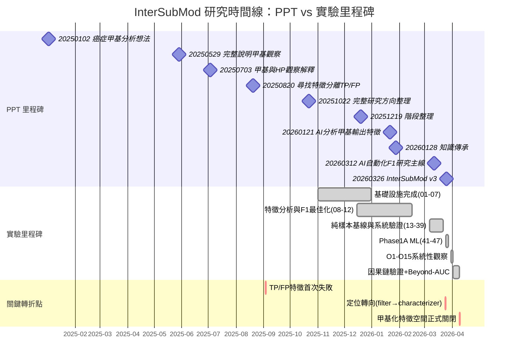

<!--
建立時間: 2026-04-09 23:45
目標: 整合 PPT 簡報敘事、知識庫參考資料、論文文獻與正式實驗紀錄，橋接非正式思路與正式結論
處理範圍: 43 份 PPT、42 份知識庫文件、19 篇論文、50+ 實驗紀錄
關聯檔案:
  - docs/archive/2026/04/ppt_text_extracts/00_INDEX.md
  - docs/archive/2026/04/20260409_論文摘要提取_01.md
  - docs/archive/2026/04/20260409_現有研究文件摘要_01.md
  - /big8_disk/liaoyoyo2001/Knowledge/
-->

# PPT 與知識庫研究整合

> 本文件的價值在於**連結來源**，而非產出新分析。每一項陳述均指向原始來源檔案。

---

## 1. 整合來源總覽

| 來源 | 位置 | 檔案數 | 涵蓋期間 | 在本文件的角色 |
|------|------|--------|----------|---------------|
| PPT Archive | `/big7_disk/liaoyoyo2001/Meeting/PPT/PPT/` | 43 份（42 成功提取，2,242 slides） | 2025-01 ~ 2026-03 | 研究思路演化與里程碑標記 |
| Knowledge Base | `/big8_disk/liaoyoyo2001/Knowledge/` | 42 份 Markdown | 持續更新（last verified 2026-03） | 領域知識 + 工具規格 + 凍結決策 |
| 論文集 | `/big7_disk/liaoyoyo2001/Meeting/論文/` | 18 檔案（15 獨立論文 + 2 補充材料 + 1 重複） | 2003 ~ 2025 | 理論支撐與方法論參考 |
| 實驗紀錄 | `docs/experiments/INDEX.md` | 50+ 條目 | 2025-11 ~ 2026-04 | 正式結果與驗證記錄 |
| Research Landscape | `docs/reports/research_landscape/` | 6 篇 | 2026-04 | 結論級綜合（14 結論 + 8 證據鏈） |

> 來源：[PPT Index](../../../docs/archive/2026/04/ppt_text_extracts/00_INDEX.md)、[論文摘要](../../../docs/archive/2026/04/20260409_論文摘要提取_01.md)、[研究文件摘要](../../../docs/archive/2026/04/20260409_現有研究文件摘要_01.md)

---

## 2. PPT 演化脈絡與正式研究對照



### 時間線關鍵觀察

| 時間段 | PPT 敘事主調 | 對應實驗結果 | 落差分析 |
|--------|-------------|-------------|---------|
| 2025-01 ~ 2025-05 | 探索性觀察，初步構想甲基 + phase 整合 | 尚無正式實驗 | PPT 領先實驗，屬思路醞釀期 |
| 2025-06 ~ 2025-08 | IGV 肉眼觀察 TP/FP 差異，報告案例 | 尚無自動化系統 | 觀察驅動，人工判讀為主 |
| 2025-09 ~ 2025-10 | 首次量化嘗試，發現「每刪 1 FP 最多誤刪 0.738 TP」 | 尚未建立 ISM 系統 | 初步量化但方法未成形 |
| 2025-10 ~ 2025-12 | 完整研究方向整理 + 程式重寫 + 階段回顧 | Exp 01-07 基礎設施完成 | PPT 與實驗同步收斂 |
| 2026-01 | AI 輔助分析甲基特徵，F1=0.8481 | Exp 10 F1 最佳化完成 | 樂觀期：特徵似乎有效 |
| 2026-01 ~ 2026-02 | 知識傳承、Knowledge Base 建立 | Exp 11-12 Subsample/Purity 失敗 | 基礎設施建設 + 首次方法失敗 |
| 2026-03 | AI 自動化 + 三層結構收斂 + v3 報告 | Exp 13-47: 系統驗證 + Phase 1A | 結構成熟但效果有限 |
| 2026-04 | （無新 PPT） | O1-O15 + Beyond-AUC: 特徵空間耗盡 | 最大轉折發生在 PPT 間隔期 |

---

## 3. PPT 關鍵里程碑深度整合

### 3.1 20251022_整理觀察.pptx（73MB, ~58 slides）

> 來源：[ppt_text_extracts/20251022_整理觀察.md](../../../docs/archive/2026/04/ppt_text_extracts/20251022_整理觀察.md)

這是首次完整的研究方向綜合報告。報告結構化地覆蓋了研究背景（Nanopore + 癌症甲基化）、文獻支持（ASM 與 phasing 相關研究）、現有工具比較與研究缺口分析。關鍵洞察包括：(1) 從小規模測試推知 TP reads 有 50% 顯著甲基關聯，FP 僅 10%，暗示 TP/FP 可區分；(2) 提出用差異甲基位點 + base + phase 建立距離矩陣演化樹的構想；(3) 識別出未處理倍體與 CNV 區域的風險。

| 提取的洞察 | 已正式化？ | 殘留非正式內容 |
|-----------|-----------|---------------|
| TP 50% vs FP 10% 甲基關聯差異 | 部分 -- ASM 定量 32-66% 確認，但 TP/FP 區分失敗（[Exp ASM](../../experiments/INDEX.md)） | 初始 50%/10% 數字的計算方法未復現 |
| 距離矩陣 + 演化樹方法 | 是 -- [Exp 03](../../experiments/INDEX.md) 完成 NHD/L1/L2/CORR/BERNOULLI/JACCARD + UPGMA | 無 |
| CNV/倍體未處理風險 | 仍未處理 -- Phase 2 方向 A 待啟動 | 需 CN/Purity-aware read-label modeling |
| 研究缺口：現有工具不整合甲基+phase+SNV | 是 -- [研究文件摘要 Section 7](../../../docs/archive/2026/04/20260409_現有研究文件摘要_01.md) 確認 ISM 獨特定位 | 無 |

### 3.2 20251219_階段整理.pptx（7.2MB, 81 slides）

> 來源：[ppt_text_extracts/20251219_階段整理.md](../../../docs/archive/2026/04/ppt_text_extracts/20251219_階段整理.md)

階段性回顧報告，全面整理 HCC1395 研究進展。包含樣本背景詳述（HCC1395 細胞株特性、SEQC2 truth set、ploidy=2.85、39,536 SNVs）、Subclone 結構分析（SuperFreq 主克隆 + 兩亞克隆）、以及甲基化分析的初步結果。這份 PPT 首次系統性地引入 SEQC2 benchmarking 框架，並且建立了 HCC1395 作為主要研究樣本的基線。

| 提取的洞察 | 已正式化？ | 殘留非正式內容 |
|-----------|-----------|---------------|
| HCC1395 ploidy=2.85, 39,536 SNVs | 是 -- [Knowledge/02_samples/hcc1395.md](/big8_disk/liaoyoyo2001/Knowledge/02_samples/hcc1395.md) | 無 |
| SuperFreq 主克隆+兩亞克隆結構 | 部分 -- HPFineNGroups N>=4 TP rate 89.1% 間接驗證（[R4 報告](../../experiments/INDEX.md)） | SuperFreq 結果與 ISM clustering 的直接比對未進行 |
| HCC1395 chr8 LOH 大區塊 | 是 -- [Memory: HCC1395 chr8 hotspot](../../../.claude/CLAUDE.md) | 需未來深度分析 |
| ATAC-seq + methylation 交叉分析 | 否 -- ISM 未使用 ATAC-seq 數據 | Phase 4 方向 C（CpG 功能分層）可能需要 |

### 3.3 20260121_分析甲基輸出特徵.pptx（2.8MB, 37 slides）

> 來源：[ppt_text_extracts/20260121_分析甲基輸出特徵.md](../../../docs/archive/2026/04/ppt_text_extracts/20260121_分析甲基輸出特徵.md)

首次大規模 AI 輔助特徵分析報告。呈現完整 pipeline（ClairS -> LongPhase -> ISM -> F1 計算），報告 HCC1395 paired F1 從 0.8155 提升至 0.8481。關鍵數據：TP=30,596, FP=13,357, FN=8,851（raw）到 TP=29,836, FP=1,426, FN=9,611（ISM 後）。報告宣稱「每刪 1 個 FP，誤刪 TP < 0.69 個」。這是研究的**樂觀高峰期**，後續系統性驗證將大幅修正此結果。

| 提取的洞察 | 已正式化？ | 殘留非正式內容 |
|-----------|-----------|---------------|
| F1=0.8481（最佳組合） | 是但已修正 -- [Exp 10](../../experiments/INDEX.md): 僅 HCC1395 paired，非跨樣本穩定 | 無 |
| TP loss < 0.69 per FP removed | 已重新評估 -- Phase 1A 外部驗證 F1 +0.0112 才是穩定數字 | 初始估計過於樂觀 |
| Pipeline 完整流程圖 | 是 -- ISM pipeline 已穩定 | 無 |
| AI 輔助分析的效率提升 | 轉為方法論 -- 2026-03 全面 AI 自動化 | 無 |

### 3.4 20260128_知識傳承.pptx（1.5MB, 12 slides）

> 來源：[ppt_text_extracts/20260128_知識傳承.md](../../../docs/archive/2026/04/ppt_text_extracts/20260128_知識傳承.md)

知識工程轉折點。報告記錄了三項嘗試：(1) Cowork 自動生 PPT（結論：速度太慢不如手動）；(2) Claude Code 連接 NotebookLM（結論：需手動上傳且不夠智能）；(3) 建立實驗室知識庫的決策與初始規劃。最重要的產出是**確立知識庫建設方向**：面向 AI Agent 與新人兩個受眾，結構化技術規格 + 背景說明，並列出需收集的資料清單。

| 提取的洞察 | 已正式化？ | 殘留非正式內容 |
|-----------|-----------|---------------|
| Cowork PPT 生成不可用 | 是 -- 後續改用 python-pptx 直接生成 | 無 |
| 知識庫建設需求 | 是 -- [Knowledge Base](/big8_disk/liaoyoyo2001/Knowledge/) 42 份文件已完成 | 無 |
| AI 需要結構化知識才能準確工作 | 是 -- CLAUDE.md 知識庫查閱規範 | 持續演化中 |
| 團隊需提供缺少的資料（測試前提、F1 數據、腳本） | 部分 -- Knowledge 已覆蓋大部分 | 部分工具腳本文件可能仍缺 |

### 3.5 20260312_AI自動化F1研究主線.pptx（349KB, 16 slides）

> 來源：[ppt_text_extracts/20260312_AI自動化F1研究主線與PPT藍圖整合報告_oral_v01.md](../../../docs/archive/2026/04/ppt_text_extracts/20260312_AI自動化F1研究主線與PPT藍圖整合報告_oral_v01.md)

AI 自動化研究的正式整合報告。確立三層結構：Layer 1 caller-first（GQ/QUAL/FILTER）、Layer 2 methylation-support（QualityScore/PairwiseMedianDist）、Layer 3 haplotype/SNV/甲基共分析。四象限驗證框架（HKU_5kHz/DORADO x paired/TO）。這是研究方法論從人工觀察到系統化 AI 驅動的正式轉折。

| 提取的洞察 | 已正式化？ | 殘留非正式內容 |
|-----------|-----------|---------------|
| 三層 caller-first 結構 | 是 -- [Exp 29-33](../../experiments/INDEX.md) 系統性驗證 | 無 |
| 四象限驗證框架 | 是 -- 後續所有驗證遵循此設計 | 無 |
| methylation 是 support 非 primary | 是 -- 結論穩定度 5/5 | 無 |
| TO 模式特殊性需獨立處理 | 是 -- Paired/TO 分離結論（穩定度 5/5） | 無 |

### 3.6 20260326_InterSubMod_v3_new5.pptx（567KB, 31 slides）

> 來源：[ppt_text_extracts/20260326_InterSubMod_v3_new5.md](../../../docs/archive/2026/04/ppt_text_extracts/20260326_InterSubMod_v3_new5.md)

最新的完整概念報告，以英文副標題的六章結構呈現：封面與簡介、技術方法、管線與品質、實驗結果、文獻對照、未來方向。首次正式呈現 ISM 五個研究目標（G1-G5）、Read x CpG 矩陣方法論、LOH 偵測與品質分層、AUROC + LOH 分析結果、以及 E->A+D->B->C 四階段策略路線圖。文獻對照章節引入 Long-Read POG、CAMDAC、EVOFLUx 三篇核心論文。

| 提取的洞察 | 已正式化？ | 殘留非正式內容 |
|-----------|-----------|---------------|
| ISM 五個研究目標（G1-G5） | 是 -- [研究願景定錨](../../architecture/20260327_InterSubMod研究願景定錨_01.md) | 無 |
| E->A+D->B->C 四階段策略 | 是 -- [研究文件摘要 Section 8](../../../docs/archive/2026/04/20260409_現有研究文件摘要_01.md) | Phase 2+ 尚未啟動 |
| Long-Read POG / CAMDAC / EVOFLUx 對標 | 是 -- [研究方法全域分析](../../references/20260324_InterSubMod研究方法與相關文獻突破方向全域分析_01.md) | 無 |
| ISM 定位為 epigenetic characterizer | 是 -- 定位轉向已確認 | 無 |

---

## 4. 知識庫交叉引用矩陣

### 4.1 核心工具與方法

| Knowledge Base 文件 | 路徑 | 對應 ISM 實驗/結論 | 最後驗證日期 | 備註 |
|---------------------|------|-------------------|------------|------|
| InterSubMod 工具規格 | `05_tools/intersubmod.md` | 全部實驗的基礎工具 | 持續更新 | ISM pipeline 核心文件 |
| LongPhase-TO | `05_tools/longphase-to.md` | Self-phasing 根因理解（EC5） | 2026-04 | 解釋 TO HP bias 17.3:1 |
| LongPhase | `05_tools/longphase.md` | Paired phasing 品質基線 | 2026-03 | N50、phased rate 參考 |
| LongPhase-S | `05_tools/longphase-s.md` | Purity estimation 上游 | 2026-03 | Phase 2 方向 A 可能需要 |
| Variant Callers | `05_tools/variant-callers.md` | ClairS/ClairS-TO F1 基線 | 2026-03 | caller_af AUC=0.654 來源 |
| Methyl-Somatic Analysis | `05_tools/methyl-somatic-analysis.md` | ISM 甲基化方法論基礎 | 2026-02 | 可能需更新以反映 ASM 結論 |

### 4.2 樣本與數據

| Knowledge Base 文件 | 路徑 | 對應 ISM 實驗/結論 | 最後驗證日期 | 備註 |
|---------------------|------|-------------------|------------|------|
| HCC1395 樣本 | `02_samples/hcc1395.md` | 主要研究樣本，748K regions | 2026-03 | SEQC2 truth set 基礎 |
| COLO829 樣本 | `02_samples/colo829.md` | 7 樣本之一，truth set 對照 | 2026-03 | D5 決定 NYGC 僅作外部驗證 |
| Other Cell Lines | `02_samples/other-cell-lines.md` | H1437/H2009 等 5 樣本 | 2026-03 | H2009 異質性待調查 |
| Subsample Purity | `02_samples/subsample-purity.md` | Exp 11-12 purity-aware 失敗 | 2026-02 | 低純度模擬不可靠 |
| Cancer Samples | `02_samples/cancer-samples.md` | 7 樣本跨樣本驗證框架 | 2026-03 | FP rate 8.7%-74.6% 異質性 |

### 4.3 檔案格式與數據庫

| Knowledge Base 文件 | 路徑 | 對應 ISM 實驗/結論 | 最後驗證日期 | 備註 |
|---------------------|------|-------------------|------------|------|
| BAM 格式（MM/ML 標籤） | `03_file_formats/bam-format.md` | Exp 01-02 甲基化解析 | 2026-02 | ISM 核心輸入格式 |
| VCF ClairS-TO | `03_file_formats/vcf-clairs-to.md` | TO FP 來源分析（Exp 38-39） | 2026-03 | 98.6% raw_absent 型 FP |
| VCF LongPhase | `03_file_formats/vcf-longphase.md` | Self-phasing 因果鏈（EC5） | 2026-04 | PS block、HP tag 格式 |
| SEQC2 Truth Set | `04_databases/seqc2-truth-set.md` | 所有 benchmark 的基準 | 2026-03 | 39,536 SNVs truth set |
| PON Databases | `04_databases/pon-databases.md` | PON 過濾 99.48%（Exp 38-39） | 2026-03 | 僅 HCC1395 驗證 |
| Reference Genome | `04_databases/reference-genome.md` | CIGAR 座標校正（Exp 02） | 2026-02 | GRCh38 |

### 4.4 工作流程與標準

| Knowledge Base 文件 | 路徑 | 對應 ISM 實驗/結論 | 最後驗證日期 | 備註 |
|---------------------|------|-------------------|------------|------|
| Somatic Variant Calling | `06_workflows/somatic-variant-calling.md` | 上游 pipeline 規格 | 2026-03 | ClairS paired vs TO |
| Phasing Workflow | `06_workflows/phasing-workflow.md` | Self-phasing 問題背景 | 2026-04 | PON-only phasing 修正 |
| Methylation Analysis | `06_workflows/methylation-analysis.md` | ISM 分析流程參考 | 2026-02 | 需更新以反映最新結論 |
| Benchmark Workflow | `06_workflows/benchmark-workflow.md` | F1 計算方法 | 2026-03 | SEQC2 對照流程 |
| Decision Log D1-D7, V1-V3 | `09_standards/decision-log-knowledge-2026-02.md` | 治理決策凍結 | 2026-03-06 | 見 Section 6 |

---

## 5. 論文整合矩陣

### 5.1 核心支撐（直接驗證 ISM 發現）

| # | 論文標題 | 第一作者 | 期刊/年 | 主要洞察 | 支撐的 ISM 研究方向 | 檔案位置 |
|---|---------|---------|--------|---------|-------------------|---------|
| 2 | Fluctuating DNA methylation tracks cancer evolution (EVOFLUx) | Gabbutt C | Nature 2025 | fCpG 甲基化波動追蹤腫瘤演化；ONT 驗證一致 | G2 clone 結構 + Phase 4 fCpG 功能分層 | `Fluctuating DNA methylation tracks cancer.pdf` |
| 4 | ASM is increased in cancers | Do C | Genome Biology 2020 | 15,112 ASM DMR; germline ASM >> somatic ASM | 驗證 ISM 的 ASM 32-66%；解釋 FP>TP 不可區分 | `等位基因特異性 DNA 甲基化在癌症中增加...pdf` |
| 7 | Phasing analysis of lung cancer genomes | Sakamoto Y | Nat Commun 2022 | Long-read cancer phasing N50=834kb; haplotype-specific epigenomic 差異 | ISM haplotagging 方法論 + self-phasing 問題理解 | `使用長讀定序儀對肺癌基因組進行定相分析.pdf` |

### 5.2 方法論參考

| # | 論文標題 | 第一作者 | 期刊/年 | 主要洞察 | 支撐的 ISM 研究方向 | 檔案位置 |
|---|---------|---------|--------|---------|-------------------|---------|
| 13 | Unraveling hidden complexity of cancer through long-read sequencing | Li Q | Genome Research 2025 | Long-read 癌症分析全面綜述; COLO829 範例; phasing+methylation 整合 | ISM 論文 Introduction 核心參考 | `599.pdf` / `Genome Res.-2025-Li-599-620.pdf` |
| 9 | Somatic mutation phasing in multiple myeloma | Foltz SM | bioRxiv 2024 | Linked-read somatic phasing 79.4%; 同 haplotype 獨立亞克隆事件 | HPFineNGroups subclone marker 呼應 | `使用連結讀取進行多發性骨髓瘤...pdf` |
| 10 | Long reads decipher genomes and transcriptomes | Conesa A | Genome Research 2025 | Long-read 技術趨勢社論; 差異甲基化分析 | ISM 技術定位背景 | `長讀解讀基因組和轉錄組.pdf` |
| 16 | EVOFLUx Supplementary Information | Gabbutt C | Nature 2025 | fCpG 選擇技術細節 | Phase 4 方向 C CpG 功能分層 | `41586_2025_9374_MOESM1_ESM (1).pdf` |
| 17 | EVOFLUx Peer Review File | (審稿意見) | Nature 2025 | 審稿人要求 single-molecule 驗證 + 區分遺傳 vs 表觀遺傳 | ISM 可提供 read-level 驗證; ASM confound 問題呼應 | `41586_2025_9374_MOESM4_ESM.pdf` |

### 5.3 理論背景（生物學基礎）

| # | 論文標題 | 第一作者 | 期刊/年 | 主要洞察 | 支撐的 ISM 研究方向 | 檔案位置 |
|---|---------|---------|--------|---------|-------------------|---------|
| 1 | Epigenetics in cancer | Sharma S | Carcinogenesis 2010 | 全域低甲基化 + 局部高甲基化; 表觀遺傳 switching | 甲基化特徵背景知識 | `Epigenetics in cancer.pdf` |
| 6 | BER pathway shapes 5mC deamination signatures | Bortolini Silveira A | Nat Commun 2024 | 5mC 脫氨基 = CpG C>T 突變主因; MBD4 修復 | Methylation-mutation coupling 理解 | `鹼基切除修復途徑...pdf` |
| 11 | Chromosomal instability and DNA hypomethylation | Eden A | Science 2003 | DNA 低甲基化直接促進 LOH 與腫瘤發生 | LOH-methylation 因果機制 | `Chromosomal Instability and.pdf` |
| 5 | Genomic hypomethylation and structural mutability | Li J | PLoS Genetics 2012 | 生殖系低甲基化與結構變異共定位 | LOH 區域甲基化狀態背景 | `Genomic Hypomethylation...pdf` |

### 5.4 應用前景（臨床方向）

| # | 論文標題 | 第一作者 | 期刊/年 | 主要洞察 | 支撐的 ISM 研究方向 | 檔案位置 |
|---|---------|---------|--------|---------|-------------------|---------|
| 12 | ctDNA somatic mutation + methylation parallel assessment | Xia S | Transl Lung Cancer Res 2019 | 甲基化水準領先影像學 PD 3.0 個月; maxAF 相關 | SNV+methylation 整合方法合理性; 臨床應用前景 | `對循環腫瘤 DNA 的體細胞突變和甲基化譜...pdf` |
| 15 | Epigenomic insights in rare diseases | Tan JW | IJMS 2025 | Episignatures; 70+ Mendelian 疾病; ASM/epivariation | ASM 概念延伸; long-read 表觀基因組分析 | `ijms-26-00135.pdf` |
| 3 | Ageing, epigenetics and cancer | Kordowitzki P | Aging and Disease 2025 | 年齡相關表觀遺傳漂移; 衰老細胞促炎環境 | 一般背景 | `Unveiling the Relation...pdf` |

### 5.5 論文-ISM 交叉主題匯整

| 交叉主題 | 涉及論文 | ISM 對應 |
|---------|---------|---------|
| ASM 定量與機制 | #4 (Do et al.), #15 (Tan et al.) | ASM 32-66%, FP>TP 因 germline ASM dominance |
| Long-Read Phasing + Cancer | #7 (Sakamoto et al.), #9 (Foltz et al.), #13 (Li et al.) | Haplotagging, self-phasing, 低 VAF phasing 困難 |
| DNA Methylation as Evolution Tracker | #2 (EVOFLUx), #12 (Xia et al.) | ISM read-level clustering = single-molecule 驗證 EVOFLUx |
| Methylation-Genomic Instability | #11 (Eden et al.), #5 (Li et al.), #6 (Bortolini Silveira et al.) | LOH 區域行為, methylation-mutation coupling |

> 來源：[論文摘要提取](../../../docs/archive/2026/04/20260409_論文摘要提取_01.md) Section「ISM 相關性排序」與「關鍵交叉主題」

---

## 6. 凍結決策對照表

> 來源：[Knowledge/09_standards/decision-log-knowledge-2026-02.md](/big8_disk/liaoyoyo2001/Knowledge/09_standards/decision-log-knowledge-2026-02.md)

| Decision # | 內容 | 決策日期 | 在 ISM 研究中的影響 | 當前狀態 |
|-----------|------|---------|-------------------|---------|
| **D1** | 執行來源：workspace 優先，Knowledge/codebase 僅 fallback | 2026-02-28 | 所有實驗以 InterSubMod workspace 的 build/ 為準，避免版本錯位 | DECIDED -- 持續執行 |
| **D2** | colo829_truth.vcf.gz.tbi 索引補建 | 2026-02-28 | COLO829 benchmark 可使用 region-based query | COMPLETED (2026-03-30) |
| **D3** | InterSubMod binary 從 build2 遷移至 build | 2026-02-28 | 統一 binary 路徑，避免 pipeline 引用舊版本 | CLOSED (2026-03-30) |
| **D4** | auto_run.sh 染色體範圍暫不修改 | 2026-02-28 | 保持現有測試範圍，AI 按需生成新腳本 | DECIDED_NO_CHANGE_NOW |
| **D5** | colo829_nygc = 外部 truth only，不納入 caller 輸出樹 | 2026-03-01 | COLO829 Illumina NYGC 僅作 benchmark 答案驗證，ISM 僅處理 ONT 數據 | DECIDED -- 影響 benchmark 設計 |
| **D6** | Issue 命名語言：流水號+日期，主題可中英文 | 2026-02-28 | 文件管理一致性 | DECIDED |
| **D7** | 計劃資料夾維持 plans/ | 2026-02-28 | 目錄結構穩定 | DECIDED |
| **V1** | 版本策略：凍結現行版本，優先可重現 | 2026-02-28 | 所有實驗結果需標註 ISM 版本，確保可重現 | DECIDED |
| **V2** | auto_run.sh Python 入口暫不改 | 2026-02-28 | 新腳本基於 Knowledge/scripts/ 路徑 | DECIDED_NO_CHANGE_NOW |
| **V3** | 論文索引新增 publication_status + checked_at | 2026-02-28 | 論文追蹤更完整 | DECIDED |

### 決策與研究結論的關聯

- **D1** 確保了 Exp 13-47 的 ISM binary 一致性，是系統性驗證可信度的基礎。
- **D2 + D5** 共同定義了 COLO829 benchmark 框架：D5 將 NYGC 限定為 truth source，D2 完成索引後才能進行 region-based 對照。
- **V1** 的版本凍結策略在 HP integer tag fix 後特別重要 -- 所有舊版結果標記為 `*_before_hp_fix` 並全量重跑。

---

## 7. 知識缺口分析

### 7.1 PPT 討論但無正式實驗紀錄的內容

| 缺口描述 | 來源 PPT | 影響 | 建議行動 |
|---------|---------|------|---------|
| TP 50% vs FP 10% 顯著關聯的原始計算方法 | 20251022_整理觀察 (Slide 3) | 無法復現初始觀察的確切統計方法 | 低優先 -- ASM 32-66% 已覆蓋此觀察 |
| SuperFreq 亞克隆結構與 ISM clustering 直接比對 | 20251219_階段整理 (Slide 4) | 無法驗證 ISM 是否能恢復已知亞克隆 | 中優先 -- G2 clone 結構目標需要此驗證 |
| 2025-06 ~ 2025-08 IGV 手動觀察的系統性記錄 | 20250625/20250703/20250710 系列 | 早期觀察智慧未被結構化保存 | 低優先 -- 已被後續自動化觀察覆蓋 |
| ATAC-seq 與 ISM 甲基化數據的交叉分析 | 20251219_階段整理 (Slide 5) | Phase 4 方向 C 可能需要的基礎數據 | 低優先 -- Phase 4 尚未啟動 |
| Cowork / Claude Code + NotebookLM 整合的完整技術評估 | 20260128_知識傳承 (Slide 4-5) | 工具評估未留下可搜尋的技術文件 | 極低優先 -- 已被更好的方案取代 |

### 7.2 論文支持但未經實驗驗證的方向

| 缺口描述 | 來源論文 | 影響 | 建議行動 |
|---------|---------|------|---------|
| fCpG (fluctuating CpG) 與 ISM window 的交叉比對 | #2 EVOFLUx (Gabbutt 2025) | Phase 4 方向 C 的核心輸入，978 fCpGs 可直接借用 | 中優先 -- Phase 4 啟動前完成 |
| LOH-SNV 位點 ALT/REF reads 分別甲基化模式計算 | #7 Sakamoto 2022 + TRACERx | Phase 2 方向 A 的 pilot 驗證 | 高優先 -- Phase 2 核心 |
| Gene-level second-hit 整合（BRCA1/RAD51C/CDKN2A） | Long-Read POG + TRACERx | Phase 3 方向 B 的應用驗證 | 中優先 -- Phase 3 待啟動 |
| CNV/Purity-aware read-label modeling | TRACERx CAMDAC + Long-Read POG | Phase 2 方向 A 核心方法 | 高優先 -- 列為 Phase 2 首要任務 |
| MethylBERT 風格的 supervised ML deconvolution | MethylBERT (Nat Commun 2025) | Phase 1 方向 E 的方法對標 | 中優先 -- Phase 1A 已完成 proof-of-concept |

### 7.3 Knowledge Base 相對 ISM 當前狀態的過時文件

| Knowledge Base 文件 | 過時內容 | 影響 | 建議行動 |
|---------------------|---------|------|---------|
| `05_tools/methyl-somatic-analysis.md` | 可能未反映 ASM 32-66% 結論與甲基化特徵空間耗盡結論 | AI 可能基於過時理解推薦甲基化過濾策略 | 高優先 -- 更新以反映 2026-04 結論 |
| `06_workflows/methylation-analysis.md` | 可能未包含三層 caller-first 結構與 ISM 定位轉向 | 工作流程描述可能誤導 | 高優先 -- 新增「ISM 作為 characterizer 而非 filter」說明 |
| `02_samples/subsample-purity.md` | Exp 11-12 已否定 subsample 模擬純度效應的可靠性 | AI 可能仍嘗試 subsample 方案 | 中優先 -- 新增失敗結論 |
| `05_tools/longphase-to.md` | 可能未包含 self-phasing 循環依賴的完整因果鏈（EC5） | TO 模式理解不完整 | 高優先 -- 更新 self-phasing 機制、17.3:1 bias、修正方案 |

### 7.4 ISM 實驗但無 Knowledge Base 對應的項目

| 實驗項目 | ISM 位置 | 影響 | 建議行動 |
|---------|---------|------|---------|
| Self-phasing 因果鏈完整驗證 | EC5, Exp Self-Phasing | 跨專案核心發現未在 Knowledge Base 留存 | 高優先 -- 新增 Knowledge Base 文件 |
| PON-only phasing 修正方案 | EC6, Exp PON-Only | 修正流程未在 workflow 文件中記錄 | 高優先 -- 更新 phasing-workflow.md |
| ISM 定位轉向（filter -> characterizer） | 研究願景定錨 | 最重要的方向性結論未在 Knowledge Base | 高優先 -- 更新 intersubmod.md |
| HPFineNGroups somatic marker | R4, Beyond-AUC | 唯一正面特徵發現未在工具文件中 | 中優先 -- 新增至 intersubmod.md |
| 甲基化特徵空間耗盡結論 | Beyond-AUC 2026-04-09 | 最終結論未在 Knowledge Base | 高優先 -- 最重要的更新需求 |

### 7.5 缺口優先序總結

```
高優先（應立即處理）:
  1. Knowledge Base 更新：self-phasing + ISM 定位轉向 + 甲基化空間耗盡
  2. Knowledge Base 更新：longphase-to.md + methylation-analysis.md
  3. 論文驗證：LOH-SNV ALT/REF methylation + CNV/Purity-aware modeling

中優先（Phase 2 啟動前處理）:
  4. SuperFreq vs ISM clustering 比對
  5. fCpG-ISM window 交叉分析
  6. Knowledge Base 更新：subsample-purity.md

低優先（記錄但不急需）:
  7. 早期 IGV 觀察結構化
  8. 初始 50%/10% 統計方法復現
```

---

## 附錄 A：PPT 完整時間線索引

| # | 日期 | PPT 名稱 | Slides | 主要主題 | 研究階段 |
|---|------|---------|--------|---------|---------|
| 1 | 2025-01-02 | 20250102 | 7 | 癌症甲基分析初始想法 | 構想期 |
| 2 | 2025-01-08 | 20250108 | 11 | HCC1395 與 SEQC2 甲基觀察 | 構想期 |
| 3 | 2025-02-27 | 20250227 | 13 | 案例詳細分析與程式概念 | 構想期 |
| 4 | 2025-05-29 | 20250529 | 34 | 完整說明甲基觀察 | 觀察期 |
| 5 | 2025-06-11 | 20250611 | 36 | 流程改變與 ASM 概念 | 觀察期 |
| 6 | 2025-06-25 | 20250625 | 58 | IGV 觀察詳細說明 | 觀察期 |
| 7 | 2025-07-03 | 20250703 | 84 | 甲基與 HP 觀察 + ASM 分類 | 觀察期 |
| 8 | 2025-07-10 | 20250710 | 86 | 甲基與 HP 觀察延續 | 觀察期 |
| 9 | 2025-07-17 | 20250717 | 123 | 執行流程與參數說明 | 工具建設期 |
| 10 | 2025-07-24 | 20250724 | 144 | 量化甲基比對結果 | 工具建設期 |
| 11 | 2025-08-06 | 20250806 | 161 | 測試結果查看 | 工具建設期 |
| 12 | 2025-08-14 | 20250814 | 170 | 尋找特徵 + Cursor 加速 | 特徵探索期 |
| 13 | 2025-08-20 | 20250820 | 189 | 尋找特徵分離 TP/FP | 特徵探索期 |
| 14 | 2025-08-28 | 20250828 | 194 | 自動化實驗流程 | 特徵探索期 |
| 15 | 2025-09-03 | 20250903 | 201 | HCC1395 快速驗證 | 首次量化期 |
| 16 | 2025-09-04 | 20250904 | 18 | 快速驗證思路 | 首次量化期 |
| 17 | 2025-09-10 | 20250910 | 9 | 問題本質思考 | 首次量化期 |
| 18 | 2025-09-17 | 20250917 | 26 | 研究報告與文獻回顧 | 首次量化期 |
| 19 | 2025-09-25 | 20250925 | 22 | HCC1395 IGV 觀察 | 首次量化期 |
| 20 | 2025-10-01 | 20251001 | 14 | 觀察聚集 FP | 特徵精煉期 |
| 21 | 2025-10-09 | 20251009 | 10 | 篩選後 FP 甲基關聯 | 特徵精煉期 |
| 22 | 2025-10-16 | 20251016 | 20 | 潛在研究方向 | 特徵精煉期 |
| 23 | **2025-10-22** | **整理觀察** | **58** | **完整研究方向整理** | **里程碑 1** |
| 24 | 2025-10-29 | 20251029 | 20 | 取樣與篩選甲基位點 | 系統設計期 |
| 25 | 2025-11-05 | 20251105 | 14 | 甲基分析流程 (methylartist) | 系統設計期 |
| 26 | 2025-11-12 | 20251112 | 27 | 設計甲基讀取與計算 | 系統設計期 |
| 27 | 2025-11-19 | 20251119 | 21 | 改良甲基讀取程式 | 系統建設期 |
| 28 | 2025-11-26 | 20251126 | 28 | 程式撰寫成果 | 系統建設期 |
| 29 | 2025-12-03 | 20251203 | 17 | 完成進度 | 系統建設期 |
| 30 | 2025-12-18 | 20251218 | 21 | 推進進度 | 系統建設期 |
| 31 | **2025-12-19** | **階段整理** | **81** | **HCC1395 研究整理** | **里程碑 2** |
| 32 | 2025-12-31 | 20251231 | 63 | 顯著方法與案例觀察 | 統計驗證期 |
| 33 | 2026-01-06 | 20260106 | 84 | 顯著方法與案例觀察 | 統計驗證期 |
| 34 | **2026-01-21** | **分析甲基輸出特徵** | **37** | **AI 分析 TP/FP 特徵** | **里程碑 3** |
| 35 | **2026-01-28** | **知識傳承** | **12** | **知識庫建設啟動** | **里程碑 4** |
| 36 | 2026-03-04 | 教學連接 knowledge | 14 | 知識庫連接指南 | 知識工程期 |
| 37 | 2026-03-04 | 連接 knowledge | 16 | 知識庫連接指南（版本 2） | 知識工程期 |
| 38 | 2026-03-05 | 知識庫連接指南 | (ERROR) | 提取失敗 | 知識工程期 |
| 39 | **2026-03-12** | **AI 自動化 F1 研究主線** | **16** | **三層結構 + AI 自動化** | **里程碑 5** |
| 40 | 2026-03-18 | 研究主線週報 | 27 | InterSubMod 整合週報 | 系統驗證期 |
| 41 | **2026-03-26** | **InterSubMod v3** | **31** | **完整概念 + 五目標 + 路線圖** | **里程碑 6** |
| 42 | N/A | LOH weekly report v5 | 25 | TO LOH 系統性偏差調查 | 因果鏈驗證期 |

> 來源：[PPT Index](../../../docs/archive/2026/04/ppt_text_extracts/00_INDEX.md)

---

## 附錄 B：Knowledge Base 完整文件清單

| 目錄 | 文件 | 用途 |
|------|------|------|
| `01_data_overview/` | `directory-structure.md`, `overview.md`, `storage-summary.md` | 資料位置與儲存空間 |
| `02_samples/` | `cancer-samples.md`, `colo829.md`, `hcc1395.md`, `hg002-validation.md`, `other-cell-lines.md`, `subsample-purity.md` | 樣本背景與特性 |
| `03_file_formats/` | `bam-format.md`, `modcall-vcf.md`, `vcf-clairs-to.md`, `vcf-longphase.md`, `vcf-overview.md`, `vcf-seqc2.md` | 檔案格式規格 |
| `04_databases/` | `pon-databases.md`, `reference-genome.md`, `seqc2-truth-set.md` | 參考資料庫 |
| `05_tools/` | `intersubmod.md`, `longphase.md`, `longphase-s.md`, `longphase-to.md`, `methyl-somatic-analysis.md`, `tools-overview.md`, `variant-callers.md` | 工具使用與參數 |
| `06_workflows/` | `benchmark-workflow.md`, `methylation-analysis.md`, `phasing-workflow.md`, `somatic-variant-calling.md`, `troubleshooting.md` | 分析流程 |
| `07_script_docs/` | `auto-run-sh.md`, `data-processing-scripts.md`, `run-benchmark-sh.md` | 腳本操作 |
| `08_references/` | `glossary.md`, `paper-index.md`, `script-index.md`, `server-paths.md`, `translation-map.md` | 參考資料 |
| `09_standards/` | `common-pitfalls.md`, `decision-log-knowledge-2026-02.md`, `mcp-usage.md`, `model-answer-contract-knowledge-2026-03.md` | 標準與決策 |
