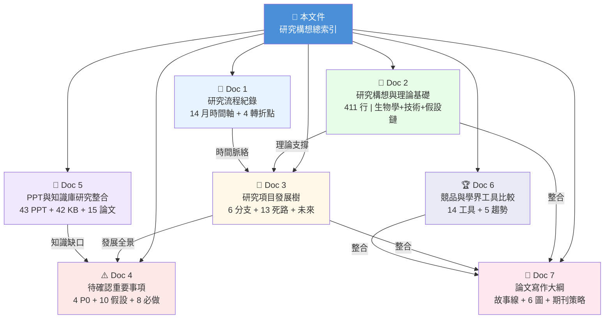

<!--
建立時間: 2026-04-09 23:30
目標: InterSubMod 研究構想文件系統總入口——導覽全部 8 份構想文件，提供不同角色的閱讀路徑
處理範圍: 2025-01 至 2026-04 全部研究方向的構想整理
關聯檔案:
  - docs/concepts/2026/04/ 下全部 7 份內容文件
  - docs/CURRENT_FOCUS.md
  - docs/experiments/INDEX.md
  - docs/reports/research_landscape/00_INDEX.md
-->

# InterSubMod 研究構想總索引

> **版本**: v1.0 (2026-04-09)
> **文件數**: 8 份（本索引 + 7 份內容文件）
> **總量**: ~194KB, 涵蓋 14 個月研究、43 份 PPT、19 篇論文、50+ 實驗

## 一句總結

**InterSubMod 歷經 14 個月系統探索（60+ 特徵 × 7 樣本 × 748K regions），確認了甲基化特徵無法區分 TP/FP（all AUC ≤ 0.58），發現了 self-phasing 循環依賴根因，並將定位從 variant filter 轉向 read-level epigenetic characterization。本構想文件系統將散落的 PPT 思考、知識庫參考、論文基礎與正式實驗結論整合為可持續更新的研究發展樹。**

---

## 文件導覽圖



---

## 文件清單

| # | 文件名 | 行數 | 核心內容 |
|---|--------|------|----------|
| 0 | [本文件](20260409_研究構想總索引_01.md) | — | 導覽入口、閱讀路徑 |
| 1 | [研究流程紀錄](20260409_研究流程紀錄_01.md) | ~400 | 7 研究階段 × 42 PPT 對照、4 關鍵轉折點、9 待正式化洞察 |
| 2 | [研究構想與理論基礎](20260409_研究構想與理論基礎_01.md) | ~411 | 5 生物學基礎、ISM 7 步架構、10 假設鏈、5 研究願景、28 文獻 |
| 3 | [研究項目發展樹](20260409_研究項目發展樹_01.md) | ~425 | 6 大分支 Mermaid 圖、36 分支狀態、13 死路總表、未來預測 |
| 4 | [待確認重要事項](20260409_待確認重要事項_01.md) | ~350 | 4 P0 阻塞、10 隱含假設、5 穩定度 3 結論、Phase 2 前置 |
| 5 | [PPT與知識庫研究整合](20260409_PPT與知識庫研究整合_01.md) | ~450 | 6 里程碑 PPT 深度整合、知識庫交叉引用、論文矩陣、知識缺口 |
| 6 | [競品與學界工具比較](20260409_競品與學界工具比較_01.md) | ~362 | 14 工具比較矩陣、技術路線圖、不可替代性、5 學界趨勢 |
| 7 | [論文寫作大綱](20260409_論文寫作大綱_01.md) | ~400 | Target: Genome Research、3 幕故事線、6 主圖 + 10 補充圖 |

---

## 建議閱讀路徑

### 路徑 A：新人入門（首次接觸 InterSubMod）

| 步驟 | 文件 | 重點閱讀 | 預估時間 |
|------|------|----------|----------|
| 1 | Doc 2 研究構想與理論基礎 | §1 定義 + §2 生物學基礎 + §5 五願景 | 20 min |
| 2 | Doc 3 研究項目發展樹 | §1 總圖 + §4 死路總表 | 15 min |
| 3 | Doc 1 研究流程紀錄 | §3 四個轉折點 | 10 min |
| 4 | Doc 4 待確認重要事項 | §1 P0 阻塞 + §6 Phase 2 前置 | 10 min |

### 路徑 B：接續研究的 AI Session

| 步驟 | 文件 | 重點閱讀 | 預估時間 |
|------|------|----------|----------|
| 1 | Doc 4 待確認重要事項 | §1 P0 阻塞 + §2 隱含假設 | 10 min |
| 2 | Doc 3 研究項目發展樹 | §5 未來分支 | 5 min |
| 3 | → [CURRENT_FOCUS.md](../../CURRENT_FOCUS.md) | 當前進行中 + 阻塞 | 5 min |

### 路徑 C：準備論文投稿

| 步驟 | 文件 | 重點閱讀 | 預估時間 |
|------|------|----------|----------|
| 1 | Doc 7 論文寫作大綱 | 全文 | 15 min |
| 2 | Doc 2 研究構想與理論基礎 | §4 假設鏈 + §7 文獻矩陣 | 10 min |
| 3 | Doc 6 競品與學界工具比較 | §2 比較矩陣 + §4 不可替代性 | 10 min |
| 4 | → [research_landscape/](../../reports/research_landscape/00_INDEX.md) | 結論穩定性 + 證據鏈 | 20 min |

### 路徑 D：報告/簡報準備

| 步驟 | 文件 | 重點閱讀 | 預估時間 |
|------|------|----------|----------|
| 1 | Doc 1 研究流程紀錄 | §2 時間軸總覽 | 10 min |
| 2 | Doc 5 PPT與知識庫研究整合 | §3 里程碑 PPT 整合 | 10 min |
| 3 | Doc 3 研究項目發展樹 | §1 總圖（可直接用於簡報） | 5 min |

---

## 與現有文件系統的關係

```
Layer 0   (導航)     docs/README.md
                          │
Layer 0.5 (構想)     docs/concepts/2026/04/     ← 本文件系統
                      │  提供：為什麼、怎麼演化、大圖景
                      │
Layer 1   (當下)     CURRENT_FOCUS.md
                      │  提供：現在在做什麼、阻塞什麼
                      │
Layer 2   (歷史)     experiments/INDEX.md + research_landscape/
                      │  提供：做了什麼、結論是什麼
                      │
Layer 3   (細節)     experiments/validated/ + reports/validated/
                         提供：具體數據、圖表、統計分析
```

**分工原則**：
- 構想文件（本系統）= **為什麼** + **怎麼來的** + **往哪去**
- CURRENT_FOCUS = **現在做什麼**
- experiments/INDEX = **做了什麼（事實）**
- research_landscape = **結論是什麼（推論）**

**不重複原則**：本系統的所有文件透過相對連結引用 Layer 1-3 的詳細內容，不複製數據或結論。

---

## 關鍵數字速查

| 指標 | 數值 | 來源 |
|------|------|------|
| 研究期間 | 14 個月 (2025-01 ~ 2026-04) | Doc 1 |
| PPT 簡報 | 43 份, 2,242 slides | Doc 5 |
| 實驗紀錄 | 50+ entries | experiments/INDEX |
| 測試特徵 | 60+ features | Doc 3 |
| 研究樣本 | 7 cancer cell lines | Doc 2 |
| 分析 regions | 748,391 | Doc 3 |
| 已關閉死路 | 13 directions | Doc 3 §4 |
| 穩定結論 | 14 (3×⭐5, 6×⭐4, 5×⭐3) | Doc 4 §3 |
| 純甲基化 AUC 上限 | ≤ 0.58 | Doc 2 §4 |
| Self-phasing HP bias | 17.3:1 | Doc 2 §4 |
| Paired F1 改善 | +0.0112 | Doc 2 §5 |
| ASM 比率 | 32-66% | Doc 2 §2.2 |
| 比較工具數 | 14 | Doc 6 |
| 支撐論文 | 28 | Doc 2 §7 |
| P0 阻塞項 | 4 | Doc 4 §1 |

---

## 文件更新規則

| 事件 | 更新動作 |
|------|----------|
| 新研究方向啟動 | 更新 Doc 3（加分支）+ Doc 4（加前置條件） |
| 結論穩定性變更 | 更新 Doc 4 §3 + Doc 2 §4 假設鏈狀態 |
| Phase 2 實驗完成 | 更新 Doc 3（分支狀態）+ Doc 4（移除已完成阻塞） |
| 新論文發表 | 更新 Doc 5 §5 論文矩陣 + Doc 6 學界趨勢 |
| 論文投稿進展 | 更新 Doc 7（milestone 狀態） |
| PPT 簡報新增 | 更新 Doc 1 §2 時間軸 + Doc 5 §2 對照 |
| 知識庫文件更新 | 更新 Doc 5 §4 交叉引用 |

---

## 前置素材（Archive）

本構想文件的建構過程中產生的中間素材：

| 檔案 | 位置 | 用途 |
|------|------|------|
| PPT 文字提取（41 份） | `docs/archive/2026/04/ppt_text_extracts/` | Doc 1, Doc 5 的原始素材 |
| 論文摘要提取 | `docs/archive/2026/04/20260409_論文摘要提取_01.md` | Doc 2, Doc 5, Doc 7 的論文資訊 |
| 現有研究文件摘要 | `docs/archive/2026/04/20260409_現有研究文件摘要_01.md` | 全部文件的研究結論參考 |
