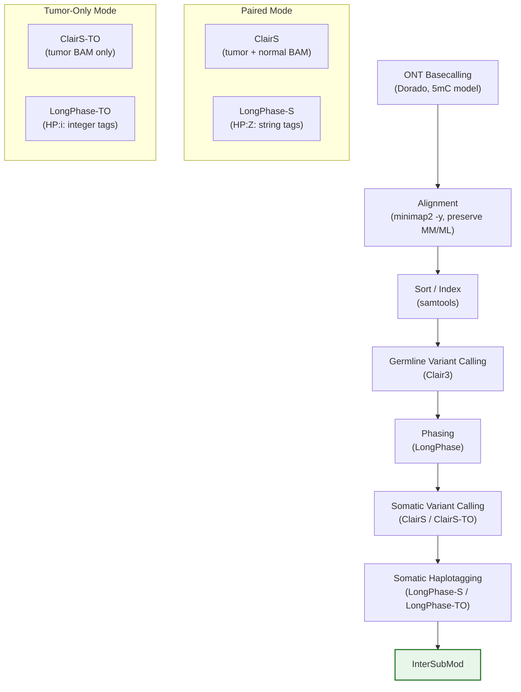

<!--
建立時間: 2026-04-09 23:30
目標: 闡述 InterSubMod 的大圖景——生物學基礎、技術架構、核心假設鏈、研究願景與文獻支撐
處理範圍: InterSubMod 完整理論基礎與研究定位
關聯檔案:
  - docs/architecture/20260327_InterSubMod研究願景定錨_01.md
  - docs/references/20260324_InterSubMod研究方法與相關文獻突破方向全域分析_01.md
  - docs/references/20260409_beyond_auc_biology_literature_review.md
  - docs/reports/research_landscape/05_證據鏈總覽.md
  - docs/reports/research_landscape/06_結論穩定性審查.md
  - /big8_disk/liaoyoyo2001/Knowledge/05_tools/intersubmod.md
  - /big7_disk/liaoyoyo2001/Meeting/論文/
-->

# InterSubMod 研究構想與理論基礎

> **文件性質**：InterSubMod 的「大圖景」文件——從生物學根基到技術架構、從核心假設到研究願景的完整論述。
> 適合作為新研究者入門、論文撰寫框架、或研究定位檢討的基礎參考。

---

## 1. InterSubMod 是什麼

InterSubMod (Inter-Subclonal Methylation Analysis) 是一個基於 ONT 長讀定序的 C++17 生物資訊工具，透過 read-level 甲基化模式分析來表徵腫瘤中的表觀遺傳異質性。它以體細胞 SNV 為錨點，在每個變異位點的 1000bp 窗口內建立 Read x CpG 甲基化矩陣，計算多元距離度量，並整合 haplotype 資訊進行統計檢驗。ISM 的獨特定位在於 **read-level epigenetic characterization** -- 提供 variant-centered 的甲基化證據，而非取代或過濾 somatic caller 的輸出。

**一句話定位**：ISM 是一個「可解釋 epigenetic evidence 整合框架」，不是另一個 somatic variant caller。

---

## 2. 生物學基礎

### 2.1 癌症表觀遺傳學

DNA 甲基化是哺乳動物基因體中最穩定的表觀遺傳修飾之一。在 CpG 二核苷酸的胞嘧啶第五位碳原子上添加甲基基團（5-methylcytosine, 5mC），是調控基因表現、維持基因體完整性與細胞分化的核心機制。正常細胞中，CpG 島（CGI）大多處於低甲基化狀態以維持基因活性，而基因間區域與重複序列則處於高甲基化狀態以抑制轉座子活性。

癌症中的甲基化景觀呈現雙重失調模式（Sharma et al., 2010）：

- **全域低甲基化（Global Hypomethylation）**：腫瘤細胞普遍喪失基因體範圍的甲基化，特別在 PMD（Partially Methylated Domains）區域，導致基因體不穩定性增加、重複序列活化、以及染色體結構異常（Eden et al., 2003 以 Dnmt1 低甲基化小鼠模型直接證實低甲基化促進染色體不穩定性和 LOH 事件頻率增加）。
- **局部高甲基化（Focal Hypermethylation）**：腫瘤抑制基因的啟動子 CpG 島發生異常高甲基化，導致基因沉默。這是 Knudson 二次打擊假說的表觀遺傳學延伸——promoter 甲基化可作為腫瘤抑制基因失活的「第二次打擊」。

表觀遺傳的可逆性使其成為癌症治療的重要標靶。FDA 已批准多種表觀遺傳藥物（如 DNMT 抑制劑 azacitidine、decitabine），顯示對表觀遺傳景觀的精確刻畫具有臨床轉譯價值（Sharma et al., 2010）。ISM 的核心目標之一，正是在 read-level 解析度上描繪這種甲基化異質性。

**文獻支撐**：
- Sharma, Kelly & Jones, Carcinogenesis 2010 (Epigenetics in cancer)
- Kordowitzki & Grzeczka, Aging and Disease 2025 (Cellular ageing, epigenetics and cancer)
- Eden, Gaudet, Waghmare & Jaenisch, Science 2003 (Chromosomal instability and DNA hypomethylation)

### 2.2 Allele-Specific Methylation (ASM)

Allele-Specific Methylation（ASM）指同一基因座的兩個等位基因呈現不同的甲基化水準。ASM 的來源可分為兩大類：

1. **Germline ASM（由 mQTL 驅動）**：Germline SNP 透過 cis-regulatory 機制影響鄰近 CpG 的甲基化狀態。Oliva et al.（2023）在 GTEx 9 組織 987 樣本中鑑定 286,152 個 CpG 位點具有顯著 mQTL，其中 12% 為 CpG-SNP（SNP 直接破壞 CpG 二核苷酸，產生確定性甲基化差異），其餘主要透過 TF binding site 破壞間接影響。Germline ASM 效應強（delta beta 5-50%）、跨組織保守（37% 跨組織共享）、且高度可複製（Huan et al., 2019 驗證 55,000 個可複製 mQTL）。

2. **Cancer-associated ASM**：癌症中 ASM 頻率比正常組織高 5-9 倍（Do et al., 2020），但機制分析顯示：(a) 72-76% 歸因於全域低甲基化導致的 allele-specific loss of methylation；(b) **僅 6-17% 歸因於 somatic mutation 驅動的 de novo ASM**。換言之，癌症中 ASM 增加的主因是全域甲基化重塑，而非個別體細胞突變的局部效應。

**ISM 的驗證與發現**：ISM 透過 5 種獨立方法交叉驗證，確認 32-66% 的 SNV 位點存在 ASM（M1 PERMANOVA: 32.2%, M2 Wilcoxon: 45.3%, M3 Fisher: 55.2%, M4 Point-biserial: 36.1%, M5 Bootstrap: 41.8%；方法間 Jaccard 一致性 0.78-0.83）。

**關鍵發現**：FP（germline variant）的 ASM 強於 TP（somatic variant），7/7 樣本方向一致（M2: FP 46.4% vs TP 35.9%）。這是因為 germline variant 存在於所有細胞中，具有穩定的 mQTL 驅動 ASM，而 somatic passenger mutation 的局部甲基化效應微弱且不一致。**Germline ASM 效應約為 somatic 的 3-6 倍**（綜合 Shoemaker 2010, Do 2020, Gaunt 2016）。

這一生物學事實是 ISM 從 variant filter 轉向 epigenetic characterizer 的根本原因：ASM 廣泛存在（POSITIVE），但 ASM 無法區分 TP/FP（與 NEGATIVE 結論不矛盾）。存在不等於可區分。

**文獻支撐**：
- Do et al., Genome Biology 2020 (ASM increased in cancers)
- Oliva et al., Nature Genetics 2023 (GTEx mQTL mapping)
- Shoemaker et al., Genome Research 2010 (23-37% het SNP sites show ASM)
- Gaunt et al., Genome Biology 2016 (cis-mQTL characterization)

### 2.3 亞克隆結構與腫瘤異質性

腫瘤並非均質的細胞團塊，而是由多個遺傳與表觀遺傳特徵各異的亞克隆（subclone）組成的異質群體。這種 intratumoral heterogeneity（ITH）是腫瘤抗藥性、轉移與復發的主要驅動力。

在遺傳層面，亞克隆透過 somatic mutation 的逐步累積產生分歧。在表觀遺傳層面，Tarazona et al.（2025）在 TRACERx NSCLC 研究中開發 ITMD（intratumoral methylation distance）量化甲基化異質性，發現腫瘤間甲基化異質性為正常組織的 25 倍，且 ITMD 與 SCNA-ITH 顯著相關（r=0.47-0.66），但與 SNV-ITH 的相關性弱。這意味著甲基化異質性主要反映的是 **clonal age 和 division history**，而非特定 somatic mutation 的效應。

Gabbutt & Duran-Ferrer et al.（2025）的 EVOFLUx 框架進一步證實：利用 fluctuating CpGs（fCpGs）可作為「演化條碼」追蹤腫瘤演化動態。在 1,976 例淋巴腫瘤中，演化歷史（生長速率、惡性年齡、epimutation rate）跨疾病類型差異達數個數量級，且是獨立的預後因子。

**ISM 的發現**：HPFineNGroups（HP fine groups 數量 >= 4）是一個跨 7 個樣本一致的 somatic heterogeneity 正面標記。當 HPFineNGroups >= 4 且 NumReads >= 80 時，TP rate 達 89.1%；低 AF (0.1-0.2) 時信號最強（+50 percentage points）。Residualized AUC 為 0.617，確認其非 confound artifact。HPFineNGroups 不能用於 FP filtering（AUC < 0.85），但作為 somatic clone diversity 的定量標記具有明確生物學意義。

**文獻支撐**：
- Tarazona et al. (TRACERx), Nature Genetics 2025 (ITMD and methylation heterogeneity)
- Gabbutt & Duran-Ferrer et al. (EVOFLUx), Nature 2025 (fCpG evolutionary barcode)
- Eden et al., Science 2003 (Hypomethylation promotes chromosomal instability)

### 2.4 長讀定序的優勢

Oxford Nanopore Technologies（ONT）長讀定序為甲基化分析帶來三個革命性優勢：

1. **原生 DNA 直接偵測**：ONT 不需要亞硫酸鹽轉換（bisulfite conversion），直接從原生 DNA 分子偵測 5mC/5hmC 修飾。這避免了轉換不完全和 DNA 降解的問題，且保留了完整的序列資訊。Dorado v5 (5kHz) per-read 5mC call F1 達 0.93，per-site aggregated F1 超過 0.99（Comprehensive Benchmarking, 2024）。

2. **Read-level 多模態資訊**：每一條 long read 同時攜帶遺傳變異（SNV、SV）和表觀遺傳修飾（5mC）資訊，且來自同一條 DNA 分子。這使得在單分子解析度上同時觀察 variant 和 methylation status 成為可能——這是短讀定序無法實現的能力。Li et al.（2025）的 long-read 癌症綜述明確指出，同時偵測 base modification + sequence variant 是長讀序的核心優勢。

3. **Haplotype 解析**：Long read 跨越多個 heterozygous SNP，使 LongPhase 等工具能夠建立長距離 haplotype phase（Sakamoto et al., 2022 達到 N50=834kb）。透過 haplotagging，每條 read 被分配至特定 haplotype，實現 allele-specific 分析。ISM 正是利用此特性，在每個 somatic SNV 周圍建立 haplotype-resolved 甲基化矩陣。

**技術限制**：Per-read 5mC accuracy 約 93% 意味著若一個 region 有 10 個 CpG，每條 read 的 methylation pattern 預期有約 0.7 個 CpG 被錯誤判讀。這個 noise floor 會壓縮真實生物信號與技術雜訊的比值，是 ISM 距離計算精度的根本限制之一。

**文獻支撐**：
- Li et al., Genome Research 2025 (Long-read cancer sequencing review)
- Sakamoto et al., Nature Communications 2022 (Lung cancer phasing with long reads)
- Conesa, Hoischen & Sedlazeck, Genome Research 2025 (Long reads editorial)
- Genner et al., Genome Research 2025 (R9 vs R10 methylation comparison)
- Fu et al., Nature Reviews Genetics 2025 (Long-read methylation computational review)

### 2.5 甲基化與突變的交互作用

5-甲基胞嘧啶（5mC）在化學上本質不穩定，容易自發脫氨基轉變為胸腺嘧啶（thymine），形成 C>T 突變。這一過程使 CpG 位點成為人類基因體中突變率最高的二核苷酸，也是 SBS1（年齡相關時鐘特徵）和多種 cancer-specific 突變特徵的分子基礎。

Bortolini Silveira et al.（2024）的泛癌分析揭示了 BER（Base Excision Repair）途徑在修復 5mC 脫氨基中的核心角色：MBD4 醣苷酶優先結合活性染色質和早期複製 DNA，其缺陷導致特定突變特徵 SBS96 升高。關鍵發現是 SBS1 和 SBS95 的 CpG>TpG 突變率幾乎完全依賴 CpG 甲基化分佈。

**因果方向的釐清**：文獻證據一致指出，主要的因果方向是 **methylation -> mutation**（高甲基化促進 C>T 脫氨基），而非 mutation -> methylation change（Haggerty et al., 2020; Zhou et al., 2018）。Somatic passenger SNV 對局部甲基化無顯著效應（Wen et al., 2017）；driver mutation（如 IDH1, SETD2）可驅動全域甲基化重塑，但這類事件僅佔 somatic mutation 的不到 1%。

**對 ISM 的意義**：ISM 分析的 somatic variants 多數為 passenger（非 driver），其對局部甲基化的因果效應微弱。ISM 觀察到的 methylation pattern 更多反映的是既有的甲基化景觀（germline mQTL + cancer global remodeling），而非 variant 本身引起的變化。

**文獻支撐**：
- Bortolini Silveira et al., Nature Communications 2024 (BER shapes 5mC deamination signatures)
- Haggerty et al., Genetics 2020 (Methylation affects neighboring mutability)
- Wen et al., PLoS Computational Biology 2017 (Driver mutation methylation effects)

---

## 3. 技術架構

### 3.1 上游 Pipeline

ISM 不是獨立運作的工具，而是嵌入在一條完整的長讀定序分析 pipeline 中。從原始定序到 ISM 分析的資料流如下：



**關鍵上游組件**：

| 組件 | 功能 | ISM 依賴 |
|------|------|---------|
| Dorado | Basecalling + 5mC modification calling | MM/ML tags（甲基化機率） |
| minimap2 | Alignment（`-y` 保留 tags） | CIGAR, 座標對齊 |
| Clair3 | Germline variant calling | Germline SNP for phasing |
| LongPhase | Haplotype phasing | Phased VCF, PS block |
| ClairS / ClairS-TO | Somatic variant calling | Somatic SNV VCF（分析標的） |
| LongPhase-S / -TO | Somatic haplotagging + purity | HP tags, LOH.bed, purity |

### 3.2 ISM 核心 7 步

ISM 的核心分析流程可分為 7 個步驟，對應 C++ 核心模組：

```
S0: VCF Load ─── S1: Region Definition ─── S2: BAM Read Extraction ─── S3: Methylation Parsing
       │                    │                         │                          │
  SomaticSnv.hpp     RegionBounds.hpp           BamReader.hpp           MethylationParser.hpp
       │                    │                    ReadParser.hpp                   │
       └────────────┬───────┘                         │                          │
                    │                                 │                          │
              S4: Matrix Building ──────── S5: Distance Calculation ──── S6: Clustering
                    │                              │                          │
             MatrixBuilder.hpp            DistanceMatrix.hpp         HierarchicalClustering.hpp
            MethylationMatrix.hpp                  │                     Clustering.hpp
                    │                              │                          │
                    └──────────────────── S7: Statistical Testing ─────────────┘
                                                │
                                    SignificanceAnalyzer.hpp
                                    LabelTest.hpp / GlobalTest.hpp
                                    LocalTest.hpp / StructureTest.hpp
                                    FisherExact.hpp / Stats.hpp
```

| 步驟 | 說明 | 核心模組 |
|------|------|---------|
| **S0** VCF Load | 載入 somatic SNV VCF，解析座標、REF/ALT、AF、GQ 等欄位 | `SomaticSnv` |
| **S1** Region Definition | 以 SNV 為中心定義分析窗口（預設 +/-500bp = 1000bp） | `RegionBounds`, `RegionOfInterest` |
| **S2** BAM Read Extraction | 從 haplotagged BAM 擷取 region 內所有 reads，解析 HP tag、ALT/REF 支持 | `BamReader`, `ReadParser` |
| **S3** Methylation Parsing | 解碼 MM/ML tags，校正 CIGAR 座標偏移，定位每個 CpG 的甲基化狀態 | `MethylationParser` |
| **S4** Matrix Building | 建構 Read x CpG 甲基化矩陣（機率矩陣 + 二值矩陣） | `MatrixBuilder`, `MethylationMatrix` |
| **S5** Distance Calculation | 在矩陣上計算 read-read 距離（6 種度量） | `DistanceMatrix` |
| **S6** Clustering | UPGMA 階層式聚類，產生 dendrogram 與 cluster labels | `HierarchicalClustering`, `Clustering` |
| **S7** Statistical Testing | 雙向顯著性檢驗：cluster-first 與 label-first，整合為 VerificationClass | `SignificanceAnalyzer`, `LabelTest`, `GlobalTest`, `LocalTest`, `StructureTest` |

### 3.3 距離度量

ISM 支援 6 種距離度量，每種有不同的數學特性與適用場景：

| 度量 | 公式概念 | 適用場景 | 已知限制 |
|------|---------|---------|---------|
| **NHD** | Normalized Hamming Distance：不一致 CpG 比例 | 二值化甲基化模式比較 | 忽略甲基化機率中間值 |
| **L1** | Manhattan distance：各 CpG 機率差絕對值之和 | 一般距離度量 | 受 CpG 數量影響 |
| **L2** | Euclidean distance：各 CpG 機率差平方和開根號 | 連續甲基化機率 | Collider bias 風險（O12 發現） |
| **CORR** | 1 - Pearson correlation | 甲基化模式形狀（非絕對值） | 需足夠 CpG 數量 |
| **BERNOULLI** | Bernoulli probability distance | CpG 稀疏時最穩定 | 計算較慢 |
| **JACCARD** | 1 - Jaccard similarity | 二值化甲基化集合比較 | 對中間值不敏感 |

### 3.4 統計框架

ISM 的統計分析採用「雙向驗證」設計：

**Label-first 方向**（已知標籤 -> 檢驗距離差異）：
- **PERMANOVA**（Permutational Multivariate Analysis of Variance）：在距離矩陣上進行非參數多變量檢驗，999 次 permutation。以已知標籤（ALT/REF, HP1/HP2, HP families）為分群依據，檢驗群間距離是否顯著大於群內距離。
- **Allele/HP Delta**：ALT-REF 或 HP1-HP2 之間的平均距離差。

**Cluster-first 方向**（先聚類 -> 檢驗與標籤的關聯）：
- **Cramer's V**：衡量 cluster membership 與標籤（ALT/REF, HP1/HP2）之間的類別關聯效應量。已知限制：93% 的 region 在 2x2 框架下為零值（R1-R5 確認為設計缺陷）。
- **Fisher-Freeman-Halton 精確檢定**：cluster x label 列聯表的精確顯著性。

**整合分類**：
- **VerificationClass**：Noise / Weak / Moderate / Strong -- 基於 label-first 與 cluster-first 一致性的四級分類。跨模式 concordance V=0.914。
- **Quality Score (QS)**：0-100 綜合評分。Paired mode AUC=0.754；**TO mode AUC=0.497（等同隨機）** -- 已確認 LOH penalty 是 TO 模式失效的根因，TO mode 已移除 LOH penalty 和 verify bonus。

---

## 4. 核心假設鏈與驗證狀態

ISM 的研究歷程可視為一連串假設的系統性驗證。以下表格彙整 10 個核心假設的當前狀態：

| # | 假設 | 驗證狀態 | 證據強度 | 關鍵依據 |
|---|------|---------|---------|---------|
| 1 | Somatic mutations create detectable ASM | POSITIVE | ⭐4 | 5 方法交叉驗證，32-66%，7/7 一致 |
| 2 | ASM differences can distinguish TP from FP variants | **NEGATIVE** | ⭐5 | 60+ 特徵全部 AUC <= 0.58；O1-O13 系統觀察 |
| 3 | HP tags provide reliable allele assignment in TO mode | **NEGATIVE** | ⭐4 | Self-phasing circular dependency confirmed；HP_Ratio 跨模式 r=0.001 |
| 4 | LOH regions have distinct methylation patterns for TP/FP | **NEGATIVE** | ⭐5 | O12: 7/7 samples AUC ~0.50；J11-J16 Non-LOH 同樣無突破 |
| 5 | Multi-feature combinations can overcome single-feature limits | **NEGATIVE** | ⭐4 | Voting AUC=0.577；RF ceiling 0.69-0.77（含 HP） |
| 6 | Pure methylation (HP-free) clustering has discriminative power | **NEGATIVE** | ⭐5 | Option C: HP-free combo AUC=0.564；ClusterPermanovaF=0.512（隨機） |
| 7 | ISM can rescue caller FN | **NEGATIVE** | ⭐4 | O9: 122,790 FN HP-free AUC<0.53；FN 在甲基化空間等同 TP |
| 8 | ISM read-level classification improves paired F1 | POSITIVE (弱) | ⭐3 | +0.0112, McNemar p=1.44e-51；3/7 明確正向 |
| 9 | HPFineNGroups reflects somatic heterogeneity | POSITIVE | ⭐4 | N>=4+NR>=80 TP rate 89.1%；7/7 一致；residualized AUC=0.617 |
| 10 | Normal methylation reference can improve TO discrimination | UNTESTED | -- | Phase 2A 計劃項目 |

> **證據鏈詳細推論**請參閱 `docs/reports/research_landscape/05_證據鏈總覽.md`（8 條完整證據鏈）。
> **結論穩定性評分**請參閱 `docs/reports/research_landscape/06_結論穩定性審查.md`（14 個結論逐一審查）。

### 假設鏈的核心洞見

上述驗證結果揭示一個深層生物學事實：**germline ASM 在特徵空間中主導了 somatic ASM**（效應量 3-6 倍），使得甲基化特徵無法有效區分 TP（somatic）和 FP（germline）。這不是方法缺陷或特徵設計問題，而是生物學本質的限制——germline variant 透過 mQTL 產生穩定且強烈的 ASM，而 somatic passenger mutation 的局部甲基化效應微弱且不一致。

這一結論得到 45+ 篇文獻的交叉支撐（Do et al., 2020; Shoemaker et al., 2010; Oliva et al., 2023 等），且截至 2026-04，**尚無任何發表工具直接利用甲基化模式區分 somatic 與 germline variant**。ROCIT（Baker et al., 2026）和 MethylBERT（Jeong et al., 2025）分類的是 read origin（tumor vs normal cell），不是 variant origin（somatic vs germline）。

---

## 5. 五個研究願景

以下五個目標定義於 `docs/architecture/20260327_InterSubMod研究願景定錨_01.md`，作為所有後續計劃的北極星。

### 目標 1: Per-CpG Read-Level Tagging（多標籤關聯性評分）

| 項目 | 內容 |
|------|------|
| **核心問題** | 某個 CpG 位點的甲基狀態，是否與 ALT/REF、HP1/HP2 等標籤具有統計關聯？ |
| **成功標準** | 每個 CpG 位點輸出「關聯標籤集合」+ 各標籤的「關聯強度分數」 |
| **當前狀態** | S4 矩陣建構已完成；per-CpG Fisher 檢定已實作（M3 方法）；coverage 不足位點的不可信標記待定義 |
| **關鍵阻塞** | Per-CpG 分析需要 per-read accuracy 提升（目前 ~93% F1，7% error rate 是 noise floor） |

### 目標 2: Clone Structure Inference（亞克隆結構推論）

| 項目 | 內容 |
|------|------|
| **核心問題** | (1) 單位點：ALT read 中是否存在 within-ALT 的甲基化異質性（sub-clone within a clone）？(2) 跨位點：多個 SNV 是否同屬一個 clone 事件？ |
| **成功標準** | Subclone 結構圖 + 突變 co-occurrence 分析 |
| **當前狀態** | HPFineNGroups >= 4 是跨樣本一致的 somatic heterogeneity 標記（POSITIVE）；跨區域 correlation 被 shared read count confound 否決（O13 NEGATIVE） |
| **關鍵阻塞** | 跨位點分析需要克服 read overlap confound；單位點需要 coverage 深度保證 |

### 目標 3: Two-Hit Inference（二次打擊與事件順序推論）

| 項目 | 內容 |
|------|------|
| **核心問題** | 某基因/區域是否存在兩次打擊（genetic + epigenetic）？發生順序為何？ |
| **成功標準** | 事件發生順序推論 + 二次打擊候選位點清單（含可信度） |
| **當前狀態** | 前提研究進行中：LOH evidence panel 在 Phase 1 建立；BRCA1/RAD51C 等案例已有外部文獻驗證 |
| **關鍵阻塞** | 依賴目標 1 和目標 2 的基礎分析；PS block 邊界限制 LOH 只在同一 block 內有效 |

### 目標 4: TO Normal Imputation（Tumor-Only Normal 資訊補強）

| 項目 | 內容 |
|------|------|
| **核心問題** | 在無配對 normal 的情況下，如何推估 normal methylation 背景？ |
| **成功標準** | Purity-corrected methylation matrix + germline/somatic ASM 區分能力 |
| **當前狀態** | 概念驗證階段；LongPhase-S purity estimation 可作為先驗；CAMDAC（TRACERx）框架可借鑑 |
| **關鍵阻塞** | Self-phasing pollution 需先解決（EC5 CONFIRMED）；TO HP 特徵不可信（29 個 B 類特徵） |

### 目標 5: F1 Improvement（整合 evidence panel 提升 F1）

| 項目 | 內容 |
|------|------|
| **核心問題** | 整合目標 1-4 的資訊，能否提升 caller 輸出的最終 F1？ |
| **成功標準** | Paired 或 TO 的 precision/recall 有統計顯著的改善（benchmark vs baseline） |
| **當前狀態** | Paired: +0.0112（POSITIVE 弱，3/7 正向）；TO: -0.0206（NEGATIVE，待修正） |
| **關鍵阻塞** | TO ISM 近乎無效（增量僅 +0.003-0.030 over caller-only）；caller_af 單獨 AUC=0.654 超越全部 ISM 特徵 |

### 研究主軸優先順序

```
Phase 1（當前）：方向 E — ML read classification
                within-tumor alt-support read 的分類模型
                目標 1 + 目標 5 的第一步落地

Phase 2：     方向 A + D — Normal methylation reference + CN/Purity-aware
                目標 4 的核心方向

Phase 3：     方向 B — Gene-level / mechanism-level evidence integration
                目標 3 的基礎

Phase 4：     方向 C — CpG 功能分層與智慧選點
                目標 1 的精細化
```

---

## 6. ISM 的獨特定位 vs 學界工具

ISM 的定位是「以 somatic SNV 為錨點，整合甲基化 pattern、haplotype、copy-number 資訊，提供 read-level epigenetic context for variant interpretation」。以下簡表比較 ISM 與學界主要工具的差異（詳細分析見 Doc 6）：

| 比較維度 | ISM | MethPhaser | CAMDAC | EVOFLUx | NanoMethPhase | MethylBERT | ROCIT |
|---------|-----|-----------|--------|---------|--------------|-----------|-------|
| **分析單位** | Per-SNV region | 全基因組 phasing | Per-gene bulk | 全基因組 bulk | 全基因組 ASM | Per-read | Per-read |
| **資料類型** | ONT native | ONT native | RRBS / Array | Array / WGS | ONT native | Any BS-seq | PacBio HiFi |
| **分析層級** | Read-level clustering | Read-level phasing | Bulk deconvolution | Bulk inference | Region-level | Read-level classification | Read-level classification |
| **核心目標** | Variant-centered methylation characterization | Extend phase blocks | Copy-number aware methylation | Subclonal evolution tracking | Allele-specific methylation mapping | Tumor cell fraction estimation | Tumor/normal read classification |
| **HP 整合** | 完整（label-first + cluster-first） | 甲基化驅動 phasing | 不使用 | 不使用 | SNV-based phasing | 不使用 | 不使用 |
| **距離/統計** | 6 metrics + PERMANOVA + Cramer's V | N/A | Beta regression | Beta-mixture model | DMR statistics | Transformer ML | Transformer ML |

**ISM 的獨特性**（尚未被完全覆蓋之處）：

1. **「以 somatic SNV 為錨點 + read-level methylation clustering + 雙向顯著性驗證」的完整框架** -- 這個組合是 ISM 獨有的
2. **同時輸出 cluster-first 與 label-first 的 VerificationClass** -- 多層驗證框架無直接對標
3. **在 variant verification 場景中使用甲基化 pattern** -- 大多數工具用甲基化做 deconvolution 或 ASM detection，而非 variant characterization

---

## 7. 文獻支撐矩陣

### 7.1 Meeting/論文/ 目錄論文

| # | 論文 | 支撐的研究結論 | 檔案位置 |
|---|------|---------------|---------|
| 1 | Sharma, Kelly & Jones (2010). Epigenetics in cancer. *Carcinogenesis*. | 癌症甲基化雙重模式（全域低甲基化 + 局部高甲基化） | `Epigenetics in cancer.pdf` |
| 2 | Gabbutt & Duran-Ferrer et al. (2025). Fluctuating DNA methylation tracks cancer evolution. *Nature*. | fCpG 演化條碼；亞克隆偵測；ISM 的 CpG 選擇策略啟示 | `Fluctuating DNA methylation tracks cancer.pdf` |
| 3 | Kordowitzki & Grzeczka (2025). Cellular ageing, epigenetics and cancer. *Aging and Disease*. | 表觀遺傳漂移與腫瘤發生的一般背景 | `Unveiling...Cellular Ageing, Epigenetics and Cancer.pdf` |
| 4 | Do et al. (2020). ASM is increased in cancers. *Genome Biology*. | ASM 定量基礎；germline ASM >> somatic ASM；6-17% de novo | `等位基因特異性 DNA 甲基化在癌症中增加...pdf` |
| 5 | Li et al. (2012). Genomic hypomethylation and structural mutability. *PLoS Genetics*. | 甲基化與基因體結構穩定性 | `Genomic Hypomethylation...pdf` |
| 6 | Bortolini Silveira et al. (2024). BER pathway shapes 5mC deamination. *Nat Commun*. | 5mC -> C>T 突變機制；methylation-mutation coupling | `鹼基切除修復途徑...pdf` |
| 7 | Sakamoto et al. (2022). Phasing analysis of lung cancer genomes. *Nat Commun*. | Long-read cancer phasing；haplotype-specific mutation/methylation | `使用長讀定序儀對肺癌基因組進行定相分析.pdf` |
| 8 | Foltz et al. (2024). Somatic mutation phasing in multiple myeloma. *bioRxiv*. | Linked-read somatic phasing；haplotype-aware subclone analysis | `使用連結讀取進行多發性骨髓瘤...pdf` |
| 9 | Conesa, Hoischen & Sedlazeck (2025). Long reads decipher genomes. *Genome Research*. | Long-read 技術趨勢與癌症應用 | `長讀解讀基因組和轉錄組.pdf` |
| 10 | Eden et al. (2003). Chromosomal instability and DNA hypomethylation. *Science*. | 低甲基化 -> 染色體不穩定 + LOH 因果 | `Chromosomal Instability and.pdf` |
| 11 | Xia et al. (2019). ctDNA somatic mutation + methylation parallel assessment. *Transl Lung Cancer Res*. | 體細胞突變與甲基化的平行變化 | `對循環腫瘤 DNA 的體細胞突變和甲基化譜...pdf` |
| 12 | Li et al. (2025). Unraveling cancer complexity through long-read sequencing. *Genome Research*. | 最全面 long-read 癌症綜述；COLO829；phasing + methylation 整合 | `599.pdf` / `Genome Res.-2025-Li-599-620.pdf` |
| 13 | Tan et al. (2025). Epigenomic insights in rare diseases. *IJMS*. | ASM/epivariation 概念 | `ijms-26-00135.pdf` |

### 7.2 外部研究與工具論文

| # | 論文 | 支撐的研究結論 | 來源 |
|---|------|---------------|------|
| 14 | O'Neill et al. (2024). Long-read POG. *Cell Genomics*. | Gene-level evidence integration（IMPALA）；CNV + aDMR + ASE | Knowledge/papers/ |
| 15 | Tarazona et al. (TRACERx) (2025). DNA methylation cooperates with genomic alterations. *Nat Genet*. | ITMD；CAMDAC deconvolution；PDR 驗證；M_R/M_N ratio | Knowledge/papers/ |
| 16 | Park et al. (2024). DeepSomatic. *bioRxiv*. | ISM 上游 caller 競爭者；caller-first 結論 | Knowledge/papers/ |
| 17 | Ho et al. (2025). LongPhase-S. *bioRxiv*. | ISM 上游 pipeline 組件；purity estimation | Knowledge/papers/ |
| 18 | Kunigo et al. (2025). t-nanoEM. *Cell Reports Methods*. | Targeted somatic variant-linked methylation；臨床落地參考 | Knowledge/papers/ |
| 19 | Akbari et al. (2021). NanoMethPhase. *Genome Biology*. | 全基因組 ASM；ISM 的 per-SNV 分析互補 | Knowledge/papers/ |
| 20 | Landau et al. (2021). MethSig. *Cancer Discovery*. | 甲基化驅動基因；ISM 功能性判讀啟發 | Knowledge/papers/ |
| 21 | Treangen et al. (2024). MethPhaser. *Nat Commun*. | 甲基化延伸 phasing | Knowledge/papers/ |
| 22 | Jeong et al. (2025). MethylBERT. *Nat Commun*. | Read-level ML methylation classification | Knowledge/papers/ |
| 23 | Lee et al. (2019). PRISM. *Bioinformatics*. | Reference-free subclonal inference | Knowledge/papers/ |
| 24 | Cell Reports (2025). MHB pan-cancer map. | CpG 功能分層 | Knowledge/papers/ |
| 25 | Baker et al. (2026). ROCIT. *bioRxiv*. | Read-level tumor/normal classification；AUC=0.933 | 文獻調查引用 |
| 26 | Oliva et al. (2023). GTEx mQTL. *Nat Genet*. | 286,152 CpG mQTL；ASM 生物學基礎 | 文獻調查引用 |
| 27 | Shoemaker et al. (2010). ASM prevalence. *Genome Research*. | 23-37% het SNP sites have ASM | 文獻調查引用 |
| 28 | Richardson et al. (2024). AUC vs PR-AUC. *Patterns (Cell)*. | ROC-AUC < 0.58 不是 class imbalance artifact | 文獻調查引用 |

### 7.3 文獻覆蓋的研究主題

| 研究主題 | 核心文獻 | ISM 結論 |
|---------|---------|---------|
| Germline ASM >> Somatic ASM | #4 Do 2020, #26 Oliva 2023, #27 Shoemaker 2010 | 解釋為何甲基化無法區分 TP/FP |
| Long-read phasing + cancer | #7 Sakamoto 2022, #8 Foltz 2024, #12 Li 2025, #17 LongPhase-S | ISM pipeline 方法論基礎 |
| Methylation as evolution tracker | #2 EVOFLUx, #15 TRACERx, #11 ctDNA | ISM 作為 characterizer 的定位支撐 |
| Methylation-genomic instability | #10 Eden 2003, #5 Li 2012, #6 BER | LOH-methylation 機制理解 |
| Read-level ML classification | #22 MethylBERT, #25 ROCIT | Phase 1 方向 E 參考 |
| Per-read accuracy limits | Benchmarking 2024, DeepBAM 2024, Genner 2025 | Per-read F1=0.93 是 ISM noise floor |
| AUC < 0.58 的穩健性 | #28 Richardson 2024 | AUC 結論非 artifact |

---

## 附錄：核心術語表

| 術語 | 定義 |
|------|------|
| ASM | Allele-Specific Methylation：兩個等位基因呈現不同甲基化水準 |
| mQTL | Methylation Quantitative Trait Locus：影響甲基化水準的遺傳變異位點 |
| fCpG | Fluctuating CpG：甲基化狀態隨機波動的 CpG 位點（EVOFLUx 定義） |
| ITMD | Intratumoral Methylation Distance：腫瘤內甲基化異質性量化指標 |
| LOH | Loss of Heterozygosity：雜合性缺失 |
| HP tag | Haplotype tag：LongPhase 分配的 haplotype 標籤 |
| PS block | Phase Set block：具有連續 haplotype 解析的基因體區段 |
| VerificationClass | ISM 的 4 級分類：Noise / Weak / Moderate / Strong |
| QS | Quality Score：ISM 的 0-100 綜合品質評分 |
| PERMANOVA | Permutational MANOVA：在距離矩陣上的非參數多變量檢定 |
| CAMDAC | Copy-number Aware Methylation Deconvolution（TRACERx） |
| BER | Base Excision Repair：鹼基切除修復途徑 |
