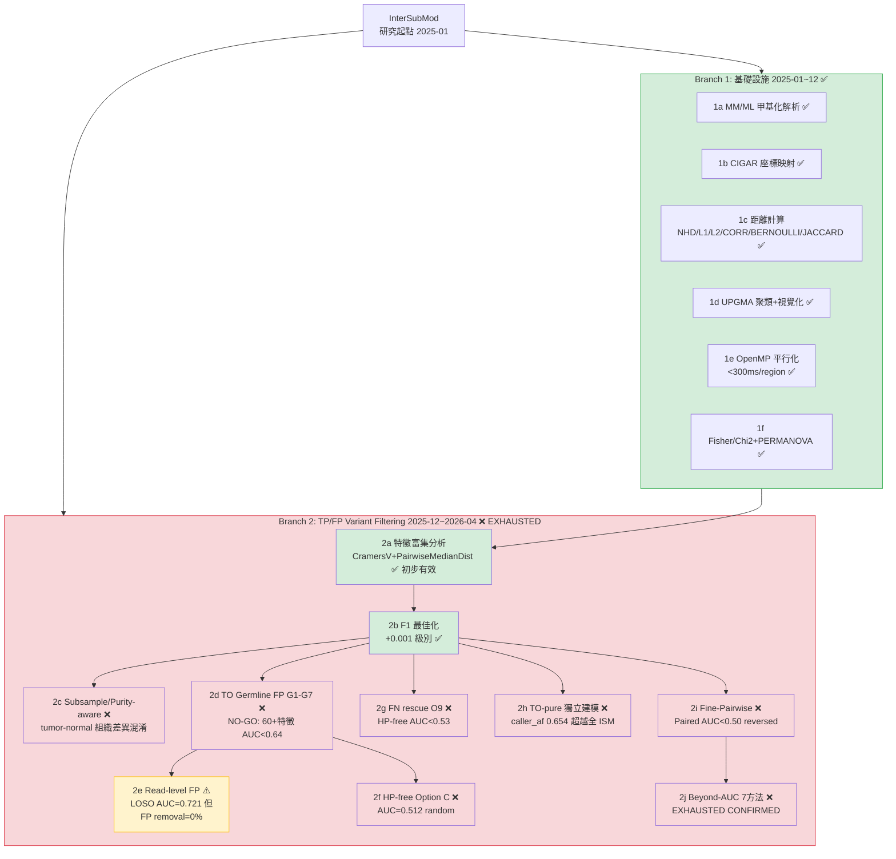
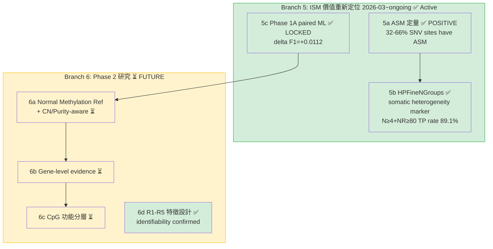
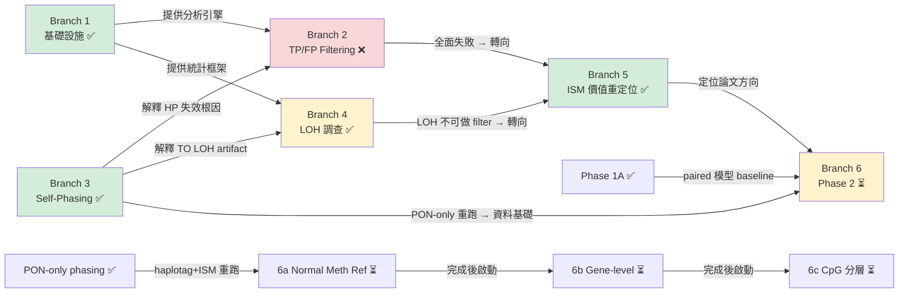
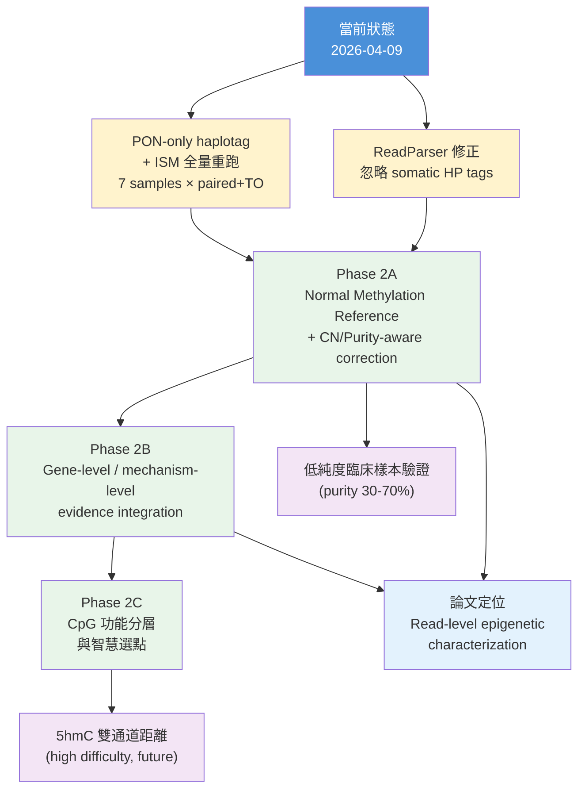

<!--
建立時間: 2026-04-09 23:00
目標: 建立 InterSubMod 研究項目完整發展樹，視覺化所有研究分支、結論與未來方向
處理範圍: 2025-01 至 2026-04 全部研究方向
關聯檔案:
  - docs/experiments/INDEX.md
  - docs/reports/research_landscape/00_INDEX.md
  - docs/CURRENT_FOCUS.md
-->

# InterSubMod 研究項目發展樹

> **版本**: v1.0 (2026-04-09)
> **涵蓋範圍**: 2025-01 ~ 2026-04-09 全部研究方向
> **目的**: 一張圖看清所有研究分支的來龍去脈、成敗與未來走向

---

## 1. 研究發展總圖

> 由於節點數量較多，總圖拆分為三張子圖：基礎設施+核心探索、因果修正+LOH、價值重定位+未來。

### 1A. 基礎設施與 TP/FP 過濾探索



### 1B. Self-Phasing 修正與 LOH 調查

```mermaid
graph TD
    subgraph B3["Branch 3: Self-Phasing 調查 2026-04-02~03 ✅ CONFIRMED"]
        B3a["3a 因果鏈驗證 ✅<br/>62% LOH消失, bias 17.3:1"]
        B3b["3b PON-only phasing ✅<br/>Jaccard=1.0, N50+99.7%"]
        B3c["3c QS mode-aware ✅<br/>TO停用LOH penalty"]
    end

    subgraph B4["Branch 4: LOH 調查 2026-03-27~04-06 ✅ CLOSED as filter"]
        B4a["4a Round 1-4 audit ✅"]
        B4b["4b SEQC2 外部驗證 ✅<br/>Jaccard=0.928"]
        B4c["4c LOH 10/10 filter ❌<br/>LOH is TP-enriched"]
        B4d["4d Non-LOH 特徵 ❌<br/>max AUC&lt;0.58"]
        B4e["4e 多特徵 Voting ❌<br/>AUC=0.577"]
        B4f["4f cnLOH ❌<br/>Simpson's Paradox"]
        B4g["4g Wave 3 全面關閉 ✅"]
    end

    B3a --> B3b
    B3b --> B3c
    B4a --> B4b
    B4b --> B4c
    B4c --> B4d
    B4d --> B4e
    B4e --> B4f
    B4f --> B4g

    style B3 fill:#d4edda,stroke:#28a745
    style B4 fill:#fff3cd,stroke:#ffc107
    style B3a fill:#d4edda
    style B3b fill:#d4edda
    style B3c fill:#d4edda
    style B4a fill:#d4edda
    style B4b fill:#d4edda
    style B4c fill:#f8d7da
    style B4d fill:#f8d7da
    style B4e fill:#f8d7da
    style B4f fill:#f8d7da
    style B4g fill:#d4edda
```



### 1C. ISM 價值重定位與未來方向



### 圖例

| 符號 | 顏色 | 含義 |
|------|------|------|
| ✅ | 綠色 `#d4edda` | 成功完成 / 已確認 |
| ❌ | 紅色 `#f8d7da` | 失敗 / 已關閉 |
| ⏳ | 黃色 `#fff3cd` | 待執行 / 規劃中 |
| ⚠️ | 橙色 `#fff3cd` + `#ffc107` 邊框 | 有條件結論 / 需再評估 |

---

## 2. 分支狀態總表

| 分支 ID | 名稱 | 狀態 | 開始日期 | 結束日期 | 結論 | 對應實驗編號 |
|---------|------|------|----------|----------|------|-------------|
| 1a | MM/ML 甲基化解析 | ✅ | 2025-01 | 2025-11 | ONT BAM MM/ML 標籤解碼正確 | INDEX #01 |
| 1b | CIGAR 座標映射 | ✅ | 2025-01 | 2025-11 | 反向股 delta encoding 正確 | INDEX #02 |
| 1c | 距離計算六種 | ✅ | 2025-03 | 2025-12 | NHD/L1/L2/CORR/BERNOULLI/JACCARD 全部實作 | INDEX #03, #07 |
| 1d | UPGMA 聚類+視覺化 | ✅ | 2025-06 | 2025-12 | 距離熱圖+分群熱圖 | INDEX #03 |
| 1e | OpenMP 平行化 | ✅ | 2025-08 | 2025-12 | 單 Region <300ms | INDEX #04 |
| 1f | Fisher/Chi2+PERMANOVA | ✅ | 2025-10 | 2025-12 | RxC + Monte Carlo + 999 permutations | INDEX #05, #06 |
| 2a | 特徵富集分析 | ✅ | 2025-12 | 2026-01 | CramersV+PairwiseMedianDist 初步有效但不足 | INDEX #08, #09 |
| 2b | F1 最佳化 | ✅ | 2026-01 | 2026-02 | +0.001 級別，甲基是 support 非 primary | INDEX #10 |
| 2c | Subsample/Purity-aware | ❌ | 2026-02 | 2026-03 | tumor-normal 組織差異混淆 | INDEX #11, #12 |
| 2d | TO Germline FP (G1-G7) | ❌ | 2026-04-01 | 2026-04-01 | 48 圖表, 60+ 特徵, 全 AUC<0.64, FP removal=0% | INDEX G1-G7 |
| 2e | Read-level FP 識別 | ⚠️ | 2026-04-02 | 2026-04-02 | LOSO AUC=0.721 但安全約束 FP removal=0% | INDEX Read-Level |
| 2f | HP-free Option C | ❌ | 2026-04-07 | 2026-04-07 | ClusterPermanovaF AUC=0.512 (random) | INDEX Option C |
| 2g | FN rescue (O9) | ❌ | 2026-04-08 | 2026-04-08 | HP-free AUC<0.53, FN≡TP in methylation space | INDEX O9 |
| 2h | TO-pure 獨立建模 | ❌ | 2026-04-08 | 2026-04-08 | caller_af(0.654) 超越全 ISM | INDEX TO-pure |
| 2i | Fine-Pairwise Distance | ❌ | 2026-04-08 | 2026-04-08 | Paired AUC<0.50 (germline ASM > somatic ASM) | INDEX Fine-Pairwise |
| 2j | Beyond-AUC 7 方法驗證 | ❌ | 2026-04-09 | 2026-04-09 | EXHAUSTED: pure methylation 全 ≤0.58 | INDEX Beyond-AUC |
| 3a | Self-phasing 因果鏈 | ✅ | 2026-04-02 | 2026-04-03 | 62% LOH 消失, somatic bias 17.3:1, 五步因果鏈 | INDEX Self-Phasing |
| 3b | PON-only phasing | ✅ | 2026-04-03 | 2026-04-03 | Jaccard=1.0, N50 +99.7%, phased rate +23.6pp | INDEX PON-Only |
| 3c | QS mode-aware | ✅ | 2026-04-03 | 2026-04-03 | TO 停用 LOH penalty + verify bonus | INDEX QS |
| 4a | LOH Round 1-4 audit | ✅ | 2026-03-27 | 2026-03-28 | LOH evidence panel 完成 | INDEX #46-47 |
| 4b | SEQC2 外部驗證 | ✅ | 2026-04-04 | 2026-04-04 | Jaccard=0.928, FDA 金標準吻合 | INDEX LOH W1 |
| 4c | LOH 10/10 filter | ❌ | 2026-04-04 | 2026-04-05 | LOH is TP-enriched, FP rate 0.239 < Non-LOH 0.338 | INDEX LOH W2 |
| 4d | Non-LOH 特徵探索 | ❌ | 2026-04-05 | 2026-04-06 | max AUC<0.58 | INDEX LOH W3 |
| 4e | 多特徵 Voting | ❌ | 2026-04-06 | 2026-04-06 | AUC=0.577<0.58 門檻 | INDEX LOH W3 |
| 4f | cnLOH | ❌ | 2026-04-06 | 2026-04-06 | Simpson's Paradox (per-sample mean=0.50) | INDEX LOH W3 |
| 4g | Wave 3 全面關閉 | ✅ | 2026-04-06 | 2026-04-06 | 確定性結論: LOH 不可作為 variant filter | INDEX LOH W3 |
| 5a | ASM 定量 | ✅ | 2026-04-01 | 2026-04-01 | 32-66% SNV sites 有 ASM, POSITIVE | INDEX ASM |
| 5b | HPFineNGroups | ✅ | 2026-04-07 | 2026-04-07 | N≥4+NR≥80, TP rate 89.1%, 7/7 一致 | INDEX R1-R5 |
| 5c | Phase 1A paired ML | ✅ | 2026-03-20 | 2026-03-28 | delta F1=+0.0112, CI=[+0.0044,+0.0188] LOCKED | INDEX #44-45 |
| 6a | Normal Methylation Ref | ⏳ | — | — | 待 PON-only 重跑完成 | — |
| 6b | Gene-level evidence | ⏳ | — | — | 待 Phase 2A 完成 | — |
| 6c | CpG 功能分層 | ⏳ | — | — | 待規劃 | — |
| 6d | R1-R5 特徵設計 | ✅ | 2026-04-07 | 2026-04-07 | identifiability problem confirmed, not design issue | INDEX R1-R5 |

---

## 3. 依賴關係圖



### 依賴關係說明

| 下游 | 上游依賴 | 依賴類型 | 說明 |
|------|----------|----------|------|
| Branch 2 全部 | Branch 1 | 技術基礎 | 距離計算+統計框架 |
| Branch 2 結論 | Branch 3 | 因果解釋 | Self-phasing 解釋了為何 HP 特徵在 TO 模式失效 |
| Branch 4 結論 | Branch 3 | 因果解釋 | Self-phasing 解釋了 TO LOH 62% 為 artifact |
| Branch 5 | Branch 2 + 4 | 方向轉換 | 全面失敗後轉向 characterization |
| Branch 6a | Branch 3b | 阻塞性 | 需要 PON-only haplotag+ISM 全量重跑 |
| Branch 6b | Branch 6a | 順序依賴 | 需要 normal methylation baseline |
| Branch 6c | Branch 6b | 順序依賴 | 需要 gene-level 框架 |

---

## 4. 死路與原因總表

> **本表是專案最重要的知識資產之一** — 記錄了所有已被系統性否決的方向及其不應重試的理由。

| # | 方向 | 為何失敗 | 核心數據 | 不應重試的原因 |
|---|------|----------|----------|----------------|
| D1 | TO Germline FP 識別 (G1-G7) | Germline leak 在甲基化空間與 TP 不可區分 | 48 圖表, 60+ 特徵, 全 AUC<0.64, TP loss ≤2% 下 FP removal=0% | 根因是 germline variant 本身帶有 ASM，甲基化模式上天生與 somatic TP 無法區分 |
| D2 | Subsample/Purity-aware | tumor-normal 組織差異混淆甲基化信號 | subsample 無法可靠模擬純度效應 | 組織特異甲基化差異>>腫瘤純度效應，混淆不可消除 |
| D3 | HP-free 純甲基化 (Option C) | 甲基化 clustering 無法提供 TP/FP 區分力 | ClusterPermanovaF AUC=0.512 (random), HP-free combo AUC=0.564, HP 特徵貢獻 +0.043 | Identifiability problem: 不依賴 HP tag 的純甲基化特徵本質上無法解 variant identity |
| D4 | FN rescue (O9) | FN 在甲基化空間中 ≡ TP | HP-free AUC<0.53, 122,790 FN, TO QS AUC=0.338 反轉 | 甲基化空間中 FN 與 TP 分布完全重疊，理論上也不應可分（都是真 somatic 附近） |
| D5 | TO-pure 獨立建模 | caller_af 單獨就超越全部 ISM 特徵 | caller_af AUC=0.654, All-ISM=0.60-0.64, ISM 增量僅 +0.003~0.030 | ISM 在 TO 模式提供的增量幾乎為零，投入產出比極低 |
| D6 | Fine-Pairwise Distance | Germline ASM >> somatic passenger SNV ASM | Paired 全 AUC<0.50 (反轉), TO max=0.579<0.58 | 生物學根因: germline SNV 的 ASM 效應量是 somatic passenger SNV 的 3-6 倍 (45+ 篇論文支持) |
| D7 | LOH 作為 variant filter | LOH 區域反而是 TP-enriched | 10/10 filter 全失敗, FP rate 0.239 < Non-LOH 0.338 | LOH 富集真 somatic variant (尤其低 AF)，用 LOH 做 FP filter 會反向傷害 |
| D8 | cnLOH 特徵 | Simpson's Paradox | 表面 AUC=0.587, per-sample mean=0.50 | 跨樣本混合效應產生虛假信號，消除樣本效應後回歸隨機 |
| D9 | 多特徵 Voting 組合 | 所有弱特徵組合仍弱 | Voting AUC=0.577<0.58 門檻 | 若每個特徵都是 noise，ensemble 無法創造 signal |
| D10 | O11 Within-group heterogeneity | n_reads confound | epipolymorphism AUC 0.845→0.530 (residualized after n_reads) | 表面信號 100% 來自 read count 差異而非甲基化差異本身 |
| D11 | O12 LOH 甲基化場景區分 | AF confound + L2 collider bias | AlleleDelta=AF confound, CramersV L2 AUC=0.80 是 collider, 校正後全<0.58 | 三場景本質不可區分; L2 residualization 在近常數特徵上產生虛假信號 |
| D12 | O13 跨區域甲基化 Correlation | Shared read count confound | FP>TP correlation 完全由共享 reads 解釋; 分層+residualize+matching 後消失 | 甲基化跨區域一致性假說被否決; shared reads 是物理結構而非生物信號 |
| D13 | Beyond-AUC 7 方法綜合驗證 | Pure methylation 本質無區分力 | 7 方法 × 25 特徵 × 748K regions; pooled OLS = data snooping; BSS 全負 | 這是最終確認: 甲基化特徵空間對 TP/FP 過濾已正式耗盡 |

### 死路原因分類

| 根因類別 | 涉及死路 | 核心機制 |
|----------|----------|----------|
| **Identifiability Problem** | D3, D4, D6, D13 | 甲基化空間中 TP 與 FP 的分布本質重疊 |
| **Confound / Bias** | D2, D8, D10, D11, D12 | 表面信號由非甲基化因素（n_reads, AF, sample effect, shared reads）驅動 |
| **方向性錯誤** | D7, D9 | LOH 富集 TP 而非 FP; 弱特徵組合不產生強信號 |
| **投入產出過低** | D1, D5 | 有效但增量可忽略（<0.03 AUC） |

---

## 5. 未來分支預測

### Phase 2 路線圖



### 未來方向詳細說明

| 方向 | 期望收益 | 難度 | 前置依賴 | 預估時程 |
|------|----------|------|----------|----------|
| **Phase 2A: Normal Methylation Reference** | 建立 normal 甲基化基準線，消除組織特異背景 | 中 | PON-only 重跑 + ReadParser 修正 | 2-3 週 |
| **Phase 2B: Gene-level Evidence** | 整合基因層級功能註釋，增加生物學解釋力 | 中-高 | Phase 2A 完成 | 2-4 週 |
| **Phase 2C: CpG 功能分層** | 區分 promoter/enhancer/gene body CpG，提升信噪比 | 中 | Phase 2B 框架 | 2-3 週 |
| **5hmC 雙通道** | 5mC+5hmC 雙通道距離矩陣，可能更有亞克隆特異性 | 高 | ONT 5kHz 同時提供 C+h | 未定（需技術成熟） |
| **低純度臨床樣本** | 驗證 ISM 在 purity 30-70% 下的有效性 | 高 | Read-level 模型穩定 | 3-6 週 |

### 五個研究目標與 Branch 對應

| 研究目標 | 核心問題 | 主要對應 Branch | 當前狀態 |
|----------|----------|----------------|----------|
| **目標 1**: ISM 作為 read-level epigenetic 工具的定位 | ISM 能看到什麼？ | Branch 5 | ✅ Active |
| **目標 2**: Paired 模式甲基化輔助 F1 提升 | 穩定提升多少？ | Branch 5c (Phase 1A) | ✅ LOCKED (+0.0112) |
| **目標 3**: TO 模式甲基化增益 | TO 可行嗎？ | Branch 2, 6 | ❌ Phase 1 exhausted; Phase 2 待試 |
| **目標 4**: Normal Methylation Reference | 如何建立基準線？ | Branch 6a | ⏳ 待 PON-only 重跑 |
| **目標 5**: Somatic Heterogeneity 標記 | ISM 的生物學發現？ | Branch 5b | ✅ HPFineNGroups confirmed |

---

## 6. 詳細資料指引

### 文件對應表

| 要找什麼 | 去哪裡 | 說明 |
|----------|--------|------|
| 所有實驗編號與摘要 | [experiments/INDEX.md](../../experiments/INDEX.md) | 精簡版索引, #01-#47 + O1-O15 + G1-G7 + 獨立研究 |
| 實驗完整詳情 | [experiments/INDEX_DETAIL_ARCHIVE.md](../../experiments/INDEX_DETAIL_ARCHIVE.md) | 每個實驗的完整設計、結果與結論 |
| TO FP 問題全貌 | [research_landscape/01_TO_FP問題全貌.md](../../reports/research_landscape/01_TO_FP問題全貌.md) | PON 過濾 99.48%, 殘餘 FP 來源分析 |
| Self-phasing 根因 | [research_landscape/02_Self_Phasing根因.md](../../reports/research_landscape/02_Self_Phasing根因.md) | 完整五步因果鏈, HP bias 17.3:1 |
| ISM 能做/不能做什麼 | [research_landscape/03_ISM分析價值界定.md](../../reports/research_landscape/03_ISM分析價值界定.md) | HP 依賴 vs 非依賴特徵分類, 55% AUC<0.64 |
| 哪些結論需修正後重測 | [research_landscape/04_暫停判定與重評估.md](../../reports/research_landscape/04_暫停判定與重評估.md) | 修正後預期改善幅度 |
| 8 條完整證據鏈 | [research_landscape/05_證據鏈總覽.md](../../reports/research_landscape/05_證據鏈總覽.md) | 前提→設計→結果→依賴 |
| 14 結論穩定度評分 | [research_landscape/06_結論穩定性審查.md](../../reports/research_landscape/06_結論穩定性審查.md) | 穩定度 3-5, 隱含假設, 驗證需求 |
| 當前進行中的項目 | [CURRENT_FOCUS.md](../../CURRENT_FOCUS.md) | 即時狀態, 阻塞點, 待辦 |
| LOH 雙定義交叉分析 | [reports/validated/2026/04/20260406_LOH雙定義交叉分析報告/](../../reports/validated/2026/04/20260406_LOH雙定義交叉分析報告/00_INDEX.md) | 120 圖表 + 40 站點肉眼檢視 |
| Beyond-AUC 最終驗證 | [experiments/finalized/2026/04/20260409_beyond_auc...](../../experiments/finalized/2026/04/20260409_beyond_auc_comprehensive_validation_01.md) | 7 方法 × 多層分層 × 748K regions |

### Branch 到 Evidence Chain 映射

| Branch | 對應證據鏈 (research_landscape/05) | 說明 |
|--------|-----------------------------------|------|
| Branch 2 (TP/FP filtering) | EC1 (O1-O10), EC2 (O11-O13), EC3 (G1-G7) | 三條證據鏈覆蓋全部過濾嘗試 |
| Branch 2e (Read-level) | EC4 | 唯一突破 0.70 AUC 但受安全約束 |
| Branch 3 (Self-phasing) | EC5, EC6 | 因果鏈 + 修正方案 |
| Branch 5c (Phase 1A) | EC7 | Paired ML 正面結論 |
| Branch 5a (ASM) | EC8 | 生物學價值獨立支撐 |

---

## 附錄: 時間線總覽

```
2025-01 ─── Branch 1 開始：基礎設施建設
  │
2025-11 ─── #01-#07 完成：解析+距離+統計 全部就位
  │
2025-12 ─── Branch 2 開始：TP/FP 過濾探索
  │         #08-#09 特徵富集初步有效
  │
2026-01 ─── #10 F1 最佳化 (+0.001 級別)
  │
2026-02 ─── #11-#12 Subsample/Purity ❌ 失敗
  │
2026-03 ─── #13-#39 純樣本基線+GQ+TO+FP來源 大規模系統實驗
  │         #40 方法學審查 → E→A+D→B→C 優先序確認
  │         #41-#45 Phase 1A ML → delta F1=+0.0112 LOCKED ✅
  │         #46-#47 LOH Round 1-4 audit
  │
2026-03-31 ─ O1-O10 系統觀察 (82圖表) → TO 全 AUC<0.58
  │         O11/O12/O13 甲基化假說 → 全 NEGATIVE ❌
  │         ASM 定量 → POSITIVE ✅
  │
2026-04-01 ─ G1-G7 TO Germline FP → NO-GO ❌
  │
2026-04-02 ─ Read-level → CONDITIONAL NO-GO ⚠️
  │         Self-phasing 因果鏈 → CONFIRMED ✅
  │
2026-04-03 ─ PON-only phasing → SUCCESS ✅
  │         QS mode-aware → 已實作 ✅
  │
2026-04-04~06 ─ LOH 雙定義 Wave 1+2+3 → 確定性關閉 ✅
  │
2026-04-07 ─ R1-R5 特徵設計研究 → identifiability confirmed
  │         HPFineNGroups → somatic heterogeneity marker ✅
  │         Option C HP-free → NEGATIVE ❌
  │
2026-04-08 ─ O9 FN → NO-GO ❌
  │         TO-pure 獨立建模 → NEGATIVE ❌
  │         Fine-Pairwise → NEGATIVE ❌
  │
2026-04-09 ─ Beyond-AUC 7方法 → EXHAUSTED CONFIRMED ❌
  │         ╔═══════════════════════════════════╗
  │         ║ 甲基化特徵空間正式關閉              ║
  │         ║ ISM 轉向 characterization          ║
  │         ╚═══════════════════════════════════╝
  │
  ▼ (未來)
  ⏳ PON-only 全量重跑 → Phase 2A → 2B → 2C
```
