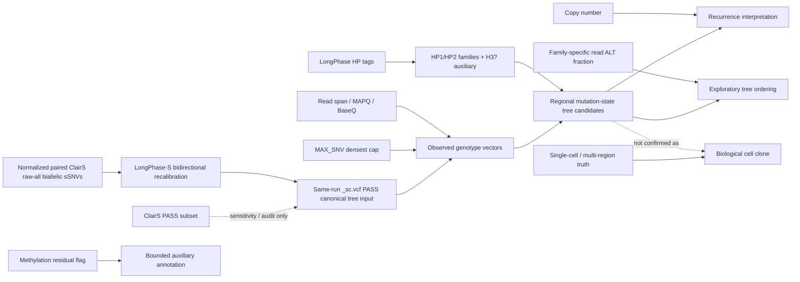

<!--
建立時間: 2026-07-10 22:44
目標: 鎖定 layered reconstruction 證據角色與不可越界的因果 claim
處理範圍: caller、read support、HP、CN、read AF、methylation、regional tree、cell clone
關聯檔案:
  - InterSubMod/research/20260710_layered_reconstruction_v2/00_INDEX.md
  - InterSubMod/research/20260710_layered_reconstruction_v2/pre-decision-audit.md
證據等級: L2 ⭐⭐⭐⭐
-->

# Layered Reconstruction Claim Boundaries

## Interpretation

- normalized paired ClairS raw-all records 是 LongPhase-S recalibration universe；同一 run 的 `_sc.vcf PASS` 是 canonical tree input；ClairS PASS只是 sensitivity/audit subset。三者都不是無誤的 biological truth。
- regional tree可由重疊 partial reads約束；`determined`是模型內唯一最小相容解，不保證存在一條full-span read，也不等於observed cell clone。
- HP tag 分 family，但不能單獨確認 clone；HP3 保留為 `H3?` auxiliary。
- CN 目前只在樹建完後以region midpoint解釋 recurrence，不可回頭改寫 read co-occurrence；missing/mis-fit或未核定的coverage語意必須標 unavailable。
- family-specific read ALT fraction 未經 purity／CN 校正，名稱不得寫成 true CCF。
- methylation 不 rank tree，也不確認 lineage。
- bulk regional mutation-state tree 要升級為 biological clone，仍需要 single-cell 或 multi-region orthogonal evidence。
