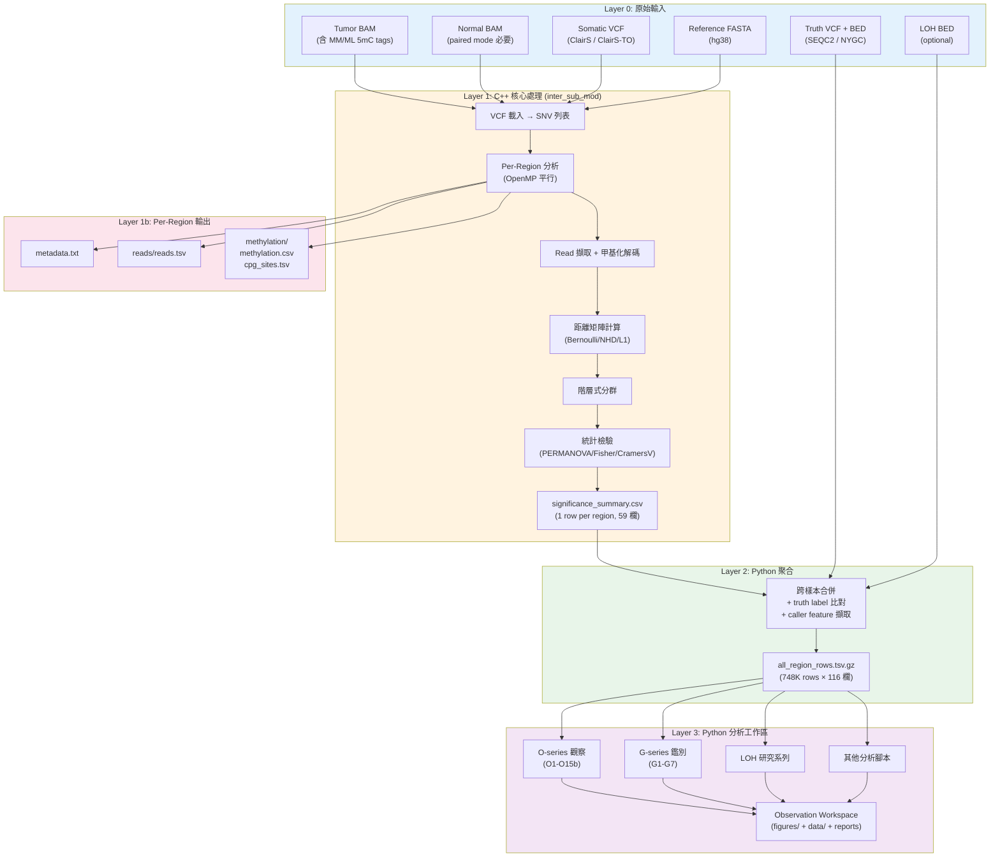

<!--
建立時間: 2026-04-11 20:00
目標: InterSubMod 完整資料流程圖 — 從原始輸入到最終分析輸出的端對端資料流
處理範圍: 輸入規格、C++ 處理、中間輸出、Python 聚合、觀察工作區
關聯檔案:
  - scripts/run_vcf_all_snv.sh
  - scripts/analysis/observation_common.py
  - docs/data_specs/20260411_significance_summary欄位字典_01.md
  - docs/data_specs/20260411_master_dataset欄位字典_01.md
-->

# InterSubMod 完整資料流程圖

> **版本**: v1.0 | **日期**: 2026-04-11

---

## 1. 端對端流程總覽



---

## 2. 輸入規格

### 2.1 必要輸入

| 檔案 | 格式 | Flag | 路徑模式 | 說明 |
|------|------|------|---------|------|
| **Tumor BAM** | BAM + BAI | `--tumor-bam` | `/big8_disk/data/{SAMPLE}/ONT/{tumor}.bam` | 含 5mCG MM/ML tags、HP:i: tags (haplotagged) |
| **Reference** | FASTA + FAI | `--reference` | `data/ref/hg38.fa` → `/big8_disk/ref/GRCh38_no_alt_analysis_set.fasta` | hg38 人類參考基因組 |
| **Somatic VCF** | VCF.gz + TBI | `--vcf` | 依 caller：ClairS paired / ClairS-TO 產出 | 定義分析位點 |

### 2.2 選用輸入

| 檔案 | 格式 | Flag | 使用時機 |
|------|------|------|---------|
| Normal BAM | BAM + BAI | `--normal-bam` | Paired mode（有配對正常樣本） |
| LOH BED | BED | (aggregation 階段) | LOH 區域標記，由 SEQC2 CNV benchmark 或 HP imbalance 產生 |
| Truth VCF | VCF.gz | (benchmark 階段) | TP/FP 標記，`bcftools isec` 比對 |
| Truth BED | BED | (benchmark 階段) | High-confidence regions 限制評估範圍 |

### 2.3 Paired vs Tumor-Only 差異

| 面向 | Paired Mode | Tumor-Only Mode |
|------|------------|-----------------|
| Normal BAM | **必要** | 不使用 |
| Phasing 來源 | LongPhase-S (germline VCF) | LongPhase-TO (somatic VCF，**有 self-phasing 問題**) |
| HP tag 可信度 | 高 | 低 (somatic self-phasing → 94.6% HP1 bias) |
| FP rate | ~1% | ~31% (含 germline leak) |
| Caller | ClairS (paired) | ClairS-TO |

---

## 3. C++ 核心處理

### 3.1 執行命令

**生產模式** (`scripts/run_vcf_all_snv.sh`):

```bash
./build/bin/inter_sub_mod \
    --tumor-bam ${TUMOR_BAM} \
    --normal-bam ${NORMAL_BAM} \      # paired only
    --reference ${REF_FASTA} \
    --vcf ${VCF_PATH} \
    --output-dir ${OUTPUT_DIR} \
    --threads ${THREADS} \
    --window-size 5000 \               # ±5000bp (default production)
    --log-level info \
    --output-filtered-reads \
    --distance-metric BERNOULLI
```

### 3.2 關鍵 Flags

| Flag | 預設值 | 說明 |
|------|--------|------|
| `--window-size` | 5000 | SNV 位點前後 ±N bp 的分析視窗 |
| `--distance-metric` | BERNOULLI | 可多次指定：BERNOULLI, NHD, L1, PEARSON, JACCARD |
| `--threads` | 1 | OpenMP 平行執行緒數 |
| `--output-filtered-reads` | false | 是否輸出被過濾 read 的原因 |
| `--full-read` | false | 使用完整 read span（忽略 window-size） |
| `--min-mapq` | 20 | 最低 mapping quality |
| `--min-read-length` | 500 | 最短 read 長度 |

### 3.3 執行模式

| 模式 | Window | 用途 |
|------|--------|------|
| `baseline` | 5000 (default) | 標準執行 + debug log |
| `all-with-w5000` | 5000 | **生產模式**，全 SNV 分析 |
| `all-with-w1000` | 1000 | 窄視窗比較 |
| `chr19-verification` | 1000 | 單點快速驗證 |
| `full-read-mode` | full span | 完整 read 甲基化 |

---

## 4. 輸出層次

### Layer 1: Per-Region 目錄結構

```
{output_dir}/
├── {vcf_name}/                              # e.g., "filtered_snv_tp"
│   └── chr{N}/
│       └── chr{N}_{pos}/
│           └── chr{N}_{start}_{end}/
│               ├── metadata.txt             # 區域資訊、read 數、CpG 數、計時
│               ├── reads/
│               │   └── reads.tsv            # read_id, name, chr, start, end, mapq, hp, alt_support, strand
│               ├── methylation/
│               │   ├── cpg_sites.tsv        # cpg_id, chr, position
│               │   ├── methylation.csv      # Read × CpG 矩陣 (機率 0-1, -1=no coverage)
│               │   ├── methylation_forward.csv
│               │   └── methylation_reverse.csv
│               └── clustering/              # (部分 run 產出)
│                   ├── significance.json
│                   └── tree.nwk
├── significance_summary.csv                 # ★ 核心彙總：1 row per region, 59 欄
├── significance_statistics.txt              # 統計摘要文字
└── debug/
    └── filtered_reads.tsv                   # (--output-filtered-reads 時產出)
```

### Layer 2: significance_summary.csv → all_region_rows.tsv.gz

**聚合過程** (在 `observation_common.py:load_master_dataset()` 中):

1. 從每個 canonical run 讀取 `significance_summary.csv` (TP 和 FP 各一份)
2. 加入 truth label (TP/FP) 來自 benchmark VCF 比對結果
3. 加入 sample / mode / platform metadata
4. 加入 source tracking 欄位 (base_dir, summary_file, tagged_bam, phased_vcf, loh_bed)
5. 計算衍生指標 (effective_hp_reads, hp_ratio_core, hp_assign_rate, hp0/hp3_ratio, core_loh_like)
6. 加入 caller feature (caller_af, caller_dp, caller_gq, caller_ad_*)
7. 加入 TO phasing 欄位 (to_phase_filter, to_phase_ps/gt)
8. 產出 `all_region_rows.tsv.gz`: **748,391 rows × 116 columns**

> **欄位字典**: 見 `20260411_significance_summary欄位字典_01.md` (59 欄) 和 `20260411_master_dataset欄位字典_01.md` (116 欄)

### Layer 3: Observation Workspace

**產出位置**: `big7_disk_output/synthesis/observation_workspaces/{YYYYMMDD}_{topic}/`

**標準結構**:
```
{workspace}/
├── README.md                    # 概述、狀態、生成腳本
├── round_context.json           # 執行元數據 (日期、參數、來源)
├── observation_report.md        # 分析發現（10-20 KB）
├── conclusions_for_git.md       # Git-friendly 結論摘要
├── decision_notes.md            # 判讀註記
├── figures/                     # PNG 視覺化 (8-12 張)
└── data/                        # TSV/CSV 分析表 (2-14 個)
```

---

## 5. 腳本→工作區對應 (主要系列)

| 腳本 | 工作區 | 輸入 | 核心產出 |
|------|--------|------|---------|
| `build_observation_O01_*.py` | `20260401_O01_master_distribution` | Master dataset | TP/FP 分布 + 組成 + 樣本比較 |
| `build_observation_O02_*.py` | `20260401_O02_quality_score_decompose` | Master dataset | QS 拆解 + LOH penalty 影響 |
| `build_observation_O03_*.py` | `20260401_O03_loh_features_post_fix` | Master dataset | LOH 特徵 HP fix 後重評估 |
| `build_observation_O04_*.py` | `20260401_O04_caller_features` | Master dataset | Caller GQ/AF/DP 區分力 |
| `build_observation_O05_*.py` | `20260401_O05_methylation_features` | Master dataset | 甲基化特徵 AUC 評估 |
| `build_observation_O11_*.py` | `20260331_O11_methylation_heterogeneity` | Master dataset | Within-group heterogeneity |
| `build_observation_O12_*.py` | `20260331_O12_loh_methylation_scenarios` | Master dataset | LOH 三場景甲基化區分 |
| `build_observation_O13*.py` | `20260331_O13_*` / `20260401_O13v2_*` | Master dataset | 跨區域甲基化 correlation |
| `build_germline_fp_G1*.py` ~ `G7*.py` | `20260401_germline_fp_*` | Master dataset | TO FP germline 鑑別 7 模組 |
| `build_loh_*.py` | `20260327_loh_round*` 系列 | Master dataset | LOH Evidence Panel 4 輪 |

---

## 6. 關鍵路徑速查

| 資源 | 路徑 |
|------|------|
| C++ 執行檔 | `build/bin/inter_sub_mod` |
| 主執行腳本 | `scripts/run_vcf_all_snv.sh` |
| 批次腳本 | `scripts/run_batch_vcf_analysis.sh` |
| 分析腳本根目錄 | `scripts/analysis/` |
| 共用函式庫 | `scripts/analysis/observation_common.py` |
| Master Dataset | `big7_disk_output/synthesis/observation_workspaces/20260327_loh_round1_cross_sample_audit/all_region_rows.tsv.gz` |
| 工作區根目錄 | `big7_disk_output/synthesis/observation_workspaces/` |
| Canonical runs | `big7_disk_output/canonical/{SAMPLE}/{MODE}/{RUN_ID}/` |
| Run 登記表 | `big7_disk_output/synthesis/master_run_manifest.tsv` |
| 觀察索引 | `big7_disk_output/synthesis/observation_workspaces/OBSERVATION_INDEX.md` |
