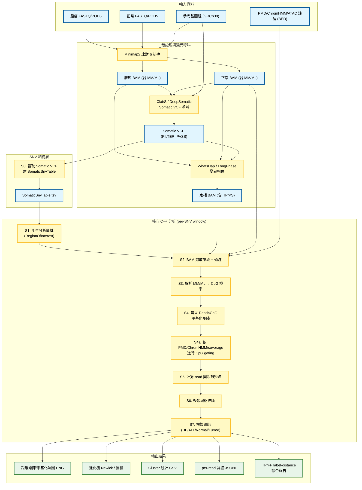
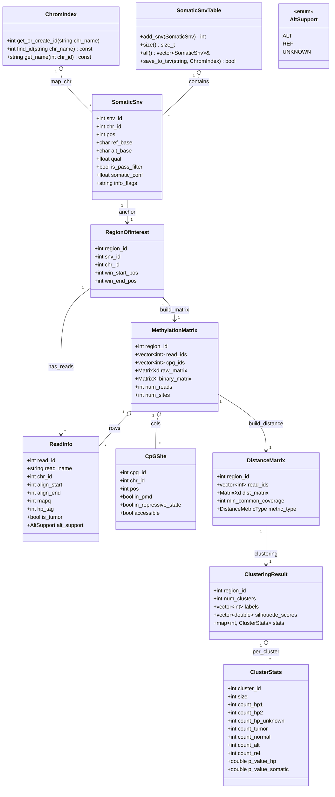

# 單分子甲基化變異與體細胞讀序分群分析系統

（HCC1395 ONT Tumor/Normal，Somatic VCF 驗證架構）

---

## 1. 研究目標與核心概念

本系統針對 **ONT 長讀定序 (HCC1395 Tumor / Normal)**，藉由分析 **Read-level Methylation Pattern** 與 **Somatic Variant** 的關聯性，達成變異驗證與次克隆分析。

* 體細胞 SNV (`Somatic VCF`，由 DeepSomatic / ClairS，`FILTER=PASS`)
* 單分子 DNA 甲基化 (`MM/ML` tag)
* 單倍型標記 (`HP/PS` tag)

藉由 **每一條讀序 (read)** 的甲基化模式與變異攜帶狀態，完成：

1. **Somatic 變異真實性評估**

   * 比較 true positive (TP) / false positive (FP) somatic 位點，
   * 檢查其附近 read 甲基化分群與 label（HP/REF/ALT/Normal/Tumor）的關聯強弱。

2. **單倍型與等位特異性甲基化 (ASM)**

   * 比較 HP=1 vs HP=2 的 read 在局部 CpG pattern 上是否呈現穩定差異。

3. **腫瘤內次克隆結構 (Subclone)**

   * 利用 per-SNV window 的 read 甲基化距離矩陣 → 聚類 → 演化樹，
   * 觀察是否存在穩定分群對應特定 somatic 亞克隆。

4. **結合區域註解 (PMD / ChromHMM / 可及性)**

   * 避免在高度 noisy 的 PMD / heterochromatin 區域過度詮釋 pattern，
   * 支援 gating/降權策略，提升 biologically relevant signal 的比例。

### 1.1 系統假設與限制

* 僅處理 **ONT 長讀**，且 BAM 需包含 `MM/ML`（甲基化）與相位 `HP/PS` 標籤。
* 目前聚焦 **biallelic SNV**（單一 ALT 單核苷酸）。INDEL 與 multi-allelic 位點在 S0 就會被排除。
* 每個 somatic SNV 形成一個分析窗口（預設 ±1000bp），所有後續矩陣/距離/聚類都是 per-SNV window 的獨立計算。
* Cluster 關聯統計仰賴 read 是否攜帶 ALT 以及 HP 標籤，未覆蓋 anchor SNV 的讀段不應被誤判為 REF。
* 預設啟用 PMD/ChromHMM gating，以降低背景噪訊；關閉時需記得調整距離與聚類的覆蓋閾值。

### 1.2 全域參數（建議預設）

* `window_size_bp = 1000`：per-SNV 視窗半徑，RegionOfInterest = POS ± window_size_bp。
* `min_mapq = 20`、`min_read_length = 1000`：BAM 過濾基準。
* `min_base_quality = 20`：判定 SNV 變異位點的 Base Quality 閾值，低於此值視為 UNKNOWN。
* `binary_methyl_high = 0.8`, `binary_methyl_low = 0.2`：ML → 二值化門檻；介於兩者之間當 missing。
* `min_site_coverage = 10`：CpG 若覆蓋 read 數低於此值，從矩陣移除。
* `C_min = 5`：距離計算時兩讀段共同 CpG 數不足時，該 pair 視為無效。
* `nan_distance_strategy = MAX_DIST`：當共同 CpG 不足時，距離設為 1.0 (最大值)，避免錯誤群聚。
* `distance_metric = NHD`：預設使用 binary 矩陣的 normalized Hamming；可切換 L1/L2/CORR/JACCARD。
* `pmd_gating = on`：是否在 PMD/heterochromatin 中排除 CpG。
* `threads = auto`：外層 per-Region 可用 OpenMP 併行，預設使用可用核心數。

---

## 2. 全域流程：從原始資料到結果

### 2.1 高層流程圖



---

## 3. 模組與步驟規格

詳細演算法邏輯請參考 **[Implementation Details](../dev/implementation_details.md)**，開發進度請見 **[Development Plan](../dev/development_plan.md)**。

### 3.0 Somatic VCF → SNV 基礎表 (S0)

#### 目的

將 somatic VCF 轉為簡潔、穩定的內部 SNV 表（`SomaticSnvTable`），後續所有分析只依賴這張表，不再直接 parse VCF。

#### 主要資料結構（精簡描述）

* `ChromIndex`：`chr_name ↔ chr_id` 對應表，節省記憶體，後面所有結構都用 `chr_id`。

* `SomaticSnv`：

  * `SnvId snv_id`          // 內部 SNV ID（0..N-1）
  * `int chr_id`            // 染色體 ID
  * `int32_t pos`           // 1-based 座標
  * `char ref_base, alt_base` // 僅支援單一 ALT 的 SNV
  * `float qual`
  * `bool is_pass_filter`
  * `float somatic_conf`    // 綜合 somatic 可信度 (可由 QUAL / INFO 計算)
  * `std::string info_flags`

* `SomaticSnvTable`：

  * `std::vector<SomaticSnv> snvs`
  * 方法：`add_snv`, `size`, `all`, `save_to_tsv(path, chrom_index)`。

* `SnvFilterConfig`：

  * `min_qual`
  * `require_pass_filter`
  * `require_somatic_flag`
  * `somatic_info_tag`
  * `keep_multiallelic`（預設 false，multi-allelic/INDEL 直接排除，維持 biallelic SNV 假設）

#### 關鍵函式概念

* `load_somatic_snv_from_vcf(vcf_path, chrom_index, snv_table, filter)`
  → 讀取 VCF，套用 `SnvFilterConfig`，填好 `SomaticSnvTable`，並可選輸出一個 `SomaticSnvTable.tsv` 作為標準輸入。

> 後續所有 Region/Matrix/Distance 都以 `snv_id` + `chr_id` + `pos` 這組資訊為 anchor。

---

### 3.1 分析區域產生 RegionOfInterest (S1)

#### 概念

每個 somatic SNV 定義一個分析窗口（預設 ±1000bp，可調），作為「per-SNV 甲基化聚類單位」。

#### 結構

* `RegionOfInterest`：

  * `int region_id`         // 區域 ID
  * `SnvId snv_id`          // anchor SNV
  * `int chr_id`
  * `int32_t win_start_pos` // 視窗起始
  * `int32_t win_end_pos`   // 視窗結束

#### 流程

對 `SomaticSnvTable` 中每個 SNV：

1. 檢查是否在指定染色體／指定區域內（可選 filter）。
2. 視窗大小：`[pos - window_size, pos + window_size]`。
3. 建立 `RegionOfInterest`，賦予 region_id，放入 `RegionTable`。

---

### 3.2 BAM 擷取與讀段過濾 (S2)

#### 輸入

* `PhasedBAM`（tumor，含 HP/PS, MM/ML）
* `NormalBAM`（optional，含 MM/ML）
* `RegionOfInterest` 列表
* `PMD/ChromHMM/ATAC` 註解（之後 gating 用）

#### 主要結構

* `ReadInfo`（簡化版）：

  * `int read_id`
  * `std::string read_name`
  * `int chr_id`
  * `int32_t align_start`
  * `int32_t align_end`
  * `int mapq`
  * `int hp_tag`             // 0/1/2 (Unknown/H1/H2)
  * `bool is_tumor`          // true: tumor BAM, false: normal BAM
  * `AltSupport alt_support` // ALT / REF / UNKNOWN（未覆蓋 anchor 或 base 品質不足則 UNKNOWN）

* `AltSupport`：`enum class AltSupport { ALT, REF, UNKNOWN };`

#### 過濾條件

* `mapq >= 20`（可調）
* `min_read_length >= 1000bp`（可調）
* BAM 記錄必須含有 `MM`、`ML` tag
* 排除 secondary / supplementary / duplicated read，避免重複記數
* 可選：限制在 HCC1395 某些染色體或特定基因區域

#### 實作要點

* 以 `sam_itr_multi` 或類似機制一次查詢多個 Region，提高 I/O 效率。
* 讀取 tumor / normal 時，加 `is_tumor` flag，後面關聯統計會用到。
* **相位檢查**：若 BAM 包含 `PS` (Phase Set) tag，需確認同一視窗內的 reads 是否屬於相容的 Phase Set (或同一 block)。目前假設 ±1000bp 內通常在同一 block，若跨 block 則 HP label 可能不一致，需標記 warning 或 filter。
* `alt_support` 計算規則：
  * read 必須覆蓋 anchor SNV 座標。
  * 該位置的 Base Quality 必須 ≥ `min_base_quality`。
  * 若 base == ALT → `AltSupport::ALT`。
  * 若 base == REF → `AltSupport::REF`。
  * 若未覆蓋、BaseQ 不足或為其他 base → `AltSupport::UNKNOWN`。
  * 這能避免把「品質差或缺失」誤當作 REF，保持統計檢定力。

---

### 3.3 MM/ML 解析與 CpG index (S3)

#### 核心設計

* `CpGSite`：

  * `int cpg_id`
  * `int chr_id`
  * `int32_t pos`

* `CpGAnnotation`（可選）：

  * `bool in_pmd`
  * `bool in_repressive_state`（ChromHMM）
  * `bool accessible`（ATAC）

* `ReadMethylRecord`：

  * `int read_id`
  * `int cpg_id`
  * `float prob`        // ML / 255.0
  * optional: `bool methylated_binary` // ML ≥ threshold

#### 解析步驟

1. 從 BAM 取得 `MM` / `ML` aux tag。
2. 解析 `MM` 字串（如 `"C+m?,5,0,3;"`），轉換為 read offset。
3. 經由 CIGAR+參考序列 → 轉為基因組座標 `chr_id, pos`。
4. 判斷是否為 CpG（需參考 genome sequence）。
5. 從 `ML` array 取出對應 index → `prob = ML[i]/255.0`。
6. 依你指定閾值做二值化（例如 ≥0.8 甲基化，≤0.2 未甲基，其餘當 missing）。

* `MM` tag 為「參考序列座標」，即使 read 在負鏈也需用 reference strand 判斷是否為 CpG；建議快取 chr 序列避免重複 I/O。

> 這一層只建「read→CpG 的稀疏列表」，還沒進入 per-region 矩陣。

---

### 3.4 建立 per-Region 的 Read×CpG 甲基化矩陣 (S4)

#### 目標

* 將 S3 取得的稀疏 `ReadMethylRecord`，針對每個 `RegionOfInterest`，組成一個矩陣 `N_read × N_cpg`。

#### 資料結構

* `MethylationMatrix`：

  * `int region_id`
  * `std::vector<int> read_ids`         // row index
  * `std::vector<int> cpg_ids`          // column index
  * `MatrixXd raw_matrix`               // double，0.0–1.0 或 NaN
  * `MatrixXi binary_matrix`            // 1/0/-1 (未知)
  * `int num_reads`
  * `int num_sites`

#### 建構流程

1. 找出此 Region window 內的所有 CpGSite（用 `chr_id + [win_start, win_end]` 篩選）。
2. 以這些 CpGSite 作 column，為所有覆蓋該 window 的 read 建 row。
3. 如讀段在該 CpG 無資料 → 填 NaN（raw） / -1（二值）。
4. 若某 CpG 在之後 gating 被移除，須同步調整 `cpg_ids` 以維持列欄對齊；若某 read 在此 window 完全沒有 CpG 訊號，可選擇不建立該 row 以節省矩陣大小。
5. 直接把 tumor/normal read 混放在同一矩陣，但 `ReadInfo` 中有 `is_tumor` flag，後續 cluster 統計可以看每群 tumor/normal 比例。

---

### 3.5 CpG gating：PMD / ChromHMM / coverage (S4a)

#### 子目的

避免 PMD 或高度 noise 區域讓距離計算被「隨機波動」主導。

#### 規則層次

1. **全域 CpG 註解 gating（依 annotation 檔）：**

   對每個 CpGSite 計算 gating flag，例如：

   * `skip_in_pmd = true`：若在 PMD 區，中立策略是**排除**這些 CpG。
   * 或：在 PMD 區給較低權重（目前先實作「排除」，將來可擴充 weighted distance）。

2. **per-region coverage gating：**

   * 針對每個 CpG：
     若被覆蓋的 read 數 < `min_site_coverage`（例如 10），則整個位置從 matrix 移除。
   * 這可以避免極少讀段支持的位點影響距離。

3. **pairwise min-common-coverage (C_min)**

   * 這是 distance 計算中的條件（S5），如果兩條 read 在 gating 後共同 CpG 數 < C_min，就不計這對距離（或設成 NaN / 1.0）。

---

### 3.6 距離計算 (S5) — pluggable metrics

#### 子目標

對每個 Region 建立 read×read 距離矩陣，支援多種 metric，預設使用 normalized Hamming distance (NHD)。

#### 距離選項（與使用矩陣）

* `NHD`：預設，對 `binary_matrix`（0/1/-1）做 normalized Hamming；`-1` 視為 missing。
* `L1` / `L2`：對 `raw_matrix`（0.0–1.0）在共同 CpG 上算平均絕對差 / 均方差。
* `CORR`：1 - Pearson 相關係數，只用有實測值的 CpG。
* `JACCARD`：對二值矩陣甲基化=1 的集合做 Jaccard 距離。
* 內部 enum：`enum class DistanceMetricType { NHD, L1, L2, CORR, JACCARD };`

#### NHD 定義

\[
D(r_i, r_j) = \frac{\sum_{k \in S_\text{common}} |M_{ik} - M_{jk}|}{|S_\text{common}|}
\]

* `M` 使用 `binary_matrix`（0/1），缺失為 -1。
* `S_common` = gating 後兩條 read 都有有效值的 CpG index。
* **缺失處理**：若 `|S_common| < C_min`：
  * 預設策略 (MAX_DIST)：`D(i,j) = 1.0`。
  * 理由：缺乏共同資訊的 reads 不應被視為相似，設為最大距離可使其在聚類時分開，避免雜訊聚合。
  * 替代策略 (SKIP)：標記為 NaN，需聚類演算法支援（多數標準演算法不支援）。

#### 實作考量

* 矩陣儲存建議採用 **Row-Major** 配置，因為計算距離時是比較兩個 Rows (reads)，這樣能利用 CPU Cache 且方便向量化 (SIMD)。
* 使用 `Eigen::VectorXd` 或 bitset（對 binary_matrix）提高速度：

  * `XOR + popcount` 可快速計算 Hamming。
* 外層 `for region` 用 OpenMP 分散多核心。
* 內層 `for i<j` 可再併行、但要注意 cache / false sharing。

#### 距離矩陣結構

* `DistanceMatrix`：

  * `int region_id`
  * `std::vector<int> read_ids`
  * `MatrixXd dist_matrix`     // N×N 對稱矩陣
  * `int min_common_coverage`
  * `DistanceMetricType metric_type`

---

### 3.7 聚類與演化樹 (S6)

#### 說明

看「這個 SNV window 中的 read 是否自然分成幾個甲基化 pattern 群」，並用樹呈現其關係。

#### 聚類方式

* 預設：階層式聚類（UPGMA 或 Ward）對 `DistanceMatrix` 做 clustering。
* 輸出：

  * `labels[i]`：第 i 條 read 的 cluster ID（1..K）。
  * 樹：可輸出為 Newick（以 cluster / representative read 命名）。

#### 簇數決定

* 支援幾種模式：

  * 固定高度 cut（例如距離 < T）。
  * 固定簇數 k（參數指定）。
  * 計算不同 cut 下的平均 silhouette score，選擇最優 cut（後續可做）。

#### 演化樹

* 由階層式聚類樹直接輸出 Newick：

  * 葉節點：read 名稱 / cluster 名稱。
  * internal node：分支長度採用合併距離的一半（簡單模型）。

#### 聚類結果結構

* `ClusteringResult`：

  * `int region_id`
  * `int num_clusters`
  * `std::vector<int> labels`             // 每 read 對應 cluster
  * `std::vector<double> silhouette_scores`（可選）
  * `std::map<int, ClusterStats> cluster_stats`
  * `PhyloNode* phylo_root`（若需儲存樹）

* `ClusterStats`：

  * `int cluster_id`
  * `int size`
  * `int count_hp1, count_hp2, count_hp_unknown`
  * `int count_tumor, count_normal`
  * `int count_alt, count_ref`
  * `double p_value_hp`
  * `double p_value_somatic`
  * `count_alt/count_ref` 不包含 `AltSupport::UNKNOWN`，避免缺資料被視為 REF
  * 之後可加 `double entropy_methylation;` 等指標。

---

### 3.8 標籤關聯檢定 (S7)

#### 重點

檢查「聚類是否真的對應到 HP/ALT/Subclone 結構」，而不是 noise 或 PMD 模式。

#### 對每個 Region / Cluster

1. 建立 2×2 或 2×K contingency table，例如：

   * Cluster vs HP1/HP2
   * Cluster vs ALT/REF
   * Cluster vs Tumor/Normal
   * ALT/REF 檢定時先濾除 `AltSupport::UNKNOWN`；HP=0 可放入單獨一欄或排除，避免缺值誤導結果。

2. 使用 Fisher exact test / χ² test 計算 p-value。

3. 在同一 Region 上對多 Cluster 做檢定時，使用 FDR (BH) 做多重校正。

4. 結果寫入 `ClusterStats.p_value_hp / p_value_somatic`。

#### 另外可計算

* Adjusted Rand Index (ARI) / NMI：
  把 cluster label 與 HP/ALT label 當兩個分類，計算一致性。

---

### 3.9 報表與可視化輸出

#### 輸出格式

1. **per-Region Cluster summary (CSV)**
   欄位示意：

   ```csv
   region_id,chr,pos,cluster_id,size,hp1,hp2,hpNA,tumor,normal,alt,ref,p_hp,p_somatic
   ```

2. **per-read JSONL**

   每行一條 read：

   ```json
   {
     "region_id": 123,
     "read_name": "read_xyz",
     "chr": "chr1",
     "start": 10000,
     "hp": 1,
     "is_tumor": true,
     "alt_support": "ALT",
     "cluster_id": 2,
     "methylation": {"10010": 0.9, "10025": 0.1}
   }
   ```

3. **距離矩陣與熱圖**

   * 輸出每個 Region 的距離矩陣 (CSV / binary)。
   * 用外部 script (Python) 畫熱圖：rows=reads, cols=reads, cluster order + 標上 HP/ALT 色條。

4. **進化樹 Newick**

   * 每個 Region 一棵樹 `<region_id>.newick`，可以用 FigTree / ETE3 畫。

5. **整體 QC 報告**

   * 對 SEQC2 TP/FP 位點，統計：

     * 「有顯著 cluster-label 關聯」的比例（TP vs FP 比較）。
     * label-distance correlation 分布（之前我們討論過）。
   * 當作方法有效性的 summary。

---

## 4. 資料結構與 Class Diagram（整理版）



---

## 5. 驗證與測試

完整策略請見 **[Verification Strategy](../dev/verification_strategy.md)**。

1. **單元測試**

   * SNV 載入：小 VCF → `SomaticSnvTable.tsv` 是否正確（chr, pos, ref, alt, filter）。
   * CpG 解析：手工設計讀段+MM/ML → 是否正確定位 CpG，ML 轉機率是否正確。
   * 距離函式：人工定義幾組 pattern，計算理論距離 vs 實作結果。

2. **整合測試（per-Region pipeline）**

   * 用小區域（幾十條 read、十幾個 CpG）跑完整 S1–S7，
     檢查 matrix 大小、distance 矩陣對稱、cluster 數量合理。

3. **方法驗證：TP/FP label-distance correlation**

   * 使用 SEQC2 真實標記的 TP/FP somatic 位點：

     * 對每個 SNV window 算出「聚類結果與 HP/ALT 的關聯顯著性」。
     * 比較 TP vs FP 被判定為「顯著」的比例。
   * 目標現象（你之前提過的）：

     * TP 顯著比例 > FP 顯著比例
     * FP 不顯著比例 > TP 不顯著比例
   * 若此趨勢穩定存在，可當作本方法的實證支持。

4. **CI**

   * 每次改動後自動跑：

     * 單元測試＋小資料集整合測試。
     * 簡易性能測試（例如 1000 reads / region 的距離矩陣時間）。
