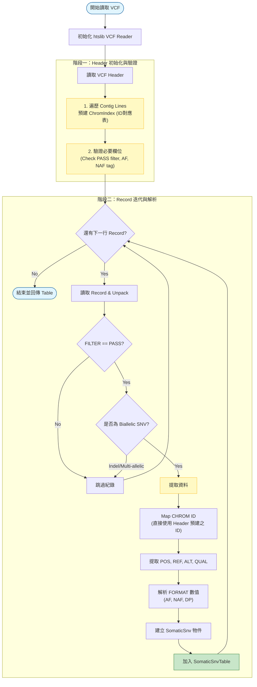

# SNV VCF 讀取與資料結構填充流程說明

本文件說明如何實作從 `SNV.vcf` (特別針對 ClairS 產生的 `filtered_snv_tp.vcf.gz`) 檔案讀取變異資訊，並將其轉換為系統內部使用的 `SomaticSnvTable` 與 `SomaticSnv` 結構之詳細流程與開發注意事項。

## 1. 開發目標

建立一個穩健的 VCF 讀取器，負責：

1. 使用 `htslib` 高效讀取 VCF/BCF 檔案。
2. 自動從 VCF Header 建立染色體名稱對應表 (`ChromIndex`)。
3. 針對 **ClairS** 輸出格式，正確解析 Tumor/Normal 資訊 (主要在 FORMAT 欄位)。
4. 將有效變異填入 `SomaticSnv` 結構並儲存於 `SomaticSnvTable`。

## 2. VCF 檔案格式分析 (ClairS)

依據實際檔案 (`filtered_snv_tp.vcf.gz`) 分析，關鍵資訊如下：

### Header 資訊

* **Contigs**: `##contig=<ID=chr1,length=...>` 可直接用於建立 Chrom ID 列表。
* **Source**: `##source=ClairS`，單一樣本欄位 (SAMPLE) 包含 Tumor 與 Normal 統計。
* **Filter**: `##FILTER=<ID=PASS,...>`，僅保留 `PASS` 的位點。

### 資料欄位映射

讀取流程需將 VCF 欄位映射至 `include/core/SomaticSnv.hpp` 定義之結構：

| VCF 來源 | SomaticSnv 成員 | 處理邏輯 |
| :--- | :--- | :--- |
| **Header** `##contig` | `ChromIndex` | 遍歷 Header 建立全域 ID 對應表 |
| `CHROM` | `chr_id` | 使用 `bcf_hdr_name2id` 或查表取得 ID |
| `POS` | `pos` | `rec->pos + 1` (0-based 轉 1-based) |
| `REF` | `ref_base` | `rec->d.allele[0][0]` |
| `ALT` | `alt_base` | `rec->d.allele[1][0]` (需確認僅單一 ALT) |
| `QUAL` | `qual` | `rec->qual` (變異品質) |
| `FILTER` | `is_pass_filter` | 檢查是否含有 "PASS" ID |
| `FORMAT/AF` | `somatic_conf` | 取出 Tumor Allele Frequency (VAF) 作為參考指標 (或保留 QUAL) |
| `FORMAT` ... | `info_flags` | 可選：將 `AF`, `NAF` (Normal AF), `DP` 等關鍵資訊組合成字串備查 |

> **注意**: ClairS 的 Normal 資訊 (如 `NAF`, `NDP`) 位於 FORMAT 欄位中，而非獨立的 Sample column。

## 3. 處理流程圖 (Mermaid)



## 4. 開發實作細節

### 4.1 階段一：Header 初始化與 ChromIndex
在讀取任何資料行(Record)之前，必須先完整解析 Header 以建立全域設定與 ID 對應表：

```cpp
#include <htslib/vcf.h>

// 1. 開啟檔案與讀取 Header
htsFile *fp = vcf_open(path.c_str(), "r");
if (!fp) { /* 錯誤處理 */ }
bcf_hdr_t *hdr = vcf_hdr_read(fp);
if (!hdr) { /* 錯誤處理 */ }

// 2. 預先建立 ChromIndex (關鍵步驟)
// 這確保後續讀取 Record 時，rec->rid 可以直接對應到正確的 Chrom ID，無需重複字串比對
int nseq = 0;
const char **seqnames = bcf_hdr_seqnames(hdr, &nseq);
for (int i = 0; i < nseq; i++) {
    chrom_index.get_or_create_id(seqnames[i]);
}
free(seqnames);

// 3. (可選) 驗證 Header 是否包含必要欄位
if (bcf_hdr_id2int(hdr, BCF_DT_ID, "PASS") < 0) {
    // 警告：Header 中無 PASS filter 定義
}
```

### 4.2 階段二：Record 讀取與欄位解析
完成初始化後，進入主迴圈高效讀取資料：

```cpp
// 準備 Buffer
bcf1_t *rec = bcf_init();

while (vcf_read(fp, hdr, rec) >= 0) {
    // A. Unpack: 解包必要欄位 (含 FILTER, INFO, FORMAT)
    // BCF_UN_STR: 解包字串 (如 CHROM, FILTER)
    // BCF_UN_FMT: 解包 FORMAT 數值 (AF, NAF)
    bcf_unpack(rec, BCF_UN_ALL); 
    
    // B. 快速過濾 (PASS & SNV)
    if (bcf_has_filter(hdr, rec, "PASS") != 1) continue;
    if (!bcf_is_snp(rec) || rec->n_allele != 2) continue;
    
    // C. 讀取 FORMAT 數值 (使用 htslib 專用函式)
    // 注意：bcf_get_format_float 會動態配置記憶體，需自行管理或使用 wrapper
    float *af_ptr = NULL;
    int n_af = 0;
    int n_ret = bcf_get_format_float(hdr, rec, "AF", &af_ptr, &n_af);
    float tumor_vaf = (n_ret > 0) ? af_ptr[0] : 0.0f;
    free(af_ptr); // 務必釋放！
    
    // D. 填入 SomaticSnv
    SomaticSnv snv;
    snv.chr_id = rec->rid; // 因為已在階段一依序建立，此 ID 可直接對應
    snv.pos = rec->pos + 1;
    snv.ref_base = rec->d.allele[0][0];
    snv.alt_base = rec->d.allele[1][0];
    snv.somatic_conf = tumor_vaf;
    // ...
    
    table.add_snv(snv);
}

// 清理資源
bcf_destroy(rec);
bcf_hdr_destroy(hdr);
vcf_close(fp);
```

### 4.2 關鍵過濾條件

1. **Filter**: 必須確認 `bcf_has_filter(hdr, rec, "PASS") == 1`。如果是 `.` (缺失)，視需求決定是否保留（通常 somatic pipeline 會嚴格要求 PASS）。
2. **Type**: `bcf_is_snp(rec)` 且 `rec->n_allele == 2`。
3. **ClairS 特性**: 雖然是單 Sample VCF，但隱含 Normal 資訊。若需過濾 Germline (雖已由 upstream 完成)，可檢查 `NAF` (Normal AF) 是否接近 0。

### 4.3 記憶體管理

* `rec->d.allele` 指標指向內部緩衝區，存入 `SomaticSnv` (char) 時直接複製值即可。
* `bcf_get_format_*` 系列函式會分配記憶體，務必在每行處理完後 `free()`，或者重用 buffer (參見 htslib 文件)。

### 4.4 效能優化

* **Chrom ID**: 直接使用 `rec->rid` (Internal Header ID) 對應到 `ChromIndex`。若 `ChromIndex` 依照 Header 順序建立，則 ID 可能直接一致，省去 map 查找。
* **Unpack**: 如果只需 FILTER 和 POS，不要用 `BCF_UN_ALL`。但因需讀取 FORMAT/AF，`BCF_UN_FMT` 是必須的。

## 5. 總結

此模組將作為系統的輸入端 (Source)，其穩定性至關重要。完成後應使用小型測試 VCF 驗證：

1. 染色體名稱是否正確映射。
2. Filter 是否生效 (PASS only)。
3. AF/QUAL 數值是否吻合。
