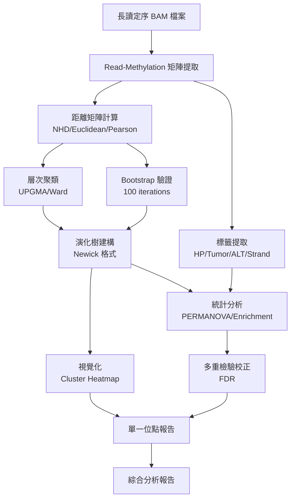

# InterSubMod 聚類與演化分析研究主軸

**版本**：1.0  
**日期**：2025-12-02  
**文件類型**：研究開發主軸說明

---

## 1. 研究背景與動機

### 1.1 研究問題

在癌症基因體學研究中，DNA 甲基化 (Methylation) 作為重要的表觀遺傳標記，其模式的異質性 (Heterogeneity) 可能反映出：

1. **單倍型差異** (Haplotype Variation)：來自父母不同染色體的甲基化模式差異
2. **腫瘤演化** (Tumor Evolution)：癌細胞亞群 (Subclones) 的甲基化表型分化
3. **正常-腫瘤分層** (Normal-Tumor Stratification)：正常細胞與癌細胞的甲基化差異

透過長讀定序 (Long-read Sequencing, e.g., PacBio HiFi, ONT)，我們能夠在**單一 Read 層級**同時獲得：

- 甲基化狀態 (5mC modifications)
- 體細胞變異 (Somatic SNV) 基因型 (ALT/REF)
- 單倍型標籤 (HP tag)
- 樣本來源 (Tumor/Normal)

**核心研究問題**：
> 在相同基因組區域內，不同 Reads 的甲基化模式是否與其生物學標籤 (HP, Tumor/Normal, ALT/REF) 存在系統性關聯？這種關聯是否反映腫瘤-甲基化的共同演化關係？

---

### 1.2 研究目標

1. **量化 Reads 間的甲基化相似性**  
   - 建立 Read-Read 距離矩陣，捕捉甲基化模式差異

2. **建構演化樹與聚類結構**  
   - 使用 UPGMA 演算法建構演化樹，揭示 Reads 的親緣關係
   - 透過 Bootstrap 驗證評估樹狀結構的穩定性

3. **分析標籤-聚類關聯**  
   - 統計檢定 HP 標籤、Tumor/Normal 狀態等是否與聚類結構顯著相關
   - 探索腫瘤演化過程中甲基化模式的分層現象

4. **提供視覺化與報告工具**  
   - 產生帶有標籤註記的 Cluster Heatmap
   - 產生單一位點與多位點綜合分析報告

---

## 2. 技術路線圖

### 2.1 整體工作流程

---

### 2.2 核心方法學

#### A. 距離度量 (Distance Metrics)

針對甲基化二元資料 (0/1) 與連續概率資料 (0.0-1.0)，支援多種距離計算方法：

| 距離類型 | 公式 | 適用情境 |
|---------|------|---------|
| **Normalized Hamming Distance (NHD)** | $\frac{\sum \|M_i - M_j\|}{\|Common\|}$ | 二元甲基化狀態 |
| **Euclidean (L2)** | $\sqrt{\frac{\sum (P_i - P_j)^2}{\|Common\|}}$ | 甲基化概率值 |
| **Pearson Correlation** | $\frac{1 - r(i,j)}{2}$ | 關注模式相關性 |

**缺失值處理**：僅考慮兩 Reads 共同覆蓋的 CpG 位點，並設定最小共同覆蓋閾值 (C_min = 3-5)。

---

#### B. 層次聚類與演化樹

**UPGMA (Unweighted Pair Group Method with Arithmetic Mean)**：

- **假設**：甲基化變化速率恆定（molecular clock）
- **適用性**：Reads 來自同一時間點，適合狀態聚類
- **輸出**：二元樹 (Dendrogram) 與 Newick 格式演化樹

**關鍵特性**：

- 分支長度反映甲基化距離
- 樹狀拓撲反映 Reads 的分群結構

---

#### C. Bootstrap 穩定性驗證

**原理**：對 CpG 位點進行有放回重抽樣 (Resampling)，重複建構演化樹，統計每個節點 (Clade) 的出現頻率。

**支持度解釋**：

- **≥ 95%**：高度可信的分支
- **75-95%**：中等可信
- **< 75%**：不穩定，謹慎解釋

---

#### D. 多標籤統計分析

**Level 1：單維度分析（核心）**

- **PERMANOVA**：檢定不同 HP 類別的 Reads 在距離矩陣上是否顯著分離
- **Clade Enrichment**：使用 Fisher's Exact Test 檢定特定 HP 在演化樹分支中的富集

**Level 2：多維度組合**

- 分析 HP × Tumor/Normal 的交互作用
- 檢驗是否腫瘤樣本中 HP 差異更顯著

**Level 3：Strand 分析**

- 整合分析：所有 Reads 一起分析，Strand 作為協變量
- 分離分析：Forward 與 Reverse 各自分析（當 Read 數足夠時）

---

#### E. 多重檢驗校正

面對數萬個位點的統計檢定，採用 **Benjamini-Hochberg FDR 校正**：

- 控制假發現率 (False Discovery Rate) < 5%
- 避免隨機性產生的假陽性結果
- 確保研究結論的可重現性

---

## 3. 技術實作架構

### 3.1 技術棧選擇

| 分析階段 | 實作語言 | 主要工具/庫 | 理由 |
|---------|---------|-----------|------|
| 距離矩陣計算 | C++ | Eigen, OpenMP | 高效能，已完成優化 |
| 層次聚類 | C++ | 自行實作 UPGMA | 避免外部依賴，整合 Bootstrap |
| Bootstrap 驗證 | C++ | OpenMP 平行化 | 計算密集，需極致效能 |
| 視覺化 | Python | Seaborn, Matplotlib | 精緻美觀，生態系成熟 |
| 統計分析 | Python | scikit-bio, scipy.stats | 成熟的統計套件 |

---

### 3.2 效能設計

**平行化策略**：

- **位點層級**：使用 OpenMP 平行處理多個基因組區域
- **Bootstrap 層級**：每個執行緒獨立執行一次 Bootstrap iteration
- **預期效能**（64 執行緒）：
  - 距離矩陣計算：40,000 位點 約 40 秒
  - 聚類 + Bootstrap：篩選後約 40 秒
  - 總計：< 10 分鐘

**記憶體優化**：

- 每個位點獨立處理，完成後立即釋放記憶體
- 預估總記憶體需求：< 8 GB

---

## 4. 預期成果與產出

### 4.1 單一位點分析產出

每個基因組位點將產生：

1. **數據檔案**：
   - 甲基化矩陣 (CSV)
   - 距離矩陣 (CSV, 含 Forward/Reverse 分離版本)
   - 演化樹 (Newick 格式)
   - Bootstrap 支持度報告

2. **視覺化圖片**（兩種類型）：

   **A. Distance-based Cluster Heatmap（距離矩陣熱圖）**：
   - X 軸與 Y 軸：Reads（按聚類順序排列）
   - 顏色：Reads 間的距離值（0 = 相同，1 = 完全不同）
   - Dendrogram：顯示在左側與上方
   - Annotation bars：HP/Tumor/Strand 標籤以色帶標示於圖側
   - **用途**：直接視覺化聚類結果與 Reads 間的相似性

   **B. Methylation Pattern Heatmap（甲基化模式熱圖）**：
   - Y 軸：Reads（按聚類順序排列）
   - X 軸：CpG 位點（按基因組位置排列）
   - 顏色：甲基化程度（0 = 未甲基化，1 = 完全甲基化）
   - Dendrogram：僅顯示在左側
   - Annotation bars：HP/Tumor/Strand 標籤
   - **用途**：展示聚類後的甲基化模式特徵

3. **統計結果**：
   - PERMANOVA F-statistic 與 p-value
   - Clade enrichment 分析表

---

### 4.2 多位點綜合報告

1. **顯著位點清單**（FDR < 0.05）
2. **全基因組統計總表**：
   - 每個位點的檢定結果
   - 原始 p-value 與校正後 p-value
3. **視覺化圖表**：
   - P-value 分佈直方圖
   - Volcano plot (F-statistic vs -log10(p))
   - HP 標籤在聚類中的整體分佈模式

---

### 4.3 生物學意義解讀

**預期發現**：

1. **單倍型分層**：HP1 與 HP2 的 Reads 在甲基化模式上可能形成明顯分支
2. **腫瘤異質性**：Tumor Reads 可能展現更高的甲基化多樣性
3. **ALT/REF 關聯**：攜帶體細胞變異的 Reads 可能展現特殊的甲基化模式
4. **演化模式**：透過演化樹拓撲推斷腫瘤亞群的克隆演化關係

---

## 5. 研究創新點

1. **整合性分析**：首次在單一 Read 層級同時整合甲基化、變異、單倍型資訊
2. **演化樹方法**：將演化樹建構應用於甲基化狀態聚類，探索表觀遺傳演化
3. **嚴謹統計**：採用 PERMANOVA 與 FDR 校正，確保結果可重現性
4. **高效能實作**：C++ 核心運算 + Python 視覺化，平衡效能與易用性

---

## 6. 應用場景

1. **癌症演化研究**：追蹤腫瘤亞群的甲基化分化軌跡
2. **表觀遺傳機制**：探索甲基化與基因型的相互作用
3. **單倍型特異性甲基化**：研究等位基因特異性甲基化 (ASM)
4. **長讀定序方法學**：為長讀定序數據分析提供新工具

---

## 7. 後續擴展方向

1. **非監督式分群**：除了階層聚類，嘗試 k-means、DBSCAN 等方法
2. **基因組特徵整合**：結合 CNV、結構變異 (SV) 等資訊
3. **時序分析**：若有多時間點樣本，追蹤甲基化演化軌跡
4. **機器學習模型**：訓練模型預測 Read 的標籤 (如 HP, Tumor/Normal)

---

## 8. 參考資料與相關研究

**方法學基礎**：

- UPGMA: Sokal & Michener (1958)
- Bootstrap: Felsenstein (1985)
- PERMANOVA: Anderson (2001)
- FDR: Benjamini & Hochberg (1995)

**應用領域**：

- 長讀定序甲基化分析：PacBio/ONT 甲基化檢測
- 腫瘤異質性研究：Single-cell 與 Spatial transcriptomics

---

**文件狀態**：已核准  
**下一步**：參照《開發實作指南》進行程式實作
