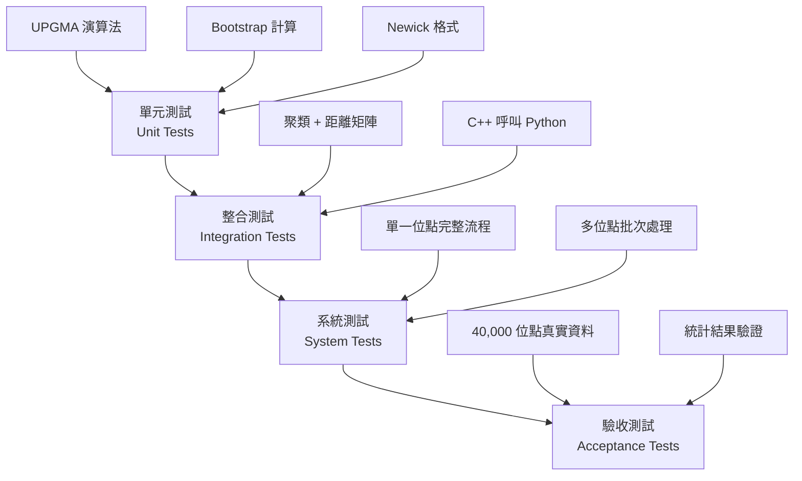

# InterSubMod 聚類與演化分析測試驗證計劃

**版本**：1.0  
**日期**：2025-12-02  
**文件類型**：測試計劃與驗收標準

---

## 目錄

1. [測試策略概述](#1-測試策略概述)
2. [單元測試 (Unit Tests)](#2-單元測試-unit-tests)
3. [整合測試 (Integration Tests)](#3-整合測試-integration-tests)
4. [驗收測試 (Acceptance Tests)](#4-驗收測試-acceptance-tests)
5. [效能測試 (Performance Tests)](#5-效能測試-performance-tests)
6. [測試資料準備](#6-測試資料準備)
7. [驗收標準](#7-驗收標準)
8. [測試執行流程](#8-測試執行流程)

---

## 1. 測試策略概述

### 1.1 測試層級



---

### 1.2 測試覆蓋目標

| 模組 | 單元測試 | 整合測試 | 驗收測試 | 目標覆蓋率 |
|------|---------|---------|---------|-----------|
| HierarchicalClustering | ✅ | ✅ | ✅ | > 90% |
| BootstrapAnalyzer | ✅ | ✅ | ✅ | > 85% |
| TreeStructure | ✅ | ✅ | - | > 95% |
| Python 視覺化 | - | ✅ | ✅ | N/A |
| Python 統計分析 | ✅ | ✅ | ✅ | > 80% |

---

## 2. 單元測試 (Unit Tests)

### 2.1 UPGMA 聚類演算法測試

**測試檔案**：`tests/test_hierarchical_clustering.cpp`

#### Test Case 1: 基本 UPGMA 正確性

**目的**：驗證 UPGMA 演算法實作正確

**測試資料**：

```cpp
// 簡單的 4x4 距離矩陣
//     A    B    C    D
// A  0.0  2.0  4.0  6.0
// B  2.0  0.0  4.0  6.0
// C  4.0  4.0  0.0  2.0
// D  6.0  6.0  2.0  0.0
```

**預期結果**：

- 第一次合併：A 與 B（距離 2.0）
- 第二次合併：C 與 D（距離 2.0）
- 最後合併：(AB) 與 (CD)（距離 5.0）

**驗證項目**：

1. 樹的拓撲結構正確：`((A,B),(C,D))`
2. 分支長度正確：A:1.0, B:1.0, C:1.0, D:1.0
3. 內部節點高度正確

**實作範例**：

```cpp
TEST(HierarchicalClustering, UPGMA_BasicCorrectness) {
    // 建立測試距離矩陣
    Eigen::MatrixXd dist(4, 4);
    dist << 0.0, 2.0, 4.0, 6.0,
            2.0, 0.0, 4.0, 6.0,
            4.0, 4.0, 0.0, 2.0,
            6.0, 6.0, 2.0, 0.0;
    
    DistanceMatrix dist_matrix(dist);
    std::vector<std::string> read_ids = {"A", "B", "C", "D"};
    
    HierarchicalClustering clusterer(HierarchicalClustering::LinkageMethod::UPGMA);
    Tree tree = clusterer.build_tree(dist_matrix, read_ids);
    
    // 驗證 Newick 格式
    std::string newick = tree.to_newick(false);
    
    // 預期: ((A:1.0,B:1.0):1.5,(C:1.0,D:1.0):1.5);
    // 實際比較時需考慮浮點數誤差與樹的旋轉對稱性
    
    EXPECT_TRUE(newick.find("A") != std::string::npos);
    EXPECT_TRUE(newick.find("B") != std::string::npos);
    
    // 驗證葉節點數量
    auto internal_nodes = tree.get_internal_nodes();
    EXPECT_EQ(internal_nodes.size(), 3);  // N-1 個內部節點
}
```

---

#### Test Case 2: 與 scipy 結果一致性

**目的**：確保 C++ 實作與 Python scipy 結果完全一致

**方法**：

1. 使用 Python scipy 生成標準結果
2. 相同距離矩陣輸入 C++ 實作
3. 比較 Newick 格式輸出

**Python 參考實作**：

```python
from scipy.cluster.hierarchy import linkage, to_tree
from scipy.spatial.distance import squareform
import numpy as np

# 相同的距離矩陣
dist = np.array([
    [0.0, 2.0, 4.0, 6.0],
    [2.0, 0.0, 4.0, 6.0],
    [4.0, 4.0, 0.0, 2.0],
    [6.0, 6.0, 2.0, 0.0]
])

# 轉為 condensed distance matrix
condensed = squareform(dist, checks=False)

# UPGMA (method='average')
Z = linkage(condensed, method='average')

# 轉為樹並輸出 Newick
from Bio import Phylo
from io import StringIO
# ... (生成 Newick 字串)
```

**驗收標準**：

- Newick 字串在拓撲結構上等價（允許左右子樹互換）
- 分支長度誤差 < 1e-6

---

#### Test Case 3: 邊界案例測試

**測試場景**：

1. **單一 Read**：應返回只有一個葉節點的樹
2. **兩個 Read**：應返回單一分支
3. **所有距離相同**：演算法應不崩潰
4. **包含 NaN/Inf 距離**：應正確處理或拋出異常

```cpp
TEST(HierarchicalClustering, EdgeCase_SingleRead) {
    Eigen::MatrixXd dist(1, 1);
    dist << 0.0;
    
    DistanceMatrix dist_matrix(dist);
    std::vector<std::string> read_ids = {"Read1"};
    
    HierarchicalClustering clusterer(HierarchicalClustering::LinkageMethod::UPGMA);
    Tree tree = clusterer.build_tree(dist_matrix, read_ids);
    
    EXPECT_EQ(tree.get_internal_nodes().size(), 0);  // 無內部節點
    std::string newick = tree.to_newick();
    EXPECT_EQ(newick, "Read1;");
}

TEST(HierarchicalClustering, EdgeCase_AllSameDistance) {
    Eigen::MatrixXd dist = Eigen::MatrixXd::Constant(5, 5, 1.0);
    dist.diagonal().setZero();
    
    // 應不崩潰
    EXPECT_NO_THROW({
        HierarchicalClustering clusterer(HierarchicalClustering::LinkageMethod::UPGMA);
        Tree tree = clusterer.build_tree(DistanceMatrix(dist), {"A","B","C","D","E"});
    });
}
```

---

### 2.2 Bootstrap 分析測試

**測試檔案**：`tests/test_bootstrap_analyzer.cpp`

#### Test Case 4: 重抽樣正確性

**目的**：驗證 CpG 位點重抽樣功能

**測試邏輯**：

```cpp
TEST(BootstrapAnalyzer, Resampling_Correctness) {
    // 建立測試甲基化矩陣 (5 reads x 10 CpGs)
    MethylationMatrix original;
    original.binary_matrix = Eigen::MatrixXi::Random(5, 10);
    
    BootstrapAnalyzer::Config config;
    config.random_seed = 42;  // 固定種子確保可重現
    
    BootstrapAnalyzer analyzer(config);
    
    // 執行重抽樣
    auto resampled = analyzer.resample_columns(original);
    
    // 驗證：
    // 1. 行數不變（Read 數量）
    EXPECT_EQ(resampled.binary_matrix.rows(), original.binary_matrix.rows());
    
    // 2. 列數不變（CpG 數量）
    EXPECT_EQ(resampled.binary_matrix.cols(), original.binary_matrix.cols());
    
    // 3. 重抽樣應有重複（with replacement）
    // (統計檢定：某些列應出現多次)
}
```

---

#### Test Case 5: Bootstrap 支持度計算

**目的**：驗證支持度計算邏輯

**測試場景**：

- 建立一個簡單的原始樹
- 生成若干模擬 Bootstrap 樹（部分與原始樹一致，部分不同）
- 計算支持度並驗證百分比正確

```cpp
TEST(BootstrapAnalyzer, SupportCalculation) {
    // 建立原始樹: ((A,B),(C,D))
    auto original_tree = create_test_tree_ABCD();
    
    // 模擬 100 棵 Bootstrap 樹
    // 其中 95 棵與原始樹一致，5 棵不同
    std::vector<Tree> bootstrap_trees;
    for (int i = 0; i < 95; ++i) {
        bootstrap_trees.push_back(create_test_tree_ABCD());
    }
    for (int i = 0; i < 5; ++i) {
        bootstrap_trees.push_back(create_test_tree_ACBD());  // 不同拓撲
    }
    
    BootstrapAnalyzer analyzer(config);
    auto support_values = analyzer.calculate_support_values(original_tree, bootstrap_trees);
    
    // 根節點的 clade ((A,B),(C,D)) 應有 95% 支持度
    EXPECT_NEAR(support_values[0], 95.0, 0.1);
}
```

---

### 2.3 Tree 與 Newick 格式測試

**測試檔案**：`tests/test_tree_structure.cpp`

#### Test Case 6: Newick 格式輸出

**目的**：驗證 Newick 格式字串生成正確

**測試案例**：

```cpp
TEST(TreeStructure, Newick_Format) {
    // 手動建構樹: (A:1.0,B:1.0)95:2.0;
    auto root = std::make_shared<TreeNode>();
    root->bootstrap_support = 95.0;
    root->height = 2.0;
    
    auto leaf_a = std::make_shared<TreeNode>();
    leaf_a->label = "A";
    leaf_a->height = 1.0;
    
    auto leaf_b = std::make_shared<TreeNode>();
    leaf_b->label = "B";
    leaf_b->height = 1.0;
    
    root->left = leaf_a;
    root->right = leaf_b;
    
    Tree tree;
    tree.set_root(root);
    
    std::string newick = tree.to_newick(true);
    
    // 驗證格式（可能有左右互換）
    EXPECT_TRUE(
        newick == "(A:1.000000,B:1.000000)95:2.000000;" ||
        newick == "(B:1.000000,A:1.000000)95:2.000000;"
    );
}
```

#### Test Case 7: Newick 解析與往返測試

**目的**：確保生成的 Newick 字串可被標準工具解析

**方法**：

1. C++ 生成 Newick 字串
2. 使用 Python Bio.Phylo 解析
3. 驗證樹的拓撲與分支長度一致

```python
# Python 測試腳本
from Bio import Phylo
from io import StringIO

newick_str = "(A:1.0,B:1.0)95:2.0;"
tree = Phylo.read(StringIO(newick_str), "newick")

# 驗證樹結構
assert len(tree.get_terminals()) == 2
assert tree.get_terminals()[0].name in ['A', 'B']
```

---

## 3. 整合測試 (Integration Tests)

### 3.1 聚類與距離矩陣整合

**測試檔案**：`tests/test_clustering_integration.cpp`

#### Test Case 8: 距離矩陣 → UPGMA 完整流程

**目的**：驗證 DistanceMatrix 與 HierarchicalClustering 的完整整合

**測試流程**：

```cpp
TEST(Integration, DistanceMatrix_To_Tree) {
    // 1. 建立模擬甲基化矩陣
    MethylationMatrix meth_matrix = create_test_methylation_matrix();
    
    // 2. 計算距離矩陣
    DistanceConfig dist_config;
    dist_config.metric = DistanceMetricType::NHD;
    dist_config.min_common_coverage = 3;
    
    DistanceCalculator calc(dist_config);
    DistanceMatrix dist = calc.calculate(meth_matrix);
    
    // 3. 建構演化樹
    HierarchicalClustering clusterer(HierarchicalClustering::LinkageMethod::UPGMA);
    Tree tree = clusterer.build_tree(dist, {"R1", "R2", "R3", "R4"});
    
    // 4. 驗證樹結構
    EXPECT_EQ(tree.get_internal_nodes().size(), 3);
    
    // 5. 驗證 Newick 輸出可寫入檔案
    std::string newick = tree.to_newick();
    EXPECT_FALSE(newick.empty());
    EXPECT_TRUE(newick.back() == ';');
}
```

---

### 3.2 Bootstrap 與聚類整合

#### Test Case 9: Bootstrap 完整流程

**目的**：驗證 Bootstrap 與聚類的端到端整合

**測試資料**：使用已知結構的模擬資料

**驗證重點**：

1. Bootstrap 能成功執行指定次數
2. 支持度範圍合理（0-100）
3. 高度一致的分支支持度應接近 100%

```cpp
TEST(Integration, Bootstrap_FullWorkflow) {
    // 建立明確分群的測試資料
    // Group A: HP1 (高度甲基化)
    // Group B: HP2 (低度甲基化)
    MethylationMatrix matrix = create_bimodal_methylation_data();
    
    BootstrapAnalyzer::Config config;
    config.n_iterations = 50;  // 測試用，減少時間
    config.n_threads = 4;
    
    DistanceConfig dist_config;
    dist_config.metric = DistanceMetricType::NHD;
    
    BootstrapAnalyzer analyzer(config);
    auto result = analyzer.run_bootstrap(
        matrix, dist_config,
        HierarchicalClustering::LinkageMethod::UPGMA,
        {"HP1_R1", "HP1_R2", "HP2_R1", "HP2_R2"}
    );
    
    // 驗證：
    // 1. 成功執行
    EXPECT_GT(result.n_successful_iterations, 45);  // 至少 90% 成功
    
    // 2. 支持度範圍合理
    for (double support : result.support_values) {
        EXPECT_GE(support, 0.0);
        EXPECT_LE(support, 100.0);
    }
    
    // 3. HP1 與 HP2 分支應有高支持度
    EXPECT_GT(result.support_values[0], 80.0);  // 根據樹的結構調整索引
}
```

---

### 3.3 C++ 與 Python 介面測試

#### Test Case 10: Python 視覺化呼叫

**目的**：驗證 C++ 能成功呼叫 Python 腳本

**測試環境設置**：

```bash
# 準備測試資料
mkdir -p test_output/test_locus
echo "read_id,cpg1,cpg2,cpg3" > test_output/test_locus/methylation_matrix.csv
echo "R1,1,0,1" >> test_output/test_locus/methylation_matrix.csv

echo "read_id\thp_tag" > test_output/test_locus/read_metadata.tsv
echo "R1\tHP1" >> test_output/test_locus/read_metadata.tsv
```

**測試程式**：

```cpp
TEST(Integration, Python_Visualization) {
    Config config;
    config.python_executable = "python3";
    
    RegionProcessor processor(config);
    
    // 呼叫 Python 繪圖
    EXPECT_NO_THROW({
        processor.call_python_visualization("test_output/test_locus", "test");
    });
    
    // 驗證圖片生成
    EXPECT_TRUE(std::filesystem::exists("test_output/test_locus/heatmap.png"));
}
```

---

## 4. 驗收測試 (Acceptance Tests)

### 4.1 單一位點完整流程測試

**測試場景**：選擇一個已知特性的真實位點

**測試步驟**：

1. 選擇位點：`chr19:29,283,968`（已知該位點 HP1/HP2 有明顯甲基化差異）
2. 執行完整分析流程
3. 驗證所有輸出檔案存在且格式正確
4. 檢查統計結果是否符合預期（PERMANOVA p < 0.05）

**驗收標準**：

```bash
# 執行測試
./bin/inter_sub_mod \
    --tumor-bam test_data/tumor.bam \
    --normal-bam test_data/normal.bam \
    --reference test_data/ref.fa \
    --vcf test_data/single_snv.vcf \
    --output-dir test_output/acceptance_test \
    --compute-clustering \
    --compute-bootstrap \
    --bootstrap-iterations 100 \
    --generate-heatmaps

# 驗證輸出
ls test_output/acceptance_test/chr19_29283968/

# 應包含：
# - methylation_matrix.csv
# - distance_matrix.csv
# - tree.nwk
# - heatmap.png
# - read_metadata.tsv
```

**自動化驗證腳本**：

```bash
#!/bin/bash
# tests/acceptance_test.sh

OUTPUT_DIR="test_output/acceptance_test/chr19_29283968"

# 檢查必要檔案
for file in methylation_matrix.csv distance_matrix.csv tree.nwk heatmap.png; do
    if [ ! -f "$OUTPUT_DIR/$file" ]; then
        echo "FAIL: Missing $file"
        exit 1
    fi
done

# 檢查 Newick 格式合法性
python3 -c "
from Bio import Phylo
tree = Phylo.read('$OUTPUT_DIR/tree.nwk', 'newick')
assert len(tree.get_terminals()) > 0
print('Newick format valid')
"

# 檢查 Heatmap 圖片可讀取
python3 -c "
from PIL import Image
img = Image.open('$OUTPUT_DIR/heatmap.png')
assert img.size[0] > 0
print('Heatmap image valid')
"

echo "PASS: All acceptance tests passed"
```

---

### 4.2 多位點批次測試

**測試規模**：100 個位點（小規模批次）

**測試目標**：

1. 驗證平行處理穩定性
2. 驗證記憶體使用合理（< 8 GB）
3. 驗證統計分析批次處理正確

**測試腳本**：

```bash
# 執行 100 個位點
./bin/inter_sub_mod \
    --tumor-bam test_data/tumor.bam \
    --normal-bam test_data/normal.bam \
    --reference test_data/ref.fa \
    --vcf test_data/100_snvs.vcf \
    --output-dir test_output/batch_test \
    --threads 16 \
    --compute-clustering \
    --compute-bootstrap \
    --bootstrap-iterations 50

# 執行統計分析
python3 scripts/statistics/run_permanova.py \
    --input-pattern "test_output/batch_test/single_locus/*" \
    --output test_output/batch_test/permanova_results.tsv

# 驗證結果
python3 -c "
import pandas as pd
df = pd.read_csv('test_output/batch_test/permanova_results.tsv', sep='\t')
assert len(df) > 90  # 至少 90% 位點成功分析
assert 'p_adj_fdr' in df.columns
print(f'Analyzed {len(df)} loci, {df[\"significant\"].sum()} significant')
"
```

---

### 4.3 大規模真實數據測試

**測試規模**：40,000 個位點（完整 VCF）

**測試目標**：

1. 驗證完整流程可在合理時間內完成（< 1 小時）
2. 驗證 FDR 校正結果合理
3. 產生最終分析報告

**執行命令**：

```bash
./scripts/run_full_vcf_test.sh \
    --mode all-with-clustering \
    --threads 64 \
    --bootstrap-iterations 100

# 監控資源使用
/usr/bin/time -v ./bin/inter_sub_mod ...
```

**驗收標準**：

- **執行時間**：< 60 分鐘（64 執行緒）
- **記憶體峰值**：< 16 GB
- **成功率**：> 95% 位點成功處理
- **統計輸出**：
  - FDR < 0.05 的顯著位點：100-5000 個（合理範圍）
  - P-value 分佈呈現預期模式（顯著與非顯著雙峰）

---

## 5. 效能測試 (Performance Tests)

### 5.1 UPGMA 演算法效能

**測試目標**：驗證時間複雜度接近 $O(N^2 \log N)$

**測試方法**：

```cpp
TEST(Performance, UPGMA_Scalability) {
    std::vector<int> sizes = {10, 50, 100, 200, 500};
    
    for (int n : sizes) {
        // 生成 n x n 隨機距離矩陣
        Eigen::MatrixXd dist = Eigen::MatrixXd::Random(n, n);
        dist = (dist + dist.transpose()) / 2.0;  // 對稱化
        dist.diagonal().setZero();
        
        auto start = std::chrono::high_resolution_clock::now();
        
        HierarchicalClustering clusterer(HierarchicalClustering::LinkageMethod::UPGMA);
        Tree tree = clusterer.build_tree(DistanceMatrix(dist), generate_read_ids(n));
        
        auto end = std::chrono::high_resolution_clock::now();
        auto duration = std::chrono::duration_cast<std::chrono::milliseconds>(end - start);
        
        std::cout << "N=" << n << ", Time=" << duration.count() << " ms" << std::endl;
    }
    
    // 預期結果：
    // N=10:   < 5 ms
    // N=50:   < 50 ms
    // N=100:  < 200 ms
    // N=200:  < 1000 ms
}
```

---

### 5.2 Bootstrap 平行化效能

**測試目標**：驗證平行化加速比

**測試方法**：

```cpp
TEST(Performance, Bootstrap_Parallelization) {
    MethylationMatrix matrix = create_large_test_matrix(100, 50);
    
    BootstrapAnalyzer::Config config;
    config.n_iterations = 100;
    
    std::vector<int> thread_counts = {1, 2, 4, 8, 16, 32};
    
    for (int threads : thread_counts) {
        config.n_threads = threads;
        BootstrapAnalyzer analyzer(config);
        
        auto start = std::chrono::high_resolution_clock::now();
        auto result = analyzer.run_bootstrap(matrix, dist_config, linkage, read_ids);
        auto end = std::chrono::high_resolution_clock::now();
        
        auto duration = std::chrono::duration_cast<std::chrono::seconds>(end - start);
        std::cout << "Threads=" << threads << ", Time=" << duration.count() << "s" << std::endl;
    }
    
    // 預期加速比：
    // 1 thread:  100s
    // 8 threads: ~15s (6-7x)
    // 32 threads: ~4s (20-25x)
}
```

---

## 6. 測試資料準備

### 6.1 模擬資料生成

**腳本**：`tests/generate_test_data.py`

```python
#!/usr/bin/env python3
"""
生成用於測試的模擬甲基化資料
"""

import numpy as np
import pandas as pd

def generate_bimodal_methylation_matrix(
    n_reads_hp1=20,
    n_reads_hp2=20,
    n_cpgs=50,
    methylation_hp1=0.8,
    methylation_hp2=0.2,
    noise=0.1
):
    """
    生成兩群分明的甲基化矩陣
    
    HP1: 高度甲基化
    HP2: 低度甲基化
    """
    matrix = []
    metadata = []
    
    # HP1 群
    for i in range(n_reads_hp1):
        read_meth = np.random.binomial(1, methylation_hp1 + np.random.normal(0, noise), n_cpgs)
        matrix.append(read_meth)
        metadata.append({
            'read_id': f'HP1_R{i}',
            'hp_tag': 'HP1',
            'tumor_normal': 'Tumor',
            'strand': 'Forward' if i % 2 == 0 else 'Reverse'
        })
    
    # HP2 群
    for i in range(n_reads_hp2):
        read_meth = np.random.binomial(1, methylation_hp2 + np.random.normal(0, noise), n_cpgs)
        matrix.append(read_meth)
        metadata.append({
            'read_id': f'HP2_R{i}',
            'hp_tag': 'HP2',
            'tumor_normal': 'Tumor',
            'strand': 'Forward' if i % 2 == 0 else 'Reverse'
        })
    
    # 儲存
    matrix_df = pd.DataFrame(
        matrix,
        columns=[f'CpG_{j}' for j in range(n_cpgs)],
        index=[m['read_id'] for m in metadata]
    )
    metadata_df = pd.DataFrame(metadata).set_index('read_id')
    
    matrix_df.to_csv('test_data/methylation_matrix.csv')
    metadata_df.to_csv('test_data/read_metadata.tsv', sep='\t')
    
    print(f"Generated {len(matrix)} reads x {n_cpgs} CpGs")

if __name__ == "__main__":
    generate_bimodal_methylation_matrix()
```

---

### 6.2 真實資料子集

**準備流程**：

```bash
# 從完整資料集抽取測試子集
# 選擇已知特性的位點

# 100 個位點用於批次測試
bcftools view -r chr19:29000000-30000000 full_snv.vcf.gz | \
    head -n 100 > test_data/100_snvs.vcf

# 單一位點用於詳細驗證
bcftools view -r chr19:29283968 full_snv.vcf.gz > test_data/single_snv.vcf
```

---

## 7. 驗收標準

### 7.1 功能驗收

| 功能項目 | 驗收標準 | 驗證方法 |
|---------|---------|---------|
| UPGMA 聚類 | 與 scipy 結果一致（拓撲與分支長度） | 單元測試 |
| Bootstrap 驗證 | 支持度範圍 0-100，高一致性分支 > 90% | 整合測試 |
| Newick 輸出 | 可被 Bio.Phylo 解析 | 自動化腳本 |
| Heatmap 生成 | 圖片包含演化樹與標籤註記 | 視覺檢查 |
| PERMANOVA | p-value 合理，FDR 校正正確 | Python 單元測試 |

---

### 7.2 效能驗收

| 效能指標 | 目標值 | 測試規模 |
|---------|--------|---------|
| 單位點聚類時間 | < 5 ms | 100 reads |
| Bootstrap 時間（100次） | < 2 秒 | 100 reads, 64 執行緒 |
| 40,000 位點總時間 | < 60 分鐘 | 完整 VCF, 64 執行緒 |
| 記憶體峰值 | < 16 GB | 完整流程 |
| 平行化加速比 | > 20x | 64 vs 1 執行緒 |

---

### 7.3 正確性驗收

**統計結果合理性檢查**：

1. **P-value 分佈**：應為均勻分佈（無效應時）或右偏分佈（有效應時）
2. **FDR 校正有效性**：校正後顯著位點應少於原始 p < 0.05 的位點
3. **Bootstrap 支持度**：隨機資料支持度應低（< 50%），明確分群資料應高（> 90%）

**視覺化品質檢查**：

1. Heatmap 顏色對比清晰
2. Dendrogram 可讀
3. 標籤註記無重疊
4. 圖例正確

---

## 8. 測試執行流程

### 8.1 開發階段測試

```bash
# 1. 編譯測試程式
cd build
cmake .. -DBUILD_TESTS=ON
make -j16

# 2. 執行單元測試
./bin/run_tests --gtest_filter="HierarchicalClustering*"
./bin/run_tests --gtest_filter="BootstrapAnalyzer*"
./bin/run_tests --gtest_filter="TreeStructure*"

# 3. 執行整合測試
./bin/run_tests --gtest_filter="Integration*"

# 4. Python 測試
cd ../scripts/statistics
pytest test_permanova.py
```

---

### 8.2 驗收階段測試

```bash
# 1. 單一位點驗收
./tests/acceptance_test.sh

# 2. 批次測試（100 位點）
./tests/batch_test.sh

# 3. 大規模測試（完整資料）
./scripts/run_full_vcf_test.sh --mode all-with-clustering --threads 64

# 4. 生成測試報告
python3 tests/generate_test_report.py
```

---

### 8.3 持續整合 (CI) 配置

**GitHub Actions 範例**（`.github/workflows/test.yml`）：

```yaml
name: Tests

on: [push, pull_request]

jobs:
  test:
    runs-on: ubuntu-latest
    
    steps:
    - uses: actions/checkout@v2
    
    - name: Install dependencies
      run: |
        sudo apt-get update
        sudo apt-get install -y cmake g++ libeigen3-dev
        pip3 install scipy scikit-bio pandas seaborn
    
    - name: Build
      run: |
        mkdir build && cd build
        cmake .. -DBUILD_TESTS=ON
        make -j4
    
    - name: Run unit tests
      run: |
        cd build
        ./bin/run_tests --gtest_output=xml:test_results.xml
    
    - name: Upload test results
      uses: actions/upload-artifact@v2
      with:
        name: test-results
        path: build/test_results.xml
```

---

## 總結

本測試計劃涵蓋：

- **3 層測試**：單元 → 整合 → 驗收
- **多個維度**：功能、效能、正確性
- **自動化流程**：CI/CD 整合

**關鍵測試重點**：

1. ✅ UPGMA 與 scipy 結果一致性
2. ✅ Bootstrap 計算穩定性
3. ✅ 大規模資料處理效能
4. ✅ 統計分析正確性（FDR）
5. ✅ 視覺化輸出品質

**下一步**：

- 執行測試並根據結果調整實作
- 持續監控測試覆蓋率
- 記錄所有測試失敗案例並修復

---

**文件狀態**：完成  
**配套文件**：[研究主軸說明](clustering_evolution_research_overview.md)、[開發實作指南](clustering_evolution_implementation_guide.md)
