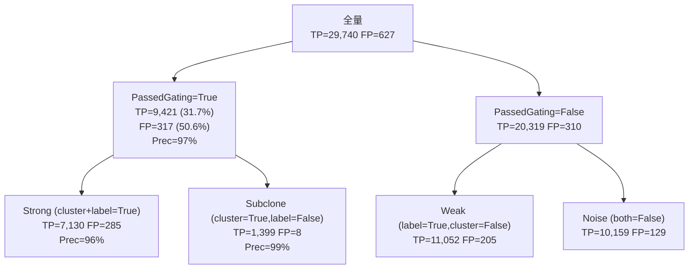
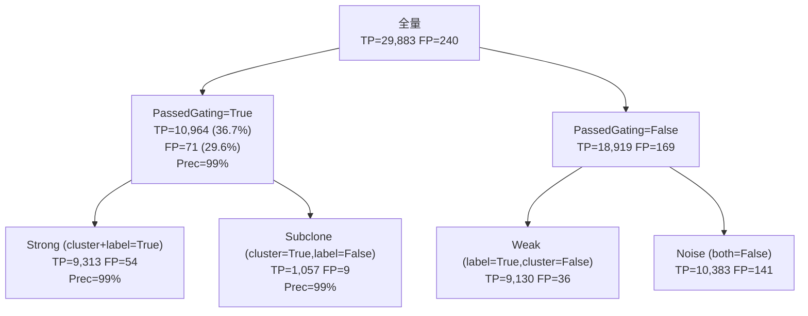
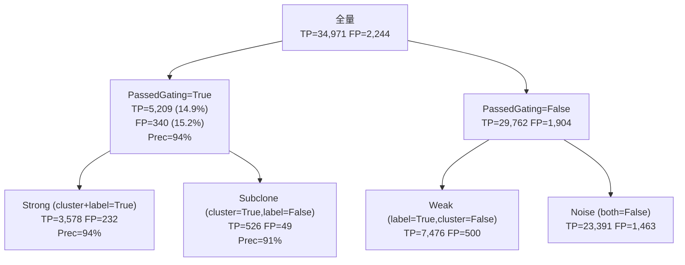
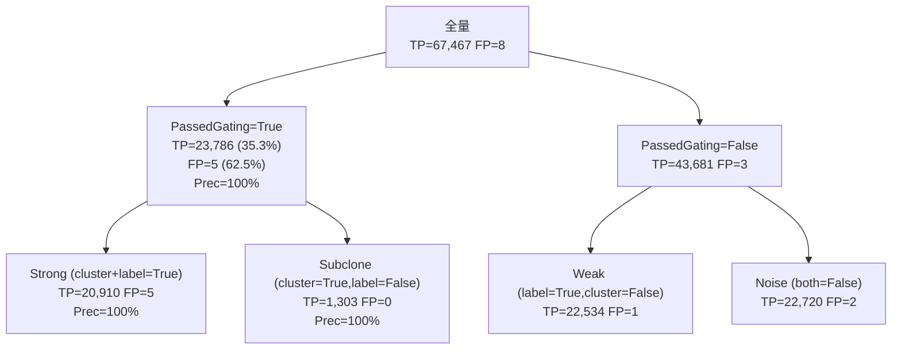
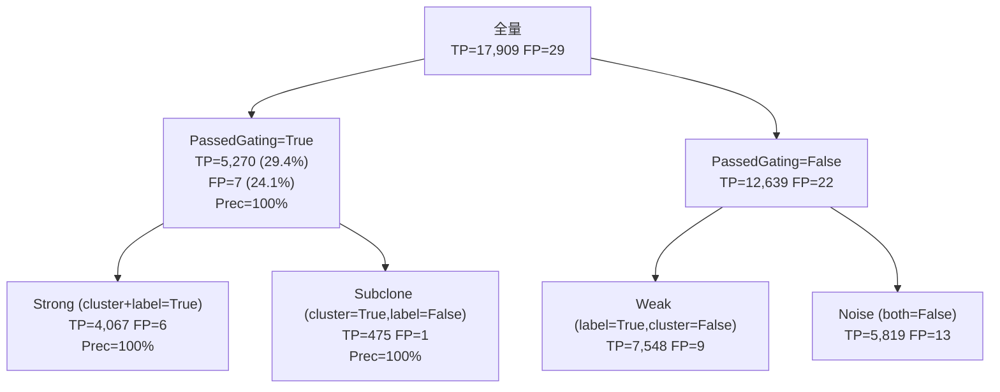
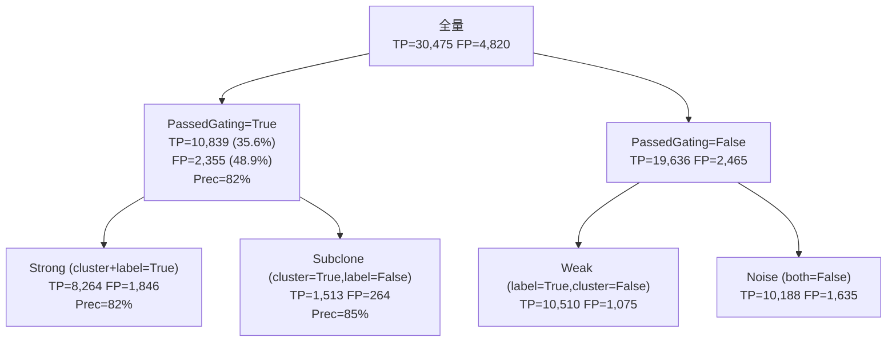

<!--
建立時間: 2026-03-23
目標: VerificationClass 決策樹跨樣本量化分析（Steps 2/4/5/6/7/8）
處理範圍: 7 個樣本 + HCC1395 pileup n=99
關聯檔案:
  - src/core/SignificanceAnalyzer.cpp (304-337)
  - src/core/GlobalTest.cpp (137-142)
  - scripts/pipeline/steps/03_filter_analysis.py
  - scripts/analysis/verify_class_decision_tree_audit.py
-->

# VerificationClass 決策樹跨樣本量化分析

## 1. 定義

### VerificationClass 決策邏輯
```
cluster_significant = passed_gate AND (GlobalAltP ≤ 0.05 OR GlobalHPP ≤ 0.05)
label_significant   = HPMergedSig OR AlleleSig

Strong   = label_sig=True  AND cluster_sig=True
Subclone = label_sig=False AND cluster_sig=True
Weak     = label_sig=True  AND cluster_sig=False
Noise    = label_sig=False AND cluster_sig=False

passed_gate = (GlobalP ≤ 0.1) AND (CramersV ≥ 0.1)
```

### 欄位來源（significance_summary.csv）
| 欄位 | 說明 |
|------|------|
| PassedGating | passed_gate 結果 |
| CramersV | Cramér's V 效應量 |
| GlobalP | 全局 p-value（AlleleDelta chi-sq） |
| HPMergedSig | HP 合并顯著性 |
| AlleleSig | Allele 顯著性 |
| VerificationClass | Strong/Weak/Subclone/Noise |
| Significant | Python 層判斷（候選去除） |
| Potential_LOH | LOH 旗標 |
| Quality_Score | QualityScore (0-100) |
| ClusterPermanovaF | PERMANOVA F 統計量 |
| ClusterPermanovaP | PERMANOVA p-value |

## 2. 決策樹流量（跨樣本）

### HCC1395



| 判斷標準 | TP | FP | TP% | FP% | Precision |
|---------|----|----|-----|-----|-----------|
| 全量 | 29,740 | 627 | 100% | 100% | 97.9% |
| PassedGating=True | 9,421 | 317 | 31.7% | 50.6% | 96.7% |
| Strong | 7,130 | 285 | 24.0% | 45.5% | 96.2% |
| Subclone | 1,399 | 8 | 4.7% | 1.3% | 99.4% |
| Weak | 11,052 | 205 | 37.2% | 32.7% | 98.2% |
| Noise | 10,159 | 129 | 34.2% | 20.6% | 98.7% |
| Significant=True | 1,833 | 4 | 6.2% | 0.6% | 99.8% |
| VC != Noise | 19,581 | 498 | 65.8% | 79.4% | 97.5% |

### HCC1395_DORADO



| 判斷標準 | TP | FP | TP% | FP% | Precision |
|---------|----|----|-----|-----|-----------|
| 全量 | 29,883 | 240 | 100% | 100% | 99.2% |
| PassedGating=True | 10,964 | 71 | 36.7% | 29.6% | 99.4% |
| Strong | 9,313 | 54 | 31.2% | 22.5% | 99.4% |
| Subclone | 1,057 | 9 | 3.5% | 3.8% | 99.2% |
| Weak | 9,130 | 36 | 30.6% | 15.0% | 99.6% |
| Noise | 10,383 | 141 | 34.7% | 58.8% | 98.7% |
| Significant=True | 3,549 | 25 | 11.9% | 10.4% | 99.3% |
| VC != Noise | 19,500 | 99 | 65.3% | 41.2% | 99.5% |

### COLO829



| 判斷標準 | TP | FP | TP% | FP% | Precision |
|---------|----|----|-----|-----|-----------|
| 全量 | 34,971 | 2,244 | 100% | 100% | 94.0% |
| PassedGating=True | 5,209 | 340 | 14.9% | 15.2% | 93.9% |
| Strong | 3,578 | 232 | 10.2% | 10.3% | 93.9% |
| Subclone | 526 | 49 | 1.5% | 2.2% | 91.5% |
| Weak | 7,476 | 500 | 21.4% | 22.3% | 93.7% |
| Noise | 23,391 | 1,463 | 66.9% | 65.2% | 94.1% |
| Significant=True | 437 | 24 | 1.2% | 1.1% | 94.8% |
| VC != Noise | 11,580 | 781 | 33.1% | 34.8% | 93.7% |

### H1437



| 判斷標準 | TP | FP | TP% | FP% | Precision |
|---------|----|----|-----|-----|-----------|
| 全量 | 67,467 | 8 | 100% | 100% | 100.0% |
| PassedGating=True | 23,786 | 5 | 35.3% | 62.5% | 100.0% |
| Strong | 20,910 | 5 | 31.0% | 62.5% | 100.0% |
| Subclone | 1,303 | 0 | 1.9% | 0.0% | 100.0% |
| Weak | 22,534 | 1 | 33.4% | 12.5% | 100.0% |
| Noise | 22,720 | 2 | 33.7% | 25.0% | 100.0% |
| Significant=True | 7,950 | 1 | 11.8% | 12.5% | 100.0% |
| VC != Noise | 44,747 | 6 | 66.3% | 75.0% | 100.0% |

### H2009


| 判斷標準 | TP | FP | TP% | FP% | Precision |
|---------|----|----|-----|-----|-----------|
| 全量 | 132,908 | 86 | 100% | 100% | 99.9% |
| PassedGating=True | 16,278 | 4 | 12.2% | 4.7% | 100.0% |
| Strong | 9,941 | 1 | 7.5% | 1.2% | 100.0% |
| Subclone | 1,954 | 0 | 1.5% | 0.0% | 100.0% |
| Weak | 43,374 | 8 | 32.6% | 9.3% | 100.0% |
| Noise | 77,639 | 77 | 58.4% | 89.5% | 99.9% |
| Significant=True | 4,735 | 0 | 3.6% | 0.0% | 100.0% |
| VC != Noise | 55,269 | 9 | 41.6% | 10.5% | 100.0% |

### HCC1937


| 判斷標準 | TP | FP | TP% | FP% | Precision |
|---------|----|----|-----|-----|-----------|
| 全量 | 12,392 | 195 | 100% | 100% | 98.5% |
| PassedGating=True | 2,138 | 5 | 17.3% | 2.6% | 99.8% |
| Strong | 1,820 | 4 | 14.7% | 2.1% | 99.8% |
| Subclone | 163 | 1 | 1.3% | 0.5% | 99.4% |
| Weak | 5,159 | 16 | 41.6% | 8.2% | 99.7% |
| Noise | 5,250 | 174 | 42.4% | 89.2% | 96.8% |
| Significant=True | 605 | 2 | 4.9% | 1.0% | 99.7% |
| VC != Noise | 7,142 | 21 | 57.6% | 10.8% | 99.7% |

### HCC1954



| 判斷標準 | TP | FP | TP% | FP% | Precision |
|---------|----|----|-----|-----|-----------|
| 全量 | 17,909 | 29 | 100% | 100% | 99.8% |
| PassedGating=True | 5,270 | 7 | 29.4% | 24.1% | 99.9% |
| Strong | 4,067 | 6 | 22.7% | 20.7% | 99.9% |
| Subclone | 475 | 1 | 2.7% | 3.4% | 99.8% |
| Weak | 7,548 | 9 | 42.1% | 31.0% | 99.9% |
| Noise | 5,819 | 13 | 32.5% | 44.8% | 99.8% |
| Significant=True | 1,219 | 0 | 6.8% | 0.0% | 100.0% |
| VC != Noise | 12,090 | 16 | 67.5% | 55.2% | 99.9% |

### HCC1395_pileup_n99



| 判斷標準 | TP | FP | TP% | FP% | Precision |
|---------|----|----|-----|-----|-----------|
| 全量 | 30,475 | 4,820 | 100% | 100% | 86.3% |
| PassedGating=True | 10,839 | 2,355 | 35.6% | 48.9% | 82.2% |
| Strong | 8,264 | 1,846 | 27.1% | 38.3% | 81.7% |
| Subclone | 1,513 | 264 | 5.0% | 5.5% | 85.1% |
| Weak | 10,510 | 1,075 | 34.5% | 22.3% | 90.7% |
| Noise | 10,188 | 1,635 | 33.4% | 33.9% | 86.2% |
| Significant=True | 2,017 | 105 | 6.6% | 2.2% | 95.1% |
| VC != Noise | 20,287 | 3,185 | 66.6% | 66.1% | 86.4% |

## 3. 特徵辨別力 AUROC（跨樣本）

AUROC 為 TP-discriminating 方向（>0.5 表示 TP 此特徵值更高，<0.5 表示 FP 更高）

| 特徵 | HCC1395 | HCC1395_DORADO | COLO829 | H1437 | H2009 | HCC1937 | HCC1954 | HCC1395_pileup_n99 |
|------|------|------|------|------|------|------|------|------|
| GlobalP_inv | 0.297 | 0.441 | 0.371 | 0.269 | 0.485 | 0.443 | 0.468 | 0.344 |
| CramersV | 0.062 | 0.117 | 0.020 | 0.123 | 0.076 | 0.050 | 0.093 | 0.066 |
| HeuristicScore | 0.317 | 0.458 | 0.371 | 0.306 | 0.490 | 0.443 | 0.478 | 0.360 |
| AlleleDelta | 0.763 | 0.412 | 0.545 | 0.503 | 0.379 | 0.212 | 0.465 | 0.636 |
| PairwiseMeanDist | 0.672 | 0.522 | 0.534 | 0.535 | 0.430 | 0.508 | 0.466 | 0.543 |
| LOH_HP_Signal | 0.760 | 0.412 | 0.545 | 0.503 | 0.375 | 0.212 | 0.457 | 0.634 |
| HP_Coverage_Symmetry | 0.494 | 0.412 | 0.500 | 0.468 | 0.718 | 0.448 | 0.667 | 0.523 |
| ClusterPermanovaF | 0.000 | 0.000 | 0.000 | 0.000 | 0.000 | 0.000 | 0.000 | 0.274 |

## 4. Significant 欄位評估

比較 Significant=True 與 VC!=Noise 作為分類準則的差異：

| 樣本 | Sig=True TP% | Sig=True FP% | Sig=True Prec | VC!=Noise TP% | VC!=Noise FP% | VC!=Noise Prec |
|------|-------------|-------------|--------------|--------------|--------------|---------------|
| HCC1395 | 6.2% | 0.6% | 99.8% | 65.8% | 79.4% | 97.5% |
| HCC1395_DORADO | 11.9% | 10.4% | 99.3% | 65.3% | 41.2% | 99.5% |
| COLO829 | 1.2% | 1.1% | 94.8% | 33.1% | 34.8% | 93.7% |
| H1437 | 11.8% | 12.5% | 100.0% | 66.3% | 75.0% | 100.0% |
| H2009 | 3.6% | 0.0% | 100.0% | 41.6% | 10.5% | 100.0% |
| HCC1937 | 4.9% | 1.0% | 99.7% | 57.6% | 10.8% | 99.7% |
| HCC1954 | 6.8% | 0.0% | 100.0% | 67.5% | 55.2% | 99.9% |
| HCC1395_pileup_n99 | 6.6% | 2.2% | 95.1% | 66.6% | 66.1% | 86.4% |

## 5. QualityScore 審查

### LOH 懲罰影響（-25分）

| 樣本 | TP LOH=T mean | TP LOH=F mean | FP LOH=T mean | FP LOH=F mean |
|------|--------------|--------------|--------------|--------------|
| HCC1395 | 59(n=14103) | 97(n=15637) | 70(n=302) | 98(n=325) |
| HCC1395_DORADO | 62(n=13345) | 96(n=16538) | 56(n=135) | 97(n=105) |
| COLO829 | 29(n=7046) | 63(n=27925) | 29(n=522) | 63(n=1722) |
| H1437 | 58(n=14098) | 98(n=53369) | 43(n=3) | 99(n=5) |
| H2009 | 71(n=37990) | 98(n=94918) | 71(n=66) | 92(n=20) |
| HCC1937 | 71(n=6883) | 95(n=5509) | 70(n=163) | 97(n=32) |
| HCC1954 | 64(n=1939) | 93(n=15970) | 67(n=10) | 96(n=19) |
| HCC1395_pileup_n99 | 59(n=14272) | 96(n=16203) | 54(n=2884) | 90(n=1936) |

### LOH 比率（各 VC class）

| 樣本 | Strong TP/FP LOH% | Subclone TP/FP LOH% | Noise TP LOH% |
|------|------------------|---------------------|--------------|
| HCC1395 | TP=37% / FP=51% | TP=89% / FP=75% | TP=65% |
| HCC1395_DORADO | TP=34% / FP=26% | TP=75% / FP=89% | TP=62% |
| COLO829 | TP=3% / FP=7% | TP=10% / FP=27% | TP=29% |
| H1437 | TP=8% / FP=20% | TP=20% / FP=nan% | TP=46% |
| H2009 | TP=15% / FP=0% | TP=31% / FP=nan% | TP=39% |
| HCC1937 | TP=42% / FP=0% | TP=87% / FP=100% | TP=74% |
| HCC1954 | TP=8% / FP=0% | TP=16% / FP=0% | TP=17% |
| HCC1395_pileup_n99 | TP=37% / FP=50% | TP=89% / FP=86% | TP=64% |

## 8. PERMANOVA 懲罰（×0.7 if ClusterPermanovaP>0.05）

| 樣本 | TP passed_gate | TP perm_valid | TP penalized% | FP penalized% | TP penalized mean_HS | TP normal mean_HS |
|------|--------------|--------------|--------------|--------------|---------------------|-----------------|
| HCC1395 | 9421 | 0 | nan% | nan% | nan | nan |
| HCC1395_DORADO | 10964 | 0 | nan% | nan% | nan | nan |
| COLO829 | 5209 | 0 | nan% | nan% | nan | nan |
| H1437 | 23786 | 0 | nan% | nan% | nan | nan |
| H2009 | 16278 | 0 | nan% | nan% | nan | nan |
| HCC1937 | 2138 | 0 | nan% | nan% | nan | nan |
| HCC1954 | 5270 | 0 | nan% | nan% | nan | nan |
| HCC1395_pileup_n99 | 10839 | 10839 | 2% | 2% | 1.25 | 14.01 |

## 結論

### Step 2: VerificationClass 決策樹
- **Pending**: 需結合 3+ 樣本數據確認 passed_gate 雙重閾值合理性

### Step 4: Significant 欄位
- **Pending**: 對比 Significant=True vs VC!=Noise 的 Precision 差異確認是否需要移除

### Step 5: QualityScore LOH 懲罰
- **Pending**: 確認 LOH TP 的 QualityScore 是否顯著低於非 LOH TP

### Step 6: LOH 在各 VC class 的比例
- **Pending**: 確認 FP 是否有更高的 LOH 比率（若有，LOH 可作為 FP 指標）

### Step 8: PERMANOVA 懲罰
- **Pending**: 確認懲罰比率與 HeuristicScore 影響程度
