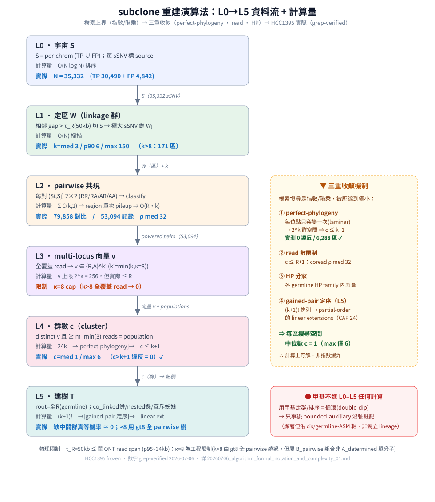

# subclone 重建演算法：形式化定義 + 流程 + 計算量

> 流程圖：L0→L5 每階段的定義 + 計算量（樸素上界 → 三重收斂 → HCC1395 實際）+ 右側收斂機制 + 甲基不進計算的守則。

## 0. 變數定義（notation）

| 符號 | 定義 | 備註 |
|---|---|---|
| **G** | germline 雜合 SNP 集；G₁,G₂,… | **只用於 HP 定相**（外部 LongPhase-S），不進 somatic 組合 |
| **S** | somatic sSNV 宇宙；Sᵢ 第 i 個 | N = \|S\| = 全體 sSNV 數 |
| **W** | region（linkage 區）；Wⱼ 第 j 個 | = 相鄰 gap ≤ τ_R 的極大 sSNV 鏈 |
| **k** | 一個區內 sSNV 數 = \|S ∩ W\| | 區的「複雜度」 |
| **R** | reads；R = 區內 read 數；r = 單一 read | ⚠ 等位向量中的 R=REF、A=ALT（與 read 數 R 同字母，依上下文） |
| **ρᵢⱼ** | coread(Sᵢ,Sⱼ) = 同時覆蓋兩位點的 read 數 | powered ⟺ ρᵢⱼ ≥ ρ_min |
| **v** | genotype 向量 ∈ {R,A}^k（單 read 在 k 個位點的等位）| 例 RRA、AAA |
| **c** | cluster/population 數 = 區內 distinct v（≥m_min reads）| 「幾個細胞狀態」 |
| **H** | HP（germline 單倍型）標籤 H1/H2/H3 | 切 read 成 HP family |
| **T** | clone 樹；T₁,…,T_m 候選樹 | root = 全 R（germline） |

**參數（門檻）**：τ_R = 50,000 bp（same-read 窗）· ρ_min = 6（powered）· m_min = 3（population 支持）· κ = 8（genotype-向量 cap）· ε = 0.02（ONT 噪聲底線）。

---

## 1. 流程 L0→L5（每階段：定義 + 計算量 + HCC1395 實際）

### L0 — 宇宙 S
S = per-chrom (TP ∪ FP)。**計算量** O(N log N) 排序。**實際**：N = **35,332**（TP 30,490 + FP 4,842）。

### L1 — 定區 W（linkage 群）
以相鄰 sSNV gap > τ_R 切 S → {Wⱼ}。k_j = \|Wⱼ\|。**計算量** O(N) 掃描。
**實際**：k median **3** / p90 **6** / **max 150**；k>8 的區 = **171**。census 三桶（每 sSNV 一態）：linked **21,554** / underpowered **5,458** / isolated **8,320**（= N ✓）。

### L2 — pairwise 共現
對每對 (Sᵢ,Sⱼ)（dist ≤ τ_R）建 2×2 N(RR/RA/AR/AA) → classify（co_linked/nested/mutual_excl/independent）。
**計算量**：對數 = Σⱼ C(k_j,2)（理論）；但**每區單次 region-pileup** → 有效 O(R·k) 非 O(k²·pileup)。
**實際**：Σ C(k,2) = **79,858** 對；**n_pairs_recorded = 53,094**（powered/記錄）；coread ρ median **32** / p90 **91** / max **428**。

### L3 — multi-locus genotype 向量
k' = min(k, κ)（k>κ 取最密 κ 個）；對「全覆蓋 k' 位點」的 read 建 v；population = distinct v 且 ≥ m_min reads。
**計算量**：v ∈ {R,A}^{k'} → 上限 2^κ = **256** 種，但實際 ≤ R（read 數）。**這是 κ=8 cap 的來源**（k>8 時全覆蓋 read→0）。

### L4 — cluster 數上界 c（核心收斂）
**c ≤ min(R+1, k'+1)**：
- 樸素基因型空間 = 2^{k'}（指數）；
- **perfect-phylogeny**（每位點只突變一次，laminar）→ **c ≤ k'+1**；
- read 數限制 → c ≤ R+1；
- HP 分家 → 各 family 內再降。
**實際**：c median **1** / max **6**；**c > k+1 違反 = 0 / 6,288**（perfect-phylogeny 上界實證成立）。

### L5 — 建樹 T
root = 全 R（germline，如 RRR…）。從 pairwise 建：co_linked→併節點、nested→祖裔邊、mutual_excl→姊妹、independent→四配子違反。
- **候選樹數**（缺中間群順序歧義）：樸素 ≤ (k+1)!；但 **gained-pair pairwise 定序**把排列 prune 成 partial-order 的 linear extensions（CAP=24）→ block/ordered 收斂單一解。
- **k>κ（去 8-cap）**：`gt8` 用**全 sSNV pairwise** 建 position-level 樹（union-find 併 co_linked + 祖裔 DAG + 環偵測 + transitive reduction），O(k²)/區；節點數 ≤ k。

---

## 2. 計算量收斂全景（樸素 → 限制 → 實際）

| 階段 | 樸素上界 | 收斂機制 | HCC1395 實際 |
|---|---|---|---|
| genotype 空間 | 2^k | perfect-phylogeny + read | c ≤ k+1；median c=**1**、max **6**（0 違反）|
| 樹拓樸 | (k+1)! 排列 | pairwise 定序 → linear extensions | 缺中間群 69 區 → 多數 block/ordered、真等機率≈0 |
| pairwise 比較 | Σ C(k,2)=79,858 | region 單次 pileup | 有效 O(R·k)、53,094 對 |
| >8 區 | 全覆蓋 read→0（不可建 vector）| 全 pairwise position 樹 | 171 個 >8 區可 pairwise 建（乾淨子集）|

**核心洞見**：樸素搜尋是指數/階乘，但**真實資料被三重壓縮到極小**——perfect-phylogeny（c≤k+1，0 違反）、read 數（median 32 coread）、HP 分家。∴ 每區搜尋空間中位數只有 **c=1**（單一群；max 也僅 6）。

---

## 3. HCC1395 實際資料量（grep-verified，2026-07-06 canonical）

| 量 | 值 |
|---|---|
| N = \|S\| | 35,332（TP 30,490 / FP 4,842）|
| census 三桶 | linked 21,554 / underpowered 5,458 / isolated 8,320 |
| n_pairs 記錄 | 53,094 |
| Σ C(k,2) | 79,858 |
| N_W（有向量區）| 6,288 |
| k | median 3 / p90 6 / max 150 / >8: 171 |
| c | median 1 / max 6 / **c>k+1: 0** |
| coread ρ | median 32 / p90 91 / max 428 |
| determinacy | A_determined 1,764 · B_pairwise 943 · C_underdetermined 544 · A_ambiguous 69 · E_subcube_recovered 2,403 · incompatible 18 · recurrence(cand 9/artifact 11/LOH 50) · other 477 |

> ⚠ determinacy 分類含其他 session 2026-07-04/05 的 incompatible 重分類（E_subcube_recovered / recurrence_*）；N_W 由 3,885→6,288。此表為當前 canonical。

---

## 4. 限制（physical / algorithmic bounds）
- **τ_R = 50kb**：物理上限 = 單 ONT read aligned-span（p95~34kb、max~76kb）；跨此需 Tier-PS（germline-only 統計相位，非克隆連鎖，未做）。
- **κ = 8 vector cap**：k>8 時全覆蓋 read→0（工程限制，非物理）→ 由 L5 全 pairwise 建樹繞過（但那是 B_pairwise 組合、非 A_determined 單分子）。
- **c ≤ k+1**：perfect-phylogeny 理論上界（實證 0 違反）。
- **甲基不進 L0-L5 任何計算**（🔴 循環；只事後 bounded-auxiliary 註記）。

---

## 5. provenance
數字來源：`sm_linkage_genomewide.json`（universe/pairs/census）+ `topology_per_region.json`（regions/k/c/determinacy）。演算法：`sm_linkage_genomewide.py`（L0-L2）·`sm_multilocus_combinations.py`（L3）·`sm_region_integration.py`+`topology_analysis.py`（L4-L5）·`enumerate_candidate_trees.py`（定序）·`gt8_pairwise_tree.py`（>8）。
