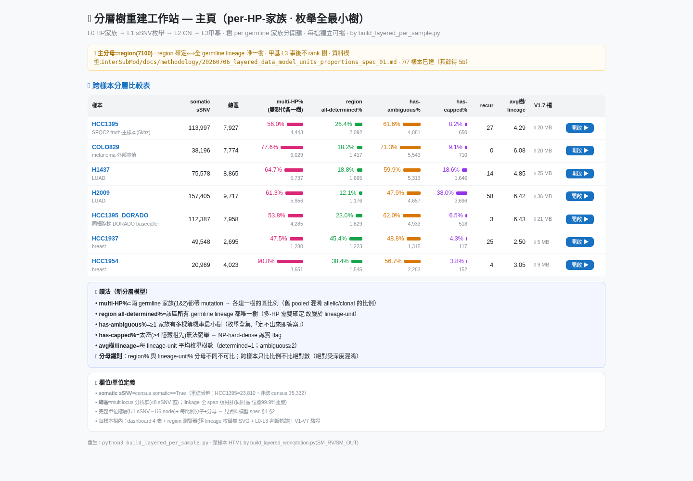
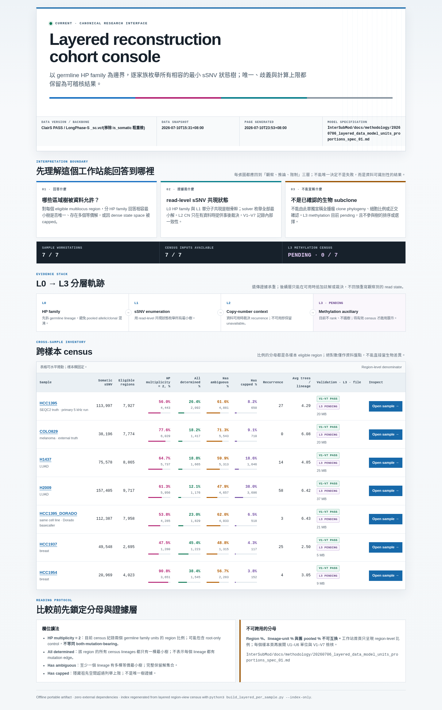
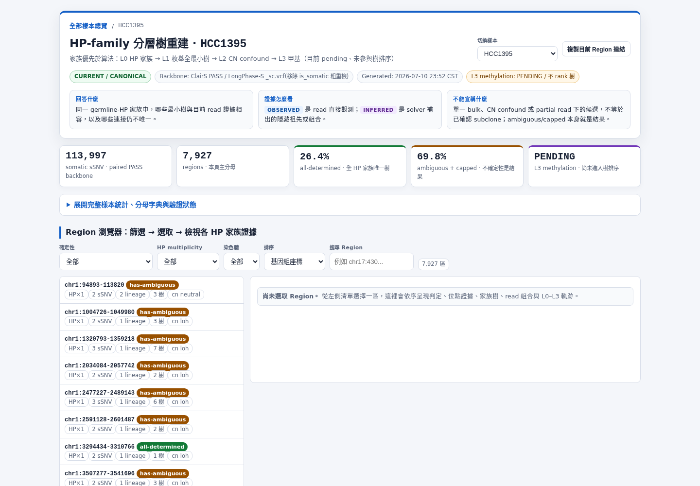
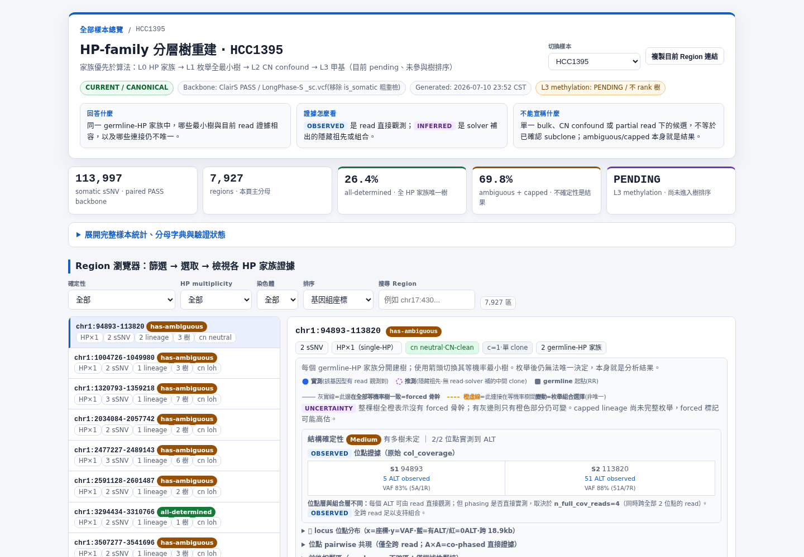
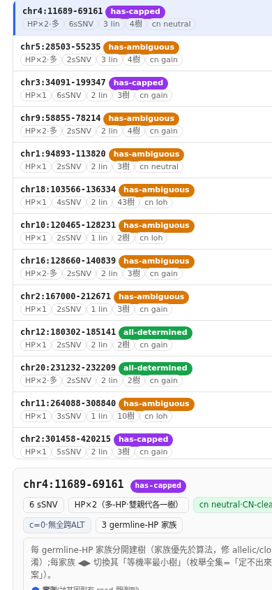
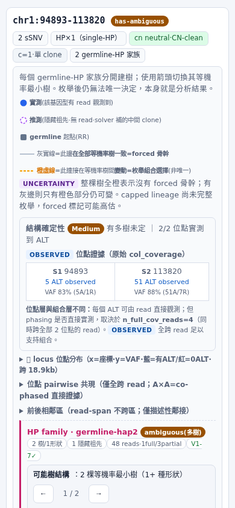
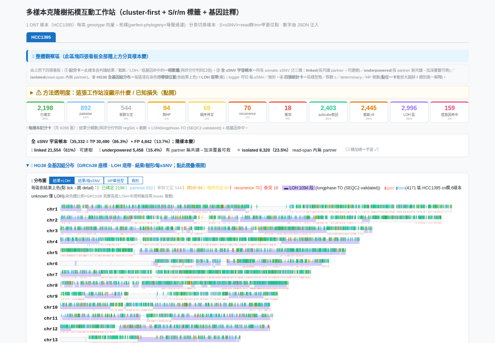
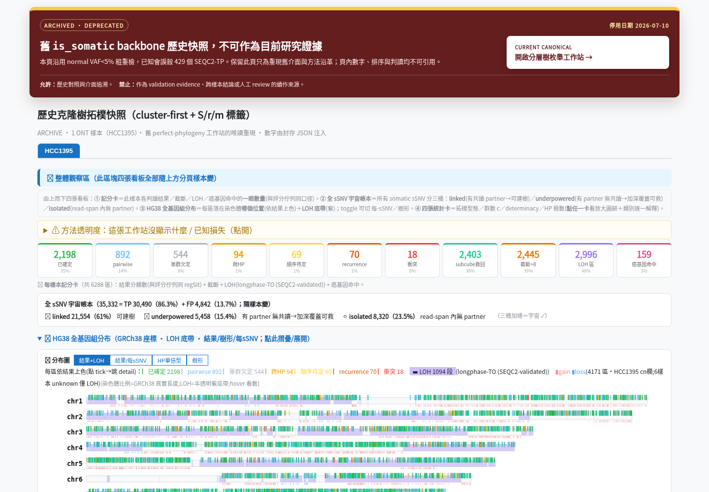

<!--
建立時間: 2026-07-10
目標: 以本機 Chromium / Playwright 完成 layered 與 topology 工作站的桌機、手機視覺稽核，修正展示、說明、互動與證據邊界。
處理範圍: InterSubMod/docs/methodology/_assets/layered_workstation/ 與 InterSubMod/docs/methodology/_assets/topology_workstation/，涵蓋 2 個 index、14 個 sample HTML、桌機與手機 viewport。
關聯檔案: InterSubMod/docs/methodology/_assets/20260627_subclone_4axis_teaching/scripts/build_layered_per_sample.py；InterSubMod/docs/methodology/_assets/20260627_subclone_4axis_teaching/scripts/build_layered_workstation.py；InterSubMod/docs/methodology/_assets/20260627_subclone_4axis_teaching/scripts/build_per_sample_workstation.py；InterSubMod/docs/methodology/_assets/20260627_subclone_4axis_teaching/scripts/build_topology_workstation.py；InterSubMod/docs/methodology/_assets/20260627_subclone_4axis_teaching/scripts/validate_workstation_ui.py
-->

# Layered / Topology 工作站視覺稽核與介面改進

用 SCQA：兩套頁面原本都能載入資料，但 canonical 與 archive 的角色不夠清楚、部分跨樣本文案失真，手機也有水平溢出與選取後找不到詳情的問題；因此把 `layered_workstation` 重整成 current / canonical 證據工作站，把 `topology_workstation` 降為唯讀 archive，最後以 16 份文件 × 2 viewport 的 Chromium 自動化稽核確認 365/365 checks 通過。

> **TL;DR：完成兩套工作站的展示與說明重構；在本輪 Chromium 範圍內沒有已知阻斷問題（影響：高，信心：高）。**
>
> **Task type：B — Comprehensive validation。** Scope 為 2 個 index + 7/7 layered samples + 7/7 topology samples，沒有以 subset 代替完整驗證；本任務服務 G3（read-level epigenetic 證據說明）與 G5（可被外部重現的介面與 QA）。

## 一句話理解兩套 HTML

| 入口 | 現在的角色 | 它回答什麼 | 不應如何解讀 |
|---|---|---|---|
| `layered_workstation/` | **Current / canonical** | 在 eligible multilocus region 內，read-level sSNV 共現允許哪些 **per germline-HP-family** 最小狀態樹；唯一、歧義與 capped 都是可呈現的答案 | 不能單獨宣稱全腫瘤 clone phylogeny、細胞比例或已確認的生物 subclone；L3 methylation 仍為 pending |
| `topology_workstation/` | **Archived / deprecated** | 保留舊 pooled topology 與舊 `is_somatic` backbone 的方法史畫面 | 不可作 current validation、paper evidence 或新人工判讀來源 |

主要概念修正是：`hp_multiplicity=2` 只表示 census span 兩個 HP family，可能包含 root-only control，**不等於兩個 mutation-bearing family**；region%、lineage-unit% 與舊 pooled% 的分母不同，也不可直接互比。

## 關鍵假設與範圍

- 假設 1：`layered_workstation` 是目前唯一 canonical 入口；由其 README、builder 與資料模型規格共同支持。
- 假設 2：`topology_workstation` 只保留可重現的歷史查閱能力，不再接受研究判讀或新功能。
- 假設 3：這一輪的「沒有問題」限定為本機 Chromium 的視覺、runtime、主要鍵盤互動、連結與 responsive gates，不等同跨瀏覽器或完整 WCAG 認證。
- 處理的是展示層與生成器；沒有修改上游研究數據、tree solver 或科學判定。

## Step → Verify

1. **建立基線截圖與量測** → 驗證：桌機 1440×1000、手機 390×844 均有 before evidence，並記錄 load、console/page error、scroll width 與選取狀態。
2. **釐清 canonical / archive 與證據邊界** → 驗證：layered 首屏明示回答範圍、證據堆疊與不可宣稱內容；topology index 與 7/7 direct sample 均顯示 archive 警示及 canonical 連結。
3. **改善資訊架構、樣本文案與 region 操作** → 驗證：樣本名稱與頁面一致、L3 顯示 pending、自然 chromosome 排序、region permalink、鍵盤選取與手機 detail 導引可用。
4. **重生全部輸出** → 驗證：layered 8 檔與 topology 8 檔全部產生成功；無單一樣本缺頁。
5. **完整 Playwright 回歸** → 驗證：16 documents × desktop/mobile = 32 runs，365/365 checks pass，exit 0。

## 基線發現與修正結果

| 問題 | Before evidence | 修正 | After evidence |
|---|---|---|---|
| Canonical 入口混入過期／矛盾數字 | index 曾同時呈現不同 region / sSNV census 與「其餘待 5b」 | index 全部由現有 census 產生，不再手動維護敘事數字 | 7/7 samples 與 L0–L3 狀態從資料生成；L3 = `PENDING 0/7` |
| 跨樣本文案失真 | H2009 頁仍出現 HCC1395 計數與固定 `94% CN-altered` | 樣本名稱、U1、CN 與 root-only 說明改為 per-sample 計算 | H2009 首屏與 detail 均只顯示 H2009 對應內容 |
| 方法角色不清楚 | topology index 有停用訊息，但 direct sample 可繞過 | 每個 direct sample 首屏均有 `ARCHIVED / DEPRECATED`、舊 backbone、不可引用與 canonical CTA | 7/7 desktop + 7/7 mobile archive gate 通過 |
| Region 列表只能滑鼠操作 | clickable `div/span` 無完整鍵盤語意 | 列表改為 native `button`、`aria-selected`、focus state；縮圖與鄰區操作也採語意化控制 | 點擊與鍵盤選取 checks 全數通過 |
| 手機選完 region 看不到 detail | detail 位於長列表下方；layered index overflow 409 px、topology direct overflow 116 px | 選取後自動捲到 detail；寬表只在局部容器捲動；修正 min-width / SVG / grid reflow | 所有 390 px runs 的 body overflow = 0；layered detail heading 選取後位於 y=22.625 px |
| 首屏資訊過重、載入慢 | dashboard 先佔滿畫面；HCC1395 5,067 ms、H2009 13,868 ms | dashboard progressive disclosure；region browser 提前；JSON 改為非執行資料塊解析，初始渲染 400 rows | HCC1395 2,765 ms、H2009 5,481 ms；代表性 run 約改善 45% / 60% |

> Load time 是相同本機環境的代表性單次量測，用來抓明顯 regression，不是正式效能 benchmark。

## 視覺證據

### Canonical cohort 入口：before → after





新版先交代「回答什麼／證據怎麼看／不能宣稱什麼」，再展示 L0–L3 與樣本 census；使用者不必先理解內部欄位才能開始。

### Sample orientation 與 region browser：after





樣本切換、provenance、資料狀態與五個摘要指標維持在同一 orientation header；完整 dashboard 預設收合，region browser 成為主工作路徑。

### 手機 reflow 與選取後導引：before → after





新版選取 region 後會把 detail 標題移到 viewport 頂部附近，避免使用者在數百列清單後繼續盲找。

### Legacy direct entry：before → after





封存警示不再只存在 index；直接開啟任何舊 sample 都先看到用途限制與 canonical 去向。

## Flow health

| 使用流程 | 狀態 | 實際觀察 |
|---|---|---|
| 1. 從 layered index 理解方法與選樣本 | **Healthy** | 7 個 sample link、證據層級、限制與 provenance 可見 |
| 2. 在 sample 頁確認身分與資料狀態 | **Healthy** | sample title/H1 一致；current/backbone/generated/L3 狀態可見 |
| 3. 搜尋、排序、選擇 region 並讀證據 | **Healthy** | mouse + keyboard selection、`aria-selected`、permalink、neighbor navigation 通過 |
| 4. 手機上由列表進入 detail | **Healthy** | 390 px 無 body overflow；選取後 detail 自動進入 viewport |
| 5. 直接打開 legacy topology sample | **Healthy — archived** | 7/7 首屏均阻止把舊內容誤當 current evidence，人工 review/storage/export 已停用 |
| 6. 跨 7 個樣本完整覆蓋 | **Healthy** | 2 indexes + 14 samples、32 viewport runs、365/365 checks pass |

## 輸入、執行命令與輸出

### 輸入

- `InterSubMod/docs/methodology/_assets/20260627_subclone_4axis_teaching/data/`
- `/big7_disk/liaoyoyo2001/big7_disk_output/multisample_subclone/{sample}/`
- `InterSubMod/docs/methodology/_assets/20260627_subclone_4axis_teaching/scripts/build_layered_per_sample.py`
- `InterSubMod/docs/methodology/_assets/20260627_subclone_4axis_teaching/scripts/build_per_sample_workstation.py`

### 重生命令

```bash
python3 /big7_disk/liaoyoyo2001/InterSubMod/docs/methodology/_assets/20260627_subclone_4axis_teaching/scripts/build_layered_per_sample.py

python3 /big7_disk/liaoyoyo2001/InterSubMod/docs/methodology/_assets/20260627_subclone_4axis_teaching/scripts/build_per_sample_workstation.py
```

實際輸出片段：

```text
[layered] HCC1395 20 MB; COLO829 20 MB; H1437 25 MB; H2009 37 MB
[layered] HCC1395_DORADO 21 MB; HCC1937 5 MB; HCC1954 9 MB
[layered] index + 7/7 sample pages OK

[topology] HCC1395 / COLO829 / H1437 / H2009 / HCC1395_DORADO / HCC1937 / HCC1954 OK
[topology] index.html OK; 8 files, 76.5 MB; all ok=True
```

輸出位置：

- `InterSubMod/docs/methodology/_assets/layered_workstation/`
- `InterSubMod/docs/methodology/_assets/topology_workstation/`
- `InterSubMod/docs/methodology/_assets/workstation_visual_audit/`

### 完整 Chromium 驗證

```bash
python3 /big7_disk/liaoyoyo2001/InterSubMod/docs/methodology/_assets/20260627_subclone_4axis_teaching/scripts/validate_workstation_ui.py \
  --all \
  --screenshots-dir /tmp/workstation-ui-final \
  --screenshot-mode all
```

實際輸出摘要：

```json
{
  "documents_tested": 16,
  "page_runs": 32,
  "checks_total": 365,
  "checks_passed": 365,
  "checks_failed": 0,
  "failing_coordinates": []
}
```

其他 gate：

| Gate | 實際結果 |
|---|---:|
| Python `py_compile` | exit 0 |
| Chromium console / page errors | 0 |
| 390 px body overflow | 0 px，所有完整 runs 通過 |
| Layered breadcrumb / sample identity | 7/7 desktop + 7/7 mobile |
| Topology archive banner / canonical link | 7/7 desktop + 7/7 mobile |
| Region mouse / keyboard selection | 全部 checks 通過 |
| `git diff --check` | exit 0 |

## Claim → source mapping

| Claim | Source of truth |
|---|---|
| Layered 是 current / canonical per-HP-family 枚舉模型 | `InterSubMod/docs/methodology/_assets/layered_workstation/README.md`；`build_layered_workstation.py` |
| L3 methylation 目前 pending，不參與樹排序 | `InterSubMod/docs/methodology/_assets/layered_workstation/README.md`；生成頁的 evidence stack |
| Topology 只供歷史對照、不可引用 | `InterSubMod/docs/methodology/_assets/topology_workstation/README.md`；8 份生成 HTML 的 archive banner |
| 16 documents / 32 runs / 365 checks | `validate_workstation_ui.py --all` 的 JSON stdout |
| Before / after 視覺與量測 | `InterSubMod/docs/methodology/_assets/workstation_visual_audit/` 內 PNG 與 metrics JSON |

## 證據限制與未宣稱事項

- 已確認：本機 headless Chromium 的桌機／手機畫面、DOM 身分、主要連結、console/page errors、body overflow、mouse/keyboard region selection、手機 detail 導引及生成完整性。
- 未涵蓋：Safari、Firefox、真實觸控裝置、螢幕閱讀器逐項操作、色覺缺陷實測、長時間低記憶體壓力與完整 WCAG conformance audit。
- 因此本輪結論是「在測試範圍內沒有已知阻斷問題」，不是「所有裝置與輔助科技上永遠沒有問題」。
- Topology archive 內的歷史數字仍不可作研究結論；介面保存不會恢復其科學有效性。
