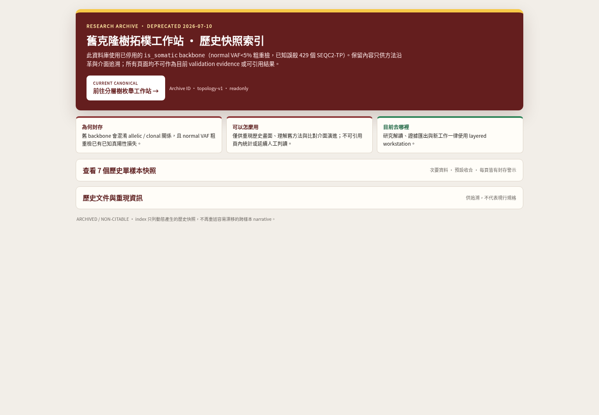
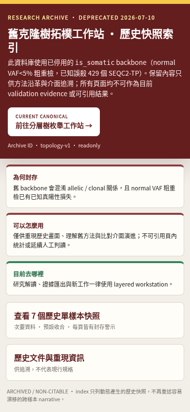
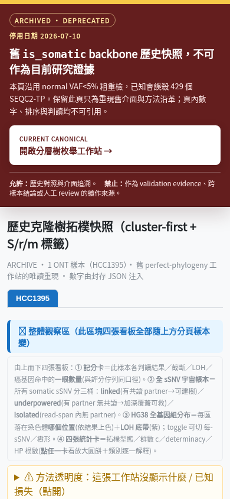

<!--
建立時間：2026-07-10
目標：把 topology_workstation 安全降為唯讀歷史封存，並以 Chromium 驗證 direct-entry、桌面與手機介面。
處理範圍：topology index + 7 個 sample HTML；不驗證舊 backbone 的科學有效性，不修改 layered generators。
關聯檔案：InterSubMod/docs/methodology/_assets/20260627_subclone_4axis_teaching/scripts/build_topology_workstation.py；InterSubMod/docs/methodology/_assets/20260627_subclone_4axis_teaching/scripts/build_per_sample_workstation.py
-->

# Topology 舊工作站封存介面視覺稽核

用 SCQA：舊 topology index 已有停用訊息，但 direct sample 可繞過警示，且人工判讀會寫入未分樣本／版本的瀏覽器儲存空間；因此將整套介面改為高辨識、不可引用、唯讀的研究檔案館，並把 canonical layered 工作站設為唯一主要操作。

> Scope：7/7 topology sample + archive index，1440×1000 與 390×844；屬介面完整驗證，不代表舊研究數值重新取得科學效度。

## 稽核結果

1. **Archive index — healthy**：首屏只說明封存原因、允許／禁止用途與 canonical 去向；舊樣本表和文件預設收合，不再重述易漂移的跨樣本結論。
2. **Direct sample entry — healthy**：7/7 sample 即使直接開啟，也先看到 `ARCHIVED / DEPRECATED`、舊 `is_somatic` backbone、不可引用與 layered 連結。
3. **歷史內容 — healthy with limits**：舊統計、篩選與 region 檢視保留；人工 review、browser storage 與判讀 export 已完全停用。
4. **Responsive — healthy**：7/7 sample 與 index 在手機均為 `bodyScrollWidth=documentScrollWidth=390`，無 body-level 水平溢出；寬表與舊密集圖只在自身容器內捲動。
5. **Interaction / runtime — healthy**：全 16 份 layered+topology 文件、32 個 viewport run 共 365/365 checks 通過；console/page/request errors 皆為 0。

## 視覺證據

### Archive index · desktop



### Direct sample · desktop


### Archive index · mobile



### Direct sample · mobile



## 輸入、命令與輸出

輸入：

- `InterSubMod/docs/methodology/_assets/20260627_subclone_4axis_teaching/data/`
- `/big7_disk/liaoyoyo2001/big7_disk_output/multisample_subclone/{sample}/`
- `InterSubMod/docs/methodology/_assets/20260627_subclone_4axis_teaching/scripts/build_topology_workstation.py`
- `InterSubMod/docs/methodology/_assets/20260627_subclone_4axis_teaching/scripts/build_per_sample_workstation.py`

重生命令：

```bash
python3 /big7_disk/liaoyoyo2001/InterSubMod/docs/methodology/_assets/20260627_subclone_4axis_teaching/scripts/build_per_sample_workstation.py
```

實際輸出：

```text
[OK] HCC1395 / COLO829 / H1437 / H2009 / HCC1395_DORADO / HCC1937 / HCC1954
[OK] index.html
完成：8 檔，合計 76.5 MB；全部 ok=True
```

輸出位置：`InterSubMod/docs/methodology/_assets/topology_workstation/`

驗證命令：

```bash
python3 -m py_compile \
  docs/methodology/_assets/20260627_subclone_4axis_teaching/scripts/build_topology_workstation.py \
  docs/methodology/_assets/20260627_subclone_4axis_teaching/scripts/build_per_sample_workstation.py

node /tmp/check_topology_inline_scripts.js

python3 docs/methodology/_assets/20260627_subclone_4axis_teaching/scripts/validate_workstation_ui.py --all
```

驗證結果：

| Gate | 實際結果 |
|---|---:|
| Python compile | exit 0 |
| Inline JavaScript parse | 8 HTML、14 scripts、0 error |
| Full Chromium UI | 16 documents、32 runs、365/365 pass |
| Topology archive banner | 7/7 desktop + 7/7 mobile |
| Canonical link | index + 7/7 sample 均存在 |
| 舊人工 review/storage/export | 0 個可用入口、0 個 `localStorage` reference |
| Mobile body overflow | 0 px（390/390） |
| `git diff --check` | exit 0 |

## 證據限制

本輪確認實際 Chromium 畫面、DOM、鍵盤 region selection、手機 detail 導引、連結、JavaScript runtime 與 body overflow；沒有宣稱完整 WCAG compliance，也沒有用 screen reader 或真實低效能手機做長時間操作測試。封存頁內的歷史數字仍不可引用。
