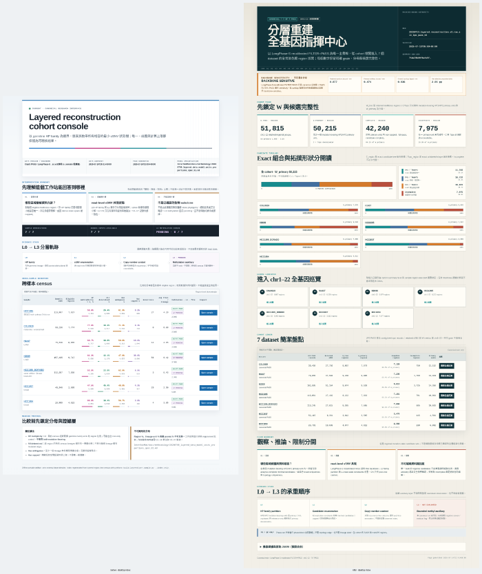
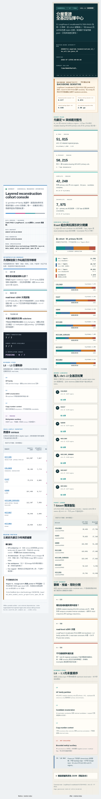
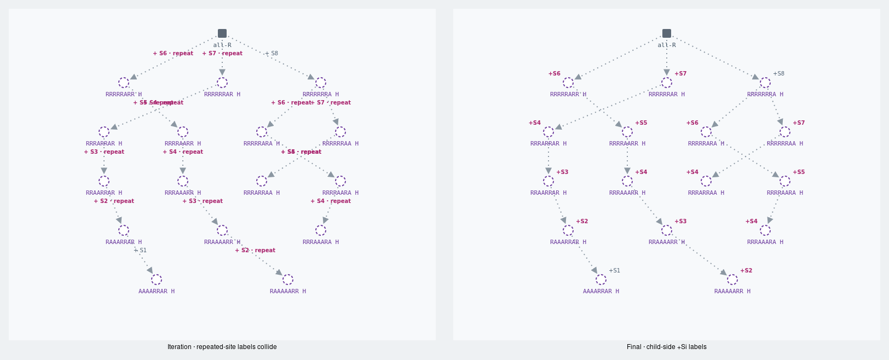
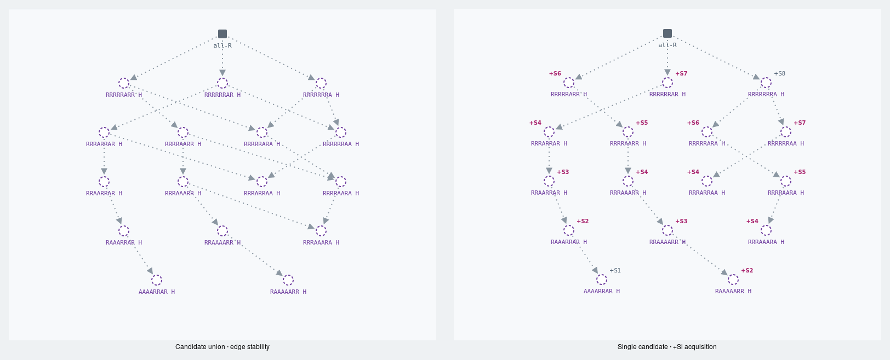
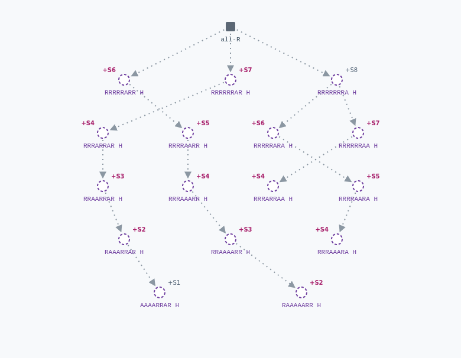
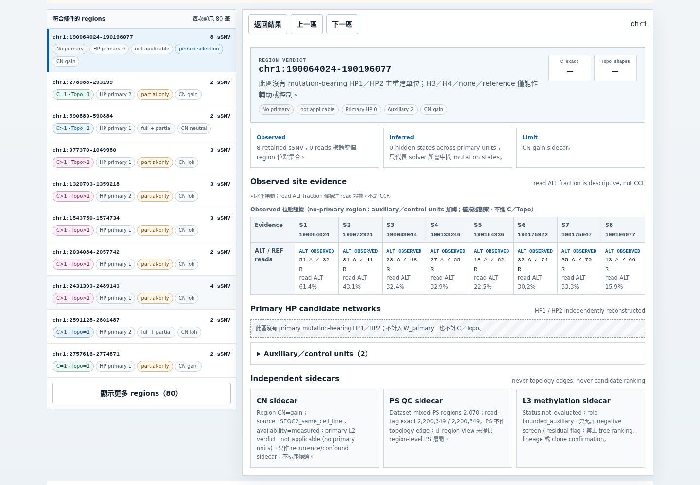

<!--
建立時間: 2026-07-14 Asia/Taipei
目標: 記錄 canonical v5 layered workstation 重構後的全頁資料、語意、視覺、互動與可及性驗收
處理範圍: index + 7 dataset pages；chr1-22；1440x1000 / 390x844 / 320x720；本機 Chromium / Playwright
關聯檔案:
  - InterSubMod/docs/methodology/_assets/layered_workstation/index.html
  - InterSubMod/docs/methodology/_assets/workstation_visual_audit/20260714_layered_workstation_after/metrics.json
  - InterSubMod/research/20260714_layered_workstation_redesign/implementation-notes.md
task_type: B_comprehensive_validation
partial: false
status: validated
-->

# 分層工作站最終視覺與互動稽核

用 SCQA（Situation → Complication → Question → Answer）：舊工作站的資料版本、clone 語意、網路標籤與手機閱讀路徑已不適合 canonical v5；本輪以 fail-closed generator 重建 8 頁，再用 source red-team、Claude Code 與三種 viewport 的 Chromium QA 反覆質疑。最終 frozen artifact 在 24 個 page/viewport contexts 通過 669/669 gates，另一次 16-document smoke 通過 365/365 checks。

**TL;DR：index + 7 dataset pages 已完成全基因重構與 final QA；P0=0、renderer P1=0，唯一保留限制是 upstream 尚未提供 region-level mixed-PS membership（影響：高，信心：高）。**

## 1. 最終判定

| Gate | 結果 | 實際證據 |
|---|---|---|
| Canonical custody | PASS | summary SHA-256 `71da78b69f8afe5fb8e618179ab7b38a6940fdb17be6282f99a6ec4b720e5de7`；7/7 build + 7/7 verify |
| 全基因範圍 | PASS | 7 datasets / 6 biological samples；每頁 chr1–22；22 chromosome buttons |
| C／Topo／complete 語意 | PASS | 11,582 / 10,737 / 19,921 / 7,975 四類與 machine summary 一致；impossible=0 |
| Primary／auxiliary | PASS | HP1/HP2 primary 與 H3/H4/none/reference control 分層；no-primary 不進 C/Topo |
| Network 說明 | PASS | union 與 exact candidate 分工；方向、edge stability、hidden state、recurrence 均可見且可讀 |
| Raw JSON | PASS | index 9、sample 4；全部只在 default-collapsed drawer，初始可見數 0 |
| Desktop/mobile/narrow | PASS | 1440×1000、390×844、320×720；body overflow=0；局部 wide content 可鍵盤捲動 |
| Keyboard/history/deep link | PASS | focus indicator、skip link、Back/Forward、URL hash、Prev/Next、copy link 全通過 |
| Frozen source | PASS | 稽核前後 8 HTML hash changes=`[]` |

## 2. Canonical 數據與主張邊界

最終頁面呈現的 cohort scope：

| Metric | Canonical v5 |
|---|---:|
| Tree input records | 582,820 |
| Autosomal biallelic sSNV | 469,849 |
| Retained sSNV | 194,149 |
| W_tree | 51,815 |
| W_primary | 50,215 |
| No-primary regions | 1,600 |
| Complete / incomplete | 42,240 / 7,975 |
| Primary units | 72,994 |
| Full + partial / partial-only primary units | 28,322 / 44,672 |
| Mixed-PS regions | 5,623 |

頁面只把資料解釋為「region-level mutation-state candidate sets」。Read ALT fraction 是描述性證據，不是 CCF；候選樹不是已確認的 clone、cell lineage 或真實全腫瘤 phylogeny。CN 是 post-tree sidecar；L3 為 `not_evaluated / bounded_auxiliary`；ClairS `FILTER=PASS` 只作 backbone sensitivity。

## 3. 介面與資訊架構變化

Index 由舊版的摘要表重構為：authority / verification → backbone sensitivity → W funnel → exact vs topology composition → chr1–22 dataset launchers → cohort table → observed/inferred/limit → L0–L3 boundary。

每個 dataset page 以 scope/status → sensitivity → dataset funnel → chr1–22 overview → independent filters → region verdict → observed evidence → primary HP networks → sidecars/raw drawer 排列。初始 DOM 只放 80 rows；detail 依選定 chromosome chunk 解碼。

## 4. Network 視覺收斂

視覺稽核曾在 H2009 八位點案例發現長 `repeated-site` edge label 碰撞。最終版將工作拆開：

- Candidate union：只回答 edge presence/stability；不堆疊可見 `+S_i`，但 accessible adjacency 仍逐邊保留 parent→child、status 與 acquisition。
- Single candidate：顯示每條 edge 的 `+S_i`；label 放在 child node 外側。
- Recurrence：洋紅粗體 label + 可見 note + accessible repeated-acquisition description，不只靠顏色。

最終 H2009 representative 的 union 17 個 text nodes、exact 33 個 text nodes；SVG `getBBox()` pairwise overlap 均為 0。

## 5. 特殊案例回歸

### H2009 recurrence + incomplete

`#ftopo=incomplete` + `#fsignal=recurrence` 精確得到 4 區：

1. `chr8:79992384-80149786`
2. `chr9:275701-337149`
3. `chr13:93837736-93888639`
4. `chr15:31733893-31800487`

四區均維持 incomplete，joint C/Topo 顯示 unavailable；recurrence 只作 candidate/region facet，不覆寫完整性。

### HCC1395_DORADO no-primary

`chr1:190064024-190196077` 顯示 primary=0、auxiliary=2、C/Topo=`—/—`。Observed evidence caption 明示是 auxiliary/control aggregate，不能誤稱 primary evidence。

## 6. Step → Verify 與實跑結果

### 6.1 Canonical build

- **輸入**：`InterSubMod/research/20260710_layered_reconstruction_v2/current_layered_topology_v3_raw_all_v1.json` 與 canonical v5 七份 region-view。
- **命令**：`python3 InterSubMod/docs/methodology/_assets/20260627_subclone_4axis_teaching/scripts/build_layered_per_sample.py`，再加 `--index-only` 驗證。
- **輸出**：`InterSubMod/docs/methodology/_assets/layered_workstation/index.html` + 7 sample HTML。
- **實際片段**：`7/7 BUILT hash-bound page`；`7/7 VERIFIED hash-bound page`；兩命令 exit 0。

### 6.2 Final visual/interaction audit

- **輸入**：上述 frozen 8 HTML。
- **命令**：`python3 InterSubMod/docs/methodology/_assets/workstation_visual_audit/20260714_layered_workstation_after/capture_layered_workstation_after.py`。
- **輸出**：`metrics.json` + `screenshots/01_...png` 至 `53_...png`。
- **實際片段**：Chromium `147.0.7727.15`；8 pages；24 page/viewports；53 screenshots；669/669 PASS；fatal errors 0；source hash changes `[]`。

### 6.3 Independent all-document smoke

- **輸入**：current layered + archived topology，共 16 documents。
- **命令**：`python3 InterSubMod/docs/methodology/_assets/20260627_subclone_4axis_teaching/scripts/validate_workstation_ui.py --all --screenshot-mode off`。
- **輸出**：terminal JSON。
- **實際片段**：32 page runs；365/365 PASS；0 failing coordinates；exit 0。

## 7. Frozen identities

| Artifact | SHA-256 |
|---|---|
| Renderer `build_layered_workstation_v5.py` | `ea40a81bd07199204b2732b21322bbfcebef51fab7f1f2e85ec7494b2b6edc8a` |
| Driver `build_layered_per_sample.py` | `e71885d903d6494496971d4570b5f33f49a7999bc9cb04f3f7eec264cebee727` |
| `layered_workstation/index.html` | `16877a349b9a7bbc6c5fcef55ccee7e736c56a5cae9591dcdb88221ca3c74f7a` |
| Final QA `metrics.json` | `2d7a9592a5703283b8e48ab94810e56ef15b0f347a19ae0c7b7b2f2d2a0a8a54` |
| QA runner | `81618677decde2d5a88f37280236ade55b4f76c54a809937b4579f9cb17f3d19` |

## 8. 保留限制

1. Canonical payload 只有 aggregate mixed-PS=5,623，沒有 region-level PS membership；因此頁面誠實不提供 PS filter，也不產生 PS-derived edge。這是 upstream schema gap，不由 renderer 猜測。
2. Sample HTML 為 14–50 MiB；最慢 H2009 `file://` initial load 為 2.55 秒。現行 22 chunks + lightweight index 已避免一次把所有 network 建進 DOM，但若要更小檔案需改成外部分片或壓縮封裝，會改變單檔離線契約。
3. QA 驗證 DOM、keyboard、Chromium accessibility contract；未宣稱已由 NVDA／VoiceOver／TalkBack 實機朗讀。

**最終結論**：此版本可作 canonical v5 的離線全基因觀察工作站；資料來源、候選完整性、C/Topo、primary/auxiliary、network edge scope、sensitivity 與限制均已在同一閱讀路徑中可追溯。
