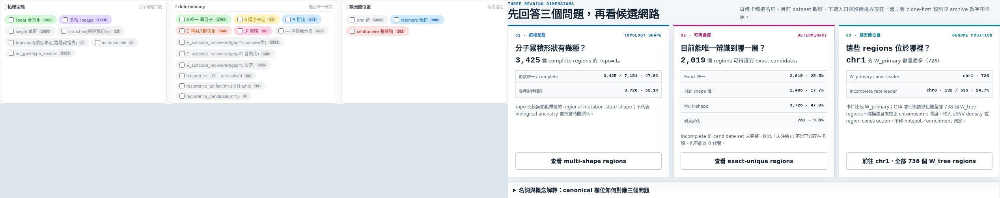
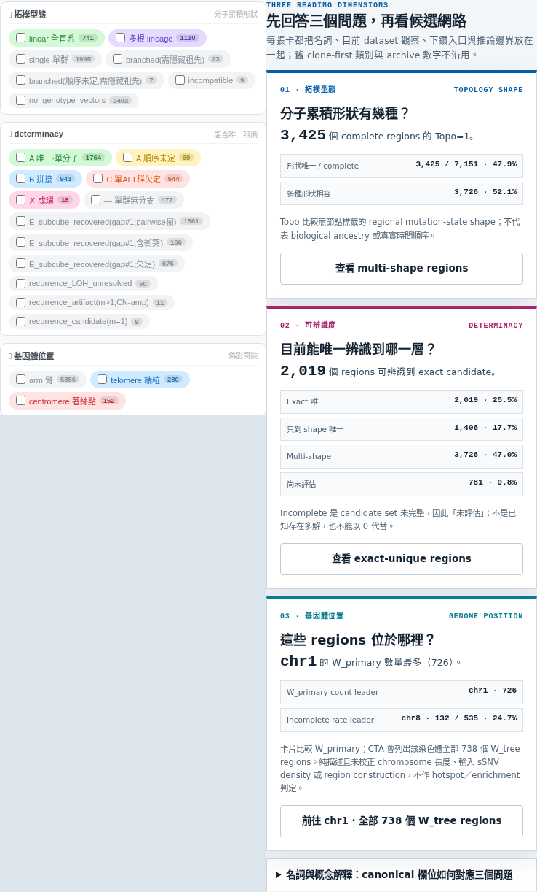
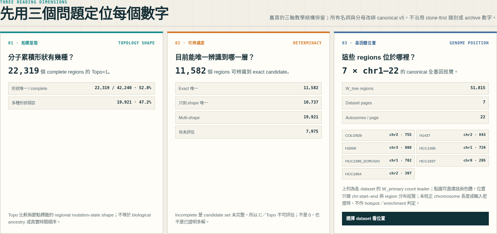
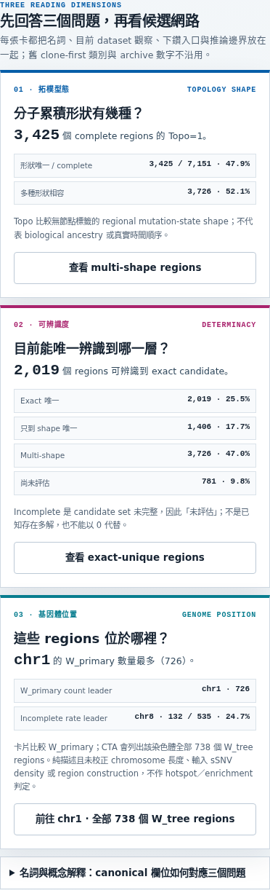
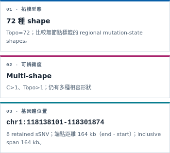

<!--
建立時間: 2026-07-15 Asia/Taipei
目標: 驗證 layered workstation 的拓樸型態、可辨識度與基因體位置三維是否正確、清楚且跨 viewport 可用
處理範圍: index + 7 canonical v5 sample pages；chr1-22；1440/768/390/320 Chromium；Task B comprehensive validation
關聯檔案:
  - InterSubMod/docs/methodology/_assets/layered_workstation/index.html
  - InterSubMod/docs/methodology/_assets/20260627_subclone_4axis_teaching/scripts/build_layered_workstation_v5.py
  - InterSubMod/docs/methodology/_assets/20260627_subclone_4axis_teaching/scripts/build_layered_per_sample.py
  - InterSubMod/research/20260715_layered_workstation_concept_dimensions/implementation-notes.md
partial: false
-->

# 三維概念改版後視覺稽核

> **結論：PASS — 三維概念已從 archived clone-first schema 重新綁定 canonical v5，8 頁與四個 viewport 沒有資料、互動、overflow 或 runtime regression。**（影響：中，信心：高）

## SCQA

- **Situation**：舊 HCC1395 頁可快速看見「拓樸／determinacy／位置」三個 facet，但其 clone-first 分類與 archive 數字已停用。
- **Complication**：current v5 雖有正確 C／Topo 與 chr1–22，全頁的概念定義分散；手機需先越過完整 chromosome grid。
- **Question**：如何保留三軸教學優點，又不復活舊 ontology 或誤稱 hotspot／ancestry？
- **Answer**：在 index、sample overview、region row、region detail 四層建立同一套 canonical 三維讀法，並以 full-scope Chromium、Claude Code 與 hash-bound rebuild 驗證。

## 同畫面比較

### Desktop · 1440×1000



左：舊頁三 facet，只能作形式參考。右：current HCC1395 以實際 canonical 數字回答三個問題，並提供可操作下鑽。

### Mobile · 390×844



新版依序堆疊，不改寫資訊順序；每卡保留數字、限制與 44px CTA。

## Canonical 三維 mapping

| 維度 | Current 定義 | 顯示規則 | 禁止誤讀 |
|---|---|---|---|
| 拓樸型態／分子累積形狀 | complete primary HP units 的 exact candidates，依 unlabeled mutation-state shape 分組；region `Topo` 為 unit shape counts 乘積 | `Topo=1` 顯示 shape unique；`Topo>1` 顯示 multi-shape；incomplete/no-primary 分別顯示尚未評估／不適用 | 不等於 biological clone、ancestry 或真實時間順序 |
| 可辨識度／determinacy | `C=1,Topo=1` exact 唯一；`C>1,Topo=1` 只到 shape 唯一；`C>1,Topo>1` multi-shape | incomplete 的 C／Topo 必須 `—`，不得用 0；no-primary 不進 W_primary | 不沿用舊 A/B/C determinacy 或 recurrence 混合 facet |
| 基因體位置 | canonical `chr:start-end`、`n_sSNV`、`endpoint_distance_bp=end-start`、`inclusive_span_bp=end-start+1` | sample 顯示 W_primary count leader + incomplete-rate leader；index 顯示 7 dataset leaders；CTA 落地 W_tree 全列並明示分母 | 未校正 chromosome 長度、sSNV density、region construction，不作 hotspot/enrichment 判定 |

## Step → Verify

| # | 步驟 | 健康度 | 具體驗證 | 輸出位置 |
|---:|---|---|---|---|
| 1 | Captured archived reference 與改版前 current，同 viewport 建立基準 | PASS | 4 runs / 8 screenshots；0 console/page error；0 body overflow | `../20260715_concept_dimensions_before/` |
| 2 | Canonical 欄位／7-sample 數值盤點 | PASS | 51,815 W_tree；50,215 W_primary；42,240 complete；7,975 incomplete；五類守恆；`C=1,Topo>1`=0 | `InterSubMod/research/20260710_layered_reconstruction_v2/current_layered_topology_v3_raw_all_v1.json` |
| 3 | Renderer + index 實作 | PASS | 三維 guide、glossary、CTA、region row、detail、7 dataset position leaders；JSON 仍預設收合 | generator scripts |
| 4 | Claude Code Sonnet 高推理唯讀審查 | PASS | P0=0、P1=0；P2 的位置層次、strip a11y、contrast 已處理 | 本報告「Claude Review」 |
| 5 | 重建 index + 7 pages | PASS | 7/7 `BUILT hash-bound page`；summary SHA `71da78…de7`；HCC1395 inline JS `node --check` rc=0 | `InterSubMod/docs/methodology/_assets/layered_workstation/` |
| 6 | 三維專項 Chromium QA | PASS | 8 pages × 4 viewports = 32 contexts；542/542 checks；0 errors | `metrics.json` + `screenshots/` |
| 7 | Layered + archived topology 通用回歸 | PASS | 16 documents × desktop/mobile；365/365 checks；0 failing coordinates | console receipt，記錄於 implementation notes |
| 8 | 完整 layered workstation visual QA | PASS | 8 pages × 3 viewports；53 screenshots；669/669 checks；source HTML hashes unchanged | `../20260715_concept_dimensions_full_after/metrics.json` |
| 9 | 人工視覺比較與 focused detail review | PASS | desktop/mobile 三卡、incomplete、no-primary、candidate network、320px full page 均已開圖檢視 | comparison PNGs + full-after screenshots |

## 介面結果

### Cohort index



- 先用三個問題定位分母，再進 cohort topology 與 7 dataset 全基因頁。
- 位置卡新增各 dataset 的 W_primary count leader，連結直接帶 `#chr=chrN`。
- 機器 JSON 維持 evidence drawer 預設收合，不干擾正文數字閱讀。

### Sample overview



- guide 已位於完整 22-chromosome grid 前。
- topology / determinacy CTA 會清除舊 evidence、signal、coordinate query 與舊 detail，避免 0-result 交集誤導。
- 位置 CTA 明示統計用 W_primary、結果列用該 chromosome 全部 W_tree。

### Region detail



- 先答 shape、identifiability、coordinate，再讀 observed/inferred/limit 與 candidate network。
- `end-start` 明稱端點距離；另顯示 inclusive span，已用全資料 invariant 驗證。
- incomplete 與 no-primary 都不再以「0 種」暗示結論。

## Chromium receipts

### 專項 runner

```text
Input:  InterSubMod/docs/methodology/_assets/layered_workstation/{index + 7 samples}.html
Command: python3 InterSubMod/docs/methodology/_assets/workstation_visual_audit/20260715_concept_dimensions_after/capture_concept_dimensions_after.py
Output: InterSubMod/docs/methodology/_assets/workstation_visual_audit/20260715_concept_dimensions_after/metrics.json
Actual: status=pass; checks=542/542; contexts=32; Chromium=147.0.7727.15
```

### Full visual runner

```text
Input:  InterSubMod/docs/methodology/_assets/layered_workstation/*.html
Command: python3 InterSubMod/docs/methodology/_assets/workstation_visual_audit/20260714_layered_workstation_after/capture_layered_workstation_after.py --input-dir .../layered_workstation --output-dir .../20260715_concept_dimensions_full_after --metrics .../metrics.json --before-metrics .../20260715_concept_dimensions_before/metrics.json
Output: InterSubMod/docs/methodology/_assets/workstation_visual_audit/20260715_concept_dimensions_full_after/
Actual: status=pass; checks=669/669; screenshots=53; page-viewports=24; source hashes unchanged
```

### Generic regression

```text
Input:  layered_workstation + topology_workstation，16 documents
Command: python3 InterSubMod/docs/methodology/_assets/20260627_subclone_4axis_teaching/scripts/validate_workstation_ui.py --all --screenshot-mode off
Output: stdout JSON receipt
Actual: status=pass; checks=365/365; page-runs=32; console/page/request failures=0
```

## Claude Review

- Claude Code command used Sonnet with high effort and read-only `Read/Grep/Glob` tools。
- Initial verdict：P0=0、P1=0。
- Material follow-ups addressed：
  - index 的位置維度新增 7 dataset per-chromosome leader；
  - topology strip 改為 decorative，visible legend 提供 screen-reader 文字；
  - index muted contrast 提升至 5.56:1；sample muted/white 為 6.08:1；
  - zero-count evidence option 動態標 count 並 disabled。
- Generated-artifact final gate：P0=0、P1=0、P2=0，最終 `PASS`；Claude 獨立重算 cohort totals 與 contrast 均吻合。唯一 cosmetic note 是 before-run schema 未提供 `before_comparison.source_hashes_unchanged`，current source-hash check 本身仍為 pass。

## 限制與結論邊界

- 本次沒有 screen-reader 實機與 200% zoom；keyboard、focus、semantic controls、reduced motion、contrast 與 44px targets 已自動／人工驗證。
- `chr:start-end` 是 current payload 的 canonical region coordinate；本頁不新增 gene、cytoband、telomere、centromere 或 external hotspot annotation。
- archived reference 只保留教學結構，不是 validation evidence。

**Final verdict: PASS（partial=false）。**
