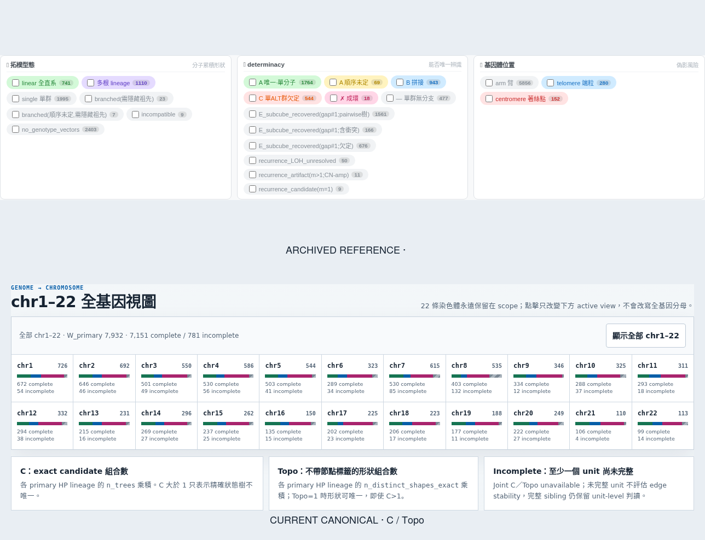
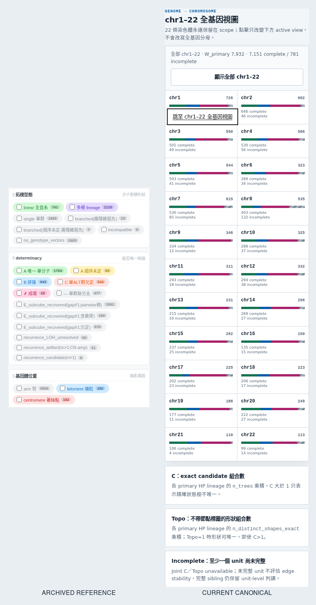

<!--
建立時間: 2026-07-15 Asia/Taipei
目標: 在修改 layered workstation 前，以相同 Chromium viewport 比較 archived reference 與 current canonical 的三維概念呈現
處理範圍: HCC1395 reference/current；desktop 1440×1000、mobile 390×844；視覺與 DOM 證據
build_branch: research/subclonal-reconstruction-202606
build_commit: 6067568
worktree: /big7_disk/liaoyoyo2001/InterSubMod
data_sources: docs/methodology/_assets/topology_workstation/HCC1395.html,docs/methodology/_assets/layered_workstation/HCC1395.html
驗證方式: Playwright Chromium locator screenshots + page/console/overflow receipts
關聯檔案:
  - InterSubMod/research/20260715_layered_workstation_concept_dimensions/pre-decision-audit.md
  - InterSubMod/docs/methodology/_assets/workstation_visual_audit/20260715_concept_dimensions_before/metrics.json
-->

# 三維概念改版前視覺稽核

用 SCQA：**舊頁三個問題很容易被看到，但資料與 ontology 已退役；current 頁的 canonical C／Topo 與 chr1–22 都正確，卻沒有把「形狀、可辨識度、位置」組成同一個閱讀入口，手機更要先越過整張 chromosome grid 才看到定義。**

> **整體判定：需改版，非資料錯誤。** 保留 current canonical 計算與全基因視圖；新增三維導讀、資料觀察與 region-level 三維摘要。

## Audit scope

- **Surface**: archived `topology_workstation/HCC1395.html` 與 current canonical `layered_workstation/HCC1395.html`
- **User goal**: 先理解三個概念，再用數字、染色體與 region detail 驗證。
- **Browser**: Chromium 147.0.7727.15 via Playwright。
- **Evidence limit**: 舊頁只作資訊形式參考；其數字、分類與科學判讀不可引用。

## 同畫面比較

## Numbered steps

### 1. Archived reference 的三個分面 — 教學入口清楚，科學語意退役

**Health: 結構可參考／內容不可沿用。**

- Strength：拓樸型態、determinacy、基因體位置並排，且各自可直接勾選，讀者一眼知道頁面要回答哪三個問題。
- UX risk：determinacy 類別過多、灰色 chips 密集；mobile 需要長距離掃讀，類別間層級不穩定。
- Scientific risk：`single/linear/branched/star`、A/B/C、arm/telomere/centromere 與 archive 數字不是 canonical v5 contract；直接移植會造成錯誤。
- Accessibility risk：emoji 在本機 Chromium 呈現為空白方框；checkbox 與文字雖可讀，但沒有 current scope 邊界。

### 2. Current chr1–22 與 C／Topo 定義 — canonical 正確，三個問題分散

**Health: 資料健康／理解入口不足。**

- Strength：22 條染色體完整保留；complete/incomplete 與 C/Topo 定義正確；無 body overflow。
- UX risk：`C`、`Topo`、`Incomplete` 是資料欄位定義，不是讀者問題；「可辨識到哪一層」沒有被說成明確階梯。
- UX risk：位置只有 chromosome button 與搜尋欄；沒有 sample-level 位置觀察，也沒有明說 coordinate/span 在 region detail 的角色。
- Responsive risk：390px 下 chromosome grid 高約 1,496px，三張定義卡位於其後；核心名詞不是 mobile-first disclosure。

### 3. Current filters — 功能存在，但沒有與概念導讀互相連結

**Health: 控制可用／資訊氣味不足。**

- Strength：可用 topology class、evidence、獨立 facet 與座標 overlap 搜尋；所有控制可 keyboard 使用。
- UX risk：`C / Topo 狀態` 對初次讀者仍需先理解五個狀態；目前沒有從「形狀」「可辨識度」「位置」卡片一鍵帶入篩選。
- Accessibility limit：本輪從 DOM／keyboard 與 screenshot 判斷風險，不宣稱完整 WCAG 或 screen-reader 實機通過。

## Highest-impact changes

1. 在 chromosome grid **之前**放三維導讀，讓 desktop/mobile 都先回答三個問題。
2. 每張卡包含：目前 sample 觀察、如何讀、不能推論什麼、可操作的下鑽入口。
3. Region detail 固定顯示三維摘要：shape 數、identifiability layer、canonical coordinate／端點距離。
4. 位置觀察只能是描述統計，明示未校正 chromosome 長度、sSNV density 或 region construction；不可叫 hotspot/enrichment。
5. 保留全基因視圖；原始 JSON 仍只放預設收合的 evidence drawer。

## Capture receipt

- **Input**: `InterSubMod/docs/methodology/_assets/topology_workstation/HCC1395.html`、`InterSubMod/docs/methodology/_assets/layered_workstation/HCC1395.html`
- **Command**: `python3 InterSubMod/docs/methodology/_assets/workstation_visual_audit/20260715_concept_dimensions_before/capture_concept_dimensions_before.py`
- **Output**: `InterSubMod/docs/methodology/_assets/workstation_visual_audit/20260715_concept_dimensions_before/screenshots/`、`metrics.json`、兩張 comparison PNG。
- **Observed**: 4 page/viewport runs；8 accepted screenshots；page errors 0；console errors 0；body overflow 0。
