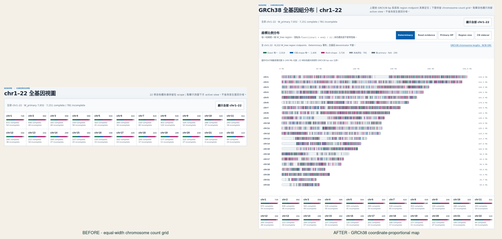
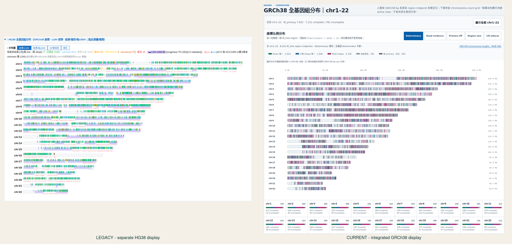
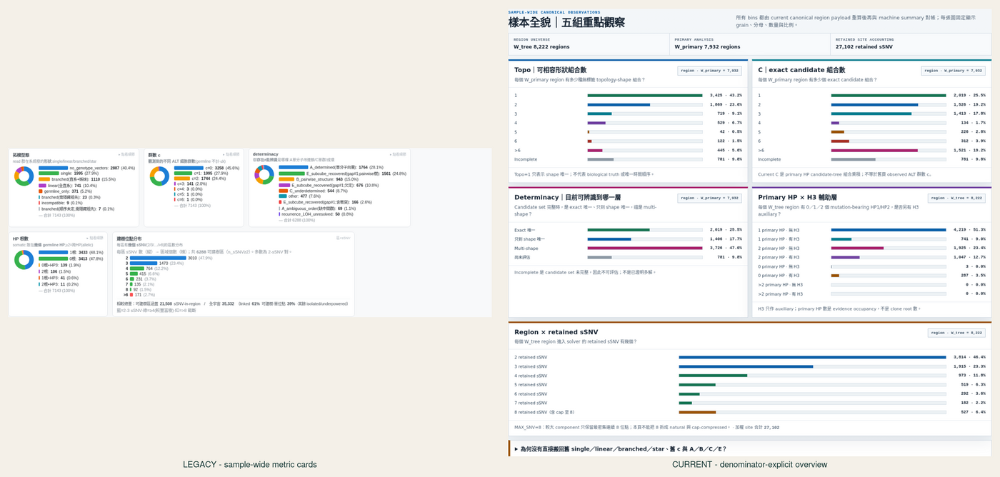
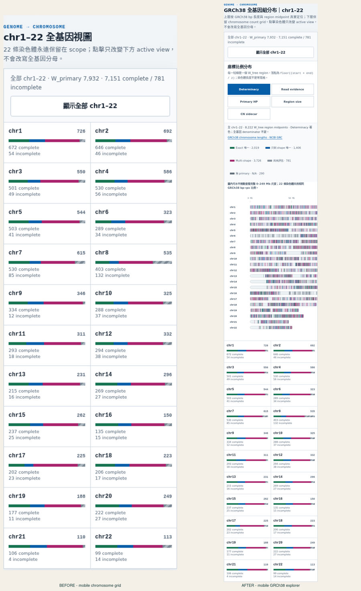

<!--
建立時間: 2026-07-15 Asia/Taipei
目標: 驗證 layered workstation 的 GRCh38 全基因分布與樣本全貌指標已正確恢復、分母清楚且跨 viewport 可用
處理範圍: index + 7 canonical v5 sample pages；chr1-22；1440/768/390/320 Chromium；Task B comprehensive validation
關聯檔案:
  - InterSubMod/docs/methodology/_assets/layered_workstation/index.html
  - InterSubMod/docs/methodology/_assets/20260627_subclone_4axis_teaching/scripts/build_layered_workstation_v5.py
  - InterSubMod/docs/methodology/_assets/20260627_subclone_4axis_teaching/scripts/build_layered_per_sample.py
  - InterSubMod/research/20260715_layered_workstation_sample_overview/implementation-notes.md
  - InterSubMod/research/20260715_layered_workstation_sample_overview/claude_code_postimplementation_review_result.md
task_type: B_comprehensive_validation
partial: false
status: validated
-->

# GRCh38 全基因分布與樣本全貌視覺稽核

用 SCQA（Situation → Complication → Question → Answer）：current v5 的資料契約正確，但原頁只有等寬 chromosome count grid，沒有按 GRCh38 座標落點；舊頁雖有 ideogram 與多組分布圖，卻綁定已淘汰的 7,143 / 6,288 / 35,332 universe。這次保留舊頁的「先看全貌、再下鑽」優點，全部數字改由 canonical v5 重算，並以 fail-closed build、Claude Code 與兩套 Chromium 稽核驗證。

> **TL;DR：PASS — 7 個 dataset 現在都有真正按 GRCh38 長度與 region midpoint 定位的 chr1–22 圖、5 種全基因著色模式與 5 組分母明示的樣本觀察；32/32 四 viewport 視覺稽核及 538/538 跨工作站回歸均通過。**（影響：高，信心：高）

## 1. 問題根因與修正

| 原問題 | 根因 | 現在的處理 |
|---|---|---|
| `chr1–22 全基因視圖` 沒有 GRCh38 分布 | current renderer 只有 22 格等寬 count matrix，DOM 中沒有 coordinate SVG | 新增 22-row coordinate-proportional ideogram；每個 W_tree region 以 `floor((start+end)/2)` 落一個 mark |
| 舊 HCC1395 圖表看似完整但數字不能直接搬 | 舊頁使用 retired clone-first / `is_somatic` universe，與 canonical v5 分母、grain 不同 | 五面板全部由 current payload 重算；build 時逐面板閉合，禁止靜默沿用 archive count |
| `single/linear/branched/star` 與 A/B/C/E 沒出現在新版 | current `Topo_region` 與舊 morphology 不是相同 grain；stored display trees 也非 exhaustive producer summary | 不製造假 mapping；在 closed explanation drawer 說明 retired vocabulary 與未來恢復 gate |
| JSON 連結干擾主數字閱讀 | provenance 與主要觀察混在同一層 | JSON 保留可追溯性，但全部放進預設收合的 evidence drawer |

## 2. 改版前後同畫面比較

### Desktop：原 current grid → 真正 GRCh38 座標圖



左圖只能回答 chromosome count；右圖同時保留 count grid，並新增依 [NCBI Genome Reference Consortium GRCh38 chromosome lengths](https://www.ncbi.nlm.nih.gov/grc/human/data?asm=GRCh38) 縮放的座標圖。chr1–22 共用相同 bp→px 比例，不再把不同染色體畫成等寬。

### Legacy HG38 形式 → current canonical 整合



新版沿用舊頁容易理解的 22-row閱讀方式，但以 current W_tree index 即時生成；不再依賴另一份可能缺失而靜默空白的 `ideogram_data.json`。

### Legacy 指標卡 → current denominator-explicit 五面板



新版以 horizontal zero-baseline bars 取代小型 donut；每張卡固定顯示 `region · W_primary = N` 或 `region · W_tree = N`，因此數量、比例與母體可在同一眼確認。

### Mobile 390px



全基因圖只在自己的 named local scroller 水平捲動；document body 維持 0 overflow。控制列在手機排列為可點擊的 44px targets，圖例不只靠顏色，也能點擊單獨顯示類別。

## 3. 五組 current canonical 樣本觀察

| 面板 | 問題 | Grain / denominator | HCC1395 current 數字 | 禁止誤讀 |
|---|---|---|---|---|
| Topo | 可相容形狀組合數 | region / W_primary=7,932 | 1: 3,425；2: 1,869；3: 719；4: 529；5: 42；6: 122；>6: 445；incomplete: 781 | Topo=1 只表示 shape 唯一，不是 confirmed clone 或時間順序 |
| C | exact candidate 組合數 | region / W_primary=7,932 | 1: 2,019；2: 1,526；3: 1,413；4: 134；5: 226；6: 312；>6: 1,521；incomplete: 781 | current `C` 不是舊 lowercase `c=ALT 細胞群數` |
| Determinacy | 目前可辨識到哪一層 | region / W_primary=7,932 | exact 2,019；shape-only 1,406；multi-shape 3,726；incomplete 781 | 不沿用舊 A/B/C/E，因其條件與 universe 已不同 |
| Primary HP × H3 | primary evidence occupancy 與 H3 auxiliary | region / W_tree=8,222 | 1HP無H3 4,219；1HP有H3 741；2HP無H3 1,925；2HP有H3 1,047；0HP 290 | HP 數不是 clone root 數；H3 是 auxiliary |
| Region × retained sSNV | solver region complexity | region / W_tree=8,222 | 2: 3,814；3: 1,915；4: 973；5: 519；6: 292；7: 182；8: 527 | MAX_SNV=8 是 cap boundary；本頁不能拆 natural-8 與 cap-compressed |

HCC1395 的 retained-site weighted sum 為 27,102，與 canonical sample record 完全閉合。上述舊分類不是被遺忘，而是經 grain audit 後刻意不硬映射；若要恢復 morphology family，producer 必須新增 exhaustive、versioned、可閉合 W_primary 的 summary。

## 4. 全基因圖五種模式

1. **Determinacy**：exact / shape-only / multi-shape / incomplete / no-primary。
2. **Read evidence**：full+partial / partial-only / unavailable。
3. **Primary HP**：0 / 1 / 2+ mutation-bearing primary HP。
4. **Region size**：2–3 / 4–7 / 8 retained sSNV。
5. **CN sidecar**：只呈現 region annotation；不是連續 copy-number segment track。

每種模式都維持 W_tree mark count 不變，只改變 mark 的分類著色。全基因位置是描述性分布，未校正可呼叫範圍、chromosome length enrichment、region construction 或 sSNV density，因此頁面明示不作 hotspot / enrichment 判定。

## 5. 7-dataset scope 與 closure

| Dataset | W_tree | W_primary | retained sSNV |
|---|---:|---:|---:|
| COLO829 | 8,007 | 7,878 | 27,756 |
| H1437 | 9,238 | 9,005 | 37,543 |
| H2009 | 9,674 | 9,538 | 51,164 |
| HCC1395 | 8,222 | 7,932 | 27,102 |
| HCC1395_DORADO | 8,385 | 7,665 | 27,615 |
| HCC1937 | 3,612 | 3,585 | 9,331 |
| HCC1954 | 4,677 | 4,612 | 13,638 |
| **合計** | **51,815** | **50,215** | **194,149** |

## 6. Step → Verify 最終稽核

| # | 步驟 | 健康度 | 實際驗證 | 輸出位置 |
|---:|---|---:|---|---|
| 1 | 舊頁與改版前 current 同 viewport baseline | PASS | 確認 current SVG=0；legacy mobile body 506px > viewport 390px | `/tmp/20260715_hg38_metric_baseline/` |
| 2 | 7/7 canonical contract audit | PASS | Topo/C/determinacy/HP×H3/n_sSNV 各自閉合；座標全部在 GRCh38 範圍 | renderer build output |
| 3 | HCC1395 pilot build | PASS | 8,222 marks；5 panels；5 modes；1440/390/320 body overflow=0 | `/tmp/HCC1395_overview_pilot.html` |
| 4 | Index + 7 pages 全量重建 | PASS | 7/7 `BUILT hash-bound page`；summary SHA `71da78…de7` | `InterSubMod/docs/methodology/_assets/layered_workstation/` |
| 5 | Claude Code pre/post review | PASS | pre P0 全處理；post `PASS`、P0=0、P1=0；兩個 P2 也已關閉 | `InterSubMod/research/20260715_layered_workstation_sample_overview/` |
| 6 | 專項 Chromium 四 viewport | PASS | 32/32 runs；28/28 renderer SHA；0 coordinate/identity/panel failures；0 overflow/errors | `metrics.json` + `screenshots/` |
| 7 | 常駐 layered + topology 回歸 | PASS | 16 documents × desktop/mobile；538/538 checks；14/14 layered sample runs 都測完五模式 | `/tmp/20260715_workstation_validator_all.json` |
| 8 | 改版前後 combined visual review | PASS | desktop/mobile 比對已人工檢查；無裁切、重疊、錯誤 fixed overlay 或壞 padding | `comparisons/` |

## 7. Chromium receipts

### 專項 7 dataset × 4 viewport audit

```text
Input:  InterSubMod/docs/methodology/_assets/layered_workstation/{index + 7 samples}.html
Command: python3 InterSubMod/docs/methodology/_assets/workstation_visual_audit/20260715_sample_overview_after/capture_sample_overview_after.py
Output: InterSubMod/docs/methodology/_assets/workstation_visual_audit/20260715_sample_overview_after/metrics.json + screenshots/
Actual: status=pass; page-runs=32/32; renderer-sha=28/28; body-overflow-max=0; runtime/network errors=0
```

數值誤差上限：mark x-coordinate `8.7245e-05 px`；chromosome length ratio `4.2613e-08`。兩者遠低於驗收閾值，顯示座標圖確實按 GRCh38 bp 比例生成。

### 常駐全文件 regression

```text
Input:  InterSubMod/docs/methodology/_assets/{layered_workstation,topology_workstation}/，共 16 documents
Command: python3 InterSubMod/docs/methodology/_assets/20260627_subclone_4axis_teaching/scripts/validate_workstation_ui.py --all
Output: /tmp/20260715_workstation_validator_all.json
Actual: Chromium=147.0.7727.15; page-runs=32; checks=538/538; failing-coordinates=[]; exit=0
```

## 8. Frozen identities

| Artifact | SHA-256 |
|---|---|
| Renderer | `7e01c0c321f5cba6d0107bc2fbc44dfe251c5a203a87c0e801255d914ecaea7b` |
| Driver | `eb0f16dd49edf5ae8d7e1f6cad7fde6fddcb4e1881e4d2c13a7ebdb4f5576554` |
| Persistent validator | `f1b031e72e27f165ad3541a1f9adf009871ca6858027b4ce63e1fbf74f00f674` |
| Index HTML | `f03bdd844f5d6469017d67099b370fb70247b331ffddfa7d7ac528526d70c9fa` |
| Audit runner | `ed36297c41f7aa9a88f78b7882d4ffac291b79d88499dee2db329d2372ca61c2` |
| Audit metrics | `e843a320a610aa9147b8de75875882080ea3dfa8c39019c8d314e8798ddd3c35` |

## 9. 保留限制

- current payload 沒有 exhaustive morphology-family summary，因此不報 `single/linear/branched/star` current count。
- MAX_SNV=8 bin 仍不能區分 natural-8 與 cap-compressed；UI 已明示。
- CN 是 region sidecar；L3 methyl 仍為 bounded auxiliary；candidate 是 regional mutation-state candidate，不是 confirmed cell clone / lineage。
- 本輪測試 Chromium DOM、keyboard、local scroll、focus、ARIA、44px target 與色彩以外的辨識方式；未宣稱已完成 NVDA / VoiceOver / TalkBack 實機朗讀。

**Final verdict：PASS（partial=false）。**
