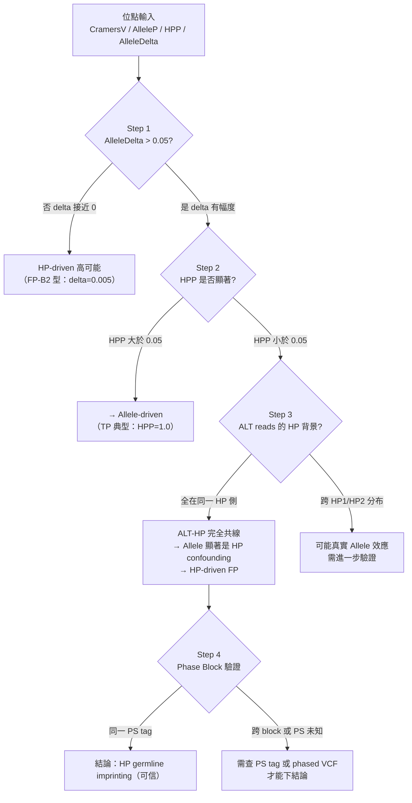

<!--
建立時間: 2026-03-17 00:00
更新時間: 2026-03-17 20:00 (v4.0：修正 PON 說明、新增 Phase Block 前提、Mermaid 推論框架、強化 Q&A 格式、明確技能目的、固定化腳本入口)
目標: 定義「甲基位點觀察報告生成」Skill 的完整規格，包含輸入規格、報告結構、AI 讀圖指引與驗證標準
處理範圍: HCC1395 系列位點觀察報告（含 IGV 截圖 + 甲基熱圖整合），適用 Paired / Tumor-Only 模式
關聯檔案:
  - docs/reports/validated/2026/03/20260315_subclone_phase4_casestudy_01.md
  - docs/references/manual/20260316_HP_LOH術語校正手冊_01.md
  - docs/references/manual/20260316_IGV自動截圖操作手冊_01.md
  - docs/references/manual/20260317_case_obs_report_FP_B1_範例_01.md
-->

# 甲基位點觀察報告生成技能 — v4.0 溯源驗證版

**版本**：v4.0
**建立日期**：2026-03-17
**適用範圍**：InterSubMod Phase 4 Case Study 及後續位點觀察報告

---

## 一、技能概述

本 Skill 生成**標準化甲基位點觀察報告**（`.md` 格式），整合以下三類輸入：
1. IGV PNG 截圖（視覺 alignment 觀察）
2. 甲基化熱圖（cluster heatmap / distance heatmap / methylartist）
3. 統計特徵表（來自 InterSubMod feature matrix）

### 核心使用目的

本 Skill 的分析成果最終服務於以下研究問題：

> **「甲基化分類方法是否有效、在哪些位點有效、在哪些位點出現誤判？」**

每份報告應清楚回答：
1. 此位點的甲基化訊號是否真正與 somatic variant 相關（而非 germline HP imprinting 或技術偽影）
2. InterSubMod 的 VerificationClass / CramersV 在此類位點的分類結果是否可信
3. 是否發現可修正分類方法的證據（特殊觀察 → 新規則候選）
4. 哪些觀察需要記錄在知識點整理（K#）以供後續規則提煉

### 三條核心設計原則

| 原則 | 說明 |
|------|------|
| **溯源可追蹤** | 所有位點必須清楚說明來自哪個樣本、哪個 BAM、經過哪些計算與篩選 |
| **比較建立基準** | 觀察需結合全局分布 + 同/異類對照才能確認是否特殊 |
| **觀察→結論→驗證閉環** | 每個結論對應可驗證的假說與驗證方法/結果 |

---

## 二、輸入規格

| 輸入欄位 | 類型 | 必填 | 說明 |
|----------|------|------|------|
| `sample_metadata` | YAML/文字 | ✅ | 樣本名、BAM 路徑、purity、模式（Paired/TO）、測序條件 |
| `pipeline_config` | 文字說明 | ✅ | 工具版本（ClairS, LongPhase-S, InterSubMod）+ 關鍵參數 |
| `filter_criteria` | 文字說明 | ✅ | 此批位點的篩選條件（VerificationClass / CramersV / NumReads 等門檻）|
| `locus_list` | TSV | ✅ | chr, pos, ref, alt, label(TP/FP), cramersv, filter_reason, benchmark |
| `feature_tsv` | TSV 路徑 | ✅ | feature matrix（AlleleP, HPP, AlleleDelta, VAF, HP0_ratio 等）|
| `population_stats_tsv` | TSV 路徑 | ⭕ | 全體 TP/FP 特徵分布的分位數統計（P25/P50/P75）|
| `similar_cases_tsv` | TSV 路徑 | ⭕ | 每個 case 的最相似同/異類對照組 |
| `igv_dir` | 目錄路徑 | ✅ | IGV PNG 截圖目錄（**必須使用相對路徑，確保 `` 可渲染**）|
| `methylation_assets_dir` | 目錄路徑 | ✅ | cluster / distance / methylartist 圖目錄 |
| `output_md_path` | 路徑 | ✅ | 輸出 .md 路徑 |

---

## 三、報告結構規範

### 第 0 節：研究溯源（整份報告只寫一次）

此節為**必讀前提**，確保報告可被獨立理解，不依賴上下文記憶。

```
#### 0.1 樣本資訊
  - 樣本名稱 / Tumor cell line
  - Tumor BAM 路徑 + 模式（Paired / Tumor-Only）
  - Normal BAM 路徑（若有）
  - 測序條件（5kHz / basecall model / 覆蓋度 / purity）

#### 0.2 計算流程（此批位點的產生方式）
  - Variant calling：工具名稱、版本、關鍵參數
    ⚠️ ClairS paired mode：使用 Normal BAM 對照過濾 germline【不使用 PON】
    ⚠️ ClairS-TO (tumor-only)：使用 PON（gnomAD / CoLoRSdb）過濾 germline noise
    （PON = Panel of Normals，僅用於 tumor-only 場景以替代正常對照）
  - Phasing：LongPhase-S 版本、haplotagging 策略（--tag-haplotag）
  - InterSubMod 分析：metric、視窗大小、PERMANOVA 設置
  - Benchmark：SEQC2 版本、TP/FP 判定方法（SNV-only benchmark 注意事項）

#### 0.3 此批位點篩選條件
  - VerificationClass = ?
  - CramersV > ?
  - NumReads ≥ ?
  - 其他前置過濾條件（如排除 HP_Ratio 極端值等）
  - 本批次包含 N 個 TP / M 個 FP

#### 0.4 資料狀態說明表（HP tag 色碼、Phase Block 前提）
```

**HP tag 色碼標準**（所有報告統一使用）：

| HP tag 值 | 顏色 | 含義 |
|-----------|------|------|
| HP=0 | 灰 | 無法相位的 read |
| HP=1 | 藍 | Germline haplotype 1（通常為 REF read） |
| HP=2 | 黃 | Germline haplotype 2（通常為 REF read） |
| HP=1-1 | 深藍 | HP1 背景 + 帶 ALT allele |
| HP=2-1 | 橙 | HP2 背景 + 帶 ALT allele |
| HP=3 | 紫 | ALT read 但 germline HP 背景未能唯一解析 |

> ⚠️ **Phase Block 重要前提（所有報告必讀）**
>
> LongPhase-S 的 HP tag 是在**各自獨立的 phase block 範圍內**建立的：
> - 同一 phase block 內：HP=1 對應同一親代染色體（可信）
> - **不同 phase block 之間：HP=1 未必來自同一親代**，親緣意義不確定
>
> 因此：
> - 「HP1 甲基化 ≠ HP2 甲基化」只有在確認 reads 屬於**同一 PS tag**（Phase Set）的情況下，才可解釋為 allelic methylation difference
> - HP-driven 結論若要升級為等位基因甲基差異解釋，需對照 `PS` tag 或 phased VCF 確認
> - 位於 phase block 邊界的位點，HP tag 可能混合多個 block，分析需特別謹慎

---

### 第 1 節：全局分布（視角定錨）

```markdown
### 全局特徵分布散點圖
  （嵌入圖片：全體 TP/FP 的 AlleleDelta vs CramersV 散點圖）
  
  - 說明本 case 在圖中的位置（座標與偏離程度）

### 快速參考表（TP/FP 分位數）
  | 指標 | TP P25 | TP P50 | TP P75 | FP P25 | FP P50 | FP P75 |
  | CramersV / AlleleDelta / VAF / HP0_ratio / NumReads |

### 本 case 全局定位說明
  - 每個關鍵指標：↑↑極高 / ↑偏高 / ≈正常 / ↓偏低 / ↓↓極低
```

---

### 每個 Case 結構（五層：前提卡 + A視覺 + B甲基 + C比較 + D/E驗證）

```markdown
## 案例 N：`{chr:pos}` {ref}>{alt} — [🟢TP / 🔴FP] — CramersV = {val}

### 前提卡（快覽）
  | 項目 | 內容 |
  | benchmark 狀態 | TP / FP + 原因 |
  | 相鄰 truth event | （若有）|
  | tumor ALT / depth | |
  | normal ALT / depth | |
  | target ALT 的 HP | |
  | Phase block 狀態 | 同一 PS / 跨 block / 未知 |

### 數值摘要表（含全局分位數對照欄）
  | 指標 | 本 case 值 | 說明 | TP P50 參考 | 偏差方向 |

### [A] IGV 截圖分析
  - 嵌入圖片（必須使用相對路徑）：
    
  - 讀圖提示：Track 順序、HP 著色說明、相鄰異常位點
  - ⚠️ Phase block 注意（若位點在 block 邊界）
  - AI 5 維初篩表：
    | 維度 | AI 初判 | 信心度 | 觀察依據 |

### [B] 甲基化圖組分析
  （每張圖必須嵌入，不得只寫路徑）
  -   → AI 觀察（HP strip vs Allele strip 分層）
  -  → AI 觀察（block 結構與邊界 label）
  -     → AI 觀察（HP/ALT 甲基差異，2kb 視窗整體性質）

### [C] 比較框架（特異性確認）
  #### C.1 全局定位表
  #### C.2 同類對照（最相似同 label case）
  #### C.3 差異對照（典型相反 label case）
  #### C.4 聚焦問題

  ##### 推論框架（Mermaid 流程圖）
  ```mermaid
  flowchart TD
      ...（依案例數值填入關鍵推論步驟）
  ```

  ##### [選擇題] Q1：驅動力/機制類問題
  | 選項 | 假說 | 驗證依據 | 若成立的意義 |
  > AI 初答：選（X）+ 推論步驟（對應 Mermaid）+ 引用統計 + 比較對照 case
  > 人工複核：___

  ##### [解釋題] Q2：數學分解/機制類問題
  （含數字推導，不只是文字描述）
  > AI 初答 + 人工複核

### [D] 觀察驗證
  | 驗證項目 | 資料來源 | 結果 |

### [E] 分層結論區
  #### E1. 觀察（視覺圖像描述）
  #### E2. 觀察驗證（對應統計數值）
  #### E3. 推論（機制解釋）
  #### E4. 待補驗（後續行動）
```

---

### 全報告尾端

```markdown
## 證據鏈 Mermaid（可選）
  展示所有案例的觀察→驗證→推論的流程圖

## 跨案例比較表
  | 位點 | 標籤 | CramersV | AlleleDelta | AlleleP | HPP | VAF | 驅動力 | 機制 |

## 這個分析要傳達的規則（知識點 K1, K2...）
  - 可修正分類方法的重點
  - 特殊觀察
  - 需要後續驗證的假說
```

---

## 四、AI 讀圖指引

### 4.1 IGV PNG 5 維讀圖

| 維度 | 判斷問題 | 可能值 |
|------|---------|--------|
| 1. ALT 成群 | ALT reads 是否在視覺上聚集於特定群？ | 清楚 / 中等 / 弱 / 否 |
| 2. Normal 同構 | Normal BAM 是否有相似的 alignment pattern？ | 是 / 否 / 部分 |
| 3. 相鄰異常柱 | SNV 位置旁是否有異常的 insertion/deletion 柱？ | 有 / 無 / 疑似 |
| 4. 驅動力 | 聚集由 allele / HP / 不明 何者解釋更佳？ | allele / HP / unclear |
| 5. Coverage 異常 | 覆蓋度或 alignment 是否異常？ | 有 / 無 |

### 4.2 甲基圖讀圖要點

**Cluster Heatmap**：
- HP strip 顏色是否比 Allele strip 更整齊地對應 cluster 分層？（HP 驅動 vs Allele 驅動）
- ALT reads 是否成群，還是散布於各 cluster？

**Distance Heatmap**：
- Block 對角結構的邊界對應 HP tag 還是 Allele label？
- Block 間距離（亮）vs Block 內距離（深）對比是否清晰？

**methylartist SVG**：
- HP1/HP2 分層 vs ALT/REF 分層哪個更明顯？
- ALT reads 是否跟隨某個 HP 背景（HP confounding 訊號）？

### 4.3 HP-driven vs Allele-driven 鑑別流程（Mermaid 模板）



### 4.4 聚焦問題格式規範

**選擇題（驅動力/機制類）**：

```markdown
##### Q1：[問題敘述]

| 選項 | 假說 | 驗證依據 | 若成立的意義 |
|------|------|---------|------------|
| (A) | 假說 A | 支持數值 | A 成立代表... |
| (B) | 假說 B | 支持數值 | B 成立代表... |
| (C) | 假說 C | 支持數值 | C 成立代表... |

> **AI 初答**：選（X）
> 推論步驟：1. [Step 1] ... 2. [Step 2] ...（對應 Mermaid 步驟）
> 引用數值：...（與對照 case 比較）
> **人工複核**：___
```

**解釋題（數學分解類）**：

```markdown
##### Q2：若[觀察現象]成立，機制是什麼？

**數學分解**：
ALT_mean = ... × ... = ...
REF_mean = ... × ... + ... × ... = ...
AlleleDelta = ALT_mean - REF_mean = ...（可由 HP 差異解釋）

> **AI 初答**：[機制說明] + [對照 case 驗證]
> **人工複核**：___
```

---

## 五、驗證標準（生成完成後必查）

| # | 項目 | 檢查點 |
|---|------|--------|
| 1 | 研究溯源完整 | 第 0 節：樣本資訊 + pipeline（含 PON 使用說明）+ 篩選條件 + **Phase Block 前提** |
| 2 | **圖片全部嵌入** | IGV PNG、cluster、distance、methylartist 全用 `` 嵌入，不得只寫路徑說明 |
| 3 | 全局分布含散點圖 | 第 1 節含至少一張散點圖 embed + 快速參考表（TP/FP 分位數）|
| 4 | 數值摘要表有對照欄 | 含「TP P50 參考」欄與偏差方向（↑↑/↑/≈/↓/↓↓）|
| 5 | 比較框架三層 | [C] 節：C.1 全局定位 + C.2 同類對照 + C.3 差異對照 |
| 6 | 聚焦問題含 Mermaid | C.4 節：Mermaid 推論圖 + 選擇題（表格格式）+ 解釋題（數學分解）|
| 7 | 驗證假說表必填 | [D] 假說表含：支持證據 + 反駁證據 + 驗證方法 + 驗證結果 |
| 8 | AI/人工欄清楚分離 | 人工複核欄不預填；AI 初判欄需填寫 |
| 9 | 分類方法評估 | [E3] 或 D.3 含：InterSubMod 對此位點的分類是否有效、可修正方向 |
| 10 | 知識點整理 | 尾端 K# 含此批次新發現的規則與可修正分類方法的重點 |

---

## 六、常見 FP Pattern 速查

| FP 類型 | 辨識指標 | 機制 | Phase Block 相關 |
|---------|---------|------|----------------|
| **HP-driven FP（高 delta 型）** | CramersV 高；HPP<0.05；AlleleDelta 0.03–0.08；ALT reads 全同一 HP 側 | HP1/HP2 甲基差異大，ALT-HP 共線造成 AlleleDelta 虛高 | 需驗證同一 phase block |
| **HP-driven FP（delta≈0 型）** | CramersV 高；HPP<0.05；AlleleDelta≈0；HP 均衡分布 | HP imprinting 但兩 HP 甲基差異小 | 較容易識別 |
| **Low VAF FP** | ALT reads < 5；HP=0 > 90% | 極低 VAF + repeat，allele PERMANOVA 無功效 | HP tag 幾乎無意義 |
| **高維假顯著 FP** | CramersV=0 但 LabelAlleleP 顯著；CpG > 100 | 高維 PERMANOVA Type I error inflation | 無 HP 相關 |
| **INDEL-adjacent FP** | SNV 緊鄰（±2bp）已知 sINDEL TP | SNV-only benchmark annotation gap | 無 HP 相關 |
| **MNP FP** | 所有 ALT reads 在相鄰位置有一致 mismatch | MNP 被 SNV caller 拆分呼叫 | 無 HP 相關 |

---

## 七、固定化產物與生成入口

| 類型 | 路徑 | 用途 |
|------|------|------|
| 生成腳本 | `scripts/analysis/generate_case_observation_report.py` | 自動接圖、預填數值欄位、產生分層結論骨架 |
| 範例報告 | `docs/references/manual/20260317_case_obs_report_FP_B1_範例_01.md` | 看實際輸出樣式 |

**建議命令**：

```bash
python3 scripts/analysis/generate_case_observation_report.py \
  --cases-tsv docs/reports/validated/2026/03/assets/20260316_subclone_phase4_igv_sessions/case_regions.tsv \
  --validation-tsv docs/reports/validated/2026/03/assets/20260316_igv_case_validation_01.tsv \
  --output-md docs/reports/validated/2026/03/assets/case_obs_report_scaffold.md
```

---

## 八、範例報告

**測試案例**：FP-B1 `chr7:52087777 A>T`（CramersV=1.000，HP-driven FP，Skill v4.0 格式）
**範例路徑**：`docs/references/manual/20260317_case_obs_report_FP_B1_範例_01.md`

---

## 附錄：特徵欄位說明

| 欄位 | 含義 |
|------|------|
| `CramersV` | Cramér's V 效應量（甲基-allele 關聯強度），0=無關聯，1=完全關聯 |
| `AlleleDelta` | PERMANOVA 距離空間 delta = `between_mean_dist(ALT,REF) − within_mean_dist(ALT+REF)`；**非** raw ALT_meth−REF_meth；在 ALT-HP 共線時可被 HP 甲基差異污染虛高 |
| `AlleleP` / `LabelAlleleP` | Allele PERMANOVA p-value（allele 標籤能否解釋甲基聚類）|
| `HPP` / `LabelHPP` | HP PERMANOVA p-value；**< 0.05 是 HP-driven FP 第一警示** |
| `DominantLabel` | `allele` 或 `hp`（哪個標籤更能解釋分層）|
| `HP0_ratio` | HP=0 reads 比例（越高=相位越差，repeat/segdup 疑似）|
| `VAF` | Variant Allele Frequency（ALT reads / total reads）|
| `PairwiseMedianDist` | Read-read BERNOULLI 距離矩陣中位數（全局異質性）|
| `NumReads` | 此 region 的 reads 總數 |
| `VerificationClass` | Noise / Weak / Strong / Subclone（甲基結構分類）|
