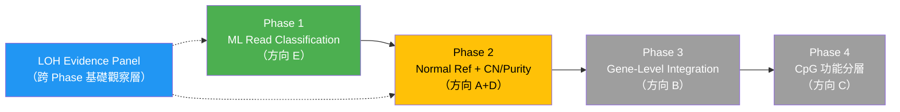
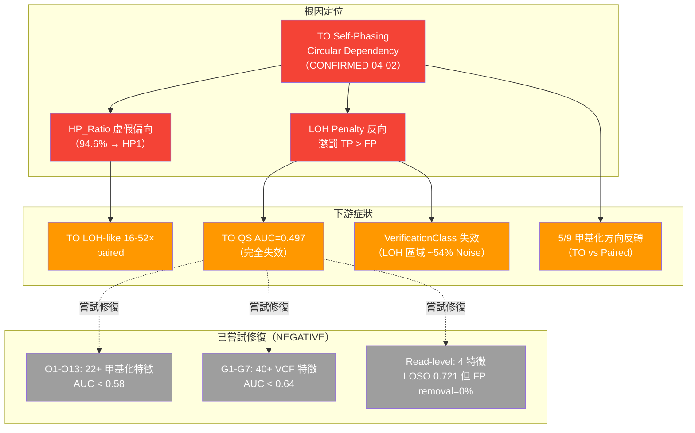
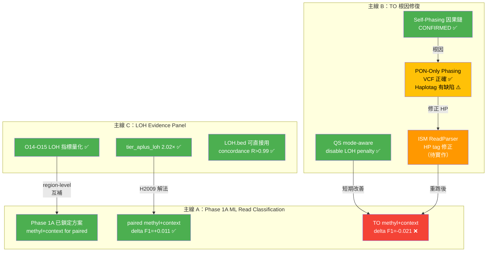
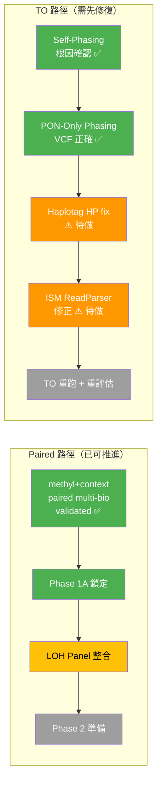

<!--
建立時間: 2026-04-03 
目標: 週報後至今（2026-03-11 ~ 2026-04-03）研究進度、推論鏈、策略架構的完整整理
處理範圍: O1-O15 系統性觀察、G1-G7 VCF 特徵、Read-level 研究、因果鏈驗證、PON-only phasing、QS 重設計、Phase 1A ML
關聯檔案:
  - docs/CURRENT_FOCUS.md
  - docs/experiments/INDEX.md
  - docs/architecture/20260327_InterSubMod研究願景定錨_01.md
-->

# InterSubMod 研究佈局與策略架構總覽

> **日期**: 2026-04-03  
> **涵蓋期間**: 2026-03-11（週報後）至 2026-04-03  
> **狀態**: 供討論確認

---

## 一、研究大架構：五目標定錨與四階段路線圖

### 1.1 InterSubMod 的研究定位

> InterSubMod 是「**可解釋 epigenetic evidence 整合框架**」，不是另一個 somatic caller。

### 1.2 五個研究目標

| # | 目標 | 說明 | 依賴 |
|---|------|------|------|
| **G1** | Per-CpG 甲基位點多標籤關聯性評分 | 每個 CpG 與 ALT/REF、HP1/HP2 的統計關聯 | — |
| **G2** | Clone 結構分析 | 單位點 sub-clone + 跨位點 clone 共演化 | G1 |
| **G3** | 二次打擊與事件順序推論 | 結合 LOH/CNV/HP 推論打擊順序 | G1, G2 |
| **G4** | TO Normal 資訊補強 | 無配對 normal 時估計 normal 背景 | — |
| **G5** | 整合 Evidence Panel 提升 F1 | 補充 caller，保留 TP、過濾 FP | G1-G4 |

### 1.3 四階段路線圖（已確認優先序）



**當前焦點**：Phase 1（ML Read Classification）+ LOH Evidence Panel

---

## 二、週報後研究時間線與推論鏈

### 2.1 時間線總覽

```
2026-03-11  週報完成（Phase 2 annotation 整合定案）
     │
     ├── 03-22  TO FP Provenance 分析
     ├── 03-23  TO Residual FP Deep-Dive
     ├── 03-24  方法學審查完成 + 研究方向收斂 + 全域分析報告
     │           ├── 突破方向確認：E → A+D → B → C
     │           ├── paired_persistent_final_fp 研究關閉
     │           └── H006 window=1000 理論 Rejected
     ├── 03-25  Phase 1A 正式啟動
     │           ├── Read training exporter 落地
     │           ├── Split manifest（discovery 70K + external 70K）
     │           ├── Round 1 benchmark → context-rich 可行
     │           └── Round 2 incremental → paired +0.011, TO 負增益
     ├── 03-27  研究願景五目標定錨
     ├── 03-28  Phase 1A Round 3 LOH feature test（NEGATIVE）
     │           └── LOH Evidence Panel Round 1-4 完成
     ├── 03-30  HP Integer Tag Bug 修正 + 全量重跑
     ├── 03-31  系統性觀察 O1-O10（82 圖表）
     │           ├── O11 Heterogeneity（NEGATIVE）
     │           ├── O12 LOH 場景區分（NEGATIVE）
     │           └── QS 失效根因定位（TO AUC=0.497）
     ├── 04-01  O13 跨區域甲基化（NEGATIVE）
     │           ├── SNV-甲基化 ASM 定量（POSITIVE）
     │           ├── TO Germline FP G1-G7（NO-GO）
     │           └── 文獻研究 smrest/CPEL
     ├── 04-02  Read-Level Germline FP（CONDITIONAL NO-GO）
     │           ├── O14-O15 LOH 區域全面量化
     │           ├── Self-Phasing 因果鏈 CONFIRMED
     │           └── QS mode-aware 修改（disable TO LOH penalty）
     └── 04-03  PON-Only Phasing 驗證
                 ├── LOH.bed Jaccard=1.0（不變）
                 ├── Somatic bias 17.3:1 → 消除
                 ├── N50 +99.7%（品質翻倍）
                 └── Haplotag HP 分配缺陷發現
```

### 2.2 核心推論鏈（因果關係圖）



---

## 三、關鍵發現總覽（按主題分類）

### 3.1 已關閉的研究方向（NEGATIVE / NO-GO）

| # | 方向 | 結論 | 證據量 | 置信度 |
|---|------|------|--------|--------|
| O1-O10 | 系統性觀察（甲基化 site-level） | **NEGATIVE** — TO 無單一特徵 AUC > 0.58 | 82 圖表、53 TSV | 9/10 |
| O11 | Within-group heterogeneity | **NEGATIVE** — epipolymorphism 是 n_reads confound | 6 特徵 | 10/10 |
| O12 | TO LOH 三場景甲基化區分 | **NEGATIVE** — AF confound + L2 collider bias | 175K rows × 22 feat | 9/10 |
| O13 | 跨區域甲基化 correlation | **NEGATIVE** — shared read count confound | 8.4K pairs × 7 samples | 9/10 |
| G1-G7 | TO Germline FP 鑑別（VCF 特徵） | **NO-GO** — TP loss ≤2% 下 FP removal=0% | 48 圖、516K × 40+ feat | 10/10 |
| Read-level | Read-level haplotype balance | **CONDITIONAL NO-GO** — LOSO 0.721 但安全約束 FAIL | 4 feat × 7 samples | 8/10 |
| Phase 1A R3 | LOH feature 加入 read classifier | **NEGATIVE** — delta F1=-0.0005 | LOH 是 region-level | 10/10 |

**合計**: 60+ 特徵 × 3 layers × 7 samples → TO single-sample post-hoc 正式關閉。

### 3.2 正面發現（POSITIVE / CONFIRMED）

| # | 發現 | 核心數字 | 意義 |
|---|------|---------|------|
| ASM 定量 | SNV-甲基化 ASM 廣泛存在 | 32-66% sites 有顯著 ASM | ISM 偵測 entropy imbalance 的獨特價值確認 |
| Self-Phasing | 因果鏈 CONFIRMED | 62% TO TP LOH = self-phasing | TO 所有下游問題的根因定位 |
| PON-Only | phasing 品質翻倍 | N50 +99.7%, phased rate +23.6pp | 修復路徑明確但 haplotag 有副作用 |
| Phase 1A | paired methyl+context 有效 | external validation delta F1=+0.011 | paired read-level 分類可行 |
| LOH Panel | tier_aplus_loh enrichment | paired 2.02× enrichment | region-level evidence panel 基礎建立 |
| QS mode-aware | 移除 TO LOH penalty | TO AUC: 0.497→~0.55（ceiling） | 短期改善已落地 |

### 3.3 方法學發現

| 發現 | 影響 |
|------|------|
| L2 Collider Bias | 近常數特徵 residualize on AF 產生虛假信號，需 L3 AF-bin 交叉驗證 |
| Paired/TO 根本不同 | FP rate 1% vs 31%，HP r=0.001，必須分離模型 |
| GQ 是最穩定 caller feature | 跨樣本跨模式穩定，caller-first 地位不動搖 |
| LOH = region-level | 不應混入 read-level classifier（Phase 1A R3 證明） |

---

## 四、當前研究主線狀態與交織關係

### 4.1 三條主線的互動關係



### 4.2 先後順序依賴樹

```
InterSubMod 近期任務優先排序
│
├── 🔴 P0 — 阻塞級（不做會影響後續所有工作）
│   ├── [B4] ISM ReadParser HP tag 修正
│   │   └── 原因：PON-only haplotag 將所有 somatic reads → HP:i:21
│   │   └── 方案：ISM 忽略 somatic HP tags (11/21/33)，只用 germline HP:i:1/2
│   │   └── 阻塞：TO 重跑、TO Phase 1A 重新評估
│   │
│   └── [B2→B4] PON-only phasing haplotag 修正驗證
│       └── Step 1: ISM ReadParser 修改
│       └── Step 2: HCC1395 5kHz TO 重跑 ISM
│       └── Step 3: 比較 HP_Ratio / QS / F1
│
├── 🟠 P1 — 高優先（當前主研究推進）
│   ├── Phase 1A paired 擴展驗證
│   │   ├── H2009 / HCC1937 / H1437 dataset-specific diagnostics
│   │   ├── LOH evidence panel 整合（region-level + read-level 互補）
│   │   └── group-aware normalization（5kHz/DORADO/PAO/Google）
│   │
│   ├── TO Phase 1A 重新評估（等 P0 完成後）
│   │   ├── PON-only + HP fix 後的 TO methyl+context 重測
│   │   └── TO/Paired 分離建模確認
│   │
│   └── QS 重設計
│       ├── 移除 TO LOH penalty（已完成 ✅）
│       ├── TO/Paired 分離權重配置
│       └── 多特徵 ML QS（長期）
│
├── 🟡 P2 — 中優先（Phase 2 前置準備）
│   ├── Normal read export layer（Phase 1B 前置）
│   │   └── RegionProcessor 目前只收 tumor_reader，需接 normal_reader
│   │
│   ├── 低純度臨床樣本驗證
│   │   └── within_dom_alt_frac 在 purity 30-70% 預期 AUC > 0.85
│   │
│   └── O9 FN 特徵觀察（需先跑 FN ISM 數據）
│
└── 🟢 P3 — 基本（長期規劃）
    ├── Phase 2: Normal Methylation Reference 設計
    ├── smrest 完整 Bayesian 實作
    ├── CPEL-level entropy 分析
    ├── HCC1395 chr8 ASM+LOH 熱點深度分析
    └── Platform normalization 策略
```

---

## 五、Paired vs TO 狀態對比

### 5.1 核心差異對照表

| 維度 | Paired | TO |
|------|--------|-----|
| FP rate | ~1% | ~31% |
| QS AUC | 0.754 | 0.497（隨機）|
| GQ AUC | **0.811**（最強） | 0.566 |
| HP correlation (cross-mode) | — | r=0.001（完全不相關）|
| 甲基化方向 | 穩定 | 5/9 反轉 |
| LOH-like enrichment | TP 1.0×, FP 1.2× | TP 0.8×（反向）|
| Self-phasing 影響 | 無 | 62% TP LOH = artifact |
| Phase 1A methyl+context | **+0.011 F1** ✅ | **-0.021 F1** ❌ |
| 研究策略 | 主要驗證軸 | 需先修復 phasing 根因 |

### 5.2 決策含義



---

## 六、研究成果量化總結

### 6.1 本期工作量統計

| 類別 | 數量 |
|------|------|
| 系統性觀察 | O1-O15（15 個主題） |
| 特徵探索 | 60+ 特徵 × 3 layers |
| 圖表產出 | 82+ 張 |
| 數據表 | 53+ 份 TSV |
| 分析樣本 | 7 × paired + 7 × TO |
| 數據行數 | 748K+ region rows |
| 因果鏈驗證 | 5 步驟 + 23 TSV + 7 PNG |
| 程式碼修改 | HP tag fix, QS mode-aware, PON-only phasing |

### 6.2 證據強度金字塔

```
                    ┌─────────────┐
                    │  CONFIRMED  │  Self-Phasing 因果鏈
                    │  (1 項)     │  62% LOH = artifact
                    ├─────────────┤
                    │  POSITIVE   │  ASM 32-66%, Phase 1A paired +0.011
                    │  (3 項)     │  LOH Panel enrichment 2.02×
                    ├─────────────┤
                    │  NEGATIVE   │  O11, O12, O13, Phase 1A R3 LOH
                    │  (4 項)     │  22+ 甲基化特徵 AUC < 0.58
                    ├─────────────┤
                    │   NO-GO     │  G1-G7 VCF feat (AUC<0.64)
                    │  (2 項)     │  Read-level (LOSO 0.721, removal=0%)
                    ├─────────────┤
                    │  COMPLETED  │  QS mode-aware, HP fix, PON-only
                    │  (3 項)     │  技術改進已落地
                    └─────────────┘
```

---

## 七、檢核列表：下一步決策點

### 7.1 立即行動（本週內）

- [ ] **[P0]** ISM ReadParser 修正 — 忽略 somatic HP tags (11/21/33)
- [ ] **[P0]** PON-only + HP fix 後 HCC1395 5kHz TO 重跑 ISM
- [ ] **[P0]** 比較修正後 HP_Ratio / QS / F1（vs baseline vs paired）

### 7.2 短期目標（1-2 週）

- [ ] **[P1]** H2009 / HCC1937 / H1437 的 Phase 1A dataset-specific diagnostics
- [ ] **[P1]** TO Phase 1A 在修正 phasing 後重新評估 methyl+context
- [ ] **[P1]** QS 重設計：TO/Paired 分離權重配置
- [ ] **[P1]** LOH evidence panel 與 Phase 1A read-level 互補整合

### 7.3 中期規劃（2-4 週）

- [ ] **[P2]** Normal read export layer（RegionProcessor 接入 normal_reader）
- [ ] **[P2]** 低純度臨床樣本（purity 30-70%）within_dom_alt_frac 驗證
- [ ] **[P2]** O9 FN 特徵觀察
- [ ] **[P2]** group-aware normalization（5kHz/DORADO/PAO/Google）

### 7.4 長期準備

- [ ] **[P3]** Phase 2 Normal Methylation Reference 設計文件
- [ ] **[P3]** smrest Bayesian / CPEL entropy 方法探索
- [ ] **[P3]** HCC1395 chr8 ASM+LOH 熱點深度分析

---

## 八、風險與注意事項

| 風險 | 嚴重度 | 緩解策略 |
|------|--------|---------|
| PON-only haplotag HP 分配缺陷 | 🔴 高 | ISM 端修正（忽略 somatic HP tags） |
| TO Phase 1A 在修正後仍可能無效 | 🟠 中 | 預備 TO/Paired 完全分離模型 |
| H2009 68% FP 在 LOH area | 🟠 中 | LOH evidence panel（region-level） |
| Purity estimation 在 PON-only 下失效 | 🟡 低 | 需單獨處理，但不阻塞主線 |
| 磁碟空間（big8 228G, bip8 207G） | 🟡 低 | 下個 200G+ tagged BAM 前需清理 |

---

## 九、論文定位確認

| 面向 | 定位 |
|------|------|
| **ISM 是什麼** | Read-level epigenetic context for variant interpretation |
| **ISM 不是什麼** | 另一個 somatic variant caller / 直接 variant filter |
| **成功標準 1** | 可解釋性 — 能說明甲基模式與 HP/SNV 的關聯理由 |
| **成功標準 2** | F1 提升 — paired 或 TO 的 precision/recall 有可量化改善 |
| **獨特價值** | 唯一同時捕捉 location 和 dispersion 信號的 read-level 方法（ISM 偵測 entropy imbalance） |

---

## 十、總結：當前最重要的三件事

```
 ╔═══════════════════════════════════════════════════════════════╗
 ║  1. 修復 TO phasing 根因                                      ║
 ║     ISM ReadParser HP tag 修正 → TO 重跑 → 重新評估            ║
 ║     （所有 TO 研究的前提條件）                                   ║
 ╠═══════════════════════════════════════════════════════════════╣
 ║  2. 推進 Paired Phase 1A                                      ║
 ║     H2009/HCC1937/H1437 diagnostics + LOH panel 整合          ║
 ║     （已驗證可行，需擴展穩健性）                                  ║
 ╠═══════════════════════════════════════════════════════════════╣
 ║  3. 準備 Phase 2 基礎設施                                      ║
 ║     Normal read export layer + QS 重設計                       ║
 ║     （中期，但設計可先行）                                       ║
 ╚═══════════════════════════════════════════════════════════════╝
```
