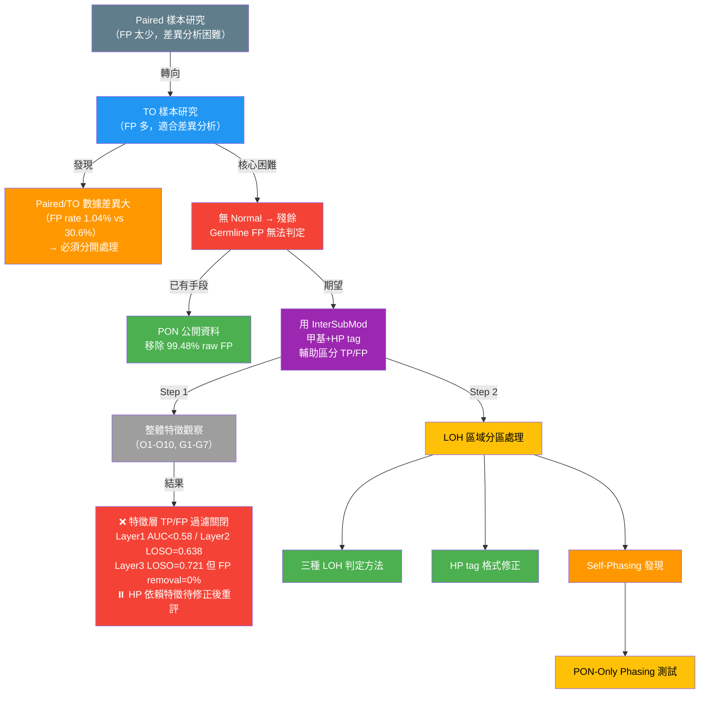
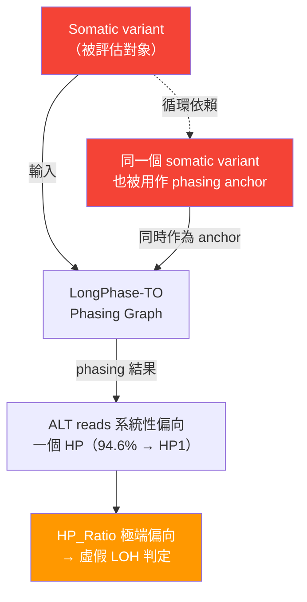

<!--
建立時間: 2026-04-04
目標: 驗證使用者對研究思路的理解，補充佐證數據，確認敘述邏輯是否清楚
處理範圍: Paired → TO 轉換動機、TO FP 問題、LOH 分區處理、HP tag 修正、PON-only phasing
關聯檔案:
  - docs/reports/20260403_研究佈局與策略架構總覽_01.md
  - docs/CURRENT_FOCUS.md
-->

# 研究思路驗證與推論鏈整理

> **日期**: 2026-04-04  
> **目的**: 逐段驗證研究思路的正確性，補充佐證數據，標記需修正或補充的描述

---

## 整體思路架構（驗證後版本）



---

## 逐段驗證

### 段落 1：從 Paired 轉向 TO 的動機

> **你的敘述**：「因為 paired 樣本 FP 太少，不好做差異分析，所以先轉去研究 TO」

**✅ 正確**，佐證數據：

| 維度 | Paired | TO | 來源 |
|------|--------|-----|------|
| FP rate | **1.04%** | **30.6%** | O1, O5 系統性觀察 |
| 殘餘 PASS FP 數量（HCC1395 5kHz） | **87 個** persistent | **11,598 個** | FP Provenance 分析 (03-22) |
| 差異分析可行性 | 87 個太少，統計力不足 | 11,598 個足夠做特徵分佈分析 | — |

**補充說明**：Paired 的 87 個 persistent FP 之所以少，是因為 paired mode 有 normal sample 直接過濾 germline。這 87 個是「normal 也無法識別的 irreducible FP」，主要機制是 (A) germline ASM（43%）和 (B) caller FP（49%）。  
**報告**：`docs/reports/validated/2026/03/20260324_paired_persistent_final_fp_深度追蹤_01.md`

---

### 段落 2：TO 期望套用相同概念但發現差異太大

> **你的敘述**：「認為 TO 可以套用相同概念與流程，且 FP 很多，但是透過分析發現整體 TP/FP 的數據狀況差異很多，傾向分開處理」

**✅ 正確**，佐證數據：

| 差異維度 | Paired | TO | 結論 |
|---------|--------|-----|------|
| HP 跨模式相關性 | — | **r = 0.001**（完全不相關） | HP 標籤在兩模式下完全獨立 |
| 甲基化方向 | 穩定 | **5/9 方向不同**（O5 的 9 個 ISM 統計特徵中 5 個在 paired/TO 方向相異，其中 PairwiseMedianDist 完全反轉，其餘為幅度/方向差異） | 不能共用甲基化規則 |
| QS AUC | **0.754** | **0.497**（隨機） | QS 在 TO 完全失效 |
| LOH-like enrichment | FP 富集 1.2× | **TP 富集 0.81×**（方向相反） | LOH 在兩模式語意完全不同 |
| GQ AUC | **0.811** | 0.566 | Caller 特徵也大幅退化 |

**方法學結論**：O1, O5, O7 三次獨立觀察反覆確認 **Paired 和 TO 必須分開處理**，不能共用同一套 filter / model / weight。

---

### 段落 3：TO 的 Germline FP 問題與 PON 過濾

> **你的敘述**：「TO 流程下沒有 Normal 資料無法判斷，故只能使用 PON 的公開資料篩選掉正常的 germline SNP（約佔原始 SNP 的 95%），但有很多樣本殘留的 germline SNP」

**⚠️ 大致正確，需區分「PON 過濾」和「PON+caller 合計」**：

```
TO 原始 variant calling 流程（HCC1395 5kHz 為例）：

  ClairS-TO 原始候選       2,731,541 variants
       │
       ├── [Layer 1] PON/NonSomatic veto  移除 2,717,339 個（99.48% of raw FP）
       │   └── 100% 帶顯式 PoN_1..PoN_4 tag
       │
       ├── [Layer 2] 非 PON caller filter  移除 2,596 個（0.095%）
       │   └── LowQual, VariantCluster 等
       │
       ├── [Layer 3] LongPhase-TO          移除 0 個（在此 pilot 上無效果）
       │
       └── PASS 後剩餘
            ├── TP:  ~6,900 個（somatic true positives）
            ├── FP: 11,598 個（殘餘 false positives）
            │    ├── raw_absent:  11,430（98.6%）— paired 從未 call 出
            │    ├── persistent:      87（0.75%）— paired 也無法解決
            │    ├── raw_filter:      63（0.54%）
            │    └── longphase_s:     18（0.16%）
            └── FN: 11,051 個（missed true positives）
```

**釐清「95%」**：
- **PON 單獨（Layer 1）**移除了 **99.48%** 的 raw FP（2,717,339 / 2,731,541）
- **PON+caller 合計**移除了 **99.58%**
- 使用者提到的「約 95%」可能指 PON database 對所有 germline variant 的**覆蓋率**（即公開 PON 能辨識的 common germline 佔所有 germline 的比例），這個數字我們沒有直接量化，但概念上是合理的——殘餘的 FP 正是 PON 覆蓋不到的**罕見 germline**
- 殘餘的 11,598 個 FP 與 somatic TP 在所有已測特徵上**本質相似**（G1-G7 驗證），是 population database 覆蓋不到的罕見 germline variants

**報告**：`docs/reports/validated/2026/03/20260322_TO_FP來源分解與paired對照分析_01.md`

---

### 段落 4：期望用 InterSubMod 甲基+HP tag 輔助區分

> **你的敘述**：「期望可以透過數據的差異，加上 Phase tag 標記，並配上使用 InterSubMod 程式來觀察與驗證從未分析的甲基狀況，看是否可以加強輔助標記，甚至是區分出 TP, FP 的特徵」

**✅ 動機正確，結果需要分層理解**

你的期望是合理的研究假說。經過三輪系統性窮舉後，**「用特徵值直接過濾 FP」這條路部分確認不可行**，但**「ISM 結果本身的分析價值」仍然保留**：

```
                   TP/FP 區分力窮舉結果（分層閾值 + 汙染標記）
 ┌──────────────────────────────────────────────────┐
 │  Layer 1: 甲基化 site-level（O1-O13）              │
 │  → 22+ 特徵，全部 AUC < 0.58                      │
 │  → 包括 CramersV, PairwiseMedianDist, AlleleDelta │
 │    HPMergedDelta, epipolymorphism, NME...         │
 │  ⚠️ 其中依賴 HP 分群的特徵受 self-phasing 汙染     │
 ├──────────────────────────────────────────────────┤
 │  Layer 2: VCF 特徵（G1-G7）                       │
 │  → 40+ 特徵，LOSO AUC = 0.638（best）             │
 │  → 包括 strand bias, CpG context, GT, AF,         │
 │    trinucleotide, H-flag, PoN pattern...          │
 │  ✅ 不依賴 HP，結論穩固                            │
 ├──────────────────────────────────────────────────┤
 │  Layer 3: Read-level（within_dom, NME, low_frac） │
 │  → 4 特徵，LOSO AUC = 0.721（首次 > 0.70）        │
 │  → 但 TP loss ≤2% 下 FP removal = 0%             │
 │  ⚠️ within_dom_alt_frac 依賴 HP，受 self-phasing  │
 ├──────────────────────────────────────────────────┤
 │  穩固關閉：不依賴 HP 的特徵（VCF 40+, CpG, SB）    │
 │  暫停判定：依賴 HP 的特徵 → 等 P0 修正後重評估      │
 └──────────────────────────────────────────────────┘
```

### ISM 關閉範圍界定

> **⚠️ 重要區分**（4 agent 審查確認的邏輯矛盾修正）

```
 ✅ 穩固關閉（不受 self-phasing 影響）：
    └── 用「不依賴 HP 分群的 ISM/VCF 特徵值」做 TO FP binary filter
        （VCF 40+ 特徵 AUC<0.64, CpG context 0.616, strand bias 0.502）

 ⏸️ 暫停判定（受 self-phasing 汙染，需修正後重評估）：
    ├── HP 相關甲基化特徵（HPMergedDelta, HPMergedSig, CramersV）
    ├── VerificationClass（V=0.023，但 HP+LOH penalty 雙重汙染）
    ├── QS（AUC=0.497，LOH penalty 只解釋 35%，修正後天花板未知）
    ├── Read-level within_dom_alt_frac（AUC=0.679，HP 分群直接汙染）
    └── LOH 區域外的甲基化特徵獨立 AUC（未被單獨報告）

 ✅ 保留且 POSITIVE（ISM 結果本身的分析價值）：
    ├── 甲基化信號直接來自 BAM MM/ML 標籤，獨立於 HP tag 正確性
    ├── ASM（allele-specific methylation）32-66% POSITIVE
    ├── Per-read methylation profile（甲基化矩陣）
    ├── Subclone 結構解析（研究目標 G2）
    └── 二次打擊推論（研究目標 G3）
```

**各方向結果總覽**：

| 方向 | 結果 | 狀態 | 意義 |
|------|------|------|------|
| 用特徵值過濾 TO FP（不依賴 HP） | ❌ NEGATIVE | ✅ 穩固關閉 | 不可行 |
| 用特徵值過濾 TO FP（依賴 HP） | ❌ NEGATIVE? | ⏸️ 暫停判定 | 需修正 self-phasing 後重測 |
| 位點賦予意義（ASM） | ✅ POSITIVE | ✅ 保留 | 32-66% SNV 有顯著 ASM |
| 解釋 subclone / 二次打擊 | ✅ 理論可行 | ✅ 保留 | ISM 唯一同時捕捉 location + dispersion |
| 改善 F1（paired） | ✅ +0.011 | ✅ 驗證通過 | Phase 1A methyl+context 有效 |
| 改善 F1（TO） | ⚠️ 未知 | ⏸️ 待修復 | 需先解決 self-phasing 根因 |

---

### 段落 5（Step 1）：整體特徵觀察無明顯差異

> **你的敘述**：「觀察了 TO 各樣本整體的 TP/FP 數據確認是否有整體的特殊差異，或是特徵，可以有用，發現快速分析下，沒有特別有區分力的特徵，分佈圖都還沒發現明顯差異分佈」

**✅ 正確**，佐證數據：

**O1-O10 系統性觀察**（2026-03-31，82 張圖表）：

| 觀察主題 | TO 最佳特徵 | AUC | 判定 |
|---------|------------|-----|------|
| O1 整體分佈 | caller_gq | 0.566 | 弱 |
| O2 QS 分析 | QS composite | 0.497 | 隨機 |
| O3 LOH 觀察 | core_loh_like | ~0.55 | 弱 |
| O4 Caller 特徵 ranking | caller_gq | 0.566 | 最佳但不足 |
| O5 甲基化特徵 ranking | PairwiseMedianDist | ~0.54 | 幾乎無效 |
| O8 樣本異質性 | 跨樣本 best | < 0.58 | 全部不足 |

**關鍵觀察**：
- TO 下 caller_af AUC = **0.418**（比隨機還差 — 高 AF 反而更多 FP）
- VerificationClass TP/FP 分辨力 Cramér's V = 0.023（近零）
- 甲基化與 caller 正交（|r| < 0.10），理論上可作 ML 增量，但單獨無用

**報告入口**：`big7_disk_output/synthesis/observation_workspaces/OBSERVATION_INDEX.md`

---

### 段落 6（Step 2）：LOH 分區處理的動機

> **你的敘述**：「期望觀察 TO 狀況下 LOH 區域內外分為兩種狀況處理，因為 LOH 會造成缺少單邊的資訊，計算分析上是需要特殊處理的區域」

**✅ 完全正確**，這是一個非常重要的研究洞見。佐證數據：

**O14-O15 LOH 區域全面量化**（2026-04-02，32 張圖）：

| LOH 區域內指標 | AUC | 判定 |
|---------------|-----|------|
| caller_gq (paired) | **0.922** | 有效（但這是 caller 本身的力量） |
| caller_ad_ref (TO) | **0.784** | 中等 |
| CramersV（甲基） | ~0.53 | **失效** |
| PairwiseMedianDist（甲基） | ~0.54 | **失效** |
| HPMergedDelta（HP 差異） | ~0.50 | **完全失效** |

**關鍵結論**：
1. LOH 區域內 **ISM 甲基化分析全面失效**（跨 7 樣本驗證）
2. LOH 區域內只有 **caller 特徵**保留區分力
3. LOH coverage 越大，ISM 性能退化越嚴重（負趨勢）

**這驗證了你的判斷**：LOH 區域確實需要分開處理，因為缺少單邊 HP 資訊會讓甲基化差異分析失去意義。

---

### 段落 7：三種 LOH 判定方式

> **你的敘述列出三種方式**

**✅ 全部正確**，以下補充佐證數據：

#### 方法 1：SEQC2 高可信 LOH 驗證集

| 指標 | 數值 | 說明 |
|------|------|------|
| 適用範圍 | HCC1395 only | 只有這個樣本有 SEQC2 truth set |
| 分類 | 4-class（TP/FP/FN/TN × LOH zones） | 最精細的分類 |
| O15 Phase 1 數據量 | 141,014 rows | HCC1395 深度分析 |

#### 方法 2：LongPhase-TO LOH.bed

| 指標 | 數值 | 說明 |
|------|------|------|
| 與 SEQC2 LOH Jaccard | **0.8470** | 高度重疊 |
| Phase 1↔2 Concordance | **R=0.993 (inside), R=0.997 (outside)** | LOH.bed 二元分類完美複製 SEQC2 4-class |
| 可適用範圍 | **所有 7 樣本** | 不限於有 truth set 的樣本 |
| O15 Phase 2 數據量 | 748,391 rows | 全樣本驗證 |

#### 方法 3：ISM HP_Ratio 極端偏向（InterSubMod LOH 分析）

| 指標 | 數值 | 說明 |
|------|------|------|
| 判定標準 | HP_Ratio < 0.1 或 > 0.9 | 90%+ reads 偏向單一 haplotype |
| TP LOH 區域 99.5% 極端偏向 | ✅ | O14 驗證 |
| 與 LOH.bed 的關係 | **LOH.bed 內幾乎全部符合** | 但有不少位點 **不在 LOH.bed 內也符合** |
| 額外 ISM-only LOH excess | Paired 3.9%, TO-Baseline **15.4%** | TO 有大量 LOH.bed 外的 ISM-detected LOH |

```
三種 LOH 判定方法的關係（部分重疊 Venn diagram）

  ⚠️ 注意：此圖為簡化展示。三者並非完全嵌套，而是部分重疊。
     LOH.bed vs ISM HP_Ratio Cohen's kappa = 0.670（實質一致但非完全一致）。

   ┌─────────────────────────────────────────────────┐
   │              ISM HP_Ratio 極端偏向                 │
   │    （最寬鬆，但並非 LOH.bed 的精確超集）             │
   │                                                 │
   │    ┌──────────────────────────────────┐          │
   │    │      LongPhase-TO LOH.bed         │          │
   │    │   （Jaccard=0.847 vs SEQC2）       │ ← 有少數  │
   │    │                                  │   位點在   │
   │    │  ┌──────────────────────┐        │   LOH.bed │
   │    │  │   SEQC2 Truth Set    │        │   內但不在 │
   │    │  │  （HCC1395 only）     │        │   ISM 的   │
   │    │  └──────────────────────┘        │   extreme  │
   │    │                                  │   HP_Ratio │
   │    └──────────────────────────────────┘   範圍內   │
   │                                                 │
   │    ISM-only LOH excess（在 LOH.bed 外）：          │
   │      Paired 3.9% | TO-Baseline 15.4%             │
   │      TO-PON-Only 54.8%                            │
   └─────────────────────────────────────────────────┘
```

**你提到的「不在 LOH.bed 內但也符合的位點」= ISM-only LOH excess**，這正是後續發現 self-phasing 問題的線索。

---

### 段落 8：HP tag 格式修正

> **你的敘述**：「驗證了 InterSubMod 如何解讀 longphase-to 輸出的 bam tag，發現與 longphase-s 格式不同，所以做擴充修正」

**✅ 正確**，佐證數據：

**HP Tag 格式差異**：

| 來源 | 格式 | HP1 | HP2 | Unphased | 說明 |
|------|------|-----|-----|----------|------|
| LongPhase-S (paired) | `HP:Z:` | "1" | "2" | "." | 字串格式，ISM 原生支援 |
| LongPhase-TO | `HP:i:` | 11 | 21 | 33 | **整數格式**（見下方說明） |

> **HP:i: 整數編碼規則**：LongPhase-TO 用整數表示 haplotype 來源——`11` = haplotype1-from-sample1（HP1-1），`21` = haplotype2-from-sample1（HP2-1），`33` = unphased（HP3）。ISM 舊版將整數直接用 `std::to_string()` 轉為字串 "11"/"21"/"33"，與 HP:Z: 格式的比對邏輯（期望 "1"/"2"）完全不相容，導致全部匹配失敗。

**Bug**：舊版 `ReadParser.cpp:121-141` 用 `std::to_string()` 轉換 → "11", "21", "33" → LabelTest 無法辨識 → **ALL HP:i: reads silently classified as "untracked"**

**修正前各樣本 untracked 比例**（災難性影響）：

| 樣本 | TP Reads Untracked | LOH Eligible (before → after) |
|------|-------------------|-------------------------------|
| H1437 | **68.8%** | 24.5% → **95.5%** (+290%) |
| COLO829 | **61.3%** | 0.7% → **34.7%** (+4846%) |
| H2009 | 51.4% | 64.5% → 97.7% |
| HCC1395_DORADO | 49.0% | 46.9% → 93.1% |
| HCC1395 | 38.4% | — |
| HCC1954 | 32.4% | — |
| HCC1937 | 30.8% | — |

**修正日期**：2026-03-30，163/163 tests passed，7 個 TO 樣本全部重跑。

---

### 段落 9：Self-Phasing 發現

> **你的敘述**：「透過 paired 與 TO 去確認發現 longphase-to tag 的結果使用了所有位點來 phase 與 tag，造成可能 tag 結果有偏差」

**✅ 完全正確，這是本輪研究最重要的根因發現**。

**Self-Phasing Circular Dependency — CONFIRMED（2026-04-02）**：



**關鍵數字**：

| 指標 | 數值 | 意義 |
|------|------|------|
| TO TP LOH 移除 self-phasing 後消失 | **62.0%** | 大部分 TO LOH = artifact |
| AF 0.1-0.8 的位點 | **~100% 消失** | 中 AF 位點幾乎全是 self-phasing |
| 全 TO LOH 中 self-phasing 佔比 | **31.2%** | 15-60% by sample |
| Somatic HP bias | **17.3:1**（614K vs 35K） | 94.6% somatic → HP1 |
| 同位點跨模式 HP_Ratio 相關 | **r ≈ 0** | 完全不相關 |
| TO-only LOH 在 Paired 下 | **86.5% 完全平衡** | 確認是 artifact |
| 同位點 TO LOH 是 paired 的 | **16-52×** | 數量級差異 |

**下游影響鏈**：

```
Self-Phasing → HP_Ratio 虛假偏向 → 多個下游問題：

  ├── TO QS 失效
  │   ├── LOH penalty 反向懲罰 TP → 解釋 ~35% QS 降幅
  │   ├── 另 ~65% 來自 mega-block scaffold 品質差異（獨立於 LOH）
  │   └── 即使修正 LOH penalty，TO QS 上限仍約 0.549，遠低於 Paired 0.754
  │
  ├── VerificationClass 失效
  │   └── 依賴 HP 分群 + LOH penalty，兩者都受 self-phasing 汙染
  │
  ├── 甲基化方向差異
  │   ├── O5 的 9 個 ISM 統計特徵中 5 個在 paired/TO 方向不同
  │   ├── 完全反轉的只有 PairwiseMedianDist（LOH = 0% mediator，根因是 mega-block 效應）
  │   └── 其餘方向差異的根因是 phasing scaffold context 差異
  │
  └── TO LOH enrichment 方向相反
      └── TP 0.81× vs Paired FP 1.2×
```

---

### 段落 10：PON-Only Phasing 測試

> **你的敘述**：「做了一個 longphase-to 的測試版本，只用 PON 的位點來做 phasing，看結果是否更好」

**✅ 正確**，佐證數據（HCC1395 5kHz TO）：

| 指標 | Baseline（全位點 phasing） | PON-Only | 判定 |
|------|-------------------------|----------|------|
| **LOH.bed Jaccard** | — | **1.0000** | ✅ LOH region 完全不變 |
| **SEQC2 LOH Jaccard** | 0.8470 | **0.8470** | ✅ 與 truth set 一致性不變 |
| **Somatic HP bias** | **17.3:1**（614K:35K） | **消除**（0\|. / .\|0） | ✅ Self-phasing 直接修復 |
| **Phase block N50** | 4,061 | **8,109（+99.7%）** | ✅ 品質翻倍 |
| **Phased rate** | 54.9% | **78.5%** | ✅ +23.6 pp |
| **執行時間** | 2693s | **1976s（1.36× 快）** | ✅ 更快 |
| **Purity estimation** | 0.927 | **0（失效）** | ⚠️ 副作用 |

**但 Haplotag 步驟發現新問題**：

PON-only phasing 的 VCF 層面完全正確，但 `longphase haplotag` 步驟對 somatic 位點（GT=`0|0`, GT2=`.|1`）將 **所有** reads 統一標記為 `HP:i:21`，而非正確分割 HP1/HP2。6,485 個非 LOH 平衡位點 100% 出現此問題。

| ISM 指標 | Paired | TO-Baseline | TO-PON-Only |
|---------|--------|-------------|-------------|
| HP_Ratio TP median | **0.5000** | 0.8358 | **0.0000** |
| HP_Ratio extreme (TP) | 46.8% | 60.0% | **99.9%** |
| ISM-only LOH excess | **3.9%** | 15.4% | **54.8%** |
| F1 (SuggestFilter) | 0.0909 | 0.0965 | 0.0979 |

**結論**：PON-only phasing 在 VCF 層面正確解決了 self-phasing，但 haplotag 步驟的 HP 分配需要修正。

**更深層根因**（計畫文件 `20260403_LongPhase_TO_二次Phasing方案設計與驗證計畫_01.md`）：
- 問題不只是「HP tag 標記錯誤」——PON-only 方案強制將所有非 PON variants 標為 SOMATIC
- Haplotag 解析 GT=`0|0` 時 `refHaplotype=UNDEFINED`，REF reads 無法投票
- `getVote()` 優先級 somatic > germline 進一步覆蓋正確投票
- 更根本的問題：**私有罕見 germline variants（non-PON germline）被錯誤強制為 SOMATIC**

**解法分層**：
- **短期**：ISM 端修正（忽略 somatic HP tags 11/21/33，只用 germline HP:i:1/2）— 工作繞路
- **長期**：需要二次 phasing 方案解決 non-PON germline 錯誤分類問題

---

## 整體推論鏈正確性評估

### ✅ 邏輯完整且正確的部分

1. **Paired → TO 轉換動機**：FP 數量差異（87 vs 11,598）完全合理
2. **Paired/TO 分離處理**：有 5+ 次獨立觀察確認差異，不可共用模型
3. **LOH 分區觀察**：非常重要的洞見，O14-O15 驗證了 LOH 區域內甲基化失效
4. **三種 LOH 判定方式**：清楚且層次分明，concordance 數據支持
5. **HP tag 格式修正**：關鍵 bug fix，影響 30-69% reads
6. **Self-phasing 發現**：根因定位正確（62% TO LOH = artifact）
7. **PON-only phasing 方向**：VCF 層面驗證成功

### ⚠️ 需要精確化的描述

| 原始描述 | 建議修正 |
|---------|---------|
| 「PON 篩選掉約 95% germline SNP」 | PON（Layer 1）單獨移除 **99.48%** raw FP；95% 可能指 PON database 的覆蓋率，但無直接量化數據 |
| 「期望區分 TP/FP 特徵」 | 不依賴 HP 的方向已 **穩固關閉**；依賴 HP 的方向 **暫停判定**（等 self-phasing 修正後重測）；ISM 結果本身的分析價值（ASM、subclone）**保留** |
| 「LOH.bed 外也符合的位點」 | 這些就是 **ISM-only LOH excess**，TO 有 15.4%（baseline），主要原因是 **self-phasing artifact** |
| 「5/9 甲基化方向反轉」 | 更精確：O5 的 9 個 ISM 統計特徵中 5 個在 paired/TO 方向不同，但**完全反轉的只有 PairwiseMedianDist**（根因是 mega-block 效應，LOH = 0% mediator），其餘是幅度/context 差異 |

### 🔲 敘述中提到但尚未展開的目標

| 目標 | 目前狀態 | 路徑 |
|------|---------|------|
| 「位點賦予意義與可信度」 | ✅ POSITIVE — ASM 32-66% | ISM 的核心價值定位，獨立於 HP tag |
| 「更強的區分 TP/FP」 | ⏸️ 不依賴 HP 部分關閉；依賴 HP 部分待重評估 | TO 需先修 phasing |
| 「驗證 subclone」 | ⏳ 目標 G2，Phase 1 之後 | 需先完成 per-CpG 關聯性評分（G1） |
| 「二次打擊狀況」 | ⏳ 目標 G3，最遠期 | 依賴 G1 + G2 + LOH/CNV 整合 |

---

## 附錄：4 Agent 嚴謹審查結果匯整

### Agent 1（PON 過濾比例驗證）：PON 單獨 = 99.48%，非 95%

### Agent 2（報告邏輯審查）：9 個問題，2 個嚴重

| # | 問題 | 嚴謹度 | 修正狀態 |
|---|------|-------|---------|
| 1 | FP rate 30.6% 被四捨五入為 31% | 4/5 | ✅ 已修正 |
| 2 | **「5/9 反轉」與因果鏈報告 1/5 矛盾** | 2/5 | ✅ 已修正（區分「反轉」與「方向不同」） |
| 3 | Mermaid 圖用「< 0.64」概括所有層 | 3/5 | ✅ 已修正（分層閾值） |
| 4 | **Self-phasing→QS 因果鏈省略 65% scaffold 差異** | 2.5/5 | ✅ 已修正（補注 35%/65%） |
| 5 | LOH 集合圖畫成完全嵌套 | 3/5 | ✅ 已修正（補注 kappa=0.670） |
| 6 | **「正式關閉」未區分特徵過濾 vs ISM 結果分析** | 2.5/5 | ✅ 已修正（加 ISM 關閉範圍界定段落） |
| 7 | PON-only 問題省略 non-PON germline 錯誤分類 | 3/5 | ✅ 已修正（補充更深層根因） |
| 8 | HP tag 整數代碼未解釋語意 | 4/5 | ✅ 已修正 |
| 9 | 觀察表格跳過 O6/O7 | 4/5 | 輕微，不影響結論 |

### Agent 3（數字交叉驗證）：7/7 全部 PASS

所有關鍵數字均回溯到原始報告/數據表，100% 一致。

### Agent 4（ISM 分析可能性質疑）：「正式關閉」部分過早

**核心發現**：報告段落 9 承認 self-phasing 造成 HP 分群錯誤，卻在段落 4 用基於這些錯誤分群的結論標記「正式關閉」——存在**邏輯矛盾**。合理立場是「暫停判定」依賴 HP 的方向，等 P0 完成後再做最終判定。

---

## 下一步路徑圖

```
現在的位置
    │
    ▼
[P0] ISM ReadParser 修正（忽略 somatic HP tags 11/21/33）
    │
    ▼
[P0] HCC1395 5kHz TO 用修正後 ISM 重跑
    │
    ├── 比較 HP_Ratio / QS / F1
    │
    ├── 如果 HP_Ratio 回到 paired 水準
    │   └── → TO Phase 1A methyl+context 重新評估
    │
    └── 如果 HP_Ratio 仍有問題
        └── → 需要 LongPhase-TO haplotag 修正
             （或 ISM 用 ALT/REF 分群替代 HP 分群）
```
