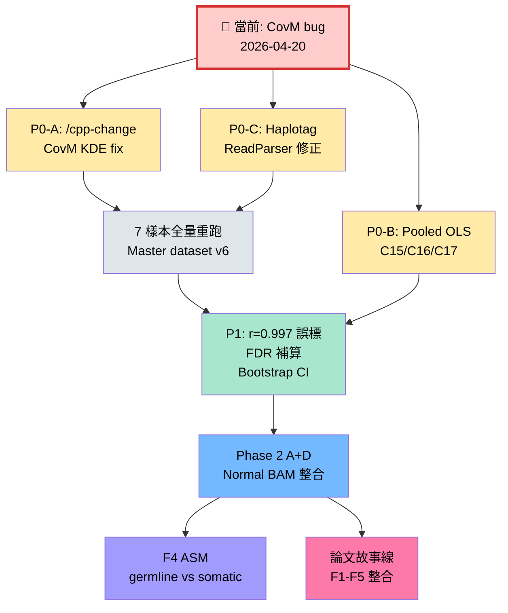
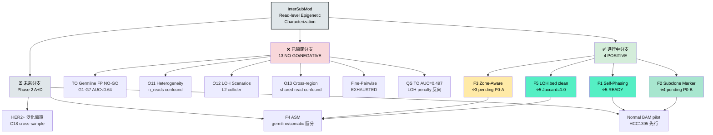
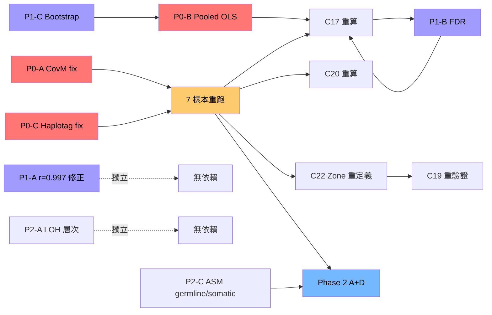

<!--
建立時間: 2026-04-20
目標: 將 22 結論審查轉化為可決策、可追蹤、可引用的 Executive Decision Brief
關聯計劃: /bip7_disk/liaoyoyo2001/.claude/plans/big8-disk-liaoyoyo2001-knowledge-frolicking-hippo.md
產出定位: 給使用者一頁看完所有問題、決策選項、研究路徑
-->

# InterSubMod Executive Decision Brief

> **版本**: v1.0 (2026-04-20)
> **背景**: 22 結論 × 6 維度審查 + 4 跨卡分析已完成 → 需決策導向總覽
> **用戶定調**: 主軸為 **read-level epigenetic characterization**；Subclone Marker Tool 為其中一項功能
> **產出結構**: 1 主文件 + 7 分類文件（`decisions/`）+ 1 CHECKLIST

---

## 目錄

1. [研究全景視野](#1-研究全景視野)
2. [研究路徑視覺化](#2-研究路徑視覺化)
3. [研究分支樹](#3-研究分支樹)
4. [問題清單總表（30 題）](#4-問題清單總表)
5. [處理優先序與依賴](#5-處理優先序與依賴)
6. [成功標準與里程碑](#6-成功標準與里程碑)
7. [用戶決策一頁速查](#7-用戶決策一頁速查)

---

## 1. 研究全景視野

### 1.1 主軸定位（R-02 已定）

> **ISM is not a variant filter. ISM is a read-level epigenetic characterization framework.**

- **核心價值**：read-level 層面的甲基化 characterization
- **不做**：獨立 variant filter 推廣（Phase 1A F1=+0.0112 effect size 過小）
- **補強方向**：Phase 2 A+D 整合 Normal BAM，補齊 germline/somatic 區分故事線

### 1.2 五個研究目標定錨（project_research_vision_five_goals）

| 目標 | 狀態 | 證據 |
|------|------|------|
| 1. Self-phasing 機制揭露 | ✅ 完成 | C09, C10, C21 |
| 2. Subclone heterogeneity 識別 | ⚠️ pending P0 | C16, C17 |
| 3. Region-level subclone ordering | ⏸️ 暫緩（依賴目標 1） | P4 pilot NEGATIVE |
| 4. Zone-aware confidence characterization | ⚠️ pending CovM fix | C22, C18, C19 |
| 5. ASM profiling（germline vs somatic） | ⏳ 需 Phase 2 A+D | C12 |

### 1.3 當前階段

**2026-04-20 節點**：
- ✅ Phase 1 Self-phasing 完成
- ✅ Phase 1A ML filter 鎖定（effect size 小）
- ✅ 22 結論完整審查完成
- 🔴 **CovM 75.0 hardcoded bug 待修**（影響 5 個結論）
- ⏳ Phase 2 A+D Normal BAM 程式碼已完成，待 P0 修正後全量驗證

---

## 2. 研究路徑視覺化

### Fig 1：研究歷史路徑（2025-01 ~ 2026-04-20）

```mermaid
graph LR
    A[2025-01<br/>基礎設施建立] --> B[2025-12<br/>TP/FP 特徵富集]
    B --> C[2026-01<br/>Multi-bio F1 優化]
    C --> D[2026-02<br/>TO Germline FP ❌<br/>G1-G7 NO-GO]
    C --> E[2026-02<br/>Read-level FP ⚠️<br/>CONDITIONAL NO-GO]
    D --> F[2026-03<br/>Self-Phasing 揭露 ✅<br/>62% TO LOH 消失]
    F --> G[2026-03<br/>LOH 雙定義 ✅<br/>LOH.bed vs HP_Ratio]
    G --> H[2026-03<br/>Phase 1A 鎖定 ✅<br/>F1=+0.0112]
    H --> I[2026-03<br/>O11/O12/O13 NEGATIVE ❌<br/>confound 揭露]
    I --> J[2026-04<br/>HPFineNGroups POSITIVE ✅<br/>somatic marker]
    J --> K[2026-04<br/>LOH Subclone AF×Me ✅<br/>r=+0.705]
    K --> L[2026-04<br/>Zone-Aware H2 ❌<br/>characterization ✅]
    L --> M[2026-04-20<br/>CovM bug 發現 🔴<br/>當前位置]

    style A fill:#d4edda,color:#000
    style B fill:#d4edda,color:#000
    style C fill:#d4edda,color:#000
    style D fill:#f8d7da,color:#000
    style E fill:#fff3cd,color:#000
    style F fill:#d4edda,color:#000
    style G fill:#d4edda,color:#000
    style H fill:#d4edda,color:#000
    style I fill:#f8d7da,color:#000
    style J fill:#d4edda,color:#000
    style K fill:#d4edda,color:#000
    style L fill:#fff3cd,color:#000
    style M fill:#ffcccc,color:#000,stroke:#d63031,stroke-width:3px
```

### Fig 2：未來路徑（從當前節點展開）

---

## 3. 研究分支樹

### Fig 3：分支樹（當前狀態快照 + F1-F5 功能樹）

---

## 4. 問題清單總表

**總計 30 個決策點**（分 6 類 + 1 CHECKLIST）。詳細決策文件見 `decisions/` 目錄。

| 類別 | 題數 | 文件 | 概述 |
|------|------|------|------|
| **P0 Critical** | 3 | [01_P0_critical_decisions.md](decisions/01_P0_critical_decisions.md) | 結論反轉風險 — CovM bug / Pooled OLS / Haplotag |
| **P1 High** | 3 | [02_P1_high_decisions.md](decisions/02_P1_high_decisions.md) | 數值錯誤/統計瑕疵 — r=0.997 / FDR / bootstrap CI |
| **P2 Precision** | 5 | [03_P2_precision_decisions.md](decisions/03_P2_precision_decisions.md) | 用詞精確化與方法論補強 |
| **P3 Sync** | 5 | [04_P3_documentation_sync.md](decisions/04_P3_documentation_sync.md) | 文件同步小任務 |
| **R-id Strategic** | 4 | [05_strategic_R_decisions.md](decisions/05_strategic_R_decisions.md) | 戰略決策（R-03~R-06） |
| **Q-id Open** | 10 | [06_open_questions_Q.md](decisions/06_open_questions_Q.md) | 戰略/方法論/生物學開放問題 |
| CHECKLIST | — | [CHECKLIST.md](decisions/CHECKLIST.md) | 30 題速查可轉 TodoWrite |

### 速覽：各類代表問題

| ID | 標題 | 推薦選項 | 影響結論 |
|----|------|---------|---------|
| P0-A | CovM hardcoded 75.0 修正策略 | A: 立即修+重跑 | C17, C18, C19, C20, C22 |
| P0-B | Pooled OLS 重算範圍 | A: C17 優先+C16 次之+C15 最後 | C15, C16, C17 |
| P0-C | Haplotag ReadParser 修正時機 | A: CovM fix 同窗口修 | C03, C05, C08 |
| P1-A | r=0.997 誤標修正範圍 | A: 同步修 `08_Zone_Aware.md:49,73`+關聯 4 卡 | C13, C17, C20, C22 |
| P1-B | FDR 校正範圍 | A: C16 優先，其餘追溯 | C03-C07, C11, C16 |
| P1-C | HPFineNGroups bootstrap CI | A: 1000× + per-bin + 結合 P0-B | C16 |
| R-03 | 期刊目標 | A: Genome Research（穩健） | 全文 |
| R-04 | 13 NO-GO 結論重審 | B: 統一 n_reads confound 檢查 | 13 NO-GO 卡 |
| R-05 | Pooled OLS 全面回溯範圍 | B: 全 residualized 結論 | C15, C16, C17 |
| R-06 | 知識庫交叉驗證範圍 | C: 5 個主結論深搜 | F1, F2, F3, F4, F5 |

---

## 5. 處理優先序與依賴

### 依賴圖（不含時程，僅依賴順序）

### Critical Path（必走順序）

1. **P0-A CovM fix + P0-C Haplotag fix**（可並行）
2. **7 樣本全量重跑**（Master dataset v6）
3. **P0-B Pooled OLS within-group** + **P1-B FDR 補算** + **P1-C Bootstrap CI**
4. **C17 / C20 / C22 重算 + audit card 更新**
5. **Phase 2 A+D 啟動**

### Parallel Tracks（可平行進行）

- **P1-A r=0.997 誤標修正**：純文字編輯，5 分鐘，獨立
- **P2-A LOH 層次精確化**：純文字，獨立
- **P3-A ~ P3-E 文件同步**：全部獨立，可多線並行
- **R-03 期刊研究**：不影響實驗，可同時思考
- **Q-01 ~ Q-10 戰略思考**：用戶決策，不阻塞執行

---

## 6. 成功標準與里程碑

### Phase 2 A+D 成功標準（Q-05 待確認，初版建議）

| 指標 | 門檻 | 理由 |
|------|------|------|
| Normal BAM 整合 7 樣本 | 全部跑通 | 基礎功能可用 |
| ASM germline/somatic 區分 | germline 15-30% 符合文獻 | 文獻校準 |
| Sample-matched ASM vs 跨樣本 ASM | ΔF1 > 0.01 | characterization value |
| LOH.bed + Normal baseline joint | F1 穩定 vs 現有 | 不劣化 |
| 新 subclone marker 候選 | ≥1 項 POSITIVE | paper 故事線補強 |

### Paper Storyline Readiness

| 章節 | 成熟度 | gate |
|------|--------|------|
| Intro + F1 Self-Phasing | ⭐⭐⭐⭐⭐ | 當下可寫 |
| Methods | ⭐⭐⭐⭐ | 需 CovM fix 後定稿 |
| Results 1: F1 Self-Phasing | ⭐⭐⭐⭐⭐ | 當下可寫 |
| Results 2: F2 Subclone Marker | ⭐⭐⭐⭐ | pending P0-B + P1-C |
| Results 3: F3 Zone-Aware | ⭐⭐⭐ | pending P0-A |
| Results 4: F4 ASM | ⭐⭐⭐ | pending Phase 2 A+D |
| Discussion | ⭐⭐⭐⭐ | 當下可起草 |

### F1-F5 功能成熟度里程碑

詳見 `cross_cutting/Characterization_Functions.md`。

| 功能 | 當前 ⭐ | 下一里程碑 |
|------|-------|----------|
| F1 Self-Phasing | ⭐5 | 論文撰寫 |
| F2 Subclone Marker | ⭐4 | P0-B + P1-C → ⭐5 |
| F3 Zone-Aware | ⭐3 | P0-A → ⭐4 |
| F4 ASM | ⭐3 | Phase 2 A+D → ⭐4 |
| F5 Variant Confidence | ⭐3 | 不擴展 |

---

## 7. 用戶決策一頁速查

| 編號 | 決策點 | 推薦 | 分類文件 | 狀態 |
|------|--------|------|---------|------|
| **已決** | | | | |
| R-01 | CovM bug 時機 | A 立即修+重跑 | — | ✅ 已定 |
| R-02 | 論文定位 | 主軸 characterization | — | ✅ 已定 |
| **待決（P0 Critical）** | | | | |
| P0-A | CovM fix 策略 | A | 01 | ☐ |
| P0-B | Pooled OLS 範圍 | A | 01 | ☐ |
| P0-C | Haplotag 時機 | A | 01 | ☐ |
| **待決（P1 High）** | | | | |
| P1-A | r=0.997 修正範圍 | A | 02 | ☐ |
| P1-B | FDR 校正範圍 | A | 02 | ☐ |
| P1-C | bootstrap CI | A | 02 | ☐ |
| **待決（P2 Precision）** | | | | |
| P2-A | LOH 層次 | A | 03 | ☐ |
| P2-B | AUC 門檻 | A | 03 | ☐ |
| P2-C | ASM germline/somatic | A | 03 | ☐ |
| P2-D | NG=3 非單調 | A | 03 | ☐ |
| P2-E | Self-phasing 機制 | A | 03 | ☐ |
| **待決（P3 Sync）** | | | | |
| P3-A | HPFineNGroups filter 同步 | A | 04 | ☐ |
| P3-B | 22 結論入 06 | A | 04 | ☐ |
| P3-C | TODO 編號統一 | A | 04 | ☐ |
| P3-D | Archive 舊數據 grep | A | 04 | ☐ |
| P3-E | PRE-FIX 警告 | A | 04 | ☐ |
| **待決（戰略）** | | | | |
| R-03 | 期刊目標 | A Genome Research | 05 | ☐ |
| R-04 | 13 NO-GO 回溯 | B 統一 n_reads | 05 | ☐ |
| R-05 | Pooled OLS 全面 | B 全 residualized | 05 | ☐ |
| R-06 | 知識庫範圍 | C 5 主結論深搜 | 05 | ☐ |
| **待決（開放問題 Q-id）** | | | | |
| Q-01 | 優先序 | 見建議 | 06 | ☐ |
| Q-02 | Zone 重定義 | 見建議 | 06 | ☐ |
| Q-03 | ISM 下游應用 | 見建議 | 06 | ☐ |
| Q-04 | Negative result paper | 見建議 | 06 | ☐ |
| Q-05 | Phase 2 成功標準 | 見建議 | 06 | ☐ |
| Q-06 | 13 NO-GO 投入 | 見建議 | 06 | ☐ |
| Q-07 | HCC1395 單樣本 | 見建議 | 06 | ☐ |
| Q-08 | ASM Normal BAM 依賴 | 見建議 | 06 | ☐ |
| Q-09 | NG=3 機制 | 見建議 | 06 | ☐ |
| Q-10 | LOH Subclone cohort | 見建議 | 06 | ☐ |

**完整速查請見** [`decisions/CHECKLIST.md`](decisions/CHECKLIST.md)。

---

## 附錄：文件導航

| 想看… | 去哪裡 |
|-------|-------|
| 每結論細節 | `cards/C01-C22.md` |
| CovM bug 影響矩陣 | `cross_cutting/CovM_Bug_Impact.md` |
| Pooled OLS SOP | `cross_cutting/Pooled_OLS_Audit.md` |
| FDR 校正方案 | `cross_cutting/Multiple_Testing_Correction.md` |
| 主軸功能樹 | `cross_cutting/Characterization_Functions.md` |
| 研究路徑獨立敘述 | `decisions/00_research_path_tree.md` |
| 問題逐題展開 | `decisions/01-06_*.md` |
| 30 題速查 | `decisions/CHECKLIST.md` |
| 跨卡健康度統計 | `00_INDEX.md` |

---

## 整體結論

**✅ 已穩固**：9/22 結論（F1 Self-Phasing、F5 LOH.bed clean、6 NEGATIVE 已歸因 confound）
**🟡 需補強**：10/22 結論（pending P0-P1 修正後升級）
**🔴 待驗證**：3/22 結論（C17, C20, C22 受 CovM bug 影響）

**最迫切 3 件事**：
1. `/cpp-change` 觸發 CovM KDE baseline 修正
2. 7 樣本全量重跑（Master dataset v6）
3. P1-A 5 分鐘修正 `08_Zone_Aware.md:49,73` 誤標

**下一階段方向**：Phase 2 A+D Normal BAM 整合，補齊 germline/somatic 區分，完成 characterization 論文故事線。

---

*文件生成工具：Claude Code Opus 4.7 + manual verification*
*下次更新時機：30 題決策回覆後；或 P0-A 修正完成後*
