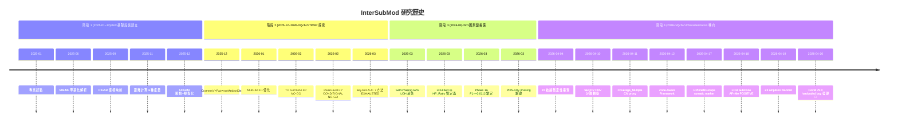
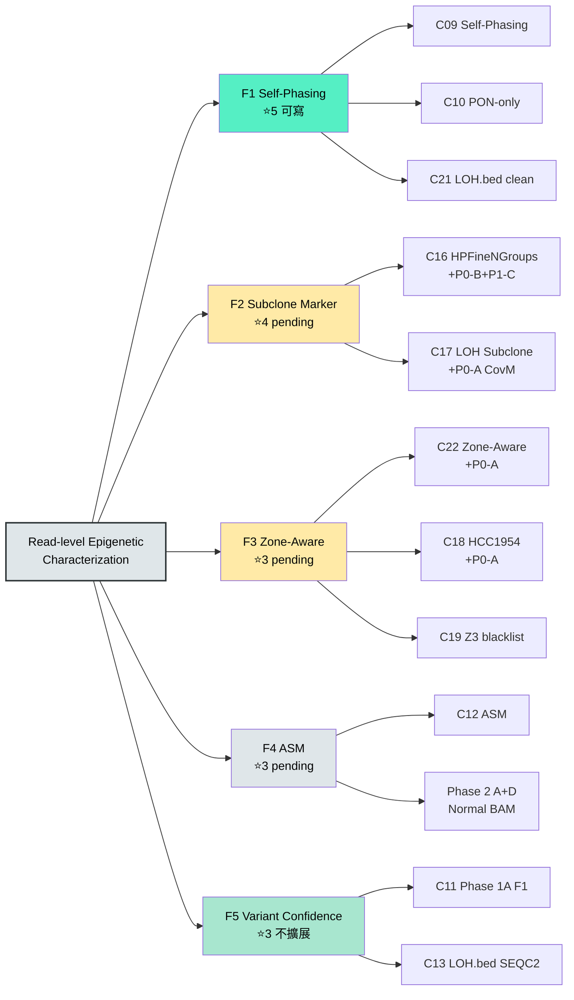

# 00 — 研究路徑 + 分支樹 + 困難點 + 未來目標

> **建立日期**: 2026-04-19

> **定位**：EXECUTIVE_DECISION_BRIEF.md 第 1-3 節的獨立敘述版 + 詳細分支說明
>
> **讀者**：希望一次了解 InterSubMod 研究全貌的人（包括未來的自己 / 合作者 / reviewer）

---

## 一、研究主軸定位（2026-04-18 確認）

### 1.1 核心宣言

> **ISM is not a variant filter.**
>
> **ISM is a read-level epigenetic characterization framework** that reveals structural biases, identifies subclone heterogeneity, stratifies variant confidence zones, and profiles allele-specific methylation.

### 1.2 過去定位 vs 當前定位的轉折點

**原始定位（2025-2026-02）**：ONT variant filter 工具，以 F1 提升為目標。

**轉折證據**：
- Phase 1A 最佳 effect size 僅 +0.0112（偏小）
- TO Germline FP 60+ 特徵全 AUC<0.64（G1-G7 NO-GO）
- Beyond-AUC 7 方法全無效（2026-03-22 EXHAUSTED CONFIRMED）
- 特徵空間耗盡確認

**當前定位（2026-04-18 起）**：read-level epigenetic characterization，以五大功能支撐。

### 1.3 五個研究目標定錨

| 目標 | 定義 | 當前狀態 | 證據 |
|------|------|---------|------|
| **目標 1** | Self-phasing 機制揭露 | ✅ 已完成 | C09, C10, C21 |
| **目標 2** | Subclone heterogeneity 識別 | ⚠️ pending P0 | C16, C17 |
| **目標 3** | Region-level subclone ordering | ⏸️ 暫緩 | P4 pilot NEGATIVE |
| **目標 4** | Zone-aware confidence characterization | ⚠️ pending CovM fix | C22, C18, C19 |
| **目標 5** | ASM profiling（germline vs somatic） | ⏳ 需 Phase 2 A+D | C12 |

**優先序**：目標 1（已達）→ 目標 2 / 目標 4（本階段完成）→ 目標 5（Phase 2 A+D）→ 目標 3（後期）

---

## 二、研究歷史路徑（2025-01 ~ 2026-04-20）

### 2.1 四大階段

### 2.2 關鍵里程碑（成功的）

1. **2025-12 Branch 1 基礎設施完成**：MM/ML 解析、CIGAR 映射、OpenMP <300ms
2. **2026-03-XX Self-phasing 揭露**：62% TO LOH 在 ISM HP_Ratio 層消失（⭐5 stability）
3. **2026-03-XX LOH 雙定義確立**：LOH.bed（VCF coordinate）vs ISM HP_Ratio LOH（BAM HP tag）
4. **2026-04-18 HPFineNGroups 新 filter**：NG=4+AF<0.4+NR≥80 TP rate 0.9281
5. **2026-04-18 LOH Subclone POSITIVE**：Inter AF→NGroups r=+0.705 (7/7 p<10⁻³⁹)

### 2.3 已關閉死路（13 NO-GO）

| # | 方向 | 關閉原因 | 證據 |
|---|------|---------|------|
| 1 | TO Germline FP G1-G7 | LOSO AUC=0.638, FP removal=0% | C07 |
| 2 | HP-free Option C | AUC=0.512 random | Beyond-AUC |
| 3 | FN rescue O9 | HP-free AUC<0.53 | Beyond-AUC |
| 4 | TO-pure 獨立建模 | caller_af 0.654 超越全 ISM | Beyond-AUC |
| 5 | Fine-Pairwise | Paired AUC<0.50 reversed | Beyond-AUC |
| 6 | O11 Heterogeneity | n_reads confound | C04 |
| 7 | O12 LOH Scenarios | L2 collider bias | C05 |
| 8 | O13 Cross-region | shared read confound | C06 |
| 9 | QS TO | AUC=0.497 LOH penalty 反向 | C14 |
| 10 | LOH Methylation | CramersV AUC~0.53 | C15 |
| 11 | CNV Zone-aware filter | trade-off 低於 break-even | C22 (H2) |
| 12 | Wave 3 LOH 分層 | Simpson's Paradox | R1-R5 |
| 13 | Z3 amplicon blacklist canonical | ΔF1 ±0.005 | C19 |

---

## 三、研究分支樹（當前狀態快照）

### 3.1 樹狀結構

```mermaid
graph TD
    ROOT[InterSubMod<br/>Read-level Epigenetic<br/>Characterization<br/>主軸定位]

    ROOT --> B1[Branch 1<br/>基礎設施 ✅]
    ROOT --> B2[Branch 2<br/>TP/FP Filter ❌ EXHAUSTED]
    ROOT --> B3[Branch 3<br/>Self-Phasing ✅]
    ROOT --> B4[Branch 4<br/>Subclone Marker 🟡]
    ROOT --> B5[Branch 5<br/>Zone-Aware 🟡]
    ROOT --> B6[Branch 6<br/>ASM ⏳ Phase 2]

    B1 --> B1a[MM/ML 解析]
    B1 --> B1b[CIGAR 映射]
    B1 --> B1c[6 種距離度量]
    B1 --> B1d[OpenMP <300ms]

    B2 --> B2a[❌ G1-G7 Germline]
    B2 --> B2b[❌ O11/O12/O13]
    B2 --> B2c[⚠️ Read-level FP<br/>CONDITIONAL]
    B2 --> B2d[❌ Beyond-AUC]

    B3 --> B3a[✅ 62% LOH 消失]
    B3 --> B3b[✅ LOH.bed vs HP_Ratio]
    B3 --> B3c[✅ PON-only phasing]
    B3 --> B3d[✅ LOH.bed clean Jaccard=1.0]

    B4 --> B4a[🟡 HPFineNGroups<br/>pending P0-B]
    B4 --> B4b[🟡 LOH Subclone AF×Me<br/>pending P0-B+CovM]

    B5 --> B5a[🟡 Z1-Z5 分層<br/>pending CovM]
    B5 --> B5b[🟡 HCC1954 reversal<br/>pending CovM]
    B5 --> B5c[✅ Z3 blacklist NEGATIVE<br/>for canonical]

    B6 --> B6a[⏳ germline ASM 基線]
    B6 --> B6b[⏳ somatic ASM 差異]
    B6 --> B6c[⏳ Normal BAM integration]

    style ROOT fill:#dfe6e9,color:#000,stroke:#2d3436,stroke-width:2px
    style B1 fill:#d4edda,color:#000
    style B2 fill:#f8d7da,color:#000
    style B3 fill:#d4edda,color:#000
    style B4 fill:#fff3cd,color:#000
    style B5 fill:#fff3cd,color:#000
    style B6 fill:#dfe6e9,color:#000
```

### 3.2 功能樹（F1-F5，依 Characterization 主軸整合）

---

## 四、當前困難點

### 4.1 🔴 Critical（結論反轉風險）

1. **CovM 75.0 hardcoded bug**
   - **描述**：master dataset 全 7 樣本 × 2 mode 共用 default fallback，KDE baseline 未啟用
   - **影響**：5 個結論受影響（C17, C18, C19, C20, C22）
   - **後果**：若不修，所有 cross-sample CovM-based 結論不可信，無法進 Phase 2

2. **Pooled OLS residualization trap**
   - **描述**：pooled OLS 在分組變量存在時保留分組信號，可能產生虛假相關
   - **影響**：C15, C16, C17 潛在風險
   - **後果**：C17 r=+0.705 可能過度樂觀

3. **Haplotag ReadParser 未完成修正**
   - **描述**：P0-2 haplotag 修正尚未執行
   - **影響**：C03, C05, C08 在汙染條件下觀測
   - **後果**：結論 3/5/8 的特徵觀測可能有系統偏差

### 4.2 🟡 Medium（方法論瑕疵）

4. **FDR 校正系統性缺失**
   - **描述**：60+ 特徵 AUC 掃描無 BH-FDR
   - **影響**：C03, C04, C05, C06, C07, C11, C16

5. **bootstrap CI 缺失**
   - **描述**：多個 AUC 單點聲明
   - **影響**：C16 residualized AUC 跨樣本穩定性無法宣稱

6. **單樣本外推問題**
   - **描述**：C02, C10, C13, C18 僅 HCC1395 或 HCC1954
   - **影響**：reviewer 會要求多樣本驗證

### 4.3 🟢 Low（文件精確化）

7. **LOH 雙層概念混用**（C09 周邊文件）
8. **HPFineNGroups filter 版本不一**（新 vs 舊 filter 文件）
9. **r=0.997 誤標**（`08_Zone_Aware.md:49,73`）
10. **Archive 舊數據殘留**（TP=30,490/FP=4,842 矯正前版本）

---

## 五、未來目標與方向

### 5.1 本階段（本審查結束後 2-3 週）

| 目標 | 動作 | 產出 |
|------|------|------|
| CovM bug 修正 | `/cpp-change` 觸發 | Master dataset v6 |
| Pooled OLS 驗證 | C17 within-group | 穩固 r 值 |
| P1 系列補強 | r=0.997 修正 / FDR / bootstrap | 穩固統計 |
| Audit card 更新 | 修正後重跑數據寫回 | v1.1 audit |

### 5.2 中期（Phase 2 A+D 整合）

| 目標 | 動作 | 產出 |
|------|------|------|
| Normal BAM pilot | HCC1395 先行 | Normal baseline proof-of-concept |
| 擴展到 7 樣本 | 逐樣本 Normal BAM 取得 | 全量 ASM germline/somatic |
| Sample ASM | 已有程式，全量執行 | 每樣本 ASM TSV |
| Cross-region subclone | 已有程式，整合分析 | 4-group subclone 結論 |
| Characterization 論文故事線完整 | F1-F4 整合 | Paper draft 第一版 |

### 5.3 長期（論文投稿前）

| 目標 | 動作 |
|------|------|
| 知識庫文獻交叉驗證 | R-06 5 主結論深搜 |
| 期刊目標確認 | R-03 Genome Research / Genome Biology 選擇 |
| Reviewer 質疑預演 | 13 NO-GO 結論 n_reads confound 統一確認 |
| 圖表整合 | 所有 figures + Mermaid + Cross-cutting 統合 |

---

## 六、整體視野總結

### 6.1 已完成的大事（什麼是穩的）

- ✅ **自建 C++ ISM pipeline**：完整、快速（<300ms/region）、多樣本
- ✅ **Self-Phasing 機制揭露**：最有原創性的貢獻
- ✅ **LOH.bed clean 證實**：Jaccard=1.0 vs SEQC2 F1=96.2%
- ✅ **22 結論完整審查**：methodology health baseline 建立
- ✅ **定位轉向 characterization**：避免特徵空間耗盡導致的持續挫敗

### 6.2 正在做的（pending）

- 🟡 HPFineNGroups somatic marker 驗證補強
- 🟡 LOH Subclone 雙重證據鏈確認
- 🟡 Zone-Aware 重定義（CovM fix 後）
- 🟡 Phase 2 A+D Normal BAM 整合準備

### 6.3 會停的（不再投入）

- ❌ TP/FP variant filter 方向（特徵空間耗盡）
- ❌ TO Germline FP 識別（G1-G7 NO-GO）
- ❌ CNV zone-aware filter（F1 trade-off 不成立）
- ❌ Single-feature beyond-AUC 優化

### 6.4 可能做的（戰略未定）

- ⏳ HER2+ patient-derived cohort 驗證（C18 cross-sample）
- ⏳ TNBC / 其他癌型 LOH Subclone 泛化
- ⏳ 臨床 downstream cohort 對接（Q-10）
- ⏳ TO negative result 獨立 paper（Q-04）

---

## 七、閱讀建議

| 身份 | 建議閱讀順序 |
|------|------------|
| PI 看進度 | 本文第 5-6 節 → EXECUTIVE_DECISION_BRIEF 第 7 節速查 |
| 新合作者理解全貌 | 本文 → 22 audit cards → cross_cutting |
| 執行者接手 | CHECKLIST.md → 01-06 分類文件 → 相關 audit card |
| Reviewer 質疑 | cross_cutting 4 份 → 對應 audit card → 原始報告 |
| 投稿前盤點 | EXECUTIVE_DECISION_BRIEF 第 6 節 → R-id 決策 → Phase 2 成果 |

---

*本文為 EXECUTIVE_DECISION_BRIEF.md 第 1-3 節的詳細敘述獨立版。若主文件更新，本文同步更新。*
