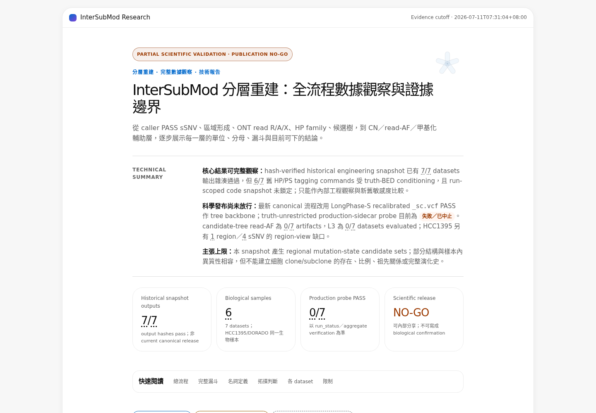
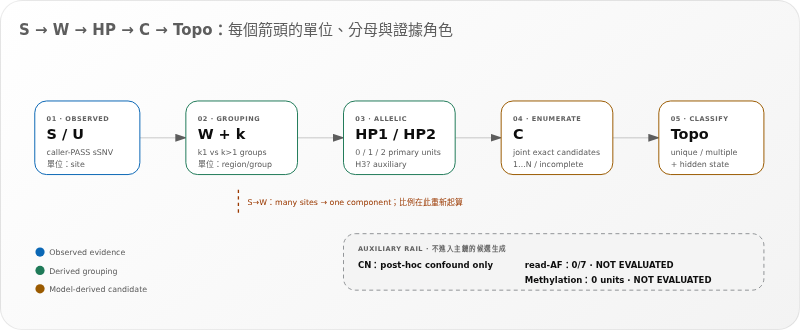
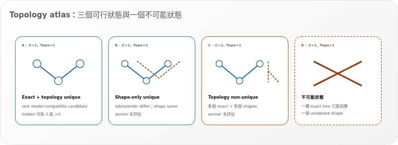
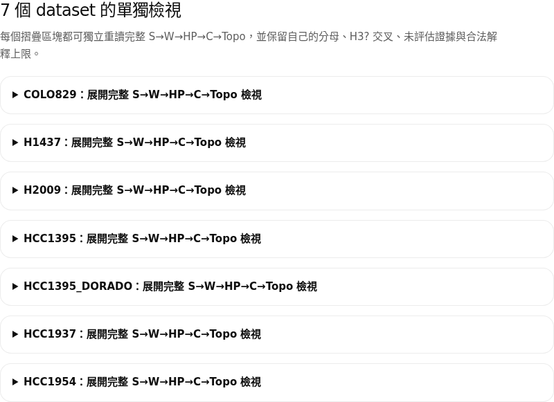
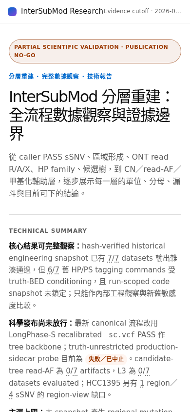
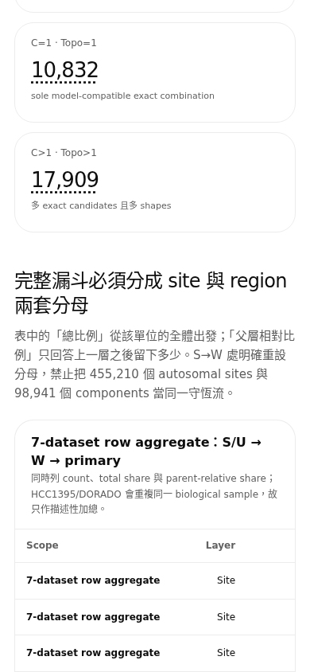
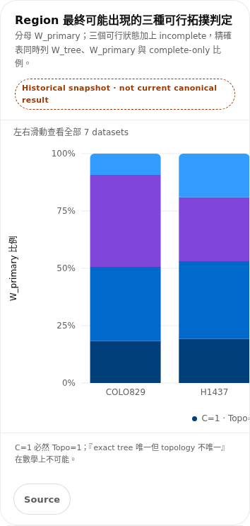
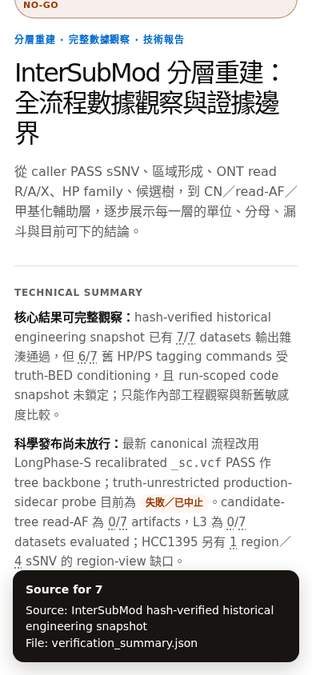

<!--
建立時間: 2026-07-11 15:20 +08:00
目標: 唯讀稽核分層重建 standalone HTML 的格式、資訊架構、responsive、可及性與 generator drift
處理範圍: InterSubMod/docs/reports/in_progress/2026/07/20260711_分層重建數據全景觀察_01/
任務類型: E — Hotfix / Bugfix audit（只產生 findings，不修改原 HTML 或 generator）
服務目標: G5 — 業界級、可被外部驗證的展示與證據鏈
關聯檔案:
  - InterSubMod/docs/reports/in_progress/2026/07/20260711_分層重建數據全景觀察_01/20260711_分層重建全景數據觀察_01.standalone.html
  - InterSubMod/research/20260710_layered_reconstruction_v2/scripts/build_layered_observation_report.py
  - InterSubMod/docs/CURRENT_FOCUS.md
-->

# 分層重建全景報告：format / structure / generator drift audit

> **TL;DR：產物不是手改漂移，desktop / dark / runtime 基礎健康；但仍有 6 個 P1 展示風險，最高優先是「舊 probe 與 current raw-all 狀態分流」、移除正文數字旁的 5,657 個 JSON/source tooltip，以及修正 mobile topbar 與 14 張橫向圖表。（影響：高，信心：高）**

敘述框架：SCQA（現況 → 呈現衝突 → 如何避免讀錯 → generator-first 修法）。

## 1. Audit scope

- **產品表面**：單一離線 technical standalone HTML。
- **主要讀者任務**：教授或研究 reviewer 先理解 evidence boundary，再沿 S→W→HP→C→Topo 檢視 aggregate、dataset 與 limitations。
- **可及性目標**：WCAG 2.2 AA 方向性稽核；本輪不是完整符合性宣告。
- **捕捉工具**：本機 Playwright Chromium；本輪重新產生截圖，不引用既有 `browser_qa/` 當稽核證據。
- **禁止動作**：未修改原 HTML、generator、data JSON 或研究數據。

Severity：`P0` 會直接造成錯誤發布／無法完成任務；`P1` 高風險理解或操作缺口；`P2` 維護性／語意／polish。

## 2. 畫面流程與 health

### Step 1 — 進入報告與 claim ceiling：部分健康

NO-GO ribbon、historical wording 與四張 status cards 都明顯；但 production status 名稱仍會把已封存的 PASS-only probe 與後來的 raw-all producer 混在一起。



### Step 2 — 教授主鏈與 topology atlas：健康

S→W→HP→C→Topo 的單位轉換、auxiliary rail、三種可行狀態與不可能狀態都能在一張圖內讀完；沒有把 mutation-state graph 畫成 clone phylogeny。





### Step 3 — Dataset progressive disclosure：健康

七個 dataset 預設摺疊，避免初始頁面同時展開十四張大表；summary 文字可區分 dataset。



### Step 4 — Mobile entry：需要修正

390px 下正文 reflow 正常，但 topbar 的 brand 與 evidence cutoff 發生擠壓／截斷；恰好被截斷的是判讀 freshness 最重要的資訊。



### Step 5 — Mobile table / chart：需要修正

body 沒有全頁 overflow；表格、圖表與 explainer 都被收進局部水平容器。但 14 張圖各自固定 980px，390px 初始只看得到約兩個 dataset，跨樣本比較需要反覆橫滑。





### Step 6 — Mobile source tray：touch 可用、鍵盤／AT 不完整

觸控數字會打開底部 source tray；但 5,657 個正文 numeric spans 都不是原生 focusable controls。這也不符合最新要求：JSON 應放在摺疊資料抽屜的隱藏 href，不應黏在正文每個數字旁。



補充：dark mode 首屏視覺正常，證據見 `format_structure_screenshots/08-entry-desktop-dark.png`。

## 3. Strengths

1. `PARTIAL SCIENTIFIC VALIDATION · PUBLICATION NO-GO` 在首屏；14/14 chart cards 另有 `Historical snapshot · not current canonical result`。
2. 1 個 H1、16 個具 accessible name 的 figures、52/52 tables 有 caption、所有 TH 有 `scope`、duplicate DOM IDs=0。
3. 14/14 embedded charts runtime ready；console error=0、page error=0、remote dependency request=0。
4. 33 個 `<details>` 已把 glossary、exact data、dataset drill-down 與 provenance 分層。
5. Desktop、390px、320px 與 dark mode 都沒有 body-level overflow；未發現跑出受控 scroll container 的可見元素。
6. Skip link 可聚焦；14 個 chart-level Source buttons 最小 `68×44px`，mobile 為 `81×44px`。

## 4. Findings

### F-01 — Historical PASS-only probe 與 current raw-all producer 容易被讀成同一狀態

- **Severity**：P1 — scientific information architecture。
- **Selector / line**：產物 `.topbar .meta` [HTML:255]、`.metrics .metric:nth-child(3)` [HTML:275]、technical summary [HTML:268]；generator [build_layered_observation_report.py:1974]、[build_layered_observation_report.py:1989]、[build_layered_observation_report.py:1996]；最新 contract `InterSubMod/docs/CURRENT_FOCUS.md:15`、`:21`、`:23`。
- **原因**：HTML cutoff 是 `07:31`，顯示 `Production probe PASS 0/7` 與「失敗／已中止」，指的是 `PASS_ONLY_ABORTED_v1`；同日 15:15 的 normalized raw-all producer 已是 3/7 terminal PASS。兩者都真，但 generic label 會讓讀者誤以為 0/7 是 current overall state。舊 downstream rates 同時受 7/11 contract override 暫停。
- **應修位置**：**generator**；不可手改已凍結產物數字。
- **具體修法**：
  1. 把 card 改名為 `PASS-only probe（ABORTED）0/7`，顯示 exact run ID 與 cutoff。
  2. 另設 `normalized raw-all producer` track；若不在本 snapshot，顯示 `OUTSIDE THIS SNAPSHOT`，不要偷帶後來數字。
  3. sticky TOC 上方保留 persistent `HISTORICAL ENGINEERING BASELINE / DOWNSTREAM RATES PAUSED` state chip。
  4. generator 接收 machine-readable current-contract status 或至少產生可點的 `CURRENT_FOCUS` pointer；freshness 超過 current contract 時 fail-closed 標 `STALE SNAPSHOT`。

### F-02 — 5,657 個 inline JSON/source tooltips 造成正文噪音、DOM 膨脹與來源可及性缺口

- **Severity**：P1 — readability、accessibility、performance；也是最新明示格式需求。
- **Selector / line**：`.source-tooltip.inline-source`，例如 HTML [267–275]；generator `HtmlBuilder.tooltip()` / `number()` [build_layered_observation_report.py:675-686]；目前 validation 反而禁止 inline source 進 tab order [build_layered_observation_report.py:2631-2632]。
- **原因**：實測 5,671 source tooltips，其中 5,657 是 inline spans、0 個原生 focusable；桌面只能 hover，mobile touch tray 可開但硬體鍵盤／AT 不完整。每個數字都複製 `File: *.json`，形成 36,741 DOM nodes、2.91MB HTML，並讓數字呈現大量 dotted underline。
- **應修位置**：**generator**；不要手修產物。
- **具體修法（依最新要求）**：
  1. `builder.number()` 只輸出 plain formatted number，不在數字旁放 `.json`、path 或 tooltip。
  2. 以 section / chart / table 為單位建立去重 source registry；每張卡只有一個 `資料與來源` `<details>`。
  3. `.json` 來源改成**抽屜內的 `<a href="…">`**；抽屜關閉時 href 不出現在正文，展開才顯示。若檔案不可攜，顯示相對 artifact URI + hash，不顯示裸絕對路徑。
  4. chart-level `Source` button可改為展開同一 data drawer；summary 必須可鍵盤操作並有 `aria-controls` / `aria-expanded`。
  5. validation 改驗證「正文不存在 `File: *.json`」及「每個 source key 在 drawer registry 有且只有一個可達 href」，而不是複製數千 tooltip。

### F-03 — Mobile topbar 把 evidence cutoff 擠壓成不可讀字串

- **Severity**：P1 — freshness / trust cue 在窄螢幕失效。
- **Selector / line**：`.topbar`, `.brand`, `.meta` [HTML:55-58]；markup [HTML:253-255]；generator markup [build_layered_observation_report.py:1974-1977]。畫面證據：Step 4。
- **原因**：390px 下仍維持單列 flex；`.meta{max-width:45%;white-space:nowrap}` 與 brand 接在一起，出現 `InterSubMod ResearchEvidence cutoff…` 且日期被截斷。全域 `overflow-x:clip` [HTML:52] 進一步把問題藏掉。
- **應修位置**：**generator extra CSS**，或 upstream shell template；產物只重生。
- **具體修法**：`@media(max-width:600px){.topbar{flex-direction:column;align-items:flex-start;gap:3px}.meta{max-width:100%;white-space:normal;overflow:visible}}`；browser gate 增加 `.brand.right <= .meta.left` 或垂直不重疊斷言，並確認 cutoff 全字串可見。

### F-04 — Mobile 的 14 張跨樣本圖每張都固定 980px，只能分段看 dataset

- **Severity**：P1 — cross-sample comparison friction。
- **Selector / line**：`.report-chart [data-recharts-chart]` [HTML:236] / generator [build_layered_observation_report.py:2260]；`chart_block()` [build_layered_observation_report.py:1309-1326]。畫面證據：Step 5。
- **原因**：390px 下 14/14 chart wraps 都需要水平捲動；初始 topology chart 只看得到 COLO829/H1437，legend 也跟著被推到右側。使用者需在每張圖重複滑動，無法同時比較七列。
- **應修位置**：**generator chart spec / responsive renderer**。
- **具體修法**：
  1. 100% composition 圖在 `<600px` 改成七列 horizontal stacked small multiples，固定 dataset label 與 legend。
  2. ranking 圖直接改 responsive horizontal bars，不設 980px floor。
  3. 若保留水平圖，y-axis / legend 要移出 scroll viewport，並提供「精確數據」compact table 作預設 mobile fallback。
  4. browser gate 要驗證 390px 首屏能同時讀到 7 個 dataset labels，而不只檢查無 body overflow。

### F-05 — 54 個 mobile scroll regions 全部沒有 accessible name

- **Severity**：P1 — keyboard / assistive-technology orientation。
- **Selector / line**：`.table-scroll` [HTML:95,179]、`.chart-wrap` [HTML:236]、`.svg-explainer` [HTML:202-203]；generator [build_layered_observation_report.py:1317-1322]、[build_layered_observation_report.py:2203-2204]、[build_layered_observation_report.py:2225-2227]。
- **原因**：390px 實測 54/54 containers 可水平捲動（38 tables、14 charts、2 SVG explainers），但 `role` 與 `aria-label` 全為 null。Table wrappers 有 `tabindex=0`，卻無可宣告的 region name；chart / SVG wrappers也沒有明確 keyboard scroll contract。
- **應修位置**：**generator**。
- **具體修法**：每個 scroll wrapper 加 `role="region" tabindex="0" aria-labelledby="<card-title-id>"`；表格可用 caption ID，chart 用 H3 ID，explainer 用 figcaption ID。加 focus-visible outline 與 `aria-describedby` 指向「可水平捲動」提示；QA 斷言所有 `scrollWidth>clientWidth` 的容器都有 accessible name。

### F-06 — 30k-pixel mobile report 只有 6 個 TOC anchors，教授閱讀線與完整 technical appendix 未真正分層

- **Severity**：P1 — information architecture / discoverability。
- **Selector / line**：`.mini-toc` [HTML:182-185,280]；generator [build_layered_observation_report.py:2001-2005]、[build_layered_observation_report.py:2206-2209]；mobile 另把 nav 改成 static [build_layered_observation_report.py:2259]。
- **原因**：mobile document height 30,098px，包含 14 charts、52 tables、33 details、20 個 H2 級主題；TOC 只有總流程、完整漏斗、名詞、拓撲、dataset、限制六項，沒有 evidence tracks、14-chart atlas、HCC gap、methods、next steps、open questions。Mobile nav 又不 sticky，進入中後段很難返回或換章。
- **應修位置**：**generator IA**。
- **具體修法**：
  1. 首層保留「教授 5 分鐘路線」：一句結論 → evidence status → 主鏈 → 4 個代表性視角 → limitations / next gate。
  2. 14 charts、per-dataset tables、method/provenance 移到 `Technical appendix` details / secondary route。
  3. TOC 增加 `evidence status`、`chart atlas`、`HCC gap`、`methods`、`next gate`、`open questions` anchors。
  4. Mobile 使用 sticky compact select / back-to-top，不重建整排 chips。

### F-07 — Dataset section heading hierarchy 從 H2 直接跳 H4

- **Severity**：P2 — semantic reading order。
- **Selector / line**：`#dataset-views > .dataset-list > details.dataset-detail > summary + … + h4` [HTML:568-617]；generator [build_layered_observation_report.py:1956-1960]。
- **原因**：dataset 名稱只在 `<summary>`，不是 heading；之後直接出現 H4。DOM heading sequence 因此由 `7 個 dataset 的單獨檢視` H2 跳到多個 H4，screen-reader heading navigation 缺 H3 dataset 層。
- **應修位置**：**generator**。
- **具體修法**：給 summary 內文字一個可被 AT 辨識的 H3 層（例如 `role="heading" aria-level="3"` 的 span，或 details 前的 visually-hidden H3），再保留內部 H4；QA 檢查 heading level jump ≤1。

### F-08 — 目前未偵測到產物手改漂移，但 standalone companion 沒有自足的 generator custody

- **Severity**：P2 — provenance / future drift detection。
- **Selector / line**：footer [HTML:724]、provenance builder path [HTML:698]；validation emission [build_layered_observation_report.py:2646-2663]。
- **原因**：本輪 hash 對帳完全吻合：HTML=`2098e249…`、data=`78cec57a…`、generator=`94fa61a5…`，前兩者吻合 validation，generator 吻合 evidence ledger；因此**沒有手改 drift**。但 validation JSON 只記 output/data hash，沒有 generator、shell template、embed helper hash；將目錄單獨交付後仍需外部 ledger 才能證明 generator custody。
- **應修位置**：**generator validation / source-notes schema**。
- **具體修法**：companion validation 增加 `generator_path+sha256`、`shell_template_sha256`、`embed_helper_sha256`、input manifest/root receipt hash；HTML provenance drawer 顯示短 hash。重生時 fail if companion 指紋與 active tools 不同。

### F-09 — Shell、report extra CSS 與 embedded runtime 三層 cascade 缺明確 ownership

- **Severity**：P2 — generator maintenance drift。
- **Selector / line**：HTML `:root` [9,117,158,989]、`@media max-width:800` [138,233,782]；generator 以字串插入 CSS [build_layered_observation_report.py:2180-2274]。
- **原因**：同一 token / breakpoint / tooltip 行為由 shell、report extra CSS、runtime CSS 多次覆寫；目前畫面通過，但未來任一 template 更新可能悄悄改 contrast、font、mobile tooltip 或 overflow。
- **應修位置**：**generator + shell/embed contract**。
- **具體修法**：用 `@layer shell, report, runtime` 或明確 `[data-report-audience="technical"]` scope；tokens 只在一處定義；建立 computed-style snapshot gate（light/dark、390/1440）檢查核心 token 與 breakpoint 行為。

## 5. Generator drift verdict

| 檢查 | 實際結果 | Verdict |
|---|---:|---|
| Standalone SHA-256 | `2098e2493e621843b1e9692053c4396d17af0060a508abe4d52a75f18fa842af` | 與 validation 相同 |
| Data SHA-256 | `78cec57adff20d6d3c21acd29e75499acee3be220fdc27012a0029bcbe9d3042` | 與 validation 相同 |
| Generator SHA-256 | `94fa61a500d28de94874c35c3cc6e182b454290c88f520a81c317e0aae60bbda` | 與 evidence ledger 相同 |
| 產物手改 drift | 未偵測到 | PASS |
| Scientific freshness | 07:31 snapshot 與 15:15 current raw-all 狀態不同 | 必須分 track；不是手改 drift |

## 6. Verification evidence

### Inputs

- `/big7_disk/liaoyoyo2001/InterSubMod/docs/reports/in_progress/2026/07/20260711_分層重建數據全景觀察_01/20260711_分層重建全景數據觀察_01.standalone.html`
- `/big7_disk/liaoyoyo2001/InterSubMod/research/20260710_layered_reconstruction_v2/scripts/build_layered_observation_report.py`
- `/bip7_disk/liaoyoyo2001/.codex/plugins/cache/openai-curated-remote/data-analytics/0.2.6-d37358633e00/assets/html-report-shell.html`
- `/bip7_disk/liaoyoyo2001/.codex/plugins/cache/openai-curated-remote/data-analytics/0.2.6-d37358633e00/skills/build-report/scripts/embed_html_report_runtime.py`

### Commands

```bash
python3 -m py_compile research/20260710_layered_reconstruction_v2/scripts/build_layered_observation_report.py
python3 /tmp/verify_layered_panorama_static.py
python3 /tmp/audit_layered_panorama_format.py
sha256sum research/20260710_layered_reconstruction_v2/scripts/build_layered_observation_report.py \
  docs/reports/in_progress/2026/07/20260711_分層重建數據全景觀察_01/20260711_分層重建全景數據觀察_01.standalone.html \
  docs/reports/in_progress/2026/07/20260711_分層重建數據全景觀察_01/20260711_分層重建全景數據觀察_01.data.json
```

### Actual output excerpts

- Python compile：exit `0`。
- HTML parser：`html/head/body = 1/1/1`。
- Inline scripts：JavaScript `2/2 PASS`；embedded JSON `1/1 PASS`。
- Links：fragment `7`、broken `0`；local links `0`；remote citations `5`；remote/local runtime dependencies `0`。
- Chromium：14/14 charts ready；console errors `0`；page errors `0`；external requests `0`。
- Body overflow：1440=`1440/1440`；390=`390/390`；320=`320/320`。
- DOM：36,741 nodes；HTML 2,914,792 bytes；local charts-ready 約 2.5–2.7 秒。
- Accessibility static checks：figures unnamed `0`；tables missing captions `0`；TH missing scope `0`；duplicate IDs `0`；skip-link focus `PASS`。

## 7. Evidence limits

- 未執行 NVDA、JAWS、VoiceOver 或 TalkBack 真實 screen-reader session。
- 未宣稱完整 WCAG AA；contrast 本輪只以截圖與既有 token 判讀，沒有逐一量測 14-chart palette 的所有相鄰色。
- 未重算研究 headline 數字；本文件只檢查其 grain／denominator／historical 標籤在介面上是否容易被讀錯。
- 未驗證五個外部文獻連結的網路可達性；只驗證它們不是 runtime dependency。
- 未修改或重生原產物，因此 findings 對應的是 SHA-256 鎖定的 07:31 snapshot。

## 8. 建議修正順序

1. **P1-A**：先落地 F-02 最新要求——正文 numeric 取消 inline JSON/source tooltip，JSON href 全移到摺疊 data drawer。
2. **P1-B**：F-01 把 PASS-only aborted 與 normalized raw-all 分成兩條 evidence tracks，並保留 persistent historical warning。
3. **P1-C**：一起修 F-03～F-05 mobile topbar、responsive charts 與 scroll-region accessible names。
4. **P1-D / P2**：重排教授路線與 appendix，再補 heading hierarchy、generator custody 與 CSS ownership。

## 9. 2026-07-11 修正後 readback（16:24 Asia/Taipei）

本節是重新生成後的驗證；前述 findings 保留為 **before baseline**，不可再用其舊 hash 或舊版面尺寸描述目前產物。

### 9.1 修正結果

| 原 finding | 修正後狀態 | 實際證據 |
|---|---|---|
| F-01 current／historical evidence track 混用 | **Resolved** | 首屏先顯示 normalized raw-all `3/7 PASS`、`H1437` 進行中；historical 7-row 數字降為明確附錄 |
| F-02 數字旁 `.json` tooltip 造成閱讀雜訊 | **Resolved** | inline source tooltip=`0`；數字保留 5,661 個不可見 source-key annotation；JSON 只在摺疊「資料與驗證」與圖表「來源」連結的 `href` 中 |
| F-03 mobile topbar 截斷 | **Resolved** | 390×844 Chromium 截圖完整顯示 metadata／partial ribbon，body overflow=`0 px` |
| F-04 14 charts 壓縮手機閱讀 | **Mitigated** | 14 圖移入預設收合 historical appendix；需要時才展開，圖表容器可水平捲動且有 accessible name |
| F-05 unnamed scroll regions | **Resolved** | `.table-scroll`、`.chart-wrap` 皆具可讀 `aria-label` 並通過鍵盤 focus indicator 檢查 |
| F-06 主要閱讀路線過長 | **Resolved** | historical aggregate、14 圖、7 dataset 明細、HCC drilldown、unit dictionary 改為 progressive disclosure |
| F-07 heading hierarchy | **Resolved** | dataset 內部標題由 H4 修正為 H3；readback heading sequence 無 H2→H4 跳級 |
| F-08 generator custody | **Resolved** | shell、runtime source/style、source-tooltip、embed helper、chart contract 與 dependency 已 vendored 到 cycle-scoped `report_runtime/`；data snapshot 鎖定 builder／shell／helper／contract hash，不再依賴會輪替的 plugin cache |
| F-09 CSS ownership | **Open / maintenance** | 本輪 computed browser readback 通過；`@layer` ownership 尚未重構 |

### 9.2 Before → after 量化差異

| 指標 | Before | After | 差異 |
|---|---:|---:|---:|
| HTML bytes | 2,914,792 | 985,978 | −66.2% |
| DOM elements | 36,741 | 19,716 | −46.3% |
| desktop page height | 22,034 px | 9,142 px | −58.5% |
| mobile page height | 30,098 px | 14,434 px | −52.0% |
| inline source tooltips | 5,657 | 0 | −100% |
| 預設可見 tables | 9 | 2 | −77.8% |

### 9.3 修正後命令、輸入與輸出

輸入：

- `InterSubMod/research/20260710_layered_reconstruction_v2/scripts/build_layered_observation_report.py`
- `/big7_disk/liaoyoyo2001/big7_disk_output/synthesis/research_rounds/20260710_232501_layered_reconstruction_v2/`
- `/big7_disk/liaoyoyo2001/big7_disk_output/synthesis/research_rounds/20260711_longphase_s_raw_all_production_sidecars_v2/`

命令：

```bash
python3 research/20260710_layered_reconstruction_v2/scripts/build_layered_observation_report.py \
  --run-root /big7_disk/liaoyoyo2001/big7_disk_output/synthesis/research_rounds/20260710_232501_layered_reconstruction_v2 \
  --production-root /big7_disk/liaoyoyo2001/big7_disk_output/synthesis/research_rounds/20260711_longphase_s_raw_all_production_sidecars_v2 \
  --output-dir docs/reports/in_progress/2026/07/20260711_分層重建數據全景觀察_01 \
  --shell-template research/20260710_layered_reconstruction_v2/report_runtime/html-report-shell.v0.2.6.html \
  --embed-helper research/20260710_layered_reconstruction_v2/report_runtime/embed_html_report_runtime.v0.2.6.py \
  --hcc-hc-bed /big8_disk/data/HCC1395/SEQC2/High-Confidence_Regions_v1.2.bed \
  --hcc-cn-bed /big8_disk/data/HCC1395/SEQC2/CNV/ngs_benchmark_cnvs_gain_loss_loh.bed

python3 docs/reports/in_progress/2026/07/20260711_分層重建數據全景觀察_01/audit/before/capture_before_baseline.py \
  --output-dir docs/reports/in_progress/2026/07/20260711_分層重建數據全景觀察_01/audit/after \
  --metrics docs/reports/in_progress/2026/07/20260711_分層重建數據全景觀察_01/audit/after/metrics.json \
  --reuse-screenshots
```

輸出：

- `InterSubMod/docs/reports/in_progress/2026/07/20260711_分層重建數據全景觀察_01/20260711_分層重建全景數據觀察_01.standalone.html`
- `InterSubMod/docs/reports/in_progress/2026/07/20260711_分層重建數據全景觀察_01/audit/after/metrics.json`
- `InterSubMod/docs/reports/in_progress/2026/07/20260711_分層重建數據全景觀察_01/audit/after/desktop_viewport.png`
- `InterSubMod/docs/reports/in_progress/2026/07/20260711_分層重建數據全景觀察_01/audit/after/mobile_viewport.png`
- `InterSubMod/research/20260710_layered_reconstruction_v2/report_runtime/`（cycle-scoped、hash-locked renderer source bundle）

實際輸出片段：Chromium `147.0.7727.15`；`37/37 PASS`；console/page/request errors=`0/0/0`；desktop/mobile body overflow=`0/0 px`；39/39 details 兩種 viewport 均可開啟；6/6 internal navigation 兩種 viewport 均通過。

目前 HTML SHA-256：`069980a2de9c236aa075c6a17ab1150ce0df16a17856a3f39a411c89b5e9ffe6`。
