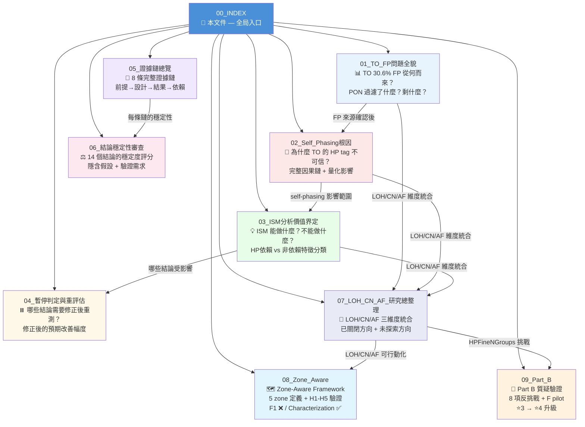
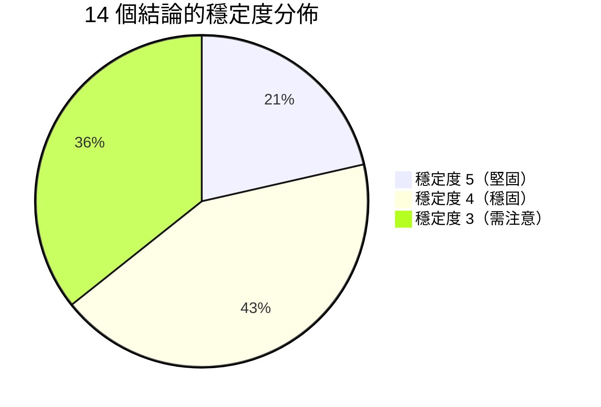
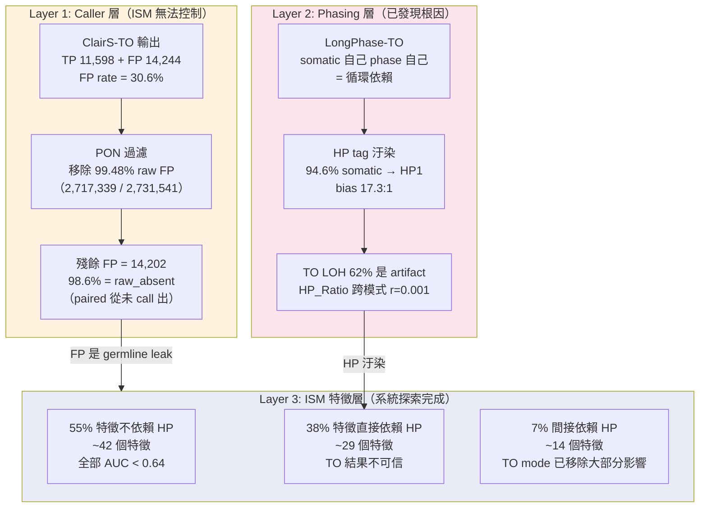
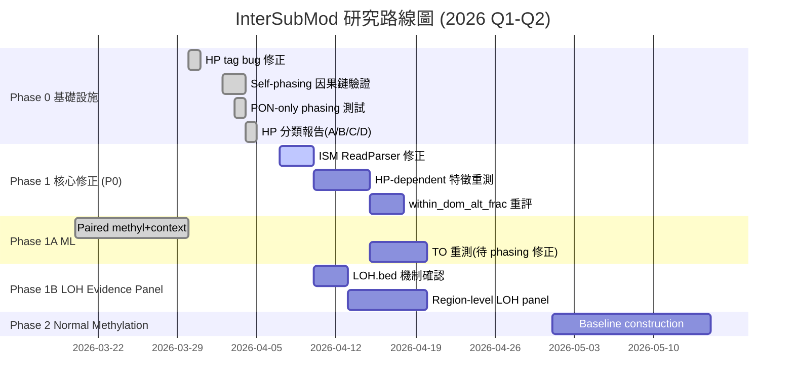

<!--
建立時間: 2026-04-04 21:00
更新時間: 2026-04-18
目標: InterSubMod 研究全景索引 — 多檔案文件系統入口
處理範圍: 2026-03-11 至 2026-04-18 全部研究方向的整理、驗證與路線圖
關聯檔案:
  - docs/reports/research_landscape/01_TO_FP問題全貌.md
  - docs/reports/research_landscape/02_Self_Phasing根因.md
  - docs/reports/research_landscape/03_ISM分析價值界定.md
  - docs/reports/research_landscape/04_暫停判定與重評估.md
  - docs/reports/research_landscape/05_證據鏈總覽.md
  - docs/reports/research_landscape/06_結論穩定性審查.md
  - docs/reports/research_landscape/07_LOH_CN_AF_研究總整理.md
  - docs/reports/research_landscape/08_Zone_Aware.md
  - docs/reports/research_landscape/09_Part_B.md
-->

# InterSubMod 研究全景文件系統

> **版本**: v1.2 (2026-04-18)
> **涵蓋範圍**: 2026-03-11 ~ 2026-04-18 全部研究方向
> **目的**: 輔助研究者與合作者快速理解目前研究狀態、推論邏輯與待驗證事項

### 關鍵圖表速覽

| 圖表 | 說明 | 位置 |
|------|------|------|
|  | 14 結論穩定度 + 特徵 HP 依賴分類 | 本文件 / 06 |
|  | TO FP 三層過濾：PON 99.48% → ISM 0% | 01 |
|  | HP bias 17.3:1 + LOH 組成 + 修正預測 | 02 |
|  | 8 條證據鏈層次與依賴關係 | 05 |
|  | 修正後研究路徑分支 | 04 |
| 🗺️ Zone-Aware Framework | Z1-Z5 zone 定義 + TO Z3 最低 TP rate 0.608 | 08 |
| 🔬 Part B 驗證矩陣 | 8 項質疑全通過 + F pilot 新 canonical filter | 09 |

---

## 一句話摘要

**InterSubMod 嘗試用甲基化特徵區分 TO 模式的 TP/FP，歷經 60+ 特徵 × 3 層次 × 7 樣本的系統探索後，發現 (1) self-phasing 循環依賴汙染了約 38% 的特徵，(2) 不依賴 HP 的 55% 特徵全部 AUC < 0.64，(3) 根因是 TO 的 31% FP 為 germline leak，甲基化上與 TP 不可區分。研究重心已從「variant filter」轉向「read-level epigenetic characterization」。**

---

## 文件導覽圖

---

## 建議閱讀順序

| 閱讀目的 | 建議路徑 | 預估時間 |
|----------|----------|----------|
| **快速掌握全貌** | 本文件 → 01 (前半) → 02 (機制圖) | 15 min |
| **理解推論邏輯** | 01 → 02 → 03 → 04 | 40 min |
| **審查結論可靠性** | 05 → 06 | 30 min |
| **規劃下一步實驗** | 04 → 06 (驗證需求欄) | 20 min |
| **LOH/CN/AF 維度統合** | 07（三維度交叉 + 未探索方向） | 25 min |
| **Zone-Aware 框架** | 07 → 08（從 LOH/CN/AF 到 zone confidence） | 20 min |
| **Part B 質疑驗證** | 09（8 項反挑戰 + F pilot 新 filter） | 30 min |

---

## 全局研究狀態速覽

### 研究方向結論總表

| # | 方向 | 結論 | 穩定度 | HP 依賴 | 文件 |
|---|------|------|--------|---------|------|
| 1 | Paired/TO 分離 | **CONFIRMED** | ⭐5 | 無 | 01, 05 |
| 2 | PON 移除 99.48% FP | CONFIRMED | ⭐3 | 無 | 01 |
| 3 | TO 無特徵 AUC>0.58 | **NEGATIVE** | ⭐4 | 混合 | 03, 05 |
| 4 | O11 heterogeneity | **NEGATIVE** | ⭐5 | 無 | 05, 06 |
| 5 | O12 LOH 場景 | **NEGATIVE** | ⭐4 | 部分 | 05, 06 |
| 6 | O13 跨區域 correlation | **NEGATIVE** | ⭐5 | 無 | 05, 06 |
| 7 | G1-G7 germline FP 識別 | **NO-GO** | ⭐4 | 無 | 03, 05 |
| 8 | Read-level FP 識別 | **CONDITIONAL NO-GO** | ⭐3 | 部分 | 04, 06 |
| 9 | Self-phasing 是 TO LOH 主因 | **CONFIRMED** | ⭐4 | — | 02, 05 |
| 10 | PON-only phasing | **PARTIAL SUCCESS** | ⭐4 | — | 02, 04 |
| 11 | Phase 1A paired F1+0.011 | **POSITIVE** (弱) | ⭐3 | 部分 | 04, 06 |
| 12 | ASM 32-66% | **POSITIVE** | ⭐4 | 部分 | 03, 05 |
| 13 | LOH.bed Jaccard=0.847 | 觀察值 | ⭐3 | 無 | 06 |
| 14 | QS TO AUC=0.497 | **NEGATIVE** | ⭐4 | 間接 | 03, 06 |
| 15 | LOH Subclone AF×Methylation | **POSITIVE** (雙模式確認) | ⭐4 | 部分 | 07 |
| 16 | CNV zone-aware filter | **CLOSED** | ⭐4 | 無 | 07 |
| 17 | Coverage_Multiple CN proxy | **CONFIRMED** (r=0.831) | ⭐4 | 無 | 07 |
| 18 | 甲基化 vs CN | **NEGATIVE** (CN-blind) | ⭐4 | 無 | 07 |
| 19 | GC bias 校正 | **NOT NEEDED** | ⭐4 | 無 | 07 |
| 20 | Zone-Aware F1 (H2) | **NEGATIVE** | ⭐4 | 無 | 08 |
| 21 | Zone Characterization | **CONFIRMED** | ⭐3 | 部分 | 08 |
| 22 | HPFineNGroups (Part B 精確化) | **POSITIVE REFINED** | ⭐4 | 間接 | 09 |

---

## 核心問題的三層結構

---

## 研究路線圖

---

## 待驗證事項清單 (按優先級排序)

### P0 — 阻塞性（必須先完成才能推進）

- [ ] **ISM ReadParser 修正**：忽略 somatic HP tags (HP:i:11/21/33)，只使用 germline HP:i:1/2
- [ ] **HP-dependent 特徵全量重測**：PON-only phasing + 修正 ReadParser 後，重跑 29 個 B 類特徵
- [x] **LOH.bed 生成機制確認**：已確認基於 VCF AF/VAF（`PhasingGraph.cpp:1817`）（2026-04-11 完成）

### P1 — 重要（影響結論可靠性）

- [ ] **多樣本 PON-only phasing**：在 COLO829, HCC1954 等 2-3 個額外樣本驗證
- [ ] **within_dom_alt_frac 重測**：self-phasing 修正後 AUC 變化（預期可能改善）
- [ ] **Purity estimation 修復**：PON-only 後 purity 從 0.927→0，需排查根因
- [ ] **H2009 Phase 1A 負向根因**：7 個樣本中唯一負向，需解釋

### P2 — 補強（提升論文說服力）

- [ ] PON 覆蓋率跨樣本穩定性（6 個非 HCC1395 樣本）
- [ ] ASM 效應量門檻分析（|delta|>0.2 後比例變化）
- [ ] GBM/RF 非線性模型測試（確認 LR LOSO 0.638 是天花板）
- [ ] 低純度臨床樣本驗證（purity 30-70%）
