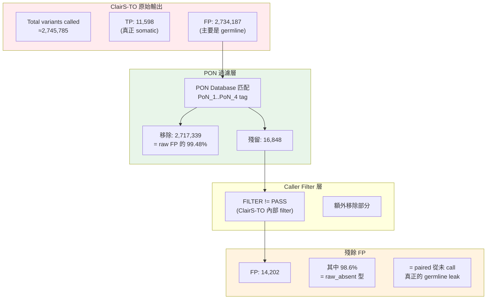
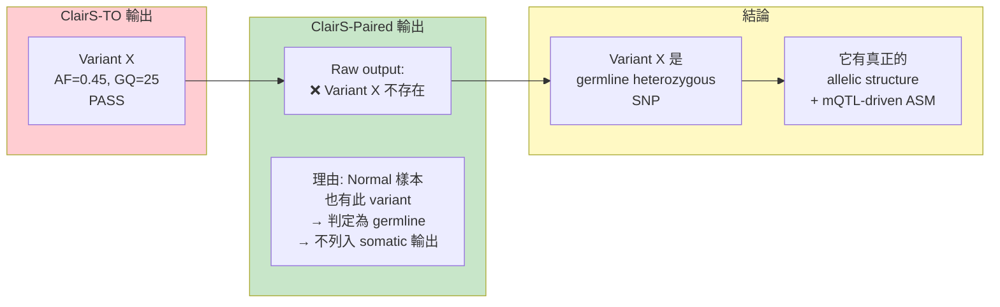
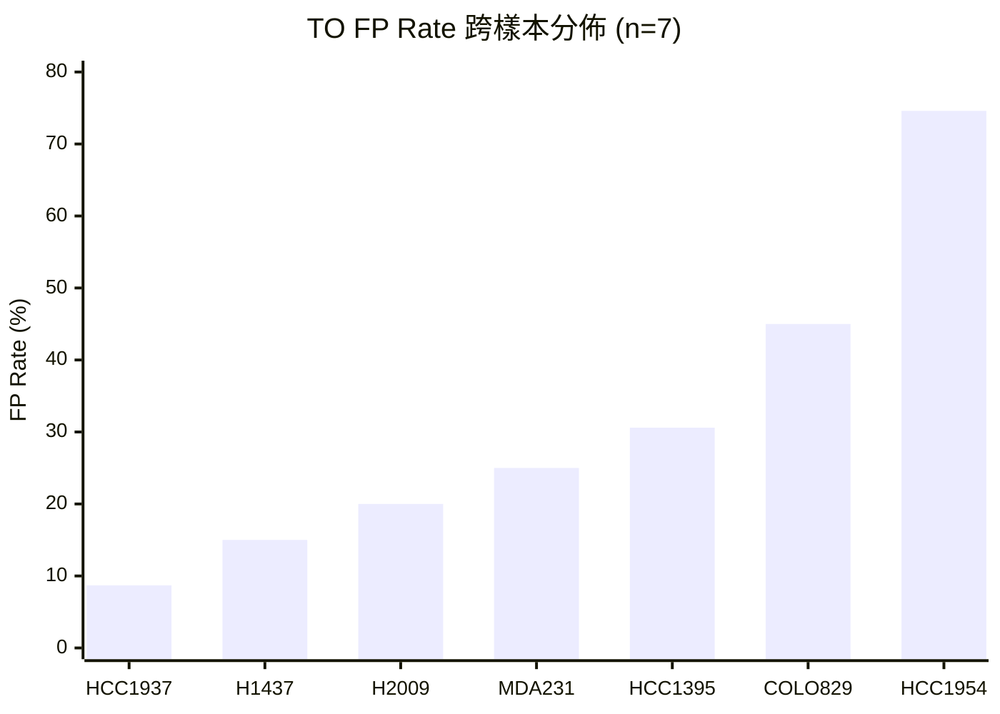
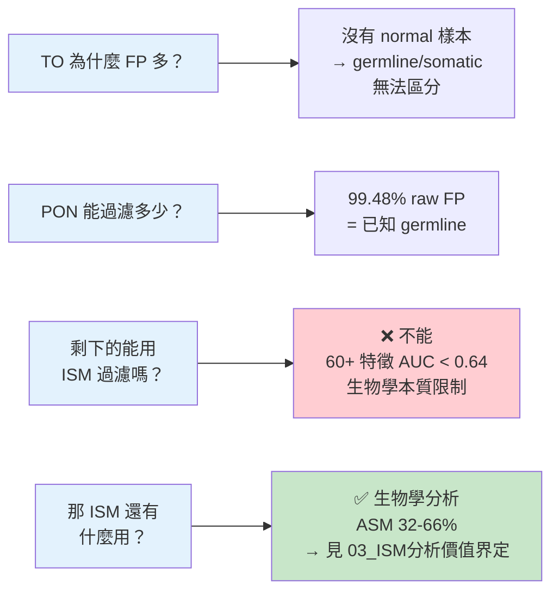

<!--
建立時間: 2026-04-04 21:10
目標: 完整說明 TO 模式 FP 問題的來源、規模與 PON 過濾效果
處理範圍: ClairS-TO FP 來源分析、PON 過濾層級、殘餘 FP 特性
關聯檔案:
  - docs/reports/research_landscape/02_Self_Phasing根因.md
  - docs/reports/research_landscape/03_ISM分析價值界定.md
-->

# TO FP 問題全貌：30.6% 的 FP 從何而來？

---

## 問題背景

InterSubMod (ISM) 分析 somatic variant 位點的甲基化模式。在 **Paired 模式**下，有 normal 樣本做對照，somatic variant caller (ClairS) 的 FP rate 很低（~1.04%）。但在 **Tumor-Only (TO) 模式**下，沒有 normal 樣本，variant caller (ClairS-TO) 無法區分 germline variant 和 somatic variant，FP rate 高達 **30.6%**。

**核心問題**：這 30.6% 的 FP 是什麼？ISM 能否透過甲基化特徵把它們過濾掉？

---

## FP 來源的三層過濾結構

### 數據解讀

| 層級 | 輸入 FP 數量 | 移除數量 | 移除率 | 說明 |
|------|------------|---------|--------|------|
| **Layer 1: PON** | 2,734,187 | 2,717,339 | **99.48%** | 已知 germline variants (gnomAD/CoLoRSdb) |
| **Layer 2: Caller filter** | 16,848 | ~2,646 | ~15.7% | ClairS-TO 內部品質過濾 |
| **Layer 3: ISM** | 14,202 | **0** | **0%** | 所有特徵 AUC < 0.64，無法過濾 |

> **關鍵結論**：PON 是最強大的 germline filter（單獨移除 99.48%），但殘餘的 14,202 個 FP 是 PON database 覆蓋不到的罕見 germline variants。它們具有真正的 allelic structure 和 ASM，甲基化特徵上與 somatic TP **不可區分**。

---

## 殘餘 FP 的本質：為什麼 ISM 無法過濾？

### 98.6% FP 是 "raw_absent" 型

**raw_absent 的定義**：這些 variants 在 ClairS-TO 中被 call 出（通過所有品質 filter），但在 ClairS-Paired 的原始輸出中**從未出現**——即使是 raw output（未經 filter）也沒有。

### 為什麼甲基化無法區分

**直白解釋**：這些殘餘 FP 是「真正的 heterozygous germline variants」。它們在基因組中天然存在兩個等位基因 (REF/ALT)，每個等位基因可能有不同的甲基化模式（這就是 mQTL-driven ASM）。而 somatic TP 也是 heterozygous 的（腫瘤中產生了 ALT allele），也可能因為表觀遺傳調控有 ASM。

**在 ISM 的分析解析度下**，兩者看起來完全一樣：
- 都有 REF 和 ALT reads
- 都可能有 allele-specific methylation
- 都有類似的 coverage、CpG density

| 比較維度 | Somatic TP | Germline FP (殘餘) |
|----------|-----------|-------------------|
| 有 ALT allele | ✅ | ✅ |
| Heterozygous | ✅ (AF 通常 0.1-0.5) | ✅ (AF 通常 ~0.5) |
| 存在 ASM | ✅ (32-66%) | ✅ (更高，mQTL 驅動) |
| CpG context | 隨機分佈 | 隨機分佈 |
| VCF 品質指標 | 高 (通過 PASS) | 高 (通過 PASS) |
| **唯一區別** | **只存在於腫瘤** | **也存在於 normal** |

> **結論**：唯一能區分它們的資訊是「normal 樣本中是否也有此 variant」——而這恰恰是 TO 模式下不可得的資訊。**這不是技術缺陷，是生物學本質限制。**

---

## 跨樣本 FP Rate 異質性

TO FP rate 在 7 個樣本間差異巨大（8.6 倍），這使任何跨樣本訓練的模型面臨嚴峻挑戰：

| 樣本 | TO FP Rate | 說明 |
|------|-----------|------|
| HCC1395 | 30.6% | 基準樣本（SEQC2 truth set） |
| HCC1954 | **74.6%** | 最高 FP rate |
| COLO829 | ~45% | 黑色素瘤 |
| H1437 | ~15% | 肺腺癌 |
| H2009 | ~20% | 肺腺癌 |
| HCC1937 | **8.7%** | 最低 FP rate |
| MDA-MB-231 | ~25% | 三陰性乳癌 |

---

## PON 99.48% 的注意事項

### 穩定度評分：⭐3/5

**已驗證**：在 HCC1395 5kHz 上精確計量 (2,717,339 / 2,731,541)

**未驗證的隱含假設**：
1. **單一樣本推廣性** — 99.48% 是否在所有樣本上穩定？不同種族/族群的 rare germline variants 組成不同，PON 覆蓋率可能因樣本而異
2. **PON 單獨 vs PON+Caller 交互** — 部分 variants 可能被 PON 和 caller filter 共同移除，歸因可能不完全準確

**即使 PON 率下降到 95%，結論本質不變**：PON 仍是最強 germline filter，殘餘 FP 仍是 germline leak，ISM 仍無法過濾。

**需要的驗證**：在其他 6 個樣本上分別計算 PON 移除率。

---

## 本章小結

