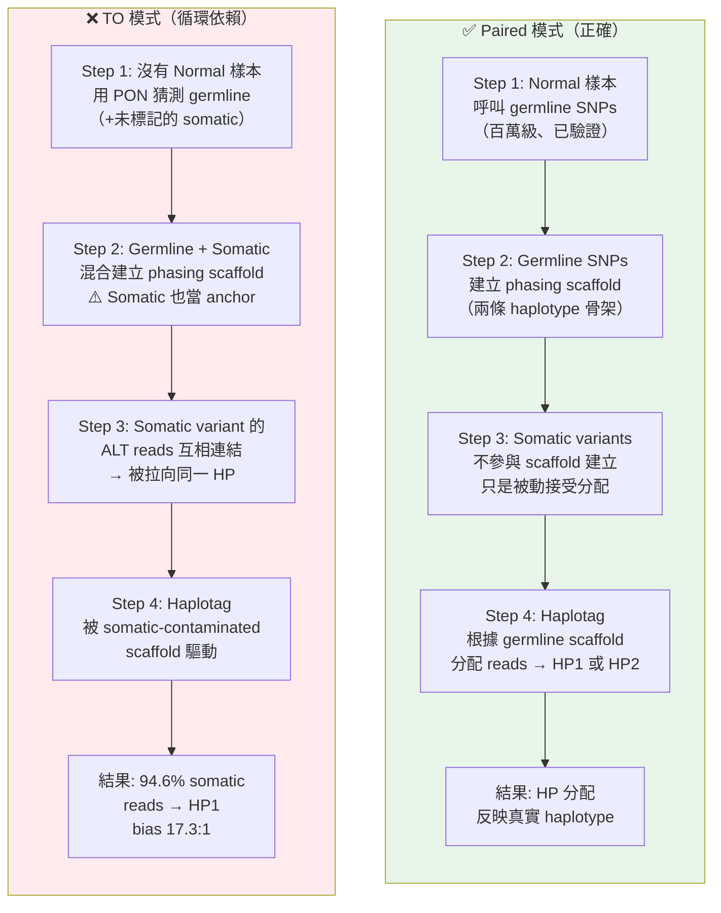
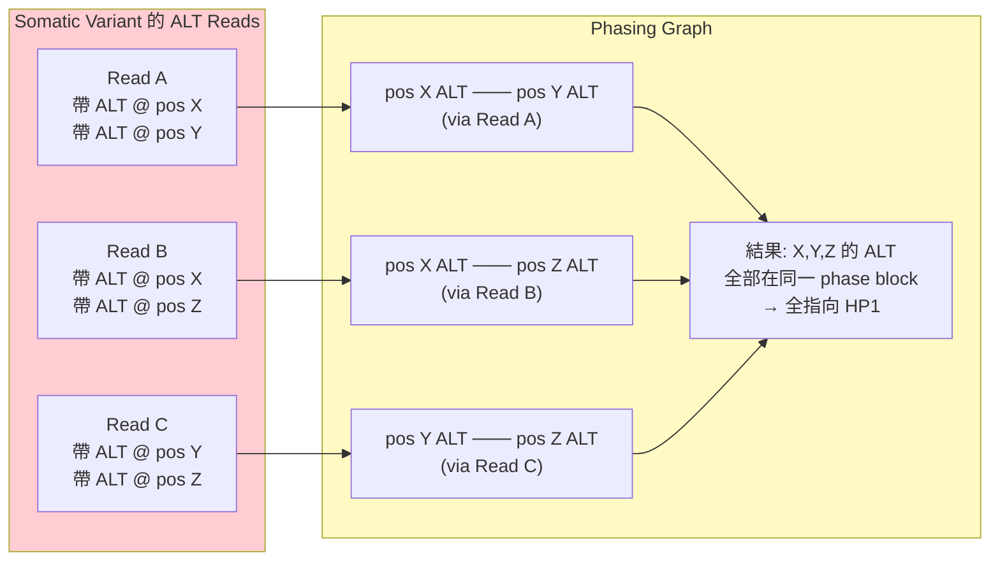
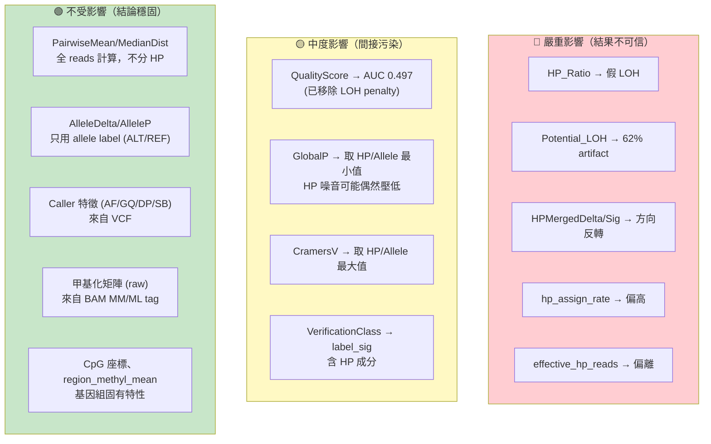
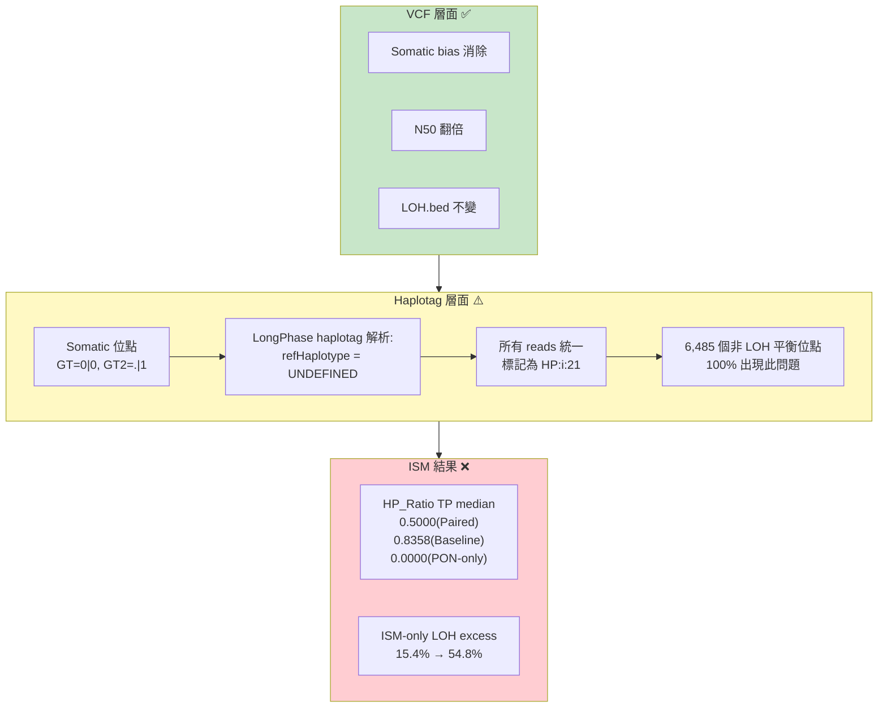
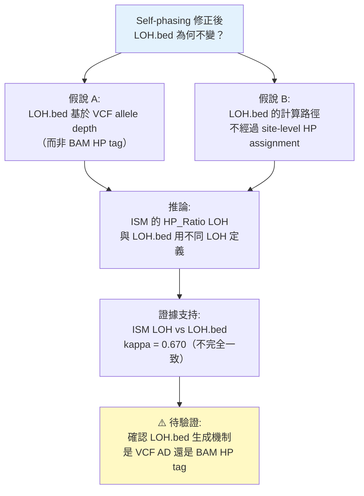

<!--
建立時間: 2026-04-04 21:20
目標: 完整說明 self-phasing circular dependency 的機制、影響與修正狀態
處理範圍: Self-phasing 因果鏈 S0-S5 + PON-only phasing 測試結果
關聯檔案:
  - research/loh_investigation/reports/20260403_pon_only_phasing_verification_report.md
  - research/loh_investigation/reports/20260403_pon_only_haplotag_ism_verification_report.md
  - docs/reports/research_landscape/04_暫停判定與重評估.md
-->

# Self-Phasing 根因：為什麼 TO 的 HP tag 不可信？

---

## 一句話說明

**LongPhase-TO 讓 somatic mutation 自己決定自己被分到哪個 haplotype，形成「球員兼裁判」的循環依賴。**

---

## 正確流程 vs 問題流程

---

## 用具體數字走過一個例子

假設有一個 **AF=0.3 的 somatic variant**（chr1 位置 X），腫瘤中 30% reads 帶 ALT，70% 帶 REF。

### Paired 模式

1. Normal 樣本沒有這個 variant → 確認為 somatic
2. Phasing scaffold 由 germline SNPs 建立（不含此 variant）
3. Haplotag 根據 scaffold 分配 reads
4. 30% ALT reads 隨機分到 HP1/HP2（取決於此 variant 實際位於哪條 haplotype）
5. **HP_Ratio ≈ 0.5**（如果 LOH 則會偏移）

### TO 模式

1. 此 variant 未被 PON 標記 → 被視為 germline 或 unknown
2. 在 phasing graph 中，此 variant 的 ALT reads 互相連結
3. 這些 ALT reads 上的其他 somatic variants 也連結進來
4. 形成一個巨大的 ALT-read cluster → **全部指向 HP1**
5. **HP_Ratio → 0.94**（偏向 HP1，產生假 LOH）

---

## 量化證據總表（穩定度 4/5）

| 證據項 | 數值 | 解讀 |
|--------|------|------|
| Somatic HP1:HP2 bias | **17.3:1** (614K vs 35K) | 94.6% somatic reads 偏向 HP1 |
| TO TP **ISM HP_Ratio LOH** 中 self-phasing 造成的比例 ⁽¹⁾ | **62%** 移除 self-phasing 後消失 | AF 0.1-0.8 近 100% |
| 全 TO **ISM HP_Ratio LOH** 中 self-phasing artifact ⁽¹⁾ | **31.2%** | 其餘 68.8% 為 structural ISM LOH |

> ⁽¹⁾ **LOH 層次說明（2026-04-19 P2-A 補註）**：此處 62%/31.2% 指 **ISM HP_Ratio LOH**（BAM HP tag 路徑），非 **LOH.bed region-level LOH**（VCF AF/VAF 路徑）。LOH.bed 在 PON-only 實驗中 Jaccard=1.0 完全不受 self-phasing 影響。
| 同位點 HP_Ratio 跨模式相關 | **r = 0.001**（288K pairs） | 完全不相關 |
| TO-only LOH 在 paired 下完全平衡 | **86.5%** | HP_Ratio 0.4-0.6 |
| Cohen's d (HP_Ratio 差異) | **-1.20** | 巨大效應量 |
| 跨樣本方向一致性 | **7/7 samples** | CV-2 全通過 |

> **7 個樣本全部觀察到相同方向的 self-phasing 效應，排除了樣本特異性的可能。**

---

## Self-Phasing 對 ISM 各輸出欄位的影響

### 影響程度分級

### 完整特徵分類數量

| 分類 | 特徵數 | 佔比 | TO 結果狀態 |
|------|--------|------|------------|
| **A. 完全不依賴 HP** | ~42 | 55% | 結論全部穩固，不需重測 |
| **B. 直接依賴 HP** | ~29 | 38% | TO 結果不可信，需修正後重測 |
| **C. 間接依賴 HP** | ~14 | 7% | 大部分影響微弱或已程式碼移除 |

> 詳細分類表見 [03_ISM分析價值界定.md](03_ISM分析價值界定.md)

---

## PON-Only Phasing 修正測試

### 修改內容

在 `LongPhase-TO` 的 `PhasingProcess.cpp` 中，first-pass phasing 前呼叫 `convertNonGermlineToSomatic()`，使 somatic variants 以 reduced edge weight 處理。新增 `--pon-only-phasing` CLI flag。

### VCF 層面結果（✅ 全面正確）

| 指標 | Baseline | PON-only | 判定 |
|------|----------|----------|------|
| LOH.bed Jaccard | — | **1.0000** | 完全一致 |
| Somatic HP1:HP2 bias | 17.3:1 | **消除** | self-phasing 解除 |
| Phase block N50 | 4,061 | **8,109 (+99.7%)** | 品質翻倍 |
| Phased rate | 54.9% | **78.5% (+23.6pp)** | 大幅改善 |
| 執行時間 | 2,693s | **1,976s (1.36× 快)** | bonus |

### Haplotag + ISM 層面結果（❌ 發現新問題）

### 根因與修復方向

**根因**：LongPhase-TO haplotag 的 GT 解析邏輯——對 PON-only phased VCF 中 somatic 位點的 `GT=0|0`（homozygous REF），`refHaplotype` 變成 `UNDEFINED`，導致所有覆蓋該位點的 reads 被統一標記為某一 HP。

**最低成本修復方案**：ISM 端的 ReadParser 忽略 somatic HP tags（HP:i:11/21/33），只使用 germline HP:i:1/HP:i:2。

**長期方案**：修正 LongPhase-TO haplotag 模組的 GT 解析邏輯，或實作二次 phasing。

### LOH.bed Jaccard=1.0 的意外發現

**一個重要問題**：如果 self-phasing 是 TO LOH 的主因（62% 消失），為什麼移除 self-phasing 後 LOH.bed 完全不變（Jaccard=1.0）？

> **這是 P0 優先級的待驗證事項**——它影響我們如何理解兩套 LOH 判定系統的關係。

---

## 本章小結

| 問題 | 答案 |
|------|------|
| Self-phasing 是什麼？ | Somatic variants 自己 phase 自己，造成 HP 分配偏向 HP1 |
| 影響有多大？ | 94.6% somatic reads → HP1；62% **ISM-level** LOH 是 artifact |
| 影響了哪些特徵？ | 29 個直接依賴 HP 的特徵（佔 38%）不可信 |
| 不影響什麼？ | 42 個不依賴 HP 的特徵（佔 55%）結論穩固 |
| 修正到什麼程度了？ | VCF 層面完美修正；Haplotag 層有新問題待修 |
| 修正後 TO 能接近 Paired 嗎？ | ❌ 不能。Self-phasing 只解釋 ~35% 問題，65% 是結構性差距 |

> **重要精確化（來自方法論審查）**：「62% TO LOH 是 artifact」中的 LOH 指的是 **ISM 計算的 HP_Ratio LOH**（HP_Ratio < 0.1 or > 0.9），而非 **LOH.bed region-level LOH**。PON-only phasing 實驗已證實 LOH.bed 完全不受 self-phasing 影響（Jaccard=1.0）。因此，self-phasing 的因果影響位於 **haplotag → ISM HP_Ratio** 這條路徑上，而非 LongPhase 的 LOH region detection。兩套 LOH 系統使用不同定義（kappa=0.670 的不一致性由此解釋）。
