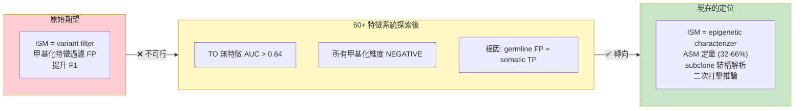
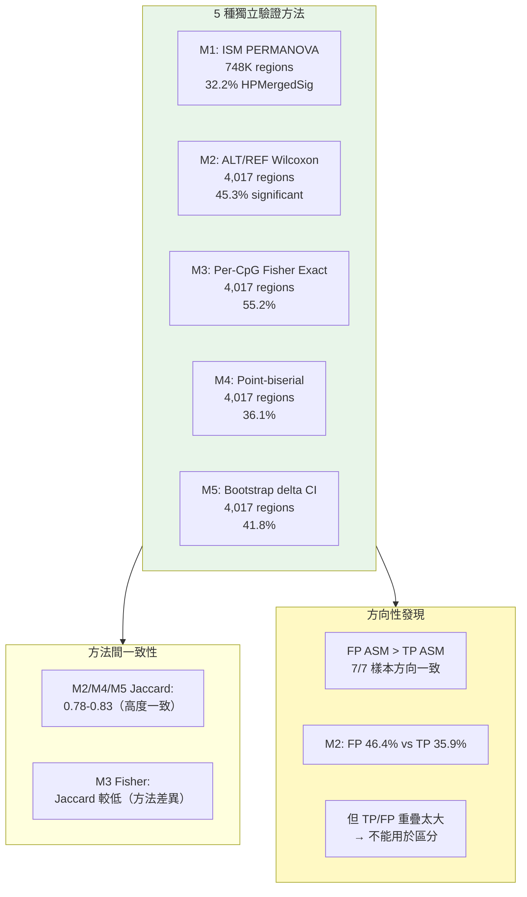
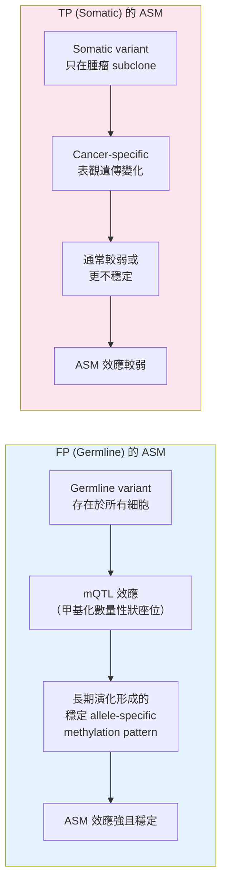
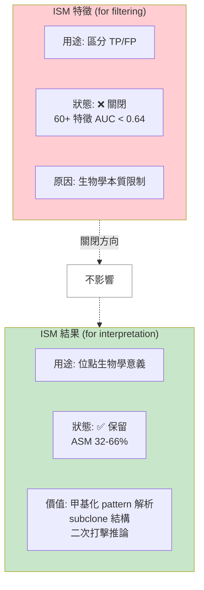

<!--
建立時間: 2026-04-04 21:30
目標: 明確界定 ISM 能做什麼與不能做什麼，HP 依賴分類完整表
處理範圍: 60+ 特徵 HP 依賴性分類 + ISM 分析價值重定位
關聯檔案:
  - docs/reports/research_landscape/01_TO_FP問題全貌.md
  - docs/reports/research_landscape/04_暫停判定與重評估.md
-->

# ISM 分析價值界定：能做什麼？不能做什麼？

---

## ISM 價值的重要轉向

### ISM 不能做的事

| 不能做的事 | 為什麼 | 驗證充分度 |
|------------|--------|-----------|
| TO FP 過濾 | 60+ 特徵全部 AUC < 0.64，TP loss ≤2% 下 FP removal = 0% | ⭐4 (充分) |
| TO LOH 判定 | Self-phasing 造成 62% artifact，HP_Ratio 跨模式 r=0.001 | ⭐4 (充分) |
| TO HP-based 分群 | HP tag 與真實 haplotype 幾乎無關 | ⭐5 (堅固) |
| 跨區域甲基化 correlation | Shared read count confound，殘差化後差異消失 | ⭐5 (堅固) |

### ISM 能做的事

| 能做的事 | 已有證據 | 驗證充分度 |
|----------|---------|-----------|
| ASM 定量 (32-66%) | 5 方法交叉驗證，7/7 樣本一致 | ⭐4 (穩固) |
| **Somatic heterogeneity 描述** | **HPFineNGroups N≥4 TP rate=86.8%, 7/7 一致, residualized AUC=0.617** | **⭐4 (穩固)** |
| Paired F1 微弱改善 (+0.011) | External validation 顯著，CI 不含零 | ⭐3 (需注意) |
| 甲基化矩陣產出 | 直接讀 BAM MM/ML，不依賴 HP | ⭐5 (堅固) |
| VerificationClass 分類 | 跨模式 concordance V=0.914 | ⭐4 (穩固) |

> **2026-04-07 新增**：R1-R5 特徵設計研究確認 HPFineNGroups 是唯一跨樣本+confound-free 的正面 somatic heterogeneity 信號。N≥4+NR≥80 → TP rate 89.1%；低 AF (0.1-0.2) 時信號最強（+50pp）。不能用於 FP filtering（AUC<0.85），但作為 somatic clone diversity 的定量標記有明確生物學意義。CramersV 的 93% 為零是 2×2 設計缺陷，HPFineNGroups 已克服（AUC +0.125）。

---

## 全特徵 HP 依賴性分類

### A 類：完全不依賴 HP（~42 個，結論全部穩固）

這些特徵的計算邏輯完全不使用 HP tag，因此不受 self-phasing 影響。在 TO 數據上的 NEGATIVE 結論可以直接維持。

| 特徵名 | 來源 | TO AUC | 計算邏輯 |
|--------|------|--------|---------|
| NumReads | ISM | 0.572 | Region 內 read 計數 |
| NumCpGs | ISM | ~0.50 | Region 內 CpG 位點數 |
| PairwiseMeanDist | ISM | 0.543 | 距離矩陣所有 pair 平均值 |
| PairwiseMedianDist | ISM | 0.535 | 距離矩陣所有 pair 中位數 |
| AlleleDelta | ISM | ~0.50 | d_between - d_within on allele labels |
| AlleleP | ISM | ~0.50 | AlleleDelta permutation p-value |
| AlleleSig | ISM | ~0.50 | AlleleP <= 0.05 |
| LabelAllelePermanovaF/P | ISM | — | PERMANOVA on allele labels |
| ClusterPermanovaF/P | ISM | — | PERMANOVA on cluster labels |
| Stability | ISM | — | Subsampling 穩定性 ARI |
| caller_af | VCF | 0.418 (反向) | VCF AF 欄位 |
| caller_gq | VCF | 0.470 | VCF GQ 欄位 |
| caller_dp | VCF | 0.564 | VCF DP 欄位 |
| caller_ad_alt/ref | VCF | 0.480/0.597 | VCF AD 欄位 |
| fau/fcu/fgu/ftu | VCF (G1-G7) | <0.58 | Forward strand base counts |
| rau/rcu/rgu/rtu | VCF (G1-G7) | <0.58 | Reverse strand base counts |
| sb_clairs/sb_ratio | VCF (G1-G7) | <0.58 | Strand bias |
| pon_1..pon_4, pon_count | VCF (G1-G7) | <0.58 | Panel of Normals |
| is_transition | VCF (G1-G7) | 0.604 | Ti/Tv 分類 |
| cpg_context | VCF (G1-G7) | <0.58 | CpG 位點 context |

### B 類：直接依賴 HP（~29 個，TO 結果不可信）

這些特徵的計算邏輯明確使用 `hp_tag` 進行分群或條件判斷，在 TO 數據上的 AUC 受 self-phasing 系統性汙染。

| 特徵名 | TO AUC | 汙染方式 | 修正後預期 |
|--------|--------|---------|-----------|
| HP_Ratio | r=0.001 (跨模式) | 直接基於 HP family counts | 核心觀察指標 |
| Potential_LOH | — | HP_Ratio 二元化 | 62% artifact 消除 |
| HPMergedDelta | paired 反向 | HP 分群後 delta | 可能改善 |
| HPMergedSig | paired 反向 | HP 分群後 p-value | 可能改善 |
| HPFamilyDelta/Sig | — | HP family 分群 | 可能改善 |
| NHP1/NHP2/NHP3/NHP0 | — | HP tag 計數 | 重新分配 |
| HP1FamilyN/HP2FamilyN | — | HP family 計數 | 重新分配 |
| hp_assign_rate | ~0.50 | HP 分配比例 | 更準確 |
| hp0_ratio | ~0.50 | HP0 reads 比例 | 更準確 |
| HP imbalance | 0.531 | abs(HP1-HP2)/(HP1+HP2) | 可能改善 |
| effective_hp_reads | 0.544 | HP1+HP2 有效計數 | 更準確 |
| within_dom_alt_frac | 0.679 (反向) | Dominant HP 中 ALT 比例 | **最可能改善** |
| delta_nme | 0.504 | abs(NME(HP1)-NME(HP2)) | 可能改善 |
| UnassignedDir | — | Affinity 方向 | 重新計算 |
| LOH_Subtype | ~0.50 | Potential_LOH × VC 交叉 | 重新定義 |

> **最高價值重測目標**：`within_dom_alt_frac`——這是唯一首次突破 AUC 0.70 的特徵（LOSO 0.721），但受 self-phasing 汙染。修正後 AUC 可能**改善**（因為 self-phasing 是壓低信號而非製造虛假信號）。

### C 類：間接依賴 HP（~14 個，大部分影響微弱）

| 特徵名 | TO AUC | 間接依賴方式 | TO mode 已修正？ |
|--------|--------|-------------|-----------------|
| GlobalP | — | min(p_alt, p_hp, p_hpfam) | 否（取最小值） |
| CramersV | 0.509 | max(v_alt, v_hp, v_hpfam) | 否（取最大值） |
| HeuristicScore | 0.532 | 使用 GlobalP + CramersV | 否 |
| QualityScore | 0.497 | LOH penalty + verify bonus | **是（TO mode 已移除為 0）** |
| Quality_Tier | TP 76.9% vs FP 75.6% | 衍生自 QS | 是 |
| PassedGating | 0.512 | alt.gate OR hp.gate | 否 |
| VerificationClass | V=0.023 | label_sig 含 HP 成分 | 否 |
| SuggestFilter | — | label_delta 可能由 HP 驅動 | 否 |
| DominantLabel | — | hp_p vs allele_p 取較小 | 否 |

> **重要**：QualityScore 的 TO mode 已透過 `get_tumor_only_weights()` 移除 `loh_penalty=0.0f` 和 `verify_bonus=0.0f`，但 CramersV 成分仍有微弱間接 HP 影響。殘留影響可忽略。

---

## ISM 的生物學分析價值（POSITIVE 方向）

### ASM 定量：32-66% SNV 位點有 Allele-Specific Methylation

### ASM 發現的解讀

**為什麼 FP 的 ASM 比 TP 強？**

**關鍵推論**：ASM 存在（POSITIVE）但 ASM 不能區分 TP/FP（與 O1-O13 NEGATIVE 不矛盾）。
- 存在 ≠ 可區分
- FP 的 ASM 更強（mQTL 驅動），但 TP 也有 36%
- 重疊區域太大，任何閾值都無法有效分割

### ISM 的三個前進方向

| 目標 | 說明 | 依賴 |
|------|------|------|
| **G1: Per-CpG 關聯性** | 量化每個 CpG 位點與 somatic variant 的甲基化關聯 | 甲基化矩陣（不依賴 HP） |
| **G2: Subclone 結構** | 解析 epigenetic heterogeneity 對應的亞克隆結構 | PERMANOVA + clustering |
| **G3: 二次打擊推論** | LOH + somatic 的 allelic methylation 模式 → 二次打擊事件 | LOH Evidence Panel |

> **論文定位從 "variant filter" 轉向 "read-level epigenetic context characterization"**。ISM 的獨特價值是它能在 read-level 做 PERMANOVA——這是其他工具無法複製的能力（Jenkinson 2020: 96% ASM = entropy imbalance，只有 read-level 分析能偵測）。

---

## ISM 結果 vs ISM 特徵：重要區分

**白話解釋**：ISM 分析出來的甲基化 pattern（VerificationClass、ASM、clustering 結果）是有生物學意義的，只是這些 pattern 不能用來判斷一個 variant 是 TP 還是 FP。就像血型可以反映一個人的生物學特性，但不能用來判斷一個人是不是罪犯一樣。

---

## 本章小結

| 問題 | 答案 |
|------|------|
| ISM 能過濾 TO FP 嗎？ | ❌ 不能。60+ 特徵全部 AUC < 0.64，R1-R5 確認非特徵設計問題 |
| ISM 的結果有價值嗎？ | ✅ 有。ASM 定量、**somatic heterogeneity** (HPFineNGroups N≥4 TP 86.8%)、二次打擊推論 |
| CramersV 為何 93% 為零？ | 2×2 框架缺陷，HPFineNGroups 已克服 (AUC +0.125) |
| 多少特徵不受 self-phasing 影響？ | 55%（~42 個），結論全部穩固 |
| 修正 HP 後能突破嗎？ | Paired HP1FamilyN AUC=0.834 暗示正確 HP 下有真實信號 |
| 純甲基化 clustering 能區分嗎？ | ❌ 不能。Option C 雙路測試：HP-free combo AUC=0.564，ClusterPermanovaF=0.512（隨機），所有區分力來自 HP tags |
| ISM 能 rescue Caller 遺漏的 FN 嗎？ | ❌ 不能。O9: 122,790 FN regions，HP-free AUC 全<0.53（random），最強信號是 AF 代理（LabelAllelePermanovaF=0.664）非甲基化。甲基化空間 FN≡TP |
| TO 模式 ISM 對分類有用嗎？ | ❌ 極弱。TO-pure LOSO: ISM+Caller AUC=0.66，但 ISM 僅增 +0.003-0.030 over Caller-only (0.63)。caller_af 單獨 AUC=0.654 超越全部 ISM |
| 研究方向的正確轉向？ | Variant filter → epigenetic characterization (somatic heterogeneity + ASM) |
