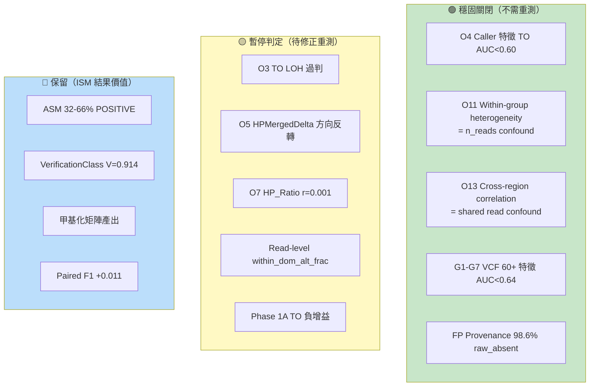
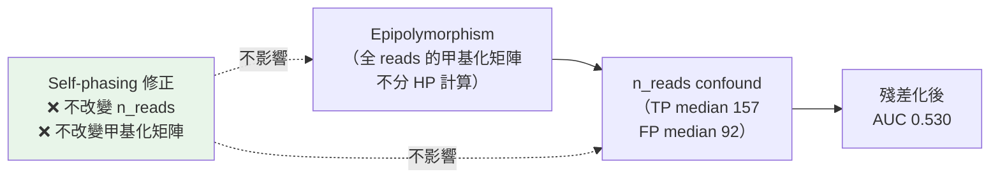
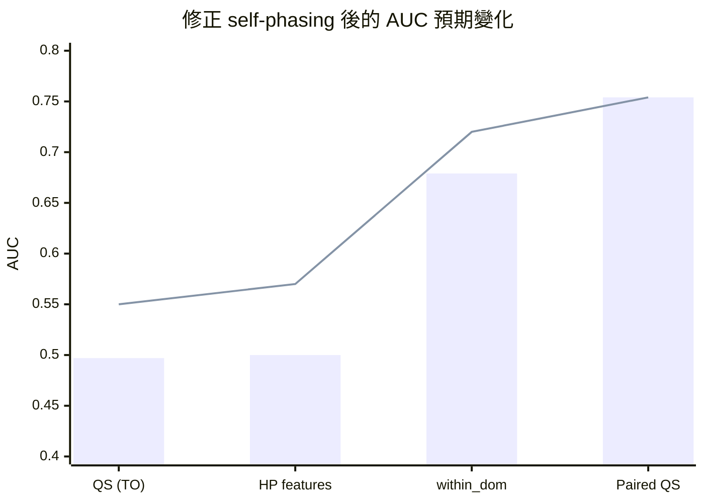
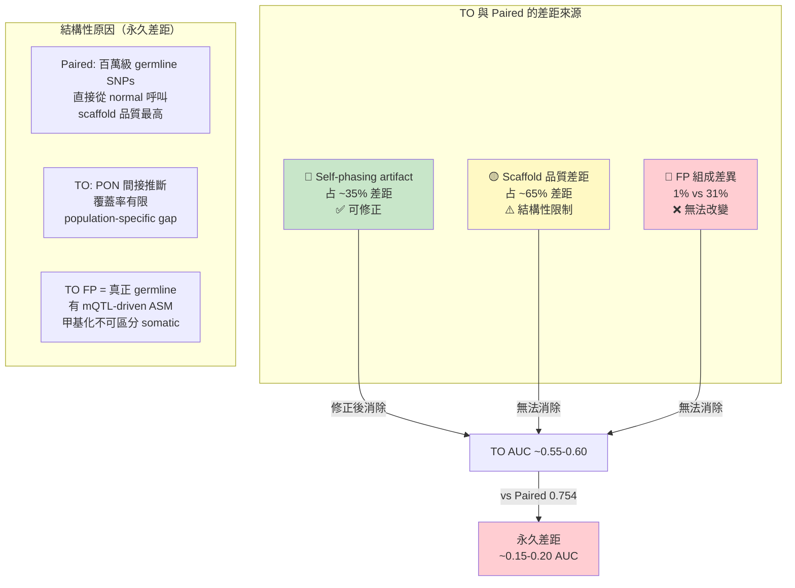
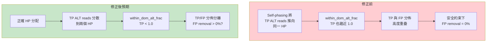
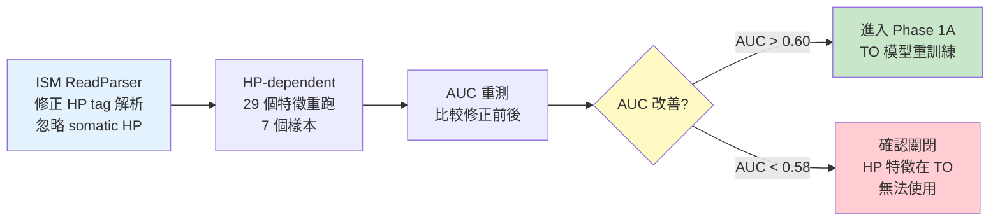
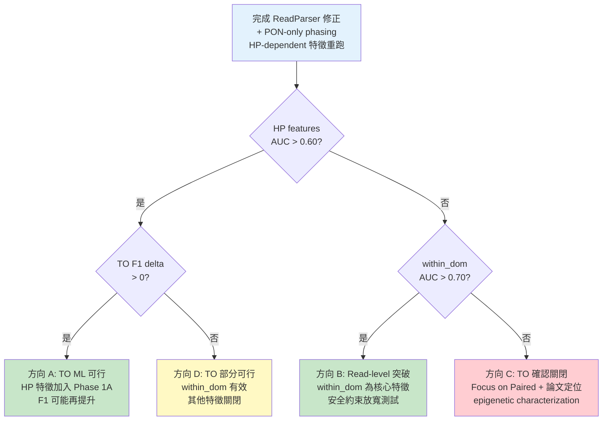

<!--
建立時間: 2026-04-04 21:40
目標: 明確列出哪些結論是暫停判定、修正後預期改善幅度、重評估優先級
處理範圍: B類特徵暫停判定 + 修正後預測 + 重評估計劃
關聯檔案:
  - docs/reports/research_landscape/02_Self_Phasing根因.md
  - docs/reports/research_landscape/06_結論穩定性審查.md
-->

# 暫停判定與重評估：哪些結論需要修正後重測？

---

## 三級結論分類



---

## 穩固關閉的結論（為什麼修正 HP 也不會翻轉）

### O11: Within-group Heterogeneity → 仍然 NEGATIVE

**原結論**：Epipolymorphism AUC=0.845 完全是 n_reads confound；殘差化後 AUC 0.509-0.578。

**為什麼不會翻轉**：


n_reads confound 是 study design artifact（TP region 在 well-covered 基因區域），與 phasing 完全無關。

### O13: Cross-region Correlation → 仍然 NEGATIVE

**原結論**：FP-FP > TP-TP correlation 差異是 shared read count confound；三種方法（分層、OLS 殘差化 p=0.464 d=-0.071、propensity matching p=0.403）全部確認無信號。

**為什麼不會翻轉**：Shared read count（FP median=36 vs TP=21）是 ONT long reads 的物理特性和 variant density 的結果，與 HP tag 無關。

### G1-G7: VCF 特徵 → 仍然 NO-GO

**原結論**：40+ VCF 特徵全部 AUC < 0.64；LOSO LR 0.638；bootstrap 0.503；TP loss ≤2% 下 FP removal = 0%。

**為什麼不會翻轉**：VCF 特徵（strand bias, CpG context, trinucleotide, GQ, AF）完全來自 variant caller 輸出，與 HP tag 完全無關。根因是殘餘 germline FP 是 PON 覆蓋不到的罕見 germline variants，與 somatic TP 本質相似。

### FP Provenance → 仍然有效

**原結論**：98.6% TO FP 是 raw_absent（ClairS-TO call 出、ClairS-Paired 從未輸出）。

**為什麼不會翻轉**：這完全基於 variant caller 行為，與 ISM phasing 完全無關。

---

## 暫停判定的結論（修正後預期改善幅度）

### 預期改善量化表



| 指標 | 修正前 | 修正後預估 | 改善幅度 | 預估依據 |
|------|--------|-----------|---------|---------|
| **TO QS AUC** | 0.497 | 0.55-0.60 | +0.05-0.10 | 非 LOH 位點已 0.549；LOH 只解釋 35% 降幅 |
| **HP-dependent 特徵 AUC** | ~0.50 | 0.55-0.58 | +0.05-0.08 | 非 LOH 位點上限 0.549 |
| **within_dom_alt_frac** | 0.679 | 0.68-0.72 | +0.00-0.04 | Self-phasing 壓低信號，修正可能改善 |
| **HP_Ratio paired-TO r** | 0.001 | 0.3-0.5? | 大幅改善 | 但仍低於 paired scaffold 品質 |
| **TO LOH artifact** | 62% | ~0% | 完全消除 | VCF 層面已確認 |

### 為什麼修正後 TO 仍無法接近 Paired



---

## 最有潛力反轉的方向

### within_dom_alt_frac（穩定度 ⭐3，最值得重測）

**目前狀態**：AUC=0.679（反向，FP=1.0, TP=0.875）；LOSO AUC=0.721（首次>0.70）；但安全約束下 FP removal=0%。

**為什麼可能改善**：


**但仍有風險**：高純度細胞株（80-95%）中 TP 的 within_dom 本來就偏高（~40% TP 有 within_dom=1.0），這是樣本特性而非 phasing 問題。在低純度臨床樣本（30-70%）上可能更有潛力。

### Phase 1A TO 重測

**目前狀態**：TO-pure sample400 delta F1 = -0.0206（負增益）。

**修正後預期**：TO 的甲基化特徵（methyl_delta 等）目前受 HP tag 汙染，修正後可能從負轉正，但改善幅度不確定。

**依賴鏈**：
```
PON-only phasing 修正 → ReadParser 修正 → HP-dependent 特徵重跑
→ Phase 1A TO 模型重訓練 → 驗證 delta F1
```

---

## 重評估計劃


### Phase 1: 基礎修正（P0, 預估 1-2 週）



### Phase 2: 重測驗證（P1, 預估 2-3 週）

| 重測項目 | 預期結果 | 成功標準 |
|----------|---------|---------|
| within_dom_alt_frac AUC | 0.68-0.72 | AUC > 0.65 且 FP removal > 0% |
| HP_Ratio paired-TO r | 0.3-0.5 | r > 0.2 |
| TO QS AUC | 0.55-0.60 | AUC > 0.55 |
| Phase 1A TO F1 delta | -0.02 → 0? | delta > 0 |

### Phase 3: 額外驗證（P2, 可平行）

- [ ] 多樣本 PON-only phasing（COLO829, HCC1954）
- [ ] 低純度樣本 within_dom_alt_frac
- [ ] LOH.bed 生成機制確認
- [ ] GBM/RF 非線性模型天花板確認

---

## 決策樹：修正結果的分支



---

## 本章小結

| 類別 | 數量 | 說明 |
|------|------|------|
| **穩固關閉** | 5 個方向 | 不依賴 HP，修正不影響，結論永久有效 |
| **暫停判定** | 5 個方向 | 依賴 HP，需修正後重測，但改善幅度有限 |
| **保留** | 4 個方向 | ISM 結果價值，不受 filter 失敗影響 |
| **最可能反轉** | within_dom_alt_frac | 穩定度 ⭐3，修正後可能改善，需低純度樣本驗證 |
