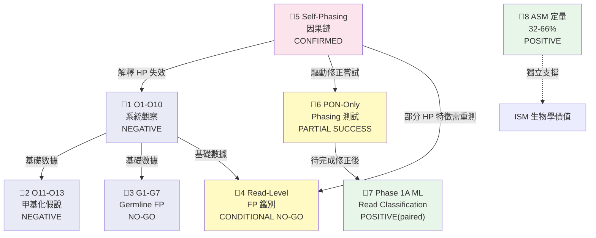
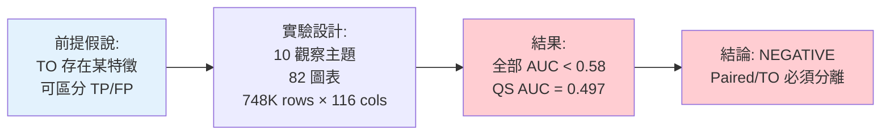
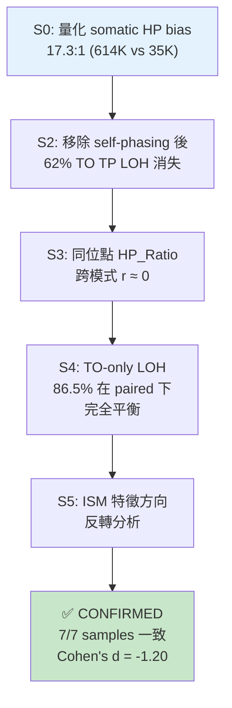
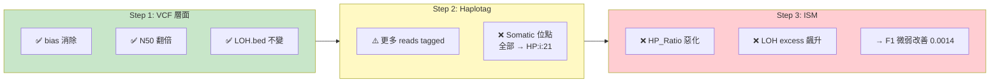
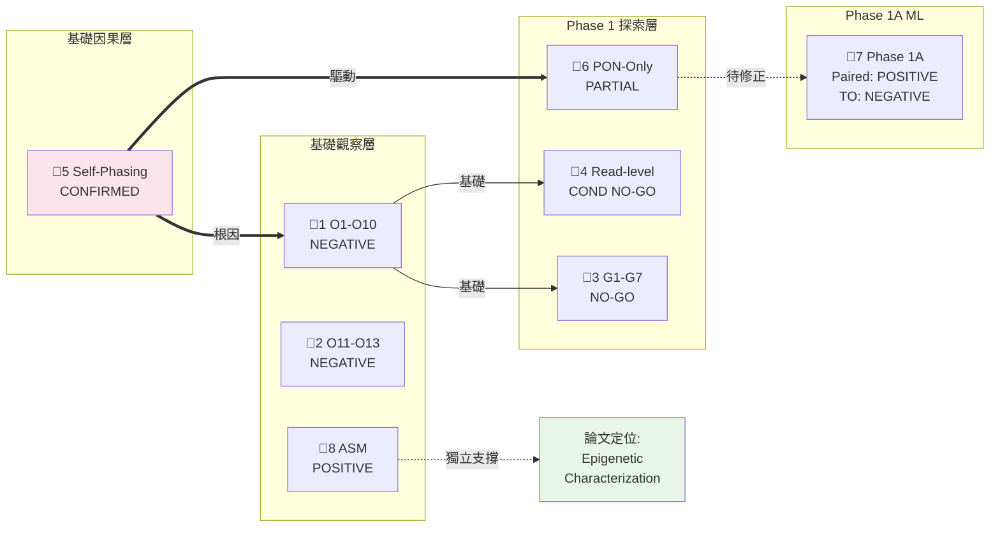

<!--
建立時間: 2026-04-04 21:50
目標: 8 條完整證據鏈：前提→設計→結果→結論→依賴→路線圖位置
處理範圍: O1-O13, G1-G7, Self-phasing, PON-only, Phase 1A, ASM, Read-level, FP Provenance
關聯檔案:
  - docs/reports/research_landscape/06_結論穩定性審查.md
  - docs/reports/research_landscape/03_ISM分析價值界定.md
-->

# 證據鏈總覽：8 條從前提到結論的完整推論路徑

---

## 證據鏈之間的依賴關係

---

## 證據鏈 1: O1-O10 系統性觀察

### 推論結構

| 項目 | 內容 |
|------|------|
| **前提條件** | Master dataset TP/FP label 正確；HP tag 正確解析；116 欄涵蓋所有特徵 |
| **前提驗證** | ⚠️ HP tag 解析已修正（2026-03-30）；self-phasing 仍汙染 HP 特徵 |
| **核心結果** | TO 最佳 caller_gq=0.566；QS=0.497（隨機）；paired-TO HP r=0.001 |
| **結論依賴** | TP/FP label（穩固）+ dataset 完整性（穩固）；HP 特徵暫停 |
| **路線圖位置** | 基礎觀察層——所有方向決策的數據基底 |

---

## 證據鏈 2: O11-O13 甲基化假說

### 三個維度的否決路徑

```mermaid
graph TB
    subgraph O11["O11: Within-group Heterogeneity"]
        O11_H["假說: Germline ASM<br/>組內更一致"]
        O11_R["結果: epipolymorphism<br/>AUC 0.845 → 0.530<br/>(n_reads confound)"]
        O11_C["判定: ❌ NEGATIVE"]
    end

    subgraph O12["O12: LOH 場景區分"]
        O12_H["假說: TO LOH 三場景<br/>甲基化可區分"]
        O12_R["結果: AlleleDelta<br/>= AF confound<br/>L2 = collider bias<br/>L3 全 AUC < 0.59"]
        O12_C["判定: ❌ NEGATIVE"]
    end

    subgraph O13["O13: Cross-region Correlation"]
        O13_H["假說: 同 subclone<br/>TP-TP correlation 更高"]
        O13_R["結果: 差異 = shared<br/>read count confound<br/>p=0.464, d=-0.071"]
        O13_C["判定: ❌ NEGATIVE"]
    end

    O11_H --> O11_R --> O11_C
    O12_H --> O12_R --> O12_C
    O13_H --> O13_R --> O13_C

    style O11_C fill:#ffcdd2
    style O12_C fill:#ffcdd2
    style O13_C fill:#ffcdd2
```

| 項目 | 內容 |
|------|------|
| **前提條件** | HP 分群正確；n_reads/AF confound 已控制；ISM 甲基化矩陣準確 |
| **前提驗證** | ❌ HP 受汙染（但 O11/O13 的否決根據不依賴 HP）；confound 控制方法學穩固 |
| **核心方法** | O11: 6 特徵殘差化；O12: 175K rows × 4-level confound control；O13: propensity matching n=500 |
| **結論依賴** | Confound 控制方法（穩固）；即使 HP 修正，O11 的 n_reads 和 O13 的 shared reads 不變 |
| **路線圖位置** | 基礎觀察層——關閉甲基化直接用於 TO TP/FP 區分的路徑 |

---

## 證據鏈 3: G1-G7 TO Germline FP 鑑別

| 項目 | 內容 |
|------|------|
| **前提假說** | PON 後殘餘 11,598 FP 中 germline 可透過 VCF 特徵識別 |
| **前提驗證** | ✅ 全部驗證——VCF 特徵獨立於 HP，不受 self-phasing 影響 |
| **實驗設計** | 7 模組、48 圖表、516K variants × 40+ 新 VCF 特徵 × 7 樣本 |
| **核心結果** | 最佳 G5 CpG AUC=0.616；LOSO LR AUC=0.638；bootstrap AUC=0.503 |
| **安全約束** | **TP loss ≤ 2% 下 FP removal = 0%** |
| **結論** | **NO-GO** — 殘餘 germline FP 與 somatic TP 本質相似 |
| **路線圖位置** | Phase 1 探索層——關閉 TO post-hoc VCF 過濾方向 |

---

## 證據鏈 4: Read-Level Germline FP 鑑別

| 項目 | 內容 |
|------|------|
| **前提假說** | Read-level 甲基化特徵可區分 germline/somatic reads |
| **前提驗證** | 部分——within_dom_alt_frac 依賴 HP（B 類），受 self-phasing 汙染 |
| **核心結果** | within_dom_alt_frac AUC=0.679；LOSO AUC=0.721（首次 >0.70） |
| **安全約束** | **TP loss ≤ 2% 下 FP removal = 0%**（TP 也有 ~40% within_dom=1.0） |
| **結論** | **CONDITIONAL NO-GO**——高純度細胞株限制，低純度有潛力 |
| **暫停原因** | within_dom 依賴 HP，修正後可能改善；需低純度樣本驗證 |
| **路線圖位置** | Phase 1 探索層——暫停，待 P0 修正後重評 |

---

## 證據鏈 5: Self-Phasing 因果鏈驗證

### 五步驗證流程

| 項目 | 內容 |
|------|------|
| **前提假說** | LongPhase-TO self-phasing circular dependency 是 TO LOH over-calling 主因 |
| **前提驗證** | ✅ Paired phasing 作為 ground truth（穩固）；同位點比較方法學穩固 |
| **關鍵數據** | 23 TSV + 7 PNG；288K same-locus pairs × 7 samples |
| **結論** | **CONFIRMED**——self-phasing 是 TO LOH 主因，解釋 ~35% QS 降幅 |
| **不依賴** | 不依賴任何甲基化假說，是純 phasing 層面因果驗證 |
| **路線圖位置** | 基礎因果層——所有 TO 下游問題的根本原因定位 |

---

## 證據鏈 6: PON-Only Phasing 測試

### 三步驗證與結果

| 項目 | 內容 |
|------|------|
| **前提假說** | PON-only phasing 可消除 self-phasing 並改善 HP 分群 |
| **前提驗證** | ⚠️ VCF 層面通過；haplotag 層發現新問題（GT=0|0 解析缺陷） |
| **結論** | **PARTIAL SUCCESS**——VCF 正確，haplotag 需修正 |
| **修復方案** | ISM ReadParser 忽略 somatic HP tags (HP:i:11/21/33) |
| **路線圖位置** | Phase 1 基礎設施修復——揭示 haplotag 層新瓶頸 |

---

## 證據鏈 7: Phase 1A ML Read Classification

| 項目 | Paired | TO |
|------|--------|-----|
| **External validation F1 delta** | **+0.0112** [+0.0044, +0.0188] | -0.0206 |
| **McNemar p-value** | **1.44e-51** | — |
| **Discovery holdout** | +0.0073 (CI 含零) | — |
| **跨樣本一致性** | 3/7 明確正向；H2009 負向 | — |
| **結論** | **POSITIVE (弱)** | **NEGATIVE (待修正)** |

> **注意**：Paired +0.011 只在純 paired 設定成立；Mixed mode (paired+TO) 反而有害。TO 需 self-phasing 修正後重測。

---

## 證據鏈 8: SNV-甲基化 ASM 定量

### 五方法交叉驗證結果

| 方法 | 樣本量 | ASM 比例 | 說明 |
|------|--------|---------|------|
| M1 ISM PERMANOVA | 748K regions | 32.2% | read-level 最完整 |
| M2 ALT/REF Wilcoxon | 4,017 regions | 45.3% | 不依賴 HP |
| M3 Per-CpG Fisher | 4,017 regions | 55.2% | 方法較激進 |
| M4 Point-biserial | 4,017 regions | 36.1% | 不依賴 HP |
| M5 Bootstrap delta CI | 4,017 regions | 41.8% | 不依賴 HP |

| 項目 | 內容 |
|------|------|
| **結論** | **POSITIVE**——ASM 廣泛存在，ISM 有獨特生物學分析價值 |
| **獨立性** | 甲基化信號直接讀 BAM MM/ML，完全獨立於 HP tag 和 self-phasing |
| **與 O1-O13 的關係** | 不矛盾——ASM 存在 ≠ ASM 可區分 TP/FP |
| **路線圖位置** | 基礎觀察層 + 論文定位層——支撐研究從 filter 轉向 characterization |

---

## 跨證據鏈依賴總結表

**一句話總結**：Self-phasing（鏈 5）是所有 TO 問題的根因，它解釋了鏈 1、4 中 HP 特徵的失效。鏈 2、3 的結論獨立於 HP，永久有效。鏈 8 獨立支撐 ISM 的長期價值。鏈 6 是修正路徑，鏈 7 待修正後重評。
