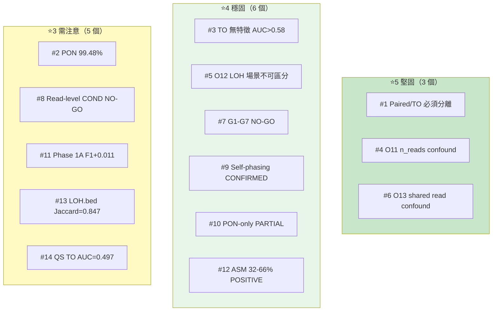
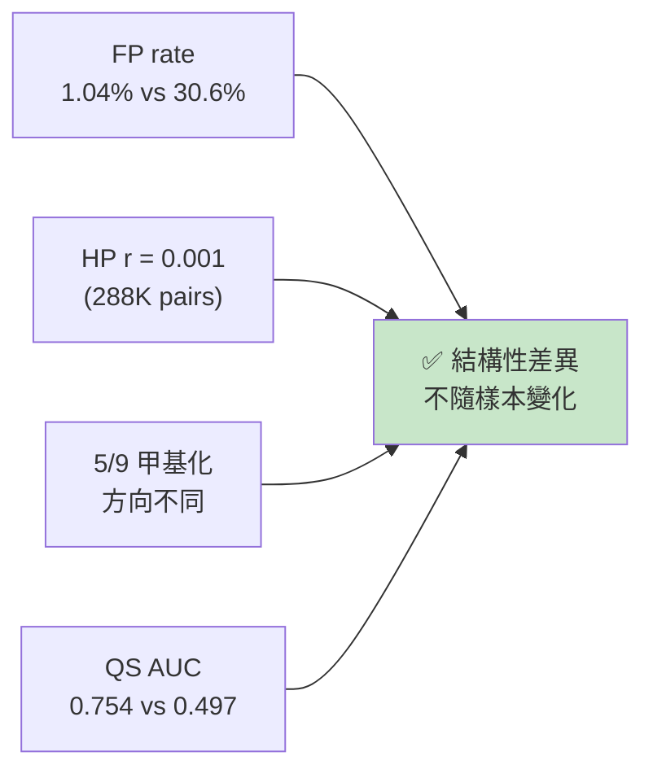
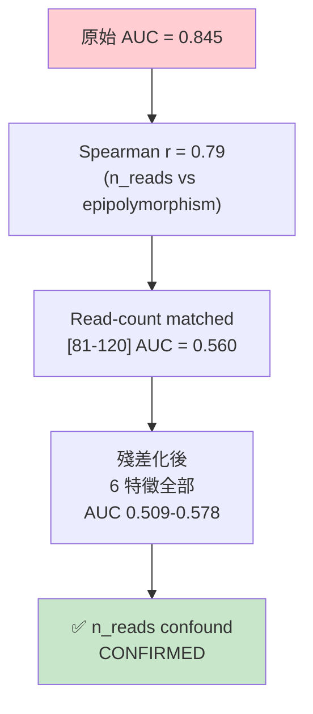
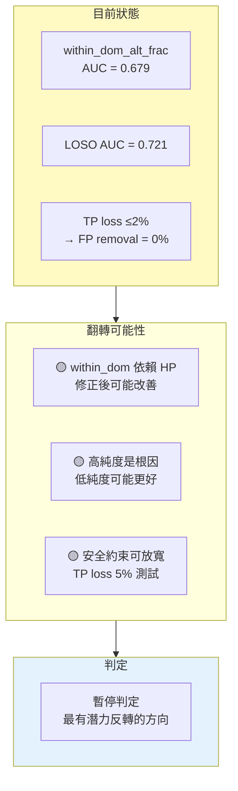
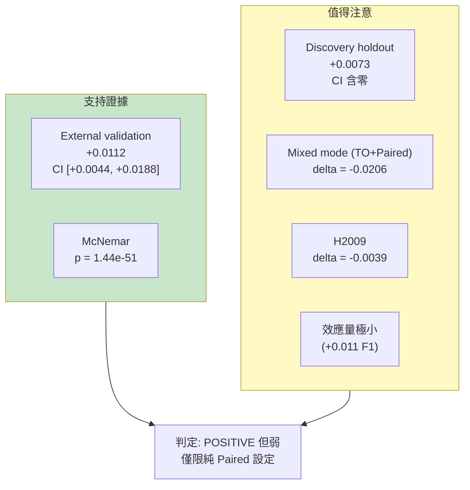
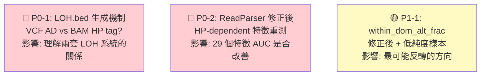
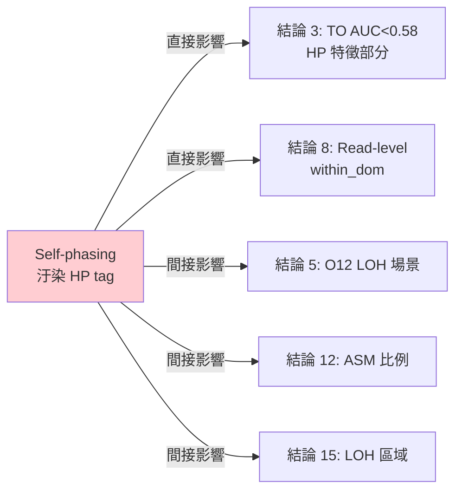

<!--
建立時間: 2026-04-04 22:00
目標: 14 個結論的穩定度評分、隱含假設分析、驗證需求
處理範圍: 全部研究結論的方法論審查
關聯檔案:
  - docs/reports/research_landscape/05_證據鏈總覽.md
  - docs/reports/research_landscape/04_暫停判定與重評估.md
-->

# 結論穩定性審查：14 個結論各自有多可靠？

---

## 穩定度評分系統

| 評分 | 意義 | 條件 |
|------|------|------|
| ⭐5 | **堅固** | 多方法驗證 + 不依賴可變前提 + 跨樣本一致 |
| ⭐4 | **穩固** | 充分驗證 + 少量未測假設但影響有限 |
| ⭐3 | **需注意** | 驗證充分但存在可能翻轉的前提或單一樣本限制 |
| ⭐2 | **脆弱** | 核心前提未驗證或存在反向證據 |
| ⭐1 | **不可靠** | 多個前提失效或邏輯缺陷 |

---

## 穩定度全景圖

---

## 逐一審查

### 結論 1：Paired/TO 必須分離 ⭐5

| 維度 | 分析 |
|------|------|
| **前提** | Paired/TO FP rate 結構性不同 + HP tag 不相關 + 甲基化方向不一致 |
| **驗證狀態** | 全部已驗證 (O1, O5, O7, S3) |
| **隱含假設** | 7 個細胞株能代表一般差異 → 合理，因差異來自有/無 normal 的結構性因素 |
| **如果前提改變** | 可能性極低。結構性差異不隨樣本變化 |
| **需要額外驗證** | 無 |

---

### 結論 2：PON 移除 99.48% raw FP ⭐3

| 維度 | 分析 |
|------|------|
| **前提** | HCC1395 5kHz 的 ClairS-TO 輸出 + SEQC2 truth set |
| **驗證狀態** | 部分——僅 1 個樣本（2,717,339/2,731,541） |
| **隱含假設** | ⚠️ **HCC1395 PON 覆蓋率可推廣到其他樣本** — 不同族群的 rare germline 組成不同 |
| **如果前提改變** | 即使跌到 95%，「PON 是最強 filter」的結論不變 |
| **需要額外驗證** | 在其他 6 個樣本計算 PON 移除率（特別是 HCC1954, COLO829） |

---

### 結論 3：TO 無單一特徵 AUC > 0.58 ⭐4

| 維度 | 分析 |
|------|------|
| **前提** | 748K master dataset + 116 columns + HP fix 後 |
| **驗證狀態** | 充分。後續 G1-G7 又追加 40+ 特徵確認天花板 |
| **隱含假設** | ⚠️ **HP-dependent 特徵受 self-phasing 汙染** — 已確認，但修正後也不太可能突破（VCF 特徵本身只到 0.566） |
| **如果前提改變** | Self-phasing 修正後部分 HP 特徵可能突破 0.58，但甲基化天花板仍受生物學限制 |
| **需要額外驗證** | Self-phasing 修正後 HP-dependent 特徵重測；確認 proxy truth 品質 |

---

### 結論 4：O11 within-group heterogeneity = n_reads confound ⭐5

| 維度 | 分析 |
|------|------|
| **前提** | epipolymorphism AUC 0.845 受 n_reads 驅動（r=0.79）；TP median 157 vs FP 92 |
| **驗證狀態** | 完整——三種控制方法一致 |
| **隱含假設** | n_reads 與 truth 的相關不是生物學信號 → 合理（TP 在 well-covered 區域） |
| **需要額外驗證** | 無 |

---

### 結論 5：O12 TO LOH 三場景不可區分 ⭐4

| 維度 | 分析 |
|------|------|
| **前提** | AlleleDelta = AF confound；L2 = collider bias；L3 全 AUC < 0.59 |
| **驗證狀態** | 充分（175K rows × 22 features × 4-level confound control） |
| **隱含假設** | ⚠️ 22 特徵是否涵蓋所有鑑別維度？未測 spatial 特徵（CGI/shore, enhancer） |
| **如果前提改變** | 引入 CNV/B-allele 資訊可能改善，但 TO-only 設定下穩固 |
| **需要額外驗證** | Self-phasing 修正後 LOH 區域甲基化重測（priority 低） |

---

### 結論 6：O13 跨區域 correlation = shared read confound ⭐5

| 維度 | 分析 |
|------|------|
| **前提** | FP-FP shared reads 偏高（median 36 vs 21）；三種方法一致無信號 |
| **驗證狀態** | 完整——分層(6 strata) + OLS(p=0.464, d=-0.071) + matching(n=500, p=0.403) |
| **隱含假設** | 50kb 距離閾值足夠？ISM single-region 架構限制？→ 合理（shared reads 根本問題不變） |
| **需要額外驗證** | 無（方向已正式關閉） |

---

### 結論 7：G1-G7 TO Germline FP 不可識別 ⭐4

| 維度 | 分析 |
|------|------|
| **前提** | 40+ VCF 特徵 × 7 模組 × 7 樣本 |
| **驗證狀態** | 充分（48 圖表；LOSO AUC=0.638；bootstrap=0.503） |
| **隱含假設** | ⚠️ LR 是否足夠？未測 RF/GBM → 但 LR LOSO 已 0.638，非線性改善有限 |
| **如果前提改變** | 更複雜模型可能突破 0.64，但安全約束下 FP removal=0% 不太可能改變 |
| **需要額外驗證** | GBM/RF 測試（P2）；mutational signature 特徵（P2） |

---

### 結論 8：Read-level LOSO AUC=0.721 但 FP removal=0% ⭐3

| 維度 | 分析 |
|------|------|
| **隱含假設** | ⚠️ within_dom 受 self-phasing 壓低信號 → 修正可能**改善** |
| **如果前提改變** | **可能從 NO-GO 轉為 CONDITIONAL-GO**——所有暫停判定中最有潛力反轉 |
| **需要額外驗證** | (1) 修正後 AUC；(2) 低純度樣本；(3) 放寬 TP loss 到 5% |

---

### 結論 9：Self-phasing 是 TO LOH 主因 ⭐4

| 維度 | 分析 |
|------|------|
| **前提** | 62% 消失 + 17.3:1 bias + r≈0 + 86.5% 平衡 |
| **驗證狀態** | 充分（288K pairs × 7 samples；Cohen's d=-1.20） |
| **隱含假設** | ⚠️ (1) Paired phasing 作為 ground truth 有自身限制（switch error）；31.2% 的定量比例可能需修正（20-25%）。**(2) 重要精確化**：「62% TO LOH 消失」中的 LOH 是 ISM HP_Ratio LOH，而非 LOH.bed region-level LOH。PON-only 實驗證實 LOH.bed 完全不受 self-phasing 影響（Jaccard=1.0），因此因果鏈影響位於 haplotag→ISM 路徑，而非 LongPhase LOH detection |
| **如果前提改變** | 定性結論不變（self-phasing 確實汙染 ISM HP_Ratio），定量比例可能略降。但需更精確描述為「self-phasing 是 ISM-level HP imbalance 主因」而非「self-phasing 是 TO LOH 主因」|
| **需要額外驗證** | (1) 精確區分兩層 LOH 概念的影響範圍；(2) CNV 工具獨立驗證 structural LOH 位置 |

---

### 結論 10：PON-only phasing VCF 正確但 haplotag 缺陷 ⭐4

| 維度 | 分析 |
|------|------|
| **前提** | LOH.bed Jaccard=1.0 + bias 消除 + N50 翻倍 + haplotag GT 解析缺陷 |
| **驗證狀態** | 僅 HCC1395 1 個樣本 |
| **隱含假設** | ⚠️ **LOH.bed Jaccard=1.0 是意外**——如果 LOH.bed 基於 VCF AD 而非 HP tag，self-phasing 不影響是預期行為。**兩套 LOH 判定系統可能用不同來源**，kappa=0.670 的不一致由此解釋 |
| **需要額外驗證** | **(1) 確認 LOH.bed 生成機制**；(2) 多樣本驗證；(3) Purity 0→修復 |

> **關鍵待驗證問題**：LOH.bed 的生成機制是基於 VCF allele depth 還是 BAM HP tag？這影響我們對兩套 LOH 系統關係的理解。

---

### 結論 11：Phase 1A paired F1+0.011 ⭐3

| 維度 | 分析 |
|------|------|
| **隱含假設** | ⚠️ Discovery/external split 代表性；Mixed mode 有害意味著適用範圍極窄 |
| **如果前提改變** | 應下修為「Paired-only 微弱正增益，不具跨模式可攜性」|
| **需要額外驗證** | (1) H2009 負向根因；(2) 更多外部樣本 OOD validation |

---

### 結論 12：ASM 32-66% POSITIVE ⭐4

| 維度 | 分析 |
|------|------|
| **前提** | 5 方法交叉驗證 + 7/7 樣本一致 |
| **驗證狀態** | 充分（方法間 Jaccard 0.78-0.83；文獻支持） |
| **隱含假設** | ⚠️ 32% 可能含統計顯著但效應微弱的位點；加入 |delta|>0.2 門檻後比例可能下降 |
| **需要額外驗證** | 效應量門檻分析 |

---

### 結論 13：LOH.bed Jaccard=0.847 vs SEQC2 ⭐3

| 維度 | 分析 |
|------|------|
| **前提** | SEQC2 LOH truth set + Jaccard 計算 |
| **驗證狀態** | 僅 HCC1395 1 個樣本 |
| **隱含假設** | ⚠️ SEQC2 主要是 SNV benchmark，LOH zones 準確性與 SNV truth set 不同；15.3% 不重疊可能含重要生物學差異 |
| **需要額外驗證** | LOH.bed 生成機制確認；多樣本 LOH 驗證 |

---

### 結論 14：QS TO AUC=0.497 ⭐4

| 維度 | 分析 |
|------|------|
| **前提** | QS 在 TO 等同隨機；LOH penalty 反向 |
| **驗證狀態** | 充分。非 LOH 位點 QS AUC=0.549 → LOH 解釋 35%；剩餘 65% 是 scaffold 品質 |
| **修正後預期** | AUC 0.55-0.60（天花板），仍低於 Paired 0.754（差距 0.15-0.20） |
| **根因** | TO FP = germline leak → 所有甲基化維度不可區分 → QS 無力 |

---

### 補充結論 15：LOH 區域內甲基化全面失效 ⭐3

| 維度 | 分析 |
|------|------|
| **前提** | LOH 內 CramersV AUC~0.53, PairwiseMedianDist~0.54, HPMergedDelta~0.50 |
| **驗證狀態** | Phase 1+2 驗證（7 samples）；caller_gq paired AUC=0.922 保留 |
| **隱含假設** | ⚠️ (1) LOH 區域本質上是 HP 分群退化的區域——依賴 HP 的甲基化特徵在此**定義上**無法成功（非「失效」，而是「不可能」）。(2) 未測試不依賴 HP 的甲基化特徵（region-level entropy, mean methylation）在 LOH 區域的表現 |
| **如果前提改變** | 不依賴 HP 的甲基化特徵可能有殘餘信號，但效應量預計很小 |
| **需要額外驗證** | 測試 HP-independent 甲基化特徵在 LOH 區域的 AUC |

> **措辭修正建議**（來自方法論審查）：「全面失效」應更精確表述為「依賴 HP 分群的甲基化特徵在 LOH 區域天然無效（因缺乏雙側 HP 對比）」。

---

### 補充結論 16：HPFineNGroups 是 somatic heterogeneity marker POSITIVE ⭐3

| 維度 | 分析 |
|------|------|
| **前提** | TO NonLOH NR≥80 + NGroups=4 → TP rate=89.1%（25,741 regions）；residualized AUC=0.617；7/7 樣本方向一致 |
| **驗證狀態** | 原驗證：20260406 肉眼觀察報告 Section 8-11；**本次 B.1-2 質疑驗證（20260417）**：飽和假說否定 — NR-matched 6/6 bins Fisher p<0.05 且 Δ=+5 至 +14pp；B.1-4：LOH NGroups=4 僅 n=11，HPFineNGroups **僅適用 NonLOH** |
| **隱含假設** | ⚠️ (1) NGroups 上限=4 為 HP1/HP1-1/HP2/HP2-1 分群的合理代理；(2) TO mode self-phasing 修正後（P0-2）訊號保留；(3) 跨 NR bin 訊號外推合理 — NR-matched 證實 |
| **如果前提改變** | P0-2 haplotag 修正後 NGroups 分布可能變化；跨樣本外推至 baseline TP rate <0.85 的臨床樣本可能強化訊號（H2009 目前 ceiling 壓扁 Δ 至 +2.84pp） |
| **需要額外驗證** | (a) B.1-1 residualized AUC 多變數（+AF+Coverage_Multiple）；(b) P0-2 後 haplotag 乾淨重測；(c) 臨床 cohort 在 baseline TP rate <0.85 下的 Δ |

**本次新增三項限制（20260417 驗證）**：
1. **LOH 不適用** — LOH 區域 NGroups 被單側 HP 壓縮至 1-2（NGroups=4 僅 n=11）
2. **Ceiling effect（H2009）** — overall TP rate=0.911 時 NGroups 訊號被壓扁（Δ=+2.84pp 弱）
3. **小樣本 artifact（COLO829）** — TO NonLOH NR≥80 僅 143 rows；原「7/7 一致」需用 NR-bin weighted 分析重算才成立（weighted 後 7/7 POS）

**相關報告**：
- `docs/reports/validated/2026/04/20260406_肉眼檢視推理鏈與TP_FP可區分性分析_01.md`（原 POSITIVE 結論）
- `docs/experiments/in_progress/2026/04/20260417_HPFineNGroups_saturation_check_01.md`（B.1-2 質疑驗證）
- `research/hpfinengroups_saturation_check/`（完整子專案）

---

## 整體審查結論

### 需要立即驗證的 3 個關鍵問題

### 不需要再驗證的 5 個結論

| 結論 | 穩定度 | 原因 |
|------|--------|------|
| Paired/TO 分離 | ⭐5 | 結構性差異，3 次獨立觀察確認 |
| O11 n_reads confound | ⭐5 | 完整因果鏈，不依賴 HP |
| O13 shared read confound | ⭐5 | 三種方法一致，不依賴 HP |
| G1-G7 VCF NO-GO | ⭐4 | 不依賴 HP，48 圖表充分驗證 |
| FP Provenance 98.6% | — | 完全獨立於 ISM phasing |

### 最可能被低估的風險

**Phase 1A paired F1+0.011 的適用範圍可能被高估**：
- Discovery holdout 不顯著（CI 含零）
- Mixed mode 有害（-0.0206）
- H2009 負向
- 效應量極小

建議將此結論定位為「proof-of-concept，需更多外部樣本驗證」而非「已確認有效」。

---

## 全域方法論風險

### 風險 1：Self-phasing 系統性汙染（最大風險）

在 P0 修正完成之前，這些結論中依賴 HP 的部分嚴格來說都是「在汙染條件下的觀測」，而非「在正確條件下的最終判定」。

### 風險 2：單樣本外推

PON 移除率（結論 2）、LOH.bed Jaccard（結論 13）、PON-only phasing（結論 10）均只在 HCC1395 上驗證。HCC1395 的基因組特性（chr8 大塊 LOH、高純度 ~95%）可能不代表臨床樣本的典型情況。
