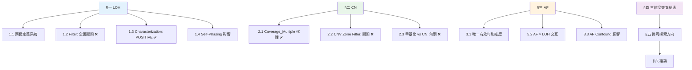
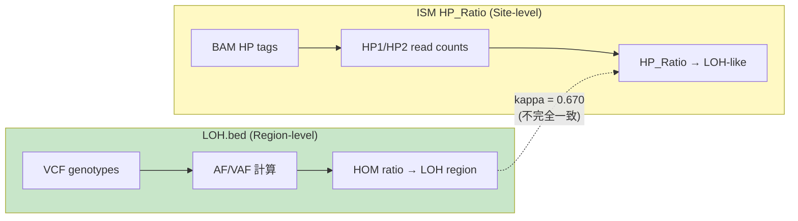
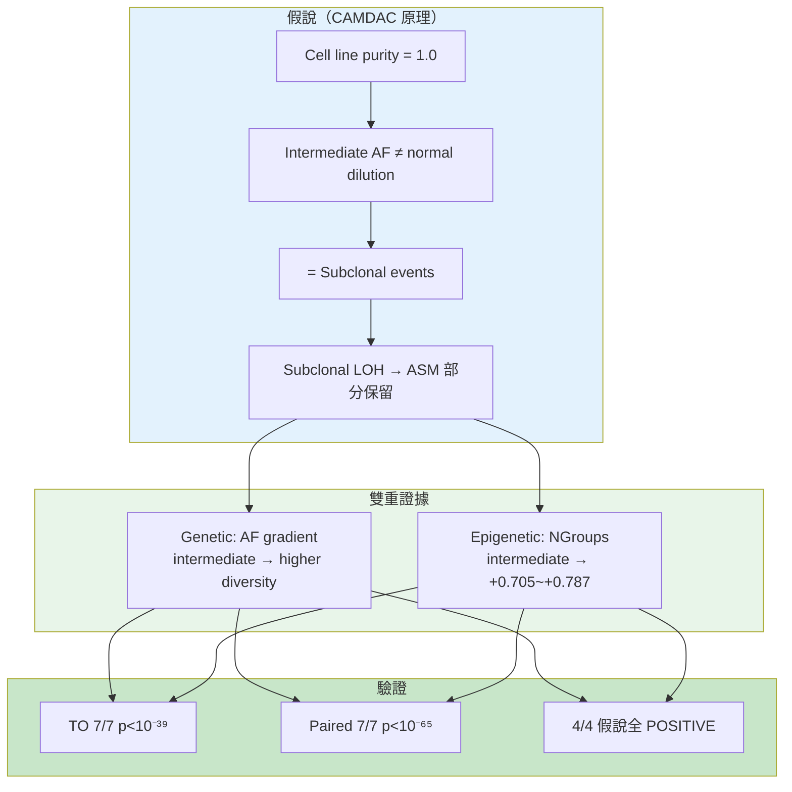
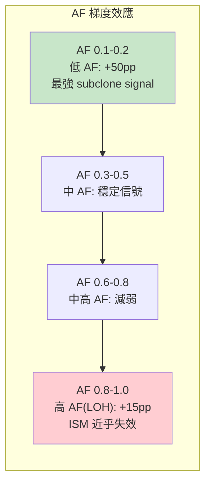

<!--
建立時間: 2026-04-17 10:00
目標: 以 LOH/CN/AF 三維度為軸心，統合全部已完成研究結論與未探索方向
處理範圍: 2025-11 至 2026-04 全部 LOH/CN/AF 相關研究（50+ 份來源文件）
關聯檔案:
  - docs/reports/research_landscape/01_TO_FP問題全貌.md
  - docs/reports/research_landscape/02_Self_Phasing根因.md
  - docs/reports/research_landscape/03_ISM分析價值界定.md
  - docs/reports/research_landscape/04_暫停判定與重評估.md
  - docs/reports/research_landscape/05_證據鏈總覽.md
  - docs/reports/research_landscape/06_結論穩定性審查.md
  - docs/experiments/INDEX.md (O12/O15/Wave1-3/CNV/GC 條目)
  - docs/experiments/validated/2026/04/20260414_LOH_Subclone_AF_Methylation_Evidence_01.md
  - docs/experiments/validated/2026/04/20260413_Phase_BCD_Dual_BAM_Validation_01.md
  - docs/experiments/in_progress/2026/04/20260409_SEQC2_CNV分層觀察_01.md
  - docs/reports/validated/2026/04/20260406_LOH雙定義交叉分析報告/
  - docs/reports/validated/2026/04/20260406_肉眼檢視推理鏈與TP_FP可區分性分析_01.md
  - docs/reports/validated/2026/03/20260330_post_hp_fix_to_loh_investigation_01.md
  - docs/reports/validated/2026/03/20260327_LOH_round1_cross_sample_audit_01.md
  - docs/reports/validated/2026/03/20260328_LOH_evidence_panel_final_report_01.md
-->

# LOH / CN / AF 研究總整理

> **版本**: v1.0 (2026-04-17)
> **涵蓋範圍**: 2025-11 ~ 2026-04，橫跨 30+ 份實驗報告、7 個樣本、748K regions
> **前置閱讀**: [00_INDEX.md](00_INDEX.md) → [01-06 系列](01_TO_FP問題全貌.md)

---

## 一句總結

**LOH / CN / AF 三個維度在 ISM 研究中經歷了系統性探索：AF 是唯一結構性有效的 TP/FP 判別維度（但來自 caller 非 ISM）；LOH 作為 filter 全面關閉但作為 subclone characterization 取得雙模式確認的 POSITIVE 結果；CN 由 Coverage_Multiple 充分代理（r=0.831）但 zone-aware filter 跨樣本不可行。三維度的正面價值全在 characterization 而非 filtering。**

---

## 文件導覽



---

## 一、LOH（Loss of Heterozygosity）

### 1.1 兩套 LOH 定義系統

ISM 中存在兩套獨立的 LOH 判定系統，使用**不同數據源**，這是理解所有 LOH 研究結果的關鍵前提。

| 系統 | 數據源 | 判定邏輯 | 程式碼位置 | SEQC2 驗證 | 穩定度 |
|------|--------|---------|-----------|-----------|--------|
| **LOH.bed** (LongPhase) | VCF AF/VAF | `VAF ≥ 0.8 → HOM`; `heterozygosity_ratio < 0.09 → LOH` | `PhasingGraph.cpp:1817` | **Jaccard=0.928** | ⭐4 |
| **ISM HP_Ratio** | BAM HP tags | `HP_Ratio < 0.1 or > 0.9 → LOH-like` | `ReadParser.cpp:123` | 跨模式 r=0.001 | ⭐2 (TO) |



**關鍵發現**（[P0-3 確認 2026-04-11](../../concepts/2026/04/20260409_待確認重要事項_01.md)）：
- 兩系統使用不同數據源完美解釋 Jaccard=1.0（LOH.bed 不受 self-phasing 影響）與 62% ISM LOH 消失的表面矛盾
- kappa=0.670 的不一致：VCF-level LOH 定義 ≠ BAM HP tag-level LOH 定義

---

### 1.2 LOH 作為 TP/FP Filter — 全面關閉 ❌

**四輪漸進式驗證 + 三波交叉分析 + 多維觀察**，166 張圖表 × 16 個判定，結論一致指向關閉。

#### 研究時間線

| 時間 | 研究 | 核心結果 | 判定 |
|------|------|---------|------|
| 2026-03-27 | [Round 1-2](../../reports/validated/2026/03/20260327_LOH_round1_cross_sample_audit_01.md) | Paired LOH-like FP enrichment=1.194×（但方向混合） | 待分層 |
| 2026-03-27 | [Round 3](../../reports/validated/2026/03/20260327_LOH_round3_methyl_hp0_filter_01.md) | LOH+HPMergedSig 7.4× FP enrichment | ⚠️ 需跨樣本驗證 |
| 2026-03-28 | [Round 4 修正](../../reports/validated/2026/03/20260328_LOH_evidence_panel_final_report_01.md) | 7.4× 崩塌至 1.3×（HCC1395 chr8 特異性）；Tier A/A+ 方向相反 | ❌ 不可作 filter |
| 2026-04-02 | [O15 LOH 區域量化](../../experiments/INDEX.md) | 7/7 samples LOH 內 AUC~0.50；只有 caller 特徵保留區分力 | ❌ LOH 內甲基化失效 |
| 2026-04-02 | [O12 LOH 三場景](../../experiments/INDEX.md) | AlleleDelta=AF confound; L2=collider bias; L3 全<0.59 | ❌ 場景不可區分 |
| 2026-04-06 | [Wave 1-3 交叉分析](../../reports/validated/2026/04/20260406_LOH雙定義交叉分析報告/00_INDEX.md) | 10/10 filter FAIL; Non-LOH max AUC<0.58; Voting AUC=0.577 | ❌ 全面關閉 |
| 2026-04-06 | cnLOH 子分析 | PairwiseMeanDist 0.587 是 Simpson's Paradox（per-sample mean=0.50, 5/7 一致） | ❌ 虛假信號 |

#### LOH Enrichment 雙層結構（Round 4 → HP fix 後更正）

Round 3 報告的 `A≥30 enrichment 1.169×` 在 Round 4 被拆分為兩層。但 **HP bug 修正（2026-03-30）+ 全量重跑後**，原始的方向反轉消失：

| Tier | 定義 | Pre-HP-fix (Round 4) | Post-HP-fix (current) | 方向 | 穩定度 |
|------|------|---------------------|----------------------|------|--------|
| **A (30-49 reads)** | 中等支持度 LOH | ~~0.43×~~ | **0.903** | TP 富集（方向不變，幅度縮小） | ⭐3 |
| **A+ (≥50 reads)** | 高支持度 LOH | ~~2.018×~~ | **0.766** | **TP 富集**（方向反轉！原為 FP 富集） | ⭐3 |
| A≥30 (混合) | 全層 | ~~1.169×~~ | **0.805** | TP 富集（all tiers 一致） | — |

> **重要更正（2026-04-17 驗證）**：pre-HP-fix 的 0.43×/2.018× 方向反轉是 HP integer tag bug 的 artifact。Post-HP-fix 數據顯示 **ALL tiers 均為 TP-enriched**，A+ 甚至比 A 更加 TP-enriched。此結果更一致地支持「LOH 不能作為 FP filter」的核心結論。
>
> 驗證報告：`research/loh_cn_af_verification/20260417_LOH_CN_AF_結論驗證報告_01.md`

#### LOH+HPMergedSig 7.4× 的真相

| 維度 | 數值 | 解讀 |
|------|------|------|
| 全域 enrichment | 7.4× | 表面上極強 |
| 來源集中度 | 70/80 (87.5%) 來自 HCC1395 | **樣本特異性** |
| 染色體集中度 | 66/80 (82.5%) 在 chr8 | **位置特異性** |
| 排除 HCC1395+HCC1954 後 | 1.3× (不顯著) | 全域無效 |
| 根因 | HCC1395 chr8 大型 LOH block + ASM | 不可泛化 |

#### 統合判定表

| 策略 | 結果 | F1 delta | 穩定度 | 來源 |
|------|------|---------|--------|------|
| LOH binary filter | 全失敗 | 全負值 | ⭐4 | Round 1-4 |
| Non-LOH 多特徵 | Voting AUC=0.577 | — | ⭐4 | Wave 3 J13 |
| LOH+HPMergedSig | 樣本特異性 | -0.00004~-0.00006 | ⭐4 | Round 4 |
| cnLOH zone | Simpson's Paradox | — | ⭐5 | Wave 3 J14 |
| LOH-Aware dim switch | AlleleDelta AUC=0.556 不足 | — | ⭐3 | Wave 3 J16 |
| CramersV in LOH | NumReads confound (0.511→0.464) | — | ⭐4 | Wave 3 J15 |

---

### 1.3 LOH 作為 Characterization — POSITIVE ✅

#### LOH Subclone AF × Methylation 雙重證據鏈

**核心發現**：LOH 區域 intermediate AF (0.1-0.4 / 0.6-0.9) 的 variants 具有顯著更高的甲基化多樣性，構成 genetic (AF) + epigenetic (ASM) 雙重 subclone 證據。

| 指標 | TO mode | Paired mode | 跨模式 |
|------|---------|-------------|--------|
| ΔNGroups (Inter vs Extreme) | **+0.705** (7/7 p<10⁻³⁹) | **+0.787** (7/7 p<10⁻⁶⁵) | 7/7 方向一致 |
| NR-controlled |r| | 0.48-0.71 | **median 0.755** | Paired 更強 |
| Segment ρ | 0.270 (6/7 positive) | **0.382** (6/7 positive) | 一致 |
| AlleleDelta d | — | **+0.724** (CAMDAC 驗證) | — |
| HPFineF d | — | **+0.639** | — |



**報告位置**：[TO + Paired 驗證報告](../../experiments/validated/2026/04/20260414_LOH_Subclone_AF_Methylation_Evidence_01.md)

#### 其他 Characterization 正面結果

| 結果 | 數據 | 來源 |
|------|------|------|
| Phase C LOH concordance | ISM hp_ratio vs LOH.bed **94.1%** | [Phase B/C/D 驗證](../../experiments/validated/2026/04/20260413_Phase_BCD_Dual_BAM_Validation_01.md) |
| HPFineNGroups × LOH | LOH 區域 intermediate AF → NGroups 顯著更高 | [R1-R5 報告](../../reports/validated/2026/04/20260406_肉眼檢視推理鏈與TP_FP可區分性分析_01.md) |
| 4-group subclone 分層 | Normal Diploid 17.5% / Epi.Het 12.9% / LOH 2.6% / Tumor-Specific 67.0% | Phase D 驗證 |

---

### 1.4 Self-Phasing 對 LOH 的影響

Self-phasing circular dependency 是所有 TO LOH 問題的根本原因。完整因果鏈見 [02_Self_Phasing根因.md](02_Self_Phasing根因.md)，此處僅列 LOH 相關摘要。

| 指標 | 數值 | 意義 | 穩定度 |
|------|------|------|--------|
| Somatic HP1:HP2 bias | **17.3:1** | 94.6% somatic reads → HP1 | ⭐4 |
| ISM-level LOH artifact | **62%** 消失 | AF 0.1-0.8 近 100% | ⭐4 |
| 同位點 HP_Ratio 跨模式 | **r = 0.001** | 完全不相關 | ⭐5 |
| TO-only LOH 在 Paired 下平衡 | **86.5%** | HP_Ratio 0.4-0.6 | ⭐4 |
| LOH.bed Jaccard (PON-only vs baseline) | **1.0000** | LOH.bed 不受影響 | ⭐4 |

**精確化**：「62% TO LOH 是 artifact」中的 LOH 指 **ISM HP_Ratio LOH**，非 LOH.bed region-level LOH。Self-phasing 影響位於 `haplotag → ISM HP_Ratio` 路徑。

**修正狀態**：
- ✅ VCF 層面：somatic bias 消除, N50 +99.7%, phased rate +23.6pp
- ❌ Haplotag 層面：GT=0|0 解析缺陷待修（ReadParser 修正方案已確認，待實作）
- ⏳ 全量重跑：7 samples × paired + TO，待 P0-1 完成

---

## 二、CN（Copy Number）

### 2.1 Coverage_Multiple 作為 CN Proxy — 驗證通過 ✅

ISM 使用 read depth 計算的 `Coverage_Multiple` 作為 CN 的代理指標，已通過 SEQC2 正交驗證。

| 驗證指標 | 數值 | 門檻 | 判定 |
|----------|------|------|------|
| Coverage_Multiple vs SEQC2 CN (Paired) | **r = 0.831** | — | 可信 |
| Coverage_Multiple vs SEQC2 CN (TO) | **r = 0.827** | — | 可信 |
| KDE auto-estimation 準確度 | **6.2% → 43.8%** | — | `--expected-coverage` CLI 已實作 |
| GC-Content 校正 delta-r | **-0.0002** | ≥ 0.03 | **不需要** |
| ONT 5kHz GC bias 影響 | 98.7% regions 變化<5% | — | 極小 |
| TP/FP AUC 變化（GC 校正後） | 0.5095 → 0.5097 | — | 無變化 |

**結論**（穩定度 ⭐4）：Coverage_Multiple 已是足夠可信的 CN 代理，不需要外部 CNV 工具，也不需要 GC 校正。

**報告來源**：[SEQC2 CNV 分層觀察](../../experiments/in_progress/2026/04/20260409_SEQC2_CNV分層觀察_01.md) | [GC 校正與甲基化-CN 驗證](../../experiments/INDEX.md)

---

### 2.2 CNV Zone-Aware Filter — 關閉 ❌

使用 SEQC2 正交驗證 CNV truth set（6 callers × 21 replicates × 3 technologies）進行三階段分析：

#### Phase 1：HCC1395 單樣本（有信號）

| CNV Zone | ISM Regions | FP | FP Rate | vs 全域 |
|----------|-------------|-----|---------|---------|
| Gain+LOH | 7,078 | 721 | **10.2%** | **2.6×** |
| LOH-only | 7,534 | 290 | 3.9% | 1.0× |
| Gain-only | 15,459 | 203 | 1.3% | 0.3× |
| Neutral | 1,056 | 11 | 1.0% | 0.3× |
| **全域** | 31,640 | 1,253 | **4.0%** | baseline |

- Gain+LOH 集中 **57.5% FP**
- Zone-specific 最佳 AUC：AlleleDelta **0.782**（Gain+LOH 區域）

#### Phase 2：7 樣本跨樣本驗證（不穩定）

| 指標 | 結果 | 判定 |
|------|------|------|
| FP rate 模式一致性 | CN_HighGain > CN_Normal 僅 **4/7** | ❌ 不穩定 |
| Zone-specific mean AUC | **≤ 0.641** | ❌ 未突破上限 |
| Simpson's Paradox 檢查 | QS diff = **-0.042**（pooling 反而有利） | ❌ CNV 非 pooling 問題 |

#### Phase 3：根因分析

| CN 值 | LOH 狀態 | FP Rate | 解讀 |
|--------|---------|---------|------|
| CN=3 | LOH | **12.9%** | 最高——中等 gain + LOH 的 allele 不平衡 |
| CN≥5 | LOH | 下降 | FP rate 隨 CN 增加反而下降 |
| CN=3 | Non-LOH | 2.3% | 無 LOH 時正常 |

**根因**：CN=3+LOH 環境造成 caller 最容易被 allele imbalance 誤導，但此模式是**樣本特異性**（HCC1395 的 chr8 大型 Gain+LOH block）。

#### Zone 排除策略 trade-off

| 排除策略 | FP 移除 | TP 損失 | 判定 |
|----------|---------|---------|------|
| 排除 CN_Loss | 45% FP | 11% TP | ❌ 低於 break-even |
| 排除 Gain+LOH | 57.5% FP | 22.4% TP | ❌ 低於 break-even |
| 排除 all LOH | 80% FP | 47% TP | ❌ 損失過大 |

**結論**（穩定度 ⭐4）：CNV 不是特徵空間耗盡的根因；zone 排除策略 trade-off 全不可行；CNV zone-aware filter **正式關閉**。

---

### 2.3 甲基化 vs CN — 完全無關 ❌

| 指標 | 數值 | 解讀 |
|------|------|------|
| 所有 HP-free 特徵 vs CN (residualized) | **全部 \|r\| < 0.07** | 甲基化對 CN 完全無感 |
| HPFineNGroups vs CN raw | r = 0.495 | 表面相關 |
| HPFineNGroups vs CN residualized | r = **0.160** | **68% 是 NumReads confound** |
| CramersV vs CN residualized | r = -0.726 | **零值 artifact**（93% CramersV=0） |

**結論**（穩定度 ⭐4）：ISM 甲基化特徵對 CN 狀態**完全不敏感**（CN-blind）。HPFineNGroups 與 CN 的表面相關主要來自 NumReads 混淆。

---

## 三、AF（Allele Frequency）

### 3.1 AF 作為唯一有效判別維度

在所有 60+ 特徵中，AF 是唯一對 TP/FP 有結構性判別力的維度——但它來自 variant caller 而非 ISM。

| 實驗 | AF 相關結果 | ISM 相關結果 | 結論 |
|------|-----------|-------------|------|
| **TO-pure LOSO** | caller_af AUC=**0.654** | All-ISM AUC=0.60-0.64 | AF 單獨超越全 ISM |
| **ISM+Caller 組合** | ISM+Caller AUC=0.66 | ISM 增量 **+0.003~+0.030** | ISM 近乎無效 |
| **FN 最強信號** | LabelAllelePermanovaF=**0.664** | HP-free 全 AUC<0.53 | 最強信號也是 AF proxy |
| **O1-O10** | caller_gq TO AUC=0.566 | QS AUC=0.497 (隨機) | Caller > ISM |

**報告來源**：[TO-pure 獨立建模](../../experiments/INDEX.md) | [O9 FN 觀察](../../experiments/INDEX.md)

---

### 3.2 AF 與 LOH 的交互

AF 梯度在 LOH 區域有特殊行為，構成 subclone 分析的重要維度。

| 觀察 | 數據 | 意義 | 來源 |
|------|------|------|------|
| **Subclone AF gradient** | Intermediate AF → NGroups +0.705~+0.787 | AF 預測 subclone diversity | [LOH Subclone](../../experiments/validated/2026/04/20260414_LOH_Subclone_AF_Methylation_Evidence_01.md) |
| **AF≥0.9 ISM 失效** | VerificationClass Noise ≥87%（TP+FP 均如此） | 高 AF = LOH 區域，ISM 無效 | O1-O10 |
| **低 AF (0.1-0.2) 最強** | HPFineNGroups N≥4 vs N≤2 差距 **+50pp** | 稀有 somatic clone diversity 更多元 | [R4](../../reports/validated/2026/04/20260406_肉眼檢視推理鏈與TP_FP可區分性分析_01.md) |
| **AF (0.8-1.0) 最弱** | HPFineNGroups 差距 +15pp | 接近 LOH，子群被壓縮 | R4 |
| **LOH-germline-escape** | BRCA1 3.50×, TNBC 2.15×, 肺腺癌 1.3× | BRCA/HR-deficient 特有 | O1-O10 全量 |



---

### 3.3 AF Confound 對分析的系統性影響

AF 是 ISM 分析中最重要的混淆因子（confound），多個表面上的甲基化信號在控制 AF 後消失。

| 被影響指標 | 原始 AUC | 控制 AF 後 | 影響方式 | 識別方法 |
|-----------|---------|-----------|---------|---------|
| **AlleleDelta** | ~0.55 | ~0.50 | 直接 AF proxy | L3 AF-bin 分層 |
| **CramersV L2** | 0.80 | 0.50 | **Collider bias** | L2-L3 差異 > 0.10 |
| **Epipolymorphism** | 0.845 | 0.530 | NumReads confound (AF→NR) | Read-count matching |
| **LabelAllelePermanovaF** | 0.664 | ~0.50 | AF 梯度驅動 | 控制 AF 後降至隨機 |
| **HPFineNGroups vs CN** | r=0.495 | r=0.160 | 68% NR confound (AF→NR→NGroups) | Residualization |

**Collider Bias 識別規則**（見 [L2 Collider Bias 警告](02_Self_Phasing根因.md)）：
- 若 `AUC_L2 - max(AUC_L3) > 0.10` → 判定為 collider bias
- 保守估計：`AUC_decision = min(AUC_L2, max_L3 + 0.03)`
- 特別易受影響：binary/near-constant features（如 TO 下的 CramersV, HeuristicScore）

---

## 四、三維度交叉總表

| 研究方向 | LOH | CN | AF | 最終判定 | 穩定度 |
|----------|-----|----|----|---------|--------|
| **ISM 作為 TP/FP filter** | ❌ 10/10 策略全失敗 | ❌ zone 排除全不可行 | ⚠️ AF 是唯一信號但來自 caller | **全面關閉** | ⭐4 |
| **Self-phasing 根因** | ✅ CONFIRMED (62% ISM LOH artifact) | — | ✅ 低 AF 最嚴重 | **因果鏈確認** | ⭐4 |
| **Subclone characterization** | ✅ LOH intermediate AF (7/7 p<10⁻³⁹) | — | ✅ AF gradient 預測 NGroups | **POSITIVE** | ⭐4 |
| **Coverage proxy 驗證** | — | ✅ r=0.831 (SEQC2) | — | **已足夠** | ⭐4 |
| **甲基化 vs CN** | — | ❌ 全部 \|r\|<0.07 | — | **CN-blind** | ⭐4 |
| **GC bias 校正** | — | ❌ delta-r=-0.0002 | — | **不需要** | ⭐4 |
| **FN rescue** | ❌ HP-free AUC<0.53 | — | ⚠️ 最強信號是 AF proxy (0.664) | **NO-GO** | ⭐4 |
| **LOH.bed 可信度** | ✅ Jaccard=0.928 (SEQC2) | — | — | **可信** | ⭐4 |
| **HPFineNGroups** | ✅ LOH×AF 交互有效 | ❌ CN 相關=NR confound | ✅ 低AF最強(+50pp) | **Somatic marker** | ⭐4 |

---

## 五、尚可探索的方向

### A. 高優先（直接可行，依賴現有基礎設施）

| # | 方向 | 依據 | 前置條件 | 預期收益 |
|---|------|------|---------|---------|
| **A1** | Self-phasing 修正後 HP-dependent 特徵重測 | 29 個 B 類特徵 AUC 受汙染；within_dom_alt_frac LOSO=0.721 可能改善 | P0-1 ReadParser 修正 | **最可能反轉 CONDITIONAL NO-GO** |
| **A2** | Phase 2A Normal Methylation Reference baseline | Phase B/C/D 架構已驗證；Sample ASM 97.3% sig | A1 全量重跑數據 | Normal 甲基化基線 |
| **A3** | LOH Subclone 更精細 AF-bin 分析 | 目前只分 2 組（intermediate vs extreme）；更細 bin 可精確化 subclone 結構 | 現有數據即可 | 精確化 characterization |
| **A4** | 7 樣本全量 Phase 2A 驗證 | HCC1395 驗證通過；6 樣本待執行 | Phase A-D 程式碼已完成 | 跨樣本穩定性確認 |

### B. 中優先（需額外條件或深度設計）

| # | 方向 | 依據 | 缺什麼 | 風險 |
|---|------|------|--------|------|
| **B1** | 低純度樣本 within_dom_alt_frac 驗證 | 高純度限制（~40% TP also=1.0）；低純度預期分離度更高 | 低純度臨床樣本數據 | 數據取得不確定 |
| **B2** | HCC1395 chr8 LOH+ASM 深度機制 | 7.4× enrichment 有生物學價值（LOH block + ASM）| LOH bed + methylation heatmap | 僅對特定癌型有啟示 |
| **B3** | Per-CpG ASM 指標 C++ 整合 | 6 家族 24 metrics PoC 完成；推薦精簡 10 欄位 | C++ 實作+測試 | Filter value=0，僅 characterization |
| **B4** | Phase 2B Gene-level LOH Subclone 整合 | LOH intermediate AF + NGroups → TSG 二次打擊意義重大 | Gene annotation bed + 功能分類 | 生物資訊學工作量 |

### C. 低優先（已部分排除或條件極特殊）

| # | 方向 | 為什麼低 | 條件 |
|---|------|---------|------|
| **C1** | TP loss 5% 放寬安全約束 | 目前 ≤2% 下 FP removal=0% | 臨床場景允許 |
| **C2** | Mutational signature 特徵 | caller_af=0.654 已超越全 ISM | signature 計算工具 |
| **C3** | LOH-Aware dimension switching | AlleleDelta AUC=0.556 不足 | Self-phasing 修正後重評 |
| **C4** | cnLOH 特殊子區域 | Simpson's Paradox 已否定 | 排除 H2009 後小樣本 |
| **C5** | 5hmC 雙通道距離矩陣 | 技術門檻高 | 全新 pipeline |

### D. 已確定關閉（不應重複探索）

| 方向 | 關閉原因 | 穩定度 | 首次關閉日期 |
|------|---------|--------|------------|
| LOH 作為 binary FP filter | 10/10 策略全失敗；LOH 是 TP-enriched | ⭐4 | 2026-04-06 |
| CNV zone-aware filter | 跨樣本不一致；trade-off 全不可行 | ⭐4 | 2026-04-10 |
| 甲基化-CN 相關驗證 | 所有 HP-free \|r\|<0.07；CN-blind | ⭐4 | 2026-04-11 |
| GC bias 校正 | delta-r=-0.0002；ONT GC bias 極小 | ⭐4 | 2026-04-11 |
| 純甲基化 clustering (Option C) | HP-free AUC=0.564；ClusterPermanovaF=0.512 | ⭐4 | 2026-04-07 |
| cnLOH 表面信號 | Simpson's Paradox per-sample=0.50 | ⭐5 | 2026-04-06 |
| LOH+HPMergedSig 全域 marker | 87.5% HCC1395 chr8 特異 | ⭐4 | 2026-03-28 |
| FN rescue via ISM | HP-free 全 AUC<0.53；FN≡TP in methylation | ⭐4 | 2026-04-08 |
| TO-pure 獨立建模 | ISM 僅增 +0.003 over caller_af | ⭐4 | 2026-04-08 |
| Cross-region correlation | Shared read count confound | ⭐5 | 2026-04-01 |
| Fine-Pairwise Distance | 6 pairwise 全 AUC<0.58；特徵空間耗盡 | ⭐4 | 2026-04-08 |

---

## 六、結論性觀察

### 核心教訓

1. **AF 是唯一結構性有效的判別維度**，但來自 variant caller 而非 ISM — ISM 甲基化特徵在控制 AF confound 後全部 ≤ 0.58。
2. **LOH 在 TO 下有兩層含義**：LOH.bed 可信（SEQC2 Jaccard=0.928），但 ISM HP_Ratio LOH 在 TO 下受 self-phasing 系統性汙染（62% artifact）。兩套系統使用不同數據源。
3. **CN 資訊已被 Coverage_Multiple 充分代理**（r=0.831），但 CNV zone 不提供可行的 filter 策略，且甲基化對 CN 完全無感。
4. **三維度的正面價值全在 characterization**：LOH subclone AF × methylation（雙模式確認）、HPFineNGroups somatic heterogeneity marker、ASM 32-66%。

### 最關鍵的下一步

**完成 haplotag 全量重跑（A1）**是解鎖 A2/A3/A4 和重評 B1/C3 的**唯一前置條件**。依賴鏈：

```
P0-1 ReadParser 修正 → P0-2 特徵重測 → P0-4 全量重跑 → Phase 2 啟動
```

### ISM 定位確認

> ISM 的核心價值在 **read-level epigenetic characterization**，而非 variant filter。LOH/CN/AF 三個維度的系統探索從反面（60+ 特徵全 ≤ 0.58 for filtering）和正面（subclone characterization 雙模式確認）共同支撐此定位。
