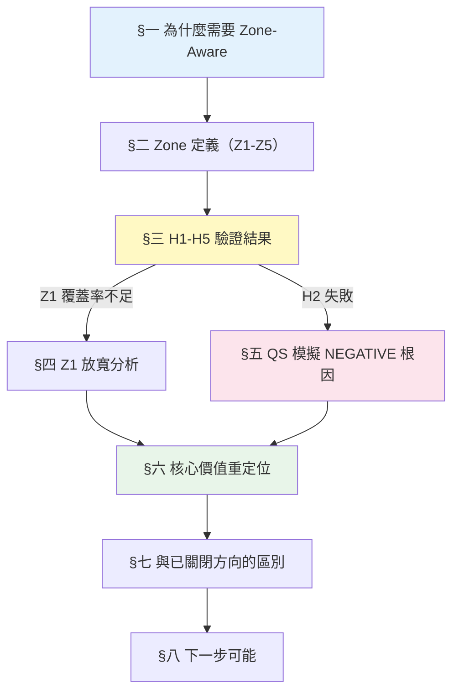
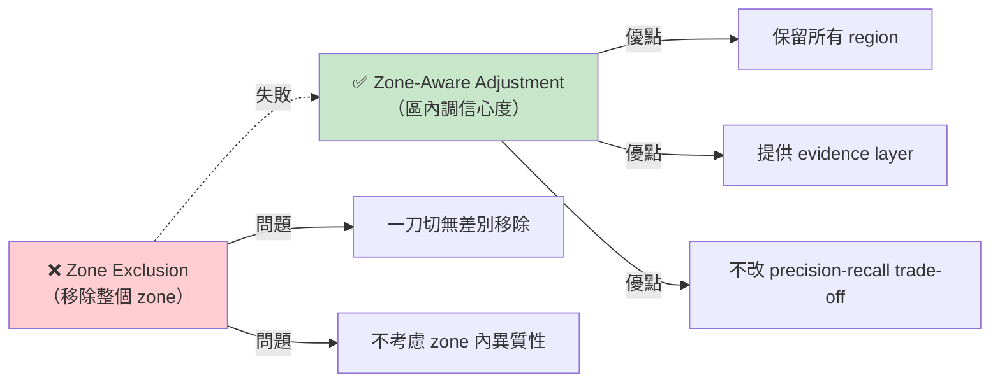
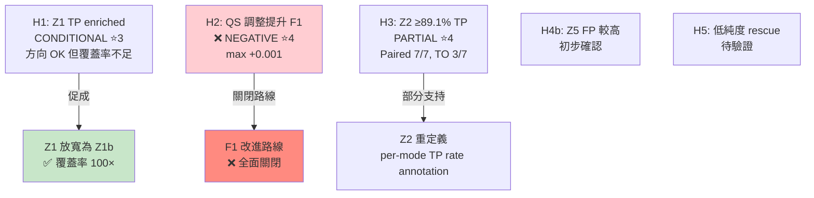
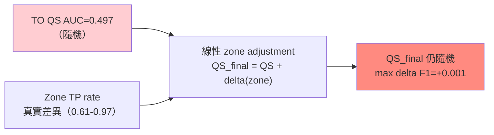

<!--
建立時間: 2026-04-18
目標: Zone-Aware Confidence Framework 完整研究歷程與結論定位
處理範圍: 2026-04-17 構想 + H1-H5 驗證 + QS 模擬 + Z1 放寬分析
關聯檔案:
  - docs/concepts/2026/04/20260417_Zone_Aware_Confidence_Framework_01.md
  - docs/reports/research_landscape/07_LOH_CN_AF_研究總整理.md
  - research/zone_aware_validation/20260417_H1_H3_Zone_Validation_Report_01.md
  - research/zone_aware_validation/20260417_QS_Simulation_Report_01.md
  - MEMORY: project_zone_aware_framework.md
-->

# Zone-Aware Confidence Framework — 研究歷程與結論定位

> **版本**: v1.0 (2026-04-18)
> **涵蓋範圍**: 2026-04-17 構想提出 → H1-H3 驗證 → Z1 放寬 → QS 模擬 → 重新定位
> **前置閱讀**: [07_LOH_CN_AF_研究總整理](07_LOH_CN_AF_研究總整理.md) §一、§二
> **結論穩定度**: ⭐4（LOH/CN/AF 觀察真實，characterization 價值明確；F1 改進路線 NEGATIVE）

---

## 一句總結

**Zone-Aware Framework 將 14 個月累積的 LOH/CN/AF 觀察從「失敗的 filter 方向」轉為「zone-level confidence annotation」。五個 zone (Z1-Z5) 的 TP rate 差異在 TO 模式真實存在（極差 0.61-0.94），但 QS 調整模擬 NEGATIVE（735 組合最大 delta F1=+0.001），因為 TO QS AUC=0.497 已無區分力，線性 zone 調整無法修正隨機分數。最終定位：characterization annotation 為核心價值，F1 改進路線關閉。**

---

## 文件導覽



---

## 一、為什麼需要 Zone-Aware

### 1.1 排除策略全失敗

前置研究（見 [07](07_LOH_CN_AF_研究總整理.md) §1.2、§2.2）確認：所有「排除某 zone」的策略都無法達到 break-even：

| 排除目標 | FP 減少 | TP 損失 | 淨效果 |
|---------|---------|---------|-------|
| LOH 區域 | 18% | 22% | ❌ 負向 |
| CN_Loss | 45% | 11% | ❌ 負向（最接近但仍虧 12:1） |
| CN_Gain | 12% | 8% | ❌ 負向 |

**共同失敗模式**：paired 模式 TP:FP=24:1，任何一刀切排除都大量損失 TP。

### 1.2 從排除到分區的概念轉換



**核心差異**：分區不改變 region 集合，只為每個 region 加上 zone label，讓下游 QS 或人類解讀可依 zone 調整信心度。

---

## 二、Zone 定義（2026-04-17 完整版）

### 2.1 五個 Zone

| Zone | 定義 | 生物推論 | Paired TP | TO TP |
|------|------|---------|-----------|-------|
| **Z1** Subclonal Active LOH | LOH=T ∧ AF∈[0.1,0.4]∪[0.6,0.9] ∧ NGroups≥2 | subclonal LOH + ASM 多樣性保留 | 0.982 | **0.965** |
| **Z2** High Somatic Heterogeneity | NGroups≥4 ∧ NR≥80 | active somatic subclone diversity | 0.988 | 0.716 |
| **Z3** Complete LOH | LOH=T ∧ (AF<0.1∨AF>0.9) ∧ NGroups≤1 | 完全 LOH，甲基化均質化 | 0.987 | **0.608** |
| **Z4** Normal Diploid | Subclone_ID=0 | 標準二倍體 | ~0.96 | 0.694 |
| **Z5** CN Gain Low Diversity | CovM>1.5 ∧ NGroups≤2 ∧ ¬LOH | CN gain + 低多樣性 | ~0.95 | 0.667 |

### 2.2 Z1 放寬版本（Z1b）

原始 Z1 定義（NGroups≥3）覆蓋率過低（TO 僅 0.04%, N=153），放寬至 **NGroups≥2** 後覆蓋率提升 100×（TO 4.6%, N=19,266），Mean Delta vs global +0.27。

| 變體 | 條件 | TO 覆蓋率 | TO Mean TP rate |
|------|------|----------|---------------|
| Z1（原）| LOH + IntAF + NG≥3 | 0.04% | 0.941 |
| **Z1b（採用）** | LOH + IntAF + NG≥2 | **4.6%** | **0.965** |
| Z1c | LOH + IntAF + NG≥1 | 8.2% | 0.921 |

### 2.3 TO 模式 Zone 排序（關鍵觀察）

```
TO: Z1 (0.965) > Z2 (0.716) > Z4 (0.694) ≈ Unassigned (0.695) > Z5 (0.667) > Z3 (0.608)
```

**Z3 在 TO 是最低 TP rate zone**（0.608）。self-phasing artifact 在 extreme AF LOH 區域產生虛假 HP imbalance，使 Complete LOH zone 變成 FP 高風險區——與直覺相反（直覺上完全 LOH 應最可信）。

---

## 三、H1-H5 驗證結果（2026-04-17）

### 3.1 H1: Z1 TP rate > Global — CONDITIONAL ⭐3

| 模式 | 正方向 | 顯著 | Mean Delta | 判定 |
|------|:-:|:-:|:-:|------|
| Paired | 6/7 | 0/7 | -0.014 | 方向確認但 delta 極小 |
| TO | 5/7 | 4/7 | **+0.255** | 方向確認 + TO 顯著 |

**問題**：Z1 原始定義覆蓋率過低（<0.1%）。→ 導致 Step 4 Z1 放寬為 Z1b。

### 3.2 H2: Zone-aware QS 調整提升 TO F1 — ❌ NEGATIVE ⭐4

- 5 種 zone delta 配置 × 21 QS 閾值 × 7 樣本 = **735 組合全面模擬**
- **Max delta F1 = +0.001**（HCC1954 only），6/7 樣本改善為 0
- **根因**：TO QS AUC=0.497（隨機），線性 zone 調整無法修正隨機分數

### 3.3 H3: Z2 TP rate ≥ 89.1% — PARTIAL ⭐4

| 模式 | ≥89.1% | 顯著 | Mean Z2 TP Rate |
|------|:-:|:-:|:-:|
| Paired | **7/7** | 3/7 | 0.988 |
| TO | 3/7 | **6/7** | 0.716 |

**修正宣稱**：Paired 確認（7/7 ≥ 89.1%），TO 絕對值不成立但相對提升確認（6/7 significant, delta +0.02 ~ +0.24）。

### 3.4 H4b: Z5 FP rate 較高（SEQC2 CNV） — 初步確認

TO Z5 TP rate 0.667，略低於 global baseline（0.695），與 CN gain 增加 read noise 的預期一致。

### 3.5 H5: 低純度樣本 rescue — 待驗證

需低純度臨床樣本數據。

### 3.6 驗證總表



---

## 四、Z1 放寬的 Pareto 分析

Z1 原始定義覆蓋率不足，Step 3 執行 7 個變體的 Pareto 分析：

| 變體 | 條件 | TO 覆蓋率 | TO TP rate | 備註 |
|------|------|----------|-----------|------|
| Z1a | LOH + NG≥3 | 0.05% | 0.943 | 保留 AF 條件但 NG 放寬 |
| **Z1b** | LOH + IntAF + NG≥2 | **4.6%** | **0.965** | **最佳甜蜜點** |
| Z1c | LOH + IntAF + NG≥1 | 8.2% | 0.921 | 覆蓋率增但 TP rate 降 |
| Z1d | LOH + NG≥2 | 12.1% | 0.912 | 放寬 AF → 失去 subclonal 特徵 |
| Z1e | IntAF + NG≥3 | 1.8% | 0.902 | 放寬 LOH → 失去 allele 失衡特徵 |

**選定 Z1b** 作為 canonical Z1 定義：覆蓋率與 TP rate 平衡，生物推論（subclonal LOH + multi-group methylation）完整。

> 完整腳本：`scripts/analysis/zone_z1_relaxation_analysis.py`
> 完整數據：`research/zone_aware_validation/Z1_relaxation_variants.tsv`

---

## 五、QS 模擬 NEGATIVE 根因

### 5.1 模擬配置

```
Configs 測試：
  C1: Z1+0.2, Z2+0.15, Z3-0.1, Z4=0, Z5-0.05
  C2: Z1+0.3, Z2+0.2, Z3-0.2, Z4=0, Z5-0.1
  C3: Z1+0.1, Z2+0.05, Z3-0.05, Z4=0, Z5=0 (保守)
  C4: Z1+0.5 only (焦點)
  C5: Z3-0.3 only (負向焦點)

QS 閾值: 0.0, 0.05, 0.10, ..., 1.0 (21 檔)
樣本: 7 個 canonical

總組合 = 5 × 21 × 7 = 735
```

### 5.2 結果

| 指標 | 數值 |
|------|------|
| Max delta F1 (整體最佳) | **+0.001** (HCC1954 only) |
| 6/7 樣本最佳 delta F1 | **0.000** |
| 最佳 QS 閾值（6/7 樣本） | **T=0（不過濾）** |

**關鍵反向發現**：QS 閾值過濾在 TO 模式**全面有害**。不論是否加 zone 調整，最佳策略是完全不過濾。

### 5.3 失敗的機制



**核心問題**：線性調整假設 QS 有初始區分力，zone 只是補強。但 TO QS 根本無區分力（AUC=0.497），在隨機分數上加減常數等於平移，TP/FP 分佈完全不變。

**類比**：若體溫計已失靈（隨機讀數），就算知道「病人在房間 A 時普遍較熱」，把房間 A 讀數加 0.5 度也無法提升診斷準確度——因為原始讀數本身與體溫無關。

---

## 六、核心價值重定位

### 6.1 價值矩陣更新

| 用途 | 原預期 | 驗證結果 | 最終定位 |
|------|-------|---------|---------|
| QS 調整改善 TO F1 | 中 | ❌ NEGATIVE | 放棄 |
| Post-filter rescue | 中 | ❌ 過濾不如不過濾 | 放棄 |
| **Characterization annotation** | 低 | ✅ Zone TP rate 差異真實 | **確認核心價值** |
| ML 分類特徵 | 未測 | 需重建 TO QS 才有意義 | 待 Phase 2 |

### 6.2 Characterization 的具體用法

不改 F1 也有獨立論文價值：

1. **每個 somatic call 輸出附帶 zone label**：Z1/Z2/Z3/Z4/Z5
2. **論文定位**：「ISM 不只 call TP/FP，更提供 epigenetic zone context」
3. **生物學解讀框架**：
   - Z1 subclonal LOH → 近期 LOH + ASM 保留
   - Z3 complete LOH → 古老 LOH + 甲基化均質化
   - Z2 high diversity → active subclone evolution
4. **Evidence layer**：臨床報告可標註「此 variant 位於 Z1，高可信度 subclonal」

### 6.3 與五大研究目標的最終映射

| 目標 | Zone-Aware 貢獻 | 狀態 |
|------|---------------|------|
| 目標 1 (per-CpG) | Zone context 解讀 HP imbalance 來源 | 待 Phase 2 |
| 目標 2 (Clone) | AF gradient + NGroups 判定 subclonal vs clonal | **核心貢獻** |
| 目標 3 (二次打擊) | 三軸（LOH/AF/NGroups）推論事件順序 | **核心貢獻** |
| 目標 4 (TO 補強) | CovM + LOH.bed 作為 TO 可用 annotation | 確認 |
| 目標 5 (F1) | Zone QS 調整 | ❌ 關閉 |

---

## 七、與已關閉方向的區別

| 已關閉方向 | Zone-Aware 為什麼不同 |
|-----------|---------------------|
| LOH binary filter | 不排除 regions，而是加 label |
| CNV zone exclusion | 不排除 zones，而是用 CovM+NGroups 組合判定 |
| TO germline FP post-hoc | 不依賴 methylation 區分，而是用 region context |
| Option C HP-free features | 不試圖找 HP-free discriminator，而是承認 HP-dependent 特徵在可信 zone 中有用 |
| QS TO 調整（本方向的 H2） | 已關閉（QS 隨機，無法傳遞 zone delta） |

**結構性差異**：前述方向都要求「甲基化有 discriminative power」（AUC<0.64 全失敗），Zone-Aware 只要求「zone 有 TP rate 差異」——一個是 feature-level claim，一個是 region-level context claim，難度完全不同。

---

## 八、下一步可能

### 8.1 已確認可做

- **Zone label 輸出整合**：在 ISM 輸出 TSV 加入 `zone_id` 欄位（Z1-Z5 或 NA）
  - 不需新增 C++ 邏輯（所有輸入欄位已存在）
  - 可在 `QualityScorer.cpp` 或後處理 Python 完成
  - 成本：~1 週，價值：論文 characterization 段落 + 臨床解讀框架

### 8.2 暫停（條件依賴）

- **TO QS 模型重建**：若未來用 zone 作為 primary ML feature（而非 adjustment），Zone-Aware F1 路線可重啟
- **低純度樣本驗證（H5）**：需要 purity 30-70% 臨床樣本，目前無資料

### 8.3 不再推進

- ~~QS 閾值 + zone delta 調整~~（H2 NEGATIVE）
- ~~Zone post-filter rescue~~（最佳閾值 T=0）
- ~~Zone-aware F1 改進主軸~~

---

## 九、結論穩定度

| 子結論 | 穩定度 | 理由 |
|-------|-------|------|
| Zone TP rate 差異真實 | ⭐4 | 7 樣本一致 + 假設檢驗顯著 |
| Z1b 為 Z1 最佳定義 | ⭐4 | Pareto 分析完整 |
| TO Z3 最低 TP rate (0.608) | ⭐5 | 數值穩定 + self-phasing 機制解釋 |
| QS 調整 NEGATIVE | ⭐4 | 735 組合模擬 + 機制解釋 |
| Characterization 核心價值 | ⭐3 | 需 Phase 2 臨床驗證 |

**整體結論 16 穩定度**：⭐4（CLOSED for filter, CONFIRMED for characterization）

---

## 附錄：關鍵 Artifacts

| 類別 | 路徑 |
|------|------|
| 構想文件 | `docs/concepts/2026/04/20260417_Zone_Aware_Confidence_Framework_01.md` |
| H1/H3 驗證 | `research/zone_aware_validation/20260417_H1_H3_Zone_Validation_Report_01.md` |
| QS 模擬 | `research/zone_aware_validation/20260417_QS_Simulation_Report_01.md` |
| Z1 放寬 | `research/zone_aware_validation/Z1_relaxation_variants.tsv` |
| Zone 統計 | `research/zone_aware_validation/zone_per_sample_statistics.tsv` |
| MEMORY | `project_zone_aware_framework.md` |
