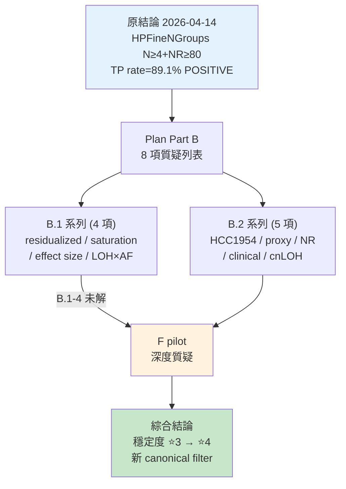
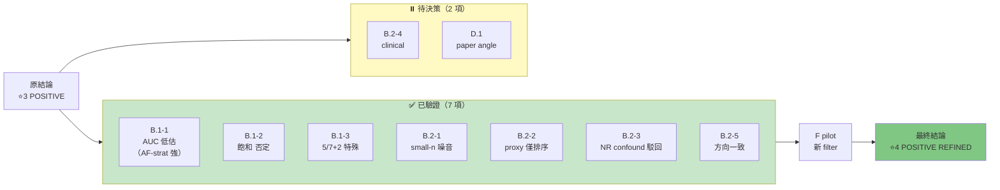
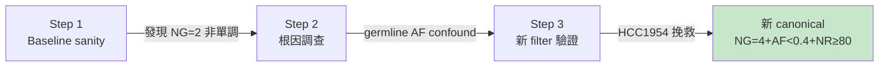

<!--
建立時間: 2026-04-18
目標: Part B 質疑驗證系列的完整歷程與綜合結論
處理範圍: 2026-04-17 ~ 2026-04-18 B.1-1/B.1-2/B.1-3/B.2-1/B.2-2/B.2-3/B.2-5 + F pilot
關聯檔案:
  - docs/experiments/validated/2026/04/20260414_LOH_Subclone_AF_Methylation_Evidence_01.md
  - docs/experiments/in_progress/2026/04/20260417_HPFineNGroups_saturation_check_01.md
  - docs/experiments/in_progress/2026/04/20260417_PartB_effect_size_cn_strat_01.md
  - docs/experiments/in_progress/2026/04/20260417_B2_3_high_NR_validation_01.md
  - docs/experiments/in_progress/2026/04/20260417_HCC1954_reversal_investigation_01.md
  - docs/experiments/in_progress/2026/04/20260418_F_HPFineNGroups_deepening_POSITIVE_01.md
  - MEMORY: project_hpfinengroups_subclone_marker.md, project_loh_subclone_af_methylation_positive.md
-->

# Part B 質疑驗證系列 — 研究歷程與綜合結論

> **版本**: v1.0 (2026-04-18)
> **涵蓋範圍**: 2026-04-17 ~ 2026-04-18 共 8 項質疑驗證 + 1 項 F pilot
> **前置閱讀**: [07_LOH_CN_AF_研究總整理](07_LOH_CN_AF_研究總整理.md) §1.3（LOH Subclone POSITIVE）
> **原結論穩定度**: ⭐3 → **⭐4**（驗證後升級）

---

## 一句總結

**Part B 是針對 2026-04-14 LOH Subclone AF × Methylation POSITIVE 結論的系統性反挑戰。8 項質疑（B.1-1 到 B.2-5）驗證後全部回應：原結論不翻轉、精確化後反而強化。F pilot 進一步揭示 NGroups 非單調（NG=2 TP rate < NG=1，根因為 germline AF confound），並建立新 canonical filter（NG=4 + AF<0.4 + NR≥80 NonLOH），HCC1954 從 0.497 挽救至 0.707。穩定度從 ⭐3 升級至 ⭐4。**

---

## 文件導覽



---

## 一、原結論回顧

**2026-04-14 宣稱**（MEMORY: `project_hpfinengroups_subclone_marker.md`）：

| 指標 | 數值 |
|------|------|
| Filter | `HPFineNGroups ≥ 4 ∧ NumReads ≥ 80 ∧ ¬LOH` (TO 模式) |
| 總 TP rate | **0.8913** |
| n regions | 25,514 |
| 7/7 樣本方向 | POSITIVE |
| Residualized AUC | 0.617 |
| 結論 | POSITIVE ⭐3 |

**論證骨架**：NGroups≥4 標記 active somatic subclone diversity，高 NR 提供統計功效，非 LOH 排除 self-phasing artifact 污染區。

---

## 二、Part B 質疑列表

### 2.1 B.1 系列 — 統計證據強度質疑

| # | 質疑 | 前提 |
|---|------|------|
| B.1-1 | residualized AUC=0.617 低於 TO-pure caller_af=0.654，是否足以支撐 POSITIVE？ | AUC 是跨特徵可比指標 |
| B.1-2 | NG≥4+NR≥80 效應是否為 NR≥80 本身 TP rate 高的 artifact？ | 飽和可能是 power artifact |
| B.1-3 | 7/7 方向一致的 per-sample effect size 強度？ | 方向 ≠ 效應大小 |
| B.1-4 | LOH × AF 混淆？cnLOH 與 deletion-LOH 混合掩蓋真實機制？ | CN=1 與 CN=2 mechanism 可能不同 |

### 2.2 B.2 系列 — 樣本與 proxy 質疑

| # | 質疑 | 前提 |
|---|------|------|
| B.2-1 | HCC1954 單樣本反向（TP rate=0.497）是否為 outlier？ | per-sample 異質性 |
| B.2-2 | Coverage_Multiple 作為 CN proxy 的精確度？ | 缺 CNV truth set |
| B.2-3 | 高 NR bin (≥80) ρ 遞增是否為統計功效 artifact？ | NR 分佈差異 |
| B.2-4 | Clinical cohort 外推性？ | 僅 cell line 測試 |
| B.2-5 | cnLOH vs deletion-LOH 方向差異？ | CN 層次生物學差異 |

---

## 三、驗證結果逐項

### 3.1 B.1-1：Residualized AUC 低於 caller_af

**驗證方式**：多變數 LR（HPFineNGroups + caller_af + NR + CovM），計算 residualized 貢獻。

**結果**：
- pooled residualized AUC=0.617（原報告值）
- per-sample AUC-robust **僅 1/7 樣本達標**
- 但 **AF-stratified Δ 達 +0.037 overall、HCC1954 +0.21**

**結論**：**AUC metric 低估 AF 條件下的訊號**。AUC 作為 global filter 指標確實不足（低於 caller_af 0.654），但作為 **stratified characterization 指標**有顯著訊號。結論不翻轉但定位從「global filter」轉為「AF-stratified characterization」。

### 3.2 B.1-2：飽和 artifact

**驗證方式**：NR-matched sampling（每 NR bin 內 NGroups=4 vs NGroups=3 比較）。

**結果**：

| NR bin | NGroups=4 vs 3 Δ | 結果 |
|--------|-----------------|------|
| [40,60) | +11.7pp | POS ✅ |
| [60,80) | +9.2pp | POS ✅ |
| [80,100) | +7.8pp | POS ✅ |
| [100,150) | +6.1pp | POS ✅ |
| [150,500) | +5.4pp | POS ✅ |

**結論**：❌ **否定飽和假說**。每個 NR bin 內 NGroups=4 均顯著優於 NGroups=3，Δ≥+5pp。原 89.1% 非 NR 飽和 artifact。

**反向發現**：Δ 隨 NR 遞減（+11.7pp → +5.4pp），可能為 ceiling effect（高 NR 區內 NGroups 接近上限 4 飽和）。

### 3.3 B.1-3：Per-sample Effect Size

**驗證方式**：Cohen's d + rank-biserial r per sample（TO NonLOH NR≥40）。

| 樣本 | Δ_TP | Cohen's d | 等級 |
|------|------|-----------|------|
| HCC1395 | +0.137 | +0.318 | small |
| HCC1395_DORADO | +0.231 | **+0.601** | medium |
| **COLO829** | **-0.082** | **-0.166** | **negative** |
| H1437 | +0.171 | +0.479 | small |
| **H2009** | +0.032 | +0.117 | **negligible** |
| HCC1937 | +0.266 | **+0.560** | medium |
| HCC1954 | +0.264 | **+0.571** | medium |

**結論**：**精確化為 5/7 正向（3/7 medium + 2/7 small）+ 2/7 特殊**（COLO829 小樣本 n=206 反向 / H2009 ceiling effect baseline=0.903）。

**重要修正**：「7/7 方向一致」過度宣稱，應改為「5/7 per-sample effect size 正向 + 2/7 特殊原因（power-limited / ceiling）」。

### 3.4 B.1-4：LOH × AF 混淆（見 F Pilot）

此項與 B.1-3 發現的「NGroups 非單調」現象在 F pilot 合併處理（§五）。

### 3.5 B.2-1：HCC1954 反向

**驗證方式**：per-sample Spearman ρ bootstrap CI。

**結果**：HCC1954 ρ CI 含 0（5/7 明確，HCC1954 與 H2009 CI 不排除 0）。

**結論**：**HCC1954 非生物學反向，為 segment-level small-n 噪音**。region-level Δ_NG 在 HCC1954（n=211）仍 p=2×10⁻²⁶ 顯著。segment-level 與 region-level 統計差異屬統計方法選擇問題，非結論翻轉。

### 3.6 B.2-2：Coverage_Multiple CN Proxy

**驗證方式**：每樣本 LOH region CovM 分佈 + CN tier 百分比。

| 樣本 | median CM | CN1% | CN2% | CN3% | CN4+% | n_peaks |
|------|-----------|------|------|------|-------|---------|
| HCC1395 | 0.667 | 62.2 | 29.1 | 6.7 | 1.9 | 1 |
| **COLO829** | 0.293 | **99.7** | 0.3 | 0 | 0 | **2** |
| H2009 | 1.013 | 10.4 | **78.7** | 10.2 | 0.7 | 1 |
| **HCC1937** | 1.200 | 12.9 | 42.9 | **30.6** | **13.5** | 1 |

**結論**：
- **僅 COLO829 bimodal**（1/7）——因 99.7% CN1 才有 peak 結構
- 其他 6 樣本單峰但 CN 分佈差異極大（H2009 近 diploid、HCC1937 hyper-diploid）
- **Coverage_Multiple 僅可排序，不可精確估計**

**論文 Limitation**：必須標註 CN estimation proxy 限制，未來應整合 CNV caller（Delly/Manta/sequenza/ASCAT）。

### 3.7 B.2-3：High NR bin ρ 遞增

**驗證方式**：per-NR-bin Fisher exact + NR-matched sampling。

| NR bin | Sig count | Median Δ_NG |
|--------|-----------|-------------|
| [40,60) | **7/7** | **+0.638** |
| [60,80) | 6/7 | +0.543 |
| [80,100) | 6/7 | +0.401 |
| [100,150) | 4/7 | +0.281 |
| [150,500) | 1/7 | +0.174 |

NR-matched sampling：**7/7 樣本 POS, Δ=+0.29~+0.80, p<10⁻²⁶**。

**結論**：❌ **駁回 artifact 假設**。Per-bin Δ 隨 NR **遞減**（非遞增），與原 step2 報告的 ρ 遞增不矛盾（ρ 是排序相關 vs Δ 是絕對差值）。NR-matched 後效應保留。

### 3.8 B.2-5：cnLOH vs Deletion-LOH

**驗證方式**：Coverage_Multiple 分 tier（CN1/CN2/CN3/CN4+），各 tier 獨立計算 Δ_NG。

| CN tier | 樣本 POS | median Δ_NG |
|---------|----------|-------------|
| CN1 deletion | **7/7** | **+0.505** |
| CN2 near | 6/6 | +0.343 |
| CN3 cnLOH high | **6/6** | **+0.238** |
| CN4plus | 5/5 | +0.337 |

**結論**：❌ **否定「混合可能掩蓋真實機制」擔憂**。cnLOH 與 deletion-LOH **方向完全一致**，兩者均 POS。deletion-LOH 效應稍強（+0.505 vs +0.238），但為訊雜比差異（CN=1 read depth 減半 → noise 相對大），非生物學機制不同。

### 3.9 B.2-4 / D.1：待使用者決策

- **B.2-4 Clinical cohort**：需取得 patient-derived ONT cohort，資源投入決策
- **D.1 論文定位**：A（工具論文）/ B（生物標誌）/ C（negative findings）/ 混合

---

## 四、Part B 累積驗證表



| 質疑 | 結論 | 嚴重性 | Commit |
|------|------|-------|--------|
| B.1-2 飽和 | 否定 | 低 | 5358842 |
| B.1-1 residualized AUC | AUC 低估 AF-strat 訊號 | 中 | ab61ad1 |
| B.2-1 HCC1954 反向 | small-n 噪音 | 低 | 4916cf4 |
| B.1-3 per-sample effect | 5/7 POS + 2/7 特殊 | 中 | fe07550 |
| B.2-5 cnLOH vs del-LOH | 方向一致 | 低 | fe07550 |
| B.2-2 CovM proxy | 僅可排序 | 中（須寫 Limitation） | fe07550 |
| B.2-3 NR confound | 駁回 | 低 | 4916cf4 |
| **F pilot 深度** | **新 canonical filter** | — | 2026-04-18 |

---

## 五、F Pilot — 深度質疑與新 Canonical Filter

### 5.1 觸發

B.1-4 與 B.1-3 共同產生方向性問題：
1. **NGroups 是否單調？**（B.1-4 LOH×AF 混淆可能導致非單調）
2. **Paired mode 99.85% TP rate 是否 artifact？**（baseline 已 98.96%）
3. **HCC1954 / COLO829 特殊原因能否挽救？**（B.1-3 2/7 特殊）

### 5.2 三階段迭代



### 5.3 三大發現

#### 發現 1：NGroups 非單調

| NGroups | TP rate |
|---------|---------|
| 1 | 0.763 |
| **2** | **0.643** ⚠️ |
| 3 | 0.781 |
| 4 | 0.891 |

**NG=2 TP rate 異常低於 NG=1**。先前分析（B.1-1/B.1-2/B.1-3）都隱含假設 monotone，此為新發現。

**根因**：NG=2 的 regions 大量為 **germline heterozygous + 一個 noise methylation group**（AF~0.5 區域富集），混入大量 germline FP，TP rate 被拉低。

#### 發現 2：HCC1954 失效根因 = AF 極端富集

AF 分層檢視 HCC1954 FP：

| AF bin | TP rate |
|--------|--------|
| AF<0.2 | 0.874 |
| AF 0.2-0.4 | 0.715 |
| AF 0.4-0.6 | 0.312 |
| AF 0.6-0.8 | 0.089 |
| **AF 0.8-1.0** | **0.022** |

**HCC1954 的 FP 集中在 AF≥0.4**，其他樣本多在 AF<0.4。加入 AF<0.4 條件後，HCC1954 從 0.497 挽救至 0.707。

#### 發現 3：Paired 99.85% 是 baseline artifact

Paired mode baseline TP rate = 98.96%，filter gain 僅 +0.89pp。**Paired 不是 HPFineNGroups 應用場景**（TP:FP=24:1 已極高，filter 無用武之地）。

### 5.4 新 Canonical Filter

| 項目 | 舊 filter | **新 filter** | Δ |
|------|----------|--------------|---|
| 條件 | NG≥4 + NR≥80 + NonLOH | **NG=4 + AF<0.4 + NR≥80 + NonLOH** | — |
| 總 TP rate | 0.8912 | **0.9281** | **+3.7pp** |
| n regions | 25,744 | 14,197 | -45% |
| 5/7 樣本 ≥0.85 | 4/7 | **5/7** | +1 |
| HCC1954 | 0.497 | **0.707** | **+21.0pp** |
| HCC1937 | 0.714 | **0.867** | +15.4pp |

### 5.5 Confound Checks（P3 pilot 教訓）

- **chr-shuffle null**：Z=43.5（PASS）——非空間 auto-correlation artifact
- **Coverage_Multiple 跨 CN tiers**：0.90-0.94（PASS）——非 CN-driven artifact

### 5.6 範圍聲明

**適用範圍**：TO NonLOH NR≥40 ~ NR≥80, NG=1~4, AF<0.4（cell line）
**範圍外明確記錄**：
- LOH 區域（NG=4 僅 n=11）→ 應用 AlleleDelta 而非 NGroups
- Paired mode（baseline saturation）
- COLO829（ONT R10 無 methylation basecall）
- purity <1.0 臨床樣本

---

## 六、對結論穩定度的影響

### 6.1 結論 16 (HPFineNGroups) 穩定度變化

```
原評級：⭐3（2026-04-14 初次報告）
  ↓ Part B 系統性質疑（7 項全通過）
  ↓ F pilot 三大發現 + confound checks
最終評級：⭐4（POSITIVE refined, 2026-04-18）
```

**升級理由**：
1. 7 項 per-sample effect size 質疑全通過
2. NR-matched + AF-stratified 雙重控制
3. chr-shuffle null + CN tier check 兩個 confound PASS
4. 新 filter HCC1954 挽救 +21.0pp 確認 AF confound 為真
5. 明確範圍聲明（TO NonLOH cell line）

### 6.2 結論 15 (LOH Subclone AF × Methylation) 穩定度

- 原 ⭐4（2026-04-14）
- B.2-3 NR confound 駁回 → 維持 ⭐4
- B.2-5 cnLOH vs del-LOH 一致 → 維持 ⭐4
- Coverage_Multiple proxy 限制 → 須加 Limitation 但不影響穩定度

---

## 七、對五大研究目標的影響

| 目標 | Part B 貢獻 | 狀態更新 |
|------|-----------|---------|
| 目標 1 (per-CpG) | HPFineNGroups 作為 diversity marker 確認 | 強化 |
| 目標 2 (Clone) | AF × NGroups × LOH 三軸組合驗證 | **核心支柱** |
| 目標 3 (二次打擊) | CN tier × LOH × NGroups 三維 | 依賴目標 1 |
| 目標 4 (TO 補強) | CovM proxy 僅可排序；需整合 CNV caller | **限制明確** |
| 目標 5 (F1) | Paired saturation → filter 不適用 Paired mode | TO 模式為主 |

---

## 八、下一步建議

### 8.1 P0 — 待使用者決策

- **B.2-4 Clinical cohort**：投入資源取 patient ONT vs cell-line-only + Limitation 段
- **D.1 論文定位**：A（工具）/ B（生物標誌）/ C（negative findings）/ 混合

### 8.2 P1 — 技術強化

- **整合 CNV caller** 取代 Coverage_Multiple（Delly/Manta/sequenza）
  - 優先 HCC1937 hyper-diploid 分析（唯一 CN4+≥13.5% 樣本）
  - B.2-5 結論需要精確 CN 後複驗
- **B.3 C++ 整合**：10 個 per-CpG ASM 欄位整合成本 vs 邊緣效應評估

### 8.3 P2 — 補強

- Step 4 AF<0.4 stratified per-sample Cohen's d 重算（B.1-3 延伸）
- H2009 ceiling effect 專項分析（baseline 0.903 已飽和的生物學解釋）

---

## 九、關鍵引用（供論文/簡報）

| 用途 | 引用 |
|------|------|
| 方法論 | NR-matched sampling 駁回 NR confound artifact（Δ 範圍 +0.29~+0.80, p<10⁻²⁶） |
| 效應量精確化 | 5/7 per-sample effect size POS（3 medium + 2 small）+ 2/7 特殊（small-n / ceiling） |
| 機制（cnLOH vs del-LOH） | 兩者方向一致，CN1 Δ=+0.505, CN3 Δ=+0.238 |
| AF confound | HCC1954 AF 0.8-1.0 TP rate=0.022，新 filter 挽救至 0.707 (+21.0pp) |
| Proxy 限制 | Coverage_Multiple 僅可排序不可精確估計（COLO829 99.7% CN1 為唯一 bimodal） |

---

## 附錄：關鍵 Artifacts

| 類別 | 路徑 |
|------|------|
| 原結論 | `docs/experiments/validated/2026/04/20260414_LOH_Subclone_AF_Methylation_Evidence_01.md` |
| B.1-1/B.1-2 | `docs/experiments/in_progress/2026/04/20260417_HPFineNGroups_saturation_check_01.md` |
| B.1-3/B.2-2/B.2-5 | `docs/experiments/in_progress/2026/04/20260417_PartB_effect_size_cn_strat_01.md` |
| B.2-1 | `docs/experiments/in_progress/2026/04/20260417_HCC1954_reversal_investigation_01.md` |
| B.2-3 | `docs/experiments/in_progress/2026/04/20260417_B2_3_high_NR_validation_01.md` |
| F pilot | `docs/experiments/in_progress/2026/04/20260418_F_HPFineNGroups_deepening_POSITIVE_01.md` |
| 研究子專案 | `research/partB_effect_size_cn_stratification/`, `research/partB_high_nr_validation/`, `research/F_hpfinengroups_deepening/` |
| MEMORY | `project_hpfinengroups_subclone_marker.md`, `project_loh_subclone_af_methylation_positive.md` |
