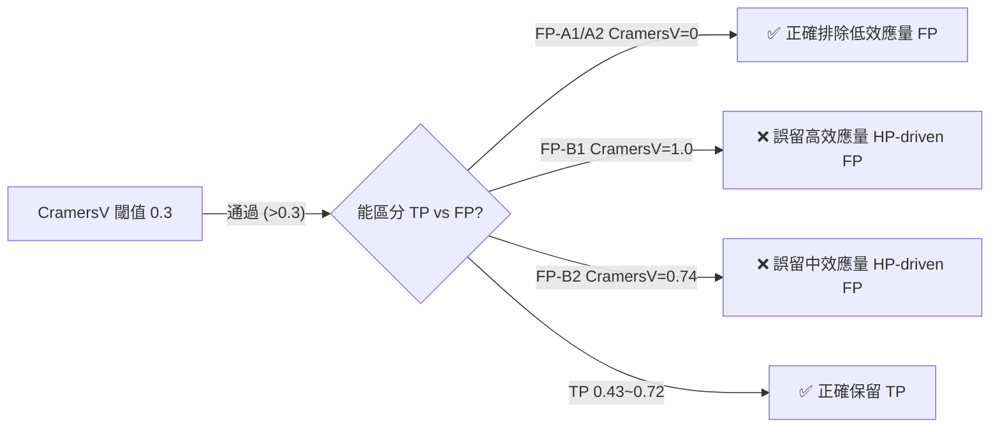
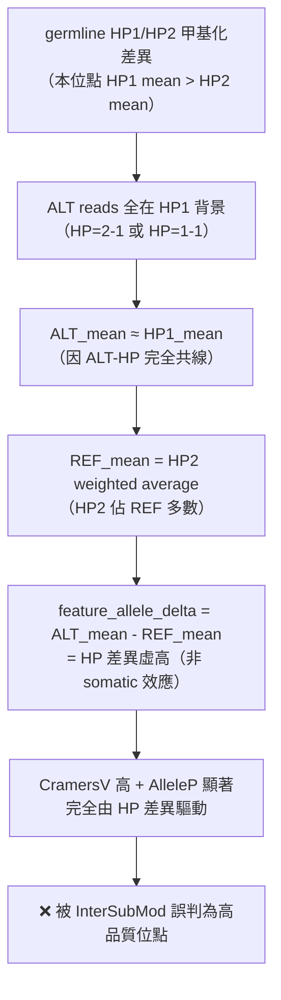
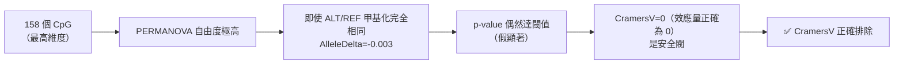
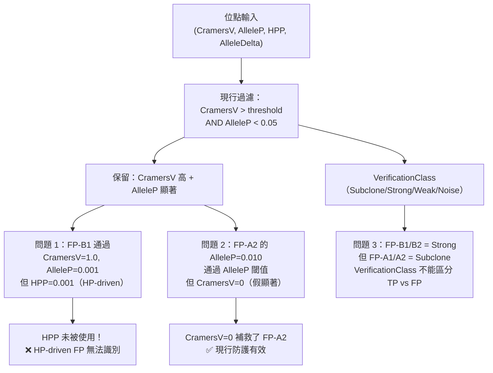
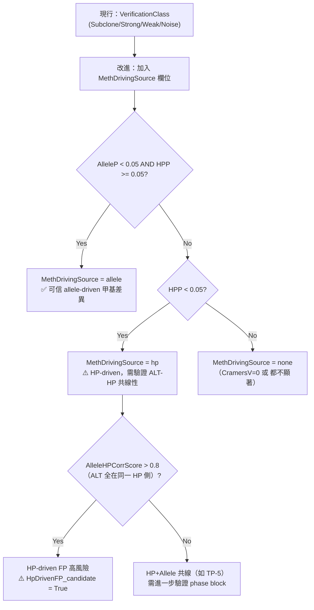

<!--
建立時間: 2026-03-17 00:00
目標: 基於 Phase 4 Case Study 9 個位點，系統評估 InterSubMod 現行甲基分類指標的 TP/FP 辨識效能，
      並提出具體改進方向
處理範圍: HCC1395 5kHz Paired，9 cases（5 TP Subclone + 4 FP 對照），驗證數據來自
          20260316_igv_case_validation_01.tsv
關聯檔案:
  - docs/reports/validated/2026/03/20260315_subclone_phase4_casestudy_01.md
  - docs/reports/validated/2026/03/assets/20260316_igv_case_validation_01.tsv
  - docs/references/manual/20260317_甲基位點觀察報告生成技能_01.md
  - docs/references/manual/20260317_case_obs_report_FP_B1_範例_01.md
-->

# 甲基分類方法有效性觀察與 InterSubMod 改進重點

**分析日期**：2026-03-17
**資料來源**：`s-pure/HCC1395/20260307`，Phase 4 Case Study（9 cases：5 TP + 4 FP）
**核心問題**：InterSubMod 現行的甲基分類指標（CramersV / HPP / AlleleP / AlleleDelta / VerificationClass）是否有效辨識 somatic subclone methylation？在哪裡失效？如何修正？

---

## 0. 研究溯源

| 項目 | 內容 |
|------|------|
| 樣本 | HCC1395 5kHz Paired，純 tumor cell line |
| Variant calling | ClairS paired（**無 PON**，以 Normal BAM 對照過濾 germline）|
| Phasing | LongPhase-S haplotagging（PS tag / phase block 分配）|
| InterSubMod | BERNOULLI metric，±2kb window，PERMANOVA 999 置換 |
| Benchmark | SEQC2 SNV-only truth set（不含 sINDEL 評估）|
| 驗證數據 | `20260316_igv_case_validation_01.tsv`（所有欄位均為 pipeline 實際輸出）|
| Phase Block 前提 | HP=1/HP=2 只在**同一 PS tag 範圍**內保證親緣一致；跨 block 的 HP 比較需另行查驗 |

---

## 1. 核心分類指標效能矩陣（9 cases 完整數據）

下表使用 `20260316_igv_case_validation_01.tsv` 的實際 pipeline 輸出值：

| Case | Label | CramersV | AlleleP | HPP | AlleleDelta | DominantLabel | VAF | NumCpGs | VerifClass | 判定結果 |
|------|-------|---------|--------|-----|------------|--------------|-----|--------|-----------|---------|
| TP-1 chr6:145444893 | 🟢TP | 0.7225 | **0.001** | 1.0 | +0.018 | `allele` | 35% | 39 | Subclone | ✅ 正確 |
| TP-2 chr4:70548355 | 🟢TP | 0.5016 | **0.011** | 1.0 | +0.012 | `allele` | 30% | 63 | Subclone | ✅ 正確 |
| TP-3 chr5:153209947 | 🟢TP | 0.4429 | **0.003** | 1.0 | +0.015 | `allele` | 33% | 48 | Subclone | ✅ 正確 |
| TP-4 chr16:35118902 | 🟢TP | 0.4424 | **0.001** | 1.0 | +0.023 | `allele` | 27% | 38 | Subclone | ✅ 正確 |
| TP-5 chr7:109185781 | 🟢TP | 0.4285 | **0.001** | **0.001** | −0.005 | **`hp`** | 23% | 62 | Subclone | ⚠️ 雙重顯著（HP+Allele）|
| FP-A1 chr8:93565727 | 🔴FP | **0.000** | 1.0 | 1.0 | 0.000 | `none` | 4.5% | 78 | Subclone | ✅ CramersV=0 識別 |
| FP-A2 chr9:137953060 | 🔴FP | **0.000** | 0.010 | 1.0 | −0.003 | `allele` | 10.7% | **158** | Subclone | ⚠️ AlleleP 假顯著 |
| FP-B1 chr7:52087777 | 🔴FP | **1.000** | **0.001** | **0.001** | **+0.058** | **`hp`** | 14.1% | 106 | Strong | ❌ CramersV 最高但仍 FP |
| FP-B2 chr9:75383880 | 🔴FP | 0.7364 | **0.001** | **0.001** | +0.005 | **`hp`** | 14.2% | 34 | Strong | ❌ AlleleDelta≈0 可識別 |

> 數據來源：`feature_allele_delta`, `feature_cramers_v`, `feature_label_allele_p`, `feature_label_hp_p`, `feature_dominant_label`
> `feature_allele_delta` 與 case study 中手算的 ALT_mean−REF_mean 可能有輕微差異（計算方式不同，見第 3 節）

---

## 2. 各指標效能分析

### 2.1 CramersV — 必要但不充分



**效能結論**：

| 情境 | CramersV 表現 |
|------|-------------|
| FP-A1/A2（CramersV=0）| ✅ 正確識別：無甲基分類結構 |
| FP-B1（CramersV=1.0）| ❌ 嚴重誤判：效應量最高但仍是 FP |
| TP（0.43–0.72）vs FP-B2（0.74）| ❌ 範圍重疊，無法依閾值區分 |
| **結論** | CramersV 排除低效應量 FP 有效；對 HP-driven FP **完全無效** |

### 2.2 HPP（HP PERMANOVA p-value）— 最強的 HP-driven FP 指標

| 指標 | TP-1~4 | TP-5 | FP-A1/A2 | FP-B1 | FP-B2 |
|------|--------|------|---------|------|------|
| HPP | **1.000** | **0.001** | 1.000 | **0.001** | **0.001** |
| 判定 | ✅ HP 不顯著 = allele-driven | ⚠️ HP+Allele 雙重 | ✅ HP 不顯著 | ❌ HP 顯著 → HP-driven FP | ❌ HP 顯著 → HP-driven FP |

**規則**：`HPP < 0.05` → 標記為 HP-driven 高風險，需進一步驗證

**例外**：TP-5（HPP=0.001）是真正「HP+Allele 雙重顯著」的 TP：
- AlleleP=0.001（Allele 也顯著）+ DominantLabel=`hp`
- 此位點的 HP 是真實的 somatic 共線性，不是 germline imprinting
- **區分方法**：查 ALT reads 是否跨越 HP1/HP2（TP-5 = ALT reads 全在 HP=2-1，但 HP 本身也顯著）

### 2.3 DominantLabel — 直接指出驅動來源

| DominantLabel | 對應案例 | 分類效能 |
|--------------|---------|---------|
| `allele` | TP-1~4, FP-A2 | 4/5 是 TP；FP-A2 是高維假顯著（CramersV=0 可補救）|
| `hp` | TP-5, FP-B1, FP-B2 | TP-5 是真實 HP+Allele；FP-B1/B2 是 HP-driven FP |
| `none` | FP-A1 | ✅ 直接識別（CramersV=0，無有效 label）|

**現行問題**：`DominantLabel=hp` 同時包含 TP-5（真實 somatic）和 FP-B1/B2（HP-driven FP），無法單獨作為排除規則。

### 2.4 AlleleDelta — Pipeline 計算值的 TP 範圍與預期不符

從 TSV 的 `feature_allele_delta` 欄位：

| Group | 範圍 |
|-------|------|
| **TP-1~5** | −0.005 ~ +0.023 |
| **FP-B1** | **+0.058**（**高於所有 TP**！）|
| **FP-B2** | +0.005 |

⚠️ **關鍵異常**：FP-B1 的 `feature_allele_delta=0.058` 是 9 個案例中最高值，超過所有 TP。

這表示：
1. Pipeline 計算的 `feature_allele_delta` **在高 CramersV 的 HP-driven FP 上會虛高**
2. 使用 `AlleleDelta > 0.05` 作為「TP 強化規則」可能會**誤增**類似 FP-B1 的 HP FP
3. 這與 CURRENT_FOCUS.md 中記錄的「低 VAF + 高 AlleleDelta + 低 CramersV → FP artifact」方向相反；高 AlleleDelta + 高 CramersV + HPP<0.05 反而是 HP-driven FP 的組合

> ⚠️ 值得深入調查：`feature_allele_delta` 的計算公式是否在 HP 高度失衡的情況下被 HP 差異污染（ALT reads 全在 HP1 側時，ALT mean ≈ HP1 mean，造成 delta 虛高）

---

## 3. 特殊觀察：四類系統性問題

### 3.1 HP-driven FP（FP-B1/B2 型）

**現象**：CramersV 高（0.74~1.0）、AlleleP 顯著（0.001）、但 HPP 同樣顯著（0.001）、DominantLabel=`hp`

**根本原因**：



**影響指標**：CramersV↑↑、AlleleP→ 假顯著、AlleleDelta 虛高、HPP→真顯著

**識別規則**（HPP 是唯一可靠指標）：
```
HPP < 0.05 AND DominantLabel = hp → HP-driven FP 高風險
```
FP-B1 補充：SEQC2 SNV-only benchmark annotation gap（緊鄰 sINDEL，variant 本身可能是 INDEL artifact）

---

### 3.2 高維假顯著（FP-A2 型）

**現象**：CramersV=0、AlleleP=0.010（顯著）、AlleleDelta=−0.003（≈0）、NumCpGs=158

**根本原因**：PERMANOVA 在高維空間（158 CpG）的 Type I error inflation



**現行防護**：CramersV = 0 正確識別此類 FP（`CramersV=0 AND AlleleDelta < 0.01` 即可排除）

**剩餘風險**：若未來有中等 CramersV（如 0.15）+ 高 CpG 數的位點，假顯著風險更難識別

---

### 3.3 feature_allele_delta 的真實計算公式（已驗證）

**原始碼確認**（`src/core/LabelTest.cpp`：`compute_delta()` + `compute_group_distances()`）：

```
feature_allele_delta = between_mean_distance(ALT, REF) − within_mean_distance(ALT+REF)
```

- **Group 0**：ALT reads（支持 variant）
- **Group 1**：REF reads（支持 reference）
- `between_mean`：ALT reads 與 REF reads 之間所有 pair 的平均距離
- `within_mean`：ALT 內部 + REF 內部所有 pair 的平均距離
- 距離矩陣：使用 BERNOULLI（或其他 metric）的 read-read 甲基化距離

**這是 PERMANOVA-style 距離空間的 clustering 分離指標，不是 `ALT_mean_meth − REF_mean_meth`。**

| Case | feature_allele_delta (TSV) | 案例分析 ALT_meth - REF_meth | 說明 |
|------|---------------------------|---------------------------|------|
| TP-4 chr16:35118902 | +0.023 | −0.198 | **兩個指標量不同面向，不矛盾** |
| TP-1 chr6:145444893 | +0.018 | +0.040 | 距離 delta 小於原始甲基差，正常 |
| FP-B1 chr7:52087777 | +0.058 | +0.058 | 距離 delta 最高，因 ALT-HP 完全共線 |
| FP-B2 chr9:75383880 | +0.005 | +0.005 | 兩者均接近 0 |

**TP-4 「符號相反」的正確解釋**：
- `feature_allele_delta = +0.023`（正值）：ALT reads 在距離空間中與 REF reads 分得開（between > within），這是真實的 allele-driven 甲基結構
- case study `ALT_meth − REF_meth = −0.198`：ALT reads 的平均甲基化 < REF reads（在這個位點 ALT = 低甲基）
- **兩者可以同時成立**：ALT reads 之間相似（within_ALT 低），REF reads 之間相似（within_REF 低），但 ALT vs REF 之間差異大（between 高）→ delta 正。這在 allele-driven 位點完全合理。

**FP-B1 feature_allele_delta 虛高的機制（已確認）**：
- ALT reads 全在 HP1 側 → ALT reads 甲基化同質（within_ALT 低）
- REF reads 跨 HP1/HP2 → REF reads 甲基化異質（within_REF 高）
- ALT（HP1 pattern）vs REF（HP1+HP2 混合）→ between 顯著高於 within
- **結果**：`feature_allele_delta` 虛高，但這是 HP imbalance 造成的假訊號，非 somatic allele 效應

⚠️ **W2 弱點已確認**：`feature_allele_delta` 在 ALT-HP 高度共線時被 HP 甲基差異污染，不能單獨作為 allele-driven 的判斷指標

---

### 3.4 Phase Block 對 HP 解釋的影響

**現象**：HP tag 是 phase block 內的局部分配，不保證跨 block 的親緣一致性

**影響案例**：
- TP-5（HP+Allele 雙重顯著）：ALT reads 全在 HP=2-1，但這只在局部 phase block 內有意義；跨 block 時 HP2 的親緣身份不確定
- FP-B1：HP1 vs HP2 均衡（HP1=26, HP2=38），但若跨越多個 phase block，則「HP1 甲基化」的親緣意義模糊

**InterSubMod 現行狀態**：未追蹤 PS（Phase Set）tag；無法標記 phase block 邊界位點

---

## 4. 現行 InterSubMod 分類邏輯的弱點



**三個核心弱點**：

| 弱點 | 影響 | 嚴重程度 |
|------|------|---------|
| **W1：HPP 未納入分類邏輯** | HP-driven FP（FP-B1/B2 型）無法被識別，CramersV 高反而誤導 | 🔴 高 |
| **W2：feature_allele_delta 在 HP 失衡時虛高** | 高 CramersV + HPP 顯著的 HP FP 反而有最高 AlleleDelta，誤導 threshold 設計 | 🔴 高 |
| **W3：Phase block 邊界位點未標記** | 跨 block 的 HP1/HP2 比較缺乏親緣可靠性，HP 解釋品質不一 | 🟡 中 |
| W4：高 CpG 數假顯著（FP-A2 型）| CramersV 已防護，但閾值設計若不考慮 CpG 數，中等 CramersV 仍有風險 | 🟡 中 |

---

## 5. InterSubMod 改進建議

### 5.1 短期：新增識別 HP-driven FP 的規則欄位

**建議新增欄位**：

| 新欄位 | 計算方法 | 用途 |
|--------|---------|------|
| `HP1MethMean` / `HP2MethMean` | HP1 / HP2 背景 reads 的平均甲基化 | 直接量化 germline HP 甲基差異 |
| `HPDrivenDelta` | HP1MethMean − HP2MethMean | 若 ≈ AlleleDelta，表示 AlleleDelta 完全由 HP 差異解釋 |
| `PhaseBlockSpan` | 位點附近的 phase block 範圍（PS tag 跨距）| 標記跨 block 位點 |
| `AlleleHPCorrScore` | ALT reads 是否全在同一 HP 側的量化分數 | ALT-HP 共線性程度（0=跨 HP，1=全在同一 HP）|

**關於 `feature_allele_delta` 的補充欄位建議**：
- 當前：PERMANOVA 距離 delta（between − within），能偵測 allele-driven clustering，但在 ALT-HP 共線時被 HP 污染
- 建議新增：`AlleleMethDelta = ALT_reads_mean_methylation − REF_reads_mean_methylation`（per-read level raw mean），作為獨立的直接甲基差異指標，兩個指標並列比較（distance delta vs raw mean delta）可鑑別 HP pollution

### 5.2 中期：改進 VerificationClass 邏輯

**現行 VerificationClass** 基於甲基結構（CramersV / k / cluster quality），但未區分驅動來源（HP vs Allele）。

**建議改進**：



### 5.3 長期：Phase Block-Aware HP 分析

**建議**：
1. 讀取 BAM 中的 `PS` tag，標記每個 read 所屬的 phase block ID
2. 計算位點的 phase block 一致性分數（phase block 內 HP 分配的可信度）
3. 跨 phase block 的 HP1/HP2 比較降權（或標記 `PhaseBlockWarning = True`）

---

## 6. 甲基分類有用性評估

### 整體結論

| 使用情境 | 甲基分類有效？ | 說明 |
|---------|-------------|------|
| **識別 allele-driven subclone methylation** | ✅ 有效 | TP-1~4 的 Allele PERMANOVA + CramersV 可靠辨識 |
| **排除低甲基信號 FP（CramersV=0）** | ✅ 有效 | FP-A1/A2 型完全被 CramersV=0 識別 |
| **識別 HP-driven FP（FP-B1/B2 型）** | ❌ 現行無效 | 需加入 HPP 過濾，或 DominantLabel=hp + AlleleHPCorrScore |
| **HP+Allele 雙重顯著 TP（TP-5 型）** | ⚠️ 部分有效 | AlleleP 顯著可保留，但 HP confounding 風險需評估 |
| **全基因組 FP triage（後段過濾）** | ✅ 有效 | AlleleDelta + CramersV + HPP 的組合規則可精準定位 HP-driven FP |

### 建議優先級

```
第一優先：加入 HPP 閾值（< 0.05 → 觸發 HP-driven 警示）
第二優先：新增 AlleleMethDelta 欄位（ALT_mean_meth − REF_mean_meth，raw 甲基差，與現有距離 delta 並列）
第三優先：新增 HP1MethMean / HP2MethMean 欄位，直接量化 HP 甲基差異
第四優先：Phase block span 追蹤
```

---

## 7. 知識點整理（K1–K8）

| # | 知識點 | 依據 |
|---|--------|------|
| **K1** | **HPP < 0.05 是 HP-driven FP 最可靠的單一指標**：TP-1~4 HPP=1.0；FP-B1/B2 HPP=0.001 | 5 TP + 2 HP FP 對比 |
| **K2** | **CramersV 高 ≠ allele-driven**：FP-B1 CramersV=1.0（最高），但 HPP=0.001；CramersV 是效應量，不是驅動來源標記 | FP-B1 |
| **K3** | **feature_allele_delta 是距離空間分離指標（非原始甲基差）**：= between_mean_distance(ALT,REF) − within_mean_distance；在 ALT-HP 完全共線時（FP-B1）被 HP 甲基差異污染虛高；與 raw ALT_meth−REF_meth 量的是不同面向 | 原始碼驗證 `LabelTest.cpp:compute_delta()` |
| **K4** | **DominantLabel=hp 並非排除規則**：TP-5 也是 DominantLabel=hp（真正 HP+Allele 雙重顯著）；鑑別需同時看 AlleleP | TP-5 vs FP-B1/B2 |
| **K5** | **高 CpG 數（>100）的 PERMANOVA 假顯著可用 CramersV=0 防護**：FP-A2 158 CpG，AlleleP=0.01，但 CramersV=0 正確救回 | FP-A2 |
| **K6** | **AlleleDelta 接近 0 的 HP-driven FP（FP-B2 型）容易識別**：AlleleDelta=0.005 → 無論 CramersV 多高都是 HP confounding | FP-B2 |
| **K7** | **HP tag 的親緣意義受 phase block 限制**：同一 PS tag 內可信；跨 block 的 HP1/HP2 比較需另行驗證 | Phase block 前提 |
| **K8** | **INDEL-adjacent SNV 的 FP 狀態是 benchmark annotation gap**：FP-B1 緊鄰 SEQC2 HighConf sINDEL；variant 本身可能是 alignment artifact 而非真正 FP | FP-B1 深度分析 |

---

## 8. 後續行動清單

| 優先 | 行動 | 類型 |
|------|------|------|
| ✅ | `feature_allele_delta` 計算公式已確認：`between_mean_dist(ALT,REF) − within_mean_dist`（PERMANOVA 距離 delta）；TP-4 無符號錯誤，與 raw 甲基差為不同指標 | 程式碼已查驗 `LabelTest.cpp` |
| 🔴 | 在 feature matrix 中新增 `HPDrivenFP_candidate` flag（HPP < 0.05 AND DominantLabel=hp AND AlleleHPCorrScore > 0.8）| 欄位設計 |
| 🟡 | 新增 `HP1MethMean` / `HP2MethMean` 欄位，直接輸出各 HP 群的平均甲基化 | 功能開發 |
| 🟡 | 對 FP-B2（chr9:75383880）補做完整觀察報告（仿 FP-B1 範例格式）| 分析文件 |
| 🟢 | 在更大批次（全體 29,740 TP + 627 FP）驗證「HPP < 0.05 AND DominantLabel=hp」規則的 precision/recall | 批次驗證 |
| 🟢 | 評估是否將 `PS` tag 追蹤納入 InterSubMod haplotagging 流程 | 工程規劃 |
