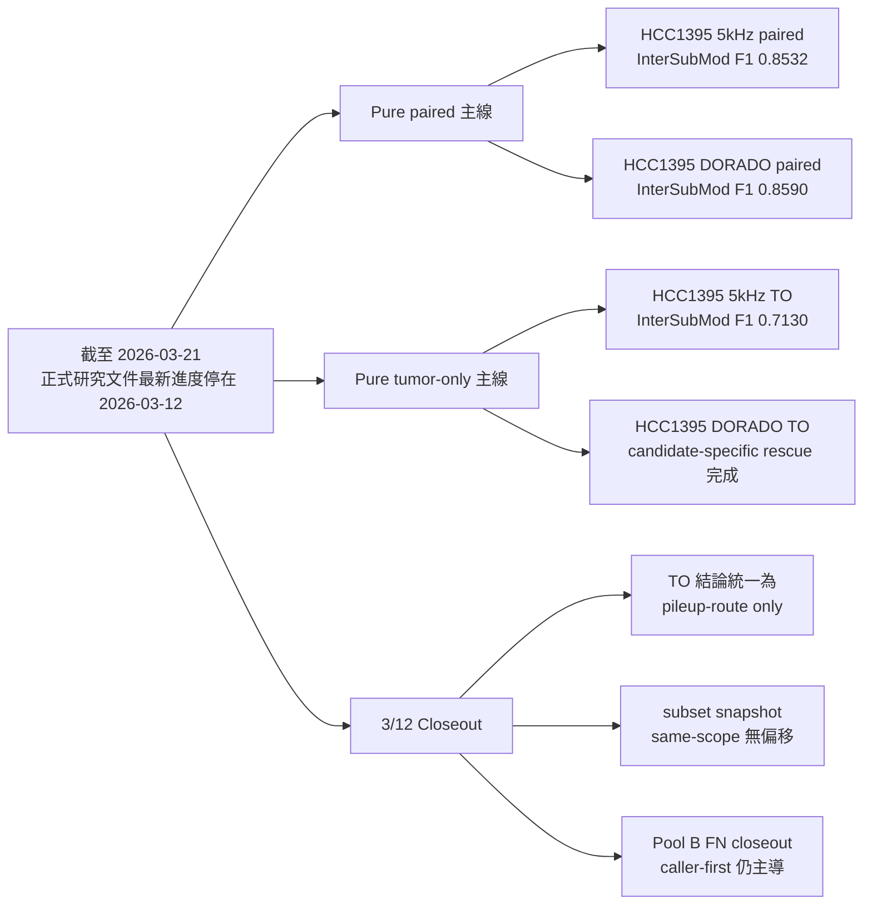

<!--
建立時間: 2026-03-21 00:00
目標: 將目前正式研究進度整理成一頁式摘要，快速交代已完成、未完成與下一輪建議
處理範圍:
  - 2026-03-05 至 2026-03-12 的 pure paired / tumor-only 主線
  - 2026-03-12 的 TO closeout、same-scope control 與 Pool B closeout
  - 截至 2026-03-21 的文件化研究進度快照
關聯檔案:
  - /big7_disk/liaoyoyo2001/InterSubMod/docs/CURRENT_FOCUS.md
  - /big7_disk/liaoyoyo2001/InterSubMod/docs/experiments/INDEX.md
  - /big7_disk/liaoyoyo2001/InterSubMod/docs/reports/validated/2026/03/20260311_研究主線週報_20260305_20260311_phase2_annotation整合_01.md
  - /big7_disk/liaoyoyo2001/InterSubMod/docs/reports/validated/2026/03/20260312_TO雙模型可得性closeout_01.md
  - /big7_disk/liaoyoyo2001/InterSubMod/docs/reports/validated/2026/03/20260312_TO_snapshot_scope_same_scope_control_01.md
  - /big7_disk/liaoyoyo2001/InterSubMod/docs/reports/validated/2026/03/20260312_PoolB_FN_integration_closeout_01.md
-->

# 目前研究進度一頁式摘要（截至 2026-03-21）

> 本摘要以目前 repo 內正式研究文件為準。  
> 截至 `2026-03-21`，尚未看到 `2026-03-13` 至 `2026-03-21` 的新研究類文件；因此目前正式可追蹤的最新研究進度，停在 `2026-03-12` 的 closeout 狀態。

## 重點結論

1. 研究主線已正式收斂為三層：`caller-first` → `methylation-support` → `annotation / QC / artifact triage`。
2. `HCC1395 5kHz` 仍是最有訊號的主實驗樣本；不論 `paired` 或 `tumor-only`，InterSubMod 都有小幅正增益。
3. `HCC1395_DORADO` 主要作跨平台驗證；目前多數規則在 `DORADO` 只持平或轉弱，尚不具全域可攜性。
4. `2026-03-12` 三條 closing workstream 已完成，代表目前主要缺口已從「流程能不能跑通」轉成「annotation 怎麼制度化落地」。

## 已完成

| 工作流 | 狀態 | 核心結果 | 主要證據 |
| --- | --- | --- | --- |
| pure paired 正式 rerun | 已完成 | `5kHz paired`：`LongPhase-S 0.8522 -> InterSubMod 0.8532`；`DORADO paired`：`0.8592 -> 0.8590` | [主線週報](/big7_disk/liaoyoyo2001/InterSubMod/docs/reports/validated/2026/03/20260311_研究主線週報_20260305_20260311_phase2_annotation整合_01.md) |
| `HCC1395 5kHz TO` pilot | 已完成 | `ClairS-TO -> LongPhase-TO -> InterSubMod` 全流程已打通；`F1 0.7127 -> 0.7130` | [5kHz TO pilot](/big7_disk/liaoyoyo2001/InterSubMod/docs/experiments/in_progress/2026/03/20260307_HCC1395_5kHz_TO_pilot啟動與執行紀錄_01.md) |
| `HCC1395 DORADO TO` candidate-specific rescue | 已完成 | caller-first 成立；甲基 support 為正，但固定 caller gate 後仍未超過最佳 caller-only | [DORADO TO rescue](/big7_disk/liaoyoyo2001/InterSubMod/docs/experiments/in_progress/2026/03/20260311_HCC1395_DORADO_TO_candidate_specific甲基rescue驗證_01.md) |
| TO dual-model / source 可得性盤點 | 已完成 | 目前 TO 不應描述為 `pileup vs full model`；正式口徑應為 `pileup-route only` | [TO 雙模型 closeout](/big7_disk/liaoyoyo2001/InterSubMod/docs/reports/validated/2026/03/20260312_TO雙模型可得性closeout_01.md) |
| TO snapshot same-scope control | 已完成 | `18/18` region 完全一致；`subset snapshot` 可安全用於同 dataset 內 ranking / diagnostics | [same-scope control](/big7_disk/liaoyoyo2001/InterSubMod/docs/reports/validated/2026/03/20260312_TO_snapshot_scope_same_scope_control_01.md) |
| Pool B FN integration closeout | 已完成 | caller-side rescue 仍強於甲基 combined；Pool B 已不再是主 blocker | [Pool B closeout](/big7_disk/liaoyoyo2001/InterSubMod/docs/reports/validated/2026/03/20260312_PoolB_FN_integration_closeout_01.md) |

## 核心數據

### 1. 目前已成形的 benchmark 結果

| 場景 | 口徑 | truth_total | TP | FP | FN | precision | recall | F1 | 解讀 |
| --- | --- | ---: | ---: | ---: | ---: | ---: | ---: | ---: | --- |
| `HCC1395 5kHz paired` | `InterSubMod final` | `39447` | `29752` | `544` | `9695` | `0.9820` | `0.7542` | `0.8532` | 相對 `LongPhase-S` 再增 `+0.0010`，主要靠刪 FP |
| `HCC1395 DORADO paired` | `InterSubMod final` | `39447` | `29877` | `238` | `9570` | `0.9921` | `0.7574` | `0.8590` | 相對 `LongPhase-S` `-0.0002`，跨平台不穩定 |
| `HCC1395 5kHz TO` | `InterSubMod final` | `39447` | `28393` | `11807` | `11054` | `0.7063` | `0.7198` | `0.7130` | 相對 `LongPhase-TO` `+0.0003`，流程已正式跑通 |
| `HCC1395 DORADO TO` | `ClairS-TO baseline` | `39447` | `28861` | `11576` | `10586` | `0.7137` | `0.7316` | `0.7226` | 本場景的正式結論目前以 candidate-specific rescue 為主 |

### 2. 已完成的 rescue / support 關鍵結果

| 場景 | 最佳 caller-first | 最佳 methylation-support / combined | 判讀 |
| --- | --- | --- | --- |
| `HCC1395 5kHz TO` | `gq>=10`：`499 TP / 119 FP`，`F1 +0.006943` | `PairwiseMedianDist>=0.20`：`300 TP / 68 FP`，`F1 +0.004219`；`agreement_positive`：`148 TP / 25 FP`，`F1 +0.002163` | 甲基有值，但尚未超過最佳 caller-only |
| `HCC1395 DORADO TO` | `gq>=10`：`40 TP / 11 FP`，`F1 +0.000540` | `Quality_Score>=60`：`208 TP / 77 FP`，`F1 +0.002620`；`PairwiseMedianDist<=0.20`：`173 TP / 60 FP`，`F1 +0.002217` | 方向與 `5kHz TO` 相反，顯示明顯 dataset-dependence |
| `Pool B FN` | `no_varcluster`：`428 TP / 390 FP`，`F1 +0.003391` | `gq15_and_allele_delta_low`：`431 TP / 473 FP`，`F1 +0.002702` | caller-side rescue 仍強於 combined；甲基不適合主導 Pool B rescue |

## 未完成

| 項目 | 目前狀態 | 為何還不能直接下全域結論 |
| --- | --- | --- |
| annotation export / ranking / dashboard 接線 | 特徵定位已收斂，但尚未完全接回整合矩陣、round summary 與 dashboard | 現在知道哪些特徵該降階為 annotation，但還沒制度化成日常輸出 |
| paired candidate-specific coverage ceiling | `paired` 的甲基覆蓋天花板仍偏低 | 目前 `paired` 的「甲基不超過 caller」結論仍需保守解讀 |
| TO full-model 比較 | 尚未確認可直接 benchmark 的 TO full-model 產物 | 現階段 TO 場景只能正式寫成 `pileup-route only` |
| mixed purity / subsample 主線 | 仍停留在初步觀察與假說 | 目前主證據仍是 pure paired / pure TO，mixed 不應搶主敘事 |
| 特徵全域化 | `PairwiseMedianDist`、`AlleleDelta` 等方向仍受 dataset 與母體影響 | 不能把 kept-set artifact triage 與 Pool B rescue 混成同一條規則 |

## 下一輪建議

| 優先級 | 建議動作 | 目的 |
| --- | --- | --- |
| `P0` | 先把 `Quality_Score`、`PairwiseMedianDist`、`hp_assign_rate` 等 annotation 欄位正式接到整合矩陣、round summary 與 dashboard | 把已驗證但不宜 hard filter 的訊號變成可重用輸出 |
| `P1` | 延續 pure sample 主線，優先做同框架的 cross-sample / cross-platform validation | 確認哪些規則只在 `5kHz` 成立，哪些能跨到其他 pure 樣本 |
| `P1` | 若要再做 TP rescue，維持 `caller-first` 為第一層，甲基只作第二層 support | 避免再次把 support / artifact 訊號誤升級為主規則 |
| `P2` | mixed purity / subsample 放在 pure sample 主線穩定後再回來 | 降低組織差異與 purity 混雜造成的誤判風險 |

### 暫不建議

1. 不要把 `PairwiseMedianDist` 升級成所有 dataset 共用的 hard rule。
2. 不要把 Pool B 的 `AlleleDelta` 方向與 TO kept-set 的 artifact triage 方向混成單一全域規則。
3. 不要把目前 TO 研究描述成 `pileup vs full model`；正確口徑應是 `pileup-route only`。

## 參考文件索引

1. [CURRENT_FOCUS](/big7_disk/liaoyoyo2001/InterSubMod/docs/CURRENT_FOCUS.md)
2. [experiments/INDEX](/big7_disk/liaoyoyo2001/InterSubMod/docs/experiments/INDEX.md)
3. [20260311_研究主線週報_20260305_20260311_phase2_annotation整合_01.md](/big7_disk/liaoyoyo2001/InterSubMod/docs/reports/validated/2026/03/20260311_研究主線週報_20260305_20260311_phase2_annotation整合_01.md)
4. [20260307_HCC1395_5kHz_TO_pilot啟動與執行紀錄_01.md](/big7_disk/liaoyoyo2001/InterSubMod/docs/experiments/in_progress/2026/03/20260307_HCC1395_5kHz_TO_pilot啟動與執行紀錄_01.md)
5. [20260311_HCC1395_DORADO_TO_candidate_specific甲基rescue驗證_01.md](/big7_disk/liaoyoyo2001/InterSubMod/docs/experiments/in_progress/2026/03/20260311_HCC1395_DORADO_TO_candidate_specific甲基rescue驗證_01.md)
6. [20260312_TO雙模型可得性closeout_01.md](/big7_disk/liaoyoyo2001/InterSubMod/docs/reports/validated/2026/03/20260312_TO雙模型可得性closeout_01.md)
7. [20260312_TO_snapshot_scope_same_scope_control_01.md](/big7_disk/liaoyoyo2001/InterSubMod/docs/reports/validated/2026/03/20260312_TO_snapshot_scope_same_scope_control_01.md)
8. [20260312_PoolB_FN_integration_closeout_01.md](/big7_disk/liaoyoyo2001/InterSubMod/docs/reports/validated/2026/03/20260312_PoolB_FN_integration_closeout_01.md)
