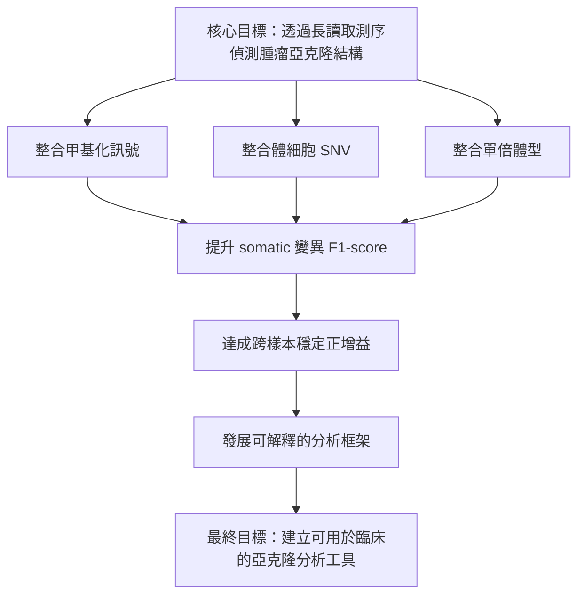
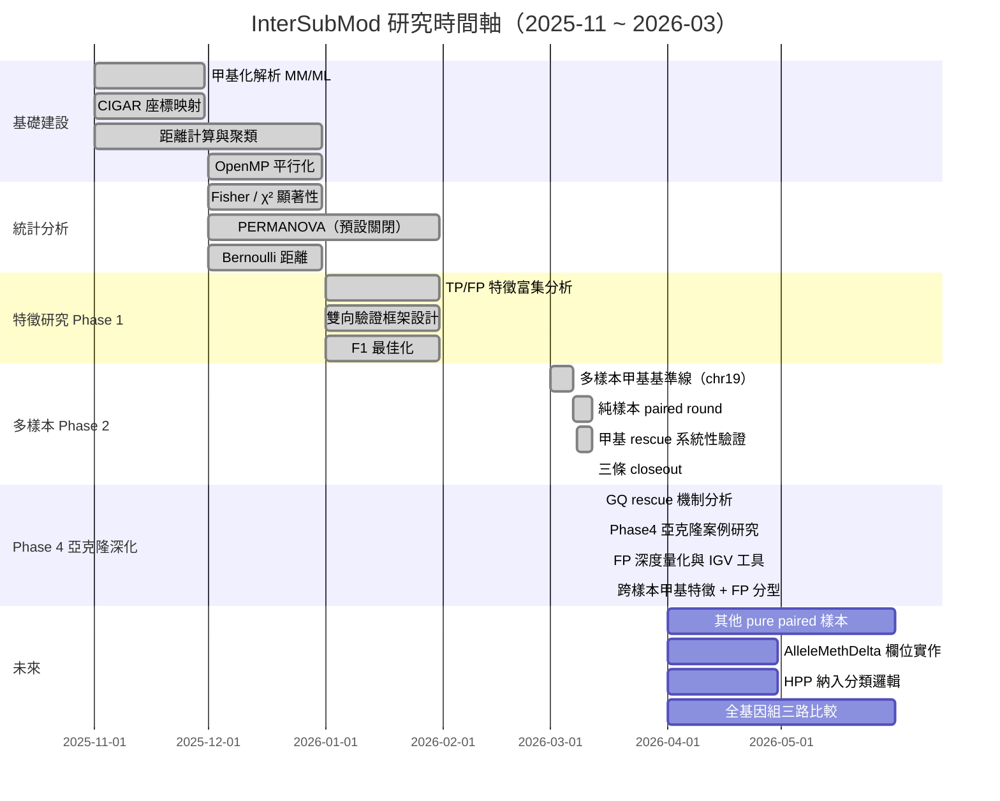
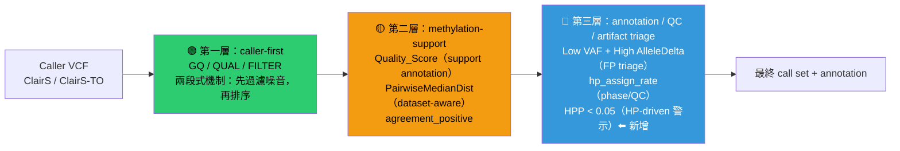
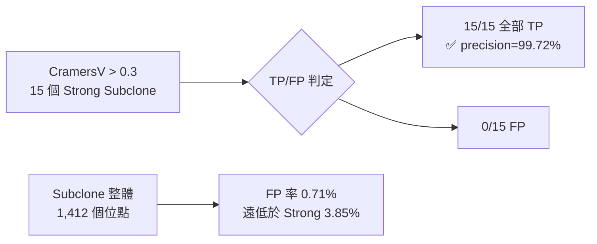
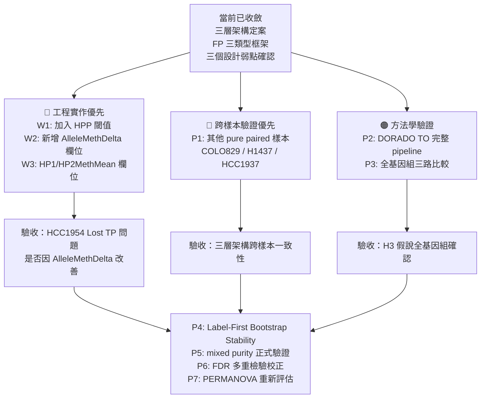
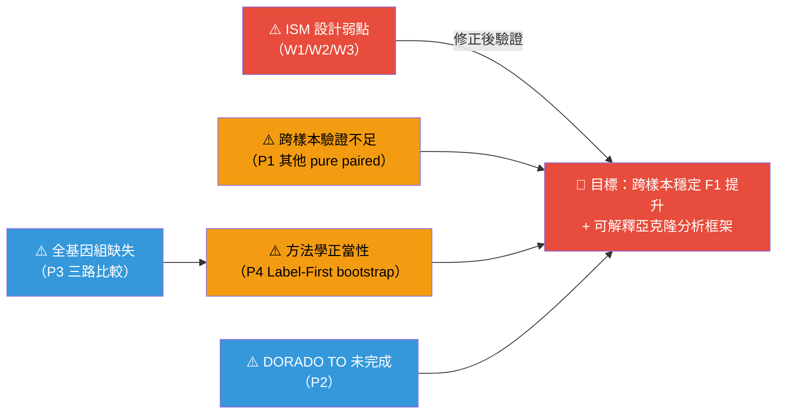
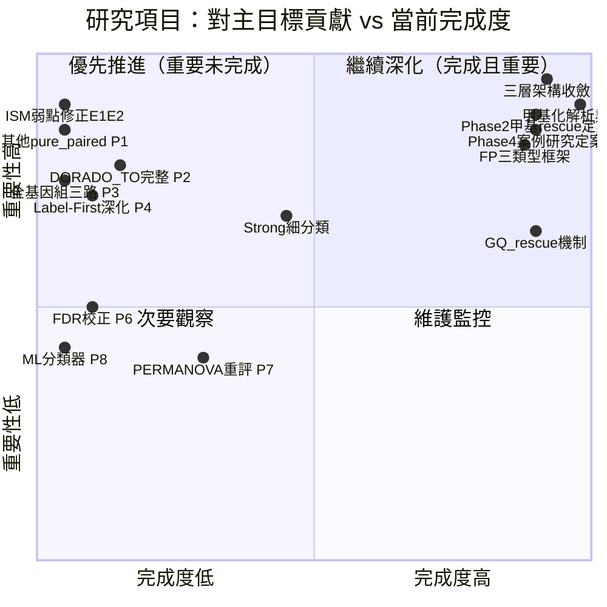
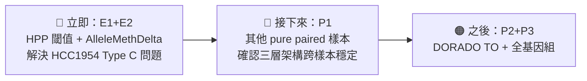

<!--
建立時間: 2026-03-21
目標: 整合所有研究方向的進度、結論與缺口，作為研究路線圖導覽
處理範圍: InterSubMod 專案 2025-11 至 2026-03-17 全部研究方向
關聯檔案:
  - docs/CURRENT_FOCUS.md
  - docs/experiments/INDEX.md
  - docs/reports/validated/2026/03/20260317_研究主線週報_20260312_20260317_phase4_FP分型_01.md
  - docs/reports/validated/2026/03/20260311_研究主線週報_20260305_20260311_phase2_annotation整合_01.md
  - docs/plans/2026/03/20260307_純樣本甲基研究執行計畫_01.md
-->

# InterSubMod 研究進度全貌總覽

> **最後更新**：2026-03-21
> **資料來源**：CURRENT_FOCUS.md（更新至 2026-03-08）、experiments/INDEX.md、validated 報告群（最新至 2026-03-17）

---

## 一、主要目標

**主要衡量指標**：F1-score
- Paired 基線：0.84~0.86（HCC1395 5kHz/DORADO）
- Tumor-only 基線：0.71~0.72

---

## 二、研究進度全貌（時間軸）

---

## 三、研究項目分類與狀態

### 3.1 基礎建設層（全部完成）✅

| # | 研究項目 | 狀態 | 關鍵結論 |
|---|---|---|---|
| 01 | 甲基化解析（MM/ML 標籤） | ✅ | ONT BAM MM/ML 解碼，含正反股 CIGAR 校正 |
| 02 | CIGAR 座標映射 | ✅ | 反向股從 SEQ 末端往回迭代，`ref[offset-1]='C'` 驗證 |
| 03 | 距離計算與聚類 | ✅ | NHD/L1/L2/CORR/BERNOULLI/JACCARD，UPGMA 聚類 |
| 04 | OpenMP 平行化 | ✅ | Per-region 平行，單 Region < 300ms |

### 3.2 統計分析層

| # | 研究項目 | 狀態 | 關鍵結論 | 下一步 |
|---|---|---|---|---|
| 05 | Fisher / χ² 顯著性 | ✅ | Fisher-Freeman-Halton RxC + Monte Carlo；主流程核心統計 | FDR 多重檢驗校正待加入 |
| 06 | PERMANOVA | ✅ 實作，預設關閉 | pseudo-F 已實作；效能考量暫關閉 | 在 Label-First 框架下重評估 |
| 07 | Bernoulli 距離度量 | ✅ | `w(p)=2×|p-0.5|`，信心加權；比 NHD 更適合 ONT 中間值 | purity 系列比較 |

### 3.3 特徵研究層（2026-01 Phase 1 里程碑）✅

| # | 研究項目 | 狀態 | F1 結果 | 關鍵結論 |
|---|---|---|---|---|
| 08 | TP/FP 特徵富集分析 | ✅ | — | LOH_like OR=7.33（TP）；LowAF OR=0.05（FP） |
| 09 | 雙向驗證框架設計 | ✅ 框架完成 | — | Label-First + Cluster-First；四類輸出 Strong/Subclone/Weak/Noise |
| 10 | F1 最佳化 | ✅ | **0.8481**（基線 0.8155） | `AF≥0.3 OR VC=Subclone` 最優策略 |

### 3.4 純樣本主線（2026-03 Phase 2）✅

| # | 研究項目 | 狀態 | 主要 F1 數字 | 核心結論 |
|---|---|---|---|---|
| 16 | Paired pure round 自動化 | ✅ | 5kHz: **0.8532**；DORADO: **0.8590** | 方法有效；5kHz 較 DORADO 更 noisy |
| 17 | 低 VAF + 高 AlleleDelta 跨樣本 | ⏳ 進行中 | 5kHz delta=+0.000990；DORADO 無效 | 5kHz 特化候選，不跨平台 |
| 18 | Strong 細分類 | ⏳ 進行中 | 5kHz FP-68/TP-1；DORADO 無效 | 先做 annotation，不改核心規則 |
| 21 | HCC1395 5kHz TO pilot | ✅ | **0.7130**（+0.0003） | 第一個 TO 驗證點；LongPhase-TO 不改 call set |
| 24~29 | 甲基 rescue 系統性驗證（四資料集）| ✅ | 見下表 | **三層架構定案** |
| 30~32 | Phase 2 + annotation layer | ✅ | — | Quality_Score → support；hp_assign → QC |
| 33 | TO dual-model closeout | ✅ | — | pileup-only confirmed |
| 34 | snapshot same-scope control | ✅ | 18/18 identical | subset 技術安全 |
| 35 | Pool B FN integration closeout | ✅ | — | caller-first 再次確認 |

**F1 彙整表（Phase 2 結果）**

| 樣本 | 模式 | ClairS | LongPhase | InterSubMod | ISM 總增益 |
|---|---|---|---|---|---|
| HCC1395 5kHz | Paired | 0.8443 | 0.8522 | **0.8532** | +0.0089 |
| HCC1395 DORADO | Paired | 0.8565 | 0.8592 | **0.8590** | +0.0025 |
| HCC1395 5kHz | TO | 0.7127 | 0.7127 | **0.7130** | +0.0003 |
| HCC1395 DORADO | TO baseline | 0.7226 | — | — | — |

### 3.5 Phase 4 亞克隆深化（2026-03-14 ~ 2026-03-17）🆕

| # | 日期 | 研究項目 | 狀態 | 核心結論 |
|---|---|---|---|---|
| 36 | 2026-03-14 | GQ rescue 兩段式機制分析 | ✅ | GQ 兩段式：caller 先過濾大量噪音，GQ 在小母體內排序；paired 中 GQ 本身有辨識力，TO 中是小母體排序 |
| 37 | 2026-03-14 | 75x 樣本放寬 GQ 可行性分析 | ✅ | 75x 深度樣本的 GQ gate 與放寬策略 |
| 38 | 2026-03-15 | Phase 4 亞克隆案例研究（5 TP + 4 FP） | ✅ | CramersV>0.3 → Subclone precision=**99.72%**；建立 HP-driven vs Allele-driven 鑑別框架（K2）；TP 亞克隆五類型分類（K4） |
| 39 | 2026-03-15 | 甲基特異位點亞克隆整合分析 pilot | ✅ | 亞克隆地圖 pilot；1,412 個 Subclone 位點全基因組分布 |
| 40 | 2026-03-16 | FP 深度量化（Type A/B 系統性 FP） | ✅ | Type A（INDEL 鄰近）：3/4842=0.06%；Type B（local alignment anomaly）：5/4842=0.10%；**合計 0.17%，F1 影響 < 0.001** |
| 41 | 2026-03-16 | IGV 批次截圖工具建立 | ✅ | `igv_batch_screenshot.sh`；FP-B2 機制更正為 deletion-like gap（非乾淨 MNP） |
| 42 | 2026-03-17 | 甲基分類方法有效性觀察（9 案例效能矩陣） | ✅ | 三個核心弱點（W1: HPP 未納入、W2: AlleleDelta 在 HP 失衡時虛高、W3: phase block 邊界未標記） |
| 43 | 2026-03-17 | 跨樣本甲基特徵 TP/FP 分離觀察（7 樣本） | ✅ | Quality_Score < 75 在 H2009 precision=**0.002**（舊結論更正）；HCC1954 Lost TP AlleleDelta 17.7x |
| 44 | 2026-03-17 | FP 三類型分型框架建立 | ✅ | **跨樣本通用 FP 過濾規則不存在**；三類型框架見下表 |

---

## 四、最新核心結論彙整（截至 2026-03-17）

### 4.1 三層架構（Phase 2 定案，Phase 4 驗證）

### 4.2 FP 三類型框架（Phase 4 新建立）

| Type | 代表樣本 | 特徵指紋 | 機制 | 有效篩選規則 |
|---|---|---|---|---|
| **A：Germline 漏報型** | HCC1937、H2009 | VAF≈1.0 + AlleleDelta≈0 + VC=Noise | 高 VAF 純合 germline，LongPhase 殘留 | VAF>0.9（HCC1937 precision=0.111） |
| **B：平台特異高 AD 型** | HCC1395 5kHz | Low VAF + AlleleDelta=0.088（13x DORADO）| 5kHz methylation basecall 高雜訊 | AlleleDelta>0.05（5kHz only） |
| **C：特徵重疊型** | HCC1954 | FP≈TP 所有特徵，無單特徵規則 | ISM 盲區（AlleleP+HPP 糾纏）| 只用 R0（SuggestFilter），接受 25:1 TP:FP 刪除比 |

**結論**：跨樣本通用 FP 過濾規則**目前不存在**。ISM 在 LongPhase 殘餘 FP < 600 時整體 F1 效益為負，不建議啟用 SuggestFilter。

### 4.3 InterSubMod 三個核心設計弱點（Phase 4 發現）

| 弱點 | 影響案例 | 嚴重程度 | 改進方向 |
|---|---|---|---|
| **W1：HPP 未納入分類邏輯** | FP-B1/B2 無法被識別 | 🔴 高 | 加入 HPP 閾值（<0.05 → 觸發 HP-driven 警示） |
| **W2：AlleleDelta 在 HP 失衡時虛高** | FP-B1 AlleleDelta=0.058 誤導（所有案例最高值） | 🔴 高 | 新增 `AlleleMethDelta` 欄位（ALT_mean_meth − REF_mean_meth，raw 甲基差） |
| **W3：Phase block 邊界位點未標記** | 跨 block HP 比較可靠性不足 | 🟡 中 | 新增 `HP1MethMean` / `HP2MethMean` 欄位 |

### 4.4 Subclone 分類效能（Phase 4 確認）

**CramersV > 0.3 可升格為強正向 annotation tier（precision=99.72%）**

---

## 五、進行中項目（2026-03-21 現況）

| # | 研究項目 | 最新進展 | 即將下一步 |
|---|---|---|---|
| 17 | 低 VAF + 高 AlleleDelta 跨樣本 | 5kHz 特化，不跨平台；定位為 ArtifactSuspect annotation | 確認是否需要升為正式規則 |
| 18 | Strong 細分類 | annotation 方向確認；HP-driven vs Allele-driven 框架建立 | 新增 HPP 閾值觸發邏輯（W1 修正） |
| 19 | LongPhase GQ rescue 深化 | GQ 兩段式機制已解析；甲基未超越 GQ | 補 `AlleleMethDelta` 欄位後重評 |
| W1+W2 | InterSubMod 核心弱點修正 | 框架已定義（HPP 警示 + AlleleMethDelta） | **實作這兩個改進為優先事項** |

---

## 六、未來規劃路線圖

### 未來規劃詳細優先序

| 優先級 | 項目 | 類型 | 說明 | 前置條件 |
|---|---|---|---|---|
| 🔴 E1 | HPP 閾值納入分類邏輯 | 工程 | 加入 HPP < 0.05 → HP-driven 警示 | 無 |
| 🔴 E2 | `AlleleMethDelta` 欄位 | 工程 | ALT_mean_meth − REF_mean_meth（raw 甲基差） | 無 |
| 🔴 P1 | 其他 pure paired 樣本 | 研究 | COLO829、H1437、HCC1937 | pipeline 已就緒 |
| 🟠 P2 | DORADO TO 完整驗證 | 研究 | LongPhase-TO + ISM full pipeline | 5kHz TO tagged BAM 移至 Archive |
| 🟠 E3 | `HP1MethMean` / `HP2MethMean` 欄位 | 工程 | 直接量化 HP 甲基差異 | E2 完成 |
| 🟠 P3 | 全基因組三路比較 | 研究 | Tumor/Normal/Mixed DORADO 全染色體 | 計算資源規劃 |
| 🟡 P4 | Label-First 深化驗證 | 研究 | Bootstrap stability check | P1/P2 完成 |
| 🟡 P5 | mixed purity/subsample 正式驗證 | 研究 | purity-aware 正式流程 | P3 完成 |
| 🟡 P6 | FDR 多重檢驗校正 | 工程 | Benjamini-Hochberg，30K+ region | 待實作 |
| 🟢 P7 | PERMANOVA 重新評估 | 研究 | Label-First 框架下 | P4 完成 |
| 🟢 P8 | ML 分類器整合 | 研究 | 整合多特徵 | P1/P2 + 足夠訓練數據 |

---

## 七、缺口分析

### 7.1 已解決的疑慮（2026-03-12 closeout）

| 疑慮 | 解決方式 | 結論 |
|---|---|---|
| TO full model vs pileup 是否可比？ | TO dual-model closeout | pileup-only，無需再比 |
| subset snapshot 技術偏移？ | same-scope control 18/18 identical | subset 技術安全 |
| Pool B FN 甲基能否救援？ | Pool B integration closeout | 甲基不適合單獨作主 rescue 規則 |
| 甲基 rescue 能否超越 caller？ | 四資料集系統性驗證 | 目前僅為 support，未超越 |
| Quality_Score < 75 能否 triage H2009 FP？ | Phase 4 跨樣本分析 | **precision=0.002，不可用（C1 結論更正）** |

### 7.2 現存缺口（優先序）

| 缺口 | 具體描述 | 重要性 | 修正方向 |
|---|---|---|---|
| **ISM 設計盲區** | HPP 未納入分類；AlleleDelta 在 HP 失衡時虛高；HCC1954 Type C FP 無法識別 | 🔴 高 | E1/E2 工程改進 |
| **跨樣本驗證不足** | 主結論主要基於 HCC1395；其他 pure paired 樣本未驗證 | 🔴 高 | P1 |
| **全基因組缺失** | 多樣本分析主要在 chr19；全基因組結果未完成 | 🟠 中高 | P3 |
| **TO 甲基訊號穩定性** | DORADO TO 與 5kHz TO 甲基 support 方向不一致 | 🟠 中高 | P2 |
| **label-first 方法學正當性** | 適用邊界未完整定義；Bootstrap 未實作 | 🟠 中 | P4 |
| **FDR 校正缺失** | 30K+ region 獨立測試，存在 false discovery 風險 | 🟡 中 | P6 |

### 7.3 關鍵路徑：什麼阻礙主要目標？

---

## 八、阻塞與風險

| 風險 | 類型 | 目前狀態 | 處理方式 |
|---|---|---|---|
| ISM SuggestFilter 在 HCC1954 造成 25:1 TP:FP 誤刪 | 設計瓶頸 | 已確認，E1/E2 排入優先 | W1/W2 工程修正 |
| purity-aware 結果受組織差異混淆 | 方法學 | 暫不作主證據，待 P3 | — |
| PairwiseMedianDist 具 dataset dependence | 分析 | 已降階為 dataset-aware annotation | — |
| TO 目前只有 pileup-route | 資料缺口 | 已 closeout，不繼續深追 | — |
| 跨樣本通用 FP 規則不存在 | 研究限制 | Phase 4 確認定案 | 改採 sample-aware 策略 |
| H2009 Quality_Score 規則 C1 結論被推翻 | 方法學 | 2026-03-17 更正完成 | 改用 VAF>0.9 替代 |
| 5kHz TO tagged BAM 260G 需清理 | 磁碟 | 待下個 TO 任務前處理 | 移至 Archive_pending_delete |

---

## 九、研究歷程重要性排序（全景矩陣）

---

## 十、結語：當前研究定位

### 已收斂的核心結論（截至 2026-03-17）

1. **三層架構定案**：caller-first → methylation-support → annotation/QC/artifact triage
2. **Subclone 精度高**：CramersV>0.3 precision=99.72%，可作強正向 annotation
3. **FP 三類型框架**：各樣本 FP 類型各異，跨樣本通用規則不存在
4. **ISM 三個設計弱點確認**：HPP 未納入、AlleleDelta 虛高、phase block 未標記
5. **GQ 兩段式機制理解**：caller 先大幅過濾，GQ 在小候選母體排序
6. **H2009/HCC1954 FP 機制各異**：H2009 是 germline 漏報（VAF≈1.0），HCC1954 是 ISM 無法區分 HP 與 Allele 的 Type C

### 最高優先的下一步

---

*文件位置*：`docs/reports/validated/2026/03/20260321_研究進度全貌總覽_01.md`
*參考最新週報*：[`20260317_研究主線週報_20260312_20260317_phase4_FP分型_01.md`](20260317_研究主線週報_20260312_20260317_phase4_FP分型_01.md)
